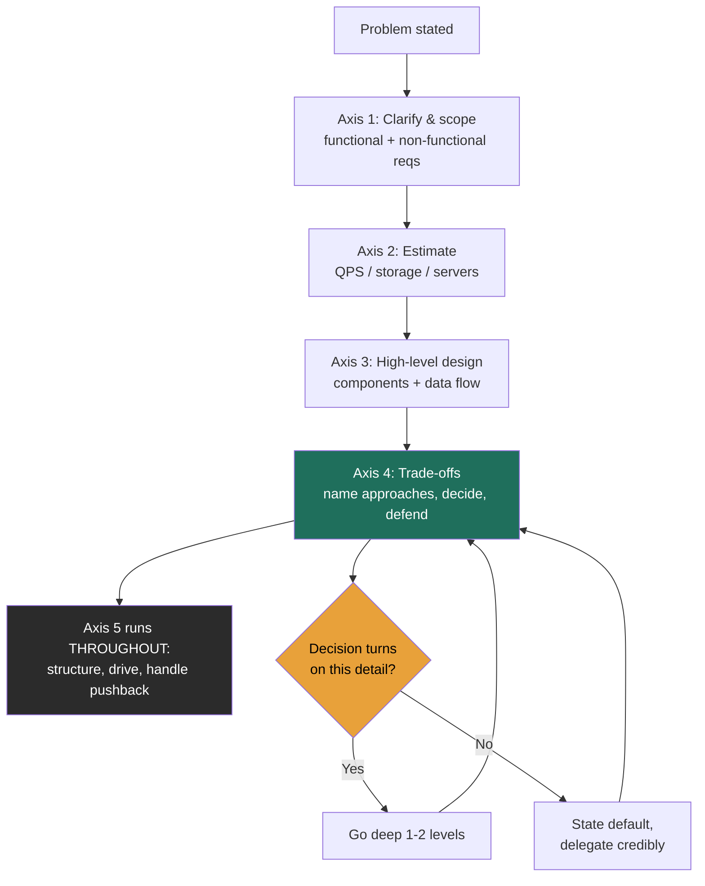
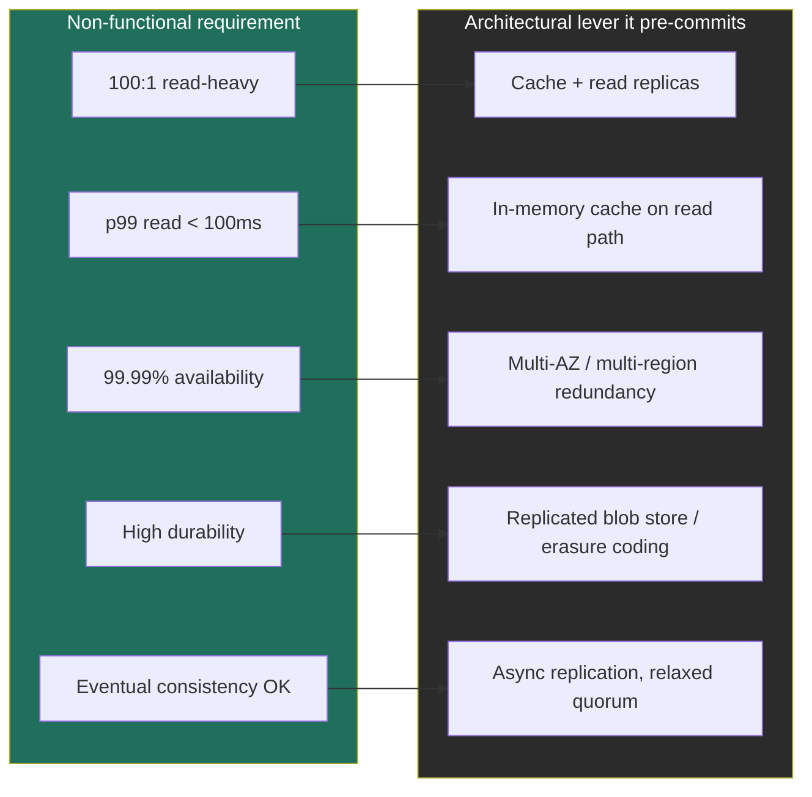
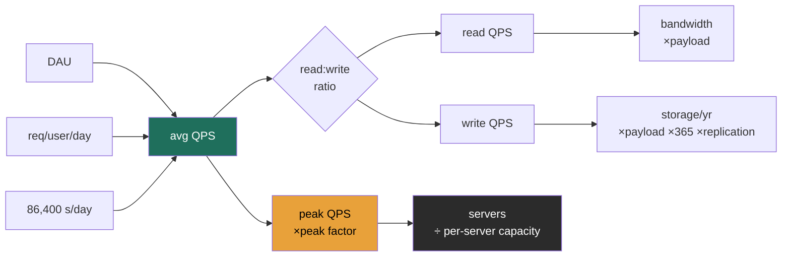

# Module 1 — Interview Mechanics (Part 1 of 2)
### Lessons 1.1 – 1.3 · taught at Director altitude

> Everything here is framed for the round run by Principal/Staff engineers and Architects (see Module 0 §2a). The recurring question in their heads is: *"Would I trust this person's judgment in a real architecture review on Monday?"*

---

# Lesson 1.1 — What interviewers actually score (the 5 axes)

### Learning objectives
- Name the 5 axes every system-design interview scores on, and how the weighting shifts for a Director vs. a staff IC.
- Operate the **altitude dial** — decide in real time when to go deep and when to delegate.
- Convert what you already know into *trade-off statements* that read as leadership, not operation.
- Self-diagnose the two failure modes (too high / too deep) mid-answer and correct.

### Intuition first
A system-design interview is not an exam; it's a **design review you've been asked to chair.** The senior engineers across the table aren't checking whether you memorized an answer key — they're deciding whether they'd want you running the review when the architecture actually matters. Think of it as a pilot's check ride: nobody cares that you can recite the manual; they care that you fly at the right altitude and make the right call when the weather turns.

### Deep explanation — the 5 axes
Every interviewer is scoring some weighted blend of these. The numbers in brackets are *rough relative weights at Director level* (they invert for a staff IC).

1. **Requirements & scoping** *(heavy)* — Do you clarify before you build? Do you cut scope to a defensible core (3–5 features) instead of trying to boil the ocean?
2. **Estimation & quantification** *(medium)* — Do you reason in numbers well enough to know whether this fits on 10 servers or 10,000? (Lesson 1.3.)
3. **High-level design & decomposition** *(medium)* — Can you break the system into components with clear responsibilities and a clean data flow? Necessary, but has *diminishing returns* — past a point, more boxes is not more signal.
4. **Trade-off depth & decision-making** *(heaviest)* — Can you name 2–3 viable approaches, state pros/cons, **decide**, and defend the decision against requirements, cost, and risk? This is where the offer is won or lost at Director level.
5. **Communication & leadership signal** *(heavy)* — Do you drive the conversation, structure your thinking out loud, handle "why not X?" without getting defensive, and know when to say "I'd delegate that benchmark"?

**The weighting shift that trips people up:** A staff IC is carried by axes 3 and 4 with *deep* mechanics. A Director is carried by 1, 4, and 5 — framing, trade-off judgment, and the leadership texture of how you reason. Deep mechanics on axis 3 are *necessary but not sufficient*, and over-investing there actively costs you ("why is this Director hand-tuning a B-tree?").

**The altitude dial — the single most useful habit.** At every decision point, ask yourself: *"Does the decision actually turn on this detail?"*
- **Yes** → go down one or two levels and resolve it. ("Strong vs. eventual consistency here changes the whole data layer, so let me reason it through.")
- **No** → state your default and delegate credibly. ("Exact compaction tuning won't change the architecture — I'd have the storage team benchmark it; my prior is leveled compaction because the workload is read-heavy.")

That second sentence is worth more than ten minutes of correct B-tree math, because it shows judgment, trust in your org, and awareness of your own altitude — simultaneously.

### Diagram — interview flow and the altitude band

### Worked example — the first 90 seconds, done at altitude
Prompt: *"Design a URL shortener."*

A staff-IC opening dives into hash functions. A **Director-altitude** opening sounds like:

> "Before I design, three questions. One — is this an internal redirect service or a public product like Bitly, because analytics and abuse-prevention change the architecture? Two — what's the read:write ratio I should assume; I'd expect heavily read-skewed, maybe 100:1, which pushes me toward aggressive caching. Three — what's the availability bar; if it's a 99.99% public service, the redirect path has to survive a region loss. Assuming public product, 100:1 reads, four-nines: my core scope is create-short-URL, redirect, and basic analytics; I'll treat custom aliases and expiry as stretch. Let me size it."

That answer scored axes 1, 2, and 5 in 90 seconds without designing a single component — and it pre-committed the trade-offs that make the rest of the conversation defensible.

### Trade-offs table — how to spend a marginal 5 minutes
| Spend it on… | Pro | Con | Use when… |
|---|---|---|---|
| **Deeper mechanics** on a chosen component | Demonstrates real depth | Reads as "in the weeds"; burns clock | The interviewer explicitly probes it, or the decision hinges on it |
| **Naming another alternative** + its trade-off | Highest Director signal; shows breadth + judgment | Can feel like breadth-without-depth if overdone | Default move when you've made a choice — pre-empt "why not X?" |
| **Re-validating against requirements/SLOs** | Shows you stress your own design (axis 4) | Can stall momentum if done too early | After the high-level design lands, before deep-diving |

### What interviewers probe here
- **"Why not X instead?"** — *Strong:* "I considered X; I rejected it because [cost/operability/latency], though if [constraint] changed I'd revisit." *Red flag:* you can't name a single downside of your own choice.
- **"How does this scale 10×?"** — *Strong:* you point to the specific component that breaks first and the lever you'd pull. *Red flag:* "we'd add more servers" with no mechanism.
- **"What breaks first under load?"** — *Strong:* a confident, specific answer with a number. *Red flag:* surprise that anything would break.

### Common mistakes / misconceptions
- Treating it as a quiz with a right answer (it's a judgment assessment).
- Jumping to components before scoping — skips the heaviest Director axis.
- Never actually *deciding* — laying out options is half the job; committing and defending is the other half.
- Going deep too early, then running out of clock before the trade-off discussion.
- Ignoring cost and operability — Directors own budgets and on-call, and interviewers know it.

### Practice questions
**Q1.** An interviewer says, *"You've described three components. Which one keeps you up at night?"* What makes a strong answer?
> *Model:* Name the component on the critical availability/latency path (e.g., the redirect/read path for a URL shortener), explain the specific failure (cache stampede, region loss), and state your mitigation and its cost. The signal is that you reason about *failure*, not just happy path, and you tie it to a number/SLO.

**Q2.** You realize 8 minutes in that you've been hand-deriving a hashing scheme. How do you recover without looking lost?
> *Model:* Zoom out explicitly: "I'm going deeper than this decision warrants — the key point is collision-free unique IDs, which I'd solve with [approach]; the tuning is a detail I'd delegate. Let me get back to the system." Naming your own altitude correction is itself a strong signal.

**Q3.** Why is "we'll scale horizontally" a red flag even when it's technically correct?
> *Model:* Because it asserts an outcome without a mechanism. The signal interviewers want is *which* component scales horizontally, what makes it able to (statelessness, partitionable key), and what new problem that creates (coordination, hot shards). The mechanism is the leadership content; the conclusion isn't.

### Key takeaways
- Five axes: scope, estimate, design, **trade-offs**, communicate — and at Director level trade-offs and communication carry the most weight.
- Implementation depth has diminishing returns; past a point it's an anti-signal.
- The altitude dial — "does the decision turn on this?" — is your real-time depth control.
- "Delegate credibly" with a stated prior beats grinding the detail yourself.
- Never present a choice you can't critique; pre-empting "why not X?" is the move.

> **Spaced-repetition recap:** The round is a design review you're chairing. Score is mostly trade-off judgment and communication, not mechanics. Control depth with one question — *does the decision turn on this?* — and delegate the rest with a stated prior.

---

# Lesson 1.2 — Functional vs. non-functional requirements

### Learning objectives
- Cleanly separate functional (what it does) from non-functional (how well) requirements.
- Run the clarification dialogue that scopes the entire problem in 2–3 minutes.
- Translate fuzzy non-functionals into **measurable SLOs** (p99 latency, availability nines, durability, consistency).
- Make each requirement *pre-commit* a downstream architectural decision.

### Intuition first
**Functional requirements are the verbs; non-functional requirements are the adjectives.** "Post a tweet," "fetch a feed" — verbs. "Fast," "always-on," "durable," "consistent" — adjectives. Building a house: functional is "three bedrooms and a kitchen"; non-functional is "survives an earthquake, heats through winter, costs under budget." The adjectives are what actually drive the engineering — and the cost.

### Deep explanation
**Functional reqs — and the art of cutting them.** List the core features, then *visibly scope down* to 3–5. Saying "I'll treat search and DMs as out of scope for v1" is a strong leadership signal — it shows you prioritize. The trap is enumerating twenty features to look thorough; it reads as inability to focus.

**Non-functional reqs — and how to quantify each one (banish "fast" and "scalable"):**

- **Availability** — in nines. Internalize the downtime budget:

| Availability | Downtime / year | Downtime / month |
|---|---|---|
| 99.9% ("three nines") | ~8.76 hours | ~43 min |
| 99.99% ("four nines") | ~52.6 min | ~4.3 min |
| 99.999% ("five nines") | ~5.26 min | ~26 sec |

- **Latency** — always as a percentile, never a mean. State a target: "p99 read < 100 ms, p99 write < 300 ms." p99/p999 is what users actually feel; the mean hides the pain.
- **Consistency** — strong vs. eventual, *per feature*. Tie it to semantics: a follower count can be eventually consistent; a bank balance cannot.
- **Durability** — probability you never lose committed data. S3 advertises 11 nines (99.999999999%). Say "I need high durability for uploaded media → replicated blob store / erasure coding," not "don't lose data."
- **Scalability** — the target scale *and* the growth curve. "100M DAU today, planning for 3× in 18 months."
- **Throughput, cost, security/compliance** — name the ones that bind. At Director level, *cost* is rarely optional to mention.

**The read:write ratio is a requirement, not a detail.** It's the single number that most shapes the architecture. 100:1 read-heavy → cache + read replicas, optimize the read path. Write-heavy (logging, metrics) → LSM-tree storage, batching, a log/queue front door. Always ask for it; if they won't say, state your assumption.

**The move that earns signal:** make every NFR drive a lever, out loud.
> "p99 read under 100 ms with 100:1 read skew means I'm putting a cache in front of the database. The trade-off is staleness — bounded by a short TTL — which is acceptable here because the data tolerates a few seconds of lag. If this were account balances, I'd reject the cache and pay the latency."

### Diagram — requirement → architectural lever

### Worked example — Twitter timeline requirements
- **Functional (cut to core):** post a tweet, follow a user, fetch home timeline. *Out of scope for v1:* search, DMs, ads.
- **Non-functional, quantified:**
  - Read:write ≈ several hundred to one (timeline reads vastly outnumber posts) → optimize reads, precompute timelines.
  - p99 home-timeline load < 200 ms → fan-out-on-write (precomputed feeds) over fan-out-on-read for most users.
  - Availability 99.99% → multi-region; reads must survive a region loss.
  - Consistency: eventual is fine — a tweet appearing in a follower's feed a second late is acceptable → async fan-out.
- Notice every NFR *already pre-committed* a major design decision before any boxes were drawn. That's the point.

### Trade-offs table — consistency level per feature
| Option | Pro | Con | Use when… |
|---|---|---|---|
| **Strong consistency** | Correct reads always; simple mental model | Higher latency; lower availability under partition | Money, inventory, auth, uniqueness |
| **Eventual consistency** | Low latency, high availability, cheap | Reads can be stale; client must tolerate it | Feeds, counts, likes, view counters |
| **Causal / read-your-writes** | Per-user correctness without full strong cost | More complex; needs session/versioning | Comments, chat, "I should see my own edit" |

### What interviewers probe here
- **"What availability do you actually need?"** — *Strong:* you give a number, justify it from the product (revenue impact of downtime), and design to it. *Red flag:* "as high as possible" (ignores cost/complexity trade-off — Directors don't say this).
- **"Is eventual consistency acceptable here?"** — *Strong:* answer *per feature* with the semantic reason. *Red flag:* one blanket answer for the whole system.
- **"What's your read:write ratio and why does it matter?"** — *Strong:* a number plus the lever it pulls. *Red flag:* treating it as trivia rather than the architecture-shaping input it is.

### Common mistakes / misconceptions
- Listing every feature instead of scoping to a defensible core.
- Vague NFRs — "fast," "highly scalable" — with no number.
- Stating NFRs but never connecting them to a decision (they're not decoration).
- Promising strong consistency everywhere — expensive and usually unnecessary.
- Forgetting cost and compliance, which Directors are expected to own.

### Practice questions
**Q1.** Convert "the system should be reliable and fast" into interview-grade requirements.
> *Model:* "Reliable" → availability target (e.g., 99.99%, ~53 min/yr) + durability target (e.g., no committed data loss, 11 nines for stored media). "Fast" → percentile latency targets (p99 read < 100 ms, p99 write < 300 ms). Then I'd state which matters most given the product and design to the binding one.

**Q2.** A product is write-heavy (IoT telemetry, 50:1 writes:reads). How does that flip your defaults vs. a read-heavy product?
> *Model:* De-emphasize caching (low read demand), prioritize ingest throughput: a log/queue (Kafka) as the front door to absorb spikes, LSM-tree storage (Cassandra) for cheap high-volume writes, batching, and time-based partitioning. The read path can tolerate higher latency, so I trade read optimization for write durability and throughput.

**Q3.** Why is mean latency a misleading SLO?
> *Model:* The mean hides the tail. A 20 ms mean can coexist with a 2 s p99, and the p99 is what a meaningful fraction of users experience every session. SLOs are set on percentiles (p99/p999) because tail latency is what damages perceived reliability and what fans out into cascading timeouts at scale.

### Key takeaways
- Functional = verbs (and cut to 3–5); non-functional = adjectives (and quantify every one).
- Availability lives in nines; know the downtime budget cold.
- Latency is a percentile, never a mean.
- Read:write ratio is the most architecture-shaping requirement — always get it.
- Make each requirement *pre-commit* a lever, out loud — that's the signal.

> **Spaced-repetition recap:** Verbs vs. adjectives. Scope the verbs to a core; quantify every adjective (nines, p99, durability, consistency-per-feature). Get the read:write ratio early — it pre-commits half your design.

---

# Lesson 1.3 — Back-of-the-envelope estimation

### Learning objectives
- Produce QPS, storage, bandwidth, and server-count estimates in under three minutes.
- Use power-of-ten shortcuts and round aggressively without losing the order of magnitude.
- Apply peak-to-average multipliers and the read:write ratio correctly.
- Frame estimation as *"enough math to make a defensible call,"* not accounting.

### Intuition first
Estimation is a **feasibility sniff test**, not a spreadsheet. A structural engineer eyeballs whether a beam is roughly right before running detailed calcs — you want the order of magnitude, fast. At Director level the exact number is almost irrelevant; what matters is *"does this fit on 10 servers or 10,000?"* — because the answer changes the entire architecture. Being off by 2× is fine. Being off by 100× is the mistake.

### Deep explanation
**Numbers to memorize (so you don't burn clock deriving them):**
- Seconds in a day = 86,400 ≈ **10⁵** (round to 100k — a clean, slightly conservative denominator).
- Powers of ten for bytes: KB = 10³, MB = 10⁶, GB = 10⁹, TB = 10¹², PB = 10¹⁵.
- A "typical" commodity server handles on the order of **1k simple requests/sec** (state this assumption — it varies 10× by workload).

**The four estimates, in order:**

1. **QPS (queries/sec).**
   `avg QPS = DAU × requests-per-user-per-day ÷ 86,400`
   Then `peak QPS = avg QPS × peak factor` (use **2–10×**; spiky/event-driven systems higher). Split into read vs. write with the read:write ratio.

2. **Storage.**
   `storage/day = writes-per-day × payload-size`
   `storage/year = storage/day × 365 × replication factor`
   Storage is driven by **writes**, not reads — a common slip.

3. **Bandwidth.**
   `egress ≈ read QPS × payload`, `ingress ≈ write QPS × payload`. For media-heavy systems this, not QPS, is often the binding constraint and the dominant cost.

4. **Servers.**
   `servers ≈ peak QPS ÷ per-server capacity`. This is the number that tells you whether you're building a small fleet or a hyperscale system.

**Worked numeric example — a Twitter-scale write path (illustrative; assumptions stated):**
- Assume 200M DAU, each posts 2 tweets/day → 400M tweets/day.
- Write QPS = 400M ÷ 86,400 ≈ **4.6k/s** avg; peak ×3 ≈ **~14k/s**.
- Read:write 100:1 → read QPS ≈ **460k/s** avg; peak ≈ **~1.4M/s**.
- Storage: 400M tweets × ~300 bytes (text + metadata) ≈ **120 GB/day** → ~44 TB/yr; ×3 replication ≈ **~130 TB/yr** of tweet text. (Media would dwarf this — flag it, don't compute it.)
- Read fleet: 1.4M/s ÷ ~5k req/s per cache node ≈ **~280 cache nodes** on the read path.

The Director-level point isn't the digits — it's the conclusion: *reads dominate by 100×, so the architecture lives or dies on the read/cache path, and text storage is trivial while media is the real cost.* The math exists to justify that sentence.

### Diagram — estimation pipeline

### Interactive artifact
**→ Estimation Calculator** (separate React widget). Adjust DAU, requests/user/day, payload, read:write ratio, peak factor, replication, and per-server capacity; it shows avg/peak QPS, read/write split, storage/year, bandwidth, and server count — with the formula under each output and three real-system presets. Use it to build the muscle: change one input, predict the output, then check.

### Trade-offs table — which estimation method to lead with
| Method | Pro | Con | Use when… |
|---|---|---|---|
| **Top-down** (from DAU) | Fast; interviewer usually gives you DAU | Sensitive to the req/user assumption | The default — almost always start here |
| **Bottom-up** (from per-server capacity) | Grounds the answer in real hardware limits | Needs a capacity assumption you must defend | Sizing the fleet, or sanity-checking top-down |
| **Comparable systems** ("Twitter does ~X") | Instant credibility if the number's right | Dangerous if you misremember; looks like bluffing | As a *cross-check*, never as the sole basis |

### What interviewers probe here
- **"How did you get that number?"** — *Strong:* you show the chain and name each assumption. *Red flag:* a number with no derivation.
- **"Is that peak or average?"** — *Strong:* you already distinguished them and stated your peak factor. *Red flag:* you don't know which one you computed.
- **"What dominates your storage / cost?"** — *Strong:* you identify the driver (media, not text) without recomputing. *Red flag:* treating all bytes as equal.

### Common mistakes / misconceptions
- Forgetting the peak multiplier and designing to average load.
- Driving storage off reads instead of writes.
- Forgetting replication (×3 is common) in the storage total.
- Mixing bits and bytes, or losing a factor of 1,000 between MB/GB/TB.
- Over-precision — computing 4,629.6 QPS when "~5k" is the answer and the rounding *is* the skill.
- Analysis paralysis — spending five minutes here; three is the budget.

### Practice questions
**Q1.** Estimate daily storage for a photo service: 50M DAU, each uploads 2 photos/day at 1.5 MB each.
> *Model:* 50M × 2 = 100M photos/day × 1.5 MB = **150 TB/day** raw; with ×3 replication ≈ **450 TB/day**; ~164 PB/yr replicated. Conclusion that matters: this is a *blob-store + CDN* problem dominated by storage and egress cost, not a QPS problem.

**Q2.** A chat app has 500M DAU sending 40 messages/day. Average and peak write QPS?
> *Model:* 500M × 40 = 20B msgs/day ÷ 86,400 ≈ **~230k/s** avg. Peak ×3 ≈ **~700k/s**. Conclusion: write-heavy, so a partitioned log/queue front door and LSM-tree storage, not a read-cache architecture.

**Q3.** Why round 86,400 to 100,000?
> *Model:* It's within ~16% — far inside back-of-envelope tolerance — and makes QPS = DAU × req/user ÷ 10⁵ a one-step mental division. It also rounds the *denominator up*, so the QPS estimate is mildly conservative, which is the safe direction for capacity planning.

### Key takeaways
- Estimation answers one question: *small fleet or hyperscale?* Order of magnitude is the deliverable.
- QPS = DAU × req/user ÷ 86,400 (≈10⁵); then apply peak factor and read:write split.
- Storage is driven by **writes** × payload × retention × replication.
- For media systems, **bandwidth/egress** is often the binding constraint, not QPS.
- Round aggressively, state every assumption, and spend ≤3 minutes — precision here is an anti-signal.

> **Spaced-repetition recap:** Estimation is a feasibility sniff test. QPS from DAU and 10⁵; peak ×2–10; storage from writes; servers from peak ÷ capacity. The number exists only to justify one architectural sentence.

---

*End of Module 1, Part 1. Next: Lesson 1.4 (latency numbers + visualizer) and Lesson 1.5 (failure modes), plus the Module 1 cheat sheet.*
