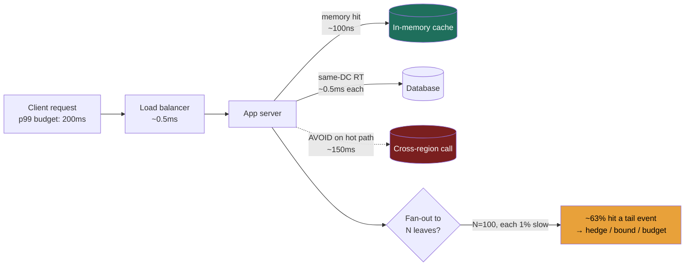
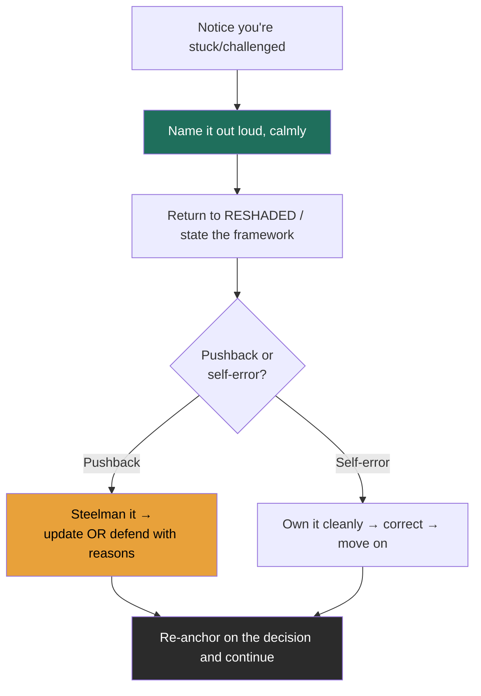

# Module 1 — Interview Mechanics (Part 2 of 2)
### Lessons 1.4 – 1.5 · taught at Director altitude

---

# Lesson 1.4 — Latency numbers every engineer should know

### Learning objectives
- Recall the canonical latency ladder (L1 → cross-continent) by *order of magnitude*, not exact figure.
- Convert those numbers into the three or four architectural reflexes they imply.
- Reason about **tail-latency amplification** when a request fans out.
- Spend a latency *budget* (p99) across a request path out loud, the way a Director would.

### Intuition first
The latency numbers are a **map of distances inside the computer.** Reading from a CPU cache is stepping into the next room; reading from RAM is walking down the hall; hitting an SSD is a drive across town; a same-datacenter network round trip is a flight to the next city; a cross-continent call is a trip around the world. You don't memorize the mileage — you internalize that *some destinations are absurdly farther than others*, so you design routes that avoid the far ones on the hot path.

### Deep explanation — the canonical ladder
These are the widely-cited "Jeff Dean" figures. Exact values have improved (NVMe is faster than the classic SSD number, etc.), but **interviewers expect the ratios**, and the ratios are what drive design:

| Operation | Latency | ≈ orders of magnitude vs RAM |
|---|---|---|
| L1 cache reference | 0.5 ns | — |
| Branch mispredict | 5 ns | — |
| L2 cache reference | 7 ns | — |
| Mutex lock/unlock | 25 ns | — |
| **Main memory (RAM) reference** | **100 ns** | **baseline (1×)** |
| Compress 1 KB (Snappy) | ~2–3 µs | ~25× |
| Send 1 KB over 1 Gbps network | ~10 µs | ~100× |
| SSD random read (4 KB) | ~150 µs | ~1,500× |
| Read 1 MB sequentially from memory | ~250 µs | ~2,500× |
| **Same-datacenter round trip** | **~500 µs** | **~5,000×** |
| Read 1 MB sequentially from SSD | ~1 ms | ~10,000× |
| HDD disk seek | ~10 ms | ~100,000× |
| Read 1 MB sequentially from HDD | ~20 ms | ~200,000× |
| **Cross-continent round trip** | **~150 ms** | **~1,500,000×** |

**The four reflexes that fall out of this table** (this is the actual interview content):

1. **Memory is ~5,000× faster than a network round trip → cache aggressively and minimize hops.** Every avoided same-DC round trip is worth ~5,000 memory reads.
2. **Cross-region is ~150 ms → never put a synchronous cross-region call on the request path.** Replicate data near users; do cross-region work async. One synchronous transatlantic hop blows most user-facing p99 budgets by itself.
3. **Random disk I/O (~10 ms HDD) is catastrophic on the hot path → batch into sequential I/O.** This is *why* LSM-trees exist (turn random writes into sequential), and why the SSD era reshaped database design.
4. **Sequential >> random, everywhere.** Sequential SSD read of 1 MB (~1 ms) vs. a single random SSD read (~150 µs) means large sequential scans are cheap per byte — design for them.

**Tail-latency amplification — the senior insight.** Your service's p99 is assembled from your *dependencies'* p99s. If a single user request fans out to **100 leaf services in parallel**, and each has just a **1% chance** of a slow (p99) response, then the probability the request waits on *at least one* slow leaf is:

> 1 − (0.99)¹⁰⁰ ≈ **63%**

So a majority of requests inherit a tail-latency event even though each dependency is "99% fast." This is the core result of Dean & Barroso's *The Tail at Scale*. Mitigations a Director should name: **hedged requests** (send a duplicate after a delay, take the first response), **bounding fan-out**, **p99-aware load balancing**, and **request budgets** that fail fast rather than wait.

### Diagram — where a request spends its budget

### Interactive artifact
**→ Latency Numbers visualizer** (separate React widget). Log-scale bars from L1 to cross-continent, color-coded by tier (CPU / memory / storage / network), with a toggle to a **"human scale"** where 1 ns = 1 second — so RAM becomes ~1.5 minutes, a same-DC round trip ~6 days, and a cross-continent round trip ~5 years. That mapping is what makes the orders of magnitude stick.

### Worked example — spending a 150 ms p99 budget
You're asked to design a product page that must render at p99 < 150 ms. You reason out loud:
- DNS + TLS + LB: ~20 ms (mostly the user's network, partly yours).
- App needs profile + inventory + recommendations. *Naïvely sequential:* 3 same-DC calls × ~0.5 ms is trivial — but each backend itself queries storage. If recommendations does a cross-region read, that's ~150 ms alone → **budget blown**. So: pin a recommendations replica in-region, or precompute and cache.
- Inventory must be fresh → DB read (~few ms). Profile is cacheable → memory (~µs).
- **Decision:** parallelize the three fetches, cache profile, keep recommendations in-region with a precomputed fallback, set a 40 ms per-dependency timeout with a degraded response (hide recs) rather than miss the budget.
That paragraph — turning the ladder into a spent budget with a graceful-degradation fallback — is exactly the Director-level signal.

### Trade-offs table — where to put hot read data
| Option | Typical latency | Pro | Con | Use when… |
|---|---|---|---|---|
| **In-memory cache (Redis/local)** | ~100 ns – ~0.5 ms | Fastest; offloads DB | Staleness; cost; cache-coherence | Hot, read-heavy, staleness-tolerant data |
| **Read replica (same region)** | ~1–10 ms | Fresh-ish; scales reads | Replication lag; more infra | Reads that need near-current data |
| **CDN / edge** | ~10–50 ms to user | Cuts user-perceived latency globally | Only for cacheable/static-ish content | Media, static assets, geo-distributed users |

### What interviewers probe here
- **"How much slower is a cross-region call than a memory read?"** — *Strong:* "~150 ms vs ~100 ns — about a million-fold; I won't put it on the hot path." *Red flag:* treating network and memory as the same order.
- **"Why not just query the database for everything?"** — *Strong:* you contrast ~0.5 ms+ per round trip and disk cost vs. ~µs memory, and justify a cache with a staleness bound. *Red flag:* no awareness of the gap.
- **"Your service calls 50 backends — what's your p99?"** — *Strong:* you raise tail amplification and a mitigation. *Red flag:* you quote one backend's p99 as your own.

### Common mistakes / misconceptions
- Confusing µs and ms (a 1,000× error that wrecks every downstream estimate).
- Believing SSD ≈ RAM — it's ~1,000× slower for random reads.
- Ignoring tail amplification and assuming parallel fan-out is "free."
- Putting synchronous cross-region calls on the request path.
- Quoting exact nanoseconds as if they're precise — it's the ratios that matter.

### Practice questions
**Q1.** A request makes 10 sequential same-DC calls at ~0.5 ms each, plus one ~10 ms DB read. Rough p50, and how would you cut it?
> *Model:* ~10×0.5 + 10 = **~15 ms** p50. Cut it by parallelizing the 10 independent calls (collapse ~5 ms into ~0.5 ms) and caching the DB read. The tail matters more than this p50 — bound each call with a timeout.

**Q2.** Why does turning random writes into sequential writes (LSM-tree) help so much?
> *Model:* Random disk I/O (~10 ms HDD seek, and write amplification even on SSD) dominates latency and wears the device; sequential I/O is orders of magnitude cheaper per byte. LSM-trees buffer writes in memory and flush them as large sequential runs, trading read amplification (must check multiple levels, mitigated by Bloom filters) for vastly cheaper writes — the right trade for write-heavy systems.

**Q3.** Translate "1 ns = 1 second" for RAM, same-DC round trip, and cross-continent round trip.
> *Model:* RAM 100 ns → **~1.5 min**; same-DC round trip 500 µs → **~6 days**; cross-continent 150 ms → **~4.75 years**. The point: a cross-region hop is "five years" of human time vs. RAM's "minute and a half" — never on the hot path.

### Key takeaways
- Internalize ratios, not digits: RAM ~100 ns, same-DC RT ~0.5 ms (~5,000×), cross-continent ~150 ms (~1.5M×).
- Cache aggressively; every avoided round trip ≈ thousands of memory reads.
- Never put a synchronous cross-region call on the request path.
- Batch random I/O into sequential I/O — the reason LSM-trees exist.
- Tail amplifies on fan-out: 100 parallel calls at 1% slow → ~63% of requests hit a tail; hedge and bound.

> **Spaced-repetition recap:** Latency is a map of distances. RAM minutes, same-DC days, cross-continent years (at 1 ns = 1 s). Cache, avoid cross-region on the hot path, sequentialize I/O, and hedge fan-out.

---

# Lesson 1.5 — Common failure modes & how to recover live

### Learning objectives
- Recognize the five interview failure modes the moment you're in one.
- Recover from each with a scripted move that *itself* reads as a leadership signal.
- Demonstrate system-level failure-mode thinking ("what breaks first?") as a strong signal.
- Handle interviewer pushback as a gift, not a threat.

### Intuition first
Every senior candidate stumbles — the offer turns on **how you recover, not whether you wobble.** Interviewers are watching for the same thing they'd watch for in a real incident: do you stay composed, name the problem, and drive to a decision? A clean recovery from a mistake is *more* convincing than a flawless run, because it shows them what you're like when something actually breaks. Recovering well is a leadership demo disguised as a stumble.

### Deep explanation — the five interview failure modes and the recovery move

**1. The freeze (blank on where to go next).**
*Recovery:* fall back to the framework, out loud. "Let me step back to RESHADED — I've done requirements and estimation; the next thing is the high-level components." Buy time legitimately with a clarifying question. The structure is your safety net; saying its name out loud signals method under pressure.

**2. The rabbit hole (too deep — from Lesson 1.1).**
*Recovery:* name your own altitude correction. "I'm deeper than this decision warrants. The key point is X; the tuning I'd delegate. Back to the system." Self-correcting altitude is a *positive* signal, not an admission of failure.

**3. The ramble (no structure, talking in circles).**
*Recovery:* stop yourself and impose structure. "Let me organize this — there are three components and one hard decision; I'll take them in order." Interviewers forgive a reset far more readily than a meandering monologue.

**4. The blank number (can't recall a figure mid-estimate).**
*Recovery:* give the method and a bound, never fake precision. "I don't have the exact SSD figure, but it's roughly 100× slower than RAM and 100× faster than HDD seek — call it low-hundreds of microseconds, which is enough to make the call." Reasoning to a bound *is* the skill.

**5. The pushback (interviewer challenges your choice).**
*Recovery:* treat it as a gift. Steelman their point first — "that's fair, the cost of my approach is…" — then either **update** ("you're right, I'll switch to…") or **defend with reasons** ("I'll hold the line because, given the read-heavy requirement, the staleness is acceptable and the simplicity is worth it"). Both disagree-and-commit and reasoned defense are strong; defensiveness and instant capitulation are both weak. *Note:* pushback is often a probe, not a correction — they want to see how you reason, not necessarily that you were wrong.

**Two more worth a line each:** *over-scoping/out of time* → triage out loud ("given the clock, I'll deep-dive the read path and sketch the rest"); *realizing you erred earlier* → own it cleanly and correct ("I mis-stated the consistency model a minute ago — it should be eventual here; let me fix that"). Directors model exactly this behavior in real incident reviews.

**Demonstrating *system* failure-mode thinking (a strong signal in its own right).** When asked "what breaks first?" or "how does this fail?", reach for this menu:

| Failure mode | What it is | Mitigation to name |
|---|---|---|
| Single point of failure | One component whose loss takes the system down | Redundancy, multi-AZ, failover |
| Cascading failure | One overloaded service drags down its callers | Circuit breakers, bulkheads, timeouts |
| Thundering herd / cache stampede | Many clients hit the DB at once when a hot key expires | Request coalescing, jittered TTL, lock-on-miss |
| Retry storm | Failures trigger retries that amplify the outage | Exponential backoff + jitter, retry budgets |
| Hot shard / hot key | Skewed load concentrates on one partition | Better shard key, salting, dedicated cache |
| Replication lag | Followers fall behind, reads go stale | Read-your-writes routing, bounded staleness |

### Diagram — the live-recovery loop

### Worked example — recovering from a pushback
*Interviewer:* "You put a cache in front of the inventory DB. Won't users see stale stock and oversell?"

*Weak (capitulate):* "Good point, I'll remove the cache." *Weak (defensive):* "No, caches are standard."

*Strong:* "Fair challenge — for *displayed* stock, a few seconds of staleness is fine, so I'll keep the read cache there. But the **purchase path** can't be stale, so the decrement goes straight to the source of truth with a conditional/atomic check, and I'll reconcile the cache on write. So: cache the browse path, never the commit path. The trade-off is two read paths to maintain, which I accept to protect correctness where it matters." — You steelmanned, split the problem by consistency need, decided, and named the cost. That single exchange can carry an interview.

### Trade-offs table — responding to pushback
| Response | Pro | Con | Use when… |
|---|---|---|---|
| **Update your design** | Shows you integrate new info | Looks flaky if you flip on everything | Their point reveals a real gap you missed |
| **Defend with reasons** | Shows conviction + judgment | Looks rigid if the reasons are thin | Your choice still holds given the requirements |
| **Split the problem** | Often the *best* — resolves the tension | Requires quick decomposition | The concern applies to one path but not another |

### What interviewers probe here
- **"What's the single biggest risk in this design?"** — *Strong:* you name a specific failure mode and its blast radius. *Red flag:* "I think it's pretty solid."
- **"What happens when [component] dies at 3am?"** — *Strong:* failover behavior, what degrades, what the on-call sees. *Red flag:* you've never considered the failure path.
- *(Implicitly)* **how you handle being wrong** — *Strong:* clean ownership and correction. *Red flag:* defensiveness or visible rattling.

### Common mistakes / misconceptions
- Trying to project flawlessness instead of demonstrating composure under stress.
- Treating pushback as an attack rather than a probe.
- Capitulating instantly (no conviction) or refusing to budge (no humility) — both lose.
- Only ever describing the happy path; never volunteering how it fails.
- Hiding an earlier mistake instead of owning it — interviewers usually noticed.

### Practice questions
**Q1.** You blank on the exact replication-lag number for an async follower. What do you say?
> *Model:* Give the method and a bound: "It depends on write volume and network, but typically milliseconds to low seconds under healthy conditions, spiking under load. That's why I'd route read-your-writes traffic to the leader and only send staleness-tolerant reads to followers." Bounded reasoning beats a fabricated precise figure.

**Q2.** Halfway through, you realize your estimate was off by 10×. Recover.
> *Model:* "I need to correct an earlier number — I dropped a factor of ten, so peak QPS is ~500k, not ~50k. That actually changes my conclusion: a single cache tier won't absorb it, so I'll shard the cache. Good that we caught it." Owning + showing the *consequence* turns the error into a signal of rigor.

**Q3.** The interviewer keeps pushing on a choice you're confident in. Are they telling you you're wrong?
> *Model:* Usually no — repeated pushing is often a probe to test whether you understand *why* you chose what you chose and whether you'll cave under pressure. Hold your reasoned position, acknowledge the cost, and offer the condition under which you'd change. If they reveal a genuine new constraint, *then* update.

### Key takeaways
- Recovery, not flawlessness, is what's scored — a clean recovery beats a perfect run.
- For every stumble there's a scripted move; the move itself signals leadership.
- Name the problem out loud and return to RESHADED — structure is your net.
- Pushback is a gift and usually a probe: steelman, then update *or* defend; often *split the problem*.
- Volunteer failure modes; "what breaks first?" should have a confident, specific answer.

> **Spaced-repetition recap:** You'll wobble; recover visibly. Name it, return to the framework, and for pushback: steelman → update, defend, or split. Always know what breaks first.

---

*End of Module 1. See the Module 1 cheat sheet for the one-page distillation. Next module: Module 2 — Distributed systems fundamentals & trade-offs.*
