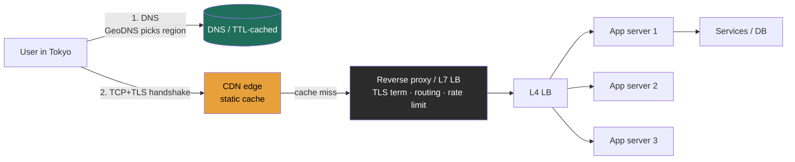
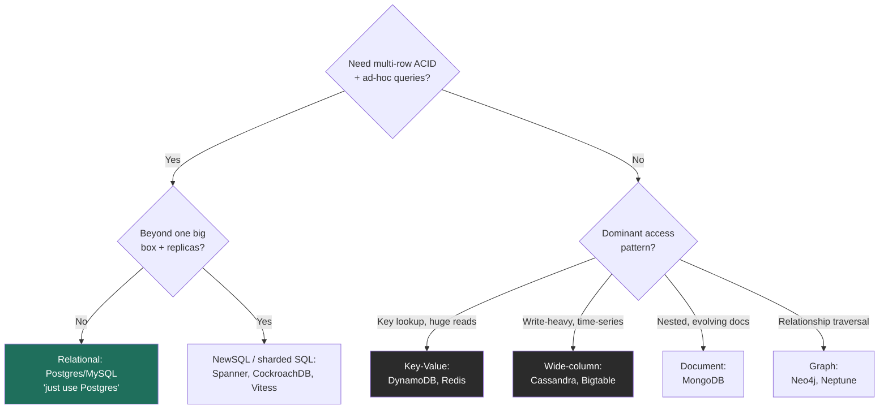

# Module 2 — Fundamentals & Trade-offs (Part 1)
### Lessons 2.1 – 2.2 · taught at Director altitude

> Module 2 is the **trade-off vocabulary** the rest of the course speaks in. You won't be quizzed on TCP internals in a Director loop — but you will be expected to *reason about the levers* these fundamentals expose, and to know which knob you're turning and what it costs.

---

# Lesson 2.1 — Networking, DNS, proxies (forward vs. reverse)

### Learning objectives
- Trace a request from URL to response at the altitude a Director needs (DNS → TCP/TLS → HTTP), and know where the time goes.
- Distinguish a **forward proxy** from a **reverse proxy** and state what each buys you.
- Place load balancers, reverse proxies, API gateways, and CDNs in the request path and explain where they overlap.
- Reason about global routing and failover (GeoDNS, anycast, TTLs) and their latency/availability implications.

### Intuition first
The network is a **postal system.** DNS is the *address book* — it turns a human name (`api.example.com`) into a location (an IP). A **forward proxy** is *your* mail-forwarding service: it acts on behalf of the **client**, representing or hiding you as you reach out. A **reverse proxy** is the *company mailroom*: it acts on behalf of the **servers**, fronting them, deciding who handles each piece of incoming mail, and never letting outsiders see the internal office layout.

### Deep explanation
**The request lifecycle (what actually happens when a user hits your service):**
1. **DNS resolution** — the resolver walks root → TLD → authoritative servers, heavily cached at each layer with **TTLs**. Result: a name maps to one or more IPs. *This is eventually consistent and cached* — a fact with real consequences (below).
2. **TCP handshake** — SYN / SYN-ACK / ACK, ~1 round trip.
3. **TLS handshake** — ~1 RTT with TLS 1.3 (down from 2 in TLS 1.2); **0-RTT resumption** for returning clients. On a cross-region path each RTT is ~150 ms, so handshakes alone can dominate first-byte latency.
4. **HTTP exchange** — HTTP/1.1 (head-of-line blocking per connection) → HTTP/2 (multiplexed streams over one connection) → HTTP/3 (QUIC over UDP, removes TCP head-of-line blocking, faster on lossy/mobile links).

**DNS as a control plane, not just a phonebook.** Record types you should name: A/AAAA (IPv4/IPv6), CNAME (alias), NS, MX. The **TTL trade-off** is the interview point: a *low* TTL means fast failover (you can repoint traffic in seconds) but more lookups and resolver load; a *high* TTL means fewer lookups but **slow propagation** when you need to drain a dead region. **GeoDNS / latency-based routing** steers users to the nearest healthy region; **anycast** advertises one IP from many locations so the network routes to the closest — both are how global services cut RTT and survive regional loss.

**Forward vs. reverse proxy:**
- **Forward proxy** — sits next to the **client**, faces the internet on the client's behalf. Uses: corporate egress control, content filtering, client-side caching, anonymity. The *server* doesn't know the real client.
- **Reverse proxy** — sits in **front of your servers**, faces clients on the servers' behalf. Uses: load balancing, **TLS termination**, caching, compression, request routing, and security (WAF, rate limiting, hiding backend topology). The *client* doesn't know which backend served it. Named tech: Nginx, Envoy, HAProxy.

**The overlapping front-door family (a Director should disambiguate these cleanly):**
- **Load balancer** — distributes traffic across backends. **L4** (transport: routes by IP/port, fast, connection-level, no payload inspection) vs **L7** (application: routes by URL/header/cookie, can do sticky sessions, smarter but costlier).
- **API gateway** — application-layer concerns at the edge: authn/authz, rate limiting, request routing, response aggregation, protocol translation.
- **CDN** — a geographically distributed reverse-proxy cache at the *edge*, close to users, for cacheable/static-ish content.
These are concentric, not mutually exclusive: a reverse proxy can *be* your L7 LB and API gateway; a CDN is a reverse proxy you don't run.

### Diagram — request path and where the front door sits

### Worked example — getting a Tokyo user to a US-hosted service fast
1. **GeoDNS** resolves the Tokyo user to your Asia-Pacific region (or to an anycast IP routed to the nearest PoP).
2. A **CDN edge** in Tokyo serves static assets locally (~10–30 ms) and terminates TLS near the user, so the expensive handshakes don't cross the Pacific.
3. Dynamic `/api` requests hit a regional **reverse proxy (Envoy)** that terminates TLS, applies rate limiting, and routes to services.
4. An **L4 LB** spreads connections across stateless app servers.
5. **Failover:** if the AP region dies, health checks + a *low DNS TTL* (e.g., 30–60 s) repoint traffic to another region within ~a minute. The Director-level caveat: DNS caching means failover is **not instant**, so for hard SLAs you pair it with anycast withdrawal or a global L7 LB that fails over faster than DNS can.

### Trade-offs table — load balancing layer
| Option | Pro | Con | Use when… |
|---|---|---|---|
| **L4 (transport)** | Very fast, low overhead, protocol-agnostic | No content awareness, no per-URL routing | Raw throughput, TCP/UDP, simple spread |
| **L7 (application)** | Smart routing, sticky sessions, header/path rules, TLS term | Higher CPU/latency, must parse payloads | Microservice routing, A/B, canary, WAF |
| **DNS-based / GSLB** | Global, simple, no single choke point | Slow failover (TTL caching), coarse | Geo steering across regions |

### What interviewers probe here
- **"How does a user in Tokyo reach your service quickly?"** — *Strong:* GeoDNS/anycast + CDN edge + regional termination, with RTT numbers. *Red flag:* "they just connect to the server."
- **"Where do you terminate TLS, and why?"** — *Strong:* at the edge/reverse proxy to avoid carrying handshakes deep into the stack, with re-encryption inside if compliance requires. *Red flag:* no opinion.
- **"A region dies — how fast does traffic move, and what limits it?"** — *Strong:* health checks + low DNS TTL, *and* the caveat that DNS caching bounds failover speed. *Red flag:* assuming DNS is instant.

### Common mistakes / misconceptions
- Treating DNS as instant and globally consistent — it's cached and eventual; TTL governs failover speed.
- Conflating forward and reverse proxy (client-side vs server-side).
- Forgetting TLS handshake cost on cross-region first connections.
- Treating "the load balancer" as one box — it's itself a redundancy/SPOF concern.
- Assuming L7 everywhere — it's costlier; L4 is right when you don't need content awareness.

### Practice questions
**Q1.** Why might you deliberately set a low DNS TTL, and what's the cost?
> *Model:* Low TTL enables fast failover/traffic shifting (repoint within seconds). The cost is more frequent resolver lookups (load, marginal latency) and reliance on clients/resolvers honoring the TTL — many don't perfectly, so DNS failover is a best-effort floor, not a guarantee. For tight RTOs, pair it with anycast or a global L7 LB.

**Q2.** A client complains the *first* request to your API is slow but subsequent ones are fast. What's likely, and what would you do?
> *Model:* Cold-path costs: DNS lookup (uncached), TCP + TLS handshakes (multiple RTTs, worse cross-region), and possibly connection-pool warm-up. Mitigations: edge TLS termination near the user, TLS 1.3 / 0-RTT resumption, HTTP/2 or HTTP/3 connection reuse, and keeping warm connection pools.

**Q3.** When is a forward proxy the right tool rather than a reverse proxy?
> *Model:* When the concern is *client-side*: corporate egress control/filtering, outbound caching, or anonymizing/representing clients reaching external services. A reverse proxy solves *server-side* concerns (fronting, balancing, terminating, protecting your backends). They're not interchangeable — they sit on opposite ends of the connection.

### Key takeaways
- The request path is DNS → TCP → TLS → HTTP; each cross-region RTT is ~150 ms, so terminate handshakes near the user.
- DNS is a cached, eventually-consistent control plane; TTL trades failover speed against lookup load.
- Forward proxy = client-side representative; reverse proxy = server-side front door.
- L4 (fast, dumb) vs L7 (smart, costlier); GeoDNS/anycast for global steering.
- "The load balancer" must itself be redundant — don't make your front door a SPOF.

> **Spaced-repetition recap:** Postal system. DNS = cached address book (TTL governs failover). Forward proxy fronts clients; reverse proxy fronts servers and absorbs LB/gateway/cache duties. Push TLS and caching to the edge; never trust DNS to fail over instantly.

---

# Lesson 2.2 — SQL vs. NoSQL; when each wins

### Learning objectives
- State the *real* axes of difference (data model, consistency/transactions, scaling model, query flexibility) — not the myth "SQL doesn't scale."
- Map the NoSQL families (KV, document, wide-column, graph) to access patterns and named technologies.
- Choose a store from requirements and defend it with trade-offs.
- Know when "just use Postgres" is the correct, senior answer — and when it isn't.

### Intuition first
**SQL is a meticulously organized filing cabinet** with enforced forms (schema), cross-references between drawers (joins), and a notary who guarantees every multi-step change is all-or-nothing (ACID transactions). **NoSQL is a set of specialized storage units**, each optimized for one job: giant labeled bins for instant lookup (key-value), flexible folders that hold whatever shape you put in (document), a columnar warehouse built to absorb floods of appends (wide-column), and a relationship web (graph). NoSQL trades the notary and the cross-references for raw scale, flexibility, or relationship speed.

### Deep explanation
**The four axes that actually differ (memorize these, not slogans):**

1. **Data model** — relational normalized tables (+ joins) vs document / key-value / wide-column / graph.
2. **Schema** — enforced *schema-on-write* (rigid, validated up front) vs flexible *schema-on-read* (the app interprets shape; "schemaless" still has a schema — it just lives in your code).
3. **Consistency & transactions** — classic SQL gives **ACID** with rich multi-row transactions; many NoSQL stores default to **BASE** (basically-available, soft-state, eventual) with limited transaction scope. *This line is blurring:* DynamoDB has transactions; **NewSQL** (Spanner, CockroachDB) delivers ACID *and* horizontal scale.
4. **Scaling model** — SQL traditionally scales **up** (bigger box) plus read replicas, and sharding is painful because cross-shard joins/transactions are hard; most NoSQL is built to scale **out** horizontally from day one.

**The NoSQL families → use case → named tech:**

| Family | Shape | Sweet spot | Tech |
|---|---|---|---|
| **Key-Value** | opaque value by key | caching, sessions, pure lookups, huge read scale | Redis, DynamoDB, Riak |
| **Document** | nested JSON-ish docs | evolving/semi-structured data, content, catalogs | MongoDB, Couchbase |
| **Wide-column** | rows with dynamic columns, partitioned | write-heavy, time-series, massive scale, tunable consistency | Cassandra, HBase, Bigtable |
| **Graph** | nodes + edges | relationship traversal (social, fraud, recommendations) | Neo4j, Neptune |

**The decision framework (what to say out loud):**
- Strong transactional integrity + complex ad-hoc queries + moderate scale → **relational (Postgres/MySQL)**.
- Massive write throughput + simple/known access patterns + horizontal scale + AP availability → **wide-column (Cassandra)** or **KV (DynamoDB)**.
- Flexible, nested, fast-evolving schema → **document (Mongo)**.
- Queries that are fundamentally about *relationships and traversal* → **graph**.
- Need both scale and ACID → **NewSQL (Spanner/CockroachDB)** or **sharded SQL (Vitess)**.

**The Director-level nuance — and the strongest signal here:** "Just use Postgres" is correct far more often than candidates assume. Modern Postgres scales further than its reputation (read replicas, declarative partitioning, `JSONB` for document-style flexibility, logical replication), and premature NoSQL adoption *gives away* transactions and ad-hoc query power you will miss — and pushes consistency/joins into application code. The mature move is to **choose by access pattern and consistency need**, acknowledge **polyglot persistence** (real systems use several stores — relational for core entities, blob for media, KV for cache, wide-column for feeds), and treat the database choice as reversible-with-cost rather than dogma.

### Diagram — store-selection decision tree

### Worked example — picking stores for a photo-sharing app (polyglot)
- **User accounts, follows, auth** → relational (Postgres, or Vitess-sharded MySQL at FB/IG scale): needs integrity, the social graph has real relational queries, and transactions matter for account state.
- **Photo binaries** → **blob store (S3)** + CDN — never the database; DBs are terrible at large opaque bytes.
- **Photo metadata + home feed** → **wide-column (Cassandra)** or precomputed **KV**: write-heavy, partition by user, tunable consistency, eventual is fine for feeds.
- **Hot read cache** → **Redis** for sessions and hot timelines.
Justify each by access pattern + consistency need. The signal isn't picking one database — it's recognizing that *different data has different needs* and matching deliberately.

### Trade-offs table — the four store types head-to-head
| | **Relational** | **Document** | **Wide-column** | **Key-Value** |
|---|---|---|---|---|
| Data model | tables + joins | nested docs | partitioned wide rows | opaque value by key |
| Consistency | ACID, strong | tunable, often eventual | tunable (quorum) | tunable, often eventual |
| Scaling | up + replicas; shard is hard | out | out (built for it) | out (built for it) |
| Query flexibility | high (ad-hoc, joins) | medium | low (design for queries) | lowest (key only) |
| **Use when** | integrity + complex queries | evolving semi-structured | write-heavy at massive scale | caching / pure lookups |

### What interviewers probe here
- **"Why NoSQL here — can't Postgres do it?"** — *Strong:* a specific reason tied to scale/access pattern/availability, *and* honesty that Postgres often could until a named threshold. *Red flag:* "NoSQL scales, SQL doesn't."
- **"What's your partition/shard key, and what goes wrong if you pick badly?"** — *Strong:* a key that spreads load and matches the read pattern; hot-partition risk if skewed (Lesson 2.5). *Red flag:* no shard key in mind.
- **"You chose Mongo — how do you do a transaction across two documents?"** — *Strong:* you know the support and limits (Mongo has multi-doc transactions but they're costlier; you'd design to avoid needing them). *Red flag:* assuming it's free, or unaware it's constrained.

### Common mistakes / misconceptions
- The myth "SQL doesn't scale" — NewSQL and sharded SQL exist; Postgres goes further than people think.
- Choosing NoSQL, then discovering you need joins or multi-row transactions.
- Believing "schemaless" means no schema — it just moves schema enforcement into your app.
- Ignoring that NoSQL pushes consistency, joins, and validation into application code (a real cost).
- Treating the choice as religion rather than a per-access-pattern, reversible-with-cost decision.

### Practice questions
**Q1.** A URL shortener: which store, and why?
> *Model:* **Key-value (DynamoDB)**. Access is pure `shortcode → long URL` lookup — no joins, no ad-hoc queries — with enormous read skew and a need for high availability. KV gives O(1) lookups, horizontal scale, and AP behavior; the redirect tolerates eventual consistency. Relational would add overhead with no benefit for this access pattern.

**Q2.** When is wide-column (Cassandra) clearly better than relational?
> *Model:* Write-heavy, massive-scale, partition-friendly workloads — time-series, event logs, messaging, feeds — where you can design tables around known queries, tolerate eventual/quorum consistency, and need linear horizontal scale and multi-region availability without a single leader. The trade is no ad-hoc joins and you must model for the read up front.

**Q3.** What's the senior case for defaulting to Postgres?
> *Model:* It gives ACID, rich queries, mature operability, and `JSONB` flexibility, and scales via replicas/partitioning past most products' real needs. NoSQL trades away transactions and query power that you'll likely miss; adopting it prematurely adds distributed-systems complexity before you've hit the limit that justifies it. Choose by evidence (measured limits), not fashion.

### Key takeaways
- Differences that matter: data model, schema rigidity, consistency/transactions, scale-up vs scale-out — not "old vs new."
- NoSQL families map to access patterns: KV (lookups/cache), document (evolving), wide-column (write-heavy scale), graph (relationships).
- NewSQL (Spanner/Cockroach) and sharded SQL (Vitess) dissolve the "scale vs ACID" dichotomy.
- "Just use Postgres" is often the senior answer; choose by access pattern and consistency need.
- Real systems are polyglot — match each kind of data to the store that fits it.

> **Spaced-repetition recap:** Filing cabinet (SQL: schema, joins, ACID) vs specialized units (KV/document/wide-column/graph). Pick by access pattern + consistency need, not dogma; default to Postgres until a measured limit forces out-scaling; assume polyglot persistence.

---

*End of Module 2, Part 1. Next: 2.3 Indexing (B-tree vs LSM-tree) + 2.4 Replication (leader-follower / multi-leader / leaderless).*
