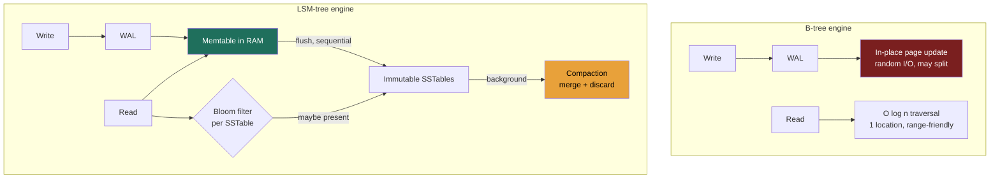
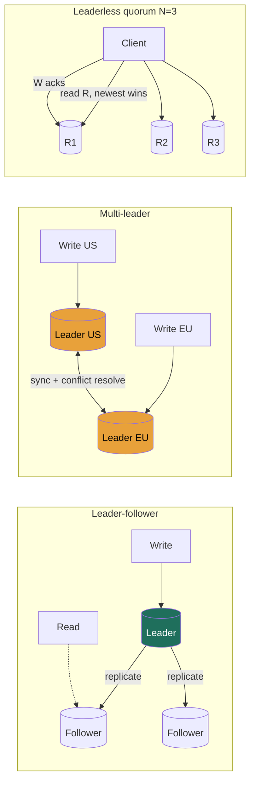

# Module 2 — Fundamentals & Trade-offs (Part 2)
### Lessons 2.3 – 2.4 · taught at Director altitude

---

# Lesson 2.3 — Indexing (B-tree vs. LSM-tree, the write/read trade)

### Learning objectives
- Explain why indexes exist and the fundamental read / write / space trade-off they impose.
- Contrast **B-tree** (read-optimized, in-place) with **LSM-tree** (write-optimized, append + compact).
- Match a storage engine to a workload, and connect it back to the database families in Lesson 2.2.
- Reason about secondary indexes and their cost, especially in distributed stores.

### Intuition first
An index is the **index at the back of a textbook.** Without it you scan every page (a full table scan, O(n)); with it you jump straight to the right page (O(log n)). But the index isn't free — every time you add content you must also update the index. **A B-tree is a meticulously maintained, always-sorted index that you edit in place** — superb for lookups, but each change is a careful, somewhat expensive edit. **An LSM-tree is jotting new entries on sticky notes (instant append) and periodically reorganizing them into the master index in big batches** (compaction) — superb for writes, but a lookup may have to check several stacks of notes before it finds the answer.

### Deep explanation
**Why index at all, and the unavoidable trade-off:** an index turns an O(n) scan into an O(log n) lookup. The cost: indexes **speed reads but slow writes** (every write must maintain every index) and **consume space.** This three-way tension — read amplification vs. write amplification vs. space amplification — is the entire subject.

**B-tree (and B+tree):** a balanced, sorted tree of fixed-size pages, updated **in place.**
- *Reads:* O(log n), predictable, and excellent for **range queries** (leaf nodes are linked in order).
- *Writes:* in-place updates cause **random I/O**, occasional **page splits** (write amplification), and require a **write-ahead log (WAL)** for crash durability.
- *Used by:* Postgres, MySQL/InnoDB, most relational engines. Read-optimized and operationally mature.

**LSM-tree (Log-Structured Merge):** optimized for write throughput.
- *Write path:* append to a WAL + insert into an in-memory sorted **memtable**; when it fills, flush it to an immutable on-disk **SSTable** as one **sequential** write (recall 1.4: sequential ≫ random).
- *Read path:* check memtable, then SSTables newest→oldest — potentially several files (**read amplification**). **Bloom filters** (Lesson 2.9) let a read skip SSTables that provably don't contain the key.
- *Compaction:* a background process merges SSTables, discarding overwritten and deleted keys. Strategy is a tunable knob: **size-tiered** (more write-optimized) vs **leveled** (more read- and space-optimized).
- *Used by:* Cassandra, RocksDB, LevelDB, HBase, Bigtable, ScyllaDB. Write-optimized.

**The core trade, stated cleanly:** B-tree pays in **write amplification + random I/O** to keep reads cheap; LSM pays in **read amplification + space amplification + background compaction** to make writes a cheap sequential append. So write-heavy workloads (logs, metrics, messaging, feeds) favor LSM; read-heavy transactional workloads favor B-tree.

**Secondary indexes — the hidden tax:** an index on a non-primary column. Each one **slows every write and costs space.** In distributed stores they get expensive and constrained — DynamoDB distinguishes **local** vs **global** secondary indexes (the global one is effectively another replicated table); Cassandra's secondary indexes are notoriously limited and you usually **denormalize into a second query-shaped table** instead.

**The operational point a Director should raise:** compaction is a **background tax** — it consumes CPU and disk I/O and can cause **latency spikes** and temporary space bloat. "LSM is fast at writes" is incomplete; the full statement is "fast writes, paid back later by compaction you must capacity-plan and monitor."

### Diagram — write and read paths

### Worked example — metrics ingestion vs. an orders table
- **Metrics/time-series ingest** (recall the ~700k writes/s from Lesson 1.3): overwhelmingly write-heavy, append-shaped, reads mostly over recent ranges → **LSM (Cassandra/Bigtable).** Sequential flushes absorb the write flood; recent-range reads stay in the upper SSTable levels; Bloom filters keep point-lookup read amplification in check.
- **Orders table** needing multi-row transactions, joins to customers/products, and ad-hoc reporting → **B-tree (Postgres).** Reads and integrity dominate; write rate is modest; in-place updates and rich indexing are exactly what you want.
The decision falls straight out of the **read:write ratio** plus the query shape — which is why you establish those in RESHADED's R step.

### Trade-offs table — storage engine / compaction strategy
| Engine | Write amp | Read amp | Space amp | Use when… |
|---|---|---|---|---|
| **B-tree** | higher (in-place, splits) | low (one location) | low | Read-heavy, transactional, range + ad-hoc queries |
| **LSM size-tiered** | low | higher | higher (transient) | Very write-heavy, throughput over read latency |
| **LSM leveled** | medium | medium | lower | Write-heavy but reads/space also matter |

### What interviewers probe here
- **"Why is Cassandra so fast at writes?"** — *Strong:* sequential append to memtable+WAL, deferred sorting/merging via compaction, no in-place random I/O. *Red flag:* "it's distributed" (that's orthogonal).
- **"What does LSM cost you on reads, and how is it mitigated?"** — *Strong:* read amplification across SSTables, mitigated by Bloom filters and leveled compaction. *Red flag:* believing LSM reads are as cheap as writes.
- **"What's the operational cost of compaction?"** — *Strong:* CPU/IO load, latency spikes, transient space bloat — must be capacity-planned. *Red flag:* unaware it exists.

### Common mistakes / misconceptions
- Treating indexes as free — every index taxes writes and storage.
- Believing LSM is universally superior; it trades read/space/compaction cost for write speed.
- Over-indexing a write-heavy table (each secondary index multiplies write cost).
- Ignoring compaction as an operational concern.
- Forgetting that distributed secondary indexes are expensive/limited — denormalize instead.

### Practice questions
**Q1.** Your write throughput is fine but read latency is spiky on a Cassandra table. What's likely and what would you tune?
> *Model:* Reads are touching many SSTables (high read amplification), worsened by size-tiered compaction falling behind. Tune toward **leveled compaction** (fewer SSTables per read, better read/space at the cost of more write amplification), verify Bloom filter sizing, and ensure the data is modeled so reads hit a single partition. Confirm compaction isn't starved for I/O.

**Q2.** Why does an LSM engine pair so naturally with the "sequential ≫ random" insight from Lesson 1.4?
> *Model:* LSM deliberately converts random user writes into large **sequential** disk writes (flush) and large sequential merges (compaction), avoiding the random-I/O penalty that dominates write cost on disks. It pays this back as deferred, batched, sequential compaction work — trading expensive random I/O now for cheaper sequential I/O later.

**Q3.** When would you accept B-tree's higher write amplification on purpose?
> *Model:* When reads and consistency dominate: transactional systems with ad-hoc queries, range scans, and strong integrity needs at moderate write volume. The predictable single-location reads and mature transactional support outweigh the in-place write cost — exactly the relational-store case.

### Key takeaways
- Indexes trade faster reads for slower writes and more space — never free.
- B-tree: in-place, read-optimized, range-friendly, random write I/O → relational/transactional.
- LSM: append + compact, write-optimized, sequential I/O → write-heavy at scale (Cassandra/RocksDB).
- LSM read cost is tamed by Bloom filters + leveled compaction; compaction is an operational tax.
- Choose the engine from the read:write ratio and query shape — secondary indexes cost real money per write.

> **Spaced-repetition recap:** Textbook index. B-tree = sorted, in-place, cheap reads/pricier writes. LSM = sticky-notes + batched reorg (compaction), cheap sequential writes/pricier reads (Bloom filters help). Match engine to read:write ratio.

---

# Lesson 2.4 — Replication (leader-follower, multi-leader, leaderless)

### Learning objectives
- State the four reasons we replicate, and distinguish replication from partitioning.
- Contrast the three topologies and their consistency / availability / complexity trade-offs.
- Reason about synchronous vs asynchronous replication and the user-facing effects of replication lag.
- Engineer around failover hazards (split-brain, lost writes) and set up the CAP discussion (2.7) and quorums (2.8).

### Intuition first
Replication is keeping **multiple synchronized copies** of your data. **Leader-follower:** one authoritative scribe (the leader) writes the master copy and dictates every change to assistants (followers) who hold read-only copies. **Multi-leader:** several scribes in different offices can all accept edits and then reconcile — with the obvious hazard that two of them edit the same line (a conflict). **Leaderless:** nobody's in charge; you write the same change to several copies and, when reading, consult several and take a majority view of the truth (the Dynamo style).

### Deep explanation
**Why replicate (and a clean distinction):** (1) **availability** — survive node/region loss; (2) **read scaling** — spread reads across copies; (3) **latency** — keep copies near users; (4) **durability**. *Replication = the same data in many places; partitioning (Lesson 2.5) = different data split across places.* Most real systems do both.

**Leader-follower (single-leader / primary-replica)** — the default for relational systems. All writes go to the **leader**, which streams changes to **followers**; reads can be served by either.
- **Synchronous replication:** the leader waits for a follower's ack before confirming the write → stronger durability/consistency, but higher write latency, and a slow or dead synchronous follower **stalls writes.**
- **Asynchronous:** the leader confirms immediately and replicates in the background → low latency, high write availability, but **replication lag** (followers serve **stale reads**) and risk of **losing unreplicated writes** if the leader dies. Common compromise: **semi-synchronous** (one synchronous follower, the rest async).
- **Replication-lag anomalies and their fixes:** *read-your-writes* (you post, then read a lagging follower and don't see your post → route a user's reads to the leader or a known-current replica for a window); *monotonic reads* (time appears to go backwards across reads → pin a user to one replica); *consistent prefix* (causally-ordered writes appear out of order).
- **Failover is the hard part:** detect leader death (timeout tuning — too tight = false failovers, too loose = long outages), promote the **most up-to-date** follower, and prevent **split-brain** (two nodes both believing they're leader → fence with epochs/leases/quorum). Async failover can **lose** the old leader's unreplicated writes.

**Multi-leader** — several leaders accept writes (often one per region). Pro: low write latency in every region and survival of a region partition. Con: **write conflicts** when the same datum is edited in two leaders. Resolution strategies, weakest→strongest: **last-write-wins** by timestamp (simple but silently drops data), **version vectors** (detect concurrent edits), **CRDTs** (conflict-free merge for suitable data types), or **application-level merge**. Used in multi-DC databases, calendar/contact sync, and collaborative editing.

**Leaderless (Dynamo-style)** — no leader; a client or coordinator writes to **N** replicas and waits for **W** acks, and reads from **R** replicas, taking the newest. The **quorum rule W + R > N** guarantees a read set overlaps the latest write set (developed fully in Lesson 2.8). Node failure needs no failover — you just talk to whoever's up — and convergence is maintained by **read repair** (fix stale replicas on read) and **anti-entropy / hinted handoff** (background reconciliation). Used by Cassandra, DynamoDB, Riak. Offers **tunable consistency** by choosing N/W/R.

**The Director-level framing:** topology is a requirements decision. Single-region, transactional, integrity-first → **leader-follower**. Global low-latency writes that must survive partitions → **multi-leader** or **leaderless**, accepting conflict-resolution complexity. High availability with tunable consistency → **leaderless quorum**. The signal is naming the lag/conflict/failover cost you're taking on, not just the topology.

### Diagram — the three topologies

### Worked example — choosing topology from requirements
- **Read-heavy app (100:1) on Postgres:** **leader-follower** with several **async read replicas** to scale reads; serve most reads from followers, but route **read-your-writes** traffic (a user immediately re-reading their own change) to the leader for a short window. You accept bounded staleness on everyone else's reads as the price of cheap read scaling.
- **Globally-accepted writes that must survive a region cut** (e.g., the shopping cart that motivated Dynamo): **leaderless quorum**, AP-leaning, with conflict resolution (version vectors / merge — Amazon famously let a re-added deleted item win to avoid losing a sale). You accept conflict-handling complexity to get always-writable, partition-tolerant behavior.

### Trade-offs table — replication topology
| Topology | Write availability | Conflicts | Consistency | Complexity | Use when… |
|---|---|---|---|---|---|
| **Leader-follower** | writes need the leader (failover gap) | none (single writer) | strong at leader; lag on followers | low | Single-region, transactional, read scaling |
| **Multi-leader** | high (any region writes) | **yes** — must resolve | weak; converges | high | Multi-region low-latency writes |
| **Leaderless (quorum)** | high (no failover) | yes — read repair / vectors | **tunable** via N/W/R | medium-high | AP, high availability, tunable consistency |

### What interviewers probe here
- **"Sync or async replication — which and why?"** — *Strong:* async for write latency/availability *with* a named staleness/loss mitigation; sync (or semi-sync) where durability must be guaranteed. *Red flag:* picking one with no awareness of the trade.
- **"How do you give a user read-your-writes with read replicas?"** — *Strong:* route their own-data reads to the leader/current replica for a window, or track a write timestamp. *Red flag:* assuming followers are always current.
- **"What's split-brain and how do you prevent it?"** — *Strong:* two leaders after a bad failover; prevent with quorum/leases/fencing epochs. *Red flag:* never heard of it.
- **"Multi-leader — how do you resolve conflicts?"** — *Strong:* names LWW's data-loss risk and prefers version vectors/CRDTs/merge. *Red flag:* "last write wins" with no caveat.

### Common mistakes / misconceptions
- Assuming followers are always consistent with the leader (replication lag is real and user-visible).
- Conflating replication (copies of the same data) with partitioning (splitting different data).
- Choosing multi-leader without a conflict-resolution strategy.
- Thinking "more replicas = more consistency" — consistency comes from the quorum/sync config, not the count.
- Underestimating failover: detection tuning, lost writes, and split-brain are where outages actually happen.

### Practice questions
**Q1.** Your async follower is 30 seconds behind during a traffic spike. What breaks for users, and what do you do?
> *Model:* Stale reads — users may not see their own recent writes (read-your-writes broken) and counts/feeds lag. Mitigations: route a user's own-data reads to the leader for a short window after their write; cap acceptable lag and shed read-replica traffic (or fail over) when exceeded; for monotonic reads, pin a session to one replica. Longer term, add replica capacity or reduce write amplification.

**Q2.** Why doesn't leaderless replication need a failover procedure?
> *Model:* There's no single leader to lose. With N replicas and quorum W/R, a request simply uses whichever replicas are reachable; a downed node reduces available replicas but the quorum can still be met. Convergence is restored later by read repair and hinted handoff. You trade failover complexity for quorum-tuning and conflict-resolution complexity.

**Q3.** A team proposes multi-leader across US and EU "for low latency." What do you make them answer first?
> *Model:* How will they resolve concurrent conflicting writes to the same key, and is that data conflict-tolerant? If LWW is acceptable they must accept silent data loss; otherwise they need version vectors, CRDTs, or app-merge — which only some data models support. If most data is single-region-owned (users mostly write their home region), partition ownership by region to sidestep most conflicts. Multi-leader without a conflict answer is a trap.

### Key takeaways
- We replicate for availability, read scale, latency, and durability; replication ≠ partitioning.
- Leader-follower: one writer, simple, strong at leader but followers lag; failover (split-brain, lost writes) is the hard part.
- Sync = durable/consistent but latency-bound; async = fast/available but stale + loss risk; semi-sync compromises.
- Multi-leader buys local writes at the cost of conflict resolution (avoid bare LWW).
- Leaderless quorum (W+R>N) gives high availability + tunable consistency with no failover — at the price of read-repair/conflict complexity.

> **Spaced-repetition recap:** One scribe (leader-follower: simple, lag, failover risk), many scribes (multi-leader: local writes, conflicts), or majority-vote (leaderless: W+R>N, tunable, no failover). Async is fast but stale; name the lag/conflict/failover cost you're accepting.

---

*End of Module 2, Part 2. Next: 2.5 Partitioning/sharding (+ Sharding visualizer) and 2.6 Consistent hashing (+ Consistent Hashing ring) — the first two interactive widgets of the module.*
