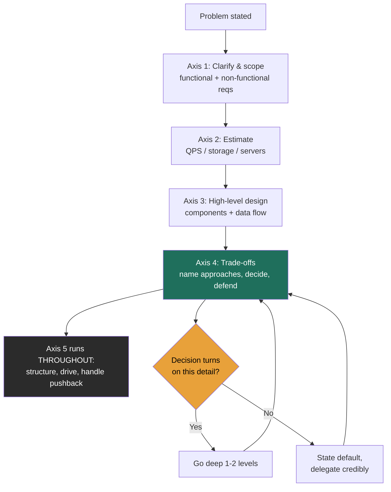

### Learning objectives
- Name the 5 axes every system-design interview scores on, and how the weighting shifts for a Director vs. a staff IC.
- Operate the **altitude dial** — decide in real time when to go deep and when to delegate.
- Convert what you already know into *trade-off statements* that read as leadership, not operation.
- Self-diagnose the two failure modes (too high / too deep) mid-answer and correct.

### Intuition first
A system-design interview is not an exam; it's a **design review you've been asked to chair.** The senior engineers across the table aren't checking whether you memorized an answer key — they're deciding whether they'd want you running the review when the architecture actually matters. Think of it as a pilot's check ride: nobody cares that you can recite the manual; they care that you fly at the right altitude and make the right call when the weather turns.

### Deep explanation — the 5 axes
Every interviewer is scoring some weighted blend of these. The numbers in brackets are *rough relative weights at Director level* (they invert for a staff IC).

1. **Requirements & scoping** *(heavy)* — Do you clarify before you build? Do you cut scope to a defensible core (3–5 features) instead of trying to boil the ocean?
2. **Estimation & quantification** *(medium)* — Do you reason in numbers well enough to know whether this fits on 10 servers or 10,000? (Lesson 1.3.)
3. **High-level design & decomposition** *(medium)* — Can you break the system into components with clear responsibilities and a clean data flow? Necessary, but has *diminishing returns* — past a point, more boxes is not more signal.
4. **Trade-off depth & decision-making** *(heaviest)* — Can you name 2–3 viable approaches, state pros/cons, **decide**, and defend the decision against requirements, cost, and risk? This is where the offer is won or lost at Director level.
5. **Communication & leadership signal** *(heavy)* — Do you drive the conversation, structure your thinking out loud, handle "why not X?" without getting defensive, and know when to say "I'd delegate that benchmark"?

**The weighting shift that trips people up:** A staff IC is carried by axes 3 and 4 with *deep* mechanics. A Director is carried by 1, 4, and 5 — framing, trade-off judgment, and the leadership texture of how you reason. Deep mechanics on axis 3 are *necessary but not sufficient*, and over-investing there actively costs you ("why is this Director hand-tuning a B-tree?").

**The altitude dial — the single most useful habit.** At every decision point, ask yourself: *"Does the decision actually turn on this detail?"*
- **Yes** → go down one or two levels and resolve it. ("Strong vs. eventual consistency here changes the whole data layer, so let me reason it through.")
- **No** → state your default and delegate credibly. ("Exact compaction tuning won't change the architecture — I'd have the storage team benchmark it; my prior is leveled compaction because the workload is read-heavy.")

That second sentence is worth more than ten minutes of correct B-tree math, because it shows judgment, trust in your org, and awareness of your own altitude — simultaneously.

### Diagram — interview flow and the altitude band

### Worked example — the first 90 seconds, done at altitude
Prompt: *"Design a URL shortener."*

A staff-IC opening dives into hash functions. A **Director-altitude** opening sounds like:

> "Before I design, three questions. One — is this an internal redirect service or a public product like Bitly, because analytics and abuse-prevention change the architecture? Two — what's the read:write ratio I should assume; I'd expect heavily read-skewed, maybe 100:1, which pushes me toward aggressive caching. Three — what's the availability bar; if it's a 99.99% public service, the redirect path has to survive a region loss. Assuming public product, 100:1 reads, four-nines: my core scope is create-short-URL, redirect, and basic analytics; I'll treat custom aliases and expiry as stretch. Let me size it."

That answer scored axes 1, 2, and 5 in 90 seconds without designing a single component — and it pre-committed the trade-offs that make the rest of the conversation defensible.

### Trade-offs table — how to spend a marginal 5 minutes
| Spend it on… | Pro | Con | Use when… |
|---|---|---|---|
| **Deeper mechanics** on a chosen component | Demonstrates real depth | Reads as "in the weeds"; burns clock | The interviewer explicitly probes it, or the decision hinges on it |
| **Naming another alternative** + its trade-off | Highest Director signal; shows breadth + judgment | Can feel like breadth-without-depth if overdone | Default move when you've made a choice — pre-empt "why not X?" |
| **Re-validating against requirements/SLOs** | Shows you stress your own design (axis 4) | Can stall momentum if done too early | After the high-level design lands, before deep-diving |

### What interviewers probe here
- **"Why not X instead?"** — *Strong:* "I considered X; I rejected it because [cost/operability/latency], though if [constraint] changed I'd revisit." *Red flag:* you can't name a single downside of your own choice.
- **"How does this scale 10×?"** — *Strong:* you point to the specific component that breaks first and the lever you'd pull. *Red flag:* "we'd add more servers" with no mechanism.
- **"What breaks first under load?"** — *Strong:* a confident, specific answer with a number. *Red flag:* surprise that anything would break.

### Common mistakes / misconceptions
- Treating it as a quiz with a right answer (it's a judgment assessment).
- Jumping to components before scoping — skips the heaviest Director axis.
- Never actually *deciding* — laying out options is half the job; committing and defending is the other half.
- Going deep too early, then running out of clock before the trade-off discussion.
- Ignoring cost and operability — Directors own budgets and on-call, and interviewers know it.

### Practice questions
**Q1.** An interviewer says, *"You've described three components. Which one keeps you up at night?"* What makes a strong answer?
> *Model:* Name the component on the critical availability/latency path (e.g., the redirect/read path for a URL shortener), explain the specific failure (cache stampede, region loss), and state your mitigation and its cost. The signal is that you reason about *failure*, not just happy path, and you tie it to a number/SLO.

**Q2.** You realize 8 minutes in that you've been hand-deriving a hashing scheme. How do you recover without looking lost?
> *Model:* Zoom out explicitly: "I'm going deeper than this decision warrants — the key point is collision-free unique IDs, which I'd solve with [approach]; the tuning is a detail I'd delegate. Let me get back to the system." Naming your own altitude correction is itself a strong signal.

**Q3.** Why is "we'll scale horizontally" a red flag even when it's technically correct?
> *Model:* Because it asserts an outcome without a mechanism. The signal interviewers want is *which* component scales horizontally, what makes it able to (statelessness, partitionable key), and what new problem that creates (coordination, hot shards). The mechanism is the leadership content; the conclusion isn't.

### Key takeaways
- Five axes: scope, estimate, design, **trade-offs**, communicate — and at Director level trade-offs and communication carry the most weight.
- Implementation depth has diminishing returns; past a point it's an anti-signal.
- The altitude dial — "does the decision turn on this?" — is your real-time depth control.
- "Delegate credibly" with a stated prior beats grinding the detail yourself.
- Never present a choice you can't critique; pre-empting "why not X?" is the move.

> **Spaced-repetition recap:** The round is a design review you're chairing. Score is mostly trade-off judgment and communication, not mechanics. Control depth with one question — *does the decision turn on this?* — and delegate the rest with a stated prior.

---
