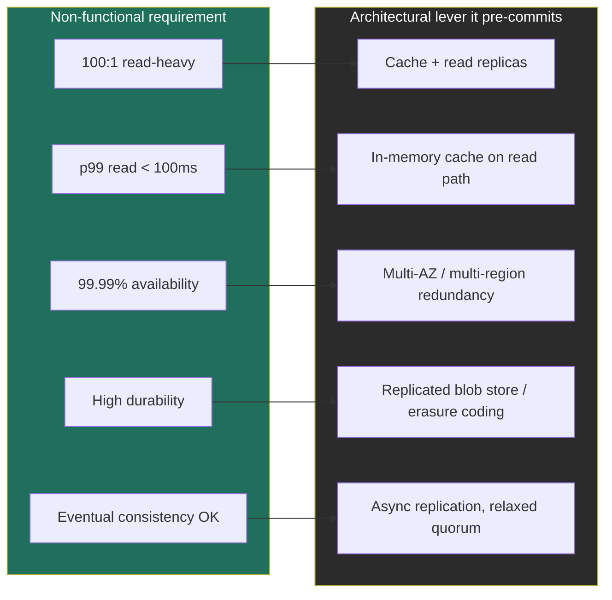

### Learning objectives
- Cleanly separate functional (what it does) from non-functional (how well) requirements.
- Run the clarification dialogue that scopes the entire problem in 2-3 minutes.
- Translate fuzzy non-functionals into **measurable SLOs** (p99 latency, availability nines, durability, consistency).
- Make each requirement *pre-commit* a downstream architectural decision.

### Intuition first
**Functional requirements are the verbs; non-functional requirements are the adjectives.** "Post a tweet," "fetch a feed", verbs. "Fast," "always-on," "durable," "consistent", adjectives. Building a house: functional is "three bedrooms and a kitchen"; non-functional is "survives an earthquake, heats through winter, costs under budget." The adjectives are what actually drive the engineering, and the cost.

### Deep explanation
**Functional reqs, and the art of cutting them.** List the core features, then *visibly scope down* to 3-5. Saying "I'll treat search and DMs as out of scope for v1" is a strong leadership signal, it shows you prioritize. The trap is enumerating twenty features to look thorough; it reads as inability to focus.

**Non-functional reqs, and how to quantify each one (banish "fast" and "scalable"):**

- **Availability**, in nines. Internalize the downtime budget:

| Availability | Downtime / year | Downtime / month |
|---|---|---|
| 99.9% ("three nines") | ~8.76 hours | ~43 min |
| 99.99% ("four nines") | ~52.6 min | ~4.3 min |
| 99.999% ("five nines") | ~5.26 min | ~26 sec |

- **Latency**, always as a percentile, never a mean. State a target: "p99 read < 100 ms, p99 write < 300 ms." p99/p999 is what users actually feel; the mean hides the pain.
- **Consistency**, strong vs. eventual, *per feature*. Tie it to semantics: a follower count can be eventually consistent; a bank balance cannot.
- **Durability**, probability you never lose committed data. S3 advertises 11 nines (99.999999999%). Say "I need high durability for uploaded media → replicated blob store / erasure coding," not "don't lose data."
- **Scalability**, the target scale *and* the growth curve. "100M DAU today, planning for 3× in 18 months."
- **Throughput, cost, security/compliance**, name the ones that bind. At Director level, *cost* is rarely optional to mention.

**The read:write ratio is a requirement, not a detail.** It's the single number that most shapes the architecture. 100:1 read-heavy → cache + read replicas, optimize the read path. Write-heavy (logging, metrics) → LSM-tree storage, batching, a log/queue front door. Always ask for it; if they won't say, state your assumption.

**The move that earns signal:** make every NFR drive a lever, out loud.
> "p99 read under 100 ms with 100:1 read skew means I'm putting a cache in front of the database. The trade-off is staleness, bounded by a short TTL, which is acceptable here because the data tolerates a few seconds of lag. If this were account balances, I'd reject the cache and pay the latency."

### Diagram: requirement → architectural lever

### Worked example: Twitter timeline requirements
- **Functional (cut to core):** post a tweet, follow a user, fetch home timeline. *Out of scope for v1:* search, DMs, ads.
- **Non-functional, quantified:**
  - Read:write ≈ several hundred to one (timeline reads vastly outnumber posts) → optimize reads, precompute timelines.
  - p99 home-timeline load < 200 ms → fan-out-on-write (precomputed feeds) over fan-out-on-read for most users.
  - Availability 99.99% → multi-region; reads must survive a region loss.
  - Consistency: eventual is fine, a tweet appearing in a follower's feed a second late is acceptable → async fan-out.
- Notice every NFR *already pre-committed* a major design decision before any boxes were drawn. That's the point.

### Trade-offs table: consistency level per feature
| Option | Pro | Con | Use when… |
|---|---|---|---|
| **Strong consistency** | Correct reads always; simple mental model | Higher latency; lower availability under partition | Money, inventory, auth, uniqueness |
| **Eventual consistency** | Low latency, high availability, cheap | Reads can be stale; client must tolerate it | Feeds, counts, likes, view counters |
| **Causal / read-your-writes** | Per-user correctness without full strong cost | More complex; needs session/versioning | Comments, chat, "I should see my own edit" |

### What interviewers probe here
- **"What availability do you actually need?"**, *Strong:* you give a number, justify it from the product (revenue impact of downtime), and design to it. *Red flag:* "as high as possible" (ignores cost/complexity trade-off, Directors don't say this).
- **"Is eventual consistency acceptable here?"**, *Strong:* answer *per feature* with the semantic reason. *Red flag:* one blanket answer for the whole system.
- **"What's your read:write ratio and why does it matter?"**, *Strong:* a number plus the lever it pulls. *Red flag:* treating it as trivia rather than the architecture-shaping input it is.

### Common mistakes / misconceptions
- Listing every feature instead of scoping to a defensible core.
- Vague NFRs, "fast," "highly scalable", with no number.
- Stating NFRs but never connecting them to a decision (they're not decoration).
- Promising strong consistency everywhere, expensive and usually unnecessary.
- Forgetting cost and compliance, which Directors are expected to own.

### Practice questions
**Q1.** Convert "the system should be reliable and fast" into interview-grade requirements.
> *Model:* "Reliable" → availability target (e.g., 99.99%, ~53 min/yr) + durability target (e.g., no committed data loss, 11 nines for stored media). "Fast" → percentile latency targets (p99 read < 100 ms, p99 write < 300 ms). Then I'd state which matters most given the product and design to the binding one.

**Q2.** A product is write-heavy (IoT telemetry, 50:1 writes:reads). How does that flip your defaults vs. a read-heavy product?
> *Model:* De-emphasize caching (low read demand), prioritize ingest throughput: a log/queue (Kafka) as the front door to absorb spikes, LSM-tree storage (Cassandra) for cheap high-volume writes, batching, and time-based partitioning. The read path can tolerate higher latency, so I trade read optimization for write durability and throughput.

**Q3.** Why is mean latency a misleading SLO?
> *Model:* The mean hides the tail. A 20 ms mean can coexist with a 2 s p99, and the p99 is what a meaningful fraction of users experience every session. SLOs are set on percentiles (p99/p999) because tail latency is what damages perceived reliability and what fans out into cascading timeouts at scale.

### Key takeaways
- Functional = verbs (and cut to 3-5); non-functional = adjectives (and quantify every one).
- Availability lives in nines; know the downtime budget cold.
- Latency is a percentile, never a mean.
- Read:write ratio is the most architecture-shaping requirement, always get it.
- Make each requirement *pre-commit* a lever, out loud, that's the signal.

> **Spaced-repetition recap:** Verbs vs. adjectives. Scope the verbs to a core; quantify every adjective (nines, p99, durability, consistency-per-feature). Get the read:write ratio early, it pre-commits half your design.

---
