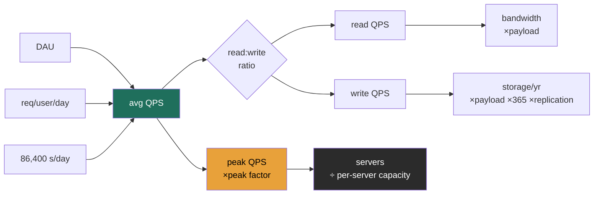

import EstimationCalculator from '@components/widgets/EstimationCalculator.jsx';

### Learning objectives
- Produce QPS, storage, bandwidth, and server-count estimates in under three minutes.
- Use power-of-ten shortcuts and round aggressively without losing the order of magnitude.
- Apply peak-to-average multipliers and the read:write ratio correctly.
- Frame estimation as *"enough math to make a defensible call,"* not accounting.

### Intuition first
Estimation is a **feasibility sniff test**, not a spreadsheet. A structural engineer eyeballs whether a beam is roughly right before running detailed calcs, you want the order of magnitude, fast. At Director level the exact number is almost irrelevant; what matters is *"does this fit on 10 servers or 10,000?"*, because the answer changes the entire architecture. Being off by 2× is fine. Being off by 100× is the mistake.

### Deep explanation
**Numbers to memorize (so you don't burn clock deriving them):**
- Seconds in a day = 86,400 ≈ **10⁵** (round to 100k, a clean, slightly conservative denominator).
- Powers of ten for bytes: KB = 10³, MB = 10⁶, GB = 10⁹, TB = 10¹², PB = 10¹⁵.
- A "typical" commodity server handles on the order of **1k simple requests/sec** (state this assumption, it varies 10× by workload).

**The four estimates, in order:**

1. **QPS (queries/sec).**
   `avg QPS = DAU × requests-per-user-per-day ÷ 86,400`
   Then `peak QPS = avg QPS × peak factor` (use **2-10×**; spiky/event-driven systems higher). Split into read vs. write with the read:write ratio.

2. **Storage.**
   `storage/day = writes-per-day × payload-size`
   `storage/year = storage/day × 365 × replication factor`
   Storage is driven by **writes**, not reads, a common slip.

3. **Bandwidth.**
   `egress ≈ read QPS × payload`, `ingress ≈ write QPS × payload`. For media-heavy systems this, not QPS, is often the binding constraint and the dominant cost.

4. **Servers.**
   `servers ≈ peak QPS ÷ per-server capacity`. This is the number that tells you whether you're building a small fleet or a hyperscale system.

**Worked numeric example, a Twitter-scale write path (illustrative; assumptions stated):**
- Assume 200M DAU, each posts 2 tweets/day → 400M tweets/day.
- Write QPS = 400M ÷ 86,400 ≈ **4.6k/s** avg; peak ×3 ≈ **~14k/s**.
- Read:write 100:1 → read QPS ≈ **460k/s** avg; peak ≈ **~1.4M/s**.
- Storage: 400M tweets × ~300 bytes (text + metadata) ≈ **120 GB/day** → ~44 TB/yr; ×3 replication ≈ **~130 TB/yr** of tweet text. (Media would dwarf this, flag it, don't compute it.)
- Read fleet: 1.4M/s ÷ ~5k req/s per cache node ≈ **~280 cache nodes** on the read path.

The Director-level point isn't the digits, it's the conclusion: *reads dominate by 100×, so the architecture lives or dies on the read/cache path, and text storage is trivial while media is the real cost.* The math exists to justify that sentence.

### Diagram: estimation pipeline

<EstimationCalculator client:load />

### Interactive artifact
**→ Estimation Calculator** (separate React widget). Adjust DAU, requests/user/day, payload, read:write ratio, peak factor, replication, and per-server capacity; it shows avg/peak QPS, read/write split, storage/year, bandwidth, and server count, with the formula under each output and three real-system presets. Use it to build the muscle: change one input, predict the output, then check.

### Trade-offs table: which estimation method to lead with
| Method | Pro | Con | Use when… |
|---|---|---|---|
| **Top-down** (from DAU) | Fast; interviewer usually gives you DAU | Sensitive to the req/user assumption | The default, almost always start here |
| **Bottom-up** (from per-server capacity) | Grounds the answer in real hardware limits | Needs a capacity assumption you must defend | Sizing the fleet, or sanity-checking top-down |
| **Comparable systems** ("Twitter does ~X") | Instant credibility if the number's right | Dangerous if you misremember; looks like bluffing | As a *cross-check*, never as the sole basis |

### What interviewers probe here
- **"How did you get that number?"**, *Strong:* you show the chain and name each assumption. *Red flag:* a number with no derivation.
- **"Is that peak or average?"**, *Strong:* you already distinguished them and stated your peak factor. *Red flag:* you don't know which one you computed.
- **"What dominates your storage / cost?"**, *Strong:* you identify the driver (media, not text) without recomputing. *Red flag:* treating all bytes as equal.

### Common mistakes / misconceptions
- Forgetting the peak multiplier and designing to average load.
- Driving storage off reads instead of writes.
- Forgetting replication (×3 is common) in the storage total.
- Mixing bits and bytes, or losing a factor of 1,000 between MB/GB/TB.
- Over-precision, computing 4,629.6 QPS when "~5k" is the answer and the rounding *is* the skill.
- Analysis paralysis, spending five minutes here; three is the budget.

### Practice questions
**Q1.** Estimate daily storage for a photo service: 50M DAU, each uploads 2 photos/day at 1.5 MB each.
> *Model:* 50M × 2 = 100M photos/day × 1.5 MB = **150 TB/day** raw; with ×3 replication ≈ **450 TB/day**; ~164 PB/yr replicated. Conclusion that matters: this is a *blob-store + CDN* problem dominated by storage and egress cost, not a QPS problem.

**Q2.** A chat app has 500M DAU sending 40 messages/day. Average and peak write QPS?
> *Model:* 500M × 40 = 20B msgs/day ÷ 86,400 ≈ **~230k/s** avg. Peak ×3 ≈ **~700k/s**. Conclusion: write-heavy, so a partitioned log/queue front door and LSM-tree storage, not a read-cache architecture.

**Q3.** Why round 86,400 to 100,000?
> *Model:* It's within ~16%, far inside back-of-envelope tolerance, and makes QPS = DAU × req/user ÷ 10⁵ a one-step mental division. It also rounds the *denominator up*, so the QPS estimate is mildly conservative, which is the safe direction for capacity planning.

### Key takeaways
- Estimation answers one question: *small fleet or hyperscale?* Order of magnitude is the deliverable.
- QPS = DAU × req/user ÷ 86,400 (≈10⁵); then apply peak factor and read:write split.
- Storage is driven by **writes** × payload × retention × replication.
- For media systems, **bandwidth/egress** is often the binding constraint, not QPS.
- Round aggressively, state every assumption, and spend ≤3 minutes, precision here is an anti-signal.

> **Spaced-repetition recap:** Estimation is a feasibility sniff test. QPS from DAU and 10⁵; peak ×2-10; storage from writes; servers from peak ÷ capacity. The number exists only to justify one architectural sentence.
