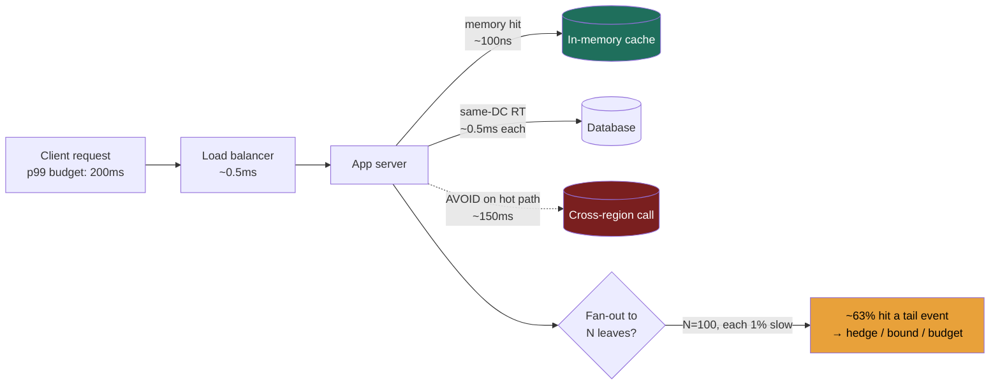

import LatencyVisualizer from '@components/widgets/LatencyVisualizer.jsx';

### Learning objectives
- Recall the canonical latency ladder (L1 → cross-continent) by *order of magnitude*, not exact figure.
- Convert those numbers into the three or four architectural reflexes they imply.
- Reason about **tail-latency amplification** when a request fans out.
- Spend a latency *budget* (p99) across a request path out loud, the way a Director would.

### Intuition first
The latency numbers are a **map of distances inside the computer.** Reading from a CPU cache is stepping into the next room; reading from RAM is walking down the hall; hitting an SSD is a drive across town; a same-datacenter network round trip is a flight to the next city; a cross-continent call is a trip around the world. You don't memorize the mileage, you internalize that *some destinations are absurdly farther than others*, so you design routes that avoid the far ones on the hot path.

### Deep explanation: the canonical ladder
These are the widely-cited "Jeff Dean" figures. Exact values have improved (NVMe is faster than the classic SSD number, etc.), but **interviewers expect the ratios**, and the ratios are what drive design:

| Operation | Latency | ≈ orders of magnitude vs RAM |
|---|---|---|
| L1 cache reference | 0.5 ns |, |
| Branch mispredict | 5 ns |, |
| L2 cache reference | 7 ns |, |
| Mutex lock/unlock | 25 ns |, |
| **Main memory (RAM) reference** | **100 ns** | **baseline (1×)** |
| Compress 1 KB (Snappy) | ~2-3 µs | ~25× |
| Send 1 KB over 1 Gbps network | ~10 µs | ~100× |
| SSD random read (4 KB) | ~150 µs | ~1,500× |
| Read 1 MB sequentially from memory | ~250 µs | ~2,500× |
| **Same-datacenter round trip** | **~500 µs** | **~5,000×** |
| Read 1 MB sequentially from SSD | ~1 ms | ~10,000× |
| HDD disk seek | ~10 ms | ~100,000× |
| Read 1 MB sequentially from HDD | ~20 ms | ~200,000× |
| **Cross-continent round trip** | **~150 ms** | **~1,500,000×** |

**The four reflexes that fall out of this table** (this is the actual interview content):

1. **Memory is ~5,000× faster than a network round trip → cache aggressively and minimize hops.** Every avoided same-DC round trip is worth ~5,000 memory reads.
2. **Cross-region is ~150 ms → never put a synchronous cross-region call on the request path.** Replicate data near users; do cross-region work async. One synchronous transatlantic hop blows most user-facing p99 budgets by itself.
3. **Random disk I/O (~10 ms HDD) is catastrophic on the hot path → batch into sequential I/O.** This is *why* LSM-trees exist (turn random writes into sequential), and why the SSD era reshaped database design.
4. **Sequential >> random, everywhere.** Sequential SSD read of 1 MB (~1 ms) vs. a single random SSD read (~150 µs) means large sequential scans are cheap per byte, design for them.

**Tail-latency amplification, the senior insight.** Your service's p99 is assembled from your *dependencies'* p99s. If a single user request fans out to **100 leaf services in parallel**, and each has just a **1% chance** of a slow (p99) response, then the probability the request waits on *at least one* slow leaf is:

> 1 − (0.99)¹⁰⁰ ≈ **63%**

So a majority of requests inherit a tail-latency event even though each dependency is "99% fast." This is the core result of Dean & Barroso's *The Tail at Scale*. Mitigations a Director should name: **hedged requests** (send a duplicate after a delay, take the first response), **bounding fan-out**, **p99-aware load balancing**, and **request budgets** that fail fast rather than wait.

### Diagram: where a request spends its budget

<LatencyVisualizer client:load />

### Interactive artifact
**→ Latency Numbers visualizer** (separate React widget). Log-scale bars from L1 to cross-continent, color-coded by tier (CPU / memory / storage / network), with a toggle to a **"human scale"** where 1 ns = 1 second, so RAM becomes ~1.5 minutes, a same-DC round trip ~6 days, and a cross-continent round trip ~5 years. That mapping is what makes the orders of magnitude stick.

### Worked example: spending a 150 ms p99 budget
You're asked to design a product page that must render at p99 < 150 ms. You reason out loud:
- DNS + TLS + LB: ~20 ms (mostly the user's network, partly yours).
- App needs profile + inventory + recommendations. *Naïvely sequential:* 3 same-DC calls × ~0.5 ms is trivial, but each backend itself queries storage. If recommendations does a cross-region read, that's ~150 ms alone → **budget blown**. So: pin a recommendations replica in-region, or precompute and cache.
- Inventory must be fresh → DB read (~few ms). Profile is cacheable → memory (~µs).
- **Decision:** parallelize the three fetches, cache profile, keep recommendations in-region with a precomputed fallback, set a 40 ms per-dependency timeout with a degraded response (hide recs) rather than miss the budget.
That paragraph, turning the ladder into a spent budget with a graceful-degradation fallback, is exactly the Director-level signal.

### Trade-offs table: where to put hot read data
| Option | Typical latency | Pro | Con | Use when… |
|---|---|---|---|---|
| **In-memory cache (Redis/local)** | ~100 ns - ~0.5 ms | Fastest; offloads DB | Staleness; cost; cache-coherence | Hot, read-heavy, staleness-tolerant data |
| **Read replica (same region)** | ~1-10 ms | Fresh-ish; scales reads | Replication lag; more infra | Reads that need near-current data |
| **CDN / edge** | ~10-50 ms to user | Cuts user-perceived latency globally | Only for cacheable/static-ish content | Media, static assets, geo-distributed users |

### What interviewers probe here
- **"How much slower is a cross-region call than a memory read?"**, *Strong:* "~150 ms vs ~100 ns, about a million-fold; I won't put it on the hot path." *Red flag:* treating network and memory as the same order.
- **"Why not just query the database for everything?"**, *Strong:* you contrast ~0.5 ms+ per round trip and disk cost vs. ~µs memory, and justify a cache with a staleness bound. *Red flag:* no awareness of the gap.
- **"Your service calls 50 backends, what's your p99?"**, *Strong:* you raise tail amplification and a mitigation. *Red flag:* you quote one backend's p99 as your own.

### Common mistakes / misconceptions
- Confusing µs and ms (a 1,000× error that wrecks every downstream estimate).
- Believing SSD ≈ RAM, it's ~1,000× slower for random reads.
- Ignoring tail amplification and assuming parallel fan-out is "free."
- Putting synchronous cross-region calls on the request path.
- Quoting exact nanoseconds as if they're precise, it's the ratios that matter.

### Practice questions
**Q1.** A request makes 10 sequential same-DC calls at ~0.5 ms each, plus one ~10 ms DB read. Rough p50, and how would you cut it?
> *Model:* ~10×0.5 + 10 = **~15 ms** p50. Cut it by parallelizing the 10 independent calls (collapse ~5 ms into ~0.5 ms) and caching the DB read. The tail matters more than this p50, bound each call with a timeout.

**Q2.** Why does turning random writes into sequential writes (LSM-tree) help so much?
> *Model:* Random disk I/O (~10 ms HDD seek, and write amplification even on SSD) dominates latency and wears the device; sequential I/O is orders of magnitude cheaper per byte. LSM-trees buffer writes in memory and flush them as large sequential runs, trading read amplification (must check multiple levels, mitigated by Bloom filters) for vastly cheaper writes, the right trade for write-heavy systems.

**Q3.** Translate "1 ns = 1 second" for RAM, same-DC round trip, and cross-continent round trip.
> *Model:* RAM 100 ns → **~1.5 min**; same-DC round trip 500 µs → **~6 days**; cross-continent 150 ms → **~4.75 years**. The point: a cross-region hop is "five years" of human time vs. RAM's "minute and a half", never on the hot path.

### Key takeaways
- Internalize ratios, not digits: RAM ~100 ns, same-DC RT ~0.5 ms (~5,000×), cross-continent ~150 ms (~1.5M×).
- Cache aggressively; every avoided round trip ≈ thousands of memory reads.
- Never put a synchronous cross-region call on the request path.
- Batch random I/O into sequential I/O, the reason LSM-trees exist.
- Tail amplifies on fan-out: 100 parallel calls at 1% slow → ~63% of requests hit a tail; hedge and bound.

> **Spaced-repetition recap:** Latency is a map of distances. RAM minutes, same-DC days, cross-continent years (at 1 ns = 1 s). Cache, avoid cross-region on the hot path, sequentialize I/O, and hedge fan-out.

---
