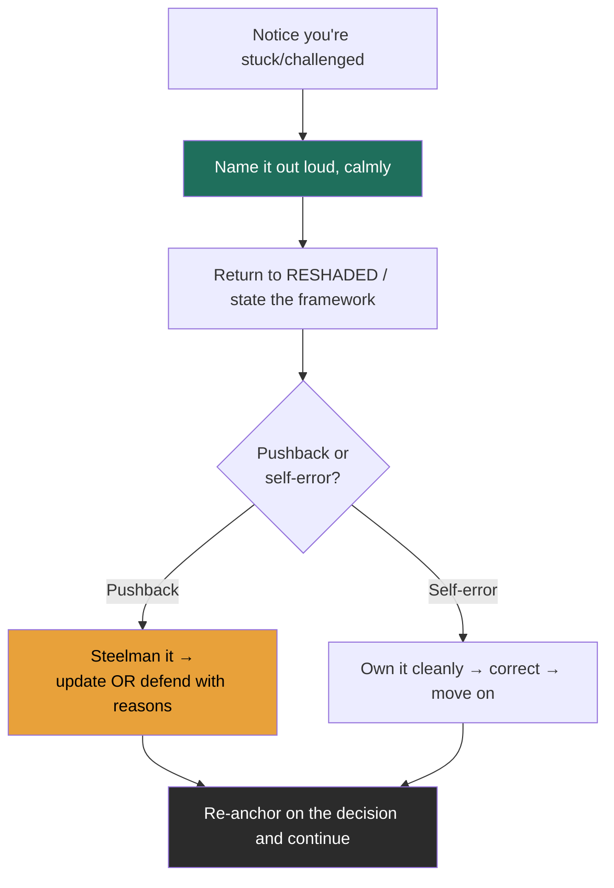

### Learning objectives
- Recognize the five interview failure modes the moment you're in one.
- Recover from each with a scripted move that *itself* reads as a leadership signal.
- Demonstrate system-level failure-mode thinking ("what breaks first?") as a strong signal.
- Handle interviewer pushback as a gift, not a threat.

### Intuition first
Every senior candidate stumbles, the offer turns on **how you recover, not whether you wobble.** Interviewers are watching for the same thing they'd watch for in a real incident: do you stay composed, name the problem, and drive to a decision? A clean recovery from a mistake is *more* convincing than a flawless run, because it shows them what you're like when something actually breaks. Recovering well is a leadership demo disguised as a stumble.

### Deep explanation: the five interview failure modes and the recovery move

**1. The freeze (blank on where to go next).**
*Recovery:* fall back to the framework, out loud. "Let me step back to RESHADED, I've done requirements and estimation; the next thing is the high-level components." Buy time legitimately with a clarifying question. The structure is your safety net; saying its name out loud signals method under pressure.

**2. The rabbit hole (too deep).**
*Recovery:* name your own altitude correction. "I'm deeper than this decision warrants. The key point is X; the tuning I'd delegate. Back to the system." Self-correcting altitude is a *positive* signal, not an admission of failure.

**3. The ramble (no structure, talking in circles).**
*Recovery:* stop yourself and impose structure. "Let me organize this, there are three components and one hard decision; I'll take them in order." Interviewers forgive a reset far more readily than a meandering monologue.

**4. The blank number (can't recall a figure mid-estimate).**
*Recovery:* give the method and a bound, never fake precision. "I don't have the exact SSD figure, but it's roughly 100× slower than RAM and 100× faster than HDD seek, call it low-hundreds of microseconds, which is enough to make the call." Reasoning to a bound *is* the skill.

**5. The pushback (interviewer challenges your choice).**
*Recovery:* treat it as a gift. Steelman their point first, "that's fair, the cost of my approach is…", then either **update** ("you're right, I'll switch to…") or **defend with reasons** ("I'll hold the line because, given the read-heavy requirement, the staleness is acceptable and the simplicity is worth it"). Both disagree-and-commit and reasoned defense are strong; defensiveness and instant capitulation are both weak. *Note:* pushback is often a probe, not a correction, they want to see how you reason, not necessarily that you were wrong.

**Two more worth a line each:** *over-scoping/out of time* → triage out loud ("given the clock, I'll deep-dive the read path and sketch the rest"); *realizing you erred earlier* → own it cleanly and correct ("I mis-stated the consistency model a minute ago, it should be eventual here; let me fix that"). Directors model exactly this behavior in real incident reviews.

**Demonstrating *system* failure-mode thinking (a strong signal in its own right).** When asked "what breaks first?" or "how does this fail?", reach for this menu:

| Failure mode | What it is | Mitigation to name |
|---|---|---|
| Single point of failure | One component whose loss takes the system down | Redundancy, multi-AZ, failover |
| Cascading failure | One overloaded service drags down its callers | Circuit breakers, bulkheads, timeouts |
| Thundering herd / cache stampede | Many clients hit the DB at once when a hot key expires | Request coalescing, jittered TTL, lock-on-miss |
| Retry storm | Failures trigger retries that amplify the outage | Exponential backoff + jitter, retry budgets |
| Hot shard / hot key | Skewed load concentrates on one partition | Better shard key, salting, dedicated cache |
| Replication lag | Followers fall behind, reads go stale | Read-your-writes routing, bounded staleness |

### Diagram: the live-recovery loop

### Worked example: recovering from a pushback
*Interviewer:* "You put a cache in front of the inventory DB. Won't users see stale stock and oversell?"

*Weak (capitulate):* "Good point, I'll remove the cache." *Weak (defensive):* "No, caches are standard."

*Strong:* "Fair challenge, for *displayed* stock, a few seconds of staleness is fine, so I'll keep the read cache there. But the **purchase path** can't be stale, so the decrement goes straight to the source of truth with a conditional/atomic check, and I'll reconcile the cache on write. So: cache the browse path, never the commit path. The trade-off is two read paths to maintain, which I accept to protect correctness where it matters.", You steelmanned, split the problem by consistency need, decided, and named the cost. That single exchange can carry an interview.

### Trade-offs table: responding to pushback
| Response | Pro | Con | Use when… |
|---|---|---|---|
| **Update your design** | Shows you integrate new info | Looks flaky if you flip on everything | Their point reveals a real gap you missed |
| **Defend with reasons** | Shows conviction + judgment | Looks rigid if the reasons are thin | Your choice still holds given the requirements |
| **Split the problem** | Often the *best*, resolves the tension | Requires quick decomposition | The concern applies to one path but not another |

### What interviewers probe here
- **"What's the single biggest risk in this design?"**, *Strong:* you name a specific failure mode and its blast radius. *Red flag:* "I think it's pretty solid."
- **"What happens when [component] dies at 3am?"**, *Strong:* failover behavior, what degrades, what the on-call sees. *Red flag:* you've never considered the failure path.
- *(Implicitly)* **how you handle being wrong**, *Strong:* clean ownership and correction. *Red flag:* defensiveness or visible rattling.

### Common mistakes / misconceptions
- Trying to project flawlessness instead of demonstrating composure under stress.
- Treating pushback as an attack rather than a probe.
- Capitulating instantly (no conviction) or refusing to budge (no humility), both lose.
- Only ever describing the happy path; never volunteering how it fails.
- Hiding an earlier mistake instead of owning it, interviewers usually noticed.

### Practice questions
**Q1.** You blank on the exact replication-lag number for an async follower. What do you say?
> *Model:* Give the method and a bound: "It depends on write volume and network, but typically milliseconds to low seconds under healthy conditions, spiking under load. That's why I'd route read-your-writes traffic to the leader and only send staleness-tolerant reads to followers." Bounded reasoning beats a fabricated precise figure.

**Q2.** Halfway through, you realize your estimate was off by 10×. Recover.
> *Model:* "I need to correct an earlier number, I dropped a factor of ten, so peak QPS is ~500k, not ~50k. That actually changes my conclusion: a single cache tier won't absorb it, so I'll shard the cache. Good that we caught it." Owning + showing the *consequence* turns the error into a signal of rigor.

**Q3.** The interviewer keeps pushing on a choice you're confident in. Are they telling you you're wrong?
> *Model:* Usually no, repeated pushing is often a probe to test whether you understand *why* you chose what you chose and whether you'll cave under pressure. Hold your reasoned position, acknowledge the cost, and offer the condition under which you'd change. If they reveal a genuine new constraint, *then* update.

### Key takeaways
- Recovery, not flawlessness, is what's scored, a clean recovery beats a perfect run.
- For every stumble there's a scripted move; the move itself signals leadership.
- Name the problem out loud and return to RESHADED, structure is your net.
- Pushback is a gift and usually a probe: steelman, then update *or* defend; often *split the problem*.
- Volunteer failure modes; "what breaks first?" should have a confident, specific answer.

> **Spaced-repetition recap:** You'll wobble; recover visibly. Name it, return to the framework, and for pushback: steelman → update, defend, or split. Always know what breaks first.
