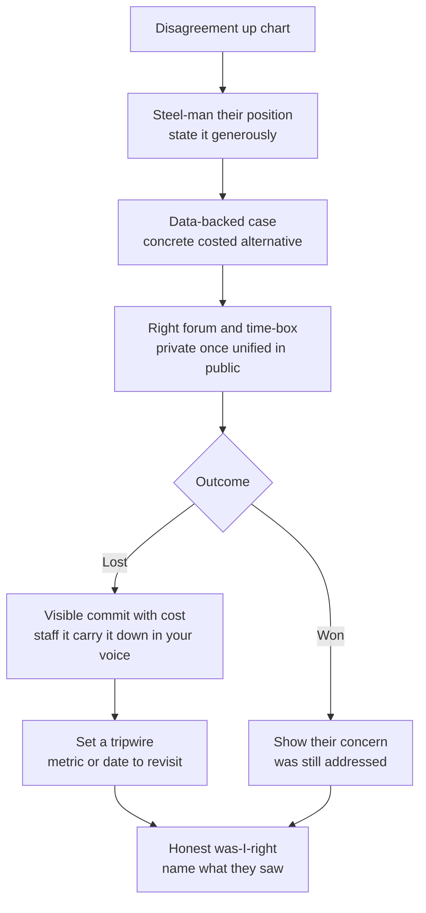

> This is the single most calibrating Director cluster in the loop. Amazon treats *Have Backbone, Disagree and Commit* and *Earn Trust* as veto-power leadership principles; Meta scores influence-without-authority as a core dimension; Google L8 panels probe stakeholder management explicitly. What makes it leveling is *who the counterpart is* and *what happens after the decision*. A disagreement with someone junior to you isn't backbone — it's management. The scored version is **up-chart**: you pushed back on a VP, a CTO, or a CEO, on a roadmap, an architecture, or a business bet. And the post-decision half is scored as hard as the disagreement itself — whether you committed for real, carried the message down in your own voice, and built a tripwire to revisit. "Leadership decided, not me" is commit theater, and it fails. The whole cluster is a test of whether you can be both *load-bearing in the room* and *aligned once the room decides*.

### Learning objectives
- Run the **up-chart disagreement** on explicit mechanics — steel-man the exec's position, bring a data-backed case with a concrete alternative, pick the forum and time-box the challenge, and resolve either way — delivered as STAR-L (Lesson 10.2).
- Answer **disagree-and-commit** so the *commit* is real: staffed your best people on it, carried it down in your own voice, and set a **tripwire** — the metric or date that triggers a revisit — the senior move that separates commit from obedience.
- Deliver **bad news to execs** in **SCQA / headline-first** (Lesson 10.2) — impact, new date or cost, decision needed, options *and* a recommendation in the same breath — and score the gap between *knowing and telling*.
- Resolve **senior-report conflict** by diagnosing the *type* first — technical, structural, or interpersonal — making the call if they can't converge, and fixing the *class* of conflict, not just the instance.
- Carry **business acumen inside** every answer: ROI, cost of delay, unit economics — because in 2026 this is scored here, not in a separate round.

### Intuition first
Think of a good diplomat inside a government she serves but doesn't run. She has no army — she can't *order* the other ministry to move — so her power is entirely the quality of her case and the trust she's banked. When she disagrees with the head of state, she does it in the private meeting, with evidence, having first stated his position back to him better than he stated it himself — because the fastest way to be dismissed is to argue against a position the other person doesn't hold. She makes her case once, hard. And when the decision goes against her, she doesn't sabotage it, leak her dissent, or tell her staff "I fought this, it's not on me." She implements it as her own — *and* quietly notes the one indicator that, if it moves, earns her the standing to reopen the question. That's the difference between a diplomat and a functionary: the functionary caves silently or undermines from below; the diplomat commits visibly *and* keeps a tripwire. Interviewers in this round are watching for the diplomat — someone who can lose an argument to a VP, carry the loss down without a trace of "this wasn't my call," and still have set the condition under which they'd revisit it.

---

## The questions

These are mostly past-event questions (STAR-L, Lesson 10.2), with the influence-without-authority and product-conflict variants often arriving as hypotheticals (Clarify → Principles → Options → Decide → Tripwires) and the bad-news variant as exec-comms (SCQA).

| Variant | What it's really testing |
|---|---|
| "Tell me about disagreeing with your VP/CEO/CTO. Were you right?" | Up-chart backbone with a data-backed case — and the honest "was I right" self-update. |
| "Tell me about committing to a decision you disagreed with. What did you tell your team?" | The *commit* half — real implementation, your-voice message down, a tripwire. |
| "How do you influence an org that doesn't report to you?" | Influence-without-authority — a mechanism you supply, not a PMO you delegate to. |
| "The CEO wants a feature for a customer by a date your team can't make." | Engineering-vs-product conflict — concede ground deliberately, quantify the debt, schedule the paydown. |
| "Two of your senior people are in conflict over ownership/architecture." | Diagnose the *type*, make the call, fix the class — not transfer someone as move one. |
| "Tell me about delivering bad news to execs. How long between knowing and telling?" | SCQA headline-first, options with a recommendation, and why your mechanisms didn't catch it sooner. |
| "A cross-org initiative you depended on stalled. How'd you unstick it? Worth it?" | Surgical escalation as one crisp decision request — plus a kill-vs-continue judgment. |
| "Defend a headcount/budget ask — or tell me about losing one." | Business case with the trade-off; the *losing* variant tests whether you stayed aligned. |

The merge: disagreement, commit, and conflict stories are **past-event** → **STAR-L** with the mechanics made explicit. "How do you influence…" and the product-conflict prompt are often **hypothetical** → **Clarify → Principles → Options → Decide → Tripwires**. "Deliver bad news" is **exec-comms** → **SCQA**. Read the verb and tense first (Lesson 10.2); the wrong instrument is its own red flag.

---

## The framework

The spine is the disagreement made visible — five beats, in order. Each is where a senior interviewer drills, so they double as the probe-defense.

- **Steel-man the exec's position.** State their case fairly, and *generously* — name what made it the reasonable call from where they sat. This is the trust deposit; skip it and the rest reads as a grievance. It also proves you understood the decision before you opposed it.
- **A data-backed case with a concrete alternative.** Not an objection — a *counter-proposal*, costed. Incident data, cost numbers, customer-cohort evidence. "I don't think this is right" is a feeling; "here's the cohort data and the slower path I'd take instead" is a case.
- **The forum and the time-box.** Challenge in private — the 1:1 or staff meeting, not the all-hands — and make the case *once*, hard, with a clear escalation path if it matters enough. Unified front in public. Relitigating in every meeting is the fail; so is never raising it.
- **Resolution, either way.** *Won* → show their concern was still addressed, so it wasn't a turf victory. *Lost* → a **visible commit with personal cost** (best people staffed on it, presented to your org in your own voice as the plan, never relitigated) **plus a tripwire** — the metric or date at which it gets revisited. The tripwire is the senior marker: it lets you commit fully *without* pretending you were wrong.
- **The honest "was I right?"** Almost never "completely." The scored answer is "partly — here's what the VP saw that I didn't," with the specific judgment you updated. Certainty here reads as someone still litigating the loss.

For **bad news to execs**, switch to SCQA: **Situation** (one line of context), **Complication** (the headline — the slip, the cost, the failure, stated first), **Question** (the decision now needed), **Answer** (options *with* a recommendation, in the same conversation). Own it — "my org missed this," not "requirements shifted" — and name the cadence you tightened so it surfaces sooner next time.

For **senior-report conflict**, diagnose the type before acting: **technical** → written trade-offs scored against agreed criteria, decide if they can't converge; **structural** → "this is my org design's fault," redraw the roles so it can't recur; **interpersonal** → separate 1:1s, then a facilitated conversation. Make the call if they can't, and fix the *class* (an RFC process, an ownership map), not just the instance.

---

## 2015 vs 2026 — the calibration

This cluster got re-scored along seven lines, and a 2015 answer trips most of them. The shifts are about altitude, the commit half, and business fluency.

- **Across- and down-only disagreement is the signature L7+ failure.** A current answer's counterpart is a VP, CTO, or CEO, and the stakes are a roadmap, an architecture, or a business bet — not "I disagreed with a PM about a sprint." If every disagreement story is with someone junior, you read as never having had to push *up*.
- **"What did you tell your team?" is now a near-universal scored follow-up.** "I told them leadership decided, it wasn't my call" is commit theater and fails on the spot — it protects you at the cost of the decision. The scored answer: you presented it in your own voice, as the plan, with the real reasoning, and signaled no dissent below the line.
- **The tripwire became an expected senior marker.** A decade ago "I disagreed, then I committed" was complete. Now the question behind the question is *how do you commit fully without going blind* — and the answer is the revisit criterion: the metric or date that reopens it. Commit without a tripwire reads as obedience; a tripwire without commit reads as slow-rolling.
- **Business acumen is scored *inside* these answers, not in a separate round.** The product-conflict answer leans commercial: concede ground deliberately, quantify the debt you're taking on, put the paydown on the *same* roadmap. "I protected my team from product churn" reads as not business-aligned. ROI, cost of delay, and unit economics are the room's language.
- **Headcount questions now run in reverse.** "Tell me about *losing* a headcount fight" and "where does AI change your headcount math?" A pure "I won the ask, I got my five engineers" story reads as unaware post-ZIRP; the strong version starts from "headcount is the expensive option" and considers leverage first (Lesson 10.11).
- **Bad-news probes shifted from courage to systems.** No longer just "did you have the guts to tell them" — it's "*how long* between knowing and telling, and why didn't your mechanisms catch it sooner?" The detection-to-disclosure gap is the scored unit; a long gap with no early-warning fix is the fail.
- **Cross-org stories are now migration-, platform-, or AI-adoption-shaped, and you supply the mechanism.** No PMO to delegate the coordination to. The Director personally supplies it: a single DRI, a thin-slice proof that de-risks the ask, a shared OKR, and escalation framed as *one crisp decision request*, not a complaint about another team.

---

## Model answers

### Answer 1 — "Tell me about committing to a decision you disagreed with. What did you tell your team?" (STAR-L, disagreement mechanics explicit)

> *(Situation/Task)* "My VP wanted to sunset our self-hosted product and consolidate everything on the SaaS offering — and I want to steel-man it first, because his case was strong: 70% of new revenue was SaaS, and the split roadmap was taxing every team I had, roughly a 20% velocity drag from maintaining two deployment paths. From where he sat, consolidation was the obvious efficiency play. *(Action — the case)* I disagreed, and I brought a case, not an objection. Self-hosted was 40% of renewals in our regulated verticals — banking and healthcare — and I'd pulled the churn data: those customers *couldn't* move to SaaS for compliance reasons, so 'migrate them' really meant 'lose them.' I modeled it: a cohort analysis putting roughly $4M of renewal revenue at risk over two years. My counter-proposal wasn't 'don't do this' — it was a slower path: *freeze* self-hosted, don't kill it, for four quarters while we built a compliant SaaS tier those customers could actually accept. *(Action — forum)* I made the case in his 1:1 first, then once in staff with the one-pager and the cohort model — once, hard, in the right room, not relitigated in the hallway afterward. *(Action — outcome)* I lost. The consolidation argument won on engineering cost, and he was weighing the compounding velocity drag across the whole org, which was real. *(Action — commit)* Then I committed for real, and this is the part the question is actually about. I put my strongest EM on the migration tooling — not a B-team signal. I presented the decision to my org in my own voice, with the *actual* reasoning — 'here's why consolidation wins on cost, here's what we're accepting' — never 'leadership decided, don't blame me.' And I negotiated one thing first: a tripwire. If regulated-vertical churn crossed 8% within two quarters, we'd reopen the self-hosted question. *(Result)* It hit 6% — uncomfortable, survivable, under the line. *(Learning)* So: was I right? Partly. I was right about the churn direction and wrong about the magnitude — and what I'd genuinely underweighted was the compounding cost of the split roadmap on velocity, which the VP saw more clearly than I did. That updated a real prior for me: platform-consolidation arguments age better than retention fears, and I've made two decisions since the other way because of it."

**Why it scores:**
- **The steel-man comes first and is quantified** (70% of new revenue, 20% velocity drag) — it proves he understood the decision before opposing it, which is the trust deposit the whole cluster is built on.
- **It's a case, not an objection** — cohort churn modeling, $4M at risk, and a *concrete costed alternative* (freeze-don't-kill for four quarters), which is the difference between backbone and complaining.
- **The commit half does the heavy lifting** — strongest EM staffed, message down *in his own voice with the real reasoning*, no "not my call" — directly answering the "what did you tell your team" follow-up that sinks most candidates.
- **The tripwire (8% churn, two quarters) is the senior marker** — it shows he committed fully *without* going blind, and it actually fired, which makes the story real rather than rehearsed.
- **The "was I right" is honestly split** — right on direction, wrong on magnitude, with the prior he updated — no "I told you so" energy, the fastest disqualifier in this round.

### Answer 2 — "The CEO wants a feature for a key customer by a date your team can't make." (business acumen inside; concede-and-schedule)

> *(Situation/Task)* "Our CEO committed — verbally, in a sales meeting — to ship SSO and audit-logging for a $2M-ARR prospect by end of quarter. My team's honest estimate was ten weeks; the quarter had six. The trap here is to either cave and let the team death-march, or to plant a flag on 'engineering owns the date.' Both are wrong. *(Action — steel-man + reframe)* I started from his side: $2M ARR is real, the prospect was the lighthouse logo for a whole vertical, and a missed sales commitment from the CEO has its own cost. So I didn't fight the *goal* — I made the conversation about *cost of delay versus cost of debt*, which is the language he actually budgets in. *(Action — the case)* I brought three options, costed. One: full scope in six weeks — only possible by pulling four engineers off the reliability work, which I'd quantify as roughly a 2x increase in our Sev-2 risk for the following quarter; I'd take that risk *consciously* if he wanted it, but named. Two: a deliberately descoped slice — SSO done properly in six weeks, audit-logging as a fast-follow four weeks later — which covers the prospect's actual security-review blocker, because I'd checked, and audit-logging wasn't a go-live gate for them. Three: the full thing in ten weeks, the prospect slips. *(Action — decide + concede)* I recommended option two and conceded ground on purpose: we'd take on a known, *scheduled* debt — the audit-logging fast-follow went on the *same* roadmap, not into a someday-backlog, with an owner and a date. That's the move — concede the timeline deliberately, quantify the debt, and put the paydown in writing on the same plan so it doesn't quietly rot. *(Result)* The CEO took option two; the prospect closed on the SSO slice; audit-logging shipped four weeks later as committed, and the debt didn't compound. *(Learning)* What I'd do earlier: get into the *sales* commitment loop upstream — I now have a standing rule that any feature commitment over $1M ARR gets a one-hour engineering feasibility check before it's verbal to a customer, which has killed two impossible promises since at the source instead of after."

**Why it scores:**
- **It reframes the conflict in the CEO's currency** — cost of delay vs cost of debt, ARR, Sev-2 risk — which is the 2026 "business acumen inside the answer" bar, not "engineering vs product."
- **Every option is costed, and the risky one is offered *consciously*** ("2x Sev-2 risk, named, your call") rather than refused — that's owning the trade-off, not protecting the team from it.
- **The concede-and-schedule move is explicit** — deliberate concession, quantified debt, paydown on the *same* roadmap with an owner and date — which is exactly the commercial-alignment signal interviewers now probe, versus "I protected my team from churn."
- **He checked the actual go-live gate** (audit-logging wasn't a blocker) — the descope is informed by the customer's real constraint, not a guess, which is the difference between descoping and dropping balls.
- **The Learning is an upstream mechanism** (the $1M-ARR feasibility-check rule) that prevents the *class* of problem, and it's already fired twice — Director altitude, not a one-off heroic.

---

## What interviewers probe here

- **"Who was the disagreement *with*, and what were the stakes?"** — *Strong:* a VP/CTO/CEO, on a roadmap, architecture, or business bet, with a data-backed case and a concrete alternative. *Red flag:* every disagreement is with a PM or someone junior — across- or down-only is the signature L7+ failure.
- **"What did you tell your team after you lost?"** — *Strong:* presented it in your own voice as the plan, with the real reasoning, staffed it with your best people, never signaled dissent below the line. *Red flag:* "I told them it was leadership's call, not mine" — commit theater, the cluster's cardinal fail.
- **"How would you commit fully and still know if you were wrong?"** — *Strong:* a tripwire — the named metric or date that reopens the decision (8% churn, two quarters) — committed to without relitigating. *Red flag:* "I just commit" with no revisit criterion (blind obedience), or a tripwire used as an excuse to slow-roll.
- **"How long between knowing the project would slip and telling the execs?"** — *Strong:* short, headline-first (SCQA), options *with* a recommendation, and the early-warning mechanism you added so it surfaces sooner. *Red flag:* sitting on it to fix it first, or delivering the problem with no options.
- **"Two senior engineers are at war over service ownership. Go."** — *Strong:* diagnose the type (this is structural — my org design), redraw the boundary so it can't recur, decide if they can't converge, fix the class with an ownership map. *Red flag:* transferring one of them as move one, or letting it run because they're both strong.

---

## Common mistakes

- **Every disagreement is down-chart.** A story where you overruled someone junior isn't backbone — it's your job. The scored version is up-chart against a VP or CEO with real stakes; without one loaded, you read as never having pushed up.
- **"Leadership decided, not me" to the team.** The most common fail in the cluster. Carrying a decision down while signaling "I fought this" protects you and poisons the decision. Commit means *your voice, the real reasoning, no daylight*.
- **Commit with no tripwire, or a tripwire with no commit.** Blind obedience reads as having no spine; a "tripwire" you use to keep relitigating reads as slow-rolling malicious compliance. The senior move is both: full commit *and* a named revisit criterion.
- **Disagreeing without an alternative, or by escalation/authority.** "I objected" is a feeling; "here's the costed alternative" is a case. And resolving every conflict by "my VP told their VP" means you can't actually influence — you can only escalate.
- **Bad news with no options, or sat on too long.** Delivering a problem without a recommendation makes the exec do your job; sitting on a slip to fix it quietly destroys trust when it surfaces anyway. Headline-first, options with a recommendation, in the same breath.

---

## Practice prompts

1. **Run disagree-and-commit on the spine, with a tripwire.** "Tell me about committing to a decision you disagreed with." *(Sketch: STAR-L — steel-man the exec's case generously and quantified; bring a costed alternative, not an objection; make it once in the right forum; lose; then the commit half — strongest people staffed, message down in *your voice* with the real reasoning, never "not my call" — plus a named tripwire (metric + window). Close with an honest split "was I right," naming what they saw that you didn't. Hold every number for the probe — Lesson 10.2.)*
2. **Deliver a slip to the exec team, headline-first.** "The migration is six weeks late — tell the VP." *(Sketch: SCQA — Complication first (six weeks late, end of Q3 not Q2), the decision needed (hold the dependent launch or ship on the old stack), options *with* a recommendation in the same conversation, own the miss ("my milestone tracking should have caught this in week 2"), and the cadence you tightened. No options-without-recommendation; no sitting on it.)*
3. **Concede to product without caving.** "CEO promised a feature your team can't build in time." *(Sketch: reframe as cost-of-delay vs cost-of-debt in ARR terms; three costed options including the consciously-named risky one; recommend the descoped slice that clears the customer's *actual* go-live gate; concede the timeline deliberately and put the quantified debt paydown on the *same* roadmap with an owner and date; upstream fix — a feasibility check before big sales commitments. Lesson 10.11 for the efficiency framing.)*
4. **Unstick a stalled cross-org dependency.** "A platform team you depend on deprioritized your need." *(Sketch: not a complaint — supply the mechanism: a single DRI, a thin-slice proof that de-risks their ask, a shared OKR so it's on *their* scorecard too; escalate as one crisp decision request to the shared boss, not a grievance; and judge kill-vs-continue honestly — was the dependency still worth it. Lesson 10.9 for execution-under-pressure.)*

---

### Key takeaways
- **Up-chart or it doesn't count.** The scored disagreement is with a VP/CTO/CEO on a roadmap, architecture, or business bet — with a steel-man first, then a *costed alternative*, not an objection. Down- and across-only is the signature L7+ failure.
- **The commit half is scored as hard as the disagreement.** "What did you tell your team?" is near-universal: carry it down in your *own voice* with the real reasoning, staff it with your best people, no "not my call." Commit theater fails on the spot.
- **The tripwire is the senior move.** A named metric or date that reopens the decision lets you commit *fully* without going blind. Commit without one reads as obedience; a tripwire you abuse reads as slow-rolling.
- **Business acumen lives inside these answers.** Cost of delay, cost of debt, ARR, unit economics. On product conflict: concede ground deliberately, quantify the debt, and schedule the paydown on the *same* roadmap — not "I protected my team from churn."
- **Bad news is SCQA, scored on the knowing-to-telling gap.** Headline-first, options *with* a recommendation, own the miss, and name the early-warning mechanism you added. For senior-report conflict: diagnose the type (technical/structural/interpersonal), make the call, fix the *class*.

> **Spaced-repetition recap:** Influence/disagreement is the most calibrating Director cluster — scored on **up-chart backbone *and* real commit**. Disagreement spine (STAR-L): **steel-man** generously → **costed alternative** (a case, not an objection) → **right forum, once, unified in public** → resolve, and if you lost, **visible commit with cost** (your voice down, best people on it) **plus a tripwire** (metric/date to revisit) → honest **"was I right"** (name what they saw). **"What did you tell your team?"** — never "not my call." **Business acumen inside**: concede deliberately, quantify the debt, schedule the paydown on the same roadmap. **Bad news = SCQA**, scored on the knowing-to-telling gap, options + recommendation together. **Senior-report conflict**: diagnose type → decide → fix the class. Down-chart-only and commit theater are the two fatal fails.

---

*End of Lesson 10.10. Influence and disagreement is where backbone meets alignment — the diplomat who can lose to her VP, carry the loss to her org without a trace of "not my call," and still keep a tripwire. Lesson 10.11 carries the same commercial fluency into the efficiency era — layoffs, budget cuts, and the unpopular mandates you didn't choose but must own end to end.*
