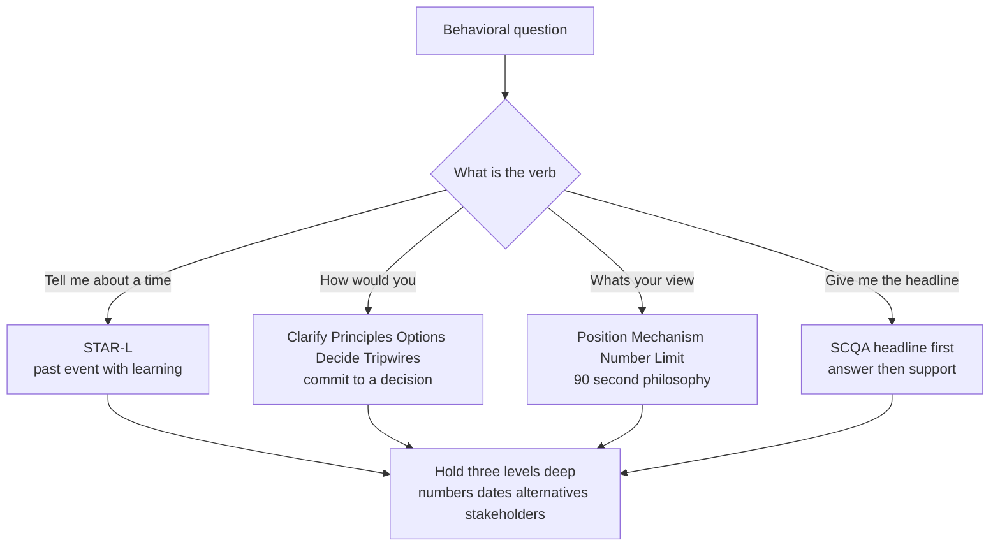

import ProbeSimulator from '@components/widgets/ProbeSimulator.jsx';

> RESHADED gave you a spine for system-design rounds: a fixed sequence that keeps you at the right altitude under pressure. The leadership loop has no single spine — it has **four**, because a behavioral round fires four different question *shapes* and each one scores a different answer structure. Use STAR on a hypothetical and you sound evasive; tell a story when asked your philosophy and you bury the position under a narrative. What's scored here isn't whether you have good stories — it's whether you can **read the question type in the first three seconds and reach for the matching shape**, then hold that shape three or four levels deep when a senior interviewer drills in to find the seam.

### Learning objectives
- Classify any behavioral question into one of **four shapes** — past-event, hypothetical, philosophy, exec-comms — and reach for the matching framework reflexively.
- Run **STAR-L** with the right proportions (~20% situation, ~50% action, ~30% result+learning) and treat the **L as mandatory** at Director level, not optional polish.
- Use **Clarify → Principles → Options → Decide → Tripwires** on hypotheticals, where *committing to a decision* is the senior signal and a STAR answer is simply the wrong tool.
- Deliver philosophy in **Position → Mechanism → Number → Limit** (~90 seconds, story held in reserve) and exec answers **headline-first (SCQA)**.
- Build every story **probe-resistant** — three levels of specifics, rejected alternatives, named stakeholders, and the cost — and never announce the framework out loud.

### Intuition first
A surgeon doesn't reach for the same instrument for every cut. Open question, you pick up a scalpel; bleeder, you grab the clamp; closing, the needle driver. Picking up the wrong tool isn't just slower — it signals you don't actually know what kind of cut you're making. Behavioral rounds are the same. "Tell me about a time you fired someone" is a *bleeder* — they want the messy, dated, specific story of how you stopped it. "How would you scale this org from 15 to 50?" is an *open question* — they want to watch you decide under ambiguity, not recite a past event. "What's your leadership style?" wants a crisp position, not a saga. Reach for STAR on all three and you've shown up to surgery with one instrument. The four frameworks below are your tray. The skill is **diagnosis** — naming the cut — followed by a clean, instrument-appropriate stroke that holds when the senior surgeon across the table leans in and asks, *"and then what, exactly?"*

---

## The questions — four shapes, four tells

Every behavioral prompt is one of four shapes. The tell is in the verb and the tense.

| Shape | The tell (how it's phrased) | What's actually scored | Framework |
|---|---|---|---|
| **Past-event** | "Tell me about a time…", "Walk me through when…", "Give me an example of…" | Did this *really happen*, at your altitude, and what did you *learn* | **STAR-L** |
| **Hypothetical** | "How would you…", "What would you do if…", "You inherit/are handed…" | Can you decide under ambiguity and *commit* | **Clarify → Principles → Options → Decide → Tripwires** |
| **Philosophy** | "What's your style/view on…", "How do you think about…", "Where do you stand on…" | A crisp, current, falsifiable position with a real downside | **Position → Mechanism → Number → Limit** |
| **Exec-comms** | "How would you tell the board/CEO…", "Give me the 30-second version", "What's your recommendation" | Lead with the answer; respect a senior's time | **SCQA / headline-first** |

The miscalibration that fails loops: answering a hypothetical with a war story ("well, *last time* this happened…") reads as dodging the decision; answering philosophy with a five-minute STAR reads as unable to state a position; answering "give me the headline" with a chronological build-up reads as not understanding how execs consume information. **Read the shape first.** The rest of this lesson is one framework per shape, with a worked answer for each.

---

## The framework — match the shape, then go deep

### Shape 1 — STAR-L for "tell me about a time"

The classic, with one Director-level correction: the proportions are wrong in almost every candidate's delivery, and the **L is not optional**. Spend ~20% on **Situation/Task** (just enough stakes and scope — team size, money, deadline), ~50% on **Action** (the decisions *you* made, the alternatives you rejected and why, who you brought in), and ~30% on **Result + Learning**. Most candidates invert this: 60% scene-setting, 30% "and then we shipped it," 10% result, no learning. That distribution reads as a storyteller, not an operator.

Two non-negotiables carry over from the system-design house rules (Lesson 10.1): **quantify the result** (team size, %, MTTR, attrition, dollars, dates) and **name the alternative you rejected** inside the Action — a decision with no rejected option isn't a decision, it's a description. The **L** is the seam senior interviewers probe hardest: at Director level, a story with no honest "what I'd do differently" reads as either rehearsed or self-unaware, and both are disqualifying at L7+.

> **Worked example — STAR-L (managing out a senior engineer):**
> *(S, ~20%)* "Senior engineer, eight years in, owned a revenue-blocking payments integration — missed three consecutive committed milestones while two peers on the same project were landing theirs. *(A, ~50%)* First I checked the **system, not the person**: scope was clear, tooling wasn't the blocker — so this was will-to-coast dressed as a skill gap. First explicit, written conversation March 4. I considered the two alternatives: quietly reassign him to lower-stakes work — rejected, it just relocates the problem and tells the team output is optional — or jump straight to exit, also rejected, because I hadn't yet given dated, unambiguous feedback. So: a 60-day structured plan, weekly checkpoints, paired with a staff engineer on the hardest piece, HR partnered from week three. He hit one of four criteria. I delivered the termination myself — eight minutes, direct, severance above policy, two intro calls for him. *(R+L, ~30%)* Team velocity recovered within a sprint; in a skip-level one engineer told me it was overdue. **That's the part I own** — the team paid for my extra quarter of hope. So I changed the mechanism: any missed *committed* milestone now triggers the explicit conversation within two weeks, not two months."

**Why it scores:**
- Diagnosis *before* blame (skill vs will vs system) — the Director tell that you don't reach for the firing first.
- Two rejected alternatives stated *with the reason* — proves it was a decision, not a reflex.
- The result is quantified and the **L is a real, costly admission** ("the team paid for my extra quarter") plus an upstream mechanism fix — not "I learned to communicate better."
- Proportions are right: the scene is one breath, the decisions are the body.

### Shape 2 — Clarify → Principles → Options → Decide → Tripwires for hypotheticals

When the verb is "*how would you*," STAR is the wrong instrument — there's no past event to narrate. The senior signal is **committing to a decision under ambiguity** and showing the reasoning that got you there. This is the behavioral cousin of RESHADED's "name 2-3 approaches, then decide": **Clarify** the one or two constraints that actually change the answer; state the **Principles** you'll reason from (and the trade-off each accepts); lay out **Options** with costs; **Decide** — pick one and own it; name the **Tripwires** that would tell you you're wrong. The failure mode is fence-sitting: candidates who list options forever and never commit read as advisors, not owners.

> **Worked example — CPODT (scale this org 15 → 50 in 18 months):**
> *(Clarify)* "Two things change my answer: is the 50 a headcount target or an *output* target — because in 2026 the honest first move is to ask whether we hit it with platform and AI leverage instead of bodies — and did the team just go through a layoff? Assume genuine growth, no recent cut. *(Principles)* Three: managers support 6-8 engineers and M-of-Ms 4-6 managers, so 50 means ~6-8 teams and 2-3 senior-manager slots; teams bud at 8-10 along *ownership* lines, never reorg around personalities; and I'd rather under-hire managers than create empty teams. *(Options)* I could promote internally (preserves context, risks under-cooked first-time managers), hire externally (injects scar tissue, risks culture dilution and a slow ramp), or stay flat longer and invest in platform. *(Decide)* I'd run roughly 60/40 internal-to-external on the manager line — internal for context, external for the two areas where we have no bench — and sequence it: scaffolding *before* headcount, because onboarding, the ladder, and the interview machine break at ~30 engineers. What I would *not* do is reorg twice or hire managers before the teams they'll run exist. *(Tripwires)* If regretted attrition crosses 8%, or first-time-manager spans climb past 8 because I hired engineers faster than I grew managers, I've gone too fast and I throttle hiring."

**Why it scores:**
- Clarifies the *one* thing that flips the answer (output vs headcount) — the 2026 calibration, stated unprompted.
- Reasons from named principles with numbers (span math), not vibes.
- **Commits** to a ratio and a sequence and names what he *wouldn't* do — decisiveness is the signal.
- Tripwires prove he'd know if he were wrong — the senior marker that separates a plan from a guess.

### Shape 3 — Position → Mechanism → Number → Limit for philosophy

"What's your leadership style?" is a trap if you treat it as an essay prompt. The scored answer is **~90 seconds**: a **Position** stated as contextual, not as a fixed identity; the **Mechanism** that makes it real (a named, standing practice); a **Number** proving it works; and a **Limit** — a genuine downside of your own style and when you deliberately abandon it. Then *stop* and let them probe, because the monologue is assumed to be rehearsed (possibly AI-drafted) — the follow-up is the real test, so you hold your story in reserve rather than spending it here. Every house rule applies: the Number is mandatory, and the Limit *is* the "name your trade-off" rule applied to your own philosophy.

> **Worked example — PMNL (leadership style):**
> *(Position)* "My style is a function of team maturity and risk, not a fixed identity: I default to delegating the decision with context, then pick one or two areas a quarter to inspect at the work level — wherever the quarter could die. *(Mechanism)* Concretely: weekly manager 1:1s on themes, skip-levels every six weeks across ~25 people, and a written decision log so I can audit reasoning without sitting in every room. *(Number)* Regretted attrition under 5% for two years while we cut delivery lead time from 9 days to 3. *(Limit)* The downside of my default is that with a struggling or junior team it's too hands-off — I learned that on an inherited team in 2023 where I had to drop to weekly milestone reviews for two quarters before I'd earned my way back up to delegation."

**Why it scores:**
- Position rejects the false binary up front ("not a fixed identity") — the post-founder-mode calibration (Lesson 10.4).
- A concrete, named mechanism — not "I empower my team," which has no verification layer.
- One clean number that pairs a quality outcome (attrition) with a delivery one (lead time).
- The Limit is specific and dated and names *when he changes* — that's what makes the position falsifiable and credible. He stops at ~90 seconds and lets them drill.

### Shape 4 — SCQA / headline-first for exec-comms

When the prompt is "give me the 30-second version" or "what would you tell the CEO," the structure is **Situation → Complication → Question → Answer**, delivered **answer-first**: state the recommendation and the ask in the *first sentence*, then support it. Execs consume the headline and the decision-needed, then drill into the parts they care about — a chronological build-up signals you don't know how senior people read. The same shape governs delivering bad news (Lesson 10.10): impact, new date/cost, and the decision you need, all in the same breath, before they hear it elsewhere.

> **Worked example — SCQA (a slipping migration, to your VP):** "Headline: the payments migration will land six weeks late, end of Q3 not mid-Q2, and I need a decision on whether we hold the dependent launch or ship it on the old stack. *(then the support)* The slip is real — we found the legacy reconciliation logic was undocumented and two of three workstreams blocked on it. I've already cut the two lowest-value scope items and re-staffed; the six weeks is the honest range, not a hope. My recommendation: ship the dependent launch on the old stack now, migrate behind it, because the launch revenue dwarfs the carrying cost of the old path for one quarter. I own the miss — my milestone tracking should have surfaced the undocumented logic in week 2, and I've added a dependency-risk review to catch the next one."

**Why it scores:**
- The recommendation and the *decision needed* are in sentence one — exec-readable.
- Carries options + a recommendation in the same conversation, not "we have a problem" with no path.
- Owns the miss and names the mechanism fix — backbone plus accountability, not blame-shifting.

---

## 2015 vs 2026 — the calibration

The four shapes are stable; what changed is the **depth of probing** and the **content bar** inside each answer.

- **The probe got relentless.** A 2015 loop often accepted a clean, well-told STAR at face value. A 2026 loop assumes the monologue is rehearsed and possibly AI-drafted, so the interviewer's job is to **dismantle it** — three or four follow-ups designed to find the level at which your specifics run out. The framework is no longer the answer; it's the *opening*. Everything after this section is about surviving the drill.
- **Numbers moved from nice-to-have to mandatory.** 2025-26 rubrics explicitly demand quantification in behavioral answers — a STAR with no figure in the Result now scores as a red flag, the same way "it scales" fails a system-design round (Lesson 10.1's cross-track house rule).
- **The hypothetical got an efficiency-era twist.** "Scale 15 → 50" used to mean "draw the org chart." Now the first clarify is *whether you hire at all* — headcount is the expensive option, and a candidate who reaches straight for bodies reads as a ZIRP relic (Lesson 10.11).
- **Philosophy answers must sound current.** "Servant leader, hire great people and get out of the way" was a fine 2015 Position; in 2026 it's near-disqualifying in front of founders (post-founder-mode), and psychological safety stated as *comfort* rather than Edmondson's risk-taking-plus-accountability is suspect (Lesson 10.4).
- **The L carries more weight.** Self-awareness and decision-process quality became *disqualifying dimensions* at L6+ when weak. A story that ends in triumph with no honest cost reads as either fabricated or unreflective. The Learning is where the score is won or lost.

---

## Probe resistance — every story holds three levels deep

A framework gets you through the first 90 seconds. The **probe** is the round. Senior interviewers (Amazon bar-raisers are the archetype) drill three to four levels below the headline, looking for the layer where your story dissolves into generalities — because that layer is where the real story ends and the rehearsed one began. Build every story to hold at three levels:

- **L1 — Specifics:** exact dates, numbers, names. "March 4," not "early that quarter." "12% of 90 people," not "a chunk of the org."
- **L2 — Mechanism:** *how* you measured or decided. "The week-3 checkpoint measured whether he'd shipped the reconciliation module — he hadn't," not "he wasn't improving."
- **L3 — The cost:** the counterfactual, what it actually cost *you*. "Two engineers told me in skip-levels it was overdue — the team carried my extra quarter of hope," not "it worked out."

Two delivery rules. **Never announce the framework aloud** — saying "let me use STAR here" signals coaching and breaks the spell; the structure should be invisible, felt only as a clean answer. And **only claim depth you actually have** — a story you can't defend at L3 is worse than a smaller story you can, because the probe *will* find the floor, and getting caught inventing at level three contaminates every other answer you've given. This is also why the story-portfolio (Lesson 10.3) insists each story be *true and quantified* before it's polished.

Drill it below — pick a question, then push each follow-up one level deeper and rehearse the answer out loud until you can hold all three without hesitating.

<ProbeSimulator client:load />

---

## What interviewers probe here

- **"Walk me through that decision again — what were the *other* options?"** — *Strong:* names two rejected alternatives with the reason each lost, instantly, because they were baked into the Action. *Red flag:* "it was the obvious call" — no decision was made, just a description.
- **"What would you do differently?"** — *Strong:* a real, costly, specific L (usually "I should have acted a quarter earlier") plus the mechanism that now prevents it. *Red flag:* "nothing" or "communicate more" — reads as unreflective at L7+.
- **"You said you'd scale the org — but *would* you, or would you find leverage instead?"** — *Strong:* already clarified headcount-vs-output up front and committed to a path with tripwires. *Red flag:* reaches for bodies by default, no efficiency consideration.
- **"Give me the 30-second version."** — *Strong:* recommendation and decision-needed in sentence one. *Red flag:* starts at the beginning and builds chronologically — exec-comms miss.
- **The level-three drill (dates, mechanism, cost).** — *Strong:* holds specifics three levels down without hedging. *Red flag:* dissolves into "generally I'd…" — the tell that the story is thinner than the headline.

---

## Common mistakes

- **Reaching for STAR on a hypothetical.** "How would you…" wants a *decision*, not a war story; narrating a past event reads as dodging the commitment. Use CPODT and commit.
- **Inverting the STAR proportions.** 60% scene-setting, 10% result, no learning. Compress the situation to one breath; spend the body on *your* decisions and the rejected alternatives, and always land the L.
- **Philosophy as an essay.** Spending five minutes on the monologue when the probe is the real test. Deliver Position-Mechanism-Number-Limit in ~90 seconds, then stop and let them drill.
- **Stories with no number and no rejected alternative.** Both are house-rule violations (Lesson 10.1) — an unquantified result and an option-less "decision" each fail the same way "it scales" fails system design.
- **Announcing the framework, or claiming depth you don't have.** Saying "I'll use STAR" breaks it; inventing at level three under probe contaminates the whole loop. Keep the structure invisible and only carry stories you can defend to the floor.

---

## Practice prompts

1. **Classify and reshape.** Take "How do you handle disagreement with your VP?" — is it past-event, hypothetical, or philosophy? *(Sketch: it's a philosophy question as phrased; answer Position-Mechanism-Number-Limit — "I steel-man their case first, challenge in private, commit visibly with a tripwire," ~90s — but have a real STAR-L disagreement loaded for the inevitable "tell me about a specific time," because the follow-up flips it to past-event.)*
2. **Run CPODT cold.** "You inherit a team with low delivery and morale — your first 90 days?" Resist storytelling; clarify (turnaround or realignment? recent layoff?), state principles, give options, **decide** a sequenced plan with before/after metrics, name tripwires. *(Sketch: classify the situation to set the clock, listen-fast 30 days, first structural decision by 60, per-person honesty by 90 — see Lesson 10.7.)*
3. **Build one story to L3.** Take your best "decision I got wrong" story and write the three layers explicitly: L1 the dates and dollars, L2 how you knew you were wrong and how fast you reversed, L3 the process gap that let it happen and the guardrail you built. *(Sketch: a one-way-door call, recognized at a specific week, reversed publicly, with a named-dissenter mechanism that later caught a second bad bet — see Lesson 10.9.)*
4. **Headline-first drill.** Deliver "the dependent launch is slipping" to a VP in two sentences: recommendation + decision-needed first, support second. *(Sketch: lead with the new date and the ship-on-old-stack recommendation; the diagnosis and the owned-miss come after.)*

---

### Key takeaways
- **Four shapes, four instruments.** Past-event → STAR-L; hypothetical → Clarify-Principles-Options-Decide-Tripwires; philosophy → Position-Mechanism-Number-Limit; exec-comms → SCQA headline-first. Read the verb and the tense first; the wrong instrument is its own red flag.
- **STAR-L proportions: ~20/50/30, and the L is mandatory.** Compress the scene, spend the body on *your* decisions and rejected alternatives, quantify the result, and end on a real, costly learning.
- **On hypotheticals, commit.** The senior signal is deciding under ambiguity with tripwires, not listing options forever — fence-sitting reads as advisor, not owner.
- **Philosophy is 90 seconds, then silence.** State a contextual position, a named mechanism, one number, and a genuine limit — then let the probe do its work; the monologue is assumed rehearsed.
- **Probe resistance wins the round.** Every story holds three levels deep — specifics, mechanism, cost — never announce the framework, and only carry stories you can defend to the floor.

> **Spaced-repetition recap:** Behavioral rounds fire **four question shapes**; match the instrument. *Tell me about a time* → **STAR-L** (20/50/30, L mandatory, quantify, name the rejected option). *How would you* → **Clarify → Principles → Options → Decide → Tripwires** — *commit*, don't narrate. *What's your view* → **Position → Mechanism → Number → Limit** in ~90s, then stop. *Give me the headline* → **SCQA**, answer-first. Then survive the **probe**: hold every story three levels deep (dates/numbers → mechanism → the cost), never announce the framework, never claim depth you can't defend. This is the RESHADED of the leadership loop.

---

*End of Lesson 10.2. The four frameworks are your tray of instruments; Lesson 10.3 builds the material they operate on — a 12-15 story portfolio in a coverage matrix, each story quantified and probe-tested to L3, mapped so one story can serve two or three categories. Lessons 10.4-10.12 then apply these shapes category by category, starting with leadership philosophy.*
