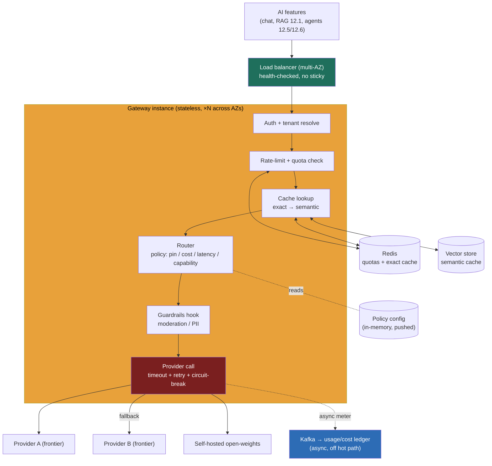

> **Why this problem separates Directors from ICs:** there is no model to train here and barely any clever algorithm — and that is exactly the trap. The candidate who reaches for clever loses; the candidate who treats this as **the API gateway and rate-limiter pattern, re-pointed at LLM providers** wins. The whole difficulty is operational and organizational: this box sits on the request path of **every AI feature in the company**, so if it adds 50 ms it taxes all of them, and if it goes down it takes *all of them* down at once. Meanwhile it is the single layer where the things a Director is actually accountable for — **cost control, vendor lock-in avoidance, and governance** — stop being slideware and become enforced code. Get the framing wrong (build an "AI router" with a model picking the model) and you've added latency, cost, and a failure mode to solve a control-plane problem. Get it right and you've built the most leveraged piece of AI infrastructure the org owns.

---

### Learning objectives

1. Recognize this as a **control-plane / platform** problem — the AI-era API gateway — and inherit the gateway + rate-limiter + circuit-breaker patterns from the core distributed-systems building blocks rather than inventing new ones.
2. Design for the two NFRs that dominate everything else: **negligible added latency** and **"never the single point of failure for all AI,"** and quantify both.
3. Make the gateway the enforcement point for **cost control** (routing + caching) and **lock-in avoidance** (a stable internal contract over swappable providers), with the numbers that justify each.
4. Reason about **semantic caching** as a correctness/cost trade — when a near-match answer is safe to reuse and when it is a bug — and bound it.
5. Make the **fail-open vs fail-closed** call for both the gateway itself and a downstream provider outage, and defend it against the requirement.

---

### Intuition first

Picture a large company where forty product teams have each independently wired their feature straight to a model provider's SDK. Forty copies of API keys in forty secret stores. Forty different retry behaviors. No one can answer "what are we spending on AI this quarter, by team?" without a spreadsheet archaeology project. When the provider has a bad afternoon, forty incidents open. When the company wants to try a cheaper model, that's forty migrations. And when legal asks "are we sending customer PII to a vendor that trains on it?", the honest answer is "we don't know."

Now put **one switchboard** in front of all of it. Every AI call dials the switchboard, not the provider. The switchboard speaks one stable internal dialect, knows which provider to actually connect each call to, hangs up and redials a backup if a line is dead, refuses calls from a team that's blown its budget, remembers answers to identical questions so it needn't place the call at all, and writes down every call's cost against the team that made it. That switchboard is the LLM gateway. It is deliberately **dumb and bulletproof** — a fast, stateless proxy — because it is on the critical path of everything, and the cardinal sin of a thing on the critical path of everything is to be slow, clever, or fragile. The interesting engineering is not in the box; it's in making the box disappear (latency) and never fall over (availability) while quietly enforcing the policies a Director will be asked about in the boardroom.

---

## R: Requirements

> Scope before build. State up front: the gateway does **not** serve models — providers (or our own serving fleet) do that. We own the **control plane**, not the GPUs.

**Clarifying questions I'd ask (with assumed answers):**

- *Who calls this — external customers or internal teams?* → **Internal first**: every product team's AI feature. (Same design extends to an external "AI API product," noted in evolution.)
- *One provider or many?* → **Many**: at least two frontier providers plus an open-weights model we self-host, because multi-provider is the entire point — fallback and lock-in avoidance.
- *Who decides which model a request uses?* → **Policy, set by us, overridable per call.** A caller can pin a model; otherwise routing policy decides. (We are *not* building an LLM that chooses the LLM — that adds a model call to every request.)
- *Streaming?* → **Yes.** Token streaming (SSE) is table stakes for chat UX; the gateway must stream through, not buffer.
- *Is correctness of caching acceptable to relax?* → **Exact-match cache: always safe. Semantic cache: opt-in per route**, because reusing a near-match answer is a correctness decision the calling feature must own.

**Functional requirements:**

1. **Unified API** — one OpenAI-compatible endpoint across all providers/models, so callers code once.
2. **Routing** — select model/provider by policy (explicit pin, or by cost/latency/capability class).
3. **Fallback** — on provider error/timeout, retry on an alternate provider/model transparently.
4. **Rate limits & quotas** — per tenant/team/key: requests/sec and a spend budget.
5. **Caching** — exact-match always; semantic cache opt-in per route.
6. **Secret management** — provider API keys live here, never in caller code.
7. **Metering & observability** — token + dollar accounting per tenant/feature/model; full request tracing.
8. **Guardrails hook** — a pluggable point to call moderation/PII redaction on input/output.

**Explicitly cut:** model inference/serving (providers or the serving fleet), prompt *content* engineering (caller's job), the RAG pipeline (RAG calls *through* the gateway), and fine-tuning. I'll name these as "upstream of" or "downstream of" the gateway.

**Non-functional requirements, priority order:**

| Priority | NFR | Target |
|---|---|---|
| 1 | **Availability** | 99.99%+ on the proxy path; **must not be the SPOF for all AI** |
| 2 | **Added latency** | p50 < 5 ms, p99 < 20 ms of gateway overhead *excluding* the provider call |
| 3 | **Cost control** | Routing + caching cut blended $/request materially; hard per-tenant budgets |
| 4 | **Multi-tenant fairness** | One team's spike or runaway loop can't starve others |
| 5 | **Governance / auditability** | Every call logged with tenant, model, tokens, cost, and a trace |
| 6 | **Throughput** | Aggregate peak ~5,000 req/s across all features (scales horizontally) |

**The inversion to state out loud:** unlike the serving problem, where the binding resource is GPU memory, here the gateway's *own* compute is trivial — it is an I/O-bound proxy. The hard requirements are **availability and added latency**, because this box's blast radius is "all AI in the company." Every decision below flows from NFRs 1–3, not from throughput.

---

## E: Estimation

> Enough math to prove the gateway is cheap to run, expensive to get wrong, and a large cost lever.

**Assumptions:** ~5,000 LLM req/s at peak across the org; average call streams for ~2 s (TTFT + decode); average ~1,500 total tokens (1k in, 500 out).

**Concurrency, not CPU, is the gateway's load.** At 5,000 req/s each held open ~2 s, in-flight concurrency ≈ `5,000 × 2 = 10,000 concurrent streams`. The gateway does almost no CPU work per request (parse, look up policy, proxy bytes) — it is **connection-bound**. With async I/O, one modern instance holds thousands of idle-ish streaming connections, so **~6–10 instances** carry peak with headroom, across ≥3 AZs. Compare that to the provider's GPU bill behind it: the gateway is a **rounding error in compute** and a **giant lever on spend**.

**The cost lever (why this box pays for itself).** Suppose un-optimized org LLM spend trends to **~$2M/month** if every call hit a frontier model. Two gateway levers:
- **Caching.** A ~30% exact+semantic hit rate on repetitive traffic (FAQs, retries, identical system-prompt calls) removes ~30% of provider calls outright → **~$600K/month** saved, and those requests return in **single-digit ms** instead of seconds.
- **Cascade / cheap-default routing.** Route the ~70% of simple requests to a small/cheap model (or self-hosted open-weights), escalating only hard ones to the frontier model. If the cheap model is ~8× cheaper and absorbs 70% of traffic, blended model cost falls **5–8×** on that slice.

The headline: the gateway team is a handful of engineers and ~10 boxes; the spend it governs is millions/month. **Estimation decided the framing:** optimize for reliability and cost-attribution, not for the gateway's own QPS.

**Added-latency budget.** Provider calls take **hundreds of ms to seconds**. To stay "invisible," gateway overhead must be **<1%** of that — hence the p50 < 5 ms / p99 < 20 ms target. That budget is what forbids putting a *model* in the routing path (a classifier LLM would add hundreds of ms — self-defeating).

---

## S: Storage

> The gateway is mostly stateless; the little state it has is chosen for speed on the hot path and durability off it.

**1. Routing & policy config (read-mostly, low volume).**
- Access: read the active policy on (nearly) every request; updated rarely by admins.
- Choice: a **config store with an in-process cache** (e.g., a versioned config in Postgres/etcd, pushed to each instance and held in memory, refreshed on change). Hot-path policy lookup is then a memory read — **zero added DB latency**.
- Rejected: reading policy from a DB per request — adds a network round-trip to the latency budget for data that changes hourly at most.

**2. Rate-limit & quota counters (hot, low-latency, ephemeral).**
- Access: increment/check per request; per-tenant req/s windows and running spend.
- Choice: **Redis** (token-bucket/sliding-window, exactly the standard rate-limiter), with atomic Lua scripts. Spend quotas tracked as running counters, reconciled against the usage ledger.
- Rejected: a strongly-consistent DB counter per request — too slow and a contention hot spot at 5,000 req/s.

**3. Response cache (hot).**
- **Exact cache:** key = hash of `(model, normalized request)` → response, in **Redis**. Always correct.
- **Semantic cache:** embed the prompt, ANN-search a **vector store** for a prior prompt within a similarity threshold, reuse its answer. Opt-in per route. (Details and its danger in D/Evaluation.)
- Rejected: caching everything semantically by default — see the correctness trap below.

**4. Usage & cost ledger (durable, append-only, off the hot path).**
- Access: append one record per completed call (tenant, feature, model, tokens in/out, $, latency, trace ID); queried for billing/attribution dashboards.
- Choice: **append-only writes via an event stream (Kafka) → a columnar/analytics store** (e.g., ClickHouse/BigQuery). Writing it **asynchronously after** the response streams keeps metering off the latency path. This is the "two paths off one firehose" instinct: a fast approximate in-Redis spend counter for *enforcement*, and the durable ledger as the *source of truth* for billing.
- Rejected: synchronous metering write before responding — adds latency and a failure mode to every call.

**5. Secrets (provider API keys).**
- Choice: a **secret manager / vault**, loaded into instances at startup, rotated centrally. The entire reason callers never hold keys.

---

## H: High-level design

> The shape to make visible: a **stateless, horizontally-scaled proxy fleet** behind a load balancer, doing a fixed, fast pipeline per request, with all heavy/durable work pushed off the response path.



**Happy path, one chat completion:**

1. Caller hits the unified endpoint with an internal API key. LB (multi-AZ, health-checked, **no sticky sessions** — instances are stateless) picks any instance.
2. **Auth + tenant resolve** (validate key, attach tenant/feature identity).
3. **Rate-limit + quota check** against Redis. Over the req/s limit → `429`; over the spend budget → `402`/`429` with a clear reason. Fail-fast, microseconds.
4. **Cache lookup**: exact key in Redis; if miss and the route opts into semantic caching, embed + ANN search the vector store within the similarity threshold. Hit → return immediately (single-digit ms, no provider call, no token cost).
5. **Route**: read in-memory policy. If the caller pinned a model, honor it; else select by class (cheap-default with escalation, or by latency/capability). 
6. **Guardrails hook** (optional per route): input moderation/PII redaction.
7. **Provider call** with a **timeout, bounded retries, and a circuit breaker** per provider. On error/timeout/open-circuit, **fall back** to the configured alternate (e.g., Provider A → Provider B → self-hosted). Stream tokens straight back to the caller as they arrive.
8. **After** the stream completes, **emit a usage event** to Kafka (async) and increment the Redis spend counter. The durable ledger write never blocks the response.

**Why stateless matters:** because every instance is identical and holds no session, the LB can route anywhere, a dead instance just stops receiving traffic, and we scale by adding boxes — the standard HA story. The only shared state (quotas, cache) lives in Redis, itself replicated.

---

## A: API design

> One stable internal contract over many providers — that contract *is* the lock-in-avoidance strategy.

```
# --- Inference (OpenAI-compatible so existing SDKs/code "just work") ---
POST /v1/chat/completions
  headers: { Authorization: Bearer <internal-key> }
  body: {
    model: "gpt-class-frontier" | "cheap-default" | "claude-...:pinned" ,  # logical alias OR pinned
    messages: [...],
    stream: true,
    route_hint?: { max_cost?: "low", capability?: "reasoning" },   # optional policy inputs
    cache?: { mode: "exact" | "semantic" | "off", ttl_s?: 3600 }   # caller owns semantic-cache opt-in
  }
  -> 200 (SSE stream of token deltas)            # normal
  -> 200 { ..., x-llm-cache: "exact"|"semantic" } # served from cache
  -> 402 { error: "tenant_budget_exceeded" }
  -> 429 { error: "rate_limited", retry_after }
  -> 503 { error: "all_providers_unavailable" }   # only after fallbacks exhausted

# --- Admin / control plane (separate service, separate authz) ---
PUT  /admin/routing-policies/{class}    # map logical model → provider(s) + fallback chain
PUT  /admin/tenants/{id}/quota          # req/s + monthly spend budget
GET  /v1/usage?tenant=&from=&to=&group_by=feature,model   # cost attribution
```

**Design notes (each with its rejected alternative):**

- **OpenAI-compatible schema by deliberate choice.** Adopting the de-facto standard means existing client SDKs and code point at us with a base-URL change. Rejected: a bespoke schema — it would make adoption a migration and defeat the "code once" goal.
- **Logical model aliases (`cheap-default`, `frontier`) over hard provider names.** Callers request a *capability class*; we bind it to a concrete provider/model in policy. This is what lets us swap providers or A/B a new model **without touching caller code** — the lock-in firewall. Rejected: callers naming `gpt-4o` directly everywhere — re-introduces lock-in and a migration per change.
- **`cache.mode` is caller-controlled.** Semantic caching is a correctness decision only the feature understands (a legal-advice feature must never reuse a near-match; an FAQ bot happily does). Default `exact`. Rejected: a global semantic cache — silently wrong for some features.
- **Admin plane is a separate service with separate auth.** A misused policy/quota write must not be reachable from the inference key. Rejected: one API surface — conflates data-plane and control-plane blast radius.

---

## D: Data model

> Four small schemas; the routing policy and the quota counter are the two consequential ones.

**`routing_policy`** (versioned, cached in-memory): `class` (logical alias) → ordered **`provider_chain`** `[{provider, model, weight, timeout_ms}]` (first is primary, rest are fallbacks), plus `escalation_rule` (when a cheap-default escalates to frontier). Versioned so a bad policy push is instantly rollback-able.

**`tenant_quota`**: `tenant_id` → `rps_limit`, `monthly_budget_usd`, `spent_usd` (running, in Redis; reconciled from the ledger), `on_exceed` (`block` | `degrade-to-cheap` | `warn`). The `on_exceed=degrade-to-cheap` option is a Director-friendly knob: a team over budget gets *downgraded*, not cut off.

**`usage_record`** (append-only ledger): `request_id`, `tenant_id`, `feature`, `model`, `provider`, `tokens_in`, `tokens_out`, `usd_cost`, `latency_ms`, `cache` (`miss`/`exact`/`semantic`), `fallback_used`, `ts`, `trace_id`. The source of truth for billing, the FinOps dashboard, and audit.

**`cache_entry`**: exact = `hash(model, normalized_request)` → `{response, ttl}`. Semantic = `{embedding, prompt, response, route, ttl}` in the vector store; the **similarity threshold is a per-route tunable** and is the dial between cost savings and wrong-answer risk.

<details>
<summary>Go deeper — why semantic-cache correctness is a threshold problem (IC depth, optional)</summary>

Semantic caching returns a stored answer when a new prompt's embedding is within cosine distance `τ` of a cached prompt's. The failure: "What's the capital of Australia?" and "What's the capital of Austria?" are *near* in embedding space but have different correct answers — too loose a `τ` serves Canberra for Vienna. Mitigations: (1) set `τ` conservatively per route and measure the false-reuse rate on a golden set; (2) scope the cache by tenant/feature/route so unrelated prompts can't collide; (3) never semantic-cache routes where inputs carry decisive small differences (numbers, names, dates) — exact-cache or no-cache those; (4) include critical structured params in the key, not just the free-text embedding. The honest framing: semantic cache trades a bounded, measured correctness risk for cost/latency — so it's opt-in, measured, and per-route, never a silent global default.

</details>

---

## E: Evaluation

> Re-check against the NFRs. The bottlenecks here are availability and latency failures, plus two correctness traps.

**Re-check vs NFRs:** added latency stays <1% of provider time because policy is in-memory, quota/cache checks are single Redis ops, and metering is async. Cost control is enforced by routing + caching + hard budgets. Availability is a stateless multi-AZ fleet. Now the failure modes.

**Failure 1 — a provider has an outage (the expected case, not the edge case).** Frontier providers *do* have bad hours. The circuit breaker trips after consecutive errors/timeouts on Provider A and the router **fails over to Provider B, then to the self-hosted model**, transparently to callers. This multi-provider fallback is the single biggest reason the gateway exists. The trade to name: a fallback model may be cheaper/weaker, so quality dips during the outage — an explicit, logged degradation, far better than a hard outage of every AI feature. Without the gateway, this is forty simultaneous incidents.

**Failure 2 — the gateway itself is the SPOF (the question every interviewer asks).** It sits in front of all AI, so its own failure is catastrophic. Defenses: **stateless** instances across **≥3 AZs** behind a health-checked LB; shared state (Redis) replicated with failover; no single hot dependency on the response path; aggressive **shed-load** rather than collapse. And the decisive design choice — **fail-open vs fail-closed when the gateway's *own* dependencies degrade**:
- If **Redis (quota/cache) is unreachable**: **fail open** on rate-limiting (serve the request, log that limits are unenforced) rather than blocking all AI traffic — availability outranks perfect quota enforcement for a brief blip. 
- If a **guardrail/moderation service is down** on a *safety-critical* route: **fail closed** (reject) — here correctness/safety outranks availability.

Stating *which* dependency fails which way, tied to the requirement, is the Director-altitude answer. "Make it highly available" is not.

**Failure 3 — semantic cache serves a wrong answer.** Covered in D: bounded by a conservative per-route threshold, tenant/route scoping, opt-in only, and a measured false-reuse rate on a golden set. The instinct: a cache that can lie is a correctness decision the *caller* owns, not a default.

**Failure 4 — a noisy neighbor / runaway loop.** One team's buggy agent loops and fires 50× normal traffic (the agentic runaway risk made real). Per-tenant **req/s limits and hard spend budgets** contain it: the offender hits `429`/`402` and is isolated; everyone else is unaffected. Without per-tenant quotas, one runaway exhausts shared provider rate limits and money for the whole org. This is multi-tenant fairness as a safety control, not just billing.

---

## D: Design evolution

> The gateway is a platform; its evolution is about turning policy knobs into product capabilities.

**Cascade / confidence routing (cost).** Beyond cheap-default, route on *difficulty*: a cheap model attempts first, and a confidence signal (or a cheap classifier on the *output*, not a model on the input) escalates hard cases to the frontier model. Captures most of the 5–10× cost win while protecting quality on the hard tail. The trade: escalation logic adds complexity and a small latency tax on escalated requests.

**Model A/B testing and canarying (quality).** Because callers use logical aliases, the gateway can route 5% of `frontier` traffic to a new model version and compare eval/online metrics before a full cutover — turning a risky org-wide migration into a dial. This is a capability **only** the gateway can offer, and a strong point to make.

**Bring-your-own / self-hosted models (cost + control at scale).** As volume crosses the build-vs-buy threshold, plug a self-hosted open-weights fleet in as just another provider in the chain — no caller change. The gateway is what makes "buy to learn, build to scale" executable without a migration.

**External productization & multi-region.** Expose the gateway as an external AI API (adds stricter authz, billing, abuse defense) and run it **per-region** close to callers and providers to shave latency; quotas/ledger replicate. Prompt-management and a first-class guardrails pipeline graduate from a hook to a platform feature.

**Cross-references:** the rate limiter (the quota engine), load balancing/HA and circuit breaking, the LLM caching/routing/cascade economics, build-vs-buy (which this layer enables), cost-attribution and governance (which this layer enforces), and the serving fleet behind the self-hosted provider.

---

### Trade-offs table: the pivotal decisions

| Decision | Option A | Option B | Option C | Use when… |
|---|---|---|---|---|
| **Build the gateway?** | **Build a thin internal gateway** | Each team calls provider SDKs directly | Buy a managed AI-gateway product | **A** once you have several AI features and need cost-attribution + lock-in control (the default here). **B** only for a single early experiment. **C** to start fast / small team — accept its lock-in and that governance is now the vendor's. |
| **Caching** | **Exact-match only** | **Exact + opt-in semantic** | Aggressive global semantic | **A** is always-safe and the floor. **B** (our choice) adds savings where the route says it's safe. **C** rejected — silent wrong answers; correctness isn't global. |
| **Routing decision** | **Static policy (alias → provider)** | Cheap-default + escalation | A model classifies each request | **A** as the reliable base. **B** for the big cost win on mixed traffic. **C** rejected for the hot path — adds a model call (hundreds of ms) to *route*, blowing the latency budget. |
| **On dependency failure** | **Fail open (serve, log)** | **Fail closed (reject)** | — | **A** for quota/cache blips (availability > perfect enforcement). **B** for safety-critical guardrail routes (safety > availability). Decide *per dependency*, tied to the requirement. |

---

### What interviewers probe here (Director altitude)

- **"This box is now in front of every AI feature — how is it not the thing that takes them all down?"** — *Strong:* stateless multi-AZ fleet behind a health-checked LB, replicated Redis, no clever per-request dependency, load-shedding over collapse, and an explicit **fail-open vs fail-closed** decision *per dependency* tied to the requirement. *Red flag:* "we make it highly available" with no mechanism, or no awareness that the gateway is itself a SPOF.

- **"Provider A is down. What happens to every chat feature in the company?"** — *Strong:* circuit-breaker trips, transparent **fallback** to Provider B then the self-hosted model, with the quality-degradation trade named and logged; contrast with the no-gateway world of forty simultaneous incidents. *Red flag:* retries against the same dead provider, or "the feature returns an error."

- **"Our AI bill is exploding. Where do you cut, here?"** — *Strong:* routing (cheap-default + escalation, 5–10× on the easy slice) and caching (exact + bounded semantic, ~30% of calls removed), quantified, plus per-tenant **budgets** with `degrade-to-cheap` on exceed. *Red flag:* "use a smaller model everywhere" (tanks quality) or no per-tenant attribution to even find the spender.

- **"How does this protect us from vendor lock-in?"** — *Strong:* the **stable internal contract + logical model aliases** mean providers are swappable and new models can be canaried without caller changes; the gateway *is* the optionality layer. *Red flag:* treats lock-in as unsolvable, or hard-codes provider names in the API.

- **"Why not let an LLM decide which LLM to use?"** — *Strong:* it adds a model call (hundreds of ms) and a failure mode to the routing path, violating the <1% latency budget; routing is policy + cheap signals, not a model on the hot path. *Red flag:* designs a "smart router" model unaware of the latency/cost it just added to *every* request.

---

### Common mistakes

- **Treating it as an ML problem.** There is no model to train; it's the **API-gateway + rate-limiter + circuit-breaker** pattern re-pointed at providers. Reaching for cleverness adds latency, cost, and failure modes.
- **Forgetting the gateway is itself a SPOF.** It protects everything, so it's the most concentrated single point of failure you have — it needs its own HA story (stateless, multi-AZ, replicated shared state) before anything else.
- **Synchronous metering on the hot path.** Writing the durable cost ledger before responding adds latency and a failure mode to every call. Meter **async** after the stream; keep a fast Redis counter for *enforcement* only.
- **Global semantic caching.** A cache that returns a near-match answer is a correctness decision; defaulting it on silently serves wrong answers (Canberra for Vienna). Opt-in, scoped, threshold-tuned, measured.
- **No per-tenant quotas.** Without them, one team's runaway loop exhausts shared provider rate limits and budget for the whole company — the gateway's fairness controls are a safety mechanism, not just billing.

---

### Practice questions with model answers

**Q1. A team's AI feature suddenly 10×'d its traffic from a buggy retry loop and the whole org's chat features started getting rate-limited by the provider. How does your design prevent this?**

> *Model:* **Per-tenant rate limits and spend budgets** in the gateway (the token bucket in Redis). The offending tenant hits its own `429`/`402` and is isolated; the shared provider rate limit and budget are protected because no single tenant can consume more than its allocation. Set `on_exceed=degrade-to-cheap` so even a misbehaving team degrades rather than hard-fails. Without the gateway, the provider's *global* account limit is the only backstop, and the first noisy tenant starves everyone. This is multi-tenant fairness as a blast-radius control.

**Q2. Walk me through exactly where the gateway's added latency comes from and how you keep it under ~5 ms p50.**

> *Model:* Per request: auth (in-memory key check), quota check (one Redis op, sub-ms intra-AZ), cache lookup (one Redis op; semantic adds an embed + ANN only on opt-in routes), routing (in-memory policy read — zero network), then proxy bytes. Metering is **async after** the response. So on the common path it's two Redis round-trips plus memory reads — single-digit ms. The thing that would blow the budget is putting anything model-sized on the hot path (a routing LLM, a synchronous guardrail model, a per-request DB read) — which is exactly why policy is cached in memory and metering is off-path.

**Q3. Legal asks: "prove no customer PII is being sent to a provider that trains on our data, and tell me our spend per product line." How does this design answer both in minutes?**

> *Model:* Both are gateway-native. PII: the **guardrails hook** runs PII redaction on input for flagged routes, and provider selection is policy — we route PII-bearing routes only to zero-retention/enterprise-terms providers (or the self-hosted model), enforced centrally, not per team. Spend: the **usage ledger** records tenant/feature/model/$ on every call, so `GET /v1/usage?group_by=feature,model` answers spend-per-product-line directly. In the no-gateway world both questions are spreadsheet archaeology across forty teams — the centralization *is* the governance answer.

---

### Key takeaways

1. **It's a control-plane problem, not an ML one.** The LLM gateway is the API-gateway + rate-limiter + circuit-breaker pattern re-pointed at model providers. Be deliberately dumb and bulletproof; the cleverness is making the box invisible (latency) and indestructible (availability).
2. **Two NFRs dominate: added latency (<1% of the provider call) and "never the SPOF for all AI."** Hence in-memory policy, single-Redis-op quota/cache checks, async metering, a stateless multi-AZ fleet, and an explicit **fail-open vs fail-closed decision per dependency**.
3. **This is the org's biggest cost lever.** Caching (~30% of calls removed) and cheap-default + escalation routing (5–10× on the easy slice) turn a handful of boxes into millions/month saved, with per-tenant budgets to contain runaways. Meter async into a ledger that's the billing source of truth.
4. **It's the lock-in firewall.** A stable internal contract with logical model aliases makes providers swappable and lets you canary/A-B new models with zero caller changes — the layer that makes "buy to learn, build to scale" actually executable.
5. **It's where governance becomes code.** Central secret management, PII-aware routing, and per-tenant cost attribution answer the legal/finance/security questions that forty direct integrations never could.

> **Spaced-repetition recap:** The LLM gateway is the **AI-era API gateway** — one stable internal contract (logical model aliases) over many providers. It's a **stateless, multi-AZ, I/O-bound proxy** whose own compute is a rounding error; the hard NFRs are **added latency (<1% of the provider call)** and **not being the SPOF for all AI**. Hot path: auth → **per-tenant quota** (Redis) → **cache** (exact always, semantic opt-in + threshold-bounded) → **route** (cheap-default + escalate; never a model on the hot path) → provider call with **timeout + circuit-break + fallback** to alternate/self-hosted → stream → **async meter** to a Kafka→ledger source of truth. Decide **fail-open** (quota/cache blip: availability wins) vs **fail-closed** (safety-critical guardrail: safety wins) *per dependency*. It's the org's biggest **cost lever** (caching + routing), its **lock-in firewall** (swap/canary models with no caller change), and where **governance becomes code** (secrets, PII routing, cost attribution). Cross-ref: the rate limiter, HA/circuit-break, the LLM cost levers, build-vs-buy, governance/FinOps, and the serving fleet behind the self-hosted provider.

---

*End of Lesson 10.3. The gateway is the piece of AI infrastructure with the highest leverage-to-complexity ratio in the whole module: a few hundred lines of boring proxy code that decides the company's AI reliability, bill, vendor optionality, and audit story.*
