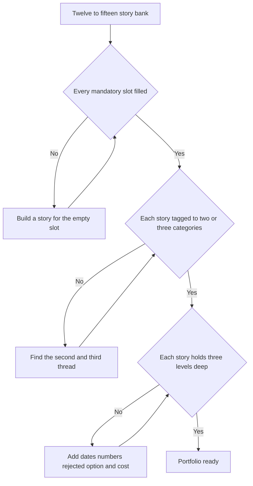

import StoryCoverageMatrix from '@components/widgets/StoryCoverageMatrix.jsx';

> Lesson 10.2 gave you the instruments. This lesson builds the material they operate on. A Director loop is five or six interviewers, each assigned a different competency, drilling three or four levels deep, the candidate who walks in with a mapped bank of true, quantified stories is calibrated; the one improvising a fresh story per question is not. The portfolio isn't a list of war stories. It's an **instrument**, a small bank chosen so every category the loop scores has coverage, every story holds to L3 under probe, and the *gaps* are visible before the interviewer finds them. Most candidates over-index on three flattering stories and discover live, in the room, that they have nothing for "tell me about a layoff" or "a decision you got wrong." This lesson is how you never get caught empty.

### Learning objectives
- Build a **12-15 story bank** as a coverage matrix, stories down one axis, the nine categories and your target company's values across the other, and read the matrix for gaps before a loop, not during one.
- Engineer each story to **serve two or three categories**, so a bank of twelve covers thirty cells; the multiplier is the point.
- Fill the **eight mandatory slots** interviewers specifically check at Director level, including the ones (a loss, a termination, a layoff, a wrong call) that candidates skip and loops fail on.
- **Quantify honestly**, attach a real number to every story without inflating scope, because the probe finds invented figures at L3 and contaminates the whole loop.
- Audit your portfolio against the four **portfolio-level red flags**, every conflict junior to you, zero losses, zero numbers, stories stale since the growth era.

### Intuition first
A wardrobe, not an outfit. The mistake is preparing for a behavioral loop the way you'd dress for one event, picking the three stories that flatter you most and rehearsing them to a shine. But a Director loop isn't one event; it's a week of weather. One interviewer wants the day you fired someone, the next the time you lost an argument and committed anyway, a third a cross-org win, a fourth a decision you got wrong. Pack three great outfits for a seven-day trip and four mornings you have nothing to wear, you improvise, and improvised stories collapse at the third follow-up. The fix is a **capsule wardrobe**: twelve to fifteen pieces chosen so they *combine*, the same migration is a delivery story, an influence story, *and* an AI-adoption story depending on the thread you pull, and chosen so the obvious occasions are covered before you pack. You're not memorizing answers. You're building a small, versatile set of true things you can reach into under pressure, and checking the closet for holes while there's still time to fill them.

---

## What a portfolio entry actually is

A story is not a memory, it's a **structured, reusable asset** with four required properties:

1. **A real, dated event you owned**, your decision, not your team's or your VP's. The probe (Lesson 10.2) is built to find the seam between what you did and what you're claiming.
2. **A quantified spine**, team size, dollars, percentage, timeline, a before/after metric. A story with no number is the same red flag "it scales" is in a system-design round (Lesson 10.1's house rule).
3. **A rejected alternative**, the option you considered and killed, with the reason. No rejected option means no decision was made, just a description.
4. **A category tag set**, the two or three competencies this story serves, so you know what you're reaching for when a question fires.

The multiplier is property 4. Twelve stories that each serve one category cover twelve cells; the same twelve, each engineered to serve two or three, cover thirty. **That's the whole efficiency of a portfolio**, you carry twelve probe-hardened stories instead of remembering thirty thin ones, and cover more. The skill is selecting the *minimum* set whose category tags, unioned, hit every column.

---

## The mandatory slots: what the loop specifically checks

The nine categories (Lessons 10.4-10.12) are the columns. But Director loops surface a sharper list: **eight specific story types interviewers go looking for**, and the absence of any one is itself a finding, because the empty slot is exactly the question a senior interviewer reaches for, where rehearsal runs out.

| # | Mandatory slot | Why the loop checks it | The failure if you're empty |
|---|---|---|---|
| 1 | **Up-chart disagreement you WON** | Backbone, you'll challenge a VP/CXO with data, not just your reports | All your conflicts are down-chart; reads as someone who only wins by authority |
| 2 | **One you LOST and committed to (with a tripwire)** | Disagree-and-commit, the senior move, not obedience | "I've never lost one" reads as either junior or unable to be moved by evidence |
| 3 | **A termination you ran** | Decisiveness-with-dignity; you've done the hard thing personally | Never having fired anyone at this level reads as conflict-avoidant or inexperienced |
| 4 | **A layoff or hard constraint you owned** | You own decisions made above you and rebuild after | "Finance gave me a list", distancing, is the signature efficiency-era fail (10.11) |
| 5 | **A consequential decision you got WRONG** | Self-awareness and decision-process quality, disqualifying dimensions at L7+ if weak | A flawless track record reads as fabricated or unreflective |
| 6 | **An incident you COMMANDED** | You coordinate under fire, you don't type the fix, Director, not senior IC | Hands-on-fixer-with-no-command-structure reads a level too low |
| 7 | **A manager you grew AND a transition that FAILED** | You build org capability, and you're honest that not every bet lands | "Every manager I grew succeeded" reads as a thin sample or a rewritten history |
| 8 | **A cross-org influence win** | Influence without authority, peer Directors/VPs in orgs you don't own | All your wins are inside your own org; reads as not yet operating across the company |

Slot 7 is two stories on purpose, the grew *and* the failed-transition are checked as a pair; the contrast is the signal. Slot 2's **tripwire** (the metric or date at which you'd revisit the decision you committed to) separates genuine disagree-and-commit from quiet compliance, a "lost" story without it reads as just going along.

---

## The coverage matrix: how to build and read it

Stories down the rows, nine categories across the columns. In each cell, mark whether the story serves that category **strongly** (a first-choice answer), **thinly** (works in a pinch), or not at all. Then read it two ways:

- **Down the columns**, every category needs at least one strong story, ideally two, so two interviewers comparing notes don't hear the same one. A column with zero strong entries is a gap you fix *before* the loop.
- **Across the rows**, a story lighting up one column is under-leveraged; push for the second and third thread. A story lighting up four or five is your workhorse, but don't over-use it, or the panel notices you have one good week and nothing else.

Add a second axis for a target: the company's values or principles (Amazon's LPs, Meta's values). The matrix then shows whether your bank speaks the company's language, if you're interviewing at Amazon and nothing maps to "Have Backbone; Disagree and Commit," that's a same-week build, not a same-morning scramble. The widget below is this matrix, live, enter and tag your stories, and it flags gaps in red and over-used workhorses so you see the holes the way an interviewer will.

<StoryCoverageMatrix client:load />

---

## Worked example: one story, three categories

The portfolio's efficiency comes from one story serving multiple columns. Here's a database migration told three ways, each pulling a different thread for a different category. **Same facts, same numbers, different load-bearing decision**, the muscle to build is not three stories but one you can rotate.

**The raw event (the shared spine):** Inherited a monolith on a single Postgres instance, 40 engineers across 5 teams blocked, p99 write latency at 800ms and climbing. I drove a migration to a sharded setup over two quarters; a peer Director who owned the shared data-access layer didn't want to prioritize it; mid-migration I made a sharding-key call I had to partially reverse. We landed it: p99 to 120ms, the 5 teams unblocked, zero data-loss incidents.

> **Told for Execution (10.9), delivery under constraint:**
> "Forty engineers across five teams blocked behind one Postgres instance, p99 writes at 800ms with a hard ceiling two quarters out. I owned the migration. The decision that mattered was sequencing: I rejected a big-bang cutover, too much blast radius on a system five teams depend on, for a strangler pattern, shard by shard behind a feature flag, so any shard could roll back independently. The cost I named up front: two quarters instead of one, and holding that line against pressure to rush. We landed it, 800ms to 120ms, zero data-loss, all five teams unblocked. What I'd do differently: I sequenced the riskiest shard third, not first, so we carried uncertainty longer than needed, now I front-load the scariest slice to fail fast."

> **Told for Influence (10.10), cross-org without authority:**
> "The migration needed the shared data-access layer changed, owned by a peer Director whose roadmap had no room for it, and I couldn't order it. So I didn't ask for headcount; I brought him the cost of *not* doing it: three of the five blocked teams were *his*, with the data to prove it, and I offered to lend two of my engineers to do the work inside his standards, not around them. I made it cheaper to say yes than no. The alternative I rejected, escalating to our shared VP, would've worked once and cost me the relationship for every future dependency. He prioritized it; we shipped together. The lesson: cross-org influence is making your problem visibly *their* win, not winning the escalation."

> **Told for the wrong-call slot (10.9), a decision you got wrong:**
> "Mid-migration I picked a sharding key, tenant_id, that looked clean on paper. By the third shard, the data showed our largest tenant was 40% of the load on one shard: I'd built a hot shard. I caught it at week six, not at design time, because I hadn't pressure-tested the key against our real load distribution. I reversed it, composite key, re-migrated two completed shards, cost about three weeks. The process gap was the lesson: a near-one-way-door call with no skew review and no named skeptic. Now every partitioning decision in my org gets a written skew analysis and a devil's advocate, which caught a bad key on a different project six months later."

Three categories, one event, and crucially **the numbers stay constant**, 40 engineers, 800ms to 120ms, two quarters, three weeks lost. You're not telling three stories; you're pulling three threads from one. That's how twelve stories cover thirty cells, and why probe-resistance compounds: you've rehearsed the same dates and figures from three angles, so they're unshakeable at L3.

---

## Quantifying honestly

Every story needs a number, and it must be **true at L3**, because the probe will ask how you measured it. Three rules:

- **Attach the metric that proves the outcome, not the most impressive number nearby.** "p99 from 800ms to 120ms" proves the migration worked; "saved millions" is a number you can't defend when asked for the model behind it. Pick the figure you can show your work on.
- **Own scope honestly, claim the decision, share the credit.** "I drove the migration" is defensible if you owned the call; "I built it" when four engineers built it dies the moment they ask what *you* specifically did. Directors decide and unblock, they don't usually type, and that's the level being scored anyway.
- **A smaller true number beats a bigger invented one.** "Cut regretted attrition from 11% to 5% on a 25-person org" is bulletproof; "reduced attrition dramatically" is a hedge that signals you don't have the figure. If you genuinely lack a number, say what you'd have instrumented, that reads as metrics-literate, not fabricated.

The trade-off: an honestly-scoped portfolio looks *less* heroic than an inflated one. That's correct. A 2026 loop is built to dismantle the inflated version, and getting caught inventing at level three makes every other answer suspect. A modest portfolio that holds under drilling outscores an impressive one that cracks.

---

## 2015 vs 2026: the calibration

What a portfolio must contain shifted with the environment (the six shifts are Lesson 10.1's spine):

- **The growth-era story is now a liability if it's all you have.** "I scaled my org from 10 to 60" was a 2015 flex; in 2026, with no efficiency angle, it codes as ZIRP empire-building. The refresh: pair it with output-per-dollar, or lead with a *more-with-less* story (10.11). A bank stale since the growth era is the most common dated-prep tell.
- **The mandatory slots themselves changed.** A 2015 loop rarely demanded a layoff or AI-adoption story; in 2026 both are near-assumed, and the termination/wrong-call slots are checked harder because performance management tightened and self-awareness became a disqualifying dimension at L7+.
- **Numbers moved from polish to gate.** A clean story with no figure used to pass; 2025-26 rubrics treat the missing number as a red flag. Every row needs a defensible metric.
- **The probe assumes AI-drafted prep.** Interviewers now assume your stories were polished, possibly with an LLM, so the bank's value isn't the polish, it's the *truth that survives drilling*. A generated-sounding story with no L3 floor is worse than no story.

---

## What interviewers probe here

- **"Do you have another example of that?"**, *Strong:* a second, distinct story for the same competency, because the matrix shows two strong entries per column. *Red flag:* re-telling a variant of the same event, or "that's the main one that comes to mind", a one-deep column.
- **"Tell me about a time you were wrong / lost / had to let someone go."**, *Strong:* reaches the mandatory-slot story immediately, with the cost and the mechanism fix. *Red flag:* a long pause, then a reframed success, the tell that the slot was empty and is being improvised.
- **The level-three drill on the number.**, *Strong:* "p99 from 800 to 120, measured on the write path, here's the dashboard we watched." *Red flag:* the figure softens under questioning ("well, roughly…"), invented or borrowed.
- **"Was that your decision, or your team's?"**, *Strong:* clean ownership of the *call* with credit shared on execution. *Red flag:* scope inflation that collapses, claiming a build you didn't do.

---

## Common mistakes

- **The three-story portfolio.** Over-rehearsing your best three and walking in with four empty mandatory slots. Build twelve to fifteen; audit the columns *and* the eight slots before the loop.
- **One-deep columns.** A single strong story per category means two interviewers comparing notes hear the same story, and "another example?" catches you. Aim for two strong per category.
- **Skipping the uncomfortable slots.** No loss, no termination, no wrong call, the slots candidates avoid are exactly the ones the loop checks, because they're where rehearsal runs thin. The gap *is* the question they'll ask.
- **Inflated, undefendable numbers.** A figure you can't reconstruct at L3 contaminates the whole loop. A smaller true number always beats a bigger invented one.
- **A stale, growth-era bank.** Stories that all date from the scale-up era with no efficiency or AI angle read as out-of-date prep. Refresh at least the workhorses with a 2026 frame.

---

## Practice prompts

1. **Build the matrix and find your gaps.** List your twelve best stories; tag each to the nine categories. Which columns have zero strong entries? *(Sketch: the empty columns are usually the layoff slot, the wrong-call slot, and the cross-org-influence slot, the three candidates most often lack. Each is a same-week build: find the real event, even a modest one, and harden it.)*
2. **Triple a single story.** Take your strongest delivery story and re-tell it for two other categories, influence, hiring, AI, efficiency, keeping every number constant. *(Sketch: the migration above is the model, same 40 engineers and 800-to-120ms, different load-bearing decision per telling. If you can't find a second thread, the story is thinner than you think.)*
3. **Audit against the four portfolio red flags.** Check: is every conflict in your bank with someone junior to you? Is there a single genuine loss? Does every story carry a number? Is anything dated past the growth era? *(Sketch: most candidates fail the first two, all down-chart conflict, zero losses. Fix by surfacing one real up-chart disagreement you won and one you lost and committed to with a tripwire.)*
4. **Harden one story to L3.** Pick your weakest-quantified story and attach a defensible metric, a rejected alternative, and the cost to you. *(Sketch: if you can't find a number, you may not own the story, re-scope it to the decision you actually made, and instrument what you'd measure next time.)*

---

### Key takeaways
- **A portfolio is an instrument, not a list**, a 12-15 story bank built so every category has coverage, every story holds to L3, and the gaps are visible before the interviewer finds them.
- **Engineer each story to serve 2-3 categories.** Twelve stories tagged across columns cover thirty cells; the multiplier is the entire point, and it's why one migration is a delivery, influence, *and* wrong-call story.
- **Fill the eight mandatory slots**, up-chart win, a loss with a tripwire, a termination, a layoff/constraint, a wrong call, a commanded incident, a grown manager plus a failed transition, a cross-org win. The empty slot is the question they'll ask.
- **Quantify honestly.** A defensible number on every story, scope claimed accurately, a smaller true figure beats a bigger invented one, because the probe finds the invention at L3 and contaminates the whole loop.
- **Audit against four red flags**, every conflict junior to you, zero losses, zero numbers, stories stale since the growth era. The matrix makes all four visible at a glance.

> **Spaced-repetition recap:** The story portfolio is a **12-15 story coverage matrix**, stories × nine categories (× company values for a target). Each story is **real, dated, quantified, with a rejected alternative**, engineered to **serve 2-3 categories**, so twelve cover thirty cells. Fill the **eight mandatory slots**: up-chart win, a loss-with-tripwire, a termination, a layoff/constraint, a wrong call, a commanded incident, a grown-manager-plus-failed-transition, a cross-org win. **Quantify honestly**, a smaller true number beats a bigger invented one; the probe finds inflation at L3. Audit against four red flags: all-junior conflict, zero losses, zero numbers, growth-era-stale. One migration, told three ways, numbers held constant, that's the muscle.

---

*End of Lesson 10.3. You now have the instruments (10.2) and the material they operate on (10.3). The remaining lessons go category by category, 10.4 leadership philosophy first, and every model answer in them is a portfolio entry you'll tag back into this matrix. This lesson pairs with a live working session to extract your real stories: pull your actual layoff, termination, lost-argument, and wrong-call events onto the matrix, harden each to L3, and find the second and third thread in your workhorses, because a portfolio of true, quantified, probe-tested stories is the highest-leverage piece of behavioral-loop prep, and it can only be built from your own events.*
