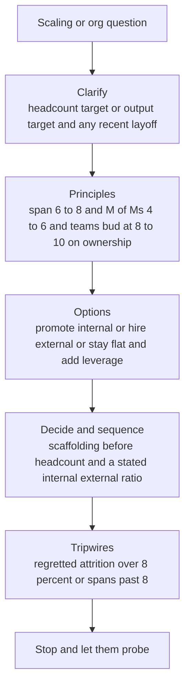

> Google and Meta run a dedicated **Organizational Design** round at Director level, and it exists for one reason: to tell a Director apart from a senior EM. An EM manages individuals well. A Director builds **org capability** — manager pipelines, succession benches, span math, team topology — so the org keeps working when the Director isn't in the room and the signal arriving is delayed and second-hand (Hogan called this the *meta-management* problem: you manage people you barely observe through people who filter what you hear). This is the cluster where the answers most reveal level. "I promote my best engineer into management" is an EM answer. "Here's the span math, the internal-vs-external ratio, the scaffolding that breaks at 30 engineers, and the failed transition that taught me to stop doing that" is a Director answer. The inherited-underperforming-team question lives here too, because at this level it isn't a coaching story — it's a **live org-diagnosis exercise**, and they're watching whether you treat the team as a blob or assess it person by person.

### Learning objectives
- Run the **scaling hypothetical** (15→50, or triple in 18 months) on real **span math** — managers at 6–8 engineers, M-of-Ms at 4–6 — with a sequenced plan, a defensible internal-vs-external ratio, and the scaffolding that breaks at ~30.
- Hold the **inverted 2026 version**: grow *scope* without headcount via AI leverage, platform investment, and fewer/larger teams — a manager role is now a cost to justify, not a default of growth.
- Walk the **inherited-low-delivery-team 90 days** as a turnaround: listen-fast (visible diagnosis in 30 days), structural decisions by 60–90, per-person assessment — never a blob — with a before/after metric.
- Tell a **failed-manager-transition** honestly (the best-IC-promoted-by-default trap), and run **skip-levels as a deliberate system** — including the trap where a skip hands you negative feedback about a manager.
- Build **succession and bench** in an era of fewer slots — growth-without-promotion — so "who could do your job tomorrow" has a real name and the org doesn't miss a quarter when you go.

### Intuition first
Think of an org the way a structural engineer thinks of a building, not the way a foreman thinks of a crew. A foreman knows every worker and can step in anywhere — that scales to about a dozen people, then the foreman *is* the ceiling. A structural engineer never lifts a beam; they design the **load paths** — which columns carry weight, how load redistributes when you add a floor, where it cracks first if you build too fast. Managing managers is that shift: each manager is a column rated for a weight (6–8 engineers), each manager-of-managers carries a cluster (4–6 managers), and when you scale you don't pour floors faster than the columns can cure — or it comes down as a reorg six months later. The inherited-team question is a building someone designed badly and handed you mid-occupancy: your first job isn't to evacuate it, it's to *inspect the load paths* — which column is failing, which crack is structural and which cosmetic — before you move any walls. And the modern twist they're testing: a 2026 Director knows adding a floor (headcount) is the *expensive* way to get more building, and asks first whether the same space comes from bigger floors or stronger materials — leverage before bodies.

---

## The questions

Eight prompts, one competency — *do you build org capability or manage individuals* — from different angles.

| Variant | What it's really testing |
|---|---|
| "Scale this org 15→50 (or triple in 18 months) — walk me through it. When do you split a team?" | Span math, sequencing, internal/external ratio — a *plan*, not an org chart. |
| "You inherit a team with low delivery and morale — your first 90 days." | Org diagnosis under a turnaround clock; per-person, not blob; a structural fix. |
| "How do you develop a first-time manager? Tell me one you grew — and one transition that failed." | Whether you build a manager pipeline and can name a real failure. |
| "A manager on your team is struggling — missed dates, rising attrition. What do you do?" | The meta-management problem: acting on delayed, second-hand signal. |
| "Do you run skip-levels? One brings negative feedback about their manager — now what?" | Skip-levels as a *system* with a purpose, and a real handling trap. |
| "Who could do your job tomorrow? How do you build bench?" | Whether your bench is real (a name) or a bench of one (you). |
| "How do you decide whether a management layer is needed *at all*?" | The 2026 inversion — manager roles justified, not assumed. |
| "How did people grow in your org — promotions, scope, outcomes?" | Whether growth happened by design and survived the slot scarcity. |

The merge: hypotheticals take **Clarify → Principles → Options → Decide → Tripwires** (Lesson 10.2) — the senior signal is *committing* to a topology; behavioral variants take **STARL** with org-level outcomes. The through-line: **the unit you operate on is the org, not the individual.**

---

## The framework

For the **hypotheticals**, the spine is the same decision shape as a system-design problem — the numbers are the span constants:

- **Clarify.** Is the "50" a *headcount* or an *output* target — the honest 2026 first move is to ask whether leverage hits it without the bodies (the inversion). And: did the team just take a layoff?
- **Principles (the span math).** Managers support **6–8 engineers**; M-of-Ms carry **4–6**; teams **bud at 8–10** along *ownership* lines (Conway-aware), never around personalities; you'd rather **under-hire managers than create empty teams**.
- **Options, costed.** Promote internally (context, but under-cooked managers), hire externally (scar tissue, but dilution and a slow ramp), or stay flatter and invest in platform/AI to raise per-person output.
- **Decide + sequence.** At 50: ~**6–8 teams**, **2–3 senior-manager slots**, a stated **internal:external ratio** (~60/40), and **scaffolding before headcount** — onboarding, ladder, interview machine, on-call all break at ~30.
- **Tripwires + the failure mode you've hit.** What tells you you've scaled too fast (regretted attrition >8%, spans past 8) and what you'd *not* do — reorg twice, hire managers before their teams exist.

For the **behavioral** variants, **STARL** with org-level results: *"three of four managers I grew still run teams of 8+; my successor came from my bench."*

---

## 2015 vs 2026 — the calibration

This category was re-scored hard: the efficiency era inverted the default (growth = more managers) and tightened the clock on every turnaround.

- **The scaling question now often runs *inverted*.** In 2015 "scale 15→50" meant a hiring plan. The 2026 sharp version is *"get 50-equivalent output without 50 people"* — AI leverage, platform investment, fewer-but-larger teams. Manager roles fell ~6% industry-wide 2022–2025; "growth means more managers" is a dated reflex. The credible Director treats **headcount as the expensive option to justify** and answers the inversion before being asked. A plan that only adds bodies reads as ZIRP-era thinking (Lesson 10.11).
- **A management layer must justify its existence.** "Do we need a manager here at all?" is now a real question. A layer earns its place by carrying coordination load, growing people, and owning delivery — not by existing because the org grew. Post-2023 flattening means you're expected to run **wider spans and flatter structures** comfortably, not demand layers as a status marker.
- **The inherited-team clock tightened.** "I spent my first quarter listening" reads *slow*. The calibration is **listen-fast-then-act**: visible diagnosis in 30 days, first structural decisions by 60–90, listening evidenced by **specifics** (which two teams shipped through each other) not **duration**. Interviewers increasingly bolt on *"and the team just took a layoff"* — testing whether you can diagnose *and* rebuild trust on a clock.
- **Succession shifted to growth-without-promotion.** With fewer slots you can't promise high-potentials a title in two quarters. The modern answer keeps them engaged with **scope and hard problems**, runs **honest career conversations**, and accepts some will leave for a title elsewhere — you'd rather lose them well than lie to keep them.
- **Skip-levels are now table stakes.** Remote/hybrid and wide spans broke "my managers tell me what I need to know" — that's an abdication tell. A skip-level is a **deliberate, scheduled system** with a stated purpose (context down, signal up, talent calibration), never a backchannel — and when one hands you negative feedback about a manager, you never confront the manager with attributed quotes (it burns the channel).

---

## Model answers

### Answer 1 — "You inherit a team with low delivery and morale. Walk me through your first 90 days." (the centerpiece — Clarify → Principles → Options → Decide → Tripwires, applied as a turnaround)

> *(Classify first — this sets the clock.)* "Before the plan, I classify the situation. Low delivery *and* low morale, handed to me — that's a **turnaround, not a realignment**, so the clock is faster and 'I'll listen for a quarter' is the wrong instinct. One thing up front: **did this team just take a layoff?** If yes, the first 90 days are 60% trust-rebuild and I sequence the structural cuts more gently. Assume no recent cut.
>
> *(Days 1–30 — listen *fast*, with instrumentation.)* "First 30 days I diagnose, visibly and on a clock. 1:1s with all **four managers**, skip-levels with the ~**20 ICs** — and I read six months of delivery data, incident history, and the attrition list *before* I form a view, so conversations test hypotheses instead of generating noise. I'm hunting **skill vs will vs system**, and at org level it's almost always system first. Here: **two teams shared ownership of one service and shipped *through* each other** — every change needed both, so nothing moved — and *one* manager was the real problem. I don't treat the team as a blob; I have a per-person, per-team read by day 30.
>
> *(Days 30–60 — the structural fix, plus one visible win.)* "Days 30 to 60 I act on the structure — the Director lever. I **redrew the ownership boundary** so each team owns its service end-to-end; that unblocks delivery more than any pep talk. I **killed a zombie platform project** quietly consuming three engineers with no path to ship. And I shipped **one visible win** fast — cut on-call pages ~40% by fixing the top two noisy alerts — because a demoralized team needs proof, not a roadmap.
>
> *(Days 60–90 — per-person honesty and the upward reset.)* "Days 60 to 90 is the people work, person by person. **Growth plans for most.** A **respectful exit for one IC** genuinely misplaced — wrong role, not a bad engineer. For the struggling manager, a **60-day coaching arc with written criteria** — he turned it around. The piece most skip: I **reset upward** — told my VP the committed roadmap assumed ~**130% of real capacity** and renegotiated it. Protecting the team from an impossible plan is part of the turnaround.
>
> *(The number, and the honest miss.)* "Before-and-after: delivery predictability went from ~**40% of commitments hit to ~85%** over two quarters, **zero regretted attrition** the year after. What I'd do sooner: the manager conversation — I knew by **week 3** and didn't start until **week 7**. I wanted more data, but really I was avoiding the hard conversation, and the team paid for the month."

**Why it scores:**
- **Classifies before planning** (turnaround vs realignment sets the clock) and **clarifies the layoff variant** up front — the exact 2026 bolt-on the interviewer is poised to add. Commit-to-a-frame, the senior move.
- **Diagnoses system before person** (the shared-ownership boundary) and refuses to treat the team as a blob — a per-person read by day 30 is the named red-flag-avoider here.
- The **structural fix is the centerpiece** (redrawn ownership boundary, killed zombie project) — a Director lever, not a coaching one — paired with a fast visible win, and **resets upward** by renegotiating the 130%-capacity roadmap (managing the constraint, not just the people).
- Carries a **before/after number** (40%→85% predictability, zero regretted attrition) and an **honest miss with a date** (knew week 3, acted week 7) — quantified *and* self-critical, probe-resistant because the weakness is volunteered.

### Answer 2 — "Scale this org from 15 to 50 in 18 months — and a manager transition that failed." (the span-math plan + the honest failure)

> *(Clarify — surface the inversion.)* "Two things change my answer. Is **50 a headcount target or an output target** — because in 2026 my honest first move is to ask whether we hit the goal with platform and AI leverage and *fewer* people; a manager role is a cost I justify, not a default of growth. And is this **net-new growth or backfilling a cut?** Assume real growth — but I'd want it on record that I pushed.
>
> *(Principles — the span math.)* "The constants I plan against: a manager supports **6–8 engineers**, an M-of-Ms carries **4–6 managers**, teams **bud at 8–10** along *ownership* lines — never around personalities — and I'll **under-hire managers before I create empty teams** idling for reports.
>
> *(Decide + sequence — the plan.)* "So 50 is roughly **6–8 teams** and **2–3 senior-manager slots** under me. The sequencing is the real answer: **scaffolding before headcount.** Onboarding, the ladder, the interview machine, and on-call all **break at ~30 engineers** — hire to 50 before building those and you get a fast-growing org that can't ramp, promote, or hire consistently, and it cracks into a reorg by month 12. On the manager line, ~**60/40 internal-to-external**: internal preserves context and rewards the people who built the thing; external for the two areas where I have no bench, for the scar tissue we lack. What I'd *not* do: reorg twice, or hire managers before their teams exist.
>
> *(Tripwires.)* "I'm scaling too fast if regretted attrition crosses **8%**, or if first-time-manager spans drift past **8** because I hired engineers faster than I grew managers. Either one, I throttle hiring and let the scaffolding catch up.
>
> *(The failed transition — STARL, honest.)* "I promoted my **strongest IC** — owned our hardest service, everyone deferred to him — into managing the six-person team he'd anchored. Textbook mistake, and I made it: I promoted the **best coder by default** and assumed the management skills would follow. They didn't. He kept solving the hard problems himself instead of growing the team to — two strong engineers stalled, one left, and *his* calendar became the bottleneck. I caught it ~four months in through a skip-level: two reports independently said they 'never got to own anything hard.' I gave him a coaching arc and a staff-engineer track to step *back* onto with dignity — he took it; he's a principal now and happier. What I changed permanently: a manager candidate now **runs a real slice of the job first** — leads a project, mentors two people, takes a hiring loop — and we decide from evidence, not from 'best engineer.' That one cost me an attrition I owned."

**Why it scores:**
- **Surfaces the inversion unprompted** ("headcount or output target") — the sharpest 2026 calibration for this question — and puts the headcount push-back on record before committing to a bodies-based plan.
- The **span math becomes a sequenced plan** (6–8 teams, 2–3 senior-manager slots, 60/40 with the *why*) — the "plan, not an org chart" signal; **scaffolding-before-headcount** separates a Director from someone who's only drawn boxes, and the **tripwires** turn the plan into an owned decision rather than a guess.
- The failed transition names the **canonical trap** (promote-the-best-IC-by-default) and *owns making it*, with the **org cost quantified** (a strong engineer left) and a **system fix** (run-a-slice-first) that prevents the class, not just the instance.
- The exited manager landed *well* (principal track, happier) — decisiveness **with dignity**, the compassion bar that rose post-2022 (Lesson 10.6), not a cold "I moved him out."

---

## What interviewers probe here

- **"Span math, and when do you split a team?"** — *Strong:* managers at 6–8, M-of-Ms at 4–6, teams bud at 8–10 along *ownership* lines; names the scaffolding that breaks at ~30. *Red flag:* an org chart with no numbers, or splitting around personalities.
- **"Can you hit the goal *without* the headcount?"** — *Strong:* treats headcount as the expensive option, reaches first for platform/AI leverage and fewer-larger teams, justifies each manager role. *Red flag:* "growth means more managers" — the reflex that codes as ZIRP empire-building.
- **"You inherit a low-delivery team — first move?"** — *Strong:* classify turnaround-vs-realignment, diagnose **system before person**, a per-person read by day 30, a structural fix by 60, a before/after number. *Red flag:* "I reorganized on day one," or treating the team as a blob.
- **"A skip-level says their manager is the problem. Now what?"** — *Strong:* **protect the source**, triangulate with other signal (delivery data, other skips, peers), never confront the manager with attributed quotes. *Red flag:* "your report says…" in the manager's 1:1 — which burns the channel org-wide.
- **"Who could do your job tomorrow?"** — *Strong:* a real name (or two), the scope you've handed them to grow the bench, an honest "here's the gap I'm still closing." *Red flag:* a bench of one (you), or only developing people who look like you.

---

## Common mistakes

- **Promoting the best engineer by default.** The most common org-design error, and the most tempting. Management is a different job; a candidate should run a real slice of it first (lead a project, mentor, run a loop) and decide from evidence. No failed-transition story reads as someone who hasn't managed managers long enough to have made the mistake.
- **Treating the inherited team as a blob.** "Low morale, so I ran an offsite" is an EM answer. The Director assesses person by person and team by team — most are fine, one structure is broken, one person is the issue — and acts differently on each. No before/after metric means it didn't happen.
- **Reorganizing before diagnosing.** "I knew the fix on day one" is a red flag, not confidence. Reorgs around people instead of ownership, or a second reorg six months later, signal you designed from the org chart, not the load paths.
- **No skip-level system, or breaking the channel.** "My managers tell me what I need to know" is abdication at Director scope. The inverse — confronting a manager with attributed skip-level feedback — is worse: it teaches the org that talking to you is dangerous.
- **A bench of one.** If "who could do your job?" answers "nobody yet," you've made yourself the org's single point of failure. Succession is a deliverable, not a someday.

---

## Practice prompts

1. **Scale 15→50 in 18 months — answer the inverted version first.** *(Sketch: clarify headcount-vs-output and surface the leverage path before committing to bodies; span constants (6–8, 4–6, bud at 8–10 on ownership); ~6–8 teams + 2–3 senior-manager slots; scaffolding before headcount; ~60/40 with the why; tripwires at 8% attrition or spans past 8.)*
2. **Inherited low-delivery, low-morale team — first 90 days.** *(Sketch: classify turnaround vs realignment, ask about a layoff; days 1–30 diagnose system-vs-person from delivery data, per-person read; 30–60 the structural fix + one visible win; 60–90 per-person honesty + reset the roadmap upward; before/after number + an honest "I acted three weeks too late.")*
3. **A first-time-manager transition that failed.** *(Sketch: the best-IC-by-default trap owned, not sanitized; the org cost (a strong engineer stalled or left); caught via skip-level; a dignified step-back onto a staff/IC track; the permanent fix — run a slice before promoting.)*
4. **A skip-level brings negative feedback about a manager.** *(Sketch: protect the source; triangulate against delivery data, other skips, peers — never act on one data point; coach the manager on the *pattern* without attributed quotes; if real and persistent it becomes a documented performance conversation (Lesson 10.6) — but the channel survives.)*

---

### Key takeaways
- **The unit you operate on is the org, not the individual** — manager pipelines, span math, topology, succession. "I promote my best engineer" is the EM tell; "here's the span math and the failed transition that taught me not to" is the Director one.
- **Know the span constants cold:** managers at 6–8, M-of-Ms at 4–6, teams bud at 8–10 along *ownership* lines — and sequence **scaffolding before headcount** (onboarding, ladder, interview machine, on-call all break at ~30).
- **Answer the inverted scaling question:** headcount is the expensive option in 2026 — reach for platform/AI leverage and fewer-larger teams first, and justify every manager role rather than assuming growth adds layers.
- **The inherited team is org diagnosis on a fast clock:** classify turnaround-vs-realignment, diagnose **system before person**, read it person by person by day 30, land a structural fix by 60, reset the roadmap upward, carry a before/after metric.
- **Run skip-levels as a deliberate system** and **protect the source** when one hands you bad news about a manager; build a **named bench** so "who could do your job?" has a real answer and the org survives you.

> **Spaced-repetition recap:** Managing managers is **build-org-capability**, not manage-individuals. Hypotheticals take **Clarify → Principles → Options → Decide → Tripwires**; the principles *are* the span math — managers 6–8, M-of-Ms 4–6, teams bud at 8–10 on ownership, scaffolding before headcount (breaks at ~30). Answer the **inverted** version: leverage before bodies; justify every manager layer. The **inherited team** is org diagnosis on a turnaround clock — diagnose **system before person**, per-person by day 30, structural fix by 60, reset the roadmap upward, carry a before/after number. Tell a **failed transition** honestly (best-IC-by-default), run **skip-levels as a system** (protect the source, never attributed quotes), build a **named bench**. The people-side twin of Lesson 8.8 (Conway's Law as topology).

---

*End of Lesson 10.7. Org design is the people-side twin of Lesson 8.8's Conway's-Law architecture round — same load-path thinking, applied to managers instead of services. Lesson 10.8 turns to how you actually *run* the org you've built: the operating system — cadence, the visibility layer that catches a slipping migration at week 3, and the engineering-metrics literacy (DORA, DX Core 4) a 2026 panel now assumes.*
