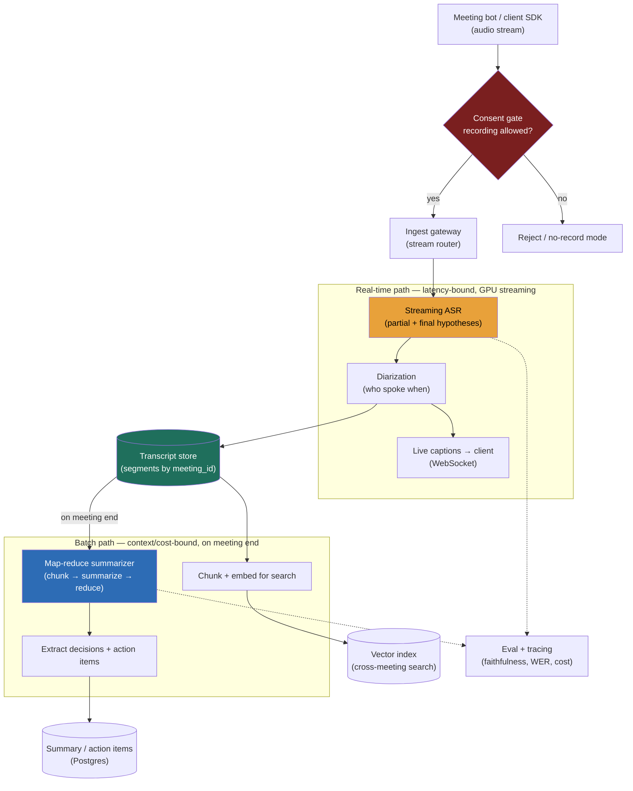

> **Why this problem separates Directors from ICs:** the trap is treating this as "one AI pipeline." It is two systems with *opposite* binding constraints wearing one product skin. The live-captions path is a **latency** problem — a continuous GPU stream pipeline that must emit words within a second of them being spoken. The notes path is a **context-window and cost** problem — summarizing a transcript that does not fit in a single prompt, without inventing action items nobody agreed to. Bolt on top a requirement most candidates never raise unprompted — **you are recording humans, often in two-party-consent jurisdictions** — and the design lives or dies on a consent-and-retention model, not on tokens/sec. A candidate who draws one box labeled "LLM" has already failed. The Director move is to split the workloads on the first whiteboard stroke, size each independently, and name consent as a hard requirement before the interviewer has to.

---

### Learning objectives

1. Decompose the system into **two independently-scaled paths** — real-time streaming ASR/diarization and batch summarization — and justify why they cannot share one design.
2. Size the **streaming ASR GPU fleet** (the dominant real-time cost) and the **summarization token bill** (the dominant batch cost) as two separate estimation lines.
3. Design **long-transcript summarization that exceeds the context window** with map-reduce / hierarchical reduction, and defend it against naive one-shot stuffing.
4. Treat **recording consent, PII, retention, and residency as first-class NFRs** with a concrete mechanism, not a compliance footnote.
5. Run a **RESHADED spine** where the back-end steps (Evaluation, Design evolution) carry the answer: faithfulness of summaries, WER under real conditions, and the evolution into an action-taking agent.

---

### Intuition first

Picture two people in the room with you during a meeting. The first is a **court stenographer**: heads-down, transcribing every word *as it is spoken*, never more than a beat behind, never pausing to think about meaning. They cannot fall behind — if they buffer for ten seconds to produce prettier prose, the live transcript is useless. The second is an **executive assistant** who was *not* typing live; after the meeting ends, they read the whole transcript, then write the half-page that actually matters: what was decided, who owns what, by when. They have the luxury of time and the whole document, but they have a different hard problem — a three-hour board meeting's transcript is longer than they can hold in their head at once, so they summarize it in passes (section by section, then a summary of summaries), and they must be scrupulous not to write down a "decision" that was only ever floated.

Those are your two subsystems. The stenographer is a **streaming, latency-bound GPU pipeline**. The assistant is a **batch, context-bound LLM pipeline**. They share a transcript and almost nothing else. And hovering over both is a lawyer asking the question the product person forgot: *did everyone in this room agree to be recorded, and where is that recording allowed to live?* The whole design is getting those three characters — stenographer, assistant, lawyer — to work in one system without pretending they're the same person.

---

## R: Requirements

> Scope before build. The defining move here is **splitting the two workloads out loud** and **raising consent yourself** — both are Director-altitude signals the interviewer is waiting for.

**Clarifying questions I'd ask (with assumed answers):**

- *Live captions, or just a post-meeting summary?* → **Both.** Live transcript during the meeting *and* a summary + action items after. This is what forces the two-path design; if it were summary-only, the streaming path collapses.
- *Do we need to know who said what?* → **Yes — speaker diarization.** Action items are worthless without an owner ("*someone* will follow up" is noise).
- *Where does the audio come from?* → **A meeting platform / bot or client SDK** streams audio to us. We don't own the video conferencing; we ingest its audio.
- *Consent model?* → **We must capture and enforce recording consent**, and operate in two-party-consent jurisdictions. First-class requirement, not deferred.
- *Search across past meetings?* → **Yes.** "What did we decide about pricing last quarter?" → RAG over the transcript corpus.
- *Multilingual?* → **English first, multilingual as a design-evolution axis**, not v1 scope.
- *Real-time translation, sentiment, video understanding?* → **Out of scope for v1**, name as evolution.

**Functional requirements:**

1. **Live transcription**: near-real-time captions during the meeting.
2. **Speaker diarization**: attribute each utterance to a speaker.
3. **Post-meeting summary**: a concise summary, **decisions**, and **action items with owners**, generated after the meeting ends.
4. **Cross-meeting search**: ask natural-language questions over the user's past meetings, with citations to the transcript.
5. **Consent & access**: capture recording consent; enforce who may view a given meeting's transcript/summary.

**Explicitly cut (named as delegated / later):** the conferencing platform itself, real-time translation, video/screenshare understanding, sentiment/coaching analytics, calendar integration internals. I'll say "separate service" or "evolution."

**Non-functional requirements — and the inversion to state out loud:** this system has **two NFR profiles**, one per path. Write them as two columns, because a single priority list hides the whole point.

| Priority | Real-time path (captions) | Batch path (notes) |
|---|---|---|
| 1 | **Latency**: partial caption < ~1 s after speech | **Faithfulness**: no invented decisions/action items |
| 2 | **Accuracy (WER)** under accents, crosstalk, jargon | **Summary quality / coverage** of what mattered |
| 3 | **Availability** of the live stream (no caption gaps) | **Cost** (LLM tokens dominate here) |
| 4 | **Cost** (ASR GPU dominates here) | **Latency** (seconds-to-minutes after meeting — relaxed) |
| — | **Privacy & consent** — a hard constraint over **both** paths, not a ranked line | | |

The two paths fail differently and are tuned differently: the stenographer must never lag; the assistant must never lie. Conflating them is the core mistake.

---

## E: Estimation

> Two compute lines, because the two paths bill in different currencies — **GPU-seconds of streaming ASR** and **LLM tokens of summarization**. Show both; that's the whole point of the estimate.

**Assumptions:** 5M meetings/day; business-hours concentration → **~50,000 concurrent meetings** at peak; average meeting 45 min; ~130 spoken words/min → ~6,000 words ≈ **~8K tokens** of transcript per meeting (a 2-hour meeting ≈ ~20K+ tokens — this is the number that breaks naive summarization).

**Audio ingest (cheap, not the constraint):** Opus-compressed speech ≈ ~32 kbps. `50,000 streams × 32 kbps ≈ 1.6 Gbps` ingest. Trivial bandwidth; the audio itself is small. The cost is what you *do* with it.

**Real-time ASR fleet (the dominant real-time cost):** a streaming ASR model on a modern GPU serves many concurrent real-time streams — the real-time factor is well under 1× per stream, so one GPU handles on the order of **~50–100 concurrent live streams** (model- and latency-target-dependent). At 50K concurrent: `50,000 ÷ ~75 ≈ ~670 GPUs` for transcription, plus diarization compute on top. **This GPU fleet — provisioned for the concurrent-meeting peak — is the headline real-time cost**, and it's a *capacity* (provisioned), not a per-token, cost.

**Summarization token bill (the dominant batch cost):** per meeting, summarize ~8K input tokens → ~500-token summary. Map-reduce adds overhead (re-reading chunk summaries in the reduce step) → call it ~1.3–1.5× input tokens. `5M meetings/day × ~11K effective tokens ≈ ~55B tokens/day` of summarization. **This is a per-token cost that scales with usage**, so it's the line a viral growth curve blows up. Batch it on the async API for ~50% off; it's latency-relaxed.

**Storage:** transcripts ≈ `5M/day × ~50 KB ≈ 250 GB/day` of text → ~90 TB/yr before tiering; cheap, but retention policy (below) caps it. Embeddings for search: chunk each transcript → ~10–20 vectors/meeting → billions of vectors over time → a sharded vector index, the real search-side cost.

**What estimation decided:** the two paths have **different cost functions** — provisioned GPU capacity sized to *concurrent meetings* vs per-token LLM spend sized to *total meetings*. You scale and budget them separately. Audio bandwidth and transcript storage are rounding errors.

---

## S: Storage

> Five data classes; the access pattern and the consent/retention requirement pick each store.

**1. Live audio (ephemeral, streaming).** Not durably stored as audio by default (storing raw audio is a privacy liability and a cost — see retention). Buffered in memory / a short-lived stream (e.g., a Kafka topic or in-process ring buffer) only long enough to transcribe. **Rejected:** persisting raw audio for every meeting — multiplies storage and, more importantly, your breach blast radius and consent surface. Store audio only if a feature (e.g., playback) demands it, and then under the retention clock.

**2. Transcript store (segments, append-during-meeting, read-after).** Time-ordered utterances: `(meeting_id, speaker_id, text, start_ts, end_ts, confidence)`. Write pattern is a stream of small appends during the meeting; read pattern is "whole transcript for this meeting." **Choice: a wide-column / document store keyed by `meeting_id`** (e.g., Cassandra/DynamoDB, or Postgres at smaller scale) — segments cluster under the meeting, single-meeting reads are one partition. **Rejected:** a relational row-per-word with heavy indexing — write amplification for no query benefit; we almost never query individual words, we read whole meetings.

**3. Summary / action-items store (small, structured, strongly-read).** One record per meeting: summary text, decisions[], action_items[{owner, text, due}]. Small, read by humans and downstream integrations. **Postgres** — it's tiny, relational (action items link to users), and benefits from consistency. 

**4. Vector index for cross-meeting search.** Transcript chunks embedded for RAG. Sharded ANN index (HNSW), **filtered by the requesting user's access tags at query time** so search never crosses a permission boundary. **Rejected:** keyword-only search — misses paraphrased questions ("what did we agree on for the launch" vs the literal words used).

**5. Consent & metadata store (authoritative, audited).** Per-meeting: participant list, consent state per participant, jurisdiction, retention class, residency region. Strongly consistent, **append-only audit trail** of consent events — because this is the record you produce in a dispute. **Postgres**, co-located with the access model.

---

## H: High-level design

> The shape to make visible on the board: **two pipelines off one audio stream**, joined only by the transcript store, with a **consent gate in front of both** and a **search index hanging off the batch path.**



**Happy path:**

1. The meeting bot/SDK opens a stream; the **consent gate** checks that recording is permitted for this meeting (all-participant consent in two-party jurisdictions). No consent → reject or drop into a no-record mode. Nothing flows past this gate without it.
2. Audio streams to the **ingest gateway**, which routes it to a **streaming ASR** worker on the GPU fleet. ASR emits **partial hypotheses** (revised as more audio arrives) for low-latency captions and **finalized** segments when an utterance endpoints.
3. **Diarization** labels segments by speaker; finalized, speaker-attributed segments are (a) pushed to the client as **live captions over WebSocket** and (b) appended to the **transcript store**.
4. On **meeting end**, the batch path triggers: the **map-reduce summarizer** reads the full transcript, produces a summary + **decisions** + **action items with owners**, and writes to the summary store. In parallel, transcript chunks are **embedded and indexed** for cross-meeting search.
5. Users later **search** their meetings: query → embed → ANN over the vector index *filtered by their access* → relevant chunks → grounded, cited answer.

**The load-bearing structural decision:** the transcript store is the **seam** between the two paths. The real-time path's only durable output is transcript segments; the batch path consumes them asynchronously. This decouples a latency-critical GPU pipeline from a cost-heavy LLM pipeline so each scales, fails, and is tuned on its own terms. If ASR is down, captions degrade but the system is up; if summarization is backed up, captions are unaffected.

---

## A: API design

> The contract carries the two-path story: a streaming interface for live work, request/response for the rest, and consent as an explicit resource.

```
# --- Live session (real-time path) ---
WS  /v1/meetings/{id}/stream
  client→server: binary audio frames (Opus)
  server→client: { type:"partial"|"final", speaker, text, ts_start, ts_end, confidence }
  # partials are revisable; finals are appended to the transcript

# --- Consent (gate for both paths) ---
POST /v1/meetings/{id}/consent
  body: { participant_id, consent: true, jurisdiction }
  -> 200 { meeting_recordable: bool }    # false until policy satisfied (e.g., all-party)
GET  /v1/meetings/{id}/consent           -> 200 { participants:[{id,consent,ts}], recordable }

# --- Transcript & summary (batch path outputs) ---
GET  /v1/meetings/{id}/transcript?from=&to=  -> 200 { segments:[{speaker,text,ts}] }
GET  /v1/meetings/{id}/summary
  -> 200 { summary, decisions:[...], action_items:[{owner, text, due}], citations:[...] }
  -> 202 { status:"processing" }         # summary not ready yet (async)

# --- Cross-meeting search (RAG) ---
POST /v1/search
  body: { query, time_range?, project? }
  -> 200 { answer, citations:[{meeting_id, segment_ts}] }   # access-filtered

# --- Retention / privacy ---
DELETE /v1/meetings/{id}                  # honor deletion / retention expiry; tombstones across stores
```

**Design notes (each with its rejected alternative):**

- **WebSocket (not request/response) for the live path**, because captions are a continuous bidirectional stream with revisable partials. Rejected: chunked HTTP polling — adds latency and can't cleanly revise a partial hypothesis.
- **`partial` vs `final` message types.** Partials give sub-second perceived latency (revised as context arrives); finals are what we persist. Rejected: emit only finalized text — captions would lag by the length of an utterance, failing the latency NFR.
- **Summary returns `202 processing`** because it's async (post-meeting, latency-relaxed). Rejected: block the request until summarization finishes — couples a human-facing call to a multi-second LLM map-reduce.
- **Consent is a first-class resource with a `recordable` gate**, not an implicit checkbox. Rejected: assume consent — a recording made without it in a two-party jurisdiction is a legal incident, not a bug.
- **`DELETE` tombstones across all stores** (transcript, summary, vectors, any audio). Rejected: soft-delete only the summary — leaves transcript and embeddings as a privacy liability.

---

## D: Data model

> The consequential decisions are the **diarization-aware transcript segment**, the **map-reduce-friendly chunking**, and the **consent/retention record**.

**`transcript_segments`** — partition key `meeting_id`, clustering key `start_ts`. Columns: `speaker_id`, `text`, `end_ts`, `confidence`, `is_final`. Clustering by timestamp gives ordered single-meeting reads in one partition. Speaker attribution lives here because every downstream owner-of-action-item depends on it.

**`meetings`** — `meeting_id` (PK), `owner_id`, `participants[]`, `started_at`, `ended_at`, `jurisdiction`, `retention_class`, `residency_region`, `status`. The retention/residency fields drive lifecycle and where data physically lives.

**`summaries`** — `meeting_id` (PK), `summary`, `decisions[]`, `action_items[{owner_id, text, due, source_segment_ts}]`, `model_version`, `generated_at`. **Every action item carries a `source_segment_ts`** — a citation back into the transcript, so a disputed "action item" is verifiable and not a hallucination (this is the faithfulness hook).

**`consent_events`** — append-only: `(meeting_id, participant_id, event, ts, jurisdiction)`. The audit trail you produce in a dispute; never updated, only appended.

**`meeting_chunks`** (vector index) — `chunk_id`, `meeting_id`, `embedding`, `text`, `speaker`, `ts`, **`access_tags`**. Access tags are filtered at query time so search can't leak a meeting the user can't see.

<details>
<summary>Go deeper — map-reduce summarization mechanics (IC depth, optional)</summary>

A 2-hour meeting (~20K+ tokens) summarized naively in one prompt is both expensive on every call and quality-degraded by "lost in the middle" — the model under-weights the middle third, exactly where mid-meeting decisions hide.

**Map-reduce:**
1. **Chunk** the transcript on natural boundaries (topic shifts / time windows), ~1–2K tokens each, preserving speaker labels.
2. **Map**: summarize each chunk independently → a per-chunk summary + any decisions/action items found, *each tagged with source timestamps*. Embarrassingly parallel.
3. **Reduce**: feed the chunk summaries into a final pass that produces the global summary and de-duplicates/merges action items.

**Refine (alternative):** carry a running summary and update it chunk-by-chunk. Better narrative coherence, but **serial** (can't parallelize) and the running summary can drift/forget early content. Use refine for short transcripts where coherence matters; map-reduce for long ones where parallelism and recall matter.

**Faithfulness controls:** instruct the model to emit *only* items grounded in the chunk, attach `source_segment_ts` to every decision/action item, and run an eval pass that checks each extracted action item against its cited segment. An action item with no valid citation is dropped — that's how you stop the assistant inventing commitments.

</details>

---

## E: Evaluation

> Re-check against the two NFR profiles. The failure modes are **caption lag, transcription errors, hallucinated action items, and a consent/retention miss** — and they're caught by different mechanisms.

**Re-check vs NFRs:**

- Latency (captions) → streaming ASR with revisable partials keeps perceived latency < ~1 s; the live path never blocks on the batch path.
- Faithfulness (notes) → every decision/action item is grounded with a `source_segment_ts` and eval-checked against its citation.
- Privacy/consent → the consent gate fronts both paths; retention/residency are enforced in the data lifecycle.

**Failure 1 — caption lag / the latency budget.** If ASR buffers for context to improve accuracy, captions fall behind and the stenographer fails. Mitigation: **streaming ASR that emits partials** and revises them, trading a little early-word accuracy for immediacy; size the GPU fleet to the concurrent-meeting peak so requests aren't queued. The trade-off named: partials occasionally "flicker" as they're revised — acceptable, and far better than a 10-second lag.

**Failure 2 — accuracy (WER) under real conditions.** Demo audio is clean; real meetings have accents, crosstalk, domain jargon ("our SKU-7 migration"), and bad mics. Mitigations: domain-term biasing / custom vocabulary, per-customer acoustic adaptation, and **surfacing low-confidence segments** rather than hiding them. WER is the metric; track it on a representative eval set, not on clean audio. Delegate model tuning ("I'd have the speech team benchmark a domain-adapted model vs the base on our worst-WER cohorts; my prior is adaptation pays for itself on jargon-heavy calls").

**Failure 3 — hallucinated decisions/action items (the dangerous one).** A summary that invents "Priya will ship by Friday" when Priya said no such thing is worse than no summary — people act on it. This is a **faithfulness** failure, and it's why every extracted item is citation-grounded and eval-gated against its source segment. Run faithfulness eval as a **ship gate** on any prompt/model change; a silent model update can regress it invisibly.

**Failure 4 — long-context summarization breaks.** One-shot stuffing of a long transcript is expensive per call and degrades via lost-in-the-middle. Map-reduce (Go-deeper) keeps recall and cost bounded and parallelizes the map step. The trade-off: map-reduce can miss *cross-chunk* context (a decision referenced across two sections); mitigate with overlap and a reduce pass that reconciles.

**Failure 5 — consent/retention/residency (the career-ending one).** Recording in a two-party-consent jurisdiction without all-party consent, retaining transcripts past policy, or storing EU data outside its region are **legal incidents**. Mitigations: the consent gate blocks recording until policy is satisfied; a **retention clock** per `retention_class` auto-tombstones expired data across *all* stores; residency routing keeps data in-region; the `consent_events` audit trail is the evidence. This is a first-class operational process (echoing the reconciliation discipline of payments), not a setting. **The Director framing**: I own "can we legally record this, where does it live, and when does it disappear" — and I'd partner with legal on jurisdiction policy while owning the enforcement mechanism.

---

## D: Design evolution

> The natural evolution turns the passive note-taker into an **action-taking agent** — which is exactly where the agent designs come back.

**1. From notes to actions (agentic).** Today the assistant *extracts* "Priya will file the ticket by Friday." The evolution: it *files the ticket* — via tool calls to Jira/calendar/email. This crosses from output-risk to **action-risk**: an action taken on a hallucinated or misheard item has real consequences. So the evolution ships with **human-in-the-loop confirmation** on each proposed action, least-privilege tool scopes, idempotent actions, and an audit log — autonomy gated by reversibility, the same bounded-autonomy posture as the tool-using support agent. "Draft the follow-up email" (reversible, auto) vs "send it to the customer" (irreversible, approval).

**2. Real-time summary.** Roll up a live running summary during the meeting (refine-style on the in-progress transcript), not just at the end — a latency-relaxed-but-incremental third workload.

**3. Multilingual & translation.** Per-stream language detection, multilingual ASR, and real-time translation captions — each adds model and eval surface; stage it after English quality is proven.

**4. On-device / edge ASR for privacy.** For sensitive customers, run ASR client-side so raw audio never leaves the device; only the transcript (or only the summary) reaches the cloud. Trades fleet cost and model quality for a dramatically smaller privacy surface — a Director-level knob for regulated industries.

**5. Multimodal.** Screenshare/slide OCR and video understanding to ground "the number on slide 4" — a separate ingest path feeding the same transcript seam.

**Builds on:** LLM inference & serving (the GPU economics that govern both the ASR fleet and the summarizer); RAG (the cross-meeting search path); agent memory & context management (long-context / lost-in-the-middle, the map-reduce rationale); LLM cost & latency (the per-token summarization bill and batch-API savings); eval (the faithfulness gate); the agentic evolution work; the tool-using agent whose bounded-autonomy posture the agentic evolution adopts; and the governance/cost/privacy ownership this problem foregrounds.

---

## Trade-offs table: the pivotal decisions

| Decision | Option A | Option B | Option C | Use when... |
|---|---|---|---|---|
| **ASR mode** | **Streaming ASR (partials + finals)** | Batch ASR after meeting (e.g., Whisper-class) | Hybrid: streaming live + batch re-transcribe for the stored record | **A** required for live captions (latency NFR). **B** only if there are no live captions (summary-only product). **C** best of both — cheap streaming live, higher-accuracy batch pass for the durable transcript. |
| **Summarization** | **Map-reduce (chunk→map→reduce)** | Refine (running summary) | One-shot full-transcript stuffing | **A** for long transcripts — bounded cost, parallel, good recall (our default). **B** for short meetings where narrative coherence matters. **C** rejected for long meetings — expensive per call and degrades via lost-in-the-middle. |
| **ASR location** | **Cloud GPU fleet** | **On-device / edge ASR** | Per-customer dedicated | **A** default — best models, central ops, but raw audio leaves the client. **B** for regulated/sensitive customers — minimal privacy surface, lower quality, no fleet cost. **C** for enterprise data-isolation contracts. |
| **Audio retention** | **Don't store raw audio (transcript only)** | Store audio under a retention clock | Store indefinitely | **A** default — smallest breach/consent surface. **B** only if playback/QA needs it, with auto-expiry. **C** never — unbounded liability. |

---

## What interviewers probe here (Director altitude)

- **"How do you summarize a 2-hour meeting whose transcript exceeds the model's context window?"** — *Strong signal:* names the context-window limit explicitly, reaches for **map-reduce / hierarchical reduction** (chunk → summarize → reduce), and notes lost-in-the-middle as the reason one-shot stuffing degrades even when it *fits*. Mentions citation-grounding to keep the reduce faithful. *Red flag:* "send the whole transcript to the LLM" with no awareness of context limits, cost, or middle-degradation.

- **"How do you get captions to feel real-time?"** — *Strong signal:* **streaming ASR with revisable partial hypotheses**, the live path decoupled from the batch path, and a GPU fleet sized to the concurrent-meeting peak so nothing queues. Names the partial-flicker trade-off as acceptable. *Red flag:* "transcribe when the meeting ends" or batch-ASR-everything — misses the latency NFR entirely.

- **"What about consent and privacy?"** (often *not asked* — raising it unprompted is the signal) — *Strong:* treats recording consent (two-party jurisdictions), retention, and residency as **first-class requirements** with a consent gate, a retention clock that tombstones across all stores, and an audit trail; partners with legal on policy, owns enforcement. *Red flag:* never mentions consent, or treats it as "a checkbox in settings."

- **"These are two very different workloads — how do you architect for both?"** — *Strong:* the two-path split with the **transcript store as the seam**, each path scaled/tuned/budgeted independently (provisioned GPU capacity vs per-token LLM spend), and graceful degradation (ASR down ≠ system down). *Red flag:* one monolithic "AI pipeline," or scaling both paths off one metric.

- **"How do you stop it inventing action items?"** — *Strong:* **citation-grounded extraction** (every item links to a source segment), a **faithfulness eval gate** on changes, and dropping un-cited items — then notes that *taking action* on items (the evolution) demands HITL because the blast radius changes. *Red flag:* "the model is usually accurate" with no grounding or eval mechanism.

---

## Common mistakes

- **One "AI pipeline" box.** Treating live captions and post-meeting notes as one system. They have opposite binding constraints (latency vs context/cost) and must be split, joined only by the transcript.
- **Naive long-transcript summarization.** Stuffing a whole long transcript into one prompt — expensive on every call and degraded by lost-in-the-middle. Map-reduce or refine, by transcript length.
- **Consent as an afterthought.** Recording humans without an enforced consent model, retention clock, and residency policy is a legal incident in waiting. Raise it before the interviewer does; it's a Director tell.
- **Hallucinated commitments.** Emitting decisions/action items the meeting never produced. Ground every item with a citation and gate it on a faithfulness eval; an item without a valid source segment is dropped.
- **Sizing both paths off one number.** The ASR fleet is provisioned to *concurrent meetings*; the summarization bill scales with *total meetings* of tokens. They are different cost functions and scale independently.

---

## Practice questions with model answers

**Q1. A user complains live captions lag the speaker by several seconds. What's wrong and how do you fix it?**

> *Model:* The ASR is likely buffering for context (or batching) before emitting, or the GPU fleet is queueing under load. Fix: use a **streaming ASR that emits revisable partial hypotheses** so words appear within ~1 s and are corrected as more audio arrives; ensure the **live path is decoupled** from the batch summarizer so it never blocks; and confirm the GPU fleet is **provisioned to the concurrent-meeting peak** (this is a capacity, not per-token, cost) so streams aren't queued. Accept that partials occasionally flicker as they revise — far better than a multi-second lag.

**Q2. Your summary listed a decision that the team says they never made. Diagnose and prevent it.**

> *Model:* A **faithfulness failure** — the summarizer asserted something ungrounded, likely in the reduce step or via a low-confidence (mis-transcribed) segment. Prevent it by: (a) **grounding every extracted decision/action item with a `source_segment_ts`** and dropping any item without a valid citation; (b) running a **faithfulness eval** (does each item trace to its cited segment?) as a **ship gate** on prompt/model changes; (c) surfacing low-confidence ASR segments so a transcription error doesn't silently become a "decision." If it recurs after a vendor model update, that's why the eval gate exists — a silent model change can regress faithfulness invisibly.

**Q3. Walk me through summarizing a 3-hour, multi-topic meeting that's ~30K tokens.**

> *Model:* It exceeds a comfortable single-prompt budget and would degrade via lost-in-the-middle even if it fit. Use **map-reduce**: chunk on topic/time boundaries (~1–2K tokens, speaker-preserving) → **map** (summarize each chunk in parallel, extracting cited decisions/action items) → **reduce** (merge chunk summaries into a global summary, de-dup and reconcile action items). Add chunk overlap and a reconciliation step in the reduce to catch decisions referenced across chunk boundaries. Run it on the **async/batch API** (latency-relaxed, ~50% cheaper). Rejected: one-shot stuffing (cost + middle-degradation); refine (serial, can drift on a 3-hour transcript).

**Q4. A customer in a two-party-consent jurisdiction is recording calls. What does your design have to guarantee?**

> *Model:* Recording must not start until **all participants have consented** for that jurisdiction — enforced by the **consent gate** in front of both pipelines, with the meeting non-recordable until policy is satisfied. Every consent action is written to an **append-only `consent_events` audit trail** (the evidence in a dispute). Transcripts/summaries carry a **retention class** that auto-tombstones expired data across *all* stores (transcript, summary, vectors, any audio), and a **residency region** keeps data in-jurisdiction. I'd set policy with legal and own the enforcement mechanism. For the most sensitive customers, offer **on-device ASR** so raw audio never leaves their environment.

---

### Key takeaways

1. **It's two systems, not one.** A latency-bound streaming ASR/diarization path for live captions and a context/cost-bound batch summarization path for notes — joined only by the transcript store, scaled and tuned independently. Drawing one "AI box" is the failure.
2. **Two cost functions.** The **ASR GPU fleet is a provisioned capacity sized to concurrent meetings**; the **summarization token bill is a per-token cost sized to total meetings**. Estimate and budget them as separate lines.
3. **Long transcripts need map-reduce.** Naive one-shot summarization is expensive per call and degrades via lost-in-the-middle. Chunk → map (parallel) → reduce, with citation-grounding so the reduce stays faithful.
4. **Faithfulness over fluency.** A hallucinated decision or action item is worse than none — people act on it. Ground every item with a source-segment citation, eval-gate it, and drop un-cited items. Taking *action* on items (the evolution) raises the stakes to HITL.
5. **Consent, retention, residency are first-class.** You're recording humans, often under two-party-consent law. A consent gate, a retention clock that tombstones across all stores, residency routing, and an audit trail are design primitives — and raising them unprompted is the Director signal.

> **Spaced-repetition recap:** Meeting assistant = **stenographer + executive assistant + lawyer** in one system. Split into a **real-time streaming ASR/diarization path** (latency-bound, partials over WebSocket, GPU fleet sized to *concurrent* meetings) and a **batch summarization path** (context/cost-bound, triggered on meeting end), joined by the **transcript store** as the seam. Long transcripts → **map-reduce** (chunk→map→reduce), never one-shot stuffing (lost-in-the-middle + cost). Stop hallucinated action items with **citation-grounded extraction + a faithfulness eval gate**. **Consent/retention/residency are first-class** — consent gate over both paths, retention clock tombstoning across all stores, audit trail. Cross-meeting search = RAG over transcripts, access-filtered. Evolves into an **action-taking agent** with HITL gated by reversibility. Two cost functions: provisioned ASR GPUs (concurrent) vs per-token summarization (total). Builds on: serving + GPU economics, RAG search, long-context/map-reduce, LLM cost, faithfulness eval, and privacy/cost ownership.

---

*End of Lesson 10.8 and of the GenAI-problems track. The meeting assistant is the module's synthesis problem: it stacks a latency-bound streaming pipeline, a context-bound summarization pipeline, a RAG search layer, and a consent/governance model into one system — and the Director's job is to keep those four concerns from collapsing into a single hand-wave. The agentic evolution (acting on the notes, not just writing them) is where the agent-safety discipline stops being theory.*
