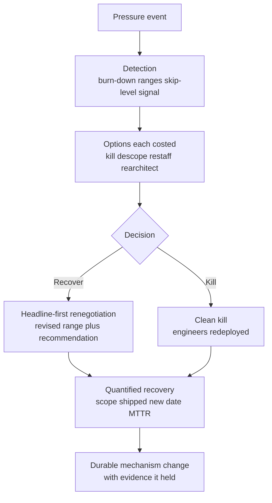

> Every Director loop runs a Deliver-Results round, and at this level the scored unit is not the heroic sprint, it's the **system**: did you detect the slip early in the data, cost the options, renegotiate headline-first, recover with numbers, and change a mechanism so it doesn't recur. Post-flattening, they also assume you're a hands-on execution owner, "I brought in a strong tech lead" dies on the follow-up because they expect *you* to have inspected enough of the architecture to validate the recovery plan. This cluster carries the two most revealing questions in the whole loop, the incident you commanded, and the decision you got *wrong*, and a weak answer to either is disqualifying at L6+, because both read directly on self-awareness and decision-process quality. The round lives in the gap between the candidate who blames shifting requirements and the one who owns the chart.

### Learning objectives
- Run the execution story on a **system spine**, early detection, options costed, headline-first renegotiation, quantified recovery, durable mechanism change, delivered as STAR-L, not as a crunch-and-hope war story.
- Command the **incident** answer on its own spine: severity classification, role separation (you coordinate, you don't type the fix), a comms cadence you wrote, a hard call under incomplete information with the risk reasoning shown, and a **blameless postmortem with verified action items**.
- Answer the **wrong-decision** variant with decision-process maturity: a consequential Director-scale call, why it was reasonable *then*, reversal speed, and the **one-way / two-way-door guardrail** you built that later fired.
- Make **"I recommended we kill it"** the default turnaround answer, cost discipline and portfolio thinking are what score in the post-ZIRP era, not the rescue.
- Calibrate to the **2026 bar**: quantified impact in every behavioral answer, verified postmortem follow-through over the postmortem-as-meeting, and AI as a timeline lever, not only scope-cut and bodies.

### Intuition first
A senior pilot is not judged by whether the flight hit turbulence, every flight does, but by the instrument scan. Three failures, all fatal in their own way. **Fly by the seat of your pants**: no scan, no early warning, and the first you know of trouble is the stall, that's the manager whose project "suddenly" slips a quarter because nobody was reading the burn-down. **Hide the problem from the tower**: you watch the fuel gauge drop and say nothing, hoping to make the runway, so when you finally declare an emergency it's a surprise and there's no time to help you, that's the leader who sits on bad news to fix it quietly first. The skill is the *third* path: scan continuously, declare the problem the moment the trend turns, lay out the options with their costs ("divert, hold, or push"), commit to one with the reasoning visible, land it, and then change the checklist so the next crew catches it earlier. Interviewers in this round are listening for the scan, a leader who saw the slip in the data before anyone was surprised, reasoned through the options instead of grabbing the controls, and treats the failure as a system to fix, not a person to blame and not a story to crunch out of.

---

## The questions

These are nearly all past-event questions (STAR-L). The unifying thread: at Director altitude the *system* is the answer, not the sprint, how you detected, decided, renegotiated, recovered, and what mechanism you changed.

| Variant | What it's really testing |
|---|---|
| "Tell me about a project that missed its deadline / a failure you owned." | Early detection and who you told, *when*, the slip isn't the failure; the surprise is. |
| "Tell me about turning around a failing project. Did you consider killing it?" | Portfolio thinking, "I recommended we kill it" is now often the *stronger* answer than the rescue. |
| "Walk me through a major production incident you led, end to end." | The IC command spine, coordination over keyboard, comms cadence, a hard call, a verified postmortem. |
| "Shipping under an impossible deadline, what did you cut, who signed off?" | Scope-cut with explicit stakeholder consent, never quality cut silently. |
| "Tell me about a decision you got wrong. When did you know, how fast did you reverse?" | Decision-process maturity, reversibility assessment, reversal speed, the guardrail you built. |
| "Make the business case for paying down tech debt / a major refactor." | Debt framed in dollars and risk, not morality; a tool other than the rewrite-quarter. |
| "An incident caused by a change you approved, what changed in your process?" | Owning your contribution, and a mechanism change with evidence it held. |

The merge: every one is a **past-event** question, so they all take **STAR-L**, but on a *system spine* (below), with two specialized variants. The **incident** question runs on the IC command spine; the **wrong-decision** question on the reversibility spine. Both are STAR-L underneath; the spine just tells you which beats to hit.

---

## The framework

The general spine is five beats, in order, each doubles as the probe-defense, because each is exactly where a senior interviewer drills three levels down.

- **Detection, how you saw it early.** Milestone burn-down, forecast *ranges* not point estimates, a skip-level signal. The load-bearing line of the whole cluster: *missing the deadline isn't the failure; letting someone be surprised by it is.* If your story starts at the crisis, you've lost the round, start at the instrument that flagged it.
- **Options, each costed.** Kill / descope / re-staff / re-architect, and what each costs in time, money, and risk. The decision *tree* is the Director signal, not the heroics; a candidate who jumped straight to "we worked weekends" skipped the part being scored.
- **Decision + headline-first renegotiation.** Take the revised range and a recommendation to stakeholders *before they hear it elsewhere*, impact first, then the new date/cost, then options-with-a-recommendation in the *same* conversation (SCQA). No problem delivered without a recommendation.
- **Quantified recovery, or a clean kill.** Percent of scope shipped, the new date hit, MTTR delta, or a well-executed kill with engineers redeployed to something that mattered. The kill is not the failure; the sunk-cost rescue often is.
- **Durable mechanism change.** Pre-mortems, estimation-with-ranges, a program-health check, a one-way-door one-pager, *with evidence it held* (a later slip the mechanism caught early). The story ends in a mechanism, not a feeling.

Then survive the probe: hold the numbers, the rejected options, the stakeholders, and the timeline three levels down. Never announce the spine aloud.

For the **incident** variant, switch to the IC command spine: **declare severity** fast → **separate roles** (you coordinate, owners type the fix) → **comms cadence to execs and customers you wrote yourself** → **a hard call under incomplete information**, risk reasoning shown → **a blameless postmortem with verified action items**, your own contribution named first.

For the **wrong-decision** variant, switch to the reversibility spine: a **consequential call** → **why it was reasonable then** (steel-man your past self) → **the recognition moment and reversal speed** → **the process fix** (one-way / two-way-door assessment, a named dissenter on irreversible calls) → **a later decision the guardrail caught**.

---

## 2015 vs 2026: the calibration

This cluster got re-scored hard on cost discipline, hands-on validation, and verified follow-through. Six shifts separate a current answer from a stale one.

- **"I recommended we kill it" is now often the *preferred* turnaround answer.** In the ZIRP era the hero rescued the doomed project and got promoted; in 2026, portfolio thinking and cost discipline score higher. The strong story considers the kill explicitly, names the redeploy of those engineers to higher-value work, and treats sunk cost as the trap it is. Never *considering* the kill is the tell of growth-era thinking.
- **The hands-on bar rose post-flattening.** You're expected to have personally inspected enough of the architecture to validate the recovery plan, read the burn-down, looked at the failing service, understood the dependency that broke. "I brought in a strong tech lead and trusted them" dies on the first follow-up. Directors are execution owners now, not high-level steerers.
- **Blameless-postmortem vocabulary is table stakes; verified follow-through is the differentiator.** Everyone says "blameless" now. The probe that separates candidates is *"how did you confirm the action items actually shipped?"*, a re-review at 30 days, an owner and a date per item, reliability defended in business terms (SLO, error budget, cost of downtime). The postmortem-as-meeting, with no verification loop, reads as theater.
- **One-way / two-way-door and reversal-speed vocabulary is expected in the wrong-decision answer.** The guardrail you built now carries more of the score than the confession itself. A consequential, recent, genuinely-wrong call, reversed fast, with a named-dissenter or kill-criterion mechanism that *later fired*, beats a low-stakes decade-old story dressed as humility.
- **Every answer needs quantified impact.** 2025-26 rubrics demand numbers: percent of scope shipped, MTTR before and after, repeat-incident rate, dollars-per-hour of the outage. "We turned it around" with no number is the activity-not-outcome fail, and it transfers straight from the RESHADED house rule, since the same Principal/Staff interviewer often scores both your system-design and leadership rounds.
- **New probe: did you use AI as a timeline lever?** On an impossible deadline, the 2026 interviewer wants to know whether you reached for AI-assisted migration, test generation, or review compression *before* only cutting scope or adding bodies, and whether you measured if it actually helped.

---

## Model answers

### Answer 1: "Walk me through a major production incident you led, end to end." (STAR-L on the IC command spine)

> *(Situation/Task)* "Sev-1: checkout was down for our largest market at peak, bleeding roughly **$80k an hour** in stalled orders. I took incident command, and the first thing that means is I did *not* touch a keyboard, because the worst incidents I've seen got worse when the most senior person started typing and stopped coordinating. *(Action, Declare + separate roles)* Severity declared and the channel stood up inside **ten minutes**. I split it into three workstreams with named owners, one chasing the database, one on the recent deploys, one on customer-facing mitigation, so nobody was stepping on anyone, and I held the map of who owned what. *(Action, Comms)* I wrote the exec and customer comms myself on a **30-minute cadence**, not delegated, because the wording of 'we have a fix path' versus 'we're still diagnosing' is a leadership call, not a scribe's. *(Action, The hard call)* At minute 40 the diagnosis split into two hypotheses: roll back a two-day-old schema migration, four hours, but a *guaranteed* fix, or forward-fix the suspected query path, maybe 30 minutes, maybe never. With two competing theories and no proof, I called the rollback. The reasoning I said out loud in the room: a bounded four-hour downside beats an unbounded gamble when we're losing $80k an hour, at this burn rate, *certainty* is worth more than *speed*. Resolved at **3 hours 10 minutes**. *(Result)* *(Action, Postmortem)* The postmortem I ran was blameless with exactly one exception, me. I'd approved that migration without insisting on a staged rollout, and I said so first, because the most senior person owning their contribution out loud is what makes the rest of the room honest instead of defensive. Five action items, every one with an owner and a date. *(Learning)* And here's the part most orgs skip: I re-reviewed all five at **30 days**, all shipped. Over the next two quarters MTTR on that subsystem went from ~4 hours to **50 minutes**, repeat-incidents in it to **zero**, and I took the error-budget framing to the exec team to fund the reliability work as insurance, with a stated premium, instead of letting it lose the next budget cycle to a feature."

**Why it scores:**
- **It establishes command, not heroics**, "I did not touch a keyboard" is the load-bearing line that distinguishes a Director from a senior IC who fixes it himself, the single most common way this answer fails at level.
- **The hard call shows the risk reasoning, not just the outcome**, bounded-downside-beats-unbounded-gamble under incomplete information is decision quality on display, with the dollar figure making the trade-off concrete (the quantify rule).
- **It owns its own contribution first**, the approved migration without staged rollout, which is what earns the blameless postmortem its credibility instead of making it a blame-deflection ritual, and the 30-day re-review of all five action items is exactly the verified-follow-through the 2026 probe hunts for.
- **It closes in business terms**, MTTR 4h→50m, repeat-incidents to zero, error budget funded as insurance, outcome over activity, and reliability defended to execs in the language they fund.

### Answer 2: "Tell me about a decision you got wrong." (STAR-L on the reversibility spine)

> *(Situation/Task)* "In 2022 I green-lit build-over-buy for our billing engine. *(Action, Why it was reasonable then)* And I'll steel-man my past self, because a wrong call defended as obviously-dumb isn't self-awareness, it's hindsight: the reasoning was defensible at the time, real vendor lock-in fears in a system that touches every dollar, two strong engineers genuinely championing it, and a vendor quote at **$400k a year** that looked expensive against a build we estimated at a few engineer-quarters. *(Action, Recognition + reversal speed)* Eight months and about **five engineer-years** in, two things had changed: our own forecast said the remaining work was now *2x* the original estimate, and the vendor had shipped the two features we'd been afraid they never would, so the lock-in fear had largely evaporated while the build cost had doubled. I killed my own decision in **week 34**, and I did it publicly, in the same staff forum where I'd made the call, because reversing quietly would have taught my org that being wrong is something to hide. We migrated to the vendor in one quarter and redeployed those engineers to checkout, which drove that year's conversion win. *(Result)* *(Learning)* But the expensive lesson wasn't the call, build-over-buy is a coin-flip on a good day. It was my *process*: I'd made an effectively one-way-door decision with no written reversibility assessment and no named dissenter, so when I got visibly enthusiastic the skeptics went quiet, and I lost the dissent exactly when I needed it most. The mechanism I built: every one-way-door decision in my org now needs a one-pager with an explicit **kill criterion** and an **assigned devil's advocate** to argue the other side on the record. *(Evidence it held)* It fired eighteen months later, caught a data-platform bet at **week 6** instead of month 8, because the kill criterion tripped and the named dissenter had the standing to say so. That's the real result: not one good reversal, but that I stopped depending on my own enthusiasm being right."

**Why it scores:**
- **It steel-mans the past decision before critiquing it**, defensible reasoning at the time ($400k quote, lock-in fear, two champions), proving genuine self-awareness over a humble-brag, and it's a real, consequential, recent call that was actually wrong (five engineer-years sunk), not the "I care too much" non-answer this question is built to catch.
- **Reversal speed is the headline, and it was done in public**, week 34, in the same forum, because reversing quietly teaches the org to hide being wrong, a Director-altitude read on the *cultural* cost of how you reverse, not just the decision.
- **The guardrail carries more weight than the confession**, the one-way-door one-pager with a kill criterion and a named dissenter is the 2026-expected mechanism, and naming it as the fix for "I lost the dissent when I got enthusiastic" shows real decision-process maturity.
- **It proves the mechanism held**, the data-platform bet caught at week 6, the "evidence it held" beat that separates a learned lesson from a stated one.

---

## What interviewers probe here

- **"How did you detect the slip, and who did you tell, when?"**, *Strong:* a specific early instrument (a widening forecast range, a skip-level signal) and a same-day headline-first heads-up *before* stakeholders heard it elsewhere. *Red flag:* the story starts at the crisis with no early-warning mechanism, or stakeholders found out late.
- **"Did you consider killing it?"**, *Strong:* the kill was a live option, costed against the rescue, with the redeploy named; sunk cost explicitly rejected. *Red flag:* never considered the kill, or killed reflexively with no analysis.
- **"How did you confirm the postmortem action items actually shipped?"**, *Strong:* an owner and a date per item, a re-review at 30 days, reliability defended in SLO / error-budget / cost-of-downtime terms. *Red flag:* a meeting with a doc and no verification loop, "human error" as a root cause is the same fail one level down.
- **"When did you know the decision was wrong, and how fast did you reverse?"**, *Strong:* a clear recognition moment, fast public reversal, and a reversibility guardrail (one-way-door one-pager, named dissenter) that *later fired*. *Red flag:* "I'd make the same call again," or a low-stakes decade-old story dressed as humility.
- **"Impossible deadline, what did you actually cut, and who signed off?"**, *Strong:* explicit scope-cut with named stakeholder consent, debt quantified onto the roadmap, AI/platform leverage considered before bodies. *Red flag:* quality cut silently, or proud crunch as the strategy.

---

## Common mistakes

- **The story starts at the crisis.** No detection beat means no system, and the cluster is scored on the system. *Missing the deadline isn't the failure; the surprise is.* Open with the instrument that flagged it, not the fire.
- **Heroics as strategy.** Proud crunch, the weekend war room, "we just pushed through." It reads as the absence of a decision tree, and in 2026 as the absence of cost discipline. The options-costed beat is scored, not the stamina.
- **Blaming shifting requirements, the PM, or "human error."** Each is an externalized root cause that signals you don't own execution. "Human error" is a non-root-cause, the system that let the human err is the root cause, and naming *that* is the Director move.
- **The fixer with no command structure during the incident.** Typing the fix yourself reads as senior IC, not Director. You coordinate, separate roles, write the comms, owners type. No role separation fails on altitude alone.
- **Never considering the kill, or no verified follow-through.** Sunk-cost rescue as the only option is growth-era thinking; a postmortem with no 30-day re-review is theater. Both are the exact gaps the 2026 probe is built to find.

---

## Practice prompts

1. **Run the incident on the IC command spine, with the dollar figure.** "Walk me through a Sev-1 you led." *(Sketch: declare severity in minutes, separate into named workstreams while you coordinate and don't type, a comms cadence you wrote, a hard call under two hypotheses with bounded-vs-unbounded risk reasoning and the cost-per-hour, then a blameless postmortem where you own your contribution first, action items verified at 30 days, MTTR before/after. Hold every figure for the probe.)*
2. **Defend a kill as the turnaround.** "Tell me about a failing project you turned around." *(Sketch: lead with detection, then make the kill a live, costed option against the rescue; if you killed it, name the redeploy and reject sunk cost out loud; if you rescued it, say why the kill *lost* on the numbers. End with the program-health mechanism that would have flagged it sooner.)*
3. **Own a real wrong decision with a guardrail.** "A consequential decision you got wrong, when did you know?" *(Sketch: reversibility spine, steel-man the past call, the recognition moment and fast public reversal, the one-way/two-way-door process fix with a kill criterion and a named dissenter, and a later decision the guardrail caught. Avoid the decade-old low-stakes humble-brag.)*
4. **Make the tech-debt case in dollars.** "Justify a major refactor to a skeptical CFO." *(Sketch: debt in cost and risk terms, incident hours, velocity tax, cost-of-downtime, not morality; a tool other than the rewrite-quarter (strangler-fig, incremental paydown on the feature roadmap); what slips if it's funded, the owner's acceptance if it isn't. The cost-cut framing applies.)*

---

### Key takeaways
- **Run the system spine, every time:** early detection, options each costed, headline-first renegotiation, quantified recovery (or a clean kill), and a durable mechanism change *with evidence it held*. The slip isn't the failure, the surprise is. The story *is* the system executed once (STAR-L).
- **Incident = command, not keyboard.** Declare severity fast, separate roles while you coordinate, write the comms cadence yourself, make the hard call with risk reasoning shown, own your contribution first in a blameless postmortem, then *verify* the action items shipped at 30 days.
- **"I recommended we kill it" is the 2026 default turnaround answer.** Portfolio thinking and cost discipline outscore the heroic rescue; sunk cost is the trap, and redeploying engineers to higher-value work is the win.
- **Wrong-decision: the guardrail beats the confession.** Steel-man the past call, reverse fast and in public, and build a one-way/two-way-door mechanism (kill criterion, named dissenter) that *later fired*, decision-process maturity is what's scored at L6+.
- **Quantify everything, validate hands-on, lever AI.** Numbers in every behavioral answer (scope shipped, MTTR, repeat-incident rate, $/hour); you inspected enough architecture to validate the recovery plan yourself; and you reached for AI/platform leverage before only cutting scope or adding bodies.

> **Spaced-repetition recap:** Execution-under-pressure is the Deliver-Results cluster, scored on the **system**, not the sprint. **STAR-L on a system spine:** detection (the slip isn't the failure, the surprise is) → options each costed → headline-first renegotiation → quantified recovery or a clean kill → durable mechanism change with evidence it held. **Incident** = IC command spine: declare severity, separate roles (coordinate, don't type), comms cadence you wrote, a hard call with risk reasoning, blameless postmortem with *verified* action items. **Wrong decision** = reversibility spine: steel-man the past call, fast public reversal, a one-way/two-way-door guardrail that later fired. **2026:** "I recommended we kill it" is often the stronger turnaround; verified follow-through over postmortem-theater; numbers in every answer; AI as a timeline lever. Never start at the crisis, never blame shifting requirements, never be the fixer with no command structure.

---

*End of Lesson 10.9. Execution under pressure is the system-not-sprint cluster; the next lesson carries the same instincts sideways to influence, disagreement, and executive communication, where the pressure isn't a deadline but a VP who outranks you and a decision you have to either change or commit to.*
