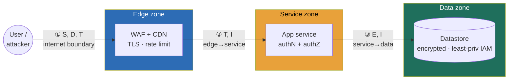

### Learning objectives
- State security as a **system property**, something you design in via trust boundaries, secure-by-default platform defaults, and assume-breach blast-radius thinking, not a checklist of controls bolted on after the architecture is drawn.
- Reframe the **CIA triad** (confidentiality, integrity, availability) as *requirements you extract*, the security analog of functional and non-functional requirements, so every control later traces to one of them.
- Run **STRIDE threat modeling over a data-flow diagram**: enumerate where data crosses a trust boundary, name the threat per boundary (Spoofing, Tampering, Repudiation, Information disclosure, DoS, Elevation of privilege), and triage to the top two or three.
- Reason in **zero-trust** ("never trust, always verify", no implicit network-location trust) and **defense-in-depth / blast-radius** (one compromised component must not own the system), and know which to reach for when.
- Name the **security ⇄ velocity/latency/friction trade** out loud: every control buys risk reduction at a cost in milliseconds, signup friction, or developer velocity, and a Director quantifies both sides before deciding.

### Intuition first
Security is not the lock you bolt on the front door the night before you ship. It is the floor plan. A bank does not become secure by hiring a guard, it is **designed** secure: the vault is a separate room with one reinforced door, the teller can reach the drawer but not the vault, the customer can reach the lobby but not the teller's side, and a camera watches every threshold where one zone meets another. The guard is one control among many; the **security is in the layout**, in the fact that getting through the lobby door buys you nothing, because the next door, and the one after that, each ask again who you are and what you're allowed to touch.

That image carries the whole module. **Security lives at the boundaries**, the places where a person or a request crosses from one privilege zone into a more trusted one, the lobby-to-teller, teller-to-vault thresholds, and your job as a designer is to find those crossings on the diagram before you decide what to do about them. **No room is trusted just because it's "inside"**, the teller re-checks identity even though you already walked past the front-door guard, which is exactly zero-trust: a request being on the internal network proves nothing. **Every door is also a delay and a hassle**, three locked doors are safer than one and slower to walk through, so you put the heaviest locks only where the loss is largest (the vault), not on the lobby restroom. And **you build assuming a robber eventually gets one door open**, so no single breach owns the building: that is blast-radius thinking, and it is the difference between a break-in and a catastrophe.

### Deep explanation

**Security is a system property, and that single reframe governs the whole module.** The Director-altitude statement: *you do not add security to an architecture, you design an architecture that has security as a property, the way it has latency or availability as a property.* The thing you own is the **posture**, what the platform makes impossible by construction (a service literally cannot read a bucket it has no IAM grant to), what the **paved road** enforces by default (every new service ships with TLS, an identity, and audit logging because the platform template gives it those for free), and where the **audit boundary** sits (which actions are logged immutably so "who did what" is answerable a year later). You do not personally write the cryptographic primitive; you own the shape of the system that uses it. That division, posture owned, primitives delegated, is the spine of how a leader operates here.

**The CIA triad is not a slogan, it is your requirements checklist.** Before any control, you extract which of three properties each asset needs, the security analog of separating functional from non-functional requirements:

- **Confidentiality**, the data is seen only by who's allowed. Violated by leaks and unauthorized reads. Bought with encryption, access control, and minimization.
- **Integrity**, the data is correct and unaltered, and actions are non-repudiable. Violated by tampering and forged requests. Bought with signing, validation, immutable audit logs.
- **Availability**, the system is up when needed. Violated by DoS and resource exhaustion. Bought with rate limits, quotas, and capacity, the overlap with reliability engineering.

The discipline: every control you propose later should trace to a CIA requirement on a specific asset. A payment token needs all three; a public marketing page needs availability and integrity but not confidentiality. **Reject** "encrypt everything and rate-limit everything" as the default, because uniform maximum control is expensive friction you can't justify per asset, and a reviewer will ask which requirement a given control serves.

**STRIDE is how you turn a diagram into a threat list, boundary by boundary.** You take the data-flow diagram, draw the **trust boundaries** (every line where data crosses from a lower privilege level to a higher one: internet → edge, edge → service, service → datastore, user → admin), and at each crossing ask the six STRIDE questions:

- **S, Spoofing**, can an attacker pretend to be someone they're not? (Countered by authentication.)
- **T, Tampering**, can they modify data in flight or at rest? (Countered by integrity checks, TLS, signing.)
- **R, Repudiation**, can they deny having done it? (Countered by audit logging.)
- **I, Information disclosure**, can they read what they shouldn't? (Countered by encryption, access control.)
- **D, Denial of service**, can they take it down? (Countered by rate limits, quotas, autoscale.)
- **E, Elevation of privilege**, can a low-privilege actor gain high privilege? (Countered by authorization, isolation, least privilege.)

The Director move is not enumerating all six at all boundaries (that's a forty-cell IC exercise); it's **triaging to the two or three threats with the highest likelihood × impact** and naming the control and its cost for each. The rest you note and delegate.

**Zero-trust replaces the perimeter, and you must be able to say why.** The old model is **castle-and-moat**: a hard perimeter (firewall, VPN) and a soft, trusting interior, once you're "inside the network," you're assumed friendly. It fails because one phished laptop, one compromised service, one SSRF, and the attacker is "inside" and the interior trusts them completely, so the **blast radius is the whole estate**. **Zero-trust** ("never trust, always verify") drops network location as a trust signal entirely: *every* request is authenticated and authorized at *every* hop, service-to-service included (via mTLS or workload identity), as if it came from the open internet. The trade you name out loud: zero-trust costs real engineering (an identity plane, per-hop auth adding latency and complexity) and buys a dramatically smaller blast radius. **Reject** pure castle-and-moat for anything multi-service, because a flat trusted interior means one breach equals total compromise; reject *only* zero-trust as a slogan with no defense-in-depth behind it, because verifying identity at each hop doesn't help if a verified-but-compromised service can still read every datastore.

**Defense-in-depth and blast-radius thinking are the assume-breach posture.** You design as if any single component *will* be compromised, then ensure that compromise is survivable. Concretely: **layer controls** so no single failure is fatal (WAF *and* input validation *and* parameterized queries, not one of them), and **shrink blast radius** so a compromised piece owns as little as possible, least-privilege IAM (each service can touch only its own data), network segmentation, short-lived credentials, separate accounts per environment. The number that matters: if a service is popped, can it read 1 table or 10,000? Can a leaked key be used for 15 minutes or forever? Assume-breach turns "we got breached" from a company-ending event into a contained, audited incident.

**Every control is a trade, and naming the cost is the whole Director signal.** Security is never free; it's risk reduction purchased with latency, friction, or velocity, and you state both sides:

- **Latency.** A WAF and per-hop mTLS add real milliseconds; a synchronous fraud check before a login adds 50–200 ms. You put heavy checks only where the risk justifies the latency.
- **Friction.** Mandatory MFA cuts account-takeover by **over 99%** but adds a step to every login and a support cost for locked-out users; you mandate it for admins and high-value accounts, and risk-base it for everyone else.
- **Velocity.** A paved road with secure defaults *adds* velocity (teams get auth, TLS, and audit for free); a manual security review on every deploy *subtracts* it. The leadership lever is making the secure path the easy path, not gating with process.

The anchor number for the cost-of-failure side of the trade: a major data breach runs roughly **\$4–5M** on average (IBM-style figures), and far more for regulated data, so a control that costs \$50k/year of engineering and 30 ms of latency to materially cut breach probability is trivially worth it; one that costs the same to defend a public, low-value asset is not. You quantify both, the loss avoided and the cost paid, and decide.

Go deeper — drawing trust boundaries and running STRIDE on a data-flow diagram (IC depth, optional)

The mechanical version of the threat model, the part you'd delegate to a security engineer to do exhaustively:

- **Build the data-flow diagram (DFD).** Nodes are *external entities* (users, third parties), *processes* (services), and *data stores* (databases, buckets); edges are data flows. This is the standard DFD notation threat modeling tools (e.g. Microsoft's Threat Modeling Tool, OWASP Threat Dragon) consume.
- **Draw trust boundaries as dashed lines** wherever a flow crosses a privilege change: internet/DMZ, DMZ/internal, app/data tier, user-context/admin-context, your-cloud-account/third-party. A boundary crossing is where most threats live, because that's where one side trusts data or identity asserted by the other.
- **Apply STRIDE per element**, but the shortcut practitioners use: **processes** are most exposed to S/T/R/I/D/E (all six); **data flows** to T/I/D; **data stores** to T/I/R/D; **external entities** to S/R. So you don't ask all six everywhere, you ask the ones that apply to that element type, which roughly halves the cells.
- **Score and triage.** A lightweight risk = likelihood × impact (or DREAD if the org uses it) ranks the cells; you act on the top few, accept-with-monitoring the long tail, and document the acceptance so it's a *decision*, not an oversight.
- **The control catalog per STRIDE letter** (the cheat the security team carries): S → authN (OIDC, mTLS), T → TLS + signing + input validation, R → tamper-evident audit log, I → encryption + access control + minimization, D → rate limit/quota/autoscale/CDN, E → authZ + least-privilege IAM + sandboxing. Naming the *letter* makes the *control* obvious, which is why STRIDE is the reasoning tool even when you delegate the enumeration.

### Diagram: trust boundaries and STRIDE on the request path

Each arrow is a trust boundary; the labels are the STRIDE threats that dominate that crossing. Boundary ① faces spoofing, DoS, and tampering from the open internet; ② is the edge asserting an identity the service must still verify; ③ is where a compromised service tries to elevate privilege and read data it shouldn't, which least-privilege IAM and encryption contain.

### Worked example: threat-modeling a photo upload-and-serve path
A photo-sharing product lets a user upload an image and later serve it to viewers. One feature, and the whole posture shows up in securing it. The flow: client → edge (WAF/CDN) → upload service → object store (S3) → image-processing worker → served via CDN.

- **Draw the boundaries.** Four crossings: internet → edge, edge → upload service, service → S3, and the *new actor* boundary where an uploaded file becomes input to the processing worker (untrusted data crossing into a privileged process).
- **STRIDE, triaged to the top three.** (1) **Information disclosure**, can viewer A fetch viewer B's private photo by guessing the URL? (2) **Elevation of privilege / Tampering**, can a malicious image (a crafted file exploiting the decoder) compromise the processing worker? (3) **DoS**, can someone upload 10,000 huge files and exhaust storage and processing? Spoofing and repudiation are real but lower here and get noted, not solved on the whiteboard.
- **Control per risk, with its cost named.** For disclosure: **signed, expiring URLs** (e.g. 15-minute presigned S3 URLs) plus an authZ check that the requester owns or was granted the photo, cost is a token-signing hop and URL expiry management, rejected: public-readable bucket with unguessable names, because "security by obscurity" leaks the moment one URL is shared or logged. For the malicious image: **process untrusted files in a sandboxed, least-privilege worker** (no network egress, throwaway container, can write only the output bucket), cost is per-job container overhead, rejected: decoding in the main service process, because one decoder CVE then owns the service. For DoS: **rate-limit uploads per account, cap file size, and quota storage**, cost is friction on power users, tuned by tier.
- **What I delegate, with a prior.** "I'd have the security team run the full STRIDE pass and pick the image-processing sandbox, my prior is gVisor or a Firecrawl-style microVM over a plain container because the decoder is the highest-risk untrusted-input surface and we want kernel-level isolation, but I want their benchmark on the per-job latency cost before we commit."

The number a Director carries out: *"private by default via signed URLs, untrusted decoding is sandboxed so one CVE doesn't own the fleet, uploads are quota'd, and here's exactly what I'm delegating and my prior on it."* Not "we added a WAF and TLS."

### Trade-offs table: where the security model lives
| Model | Castle-and-moat (perimeter) | Zero-trust (per-hop verify) | Defense-in-depth (layered) |
|---|---|---|---|
| **Blast radius if breached** | whole interior (flat trust) | one hop / one identity | contained per layer |
| **Latency cost** | low (trust is implicit inside) | real (auth at every hop, +ms) | additive per layer |
| **Operational complexity** | low to build, fragile | high (identity plane, mTLS) | high (more controls to run) |
| **Use when…** | legacy, single-tenant, low-stakes intranet | multi-service, cloud, sensitive data, the modern default | always, as the posture *under* whichever boundary model you pick |

The Director move: zero-trust as the boundary model for anything multi-service and cloud, defense-in-depth as the assume-breach posture layered underneath it, and castle-and-moat consciously *rejected* for new builds because a flat trusted interior makes one breach total, named as the reason, not just asserted.

### What interviewers probe here
- **"Here's the HLD we just drew. Now secure it."** *Strong signal:* you don't list controls, you **threat-model the boundaries first**, mark where data crosses a privilege level, run STRIDE, triage to the top two or three risks, and for each name the control *and the cost it buys* and assume-breach for the rest. *Red flag:* reciting "add a WAF, add TLS, encrypt the database" with no model of what you're defending against, and being unable to name a single downside of your own control.
- **"Why not just put it all behind the VPN / firewall?"** *Strong:* you explain castle-and-moat's flat-interior failure (one compromised host owns everything), contrast zero-trust's per-hop verification and smaller blast radius, and name zero-trust's real cost (identity plane, per-hop latency), choosing it for multi-service with the trade stated. *Red flag:* treating "it's on the internal network" as a security property, the single most common and most dangerous misconception.
- **"What does this control cost you, and would you put it everywhere?"** *Strong:* every control is risk reduction bought with latency, friction, or velocity; you put heavy controls where the loss is largest (MFA on admins, sandboxing on untrusted input) and risk-base the rest, quantifying both the loss avoided (~\$4–5M breach) and the cost paid (ms, friction). *Red flag:* "more security is always better," uniform maximum control with no per-asset requirement, which is just expensive friction.
- **"Assume that service gets popped tomorrow. What happens?"** *Strong:* you reason in blast radius, least-privilege IAM so it reads one table not ten thousand, short-lived credentials so a leaked key dies in minutes, segmentation so it can't pivot, and an audit log so you know what it touched. *Red flag:* "that won't happen, we have a firewall," no assume-breach posture at all.

The through-line at Director altitude: you own the **posture** (paved-road secure defaults, trust boundaries, where the audit boundary sits, what's impossible by construction) and reason in CIA requirements, STRIDE boundaries, and blast radius, then delegate the cryptographic and exhaustive-enumeration depth with a stated prior, "I'd have the security team run the full STRIDE pass and pick the sandbox tech; my prior is a microVM over a plain container for the highest-risk untrusted-input surface, pending their latency benchmark."

### Common mistakes / misconceptions
- **Treating security as a final phase.** Bolting controls on after the architecture is frozen means the boundaries are already wrong; security is a property you design in from the data-flow diagram, not a review gate at the end.
- **Trusting the internal network.** "It's behind the firewall / on the VPN" is not a security property, one phished laptop or one SSRF puts an attacker "inside," and a flat trusted interior then hands them everything. Verify every hop.
- **Single-layer reliance.** One control (just a WAF, just TLS) is one CVE or one misconfig away from total failure; defense-in-depth layers controls so no single failure is fatal.
- **No explicit threat model.** Naming controls without a STRIDE-over-boundaries model means you're defending against threats you never enumerated and can't say what you're *not* defending, which is the actual gap an attacker uses.
- **Conflating authentication with authorization.** AuthN is *who you are*; authZ is *what you're allowed to do*. A correctly-authenticated user reading another user's data is an authZ failure, and treating "they logged in" as "they're allowed" is a classic elevation-of-privilege hole.

### Practice questions

**Q1.** An interviewer draws a three-tier web app (client → API service → Postgres) and says "secure it." Walk through your first three minutes.
> *Model:* I'd resist listing controls and instead draw trust boundaries: internet → API, and API → Postgres. At the internet boundary, STRIDE says spoofing, DoS, and tampering dominate, so authN (OIDC/sessions), a WAF + rate limits, and TLS. At the API → DB boundary, the threats are elevation of privilege and information disclosure, so least-privilege DB credentials (the service role can touch only its tables), encryption at rest, and parameterized queries to kill injection. I'd triage to the top risks rather than enumerate all forty STRIDE cells, name that each control costs latency or friction, and assume-breach: if the API is popped, least-privilege IAM and short-lived DB creds mean it reads its own tables for 15 minutes, not the whole estate forever. The crypto and the exhaustive STRIDE pass I'd delegate to security with a stated prior.

**Q2.** A peer argues "we're all inside the corporate VPN, so service-to-service calls don't need auth, it's a trusted network." Respond.
> *Model:* Network location is not an identity. The VPN is castle-and-moat: a hard shell and a soft, trusting interior, and the failure mode is that one phished laptop, one compromised CI runner, or one SSRF puts an attacker *inside* the trusted zone, where every service now trusts them completely, so the blast radius is the entire fleet. The fix is zero-trust: authenticate and authorize every service-to-service call (mTLS or workload identity) regardless of network position. It costs an identity plane and a few ms per hop, and it buys a blast radius of one hop instead of everything. For a single-tenant low-stakes intranet I might accept the perimeter model, but for anything multi-service and sensitive, implicit network trust is the most dangerous assumption we could ship.

**Q3.** You're asked to add a control that cuts account-takeover. You propose mandatory MFA. What's the trade, and would you apply it uniformly?
> *Model:* MFA cuts account-takeover by over 99%, so against a breach cost on the order of \$4–5M it's an easy yes on value. But it's not free: it adds a step to every login (friction, abandoned signups) and a real support cost for locked-out and lost-device users. So I wouldn't apply it uniformly, I'd mandate it for admins and high-value accounts where the loss is largest, and risk-base it for everyone else (step up to MFA on a new device, new geo, or sensitive action) so the friction lands only when the risk justifies it. That's the general pattern: heavy control where the loss is large, risk-based elsewhere, and the cost named on both sides rather than "more security is always better."

**Q4.** Distinguish authentication from authorization with a concrete failure, and say which STRIDE threat the failure is.
> *Model:* Authentication answers *who are you* (you logged in as Alice); authorization answers *what may you do* (Alice may read her own orders, not Bob's). A correctly-authenticated Alice changing the URL from `/orders/alice` to `/orders/bob` and seeing Bob's data is a pure authorization failure, the authN was perfect. In STRIDE that's elevation of privilege (and information disclosure on the data exposed). The design lesson: authN at the edge is necessary but never sufficient, every request must also pass an authZ check at the resource (does *this* identity have a grant to *this* object), and treating "they're logged in" as "they're allowed" is one of the most common real-world holes, e.g. insecure direct object references.

### Key takeaways
- **Security is a system property, not a checklist.** You design it in via trust boundaries, paved-road secure defaults, and assume-breach blast-radius thinking; you own the posture (what's impossible by construction, what defaults enforce, where the audit boundary sits) and delegate the from-scratch crypto with a stated prior.
- **Reframe CIA as requirements.** Confidentiality, integrity, availability, extracted per asset, so every control later traces to a requirement; reject uniform maximum control because it's friction you can't justify per asset.
- **STRIDE over a data-flow diagram is the reasoning tool.** Find the trust boundaries, ask the six threats at each crossing, triage to the top two or three by likelihood × impact, name the control *and its cost* for each.
- **Zero-trust replaces the perimeter; defense-in-depth sits underneath.** Never trust network location, verify every hop (smaller blast radius, at a latency cost), and layer controls so no single failure is fatal, assuming any one component will be breached.
- **Every control is a trade you quantify.** Risk reduction bought with latency, friction, or velocity (MFA cuts ATO >99% but adds login friction; a breach runs ~\$4–5M); put heavy controls where the loss is largest and risk-base the rest.

> **Spaced-repetition recap:** Security is the **floor plan**, not the lock you bolt on last, a **system property** you design in. Own the **posture** (paved-road defaults, what's impossible by construction, the audit boundary); delegate the crypto with a prior. Extract **CIA** (confidentiality/integrity/availability) as requirements per asset. Threat-model with **STRIDE** (Spoofing, Tampering, Repudiation, Information disclosure, DoS, Elevation) over a **data-flow diagram's trust boundaries**, triage to the top two or three, name each control *and its cost*. Reject **castle-and-moat** (flat trusted interior, one breach owns all) for **zero-trust** (verify every hop, smaller blast radius, +ms) with **defense-in-depth** (layered, assume-breach) underneath. Every control trades risk reduction against latency/friction/velocity (MFA cuts ATO >99%; a breach is ~\$4–5M), so heavy control where the loss is largest, risk-based elsewhere. Never conflate authN (who you are) with authZ (what you may do).

---

*End of Lesson 11.1. This is the mental model the whole Security & Trust track rests on: security is a system property designed in from trust boundaries, paved-road defaults, and assume-breach blast-radius thinking, reasoned in CIA, STRIDE, and zero-trust before any control.*
