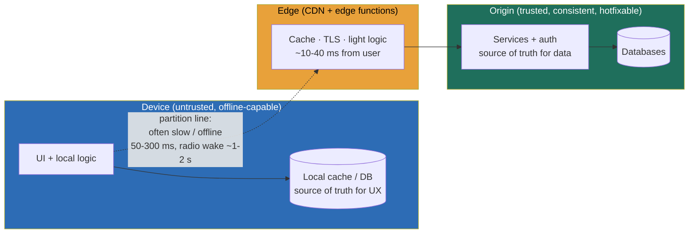

> The client is not a window on your server: it is a **full node in your distributed system**, the one that gets partitioned daily (elevator, subway, airplane mode). Everything turns on one knob: **how much intelligence lives on the device**, thin (simple, consistent, hotfixable, dead offline) versus thick (instant and offline-capable, but stale-prone and unpatchable). The numbers that reshape the design: 50 to 300 ms per mobile round trip, and a 1 to 3 day app-store review with a weeks-long tail of users who never update.

### Learning objectives
- Treat the **client as a first-class node** in the distributed system, one that is frequently **partitioned** from the server, so partition-tolerance and consistency reasoning applies at the edge of the network, not just between your datacenters.
- Place a design on the **thin-to-thick client spectrum** deliberately, and state the trade: how much intelligence, state, and cache lives on the device is a **product-latency and retention** decision, not a purely technical one.
- Name the **five constraints that do not exist server-side** and reshape every client decision: intermittent network and high variable latency, constrained device budgets, app-store release latency, device and OS heterogeneity, and cold start.
- Reason about **where computation, state, and cache live** across the device, the edge (CDN and edge functions), and the origin, and articulate the core tension: **push work toward the user for latency, pull it toward the server for control and consistency.**
- Own the **API-compatibility-forever discipline** that release latency forces, and frame client decisions as the **product, revenue, and org** decisions a Director actually owns.

### Intuition first
Think of the difference between a **TV** and a **field kit**.

A **thin client** is a television. All the intelligence lives at the broadcast station (the server); the set just renders whatever signal arrives. It is wonderfully simple: you can change the whole broadcast, fix a bug in a show, or run a new program without ever touching a single television in a single living room. But the set is useless the instant the signal drops, and every channel change has to make the round trip to the station and back before anything happens on screen.

A **thick client** is a **field kit** you hand to someone going into the wilderness. It carries its own tools, its own supplies, and its own copy of the map (logic, state, and cache on the device). It works with no signal at all, and because the map is already in the kit, opening it is instant, no round trip to base camp. The price is that the map in the kit goes stale, two people can mark the same trail differently and you have to reconcile them later, and when you improve the map you cannot just update the station, you have to get a new kit into every hiker's hands, which takes days or weeks and some of them never pick it up.

That is the whole module. The server engineer designs the broadcast station and assumes a perfect cable to every set. The client is the field kit: **it is a node that is often disconnected, runs on a battery, and cannot be patched on demand.** Every hard decision in this track, offline behavior, conflict handling, when to push versus poll, how to keep the app fast, how to ship a fix, comes from taking the kit seriously as its own computer rather than pretending it is just a window onto yours.

### Deep explanation

**The client is a distributed node, and it is the one that gets partitioned.** Most system-design preparation is server-side and implicitly assumes the hard part is coordinating services that sit in the same building, wired together with 0.5 ms links that almost never drop. The client breaks that assumption. A phone in an elevator, a subway, a rural cell, or airplane mode is a **fully partitioned replica** of your system, holding user-visible state, unable to reach the origin. The consistency-versus-availability choice you normally make between datacenters now shows up at the last hop, between the device and everything else, and it shows up constantly rather than during a rare fiber cut. If you cannot say what your app does while partitioned, you have not designed the client, you have designed the happy path and hoped.

**The thin-to-thick spectrum is the master decision, and it is a product decision.** The single knob is *how much intelligence lives on the device*, and it trades directly against perceived latency, offline capability, updateability, and consistency.

- **Thin client (server-authoritative).** The device renders; the server holds logic and state; every meaningful interaction is a request. **Pros:** dead simple, always consistent (one source of truth), and hotfixable, because you change behavior by deploying the server, not by shipping an app. **Cons:** useless offline (the TV when the signal drops), and every tap pays a round trip, so on a 50 to 300 ms mobile link the app feels sluggish no matter how fast your backend is. A pure server-rendered web page or a "dumb" kiosk sits here.
- **Thick client (device-authoritative).** Logic, state, and a cache live on the device. **Pros:** works offline, and interactions feel **instant** because they hit local state first and sync in the background, so perceived latency drops to near zero regardless of the network. **Cons:** you now own cache staleness and **conflict resolution** (two devices edit the same thing offline), a **larger attack surface** (secrets and logic on an untrusted device), and, above all, **you cannot hotfix it** (a new kit must reach every hiker). A note-taking app, a maps app, or a mobile game lives here.

The reason this is a Director-altitude call and not an implementation detail: pushing intelligence onto the device is how you win **perceived latency and offline capability**, and those convert directly into **retention and addressable market**. A feed that renders instantly from cache keeps users; a feed that spins for two seconds on every open loses them. An app that works on a spotty 3G connection in a tier-2 city is addressable market that a round-trip-per-tap app simply cannot serve. You choose a point on this spectrum per feature, and you defend it against the cost, complexity, and consistency risk it buys. The rejected extremes are instructive: **pure thin** for a consumer mobile app trades away retention to save engineering effort you should be spending; **maximally thick** for a simple internal tool buys you conflict-resolution and release-management problems to solve a latency problem the tool never had.

**Five constraints exist on the client that never touched your server design.** Each one invalidates an assumption the server let you make.

1. **Intermittent network and high, variable latency.** Server-to-server is ~0.5 ms and reliable. Device-to-origin is **50 to 300 ms** on a good mobile connection, seconds on a bad one, and frequently **zero, because the device is offline**. Worse, a phone's radio sleeps to save battery, so the *first* request after idle pays a **radio wake of roughly 1 to 2 seconds** before a single byte moves. The design consequence: you cannot treat the network as present or fast. You render from local state, sync in the background, and design explicitly for offline and for reconnection, which is why **offline-first storage and background sync** are their own topic in this track.

2. **Constrained device budgets: CPU, memory, battery, and cellular data.** The server scales by adding nodes; the phone is a fixed, shared, thermally-limited box you do not control, and every cycle you burn is the user's battery and every byte you pull may be their metered data. A chatty client that polls every few seconds keeps the radio hot and drains the battery; a bloated payload costs the user real money on a capped plan. Efficiency on the client is not a nicety, it is a **retention and cost-to-the-user** constraint, which is why **client performance and payload/network efficiency** get their own lesson.

3. **App-store release latency, the constraint with no server analog.** You deploy a server fix in minutes and it is live for 100% of traffic. A native mobile client goes through **app-store review (roughly 1 to 3 days, occasionally longer)**, and then, critically, **users update on their own schedule or not at all**. Weeks after you ship, a long tail of users is still on old versions; months later a meaningful fraction never updated. The consequences are severe and permanent: your **client-server API must stay backward-compatible effectively forever**, because old clients keep calling it; you cannot fix a client bug by "just deploying," so you need **feature flags, remote config, a forced-update prompt, and a kill switch** wired in from day one; and any migration is a multi-version, multi-month rollout, not a flip. This single constraint reshapes API design, and it is the one server engineers most often miss.

4. **Device and OS heterogeneity, all in the wild at once.** Your server fleet is homogeneous and you chose it. Your install base is not: dozens of OS versions, a huge spread of screen sizes and hardware capability, and old devices you cannot drop without abandoning users. A meaningful share of an install base runs OS versions one or two years old, so a capability that exists on the newest OS is unavailable to a large slice of users right now. You design to the **capabilities you can rely on across the fleet**, feature-detect the rest, and accept that "it works on my flagship phone" proves nothing.

5. **Cold start.** A server process starts once and serves for weeks. An app is launched cold constantly, and the user is staring at it. The budget is brutal: perceived launch should land in roughly **1 to 2 seconds**, and every millisecond over that is measurable drop-off. That forces choices, render something from cache immediately rather than blocking on a network call, defer non-critical work, keep the launch path lean, that a server engineer never has to make.

**Where computation, state, and cache live: device to edge to origin.** The client is the near end of a tier of places work can happen, and placing work on the right tier is the core architectural move.

- **Device.** Lowest latency (zero network), works offline, but untrusted, resource-limited, and un-hotfixable.
- **Edge (CDN and edge functions).** Physically close to the user (single-digit to low-tens of ms), great for caching static and semi-static content, terminating TLS, and running light logic near the user, but not the source of truth and limited in what it can compute.
- **Origin.** The authoritative, trusted, consistent, easily-updated core, but a full round trip away and the thing that partitions from the client.

The tension that governs the placement: **push work toward the user for latency and offline capability; pull it toward the server for control, consistency, security, and updateability.** A cached feed on the device is instant and offline-capable, but can show stale or unauthorized data and cannot be corrected quickly; the authoritative feed at the origin is always correct and instantly fixable, but a round trip away and dead when offline. Most real designs are a deliberate split: the origin owns the **source of truth** and anything security-sensitive (you never trust a price, an entitlement, or an auth decision computed on the device), the edge owns **caching and fan-out**, and the device owns a **cache plus enough logic for an instant, offline-tolerant experience**. Naming which tier owns each responsibility, and why, is the design.

**The Director lens: client decisions are product, revenue, and org decisions.** Three of them are yours to own.

- **Latency and offline are revenue.** Perceived latency maps to retention and conversion; offline capability maps to **addressable market** in low-connectivity regions. Choosing a thicker client to serve a spotty-network market is a growth decision wearing an architecture costume.
- **API-versioning-forever is a discipline you enforce.** Because old clients never fully die, the team must treat the client-server contract as append-only and permanently backward-compatible, and must build kill-switch and forced-update levers before the first incident, not during it. That discipline is a leadership call about how the org ships, not a line of code.
- **The client platform is an org cost.** Native iOS, native Android, and web are often **three separate codebases and three skill sets**, plus the shared-code and cross-platform strategy question (one shared core versus fully native per platform, each with its own velocity-versus-fidelity trade). Staffing that, and deciding how much to converge, is a budget and org-design decision a Director makes with real dollars attached.

### Diagram: device, edge, origin, and the partition line

```mermaid
flowchart LR
  subgraph DEVICE["Device (untrusted, offline-capable)"]
    UI["UI + local logic"]
    LC[("Local cache / DB<br/>source of truth for UX")]
    UI --> LC
  end
  subgraph EDGE["Edge (CDN + edge functions)"]
    CDN["Cache · TLS · light logic<br/>~10-40 ms from user"]
  end
  subgraph ORIGIN["Origin (trusted, consistent, hotfixable)"]
    API["Services + auth<br/>source of truth for data"]
    DB[("Databases")]
    API --> DB
  end
  UI -. "partition line:<br/>often slow / offline<br/>50-300 ms, radio wake ~1-2 s" .-> CDN
  CDN --> API
  style DEVICE fill:#2d6cb5,color:#fff
  style EDGE fill:#e8a13a,color:#000
  style ORIGIN fill:#1f6f5c,color:#fff
```

The dashed line is the boundary that server-only designs ignore. Everything to its left keeps working when the line drops; everything to its right is the authoritative, updateable core the device cannot reach while partitioned. **Push work left for latency and offline; keep authority and hotfixability right.** The whole client-side track lives on how you manage that line: syncing across it, resolving conflicts that arise while it is down, pushing updates through it when it comes back, and shipping new client code that changes what sits on the left.

### Worked example: a mobile feed, thin take versus thick take
Take one concrete feature, the home feed in a consumer mobile app, and design it twice.

- **Thin take (server-authoritative).** On every launch and scroll, the app requests the feed from the origin and renders the response. **What it buys:** trivial client, one source of truth (no staleness, no conflicts), and full hotfixability, ranking logic changes ship as a server deploy with no app update. **What it costs:** a blank or spinning screen on every cold start while the round trip completes (2 seconds of radio wake plus latency on a poor connection), and **nothing at all when offline**, which for a commuter on a subway is most of their session. Retention suffers precisely where your engaged users are.
- **Thick take (cache-first).** The device keeps a **local cache** of the last feed and renders it **instantly** on launch, zero network (the map already in the kit), so the app is usable in the subway and cold start feels immediate. In the background it fetches fresh items and reconciles. **What it buys:** near-zero perceived latency and genuine offline usability, the retention win. **What it costs:** the user may briefly see a slightly stale feed (an acceptable trade, a feed is not a bank balance), you now own cache invalidation and a background-sync path, and, crucially, **you cannot hotfix the client-side merge or ranking logic**, so a bug in it lives on old app versions for weeks. That pushes you to keep the **authoritative ranking at the origin** and let the device only cache and lightly reorder, so the thing you cannot patch quickly stays small.

The Director takeaway is not "thick is better." It is the reasoning: **for a consumer feed on mobile, the retention value of instant-and-offline justifies a cache-first client, and you contain the un-hotfixable risk by keeping authoritative and security-sensitive logic at the origin.** Contrast a note editor, where the user *expects* to type offline and see edits instantly, so the device must be authoritative for the working copy, which immediately raises the multi-device conflict question, exactly the problem the offline-sync and conflict-resolution lessons in this track exist to solve. Same spectrum, different point, each defended by the product requirement.

### Trade-offs table: thin vs thick client
| Dimension | **Thin client (server-authoritative)** | **Thick client (device-authoritative)** |
|---|---|---|
| Perceived latency | every interaction pays a round trip (50-300 ms+) | instant, hits local state first |
| Offline | unusable | fully usable, syncs on reconnect |
| Consistency | strong, one source of truth | eventual, staleness + conflicts to resolve |
| Updateability | hotfix by server deploy, all users at once | app-store release, old versions linger for weeks |
| Attack surface | small, secrets stay server-side | larger, logic + cached data on an untrusted device |
| Complexity | low | high (cache, sync, conflict, migration) |
| **Use when** | simple/internal tools, always-connected, logic must stay hotfixable or secret | consumer mobile, poor/again-and-again offline networks, latency and retention are the product |

### What interviewers probe here
- **"You've designed the backend. What happens on the client when the network is bad or gone?"** *Strong signal:* you treat the device as a **partitioned node**, describe rendering from local cache, background sync on reconnect, and an explicit offline behavior per feature; you name the latency reality (50-300 ms, radio wake, frequent zero). *Red flag:* treating the client as a trivial render layer that always has a fast, present connection, the single most common tell that a candidate has only designed servers.
- **"How do you ship a fix to this client?"** *Strong:* you distinguish server hotfix (minutes, everyone) from client release (**1 to 3 day review plus a weeks-to-months tail of un-updated users**), and you name the levers, **backward-compatible-forever API, feature flags, remote config, forced-update, kill switch**, built in advance. *Red flag:* "we'd just deploy the fix," unaware that clients cannot be patched on demand and old versions persist.
- **"How much logic lives on the device versus the server, and why?"** *Strong:* you place the feature on the **thin-thick spectrum** as a latency/offline/retention decision, keep **authoritative and security-sensitive logic at the origin** (never trust the device for price, entitlement, or auth), and push cache and instant-UX logic to the device. *Red flag:* trusting client-computed values, or putting everything on one tier with no reasoning about the split.
- **"You have users on old OS versions and old app versions. How does that constrain your design?"** *Strong:* you design to fleet-wide capabilities, feature-detect the rest, keep the API append-only and backward-compatible, and plan migrations as multi-version, multi-month rollouts. *Red flag:* assuming a homogeneous, latest-version install base, the way a server fleet is homogeneous.

The through-line at Director altitude: the client is a **first-class design surface** with constraints the server never had, and you reason about **where intelligence lives** and **how you ship changes to it** as **product and org decisions**, then delegate the platform-specific depth with a stated prior, "I'd have the mobile team pick the on-device store and the sync engine; my prior is a cache-first design with authoritative ranking kept server-side so the un-hotfixable surface stays small, pending their read on the conflict rate."

### Common mistakes / misconceptions
- **Treating the client as a thin window on the server.** Assuming a fast, always-present connection designs only the happy path; the device is a partitioned node with its own state, and offline plus high-latency is the normal case, not the exception.
- **Forgetting release latency.** Designing a client-server API as if you can change both ends together, when old clients linger for weeks to months, produces breaking changes that strand real users; the API must be backward-compatible effectively forever.
- **Trusting the device.** Computing prices, entitlements, or authorization on the client, or storing secrets there, treats an untrusted, inspectable box as trusted; authoritative and security-sensitive logic belongs at the origin.
- **Ignoring device budgets.** A chatty poll loop or a fat payload that is free on the server drains the user's battery and burns their metered data; client efficiency is a retention and cost-to-the-user constraint.
- **Assuming a homogeneous install base.** Designing to your flagship test phone and the newest OS ignores the large real-world tail of old devices and OS versions running your app simultaneously.

### Practice questions
**Q1.** An interviewer says, "You've drawn a clean backend for a mobile note-taking app. Now tell me about the client." Where do you start?

Model answer, try yours out loud first

> *Model:* I start by placing the client on the thin-thick spectrum, and for a note app the requirement forces a **thick, device-authoritative** design: users expect to type offline and see edits instantly, so the device holds the working copy in a local store and renders from it with zero network latency. That immediately raises the two costs I have to own: **sync**, the device reconciles with the origin in the background on reconnect, and **conflict resolution**, because the same note edited on two devices offline must merge deterministically rather than silently losing an edit. I keep the origin as the durable source of truth and the merge authority where I can, and I note that because this is a native client I cannot hotfix the on-device logic, so the API stays backward-compatible and I ship the merge logic behind config I can adjust. The point is that "the client" is not a render layer here, it is a partitioned replica with real state, and I designed for the partition first.

**Q2.** A peer proposes computing the user's discount and their access-to-premium-features on the device to save a round trip. Respond.

Model answer, try yours out loud first

> *Model:* Latency-wise the instinct is right, push work toward the user, but not this work. Price and entitlement are **security-sensitive and authoritative**, and the device is an untrusted, inspectable box; a user can patch the app or forge the request and grant themselves the discount or premium access. So this is exactly the logic that must stay at the **origin**. What I *can* push to the device to recover the latency is a **cached, display-only** copy of the entitlement for instant rendering, while every action that depends on it is re-checked and enforced server-side. That is the general rule: push cache and UX toward the user, keep the source of truth and anything a malicious client could exploit at the server. We trade a re-check round trip on the sensitive action for integrity, which is not negotiable.

**Q3.** You shipped a client bug that corrupts local data on a specific action. On the server you would deploy a fix in ten minutes. What is different here, and what do you do?

Model answer, try yours out loud first

> *Model:* The difference is that I cannot patch the client on demand. A fixed build goes through **app-store review, roughly 1 to 3 days**, and then users update on their own schedule, so weeks out a large tail is still on the broken version and some never update. So the first move is not the app fix, it is the levers I built in advance: a **remote-config feature flag or kill switch** to disable the offending action immediately for all versions without a release, and **server-side validation** to reject or quarantine the corrupt writes so the blast radius stops now. Then I ship the fixed build and, if the bug is severe enough, gate old versions with a **forced-update** prompt. The lesson this reinforces is why those levers, flags, kill switch, forced-update, backward-compatible API, have to exist before the incident, because release latency means the app store is never your fast path.

**Q4.** For a consumer app targeting users in regions with unreliable, expensive mobile data, how does that market shape your client architecture?

Model answer, try yours out loud first

> *Model:* Unreliable and expensive networks push me toward a **thicker, cache-first, offline-tolerant client**, because offline capability here is not a nicety, it is **addressable market**: a round-trip-per-tap app is unusable on a spotty connection and costs the user real money on metered data, so those users churn. Concretely I render from a local cache for instant, offline-capable use, sync opportunistically when connectivity and cost allow, and I aggressively minimize payload size and request frequency to respect **battery and metered-data budgets**. I also design to older, lower-end devices and older OS versions, since that is what the market runs. The framing for the interviewer is that this is a growth decision: I am trading client complexity and eventual-consistency handling for reach and retention in a market a thin client cannot serve.

### Key takeaways
- The **client is a first-class distributed node**, and it is the one that gets **partitioned** from the server constantly (elevator, subway, offline), so consistency-versus-availability reasoning applies at the last hop, not just between datacenters.
- The **thin-to-thick spectrum** is the master decision: how much intelligence lives on the device is a **product-latency and retention** call. Thin is simple, consistent, and hotfixable but round-trip-bound and useless offline; thick is instant and offline-capable but stale-prone, conflict-prone, and un-hotfixable.
- **Five client-only constraints** reshape everything: intermittent/high-latency network (50-300 ms, radio wake ~1-2 s, frequent offline), device budgets (CPU/memory/battery/data), **app-store release latency** (1-3 day review plus a weeks-to-months tail of old versions), device/OS heterogeneity, and cold start (~1-2 s budget).
- Place work across **device, edge, and origin** by the rule **push toward the user for latency and offline, pull toward the server for control, consistency, security, and updateability**; keep authoritative and security-sensitive logic at the origin and never trust the device.
- Client decisions are **product, revenue, and org** decisions: latency and offline drive retention and addressable market; release latency forces a **backward-compatible-forever API plus flags, forced-update, and a kill switch**; and the multi-platform client is a real budget and org-design cost the Director owns.

> **Spaced-repetition recap:** The client is a **field kit**, not a **TV**, a real computer that is often **offline** (a partitioned node), runs on a **battery**, and **cannot be patched on demand**. Decide **how much intelligence lives on the device** (thin = simple/consistent/hotfixable but round-trip-bound and offline-dead; thick = instant/offline but stale/conflict-prone and un-hotfixable) as a **retention** call. Respect the five client-only constraints: **network** (50-300 ms, radio wake ~1-2 s, frequent offline), **device budgets**, **release latency** (1-3 day review plus a long tail of old versions, so the **API is backward-compatible forever** with flags/kill-switch/forced-update), **heterogeneity**, and **cold start** (~1-2 s). Place work across **device to edge to origin**: push toward the user for latency/offline, pull toward the server for control/consistency/security; never trust the device for price, entitlement, or auth. This sets up the rest of the track: **offline sync, conflict resolution, push vs poll, client performance, web/frontend, and a full client design problem.**

---

*End of Lesson 11.1. This is the mental model the whole Client & Mobile track rests on: the client is a first-class, frequently-partitioned node whose thin-to-thick placement is a product-latency and retention decision, shaped by five constraints the server never had, and shipped under an API-compatibility-forever discipline.*
