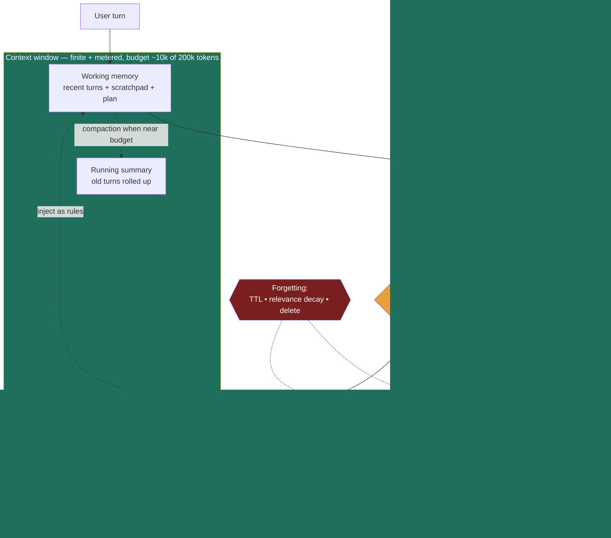

### Learning objectives
- Treat the **context window as finite and metered RAM**: every token costs money and latency *every turn*, and answer quality degrades as it fills ("context rot" / lost-in-the-middle). Memory is therefore a **keep-vs-retrieve-vs-drop** decision, not "store everything."
- Distinguish **short-term / working memory** (the in-context conversation + scratchpad) from **long-term memory**, and name the three long-term types — **episodic** (past events), **semantic** (durable facts), **procedural** (learned skills/preferences) — and the store each maps to.
- Choose a **context-management strategy** — summarization/compaction, sliding window, retrieval of only-relevant memory, hierarchical memory — by what you can afford to lose: **compression saves tokens but loses fidelity; retrieval keeps fidelity but can miss.**
- Reason about **memory writes**: what to persist, dedup, conflicting/changed facts (recency + versioning), and **forgetting/expiry** for privacy and relevance.
- Treat memory as a **cost + quality + privacy** decision: session vs cross-session, multi-tenant isolation, PII governance and deletion. Default to **retrieval + summarization over a bigger context window.**

### Intuition first
An agent's memory is a **desk with filing cabinets behind it.** The **desk** is the context window — the papers spread out where the agent can read everything at a glance, instantly, but it's a *small* desk. Pile too much on it and two things happen: it costs more to keep that desk (you re-read every page each turn), and the agent starts losing the page buried in the middle of the stack under everything else.

The **filing cabinets** are long-term memory — far more capacity, but the agent can't see any of it until it gets up, walks over, and **fetches the right folder onto the desk.** Fetch the wrong folder, or forget a folder exists, and the agent answers without it.

So the entire skill is **desk management**: what stays out (the current task), what gets **filed and fetched on demand** (everything you learned last week about this user), and what gets **summarized down to a sticky note** so the gist survives without the whole stack ("customer is on the Enterprise plan, prefers Python, already tried the cache fix"). A good agent keeps a *clean desk* and trusts its filing system. A bad one never files anything, lets the desk overflow, and pays to re-read a mountain of paper to answer a one-line question.

### Deep explanation

**The context window is finite AND metered — this is the constraint everything else falls out of.**

As the LLM fundamentals establish: the model has a hard token ceiling (say 200k tokens), but the real cost isn't the ceiling, it's that **every token in-context is re-processed every single turn.** A 50-turn conversation that lets context grow unbounded re-sends and re-attends to the *entire history* on turn 50 — you pay input tokens for all of it, latency scales with it, and (the part teams miss) **quality degrades as the window fills.** Models exhibit **lost-in-the-middle**: recall is strong at the start and end of the context and weak in the middle, so a critical instruction buried 40k tokens deep gets effectively ignored. "Context rot" is the same story over a long session — accumulated cruft drowns the signal.

Quantify it. At a representative June 2026 price of ~$3 / million input tokens, a context that has grown to 100k tokens costs **~$0.30 of input per turn** — and you pay that *on every turn*, so 30 turns at full context is ~$9 of input alone, most of it re-reading history the current turn doesn't need. Drop that to a 10k working window via summarization + retrieval and the per-turn input cost falls ~10×. **The decision is never "store everything in context"; it's "what does *this turn* actually need on the desk."**

**Short-term / working memory: the desk.** This is what lives *in-context right now* — the current conversation turns plus the agent's scratchpad (its own reasoning, tool results from this task, the plan it's executing, per the agent loop). It's instant to access and the model attends to it directly, but it's bounded by the window and metered per turn. Working memory is **ephemeral by default**: when the session ends it's gone, unless you deliberately write something to long-term store.

**Long-term memory: the filing cabinets, three types.** Borrowing the cognitive-science split, because each maps to a different store and a different write/read pattern:

| Type | What it holds | Example | Natural store |
|---|---|---|---|
| **Episodic** | Past interactions / events, time-stamped | "On 6/2 the user asked to migrate auth to OAuth and we shipped it" | **Vector store** of past turns/sessions (retrieve by similarity) |
| **Semantic** | Durable facts about the user/domain | "User is a backend lead, prefers Postgres, company is in the EU (GDPR)" | **Structured DB / profile** (key-value or rows) |
| **Procedural** | Learned instructions, skills, preferences | "Always run tests before proposing a merge; this user wants terse answers" | **Rules / config / system-prompt fragment** |

The split matters because the retrieval pattern differs. **Episodic** memory is fuzzy and high-volume — you don't know the exact key, so you retrieve by *similarity* (literally RAG, but over the agent's own past instead of a doc corpus). **Semantic** memory is small, durable, exact — a profile you look up by user ID and inject wholesale; don't make a vector search guess at "what plan is this user on" when a DB row answers it deterministically. **Procedural** memory is rules you fold into the system prompt or tool config, not data you search.

**Storage & recall — recall is retrieval into context on demand.** Memory is useless until the relevant slice is *on the desk*. The recall path:

- **Vector store + retrieval** for episodic memory: embed each past interaction; on a new turn, embed the current request and pull the top-k most similar past events into context. This is **RAG over interactions** — same machinery, same failure modes (embedding quality, chunking, the retriever missing a relevant memory).
- **Structured memory** for semantic facts: a user-profile row or key-value document of durable facts, looked up by ID and injected directly. Cheap, deterministic, no embedding guesswork.
- **Summary memory** for the long tail: roll up old turns into a running summary ("here's what happened in the first 40 turns") and carry the summary instead of the raw turns.

The Director-altitude statement: **agent memory is RAG plus writes plus forgetting.** Retrieval gets a memory onto the desk; the new parts versus plain RAG are that the agent *writes* new memories as it goes, and *forgets* (expires/deletes) them.

**Context-management strategies — pick by what you can afford to lose.** Four levers, escalating:

- **Sliding window:** keep the last N turns verbatim, drop the oldest. Trivial, bounded cost, preserves recent fidelity exactly. The cost: **hard amnesia past the window** — a decision made 20 turns ago is simply gone. Use when only recent context matters and old turns are genuinely irrelevant; rejected against append-everything, which has higher fidelity but unbounded cost and rot.
- **Summarization / compaction:** when context nears a threshold, roll old turns into a compact summary and replace the raw turns with it. Keeps the *gist* of the whole session at a fraction of the tokens. The cost: **lossy** — the summary drops detail the model might later need ("we considered Kafka and rejected it because…" can compress to "chose SQS" and lose the *why*). Use for long single sessions where continuity beats verbatim detail; rejected against sliding window, which is cheaper but loses old context entirely instead of keeping its gist.
- **Retrieval of only-relevant memory:** keep almost nothing resident; on each turn, retrieve just the memories relevant to *this* request from long-term store. Best fidelity-per-token — the desk stays clean and only the right folder comes out. The cost: **a miss is invisible** — if the retriever fails to surface a relevant memory, the agent answers as if it never existed, and you can't tell from the output. Use when history is large and only a small slice is relevant per turn; rejected against keeping everything resident, which never misses but pays the full per-turn tax and rots.
- **Hierarchical memory:** combine them by altitude — a small **resident** working set (recent turns + injected profile), a **running summary** of the session, and a **retrievable** archive of everything older. The agent works off the resident set, falls back to the summary for mid-range context, retrieves the archive for anything specific. What production assistants actually run; the cost is **operational complexity** — three tiers to keep coherent. Rejected against any single strategy, which forces one fidelity/cost point on all of history instead of matching the tier to recency.

The trade is structural and worth stating crisply: **compression (summarization) saves tokens but loses fidelity; retrieval keeps fidelity but can miss.** You don't pick one — you layer them and decide *where* each applies.

**Memory writes — the half that makes it a system, not a cache.** Reading is RAG; writing is where memory earns its name and its bugs:

- **What to persist.** Not every turn. Persist **durable, reusable** signals: decisions made, stable preferences, facts about the user/domain, outcomes. Don't persist transient chatter or the agent's scratch reasoning — that's noise you'll pay to retrieve later. A common pattern: an **end-of-session distillation** step that extracts the few durable facts worth keeping from a long session.
- **Dedup.** The same fact arrives many times ("I prefer Python," said in five sessions). Without dedup, retrieval returns five near-identical memories, wasting top-k slots and skewing the agent. Dedup on write (embedding-similarity threshold) or on read (collapse near-duplicates).
- **Conflicting / changed facts.** This is the sharp one. The user said "I'm on the Free plan" in March and "we upgraded to Enterprise" in June. Naive memory now holds **both**, and retrieval might surface the stale one. Resolve by **recency + versioning**: timestamp every memory, prefer the most recent on conflict, and ideally mark the old one superseded rather than keeping it equal-weight. Get this wrong and the agent confidently acts on a fact that's no longer true.
- **Forgetting / expiry.** Memory that never forgets is both a **relevance** problem (stale facts crowd out current ones) and a **privacy** problem (you're retaining PII indefinitely). Apply **TTLs and relevance decay** — let low-value or old memories expire — and support **explicit deletion** ("forget what I told you about X"). Forgetting is a feature, not a leak.

**Session vs cross-session, isolation, and privacy.** Working memory is **per-session**; long-term memory is what survives *across* sessions and makes an agent feel like it knows you. Two non-negotiables follow:

- **Multi-tenant isolation.** Memory is partitioned by user/tenant; user A's memories must never surface in user B's retrieval. This is a hard correctness *and* security boundary — a leaky `WHERE tenant_id` filter on the vector store is a data breach, not a bug. Namespace the store per tenant and enforce the filter at the retrieval layer.
- **Privacy & governance.** Memory stores **PII by definition** — it's a record of what users told the agent. That pulls in retention limits, the right to deletion (GDPR/CCPA), audit of what's remembered, and consent about *what* gets persisted. This is a governance surface, covered in the leading-AI-adoption lesson; the Director point here is to **design for deletion and retention from day one**, not bolt it on after legal asks.

The Director call across all of it: **default to retrieval + summarization over "just use a bigger context window."** A bigger window is the lazy answer — it raises per-turn cost linearly, worsens lost-in-the-middle, and still loses everything at session end. Memory architecture costs engineering but wins on cost, quality, *and* privacy. And **be explicit, in the design, about what's remembered, for how long, and who can see it** — that sentence is the one that separates a Director answer from an IC one.

Go deeper — write triggers, retrieval tuning, and conflict resolution (IC depth, optional)

- **When to write a memory.** Three common triggers: (1) **on-the-fly** — the agent calls a `save_memory(fact)` tool mid-conversation when it judges something durable (gives control, but the model must remember to do it); (2) **end-of-session distillation** — a separate summarization pass extracts durable facts after the conversation (reliable, batched, but delayed); (3) **heuristic** — persist anything matching patterns like stated preferences or decisions. Production systems usually run (2) plus (1) for high-signal moments.
- **Retrieval tuning for memory.** Top-k for memory is usually *small* (k=3–10) — unlike doc RAG you're not assembling an answer, you're reminding the agent of a few relevant facts; large k floods the window with marginally-relevant memories and worsens rot. Combine **recency weighting** with similarity so a recent relevant memory beats an old one tied on similarity (score ≈ α·similarity + β·recency). Some systems add **importance** as a third term (LLM-rated salience at write time), the "generative agents" memory-stream pattern.
- **Conflict resolution mechanics.** Store memories as `(key, value, timestamp, version, superseded_by?)`. On write of a fact about an existing key, don't overwrite blindly — append with a new version and mark the prior `superseded`. On read, return the latest non-superseded version. This preserves an audit trail (what did we believe and when) while always acting on current truth. For free-text memories without a clean key, use an LLM "reconciliation" step at write time: "does this new memory contradict any existing one? if so, mark the old superseded."
- **Compaction safety.** A naive summary can hallucinate or drop a load-bearing detail. Mitigations: summarize *structurally* (keep decisions/constraints/open-questions as explicit fields, not free prose), keep the *most recent* N turns verbatim alongside the summary (never summarize the live edge), and pin "do-not-drop" facts (identifiers, explicit user constraints) out of the summarizable region.
- **The "context offloading" pattern.** Instead of holding a large tool result in-context, write it to a scratchpad/file and keep only a *reference* + one-line summary in the window; re-read on demand. Keeps the desk clean while preserving the ability to fetch detail — the agentic analog of paging.

### Diagram: memory architecture — working memory ↔ long-term stores + compaction loop

The desk (green) holds only what this turn needs — recent turns, a summary of the rest, and a retrieved slice. The cabinets (episodic vector store, semantic profile DB, procedural rules) sit outside the budget and feed *in* on demand. The amber write path applies dedup/recency/TTL on the way out; the red forgetting path expires and deletes.

### Worked example: a coding assistant over a long session

A developer pairs with a coding agent for a 4-hour refactor — dozens of files read, tests run repeatedly, design decisions made, dead ends hit. By turn 60 the raw history is ~120k tokens. Two designs:

**The naive design — let context grow.** Every tool result (full file contents, every test run, every diff) stays in-context. By turn 60:
- **Cost:** ~120k input tokens re-processed *every turn*. At ~$3/M that's ~$0.36/turn just to re-read history, climbing each turn — the last 20 turns alone burn several dollars on context the current step mostly doesn't need.
- **Quality (rot):** the early decision "keep the old API shape for backward compat" is buried 90k tokens deep — lost-in-the-middle means the agent forgets it and proposes a breaking change on turn 55. The failure is *silent*: the context technically holds the constraint, but the model can't attend to it.

**The memory design — hierarchical.**
- **Sliding window** keeps the **last ~8 turns verbatim** — the live edge stays high-fidelity.
- **Summarization** rolls older turns into a structured running summary: *decisions made* ("keep old API shape — backward compat"), *constraints* ("EU data residency"), *files touched*, *open questions*. The "keep old API shape" decision is now a pinned line in the summary, not buried in turn 4 — so it survives and the agent doesn't propose the breaking change.
- **Retrieval** pulls back specifics on demand: when the agent revisits `auth.py`, it retrieves the earlier decision *about that file* from episodic memory rather than carrying it resident the whole time.
- **Context offloading:** large file contents live on a scratchpad with a one-line reference in context; the agent re-reads the file when it actually needs the bytes.
- **Cross-session:** at session end, a distillation pass writes durable facts to semantic memory ("this repo uses pytest, the user wants terse diffs, OAuth migration is in progress"), so **tomorrow's session starts already knowing them** instead of re-discovering.

Net: working window drops from ~120k to ~10–12k tokens — **~10× lower per-turn input cost**, the backward-compat constraint survives compaction so the breaking-change bug never happens, and the next session resumes with context instead of cold. Every choice falls out of the constraint: the window is **finite and metered**, so we decide what's on the desk.

### Trade-offs table: how to manage long agent context

| Strategy | Fidelity | Per-turn cost | Latency | Recall risk | **Use when…** |
|---|---|---|---|---|---|
| **Full history in-context** | highest (nothing lost) | **grows unbounded**; re-reads all history every turn | rises with length | low *until* rot — then silent middle-loss | session is short and bounded; simplicity > cost |
| **Sliding window** | high for recent, **zero past window** | bounded, low | low, flat | high for anything older than N turns | only recent context matters; old turns irrelevant |
| **Summarization / compaction** | **lossy** — gist survives, detail drops | low, bounded | low | medium — summary may drop a needed detail | long single session; continuity > verbatim detail |
| **Retrieval-augmented memory** | high for what's retrieved | low — only top-k resident | + retrieval hop | **a miss is invisible** | history large, small slice relevant per turn; cross-session |
| **Structured profile (semantic)** | exact for durable facts | very low (small, injected) | low | only stale-fact risk (needs versioning) | durable known facts (plan, prefs, locale) — look up, don't search |

The production answer is **hierarchical** — sliding window at the edge, summary in the middle, retrieval + profile underneath — not any single row.

### What interviewers probe here
- **"The conversation got long — what happens to cost and quality, and what do you do?"** — *Strong signal:* names that input cost grows **per turn** because history is re-processed, and that quality degrades via lost-in-the-middle / context rot, then proposes **summarization + sliding window + retrieval** with a token-budget number. *Red flag:* "we have a 200k window, just put it all in" — no awareness of per-turn cost or rot.
- **"Where do you store what the agent learned about the user?"** — *Strong:* splits **episodic** (vector store, retrieve by similarity) from **semantic** (profile DB, look up by ID) from **procedural** (rules in the prompt), and explains why semantic facts shouldn't be a vector-search guess. *Red flag:* "dump it all in one vector DB" with no structure or no profile.
- **"How is agent memory different from RAG?"** — *Strong:* "it largely **is** retrieval — RAG over past interactions instead of a doc corpus — the new parts are **writes** (persist, dedup, version) and **forgetting** (TTL, deletion)." Names the shared failure modes (retriever misses, embedding quality). *Red flag:* treats them as unrelated, or doesn't recognize memory's read path is just retrieval.
- **"Two facts conflict — the user changed plans. What happens?"** — *Strong:* recency + versioning, supersede the old fact, act on the latest; names the silent failure of acting on stale memory. *Red flag:* keeps both equal-weight and hopes retrieval picks the right one.
- **"Privacy of remembered data?"** — *Strong:* memory holds PII by definition → retention limits, deletion support, per-tenant isolation, design for it up front (refs governance). *Red flag:* no retention/deletion story; or a single un-namespaced store across tenants.

The through-line at Director altitude: **cost, quality, and privacy are one decision.** Quantify the per-turn cost of unbounded context, name the rot, default to retrieval + summarization over a bigger window, and say "I'd have the platform team benchmark summary-compaction vs pure retrieval on our session traces for recall-per-token; my prior is hierarchical because our sessions are long and only a slice is relevant per turn" rather than hand-tuning a chunker yourself.

### Common mistakes / misconceptions
- **"Bigger context window solves memory."** It raises per-turn cost linearly, worsens lost-in-the-middle, and still loses everything at session end. Retrieval + summarization beat it on cost, quality, *and* privacy.
- **Storing everything as undifferentiated vectors.** Durable facts (plan, locale, prefs) belong in a **structured profile** looked up by ID — don't make a similarity search *guess* at a deterministic fact; reserve the vector store for fuzzy episodic recall.
- **No conflict/recency handling.** Keeping a stale and a current fact at equal weight means the agent confidently acts on something no longer true. Timestamp, version, supersede.
- **Never forgetting.** No TTL or deletion is both a relevance bug (stale crowds out current) and a **privacy liability** (PII retained indefinitely). Forgetting is a feature.
- **Leaky multi-tenant isolation.** A memory store without a hard per-tenant filter surfaces one user's memories to another — a data breach, not a glitch.

### Practice questions

**Q1.** A support agent's average session is 40 turns and you're letting context grow unbounded. Costs are up 5× month-over-month and users report it "forgets what they said earlier in the same chat." Diagnose and fix.
> *Model:* Both symptoms are the **same root cause** — unbounded context. **Cost:** every turn re-processes the entire growing history as input, so per-turn input cost climbs through the session; by turn 40 you're paying to re-read 40 turns *every* turn. **"Forgetting":** that's **lost-in-the-middle** — the early turns are buried mid-context where recall is weakest, so the model can't attend to them even though they're technically present. **Fix (hierarchical):** keep the last ~8 turns verbatim (sliding window), roll older turns into a **structured summary** that pins decisions/constraints so they survive, and **retrieve** any older specific when relevant. Add a cross-session **semantic profile** so the agent starts each chat knowing the customer's plan/history. Expect a ~5–10× drop in per-turn input cost and the mid-session amnesia to disappear because constraints now live in the pinned summary, not buried turns.

**Q2.** Design where each piece of memory lives for a personal-assistant agent: (a) "the user's home city is Dubai," (b) "last Tuesday we booked a flight to London," (c) "always confirm before spending money."
> *Model:* (a) **Semantic** — a durable fact; store in the **profile DB** keyed by user, inject directly (don't make a vector search guess at the home city). (b) **Episodic** — a past event; store in the **vector store** of interactions, retrieve by similarity when the user references travel ("when did I go to London?"). (c) **Procedural** — a learned rule/preference; fold into the **system prompt / tool policy**, not searched as data. The split matters because the *access pattern* differs: exact lookup vs fuzzy similarity vs always-on rule. Collapsing all three into one vector DB makes (a) and (c) unreliable.

**Q3.** "Agent memory is just RAG, so we already have it" — push back or agree, precisely.
> *Model:* **Mostly agree on the read path, disagree it's done.** The recall side *is* RAG — embed past interactions, retrieve top-k relevant into context — same machinery and same failure modes (retriever misses, embedding/chunking quality) as document RAG. What plain RAG **doesn't** give you: **writes** (the agent persists new memories as it goes — what to keep, dedup, conflict resolution by recency/version) and **forgetting** (TTL, relevance decay, explicit deletion for privacy). It also needs **multi-tenant isolation** and a **structured-profile** path for durable facts that shouldn't be a similarity guess. So: the retrieval substrate is reused, but memory adds the write/version/forget lifecycle and governance on top. "We have RAG" gets you the easy half.

**Q4.** Your agent told a user it would do X based on a preference, but the user changed that preference two sessions ago. How did this happen and how do you prevent it?
> *Model:* The memory store holds **both** the old and new preference with no recency resolution, and retrieval surfaced the **stale** one (or surfaced both and the model picked wrong). Prevention: **timestamp and version every memory**; on write of a fact about an existing key, mark the prior version **superseded** rather than keeping it equal-weight; on read, return the **latest non-superseded** version and weight retrieval by **recency** as well as similarity. This both fixes the immediate bug and gives an audit trail of what the agent believed and when. The general lesson: memory without conflict handling will confidently act on facts that are no longer true — recency/versioning is not optional once facts can change.

### Key takeaways
- **The context window is finite AND metered** — every token is re-processed every turn (cost + latency) and quality degrades as it fills (lost-in-the-middle / rot). Memory is a **keep-vs-retrieve-vs-drop** decision; quantify the per-turn cost of unbounded context.
- **Three long-term memory types map to three stores:** episodic → vector store (retrieve by similarity), semantic → profile DB (look up by ID), procedural → rules in the prompt. Don't make a vector search guess at a deterministic fact.
- **Manage context by layering:** sliding window at the live edge, **summarization** for the middle (saves tokens, loses fidelity), **retrieval** underneath (keeps fidelity, can miss). Production = hierarchical, not any single strategy.
- **Memory = RAG + writes + forgetting.** The read path is retrieval; the new parts are **writing** (persist, dedup, recency/version on conflict) and **forgetting** (TTL, decay, deletion) — the last for both relevance and privacy.
- **It's a cost + quality + privacy decision.** Default to **retrieval + summarization over a bigger window**; enforce **per-tenant isolation**; and be explicit about **what's remembered, for how long, and who can see it** (PII → governance).

> **Spaced-repetition recap:** Desk + filing cabinets. The desk (context window) is finite and *metered* — every token costs every turn, and the middle gets lost as it fills. Keep the desk clean: recent turns verbatim, a summary of the rest, retrieve the relevant folder on demand. Long-term memory = episodic (vector store), semantic (profile DB), procedural (rules). Memory is RAG **plus writes** (dedup, recency/version on conflict) **plus forgetting** (TTL, delete). Default to retrieval + summarization over a bigger window; isolate per tenant; remember PII is PII.
