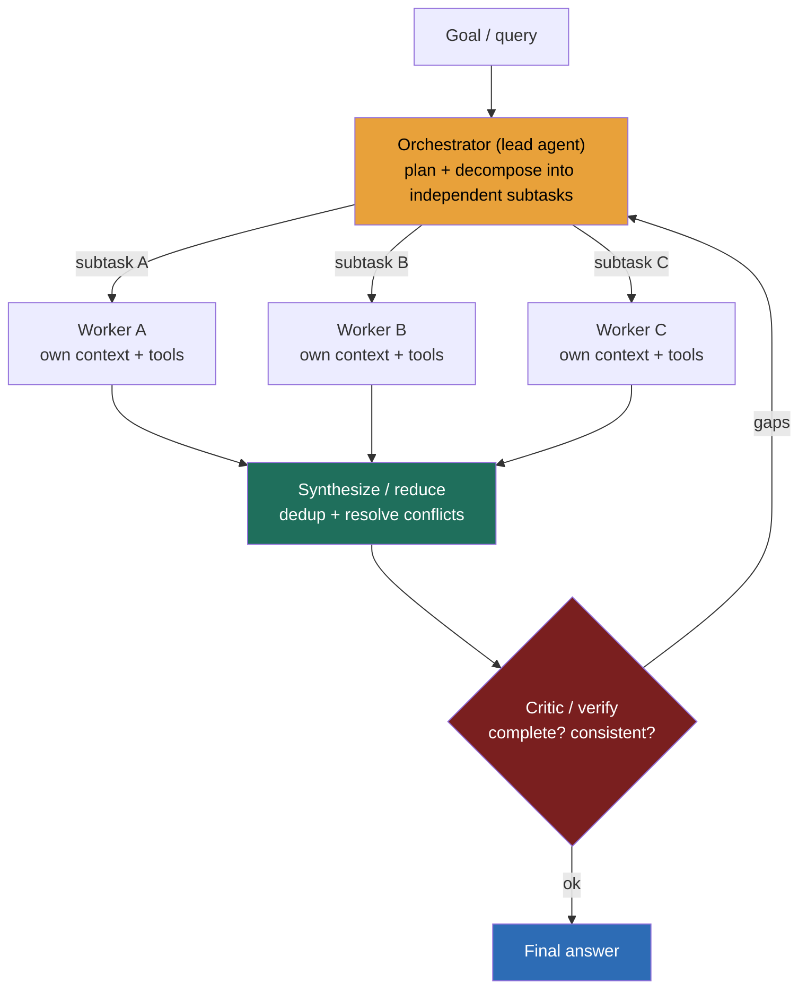

### Learning objectives
- Name the **real reasons** to split work across multiple agents — parallelism, role specialization, and **context isolation** — and distinguish them from the cargo-cult reason ("more agents = smarter").
- Draw the core **orchestration patterns** (orchestrator-worker, hierarchical, pipeline, parallel fan-out/reduce, debate-critic) and pick one from the *shape of the task*, not by reflex.
- Quantify the **cost and reliability tax** of multi-agent — a large token multiplier plus coordination overhead plus compounding error — so you can defend or reject it in dollars.
- State the **decision rule**: multi-agent earns its keep only when subtasks are genuinely **parallel and independently verifiable**; tightly-coupled, single-thread-of-control work belongs to one agent or a deterministic workflow.
- Reason about **shared state vs message passing** between agents and the consistency hazard each carries.

### Intuition first
A single agent is a **brilliant generalist working alone**: one head, one notepad, one train of thought. Multi-agent is **hiring a team and a manager**. The instinct that a team is automatically better is the same instinct that makes under-pressure managers throw bodies at a late project — and it fails for the same reason Brooks named fifty years ago: **a team only beats a soloist when the work genuinely splits into independent parts, and even then you pay for coordination.**

Picture a research report. If the question is "profile these eight competitors," a manager can hand one competitor to each of eight researchers, they work in parallel, and the manager staples the results together — a clean win, because the subtasks barely interact. Now picture editing a single contract clause by committee: eight people with eight pens on one paragraph, each overwriting the others, arguing about a sentence that has to read as one voice. That's slower and worse than one careful editor. **Same team, opposite outcome — and the only thing that changed is whether the work was actually parallel.** That distinction, not the number of agents, is the whole lesson.

### Deep explanation

**The legitimate reasons to go multi-agent — and the fake one.** There are exactly three reasons that hold up under questioning:
- **Parallelism.** Independent subtasks run concurrently, cutting wall-clock time. Eight competitor profiles in the time of one.
- **Role specialization.** A focused agent with a narrow system prompt, a curated toolset, and domain framing outperforms one generalist juggling everything. A "SQL analyst" agent and a "chart designer" agent each beat a single agent told to do both.
- **Context isolation** — the most underrated. Each sub-agent gets its **own clean context window** scoped to its subtask, instead of one agent's window filling with the debris of five concerns until it overflows and degrades (Lesson 11.11). Splitting the work splits the context, and a focused context is a higher-quality context.

The fake reason is **"more agents reason better."** Adding agents does not add intelligence; it adds *parallel capacity and separation*. If the task isn't parallel and doesn't benefit from separation, more agents make it **slower, costlier, and less reliable** — never smarter. The Director-altitude statement: *multi-agent is a concurrency-and-separation tool, not an intelligence amplifier.*

**The patterns, and the task shape each fits.**
- **Orchestrator-worker** (the workhorse): a lead agent decomposes the goal into subtasks, dispatches them to worker agents, and **synthesizes** the results into one answer. Fits open-ended work that splits into independent pieces (research, broad search, multi-file analysis). The lead is the single point of planning and aggregation.
- **Hierarchical** (managers of managers): orchestrators that themselves orchestrate, for deep task trees. Powerful and rarely necessary — each layer multiplies cost and latency. Reach for it only when a flat orchestrator-worker can't express the decomposition.
- **Sequential pipeline**: specialists hand off in a fixed order (extract → transform → validate → format). This is barely "multi-agent" — it's a **workflow** with LLM stages, and that's a feature: when the steps are known and ordered, a deterministic pipeline beats a free-roaming agent on reliability and cost (Lesson 11.9).
- **Parallel fan-out / reduce**: dispatch the *same* query to N agents (or one query split N ways), then merge — map-reduce for language. The reduce step is where quality is won or lost.
- **Debate / critic** (generator + critic): one agent proposes, another adversarially reviews, loop. Lifts quality on hard reasoning and catches errors a single pass misses — at the cost of multiple full passes per answer.
- **Handoff / "swarm"**: an agent **transfers control** to a specialist when it hits something outside its lane — a triage agent hands a billing question to the billing agent, which now owns the conversation. Great for routing within a known set of specialties; the trap is **handoff loops** (A→B→A) and losing the thread of who's in charge, so bound the handoffs and keep one clear owner.

There is no "best" topology. The signal an interviewer wants is the **match**: parallel-and-independent → orchestrator-worker or fan-out; known-and-ordered → pipeline (workflow); quality-critical-and-checkable → debate-critic; route-to-a-specialist → handoff/swarm; deep decomposition → hierarchical, reluctantly.

**Communication: shared state vs message passing — and the consistency trap.** Agents coordinate one of two ways. **Message passing** (the worker returns a result to the orchestrator, period) is the safe default: no shared mutable state, so no races. **Shared state / blackboard** (agents read and write a common store) is more flexible but reintroduces every distributed-systems hazard you know — two agents writing the same key, reading stale values, clobbering each other's work. If you must share state, you need the same discipline as any concurrent system: a single writer per key, or conditional writes, or an append-only log the orchestrator reconciles (the patterns from Modules 2 and 9 apply unchanged). The Director instinct: **prefer message passing and a single aggregating orchestrator; treat shared mutable agent state as the thing most likely to corrupt your run.**

**The cost and reliability tax — quantify it or get cut.** This is the point most candidates skip and every strong interviewer probes. Multi-agent is **not free parallelism**; it multiplies the two things that matter:
- **Token cost.** Every agent re-reads its context every turn, the orchestrator pays for planning and synthesis, and workers duplicate shared framing. In practice an agentic multi-agent system burns on the order of **10–15× the tokens of a single chat turn** (Anthropic reported its multi-agent research system used ~15× the tokens of chat). So the economics only work when the **value per task is high** — research worth dollars, not a $0.002 FAQ lookup.
- **Reliability.** Error compounds. If each agent succeeds independently with probability *p* over its run, a chain that needs all *N* to succeed lands near *pⁿ* — three agents at 90% each is ~73% end-to-end, and a deep tree decays fast. Add coordination failure modes a soloist never has: the orchestrator mis-decomposes, a worker misunderstands its slice, the synthesis drops a result, two agents duplicate or contradict each other.

So the bar is high and explicit: **the parallelism/specialization gain must outrun the token multiplier and the compounding-error tax.** State that trade in numbers, or you're hand-waving.

**The decision rule.** Multi-agent earns its place when subtasks are **(a) genuinely parallel** (they don't depend on each other's intermediate state) **and (b) independently verifiable** (you can check each worker's output on its own). Research, broad multi-source gathering, and fan-out evaluation fit cleanly. The anti-pattern is **tightly-coupled, single-thread-of-control work** — editing one document, executing a transaction, a tight reasoning chain where step *k+1* needs step *k*'s exact state. There, splitting across agents adds coordination cost and consistency risk for no parallelism benefit, and a **single agent or a deterministic workflow wins**. This echoes the Lesson 11.9 prime directive: *use the least autonomy and the fewest moving parts that solve the problem.*

Go deeper — orchestrator decomposition, aggregation, and failure handling (IC depth, optional)

- **Decomposition quality is the ceiling.** The orchestrator's plan caps the whole system: a bad split (overlapping subtasks, a missed slice, uneven sizing) can't be recovered by good workers. Make the orchestrator state its plan explicitly and, for high-value runs, validate the decomposition before dispatching.
- **Aggregation/reduce is a real step, not a concatenation.** Merging worker outputs needs dedup, conflict resolution (two workers disagree), and synthesis into one voice. Budget tokens and a capable model for the reduce; a weak synthesis wastes strong workers.
- **Partial failure.** Decide per-system: does one worker's failure fail the task, or does the orchestrator proceed with N-1 results and flag the gap? Bound workers with per-worker step/token/time budgets (Lesson 11.13) so one runaway can't sink the run.
- **Fan-out caps.** Unbounded dynamic fan-out ("spawn an agent per item" over thousands of items) is how token bills explode; cap concurrency and total agents, and log what you dropped.
- **Determinism.** More agents = more nondeterminism. For anything auditable, prefer fixed topologies (pipeline/workflow) over a free-roaming orchestrator that decides its own structure each run.

### Diagram: orchestrator-worker with a verify step

### Worked example: when to fan out, and when not to

**Case A — a competitive-research assistant (multi-agent wins).** The task: "produce a briefing on eight competitors across pricing, hiring, and product launches." This is **embarrassingly parallel and independently verifiable**: each competitor (or each competitor×dimension) is its own lookup, checkable on its own. Design: an **orchestrator** plans the matrix and dispatches **worker agents** in parallel, each with a clean context scoped to one competitor and a search/retrieval tool; a **reduce** step merges and de-duplicates; a **critic** checks coverage ("did we cover all eight and all three dimensions?") and sends gaps back. The token multiplier (~10×+) is justified because the briefing is high-value and the wall-clock saving is large — eight lookups in the time of one. Rejected alternative: one agent doing all 24 lookups serially in a single bloating context — slower, and its context degrades as it fills.

**Case B — refactor a function across one file (single agent / workflow wins).** The task: "rename a symbol and update every call site in this module." This is **tightly coupled and single-thread-of-control** — every edit shares the same file state, and ordering matters (an edit invalidates another agent's view of the file). Splitting it across agents introduces write conflicts on shared state and coordination overhead for **zero** parallelism benefit, and the compounding-error tax makes it *less* reliable than one agent (or a deterministic find-replace-then-verify workflow) doing it in order. Rejected alternative: an "agent per call site" — pure coordination cost, real corruption risk.

The two cases differ only in whether the work is parallel and independently verifiable. That test, applied first, pre-decides the architecture.

### Trade-offs table

| Pattern | Parallelism | Token cost | Coordination overhead | Reliability | Use when… |
|---|---|---|---|---|---|
| **Single agent** | none | **lowest (1×)** | none | best for coupled tasks (no coordination to fail) | the task is coupled, sequential, or small — the default |
| **Pipeline / workflow** | staged | low | low (fixed order) | **high (deterministic)** | steps are known and ordered — prefer over a free agent |
| **Orchestrator-worker** | **high** | high (~10×+) | moderate (plan + synth) | gated by decomposition + synthesis | independent, parallel, verifiable subtasks (research, broad gather) |
| **Hierarchical** | high | **highest** | high (every layer) | decays with depth | deep decomposition a flat orchestrator can't express — reluctantly |
| **Debate / critic** | low | high (N passes) | low | **highest quality** on hard reasoning | quality-critical, checkable answers worth multiple passes |

### What interviewers probe here
- **"Why not just split this into ten agents and go faster?"** — *Strong signal:* names the **token multiplier (~10–15×)** and **compounding error (pⁿ)**, and asks whether the subtasks are actually parallel; concludes multi-agent only pays when value-per-task is high and the work is independent. *Red flag:* "more agents = better/faster" with no cost or coupling analysis.
- **"How do the agents share state without stepping on each other?"** — *Strong:* prefers **message passing to a single aggregating orchestrator**; if shared state is required, applies single-writer / conditional-write / append-log discipline. *Red flag:* a free-for-all shared scratchpad with no concurrency control — races and clobbered work.
- **"When is multi-agent the *wrong* call?"** — *Strong:* tightly-coupled, single-thread-of-control tasks (one document, a transaction, a tight reasoning chain) — use one agent or a deterministic workflow. *Red flag:* "multi-agent is always more capable."
- **"Your multi-agent research system gives inconsistent, partial answers. Diagnose."** — *Strong:* looks at **decomposition** (did the orchestrator split cleanly?), **synthesis** (did reduce drop/contradict results?), and **partial failure** handling, before blaming the model. *Red flag:* swaps the model first.

The through-line at Director altitude: **multi-agent is a cost-and-risk decision, not a sophistication flex.** "I'd default to a single agent or a workflow, and only fan out where the subtasks are independently verifiable and the task value clears the ~10× token tax — and I'd cap concurrency and budget each worker so one run can't blow the bill."

### Common mistakes / misconceptions
- **Treating agents as free intelligence.** More agents add parallelism and separation, not reasoning power. If the task isn't parallel, you've made it slower, costlier, and less reliable.
- **Ignoring the token multiplier.** Multi-agent commonly costs ~10–15× a single turn. Defend it with value-per-task math or don't propose it.
- **Splitting coupled work.** Single-thread-of-control tasks (one doc, one transaction, a tight chain) across agents = coordination cost and consistency risk for zero gain. One agent or a workflow wins.
- **Unbounded shared state.** A common scratchpad with no single-writer/conditional-write discipline races and corrupts. Prefer message passing.
- **Forgetting the reduce step.** Aggregation is real work (dedup, conflict resolution, synthesis); a weak reduce wastes strong workers and is where inconsistency leaks in.

### Practice questions

**Q1.** You're asked to design an agent that audits a 200-page contract clause-by-clause and flags risky terms. One agent or many — and why?
> *Model:* Clause-flagging is **parallel and independently verifiable** — each clause is judged on its own — so an **orchestrator-worker fan-out** (chunks of clauses to parallel workers, each with a clean context and a risk rubric) fits, with a reduce step that merges flags and a critic that checks coverage. *But* if the task were "rewrite the contract into one coherent voice," that's **coupled** (clauses reference each other, the whole must read consistently) and belongs to a single agent or a tightly-ordered workflow. Same document, opposite answer, decided by parallel-and-verifiable.

**Q2.** A team proposes a 4-level hierarchical agent system for a customer-support bot. Critique it.
> *Model:* Almost certainly over-built. Each hierarchy layer multiplies token cost and latency and adds a decomposition/synthesis point that can fail (reliability decays with depth). Support is mostly **retrieve-and-answer with a few tool actions** — a single agent with RAG and a small toolset (Lessons 11.9–11.10), or a constrained workflow, handles the bulk; escalate to a human for the tail. I'd push for the flattest thing that meets the quality bar and reserve any fan-out for genuinely parallel sub-questions, naming the ~10× cost if we add it.

**Q3.** How do you stop a multi-agent run from exploding your token bill?
> *Model:* **Bound everything:** cap concurrent workers and total agent count; give each worker a step/token/time budget (Lesson 11.13) with a kill switch; cap dynamic fan-out and log what was dropped (no silent truncation); prefer fixed topologies over an orchestrator that invents its own structure each run; and gate the whole pattern behind a value-per-task threshold so cheap tasks never trigger it. Track $/task in tracing (Lesson 11.7) and alert on regressions.

**Q4.** When is a "multi-agent system" really just a workflow, and why does the distinction matter?
> *Model:* When the steps are **known and ordered** (extract → validate → format), it's a **pipeline/workflow** with LLM stages, not a free-roaming agent system — and that's better: deterministic order, lower cost, easier to test and audit. The distinction matters because calling it "multi-agent" invites unnecessary autonomy and nondeterminism. Reserve true agentic orchestration for open-ended decomposition you can't script in advance.

### Key takeaways
- **Multi-agent is a concurrency-and-separation tool, not an intelligence amplifier.** The three real reasons to use it: parallelism, role specialization, and context isolation. "More agents reason better" is false.
- **Pick the pattern from the task shape:** orchestrator-worker / fan-out for independent parallel work, pipeline (workflow) for known ordered steps, debate-critic for checkable quality-critical answers, hierarchical only when a flat orchestrator can't decompose it.
- **Price it.** Multi-agent burns ~10–15× the tokens of a single turn and decays reliability as ~pⁿ across the chain. The parallelism/specialization gain must outrun that tax, in numbers.
- **Decision rule:** multi-agent only when subtasks are genuinely **parallel and independently verifiable**; tightly-coupled, single-thread-of-control work goes to one agent or a deterministic workflow.
- **Prefer message passing and a single aggregating orchestrator.** Shared mutable agent state reintroduces races and clobbering — apply single-writer/conditional-write discipline or avoid it.

> **Spaced-repetition recap:** Multi-agent = hiring a team + a manager. Win only when the work is **parallel and independently verifiable** (eight competitor profiles), lose when it's **coupled / single-thread-of-control** (edit one clause) — there one agent or a workflow wins. Patterns: orchestrator-worker (workhorse), pipeline (= workflow, prefer when ordered), fan-out/reduce, debate-critic, handoff/swarm (route to a specialist), hierarchical (reluctantly). It is **not free parallelism**: ~10–15× tokens and reliability ~pⁿ — defend with value-per-task math, bound concurrency/budgets, prefer message passing over shared state. Cross-ref: 11.9 (agent loop, least-autonomy rule), 11.11 (context isolation), 11.13 (durable runtime + budgets), 11.14 (safety / HITL on irreversible actions), 12.6 (multi-agent walkthrough).
