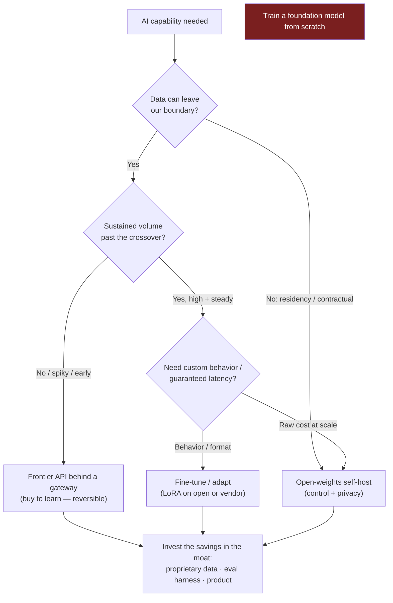

> Every Director-level AI conversation eventually reaches the strategy question: *"Do we build our own model or use somebody's API?"* It arrives in the loop as a hypothetical ("your CEO wants an AI strategy, where do you start?"), in the panel as a challenge ("why are we paying OpenAI instead of owning this?"), and on the job as a board slide. The interviewer is **not** scoring whether you know this quarter's cheapest model. They're scoring three things: **altitude** (do you reason about sequencing, optionality, and total cost of ownership, or do you name a vendor and stop), **currency** (does the answer sound like 2026 or like the 2023 "let's train our own foundation model" land-grab), and **judgment under hype** (can you say *no* to the expensive, exciting, wrong option when a CEO is leaning on you to say yes). This is the round where a technically strong leader most often over-commits — proposing to build what should be bought, because building sounds more impressive. The whole lesson is about resisting that and replacing it with a defensible sequence.

### Learning objectives
- Lay out the **build-vs-buy spectrum** for GenAI — frontier API → open-weights self-host → fine-tune/adapt → build-from-scratch — and explain why the last is the *rejected default* for all but a handful of frontier labs.
- Reason about the **API-vs-self-host economics** with real cost structure (opex-per-token vs GPU capex + an MLOps team) and name the **volume/privacy crossover** where self-host starts to win.
- Frame the decision as **sequencing and optionality**, not model selection: buy to learn, build moats in data/eval/product, self-host only where volume or control earns it.
- Separate **reversible** moves (API behind a gateway) from **one-way doors** (training your own model, standing up an inference platform and team), and spend conviction accordingly.
- Answer "what's our moat if everyone has the same models?" with the only durable answer — **proprietary data, evaluation, and product**, never the raw model.

### Intuition first
Building AI strategy is like sourcing **power for a factory.** You don't build your own generator on day one — you plug into the **grid**, pay the **meter**, and start making product immediately. The utility has scale, reliability, and a price per kilowatt-hour you'll never beat at low volume. You build your own generator only when your **load is big enough and steady enough** that the capex of the plant — plus the crew to run it — finally beats the meter. A factory running three shifts a day, every day, eventually crosses that line; a workshop that fires up occasionally never does, and for it a generator is a stranded asset that sits idle and depreciates.

Frontier models are the grid; the API meter is the per-token bill; self-hosting is building your own generator. So the Director's instinct is the inverse of the engineer's reflex to build: **buy from the grid first, and build your own generator only when sustained load makes the capex beat the meter** — and even then, only for the loads that justify it, not the whole factory. The leaders who got this wrong in 2023 built generators for a workshop's load: they spent a fortune training models that a $20/month API surpassed within a year. The ones who got it right ran on the meter, learned what customers valued, and *earned the right* to self-host the few loads worth owning. And the analogy makes the moat obvious: the generator is never the advantage. Everyone can buy power. The factory that wins is the one that makes the better product with the same kilowatts.

---

## The questions

These are the variants of the same strategy round. They look like invitations to pick a side; they're really tests of whether you reason about cost, optionality, and the moat.

| Variant | What it's really testing |
|---|---|
| "Should we build our own model or use an API?" | Whether you default to *buy* and can name the narrow conditions that flip it, vs reflexively building. |
| "What's your AI strategy for the next 12 months?" | Whether strategy means a *sequence* with gates, or a vendor/model name and a vibe. |
| "Why are we paying a vendor per token instead of owning this?" | Whether you know the real cost structure (TCO, not just sticker price) and the volume crossover. |
| "When would you self-host an open-weights model?" | Whether you can state concrete triggers (data residency, sustained volume, latency/control) rather than ideology. |
| "What's our AI moat if every competitor has the same models?" | The core insight: the moat is data + eval + product, **never** the commoditizing model. |
| "Open-source or closed models?" | Whether you treat it as a portfolio/optionality call, not a tribal allegiance. |
| "The CEO wants us to train a proprietary LLM. React." | Judgment under hype — can you redirect spend without either capitulating or dismissing the ambition. |

The merge: every one resolves to the same shape — **clarify the requirements that actually move the decision, lay out the spectrum, then commit to a sequence with its trade-off and reversibility named.** Pick a vendor with no reasoning and you've failed; build everything to sound ambitious and you've failed worse.

---

## The framework

The answer shape is **Clarify → Options → Decide-and-Sequence → Name the trade-off and reversibility.** It's the hypothetical-decision structure applied to strategy.

- **Clarify** the decision drivers that actually decide it, before naming any vendor: **data sensitivity** (can our data legally leave our boundary — privacy, residency, contract?), **scale** (how many tokens/month, sustained — where does the cost crossover sit?), **latency/control** (do we need guaranteed latency, custom behavior, on-prem?), **customization** (does the task need behavior a base model won't give?), **speed-to-market** (are we learning what customers want, or scaling something proven?), **team capability** (can we actually run a GPU fleet?), and **switching cost / lock-in** (how reversible is this choice?).
- **Options** — lay out the spectrum honestly, cheapest-and-fastest to most-expensive-and-slowest:
  - **Frontier API** (OpenAI, Anthropic, Google): best capability, zero infra, ship this week, opex per token. Costs: data-governance terms to negotiate, a per-token bill that scales with usage, and vendor concentration / lock-in.
  - **Open-weights self-host** (Llama, Mistral, Qwen, DeepSeek-class): full control, data never leaves your boundary, flat amortized cost at high utilization. Costs: a GPU fleet *and an MLOps/ML-platform team* as **fixed** cost, and you trail frontier capability.
  - **Fine-tune / adapt** (LoRA on an open model, or a vendor's tuning API): narrow behavior/format/latency wins. Costs: data curation + an eval harness + retraining as base models move.
  - **Build a foundation model from scratch / pretrain**: name it and reject it as the default. It's a multi-hundred-million-dollar, multi-year bet — thousands of GPUs, a research team, a data pipeline — that makes sense for a handful of frontier labs and almost no application company; the next base release will leapfrog whatever you train. *Stating this rejection out loud, with the reason, is itself the altitude signal.*
- **Decide and sequence** — the answer is rarely one option; it's an order. The default sequence: **(1) Buy** — ship on a frontier API (with RAG) behind a gateway to learn what customers value, fast. **(2) Build the moat** — invest in proprietary data, an evaluation harness, and product/UX, the things that *don't* commoditize. **(3) Self-host or fine-tune** — only the workloads where sustained volume, data residency, or control have earned it.
- **Name the trade-off and reversibility.** Buying on an API is **reversible** (a gateway lets you swap providers). Standing up an inference platform and team — or training your own model — is a **one-way door**. Spend conviction in proportion: experiment freely behind reversible doors; demand overwhelming evidence before walking through a one-way one.

The crossover, quantified at altitude: a frontier API charges single-digit-to-tens of dollars per million output tokens with **zero fixed cost** — you pay only for what you use, and it's somebody else's capex. Self-hosting an open-weights model means **reserving GPUs** (an 8-GPU H100-class node runs on the order of $15–30/hour, ≈ $10–20k/month, *whether busy or idle*) **plus a platform team** — call it 3–5 ML/infra engineers as standing headcount. The amortized $/token only drops below the API when you keep that fleet **near-saturated around the clock** — practically, sustained volume in the high hundreds of millions to billions of tokens per month — *or* when data simply cannot leave your boundary at any price. **The number that decides it is utilization, not the sticker price per token.** Below the line, self-hosting is more expensive *and* slower to ship *and* trails frontier quality; spiky, low, or early-stage workloads tip toward the API. Above the line — high, steady, predictable load — or under a hard residency constraint, it flips toward self-host. And the asymmetry matters as much as the line: the API is a reversible meter you can switch off; a fleet and a team are a one-way door you stood up.

---

## 2023 AI-hype vs 2026 grounded: the calibration

This is the category where a dated answer is most expensive, because the dated answer costs real money. The answers that sounded visionary in the GPT-rush now read as naive. Five shifts separate a current strategy from a 2023 one.

- **"Let's train our own foundation model" is dead as a default.** In the 2023 GPT-rush, every well-funded company floated building a proprietary model and "AI-first everything"; most that tried burned the budget and were lapped by the next API release. The 2026 grounded position: **the base model is a commodity input you rent**, and the few who should pretrain are frontier labs. Proposing to build one as an application company now reads as not understanding the cost curve — visionary in the hype, naive in hindsight.
- **"GPT wrapper" stopped being an insult.** The 2023 sneer was that anything on an API is a thin, defensible-by-nobody wrapper. The 2026 reality: the wrapper *is* the product — the moat lives in the **proprietary data, the evals, the workflow integration, and the UX**, not the weights. A great product on a rented model beats a mediocre product on an owned one every time.
- **The moat moved from the model to the data-and-eval flywheel.** The durable advantage is what competitors can't buy: your usage data, your golden eval sets, your domain-tuned retrieval, and the product surface that compounds. "We trained our own model" is not a moat (so did everyone, and the next release leapfrogged it); "we have the only labeled dataset and eval harness for this domain" is.
- **Lock-in fear matured into an optionality discipline.** The 2023 conversation was binary ("are we locked into OpenAI?"). The 2026 answer is an **abstraction layer** — a model gateway that makes providers swappable, lets you route by cost/quality, and turns "betting the company on one vendor" into "reversible vendor choice." Optionality is designed in, not agonized over.
- **"AI-first everything" gave way to "AI where it earns its place."** The 2023 reflex was to inject AI into every surface to look forward-leaning. The 2026 grounded posture is selective: AI where it measurably beats the deterministic alternative on a real metric, behind a cost-per-use budget and an eval bar — and the discipline to say *not here*. Putting AI everywhere now reads exactly like "microservice everything" read in 2018.

---

## Model answers

### Answer 1: "Should we build our own model, or use an API?" (Clarify → Options → Sequence → Trade-off)

> *(Clarify)* "Before I pick, a few drivers decide it: can our data legally leave our boundary, what's our sustained token volume, do we need custom behavior or guaranteed latency, and are we still learning what customers want or scaling something proven? *(Options)* The spectrum runs from a frontier API — fastest, no infra, pay per token — through self-hosting an open-weights model, which gives control and flat cost but only past high, steady utilization, to fine-tuning for behavior, and finally training from scratch, which I'd take off the table immediately: that's a nine-figure, multi-year bet that makes sense for frontier labs, not for us, and the next base release would leapfrog whatever we trained. *(Sequence)* So my answer is an order, not a pick. We **buy first** — ship on a frontier API behind a gateway, this quarter, to learn what actually creates value. We pour the savings into the things that don't commoditize: our proprietary data, an evaluation harness, and the product. Then we **self-host or fine-tune only the workloads that earn it** — the high-volume, steady ones where a saturated GPU fleet beats per-token pricing, or anything under a data-residency constraint. *(Trade-off + reversibility)* The trade-off I'm accepting up front is a per-token bill and a vendor dependency in year one — and I'm accepting it deliberately, because that path is reversible behind the gateway, whereas standing up our own inference platform and team, or training our own model, is a one-way door I won't walk through without proof the API can't meet the bar."

**Why it scores:**
- **Clarifies before committing** — names the decision drivers, so the answer is contextual, not a reflex.
- **Rejects build-from-scratch explicitly and prices it** ("nine-figure, multi-year," leapfrogged by the next release) — the altitude signal is naming the expensive option and killing it with a reason, not ignoring it.
- **Answers with a sequence, not a side** — buy-to-learn → build the moat → self-host where earned is the grounded 2026 shape.
- **Names the trade-off it's accepting and ties it to reversibility** — the trade-off-articulation rule applied to strategy: the cost is stated, and conviction is spent in proportion to how hard the door is to reopen.

### Answer 2: "What's your AI strategy for the next 12 months?"

> "I'd run it as three sequenced bets, not a single technology pick. *(Quarter 1 — buy to learn)* We ship our highest-value AI feature on a frontier API behind a model gateway, with RAG over our own data — fast, reversible, and the point is to learn what customers actually value before we spend on infrastructure. We instrument cost-per-request and an eval bar from day one so we're not flying blind. *(Quarter 2–3 — build the moat)* We invest the engineering not in models but in the things that compound and that competitors can't rent: a proprietary dataset from our usage, a golden eval harness that lets us adopt any better model the day it ships without regressing, and the product workflow that makes us the default. *(Quarter 3–4 — self-host only where earned)* By now we'll know which workloads run at high, steady volume or sit under a residency constraint — those, and only those, we move to a fine-tuned open-weights model on a reserved fleet, because that's where utilization finally beats the meter. The trade-off I'm naming: this is deliberately *not* the most ambitious-sounding plan — we don't train a model and we don't put AI in everything. It's the plan that keeps every expensive door reversible until the data says open it, and it spends against the moat instead of the commodity."

**Why it scores:**
- **A sequence with quarters and gates**, not a vendor name — the Director frame of optionality-over-model-picking, made concrete.
- **Puts measurement first** (cost-per-request + eval bar in Q1) — ties strategy to the unit economics and governance a Director owns.
- **Spends against the moat, not the model** — data, eval, product — and explicitly *names what it refuses to do* (train a model, AI-everywhere), the 2026 judgment-under-hype tell.
- **Closes on reversibility** — every door stays reversible until evidence justifies the one-way one, the spine of the whole framework.

---

## What interviewers probe here

- **"When, specifically, would you self-host?"** — *Strong:* concrete triggers — a hard data-residency/contractual constraint, or sustained high-and-steady volume past the utilization crossover where a near-saturated fleet beats per-token pricing, or a latency/control requirement an API can't meet — and names the fixed cost (a platform team) it adds. *Red flag:* "for control" or "to avoid lock-in" with no volume math or residency trigger — ideology, not a decision.
- **"The CEO insists on a proprietary model. How do you respond?"** — *Strong:* channels the ambition without capitulating — "the goal is a defensible AI advantage, and the cheapest path to it is owning our data and evals, not training weights the next release will leapfrog; here's the spend comparison and what each buys." Redirects to the moat, offers a small proof gate. *Red flag:* either caves to the hype or dismisses the CEO; both lose the room.
- **"Aren't we just a thin wrapper on someone else's model?"** — *Strong:* the wrapper is the product; the moat is data/eval/UX, and the model being shared is *fine*. *Red flag:* gets defensive and proposes building a model to prove depth.
- **"How do you avoid betting the company on one vendor?"** — *Strong:* a model gateway/abstraction layer that makes providers swappable and routes by cost/quality, plus a fallback provider for availability — optionality by design. *Red flag:* "we'd self-host to be safe" — trades a reversible dependency for a far larger fixed cost and slower capability.
- **"What's the moat if everyone has the same model?"** — *Strong:* proprietary data, an eval harness, distribution, and product UX — the things that don't commoditize — and *welcomes* model commoditization as a cost tailwind. *Red flag:* names a fine-tuned checkpoint as the moat (the next base model erases it).
- **"Open or closed models?"** — *Strong:* a portfolio — closed/frontier for the hardest capability, open for cost/control/residency, behind one gateway — chosen per workload. *Red flag:* a tribal answer either way.

---

## Common mistakes

- **Building when you should buy.** The instinct to train or self-host because it sounds more serious. The default is buy; self-host/fine-tune is what you *earn* with volume, residency, or a proven control need — not a starting posture.
- **Chasing the latest model as the strategy.** Treating "we're on the newest, best model" as a plan. Models leapfrog each other monthly; a strategy that is just model-picking has no durable shape. The strategy is the sequence and the moat, with a gateway that lets the model underneath change freely.
- **Quoting sticker price, ignoring the crossover and TCO.** Comparing API $/token to GPU $/token without counting the platform team, utilization, idle capacity, and capability gap. Self-host economics live or die on *utilization*, and the team is a fixed cost forever; ignoring the crossover (and the lock-in asymmetry) is the classic miss.
- **Thinking the fine-tune *is* the moat.** A fine-tuned checkpoint feels proprietary, but the next base model surpasses it and your tuning has to be redone on top of it. The moat is the *data and eval harness* that let you fine-tune (or swap) repeatedly — not the frozen weights you produced once.
- **One-way doors at experiment speed.** Standing up an inference platform, training a model, or committing deep infra before the cheap, reversible API path has taught you what's actually valuable. Walk through one-way doors last, and only with proof.

---

## Practice prompts

1. **Make the build-vs-buy call in 90 seconds.** A B2B SaaS wants an AI assistant over customer data. *(Sketch: clarify data-residency + volume + time-to-market; options spectrum; sequence = API-behind-a-gateway now to learn, invest in proprietary data + eval, revisit self-host only if a customer demands on-prem/residency or volume saturates a fleet; name the reversible-vs-one-way-door trade.)*
2. **Defend paying a vendor to a cost-cutting CFO.** "We're spending $2M/year on API calls — why don't we own this?" *(Sketch: TCO comparison — the $2M opex vs a reserved GPU fleet + a standing platform team + capability gap + slower shipping; self-host only beats it past the utilization crossover; offer to model the crossover and route the high-volume, steady workloads to open-weights behind the gateway as the *measured* middle path.)*
3. **Redirect a "train our own LLM" mandate.** *(Sketch: channel the ambition to its real goal — a defensible AI advantage; show the nine-figure/multi-year cost and that the next base release leapfrogs it; propose the cheaper path to the same goal — own the data and evals; agree on a small proof-of-concept budget gate rather than a blank check; disagree-and-commit.)*
4. **State your AI moat to an investor.** *(Sketch: the model is a commodity input that improves under us for free; the moat is proprietary data + eval harness + distribution + product/workflow + the optionality (a gateway) to adopt the best model the day it ships; welcome commoditization as a cost tailwind that erases model-only competitors.)*

---

### Key takeaways
- **The spectrum is API → self-host → fine-tune → build-from-scratch; the default is buy, and build-from-scratch is the rejected default** for everyone but frontier labs. Naming and killing the expensive option — with the reason (cost, and the next release leapfrogs it) — is the altitude signal.
- **Self-host wins only past the utilization crossover or under a hard data-residency constraint.** The economics turn on *utilization* and the standing platform-team cost, not the per-token sticker — below the line (spiky/low/early) self-host is more expensive, slower, and behind on capability; above it (high/steady) or under residency it flips.
- **AI strategy is sequencing and optionality, not model selection.** Buy to learn → invest in the moat (data, eval, product) → self-host/fine-tune only where earned. Reversible moves (API behind a gateway) get experiment-speed conviction; one-way doors (an inference platform, training a model) get walked through last, with proof.
- **The moat is never the model — nor the fine-tune.** The model commoditizes every few months and improves under you for free; a fine-tuned checkpoint is leapfrogged by the next base release. Durable advantage is proprietary data, an evaluation harness, distribution, and product/UX — the things competitors can't rent.
- **Design optionality in with a gateway.** Swappable providers, cost/quality routing, a fallback for availability — that's the grown-up answer to lock-in, not a GPU fleet.

> **Spaced-repetition recap:** The AI strategy round scores **altitude, currency, and judgment under hype**, not which model you'd name. Answer in **Clarify → Options → Sequence → Trade-off/reversibility**: clarify data-sensitivity, scale, control/customization, speed-to-market, team, lock-in; lay out API → self-host → fine-tune → (rejected) build-from-scratch; commit to the sequence **buy-to-learn → build the moat → self-host where earned**; name the trade and whether the door is reversible. The 2026 calibration vs the 2023 hype: **the model is a commodity input, not the moat** — own the **data, eval, distribution, and product**, design optionality with a **gateway**, self-host only past the **utilization crossover** or under a **residency** constraint, and never propose training a foundation model from scratch as an application company.

---

*End of Lesson 11.15. Strategy decides what you build on; the next lesson covers what you're accountable for once it's live — the governance, risk, data-privacy, and cost discipline a Director owns when nondeterministic systems touch real customers and a real budget.*
