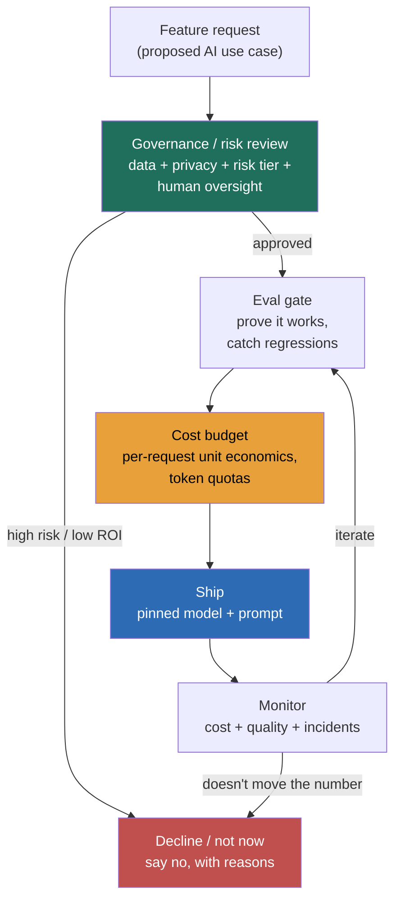

> Every Director loop in 2026 has an "AI leadership" round, and it is no longer a system-design question wearing a suit. A VP or the CTO asks how you'd put AI into the product, how you govern it, what it costs, and what you'd refuse to ship. They are **not** scoring whether you can name vLLM or draw a RAG pipeline (that's the design round, Modules 11.1–11.14). They're scoring whether you can **own AI as a business risk and a cost center** the way you already own headcount and uptime: do you have a governance posture, do you know the unit economics, do you understand where your customer's data goes, and, the tell that separates a leader from an enthusiast, **do you have the judgment to say "not here"** when the board wants AI in everything. The fatal answer in this round isn't ignorance of a technique; it's unbounded enthusiasm. "We should put AI everywhere, it's the future" reads in 2026 exactly like "let's microservice everything" read in 2018: a leader who's caught the hype and hasn't done the arithmetic. The whole lesson is about landing between blocker and hype-man.

### Learning objectives
- Run the **AI-leadership hypothetical** in a clarify → frame the accountabilities → decide-and-gate shape, and know that the **gate (governance + cost + eval) is where the score is won**, not the enthusiasm.
- Own the **Director's AI accountabilities** beyond the architecture, governance, data/privacy, security, cost/FinOps, org/talent, outcome measurement, and ops for a non-deterministic system, and name a concrete mechanism for each.
- Quantify **AI unit economics** well enough to catch the "feature that loses money per user" before it ships, and treat token cost as a margin line, not an infra rounding error.
- Answer the **vendor-data question** crisply (does the provider train on our prompts; residency; retention; indemnity) because it's the one a security/legal interviewer always probes.
- Demonstrate the **currency move**: tie every AI bet to a measurable outcome, resist AI-washing, and show the discipline to kill or not-ship a negative-ROI feature.

### Intuition first
Shipping the demo is the easy 20%. Any engineer can wire an API key to a chat box over a weekend and get applause in the all-hands. The leadership 80% is everything the demo hides: who approved that it's allowed to make this decision, where the customer's data travels when it leaves your VPC, what it costs at a million requests a day, who's on call when it confidently lies to a regulator, and whether it actually moved a number anyone cares about. A Director who only talks about capability is like a CFO who only talks about revenue and never about cost or risk, impressive for one slide, dangerous for a quarter. The board will push "AI everywhere," and the instinct that reads as senior is not to salute and not to block, but to **act like a portfolio manager**: a few governed, measured, high-ROI bets; clear guardrails on the data and the spend; and a willingness to say "this one loses money and adds risk, so no." You're not auditioning your excitement about AI. You're showing you can be trusted to *own* it.

---

## The questions

These are the open prompts of the AI-leadership round. They look like invitations to enthuse; they're really tests of whether you've done the unglamorous half.

| Variant | What it's really testing |
|---|---|
| "Our CEO wants AI in every product. How do you respond?" | Portfolio judgment vs hype-following, and whether you can say no without being a blocker. |
| "How do you govern AI risk in your org?" | Whether "governance" is a real mechanism (review process, policy, eval gate) or a word. |
| "Your new AI feature costs more than it earns. What do you do?" | Do you know AI unit economics and the cost levers, or did you never model them. |
| "How do you handle customer data with a model vendor?" | The data-residency / "do they train on our data" / retention / indemnity reflex. |
| "How do you staff for this without an ML research team?" | Realistic org design (upskill app engineers + small platform/eval team) vs "we hire ten PhDs." |
| "How do you know the AI is actually working and worth it?" | Outcome measurement and the courage to kill, vs AI-washing and vanity demos. |
| "An engineer is pasting prod data into ChatGPT to debug. React." | Shadow-AI awareness, and proportionate response vs ban-everything. |
| "A model update changed your feature's behavior overnight. What now?" | Whether you operate a non-deterministic system, version pinning, eval gates, a "model changed" runbook. |

The merge: every one of these resolves to the same instinct, **treat AI as a governed, measured investment, not a gadget.** The enthusiastic monologue is the trap; the accountabilities and the gate are the answer.

---

## The framework

The Director owns the accountabilities the demo never shows. Name them, attach a mechanism to each, and you've shown you can run AI as a function rather than a science fair. The operating model below is also the answer to "how do you govern AI risk?", a feature request enters at the top, passes a governance/risk review and an eval gate and a cost budget before it ships, then is monitored on cost, quality, and incidents, and the branch that scores is the one that lets you **decline or defer.**

- **Governance / responsible AI** — the standing process, not a slogan. An acceptable-use policy, a lightweight **AI review** for new use cases that classifies each by risk and decides the level of **human oversight** (suggest vs auto-act, Lesson 11.14), and a named owner. At altitude you can reference the regulatory frame without reciting it: the **EU AI Act**'s risk tiers (unacceptable/banned → high-risk with heavy obligations → limited/transparency → minimal), with high-risk obligations phasing in through 2026–27, and the **NIST AI RMF** functions (Govern, Map, Measure, Manage) as the shape of a program. The Director move is to map *your* features onto those tiers, not to lecture on the law.
- **Data & privacy** — the question a security interviewer always asks. What data may train or ground a model; **PII** handling; **data residency** (EU data staying in-region); **IP/copyright**; and the load-bearing one, **vendor data-handling terms**: on enterprise API/business tiers from the major providers, your prompts and outputs are **not used for training and are zero/short-retention**; on consumer tiers they historically were. Knowing that distinction, and that you'd contractually require no-training + a DPA + (now standard) copyright indemnity, is the signal.
- **Security** — the new attack surface: prompt injection and data exfiltration (Lesson 11.6), excessive agency (11.14), and **shadow AI**, employees pasting source code or customer records into consumer chatbots (the Samsung 2023 leak is the canonical cautionary tale). The mechanism is a sanctioned tool plus DLP, not a blanket ban that just drives it underground.
- **Cost / FinOps** — AI cost is **usage-based and can lose money per user.** Unlike a fixed server fleet, every request bills tokens (Lesson 11.8), so a flat-priced feature with a few power users can run **negative gross margin**. You own per-feature cost accounting, token budgets, quotas, and the unit-economics model *before* launch.
- **Org & talent** — you will **not** hire a frontier research lab, and saying you would is a red flag. You **upskill your application engineers** on prompt/RAG/eval, stand up a **small platform + eval team** (3–6 people who own the gateway, eval harness, and guardrails, Lessons 11.7/12.3), and partner with whatever ML/DS function exists. Buy the capability (models via API) and build the moat (your data, eval, and product).
- **Outcome & ROI** — every bet ties to a number (deflection rate, cycle time, conversion, cost-to-serve), measured honestly, with the **courage to kill** the ones that don't move it. This is where you resist **AI-washing**, shipping AI so the press release has the word in it.
- **Ops for a non-deterministic system** — once it's live, you own running something that **can change behavior without a deploy.** A vendor silently ships a new model snapshot, your prompt regression sneaks in, retrieval drifts, and quality moves under you. So releases are **eval-gated** like a test suite (Lesson 11.7), you **pin model versions** and re-eval before adopting a new one, and your incident runbook has a class that traditional systems don't, *"the model changed."* On-call has to be able to roll back to a pinned model and prompt, not just restart a service. Naming this is what separates someone who has *operated* AI in production from someone who has only demoed it.

Run a hypothetical as **clarify the use case → walk the accountabilities → decide and gate**, then stop. The gate carries the score.

---

## 2023 AI-hype vs 2026 grounded: the calibration

This is a freshly-scored category; the 2023 hype-era answers are now disqualifying, and the 2026 bar is grounded, governed, measured, cost-controlled AI tied to a business outcome.

- **"We need an AI strategy" → "We need AI tied to outcomes, and the discipline to not ship."** In 2023, *having* an AI initiative was the bar. In 2026, after a wave of expensive features that moved no metric, the credible Director leads with **ROI and a kill criterion**, not ambition. "AI strategy" as a noun is a 2023 tell.
- **"Ship the GPT wrapper fast" → "Buy the model, build the moat."** Thin wrappers got commoditized and out-shipped by the platforms themselves. The current answer knows the model is **rented and swappable** (Lesson 11.15) and that the durable value is your **proprietary data, eval harness, and product workflow**, fronted by a gateway so you're not locked in.
- **"AI everywhere" → "AI where the ROI and risk math works."** Blanket enthusiasm now reads as someone who hasn't done the arithmetic. The portfolio stance, a few high-value governed bets, an explicit *no* to the rest, is the senior signal.
- **"Move fast, we'll handle governance later" → "Governance and cost are launch gates, not cleanup."** Post-EU-AI-Act and post-a-few-public-AI-incidents, "later" reads as the person who'll cause the incident. Governance, eval, and a cost model are **preconditions to ship**, like a security review.
- **"Our engineers will figure it out / let's hire a research team" → "Upskill app engineers, small platform+eval team, partner for the rest."** Both extremes, ad-hoc heroics and a moonshot lab, signal someone who hasn't run AI delivery at a normal company's budget.

---

## Model answers

### Answer 1: "Our CEO wants AI in every product. How do you respond?" (clarify → accountabilities → decide-and-gate)

> *(Clarify, don't salute or block)* "First I'd reframe it with the CEO from 'AI everywhere' to 'AI where it earns its place,' and agree on what success means, are we chasing a cost-to-serve cut, a conversion lift, or a strategic signal to the market? Those lead to different bets. *(Portfolio)* Then I'd treat it as a portfolio: I'd inventory candidate use cases and score each on value, feasibility, and risk. Typically two or three are clear wins, support deflection, internal developer productivity, search, a long tail are low-value or high-risk, and saying *no* to those is part of my job, not a failure to deliver. *(The gate, where the real answer is)* For the bets we green-light, each goes through the same gate before it ships: a governance check that classifies its risk tier and sets the human-oversight level, a data review on what it touches and the vendor terms, a **cost model so we don't ship a feature with negative gross margin**, and an **eval harness so we can prove it works and catch regressions**. *(Mechanism + number)* Concretely, last year we ran exactly this: of nine proposed AI features we shipped three, and the support-assistant one cut ticket volume 22% at a fully-loaded cost of about eleven cents a conversation, which we'd modeled before building. We killed two in pilot because the token cost per use exceeded the value. *(Limit)* The downside of my approach is it's slower than 'ship it everywhere now,' and an impatient board can read the gate as bureaucracy, so I keep the gate lightweight, days not weeks, and I'm explicit that one ungoverned AI incident with customer data costs more than the speed we'd save."

**Why it scores:**
- **Reframes without blocking** ("AI where it earns its place"), which threads the needle the question is set to catch, neither hype-man nor blocker.
- The **portfolio + explicit *no*** is the 2026 currency move; volunteering that saying no is part of the job is exactly what separates a leader from an enthusiast.
- The **gate (governance + data + cost + eval)** is the substance; it shows the accountabilities operating as a launch precondition, not an afterthought.
- One **quantified outcome** (22% deflection, $0.11/conversation, modeled in advance) plus *two killed in pilot* proves the discipline is real, not rhetorical, the "always quantify" house rule applied to leadership.
- The **Limit** is honest and specific (the gate can read as bureaucracy) with the mitigation and the cost-of-the-alternative named.

### Answer 2: "How do you handle customer data with a model vendor?"

> "Three layers. **Contractual:** we only use the enterprise/API tier, where the provider contractually does **not train on our prompts or outputs** and retains them zero-to-thirty days for abuse-monitoring only, under a DPA, with copyright indemnity on outputs, the consumer tier, which can train on inputs, is banned for any company data. **Data-handling:** we classify data before it ever reaches a model; the most sensitive categories are redacted or never sent, we keep **PII out of prompts** by default and tokenize where we can, and for EU customers we pin an in-region endpoint for **residency**. **Operational:** we route all model traffic through our gateway (Lesson 12.3) so there's a single audited choke point, with logging, retention controls, and DLP, and we give engineers a *sanctioned* internal tool precisely so they're not tempted to paste prod data into a consumer chatbot, which is the shadow-AI leak that actually happens. The trade-off I accept: the gateway and redaction add a little latency and engineering overhead, but it's the difference between a defensible posture in a SOC 2 / GDPR audit and a headline."

**Why it scores:**
- Hits the exact triad a security/legal interviewer is checking: **train-on-our-data, residency, retention** + indemnity, with the consumer-vs-enterprise-tier distinction stated.
- Moves from contract → data-handling → operational, showing it's a **layered program**, not one clause.
- Names **shadow AI** and addresses it with a sanctioned tool rather than a ban, the proportionate, real-world answer.
- Closes with the trade-off (overhead vs audit-defensibility), honoring the "name the cost" rule.

---

## What interviewers probe here

- **"Give me a use case you'd refuse to ship AI for."** — *Strong:* a concrete one with the reason (e.g., "auto-deciding loan denials, high-risk under the AI Act, bias and explainability exposure, and a wrong call is unrecoverable, so at most AI-assisted with a human decision-maker"). *Red flag:* can't name one, "AI can help everywhere."
- **"What does your AI feature cost per user, and what happens at 10× usage?"** — *Strong:* knows the per-request token cost, that cost scales with usage not capacity, the margin risk from power users, and the levers (caching, routing/cascade, output caps, quotas, Lesson 11.8). *Red flag:* treats AI cost as a rounding error or "we'll optimize later."
- **"Does your model vendor train on your data?"** — *Strong:* enterprise tier = no training, short retention, DPA, indemnity; consumer tier banned for company data. *Red flag:* doesn't know, or assumes all tiers are equivalent.
- **"How do you measure whether the AI is working?"** — *Strong:* a business outcome metric + an eval harness for quality/regression (11.7), and a kill criterion. *Red flag:* demos, usage counts, or "users love it" with no outcome number.
- **"How do you staff this?"** — *Strong:* upskill app engineers, a small platform/eval team, partner for ML; buy the model, build the data/eval moat. *Red flag:* "hire a research team" or "the engineers will figure it out."
- **"The vendor shipped a new model and your feature regressed. What now?"** — *Strong:* you'd already pinned the model version, so production didn't move; the new snapshot goes through the eval gate before adoption, and on-call can roll back to the pinned model+prompt. *Red flag:* surprise that a model can change under you, or no rollback path because the version was never pinned.

---

## Common mistakes

- **Unbounded enthusiasm.** "AI everywhere, it's the future" is the 2026 equivalent of hand-waving "it scales." Lead with the portfolio and the gate, and be ready to say no.
- **No unit economics.** Designing the feature but never modeling per-request token cost, then discovering negative gross margin in production. Cost is a launch gate.
- **Governance as a slogan, or as legal's problem.** Saying "responsible AI" with no mechanism, no review process, no risk tiering, no human-oversight decision, or punting it all to legal/compliance. Legal owns the regulatory detail; *you* own the risk tiering, the oversight level, and the eval gate. Name the standing process you run, then delegate the legal interpretation.
- **Fuzzy on vendor data terms.** Not knowing whether prompts train the model, where data lives, or how long it's retained, the fastest way to fail the security/legal interviewer.
- **AI-washing.** Shipping AI for the announcement, measuring vanity (demos, "engagement") instead of an outcome, and lacking the courage to kill what doesn't move a number.
- **Org fantasy or org neglect.** Proposing a research lab you'll never get funded, or assuming app engineers will absorb AI delivery with no platform, eval, or upskilling investment.

---

## Practice prompts

1. **Respond to "put AI in everything" in 90 seconds.** *(Sketch: reframe to "where it earns its place"; portfolio-score the candidates and name the *no*; route the winners through a lightweight gate, governance + data + cost model + eval; one quantified win; Limit = gate-as-bureaucracy and how you keep it days-not-weeks.)*
2. **Defend a customer-data posture to a skeptical CISO.** *(Sketch: enterprise tier = no-training + short retention + DPA + indemnity, consumer banned; classify/redact data, PII out of prompts, in-region for residency; single audited gateway + DLP + sanctioned internal tool to kill shadow AI; trade-off = overhead vs audit-defensibility.)*
3. **Rescue a feature that's losing money per user.** *(Sketch: quantify per-request cost first; apply the levers, prompt/semantic caching, route to a cheaper model with cascade-on-confidence, cap output tokens, set per-user quotas; re-model margin; if it still loses money against the value, propose killing it, naming the kill criterion.)*
4. **Stand up AI delivery with a flat budget.** *(Sketch: upskill app engineers on prompt/RAG/eval; carve a 3–6 person platform+eval team owning the gateway, eval harness, and guardrails; partner with existing ML/DS; buy models via API, build the data/eval moat; measure adoption + outcome, not headcount.)*

---

### Key takeaways
- **Own AI as a governed, measured investment, not a gadget.** The round scores judgment, accountabilities, and the discipline to say no, not enthusiasm; "AI everywhere" is the new "it scales."
- **Carry the accountabilities the demo hides:** governance (risk tier + human oversight + review), data/privacy (vendor terms, residency, retention, PII), security (injection, exfiltration, shadow AI), cost/FinOps (per-request unit economics), org/talent (upskill + small platform/eval team), outcome/ROI (tie to a number, kill if it doesn't move), and ops for a non-deterministic system (eval-gated releases, pinned model versions, a "the model changed" incident class).
- **Know the unit economics.** AI cost is usage-based and can run negative margin per user; model it before launch and own the levers (caching, routing, output caps, quotas).
- **Nail the vendor-data answer:** enterprise tier doesn't train on your data and retains it briefly under a DPA with indemnity; consumer tier is banned for company data; residency and PII handling are explicit.
- **Currency move:** governance and cost are launch gates not cleanup; buy the model and build the data/eval moat; resist AI-washing and measure real outcomes with a kill criterion.

> **Spaced-repetition recap:** The AI-leadership round scores whether you **own AI as a business risk and cost center**, not whether you're excited about it, so land between blocker and hype-man. Run hypotheticals as **clarify → walk the accountabilities → decide-and-gate**, and the gate (governance + data + cost model + eval) wins the score, with a real **decline / not-now** branch. The accountabilities: **governance** (risk tier, human oversight, review; EU AI Act tiers / NIST AI RMF at altitude), **data/privacy** (enterprise tier = no-training + short retention + DPA + indemnity; residency; PII out of prompts), **security** (injection, exfiltration, shadow AI → sanctioned tool not blanket ban), **cost/FinOps** (usage-based, can lose money per user; cache/route/cap/quota), **org** (upskill app engineers + small platform/eval team; buy the model, build the moat), **outcome/ROI** (tie to a number, courage to kill), and **ops** (eval-gated releases, pinned model versions, the "model changed" incident class). Calibration: 2023 "AI strategy / GPT wrapper / AI everywhere / govern later" → 2026 "outcome-tied, swappable model + proprietary moat, portfolio with an explicit no, governance and cost as launch gates." Cross-ref: 11.6 (safety), 11.7 (eval), 11.8 (cost), 11.14 (agent governance), 11.15 (build-vs-buy), Module 8 (org/strategy), Module 10 (leadership shapes).

---

*End of Lesson 11.16, and of Module 11's foundations. You now own the GenAI/agentic building blocks (11.1–11.14) and the two leadership lenses (11.15 build-vs-buy, 11.16 governance/risk/cost). Module 12 puts them to work: eight RESHADED walkthroughs of the GenAI and agentic systems interviewers actually ask, starting with 12.1, the enterprise RAG / document-Q&A assistant that this module's 11.3 worked example was quietly seeding.*
