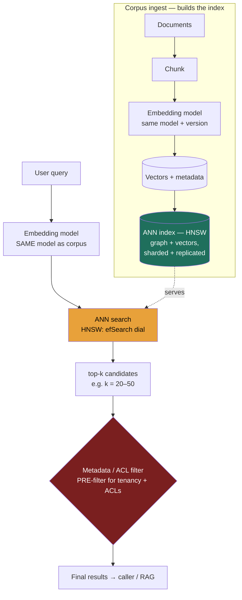

### Learning objectives
- Explain what an **embedding** is — a dense float vector that places *meaning* in space — and why the **same model must embed both corpus and query**, with similarity measured by cosine or dot product.
- Frame the **approximate-nearest-neighbor (ANN)** problem: exact kNN is `O(N·d)` per query — fine at 100k vectors, hopeless at 10M–1B — so you trade a little **recall** for large speedups.
- Choose an index — **flat / IVF / HNSW / HNSW+PQ** — from the **recall ↔ latency ↔ memory** triangle, not by reflex, and name what each one costs.
- Decide **build-vs-buy**: reuse infra you already run (**pgvector**, **OpenSearch/Elasticsearch kNN**) vs a dedicated vector DB (**Pinecone, Weaviate, Milvus, Qdrant**, or **FAISS** as a library) — and reason about metadata filtering, **hybrid (dense + sparse) search**, freshness, and sharding the index.

### Intuition first
A vector index is a **library where books are shelved by what they mean, not by title**. In a normal library you find a book by its call number — an exact lookup. In *this* library, every book has been placed in a vast room so that books about the same topic sit physically near each other: the cookbook is next to the other cookbooks, the noir thriller next to other noir thrillers, even when none of them share a word in the title.

Now a reader walks in holding a book and says "find me more like *this*." You don't read every spine in the building — that's the slow, exact way. Instead you walk to **where that book would sit** and grab its neighbors off the surrounding shelves. You might miss one perfect match that got shelved slightly off — that's the **recall you give up** — but you found ten great matches in seconds instead of scanning a million spines. That walk-to-the-right-shelf-and-grab-neighbors is **approximate nearest neighbor**, and the way the room is organized (clusters, a graph of shortcuts between shelves, compressed mini-summaries on each spine) is your **index**.

Three more instincts carry the whole lesson. First: the reader's book and the shelved books must have been **measured by the same ruler** — if you placed the corpus with one notion of "meaning" and search with another, you walk to the wrong shelf. Second: organizing the room for fast walks costs **memory and build time** — you can have a fast, accurate room that's expensive, or a cheap room that's slower or sloppier, but **not all three at once**. Third: the reader usually adds a constraint — "more like this, *but only books I'm allowed to check out*" — and **where you apply that filter** (before or after grabbing neighbors) decides whether you come back with ten results or two.

### Deep explanation

**An embedding turns text (or an image, or audio) into a dense vector — a fixed-length list of floats — where geometric closeness means semantic closeness.** A sentence becomes a point in, typically, **384 to 3072 dimensions** (`bge-small` ≈ 384, OpenAI `text-embedding-3-small` = 1536, `-3-large` = 3072). "I can't log in" and "authentication is failing" share no keywords but land **near each other**; "I can't log in" and "the soup is cold" land far apart. The model that produces these vectors is a **separate, cheap component** from the LLM that ultimately answers — an embedding call is roughly **100–1000× cheaper** than a generation call, so embedding millions of documents is a batch job you can afford, and embedding the query at request time adds only single-digit to low-tens of milliseconds.

**Similarity is a number: cosine similarity or dot product.** Cosine measures the **angle** between two vectors (ignoring length); dot product folds in magnitude. For most modern embedding models the vectors are **normalized to unit length**, which makes cosine and dot product rank-equivalent — so the practical choice is usually "whatever the index is configured for." The Director-altitude point isn't the algebra; it's the **invariant**: *the same model, same version, same normalization must embed both the corpus and the query.* Re-embed your corpus with a new model and you **must re-embed every query too** — mixing two embedding spaces silently destroys relevance, and it fails quietly (no error, just bad results), which is exactly the kind of bug that survives to production.

**The core problem is that exact nearest-neighbor search doesn't scale.** Finding the true top-k for a query means comparing it against every vector: `O(N·d)` work. At `N` = 100k and `d` = 768 that's ~77M multiply-adds per query — a few milliseconds, fine. At `N` = 10M it's ~7.7 **billion** per query; at 1B vectors it's flatly impossible to do per request at interactive latency. So at scale we **stop computing the exact answer** and accept an **approximate** one: ANN returns *most* of the true neighbors *most* of the time. The quality knob is **recall@k** — of the true top-k neighbors, what fraction did we return. The whole engineering game is **buying high recall (say 95–98%) at low latency and acceptable memory**, and that is a three-way trade, not a free lunch.

**The trade-off triangle is recall ↔ latency ↔ memory — pick two, and the index type is how you pick.**

- **Flat / brute-force:** no index — compare the query against all `N` vectors and take the top-k. **Recall is 100%** (it *is* the exact answer), it needs **only the raw vectors** in memory, and it's trivial to build (there's nothing to build). The cost is **latency that grows linearly with `N`**. Correct choice **only when `N` is small** — up to ~100k–1M vectors, or as the ground-truth baseline you measure other indexes' recall against. Rejected at scale because per-query latency becomes seconds.
- **IVF (inverted file / cluster-and-probe):** k-means the corpus into `nlist` clusters (centroids) once; at query time find the nearest few centroids and **search only those** — `nprobe` of them. You've turned "scan a million" into "scan the handful of clusters near me." **`nprobe` is the recall–latency dial**: probe more clusters → higher recall, more work. Cost: a **training step** (k-means over a sample), and recall suffers for queries that fall **near a cluster boundary** (the true neighbor sits in an unprobed cluster). Good for very large corpora where memory matters and you'll **almost always pair it with PQ**.
- **HNSW (Hierarchical Navigable Small World graph):** build a **multi-layer graph** where each vector links to its nearest neighbors, with sparse "express lanes" on upper layers; search greedily hops along edges toward the query, descending layers. This is **the default for most production vector search** — it delivers **excellent recall (97%+) at single-digit-to-tens-of-ms latency** without a training step. The cost is **memory** (you store the graph edges *on top of* the raw vectors — roughly **1.5–2× the raw vector size**) and a **non-trivial build/insert cost** (inserting a vector means doing a search to find its neighbors). Rejected when memory is the binding constraint and the corpus is huge — that's where you quantize.
- **HNSW + PQ (or scalar quantization):** **Product Quantization** compresses each vector by splitting it into sub-vectors and replacing each with the ID of its nearest centroid from a small learned codebook — a 768-dim float32 vector (3072 bytes) can shrink to **~96–192 bytes, a 16–32× reduction**. **Scalar quantization** is the simpler cousin: store each dimension as int8 instead of float32 (a flat **4× reduction**, ~1% recall loss, far less tuning). You pay a **small recall loss** (PQ approximates distances from the compressed codes) and a **codebook training step**, in exchange for **fitting an index in a fraction of the RAM**. The combo — HNSW for the graph, PQ for compressed vectors — is the standard recipe for **billion-scale** indexes.

There is **no universally best index.** The signal is the match: small corpus or need-exact → flat; huge + memory-bound → IVF+PQ; the common middle (millions of vectors, want great recall and low latency, can afford the RAM) → **HNSW**; billion-scale where HNSW's memory won't fit → **HNSW+PQ** and accept the recall hit.

**Metadata filtering is where naive designs quietly break.** Real queries are almost never "nearest neighbors, full stop" — they're "nearest neighbors **that I'm allowed to see / in this tenant / from the last 30 days**." Two ways to combine the filter with the ANN search, and the difference matters:

- **Post-filter:** run ANN for top-k, *then* drop the rows that fail the filter. Simple, but if the filter is selective it **decimates your results** — ask for top-10, get 10 neighbors, 8 fail the ACL check, you return **2**. You can't fix this by fetching more without guessing how much more.
- **Pre-filter:** restrict the candidate set to filter-passing vectors *before / during* the graph or cluster walk. Returns a full top-k that honors the filter, but it's **harder to implement efficiently** — a very selective filter can leave the HNSW graph too sparse to navigate, so engines fall back to brute-forcing the filtered subset.

Mature engines (Qdrant, Weaviate, Milvus, OpenSearch, pgvector with the right setup) do **filtered ANN** that integrates the predicate into the search. The Director call: **ACLs and tenancy are pre-filter requirements, not post-filter conveniences** — getting this wrong is both a relevance bug and a **security bug** (returning documents a user shouldn't see, or leaking across tenants).

**Hybrid search — dense + sparse, fused — beats either alone.** Dense embeddings capture **meaning** but are weak on **exact tokens**: a product SKU, an error code, a rare proper noun, a specific function name. **Sparse retrieval (BM25 / keyword)** nails those exact-match cases but is blind to synonyms and paraphrase. So you run **both** — dense ANN *and* BM25 — and **fuse the two ranked lists**, most commonly with **Reciprocal Rank Fusion (RRF)**, which combines by rank position and needs no score calibration between the two systems. Hybrid reliably outperforms pure-vector on real corpora, especially anything with **identifiers, code, or domain jargon**. Rejected alternative: pure dense, which embarrassingly fails to find a document by its exact error code; pure sparse, which misses the paraphrased question entirely.

**Freshness and scale: an index is not write-once.** New documents arrive; you **incrementally insert** — cheap-ish for HNSW (a search-and-link per vector), a re-cluster decision for IVF. Over time, deletes and drift degrade an IVF index's clustering, so you **periodically rebuild** — a background, full-reindex job whose cost (CPU-hours, and a swap-in of the new index) you must budget for. To go past one machine's RAM you **shard the index** — partition vectors across nodes (commonly by hashing the doc ID; see **consistent hashing** to bound remap when you add a shard), **fan the query out to all shards**, and merge the top-k. You **replicate each shard** for availability and read throughput. The scale story: 10M vectors fits on one beefy node; **100M–1B means sharded, replicated, and almost certainly quantized**, with a rebuild pipeline you own and monitor.

Go deeper — index internals and tuning knobs (IC depth, optional)

- **HNSW parameters.** `M` = max edges per node (typical 16–64): higher `M` → better recall, more memory. `efConstruction` (typical 100–400): build-time search width — higher → better graph quality, slower build. `efSearch` (the **runtime** recall–latency dial): higher → more candidates explored → higher recall, more latency. You tune `efSearch` per query class against a measured recall target; leave `M`/`efConstruction` near defaults unless memory or build time forces a change.
- **IVF parameters.** `nlist` ≈ `√N` is a common starting heuristic (e.g. ~3000–4000 centroids for 10M vectors). `nprobe` is the runtime recall dial. IVF needs a **training pass** (k-means over a sample, often 1–10% of the corpus).
- **PQ mechanics.** Split a `d`-dim vector into `m` sub-vectors; quantize each to one of `2^nbits` centroids (usually `nbits`=8 → 256 codes, **1 byte per sub-vector**). 768 dims with `m`=96 → 96 bytes/vector vs 3072 raw. Distance is estimated from precomputed code-to-query tables (asymmetric distance computation). **OPQ** rotates the space first for better codebooks.
- **Disk-based ANN.** **DiskANN** keeps compressed vectors in RAM and full vectors on SSD, fetching only candidates — billion-scale on a single node at the cost of SSD read latency. The memory-vs-latency trade made explicit.
- **GPU.** FAISS GPU indexes brute-force or IVF at extreme throughput for batch/offline workloads; rarely the answer for low-QPS online serving where HNSW on CPU is simpler.

### Diagram: query path and corpus ingest

### Worked example: sizing an index for 10M document chunks

A support-knowledge search over **10M chunks**, embedded at **768 dimensions** (float32, 4 bytes each), with a **per-tenant ACL filter**, targeting **recall ~95–98%** and **p99 single-digit-to-tens of ms**.

- **Raw vector footprint:** `10M × 768 × 4 bytes` ≈ **30 GB** of raw float vectors. That alone rules out "just keep it in one small box's RAM" casually but fits a single memory-optimized node.
- **Pick the index → HNSW.** 10M is squarely in HNSW's sweet spot: 97%+ recall at tens-of-ms latency, no training step. **Memory cost:** the graph edges add **~1.5–2×** on top of raw, so budget **~45–60 GB** resident. Rejected: **flat**, because brute-forcing 10M × 768 per query is hundreds of ms — too slow at interactive QPS; **IVF without PQ**, because it'd trade recall at cluster boundaries for a memory win we don't need yet at 30 GB.
- **If memory is tight → HNSW + scalar quantization (int8)** cuts the vector store ~4× (30 GB → ~7.5 GB) for ~1% recall loss and almost no tuning; **PQ** would cut it 16–32× (to ~1–2 GB) but costs more recall and a codebook to train — reach for PQ only at **100M–1B**, not here.
- **Filtering → pre-filter on `tenant_id` (and recency).** ACLs are a correctness *and* security requirement; post-filtering top-k would return 2 results when a tenant owns a sliver of the corpus. Use the engine's **filtered ANN**.
- **Hybrid → add BM25, fuse with RRF.** Support docs are full of error codes and product names; dense alone will miss "ERR_5031" by exact match. Hybrid recovers those.
- **Scale & freshness:** at 10M, **one primary + one replica** for availability and read throughput; new articles **incrementally inserted**; a **nightly/weekly rebuild** budgeted as a background job. Crossing ~100M would force **sharding** (hash on chunk ID, consistent-hashing ring to bound remap), fan-out + merge, and **PQ** to fit.

Every number falls out of the **requirements**: dimensions and count set memory (E), the recall/latency target picks the index, the ACL requirement forces pre-filtering — which is why you pin those down before choosing a store.

### Trade-offs table: ANN index types (and store choice)

| Dimension | **Flat / brute-force** | **IVF (cluster + probe)** | **HNSW (graph)** | **HNSW + PQ** |
|---|---|---|---|---|
| Recall | 100% (exact) | tunable via `nprobe`, lossy at boundaries | very high (97%+) | high, **small loss** from compression |
| Latency | **grows with `N`** (slow at scale) | fast (probe few clusters) | **fast** (single-digit–tens of ms) | fast |
| Memory | raw vectors only | raw + centroids | **raw + graph (~1.5–2×)** | **compressed (4–32× smaller)** |
| Build cost | none | k-means training pass | non-trivial (search per insert) | training + graph build |
| **Use when…** | `N` ≤ ~100k–1M, or as the recall ground truth | huge corpus, memory-bound (pair with PQ) | **the default**: millions of vectors, want recall + low latency, RAM affordable | **billion-scale**, memory is the binding constraint |

| Store choice | **pgvector / OpenSearch · ES kNN** | **Dedicated VDB (Pinecone, Weaviate, Milvus, Qdrant; FAISS = library)** |
|---|---|---|
| Why | **reuse infra you already run** — one fewer system, transactional joins with your relational data (pgvector), or hybrid + BM25 already built in (OpenSearch) | purpose-built ANN: better filtered-ANN, billion-scale sharding, managed ops, newer index features first |
| Cost | tuning ANN params on a general engine; pgvector historically weaker at very large `N` / high QPS (improving fast as of 2026) | **another system to run/pay for**; data sync from your source of truth; vendor lock-in (managed) |
| **Use when…** | corpus ≤ low tens of millions, you already operate Postgres/OpenSearch, want fewer moving parts | **100M+ vectors, high QPS, advanced filtering**, or you want the ops handed off — and the bar clearly exceeds what your existing store gives you |

### What interviewers probe here
- **"Exact or approximate — and what recall can you give up?"** — *Strong signal:* states that exact kNN is `O(N·d)` and infeasible past ~10M, names a **recall target (e.g. 95–98%)** tied to the use case, and treats recall as a *budget* traded against latency/memory. *Red flag:* "we'll just do nearest neighbors" with no notion of approximation or the cost of exactness.
- **"This grows from 10M to 1B vectors — what changes?"** — *Strong:* shifts from single-node HNSW to **sharded + replicated**, adds **PQ** because the raw vectors no longer fit RAM, names the **fan-out/merge** query path and the **rebuild** pipeline, references consistent hashing for shard placement. *Red flag:* "scale the vector DB" with no mention of memory, sharding, or quantization.
- **"Why hybrid instead of pure vector search?"** — *Strong:* dense embeddings miss **exact tokens** (IDs, error codes, rare terms); BM25 catches them; **fuse with RRF**; hybrid beats either alone on real corpora. *Red flag:* assumes embeddings handle everything and can't name a case where keyword wins.
- **"Where does the ACL / tenancy filter go?"** — *Strong:* **pre-filter** (filtered ANN), explains that post-filtering top-k silently returns too few results and that ACLs are a **security** requirement, not just relevance. *Red flag:* "filter the results afterward" with no awareness that it breaks top-k.

The through-line at Director altitude: **don't reach for a new vector database by reflex.** Name the recall/latency/memory budget, pick the index from it, prefer infra you already run (pgvector / OpenSearch kNN) until the bar clearly exceeds it, and **delegate the parameter tuning with a stated prior** — "I'd have the search team tune `efSearch` against a 97% recall@10 target on our eval set; my prior is HNSW on a memory-optimized node, scalar-quantized if RAM gets tight — and we revisit PQ + sharding only past ~100M vectors."

### Common mistakes / misconceptions
- **Mixing embedding models** — embedding the corpus with one model/version and the query with another (or re-embedding the corpus without re-embedding queries). It fails **silently** with degraded relevance, no error.
- **Defaulting to exact kNN at scale** — brute-forcing millions of vectors per query because "it's more accurate," when 97% recall at a fraction of the latency is what the product actually needs.
- **Post-filtering ACLs / tenancy** — running ANN then dropping disallowed rows, which collapses top-k and can leak data; ACLs must be **pre-filter** requirements.
- **Pure vector search for everything** — losing exact-match on IDs, error codes, and rare terms; the fix is **hybrid (dense + BM25, RRF)**, not a bigger embedding model.
- **Treating the index as static** — ignoring incremental inserts, rebuild cost, and the memory blow-up (HNSW graph overhead, then sharding + PQ) as the corpus grows.

### Practice questions

**Q1.** You have 50M document chunks at 1536 dimensions and need recall@10 ≥ 95% at p99 under 30 ms. Size the memory and pick an index, naming what you reject.
> *Model:* Raw vectors = `50M × 1536 × 4 bytes` ≈ **307 GB** float32 — too large for a single commodity node's RAM. Pick **HNSW** for the recall/latency target, but the graph overhead (~1.5–2×) pushes resident memory toward **~450–600 GB**, so either **shard across nodes** (fan-out + merge) or **quantize**: **scalar (int8)** cuts to ~77 GB for ~1% recall loss, **PQ** cuts to ~10–20 GB for a larger but tunable recall loss — likely **HNSW + scalar quantization, sharded** to hit both the memory and latency budgets. **Rejected:** flat (307 GB scan per query is far over 30 ms); IVF without quantization (saves little memory and trades recall at cluster boundaries we don't need to give up). Verify the final choice against a **measured recall@10** on a held-out eval set, not by assumption.

**Q2.** A teammate wants to add Pinecone. You already run Postgres and have 8M vectors with a strict per-tenant ACL. What do you decide and why?
> *Model:* At **8M vectors** with existing Postgres, **start with pgvector + HNSW** — it's within range (raw ~25 GB at 768d), keeps the embeddings **transactionally consistent and joinable** with the relational data, and is **one fewer system to run, sync, and pay for**. The ACL is a **pre-filter** requirement: ensure pgvector does **filtered ANN on `tenant_id`** (and that the filter is indexed), because post-filtering would return too few rows and risk cross-tenant leakage. **Reject the dedicated VDB *for now*** — its wins (billion-scale sharding, advanced filtered ANN, managed ops) don't clear the bar at 8M, and it adds a sync pipeline and lock-in. **Revisit** if we cross ~50–100M, need very high QPS, or hit pgvector's filtered-ANN limits — and decide on **measured** recall/latency, not vendor marketing.

**Q3.** Users complain that searching for the exact error code "ERR_5031" returns irrelevant results, even though a doc with that code exists. Diagnose and fix.
> *Model:* This is the classic **dense-only failure**: the embedding maps "ERR_5031" into a semantic neighborhood near other error-ish text, but it doesn't do **exact token match**, so the document containing the literal code may rank below paraphrased-but-codeless docs. The fix is **hybrid search**: run **BM25 / keyword retrieval** alongside dense ANN and **fuse with RRF** — BM25 surfaces the exact-token document, dense covers the paraphrase cases, fusion gives the best of both. A bigger embedding model wouldn't reliably fix it; the failure is structural (semantics ≠ exact tokens), and **hybrid beats pure dense on identifier-heavy corpora**.

**Q4.** Explain the recall–latency–memory triangle to a skeptical architect using two concrete index choices.
> *Model:* You can optimize any **two** of recall, latency, and memory, not all three. **HNSW** buys **high recall + low latency** by spending **memory** — it stores a navigable graph on top of the raw vectors (~1.5–2× overhead), so it's the default until RAM becomes the binding constraint. **HNSW + PQ** buys **low memory + low latency** by spending **recall** — Product Quantization compresses vectors 16–32×, fitting a billion-scale index in a fraction of the RAM, at a measured recall loss. **Flat** buys **perfect recall + low memory** but pays in **latency** that grows with `N`. So the architect's real question isn't "which is best" — it's "**what's our budget on each axis**," and we pick the index that spends down the axis we can most afford (here, memory at small scale, recall at billion scale), then verify recall against ground truth.

### Key takeaways
- **An embedding is meaning as geometry:** a dense float vector (≈384–3072 dims), similarity via cosine/dot product, produced by a cheap **separate** model — and the **same model/version must embed corpus *and* query**, or relevance silently breaks.
- **Exact kNN is `O(N·d)` and dies past ~10M vectors;** ANN trades a little **recall** (target ~95–98%) for big speedups. Recall@k is the quality budget you're spending.
- **The trade is recall ↔ latency ↔ memory — pick two, and the index is how you pick:** flat (exact, slow, small), IVF (cluster+probe, memory-friendly), **HNSW (the default — great recall+latency, costs memory)**, **HNSW+PQ** (compress for billion-scale, small recall loss).
- **Don't add a vector DB by reflex** — **pgvector / OpenSearch kNN** may clear the bar if you already run them; reach for a dedicated VDB at 100M+, high QPS, or advanced filtering. **ACL/tenancy filters go pre-filter**, and **hybrid (dense + BM25, RRF)** beats pure vector on IDs and rare terms.
- **An index isn't write-once:** budget incremental inserts, periodic **rebuilds**, and at 100M–1B vectors **shard** (consistent hashing) **+ replicate + quantize**, with a query fan-out/merge path.

> **Spaced-repetition recap:** Embeddings = meaning as points in space; same model for corpus and query, or it breaks silently. Exact kNN is `O(N·d)` and too slow at scale → ANN trades recall (95–98%) for speed. The triangle is recall ↔ latency ↔ memory — flat (exact/slow), IVF (clusters), **HNSW (default, costs RAM)**, +**PQ** (compress for billions, small recall loss). Reuse pgvector/OpenSearch before buying a vector DB; **pre-filter** ACLs; go **hybrid** (dense + BM25 via RRF) for exact tokens. Feeds RAG and enterprise RAG; shard the index with consistent hashing.
