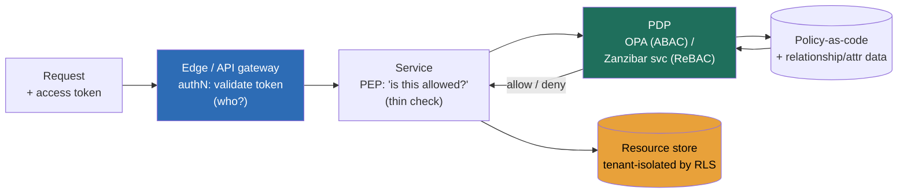

### Learning objectives
- State the **authentication ↔ authorization divide** as the foundational split: authentication answers *"who is this caller?"* once, at the edge; authorization answers *"may this caller do this action on this resource?"* on every request, near the resource, and conflating the two is the most common and most expensive identity mistake in a design review.
- Make the **session-vs-token decision** with its real cost named: a server-side session is **instantly revocable** but stateful; a self-contained **JWT/bearer token cannot be revoked before it expires**, so you buy statelessness by accepting a **revocation-latency gap** and pay it down with short TTLs plus refresh tokens.
- Choose among **RBAC, ABAC, and ReBAC** by the shape of the access question, and know that resource-level sharing ("user U shared doc D with user V") breaks RBAC and pushes you to relationship-based authorization (Google Zanzibar's *"can U do A on R?"* model).
- Treat **multi-tenant isolation as a property you build into the architecture**, not a `WHERE tenant_id = ?` clause one forgotten join can defeat, and price the cost-per-tenant of shared-table vs schema-per-tenant vs database-per-tenant.
- Name the **service-to-service identity** decision (short-lived mTLS certs / SPIFFE workload identity vs long-lived shared API keys) and the failure mode it engineers around: a leaked static credential nobody can rotate.

### Intuition first
Authentication is the **passport check at the airport**, authorization is the **gate agent reading your boarding pass**. The passport check happens once, at the border: it establishes *who you are* with a trusted document, and it does not care where you are flying. The gate agent does the opposite job on every gate you approach: she does not re-verify your identity, she checks whether *this* boarding pass entitles *you* to board *this* flight, in *this* seat, *right now*. Two different officers, two different questions, two different places in the building. A system that runs the passport check at every gate is slow and pointless; a system that lets the gate agent wave anyone with any passport onto any flight has no security at all. Almost every "design auth" failure is really a failure to keep these two officers separate.

The two officers also fail differently, and the design has to respect that. **The passport is a token you carry**, and once it is stamped and in your pocket, the airport cannot un-stamp it from a distance: if your passport is revoked mid-trip, the only safe fix is to make passports expire fast and force a re-check at the next border, which is exactly the short-lived-token-plus-refresh trade. **The boarding pass is checked against a list the airline controls**, so the airline can change who may board between the moment you printed the pass and the moment you reach the gate, which is exactly why server-side sessions revoke instantly and self-contained tokens do not. Hold those two pictures and the rest of this lesson is detail.

### Deep explanation

**Authentication and authorization are different problems solved in different places, and that sentence governs the whole design.** Authentication (authN) establishes identity, it happens at the **edge / identity provider**, ideally once per session, and produces a verifiable assertion of *who*. Authorization (authZ) establishes permission, it happens **on every request, close to the resource**, and answers *what this identity may do*. The Director-altitude statement: *authN is a perimeter concern you centralize and standardize; authZ is a per-request decision you must make consistently across every service, and the two have opposite frequencies, blast radii, and storage models.* You **reject** "we check the password in each service" because it scatters the most security-critical code across every team and guarantees inconsistency; you **reject** "we authenticate once and trust the caller everywhere after" because that is exactly how one compromised service becomes a company-wide breach. Identity is the new perimeter precisely because the network boundary stopped being one.

**The authentication layer is a solved, standardized problem, and rolling your own is the red flag.** The paved road is **OAuth2 + OIDC**: OAuth2 handles delegated *authorization grants*, OIDC layers *authentication* on top so you get a verifiable identity. The flow a Director should be able to name is **authorization-code with PKCE**, the browser/app redirects to the identity provider, the user authenticates there, the provider returns a short-lived *code*, and the app exchanges that code (plus a PKCE verifier that stops a stolen code from being replayed) for tokens. Three tokens come back and they are not interchangeable: an **ID token** (an OIDC assertion of *who the user is*, for the client to consume), an **access token** (a bearer credential the API checks, typically a JWT, TTL ~5–15 min), and a **refresh token** (long-lived, ~days to weeks, stored securely, used only to mint new access tokens). **SSO** is the same machinery pointed at one identity provider for many apps, via OIDC for modern apps or **SAML** for enterprise/legacy ones, so an employee authenticates once to Okta/Entra ID and every app trusts the assertion. The decision here is not "which crypto", it is "which managed identity provider", and the rejected alternative, build-your-own SSO and password store, is rejected because you will get token validation, replay protection, or password hashing subtly wrong and own a breach you could have bought your way out of for a few dollars per user per month.

**The load-bearing token decision is session vs JWT, and its whole weight is revocation.** A **server-side session** is a random opaque ID in a cookie that points at session state in a store (Redis, a database); every request looks the session up, so the server can **delete the row and the user is logged out in milliseconds**, instant, global revocation. The cost is statefulness: a lookup on every request and a session store you must scale and replicate. A **JWT (or any self-contained bearer token)** carries its claims and a signature inside itself, so any service validates it with the signing key and **no central lookup**, which is what makes it attractive at scale and across services. The unavoidable consequence: **a JWT cannot be revoked before it expires**, because nothing is consulted that you could change. If a token is stolen, or a user is fired, or a permission is dropped, the token keeps working until its TTL runs out. The standard answer is **short-lived access tokens (~5–15 min) plus refresh tokens**, the access token's blast radius is bounded to its TTL, and revocation happens at refresh time by refusing to issue a new access token. The number you must say out loud is the **revocation-latency gap**: with a 15-minute access TTL, a fired employee or a stolen token stays live for up to 15 minutes, and you decide whether that window is acceptable or whether you need a hybrid (short JWT + a denylist of revoked token IDs checked on sensitive actions, which trades a little statelessness back for tighter revocation).

**Authorization models come in three shapes, and you pick by the question the product actually asks.** **RBAC (role-based)** assigns permissions to roles and roles to users, *"admins can delete users."* It is simple, auditable, and the right default when access is org-shaped (a user is an admin or a viewer). It breaks the moment access is **resource-shaped**: it cannot natively express "Alice can edit *this one* document because Bob shared it with her", you end up minting a role per resource and the role table explodes. **ABAC (attribute-based)** decides from attributes of the user, resource, action, and context, *"allow if user.dept == resource.dept and time is business hours and request.region == 'EU'."* It is expressive and handles context (region, clearance, device posture), but the policy logic gets hard to audit (*"who can actually reach this resource?"* becomes a query over rules, not a lookup) and performance depends on having the attributes at decision time. **ReBAC (relationship-based)**, the Google **Zanzibar** model behind Drive/YouTube/Calendar sharing, stores relationships as tuples (`doc:42#editor@user:alice`, `group:eng#member@user:bob`) and answers exactly one question: ***"can user U do action A on resource R?"*** by walking the relationship graph. It is what you reach for when sharing, nesting, and inheritance are the core of the product (docs, folders, repos, orgs), and the rejected-alternative critique of ABAC for those cases is "ABAC can express it but can't answer *reverse* questions like 'who has access to this doc?' efficiently, while a Zanzibar-style tuple store is built to."

**Authorization logic belongs in one place behind a clean split, not copy-pasted into every service.** The pattern is **PDP/PEP**: each service has a **Policy Enforcement Point** (a thin check at the request boundary, "is this allowed?") that calls a **Policy Decision Point** (the brain that evaluates the policy against the request and the relevant data and returns allow/deny). The PDP is driven by **policy-as-code**, **OPA / Rego** for ABAC-style rules, a **Zanzibar-style service** (OpenFGA, SpiceDB) for ReBAC, so the policy is versioned, tested, and reviewed like any other code, and changing "who can do X" is a policy edit, not a deploy across forty services. You **reject** "each team writes its own authorization checks inline" because it guarantees drift (forty subtly different definitions of "admin"), makes audit impossible (there is no one place that says what the rules are), and turns every policy change into a fleet-wide code change. The PDP latency is a real cost, an out-of-process check adds 1–5 ms, so the standard move is to **co-locate the PDP** (OPA as a sidecar, the authorization service replicated regionally) and cache decisions briefly, which buys back the latency without re-scattering the logic.

**Multi-tenant isolation must be true by construction, because the failure is a cross-tenant data leak and it is unforgivable.** Three models, increasing isolation and cost: **shared table + row-level (one schema, every row tagged `tenant_id`)** is the cheapest per tenant (one schema, near-zero marginal cost, tens of thousands of tenants on one database) but every query must filter by tenant and **one forgotten `WHERE tenant_id = ?` leaks another customer's data**, so the right enforcement is **database-level Row-Level Security (RLS)** or a tenant-scoped connection/middleware that makes the filter impossible to forget, not app-code discipline. **Schema-per-tenant** gives stronger isolation and easier per-tenant backup/restore at the cost of schema sprawl (thousands of schemas strain the catalog). **Database-per-tenant** gives the hardest isolation and per-tenant scaling and blast-radius containment, the model for regulated or large enterprise tenants, at the highest per-tenant cost (now you operate thousands of databases). The two failure modes a Director names: the **cross-tenant leak** (isolation enforced only in app code, defeated by one bad query) and the **noisy neighbor** (one tenant's heavy load starving others on shared infrastructure, the reason big tenants often get dedicated databases). The Director move is to **isolate by construction** (RLS, or physical separation for the tenants whose data warrants it) and to say plainly that "the application puts `tenant_id` in the `WHERE` clause" is *not* isolation, it is a hope.

**Service-to-service identity is the same problem one layer down, and static API keys are the trap.** Inside the system, services call services, and they need to prove *who they are* to each other. The weak default is a **long-lived shared API key or password** baked into config, it leaks (into logs, into a git repo, into a breached service), it rarely rotates (rotation means a coordinated redeploy nobody wants to do), and it grants standing access until someone notices. The paved-road answer is **workload identity with short-lived credentials**: **mTLS** (both sides present certificates, so identity is mutual and cryptographic, typically run by a service mesh like Istio/Linkerd that issues and rotates certs automatically) and **SPIFFE/SPIRE**, which gives each workload a verifiable identity (a SPIFFE ID) and **short-lived, auto-rotated certificates** (TTLs measured in hours, sometimes an hour or less). The trade is operational complexity, you now run a mesh or an identity issuer and a certificate authority, against the payoff that a leaked credential is worthless within an hour and rotation is automatic rather than a dreaded change. The rejected alternative, long-lived shared secrets, is rejected because its blast radius is "until a human notices and coordinates a rotation", which in practice is weeks, and its leak is silent.

Go deeper — the JWT, the Zanzibar tuple, and the revocation hybrid (IC depth, optional)

- **JWT anatomy and size.** A JWT is three base64url segments, `header.payload.signature`. The header names the algorithm (prefer asymmetric **RS256/ES256** so resource services verify with a public key and never hold the signing secret; reject symmetric **HS256** across trust boundaries because every verifier then also holds the key that can mint tokens). The payload carries standard claims: `sub` (subject), `iss` (issuer), `aud` (audience), `exp` (expiry), `iat` (issued-at), plus custom claims (roles, tenant). Keep payloads lean: tokens travel in an `Authorization: Bearer` header on every request, so a bloated 4–8 KB token (stuffing permissions in) adds bytes to every call and can blow past header size limits, the reason you carry an identifier and resolve permissions server-side rather than embedding a giant ACL.
- **Validation steps a verifier must do** (getting any wrong is a CVE): verify the signature against the issuer's published key (JWKS endpoint, key-rotation aware via `kid`); check `exp`/`nbf` for time validity; check `iss` and `aud` match expected values; and pin the algorithm so an attacker can't downgrade to `alg: none` or swap RS256→HS256 using the public key as an HMAC secret.
- **Zanzibar tuples and the "check" path.** Relationships are stored as tuples `⟨object#relation@subject⟩`, e.g. `doc:42#viewer@group:eng#member` (everyone in the eng group is a viewer of doc 42). A `Check(user:alice, edit, doc:42)` walks: is `alice` a direct `editor` of `doc:42`? If not, is she an `editor` via a group membership or a parent folder's inherited permission? The graph walk is bounded and cached, and Zanzibar's "zookie" (a consistency token) lets the system trade a little staleness for performance while still preventing the "new-enemy" problem (you revoke access, then the content changes, and a stale cache must not let the old viewer see the new content).
- **The revocation hybrid in practice.** Short-lived JWT (5–15 min) for the common path, plus a small **denylist of revoked token/session IDs** in a fast store (Redis), checked only on high-value actions (payments, admin operations, "delete account"). This keeps 99% of requests stateless and full-speed while closing the revocation gap on the operations where 15 minutes of exposure is unacceptable. The cost is a Redis lookup on the sensitive subset, a deliberate, scoped re-introduction of state.

### Diagram: the authorization decision path (PEP → PDP)

### Worked example: authorization for a multi-tenant B2B SaaS (a Notion-style workspace product)
A B2B SaaS sells workspaces to companies. Each customer is a **tenant**; inside a tenant, users belong to teams, create documents, and **share individual documents with specific people**. One product, and the whole identity stack shows up in serving it.

- **AuthN.** Users sign in via **OIDC** to a managed identity provider (Auth0/Okta/Entra), enterprise customers connect their own SSO (SAML/OIDC) so their employees authenticate against their corporate directory. *Rejected: a homegrown password store*, because the first enterprise deal will demand SSO and SCIM provisioning you would then have to build, and a self-built password store is a breach waiting to happen.
- **AuthZ, v1: RBAC.** Roles `owner / admin / member / viewer` per workspace. This covers org-shaped access cleanly and is fully auditable. It works until the product ships **per-document sharing**, where RBAC dies: "Alice can edit doc 42 because Bob shared it" is not a role, and minting a role per document explodes the model.
- **AuthZ, v2: ReBAC for resources, RBAC for the org.** Keep RBAC for workspace-level roles; introduce a **Zanzibar-style relationship store** (OpenFGA/SpiceDB) for resource access: tuples like `doc:42#editor@user:alice`, `folder:design#viewer@team:eng#member`. Every access is a single **`Check(user, action, resource)`** call, served in a few milliseconds and cached. The reject line: *ABAC could express the rules*, but answering "who can see doc 42?" (needed for the sharing UI and for audits) is a reverse query ReBAC is built for and ABAC is not.
- **Tenant isolation by construction.** Every row carries `tenant_id`, and isolation is enforced by **Postgres Row-Level Security**, a policy on each table so a query **physically cannot** return another tenant's rows even if a developer forgets the filter. *Rejected: relying on the application's `WHERE tenant_id = ?`*, because one forgotten join across hundreds of endpoints is a cross-tenant leak, and that is a company-ending incident. The largest enterprise tenants who demand it get a **dedicated database** (database-per-tenant) for hard isolation and noisy-neighbor protection, at higher per-tenant cost the contract pays for.
- **Tokens.** Access tokens are JWTs with a **10-minute TTL**, refresh tokens last 7 days; logout and "remove user" revoke the refresh token (no new access tokens issued), and the worst-case exposure is the 10-minute access-token window, acceptable for this product. Admin actions (billing, deleting the workspace) additionally check a **revocation denylist** so a fired admin loses those rights immediately.

The number a Director brings out of this is not "we added auth"; it is *"identity is federated to the customer's IdP, every access is a `Check(U, A, R)` against a relationship store, tenants are isolated by RLS (not by a hopeful WHERE clause), and the revocation window is 10 minutes, with sensitive actions closed to zero."*

### Trade-offs table: session vs JWT, and the three authZ models
| Decision | Server-side session | Self-contained JWT |
|---|---|---|
| **State** | stateful (session store lookup per request) | stateless (verify signature, no lookup) |
| **Revocation** | **instant** (delete the row) | **only at expiry** (revocation-latency gap = TTL) |
| **Scale / cross-service** | needs a shared, replicated session store | scales freely; any service verifies with the key |
| **Use when…** | revocation must be immediate; monolith or single trust domain | many services / scale; pair short TTL + refresh + denylist for sensitive ops |

| Decision | RBAC | ABAC | ReBAC (Zanzibar) |
|---|---|---|---|
| **Models** | roles → permissions | rules over user/resource/context attributes | relationship tuples ("U is editor of R") |
| **Expressiveness** | org-shaped access | rich, contextual (region, time, clearance) | sharing, nesting, inheritance |
| **Audit / "who can access R?"** | easy | hard (rules query) | easy (reverse graph query) |
| **Use when…** | simple, org-structured roles (default) | context-dependent policy, compliance attributes | resource-level sharing is the product (docs, repos, folders) |

The Director move is to **match the model to the shape of the access question** (org-shaped → RBAC, context-shaped → ABAC, sharing-shaped → ReBAC), and to keep authZ behind a centralized **PDP** so the choice is one policy decision, not forty inline implementations.

### What interviewers probe here
- **"Design authentication and authorization for a multi-tenant product."**, *Strong signal:* separates authN (federate to an identity provider via OIDC/SAML, never roll your own) from authZ (a per-request `Check(U, A, R)` behind a centralized PDP), picks the authZ model from the access shape, and enforces tenant isolation by construction (RLS or physical separation). *Red flag:* one tangled "auth service" that mixes login and permission checks, long-lived JWTs, and tenant isolation that is just an application `WHERE` clause.
- **"You issue JWTs. A user is fired, or a token is stolen, mid-session. Now what?"**, *Strong:* names the revocation-latency gap out loud, bounds it with a short access TTL (~5–15 min) + refresh tokens revoked at the IdP, and adds a denylist check on sensitive actions so high-value operations revoke to zero. *Red flag:* "we'll revoke the JWT", which is impossible for a self-contained token, betraying a misunderstanding of why short TTLs exist at all.
- **"Where does authorization logic live, and how do you change a permission rule across 40 services?"**, *Strong:* a PDP/PEP split with policy-as-code (OPA for ABAC, a Zanzibar service for ReBAC) so a rule change is a versioned policy edit, not a fleet redeploy, and names the co-located-PDP move to keep the per-request latency at 1–5 ms. *Red flag:* authorization copy-pasted into each service, which guarantees drift and makes "who can do X?" unanswerable.
- **"How do your services prove identity to each other?"**, *Strong:* short-lived workload identity (mTLS via a mesh, SPIFFE/SPIRE), auto-rotated certs with hour-scale TTLs, so a leaked credential dies fast and rotation is automatic. *Red flag:* a long-lived shared API key in config, with no rotation story and a leak blast radius of "until someone notices."

The through-line at Director altitude: own the **posture** (authN federated and standardized, authZ centralized and policy-as-code, isolation by construction, short-lived everything), name every control's cost (latency, friction, the revocation window), and delegate the depth with a prior, "I'd have the security team bake off OpenFGA vs SpiceDB on our sharing-graph depth and check-latency profile; my prior is a Zanzibar-style store because per-document sharing is core to the product and ABAC can't answer the reverse 'who has access' query we need for the UI and audits."

### Common mistakes / misconceptions
- **Assuming a JWT can be revoked.** A self-contained token is valid until it expires because nothing is consulted that you could change; you bound exposure with short TTLs + refresh, not by "revoking the token."
- **Confusing authentication with authorization.** "We log them in and then they can do things" collapses two different questions in two different places; a valid identity is not a permission, and every request still needs an authZ decision.
- **Scattering authZ logic across services.** Inline per-service checks drift into forty incompatible definitions of "admin" and make audit and rule changes impossible; centralize behind a PDP.
- **Tenant isolation by an app-layer `WHERE` clause only.** One forgotten filter is a cross-tenant leak; isolation must be enforced below the app (RLS or physical separation) so it is true by construction.
- **Rolling your own crypto, SSO, or password store.** Token validation, replay protection, and password hashing have a dozen subtle CVEs each; use a managed identity provider and standard libraries, and spend the saved effort on posture.

### Practice questions

**Q1.** A team proposes putting all of a user's permissions inside a long-lived JWT (24-hour TTL) so services never have to look anything up. Critique it.
> *Model:* Two problems, both serious. First, **revocation**: a 24-hour self-contained token cannot be withdrawn, so a fired employee, a stolen token, or a downgraded permission stays live for up to a day, which is unacceptable for anything sensitive. The fix is short access TTLs (~10 min) + refresh tokens revoked at the IdP, plus a denylist check on high-value actions. Second, **staleness and size**: baking the full permission set into the token means a permission change doesn't take effect until the token refreshes, and the payload bloats every request's header. I'd carry identity + a few coarse claims in the token and resolve fine-grained permissions server-side via a centralized `Check(U, A, R)`. Net: short-lived token for *who*, a PDP for *what*, revocation bounded to minutes and to zero on sensitive ops.

**Q2.** Your product is adding per-document sharing to a workspace app currently on RBAC. What changes, and what do you reject?
> *Model:* RBAC handles org-shaped access (owner/admin/member/viewer) and stays for workspace roles. But "Alice can edit *this* doc because Bob shared it" is **resource-shaped** and RBAC can't express it without minting a role per document, which explodes. I'd introduce **ReBAC** (a Zanzibar-style store, OpenFGA/SpiceDB) with relationship tuples like `doc:42#editor@user:alice`, and every access becomes a single cached `Check(user, action, resource)` in a few ms. *Rejected: ABAC*, because while it could express the sharing rule, the product needs the reverse query "who can access doc 42?" for the sharing UI and audits, and ABAC answers that by scanning rules while a relationship store answers it by graph lookup. So: RBAC for the org, ReBAC for resources, both behind one PDP.

**Q3.** Estimate the worst-case exposure window for a stolen access token under a 15-minute TTL, and explain how you'd cut it to near zero for admin actions without making every request stateful.
> *Model:* Worst case, the token was stolen the instant it was issued, so exposure is the full **15 minutes** until it expires and the refresh is (now) refused. For 99% of traffic that's an acceptable, deliberately-priced window that keeps requests stateless and fast. To close it on admin/billing/delete actions without re-introducing a lookup everywhere, I add a **revocation denylist** in Redis (revoked token/session IDs) and check it **only on those sensitive endpoints**. That's a single ~1 ms lookup on a small subset of requests, exposure drops to effectively zero on the operations that matter, and the common read path stays stateless. It's a scoped, intentional trade of a little statelessness for tight revocation exactly where 15 minutes is too long.

**Q4.** A reviewer says "we enforce tenant isolation by always adding `WHERE tenant_id = ?` in our queries." Why is that not enough, and what would you do?
> *Model:* It's a hope, not a guarantee. Across hundreds of endpoints and joins, **one forgotten filter** (a new query, a refactor, a sub-select, an ORM that drops the clause) leaks one customer's data to another, which is a company-ending incident. App-code discipline can't be the isolation boundary. I'd enforce it **below the application**: **Postgres Row-Level Security** with a policy per table keyed off a session-set `tenant_id`, so a query *physically cannot* return another tenant's rows even if the filter is forgotten; isolation becomes true by construction. For the largest or regulated tenants who demand it, I'd go to **database-per-tenant** for hard isolation and noisy-neighbor protection, accepting the higher per-tenant operating cost the contract justifies. The principle: isolation enforced by the platform, not by every developer remembering.

### Key takeaways
- **AuthN and authZ are different problems in different places:** authentication establishes *who* once at the edge (federate to an IdP via OIDC/SAML, never roll your own); authorization decides *what* on every request near the resource. Conflating them is the classic, costly mistake.
- **The token decision is session vs JWT, and its weight is revocation:** sessions are stateful but instantly revocable; self-contained JWTs are stateless but **cannot be revoked before expiry**, so you run short access TTLs (~5–15 min) + refresh tokens, and add a denylist for sensitive actions to close the gap.
- **Pick the authZ model from the access shape:** RBAC for org-shaped roles (default), ABAC for context-dependent policy, **ReBAC (Zanzibar, `Check(U, A, R)`)** when resource-level sharing is the product, and keep all of it behind a centralized **PDP/PEP** with policy-as-code, not copy-pasted per service.
- **Multi-tenant isolation must be true by construction:** enforce it below the app (Row-Level Security, or physical database-per-tenant for the tenants that warrant it), because an app-layer `WHERE tenant_id = ?` is one forgotten filter away from a cross-tenant leak.
- **Service-to-service identity uses short-lived workload identity, not static keys:** mTLS and SPIFFE/SPIRE give auto-rotated, hour-scale certificates so a leaked credential dies fast, rejecting long-lived shared API keys whose leak blast radius is "until a human notices."

> **Spaced-repetition recap:** Identity is the new perimeter. **Authentication** = the *passport check* (who, once, at the edge, via OIDC/SAML to a managed IdP, three tokens: ID / access / refresh); **authorization** = the *gate agent* (what, every request, near the resource). The load-bearing call is **session vs JWT**: sessions revoke instantly but are stateful, JWTs are stateless but **can't be revoked before expiry**, so short access TTLs (~5–15 min) + refresh + a denylist for sensitive ops. Pick authZ by shape, **RBAC** (org), **ABAC** (context), **ReBAC**/Zanzibar `Check(U,A,R)` (sharing), all behind a centralized **PDP** with policy-as-code. **Tenant isolation by construction** (RLS or DB-per-tenant), never a hopeful `WHERE`. **Service identity** = short-lived mTLS/SPIFFE certs, not long-lived API keys.

---

*End of Lesson 11.2. Identity is the perimeter: authenticate once at the edge, authorize every request near the resource, choose the token model for its revocation tax, and make tenant isolation true by construction.*
