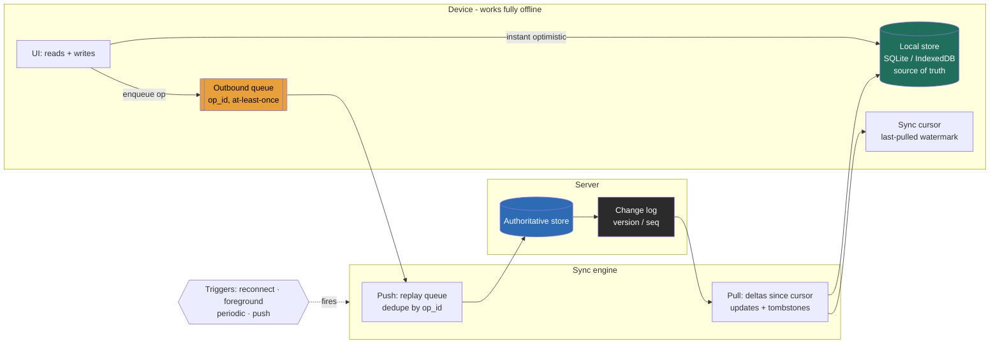

### Learning objectives
- Make the case for **offline-first**: the local store is the UI's source of truth and the network is an enhancement, reads and writes hit local storage instantly (optimistic) while sync runs in the background, and know why the "online-only" client that spinners on every tap is the rejected alternative.
- Choose a **local store** (SQLite/Room/Core Data, IndexedDB, Realm, WatermelonDB) sized as a **working-set replica**, not the whole account, and defend the boundary.
- Build the **sync engine's** four moving parts: change tracking with version markers and **tombstones**, a **sync cursor** for delta (not full) pulls, an **idempotent outbound mutation queue** with client-generated operation IDs, and the triggers that fire a background sync.
- Reason about **partial vs full replication**, the **cold-sync** problem (first login pulling gigabytes), the eventual-consistency UX, and the **battery/data/freshness** trade the sync cadence buys.

### Intuition first
Think of a field biologist on a month-long expedition with no signal. She does not radio headquarters for permission before recording each observation, that would be absurd, and impossible in a canyon. She writes straight into her own waterproof **field notebook**, and in the field that notebook *is* the truth: she reads from it, corrects it, works entirely from it. Headquarters does not exist for her day-to-day work.

That notebook is the **local store**, and writing into it without asking anyone is the **optimistic local write**. When she reaches a ridge with a satellite window, she does not re-transmit the whole notebook. She sends only the pages written **since her last transmission** (a **delta**, tracked by a bookmark, the **sync cursor**), and she is careful to send her **crossed-out** entries too, because a specimen she retracted must be marked struck-through at HQ, not silently missing (a **tombstone**, you cannot communicate a deletion by absence). Pages waiting to go out sit in an **outbox** (the **mutation queue**), each numbered so a page re-sent after a dropped connection is filed once, not twice (an **operation ID**, idempotency). HQ also sends her updates from other researchers, so the sync runs **both ways**. And when two researchers edited the same record while both were dark, a supervisor reconciles the clash later, that reconciliation is **conflict resolution**, its own discipline, deliberately out of scope here.

Every hard part of this lesson is a feature of that expedition: the notebook is the source of truth, the satellite window is scarce and expensive (battery and data), and being days out of contact is normal, not an error.

### Deep explanation

#### 1. The offline-first principle: local is the truth, the network is a bonus
In an **online-only** client, every action is a request: tap save, show a spinner, wait for the server, then update the screen. It works on office wifi and falls apart on a train, in a basement, or on hotel wifi with 5% packet loss. Two failure modes: **latency** (every action pays a 100 to 500 ms round trip even when it succeeds) and **dependency** (no signal means no app, the save button just spins).

**Offline-first inverts it.** Reads and writes target the **local store first** and return immediately (optimistic), the UI renders from local state, and a background **sync engine** reconciles with the server whenever a connection exists. Airplane mode is not an error state, it is just "sync is paused." The rejected alternative, online-only, buys a simpler client (no local DB, no sync engine, the server is the only truth) at the cost of a product that is unusable exactly when users need it and feels slow even on good networks because every tap waits for a round trip.

**Local-first** goes one philosophical step further: the user's data lives on their device and syncs to cloud or peers as an enhancement, so the product keeps working even if the vendor's servers vanish. For interviews, treat offline-first as the architecture and local-first as the ownership stance; both put the local store first. The cost you take on, and must name, is real: you now keep **two copies** of the data plus a sync engine, and you inherit **eventual consistency** and **conflicts**. That complexity is the price of instant, always-available UX.

#### 2. The local store: a working-set replica, not the whole database
The store choices, and what each buys:

- **SQLite** (via Room on Android, GRDB on iOS): the default. One transactional file, handles multi-GB, real SQL and indexes. Buys battle-tested durability and rich queries; costs hand-written schema and migrations.
- **Core Data** (iOS): an object graph over SQLite with change tracking and built-in CloudKit sync. Buys less boilerplate and Apple-native sync; costs Apple-only lock-in.
- **IndexedDB** (web): the browser's async key-value store with indexes, quota often up to ~60% of free disk in Chrome. Buys universal browser support; costs a clunky API (teams wrap it with Dexie) and eviction under storage pressure unless you request persistent storage.
- **Realm** / Atlas Device Sync: a memory-mapped object database with optional turnkey sync. Buys sync you do not build; costs vendor coupling.
- **WatermelonDB**: a sync-oriented layer on SQLite built to stay fast past 10,000 records by lazy-loading (records load only when observed). Buys a ready pull/push protocol with a `lastPulledAt` cursor; costs a React-Native-centric design.

The design point above the tech: the store holds a **working-set replica**, the slice this device needs soon, not the whole account. A notes app with 5,000 notes at ~2 KB each is ~10 MB, fine to hold whole. An email client, photo library, or enterprise records app runs 5 to 50 GB per account, so the device holds recent and relevant records plus metadata and fetches the rest on demand. Choosing the working-set boundary (last 90 days? starred plus recent? today's route?) is the first sizing decision, and it drives everything downstream.

#### 3. The sync engine: four moving parts
**(a) Change tracking and tombstones.** To sync only what changed, every record carries a version marker: a monotonically increasing version number, a logical clock, or at minimum an `updated_at` the server sets. Deletes are the trap. If you delete a row locally and sync "here is my data," the server cannot distinguish a deleted record from one simply not included, so **you cannot sync a delete by absence**. The fix is a **tombstone**: deleting sets `deleted = true` and bumps the version, so the deletion travels as a change like any other, and both sides purge tombstones after a retention window (say 30 to 90 days, long enough that every device syncs at least once). Skip tombstones and deleted records **resurrect** on the next sync from a peer that never heard about the delete.

**(b) The sync cursor / watermark.** Each sync pulls only the **delta** since last time. The client stores a cursor (a checkpoint, watermark, or `last_pulled_at`) and sends it: "give me everything changed since C." The server returns the changed records plus a fresh cursor. This makes sync cost scale with **change volume, not account size**: in that 10 MB notes account, a sync where 20 notes changed pulls ~40 KB, a **250x** reduction versus re-pulling 10 MB. Lose or reset the cursor and every sync becomes a full sync, the classic "why is the app suddenly burning 2 GB of data a day" incident.

**(c) Directions.** Sync is **pull-only** (a catalog pushed down to devices), **push-only** (telemetry shipped up), or **bidirectional** (the general case: notes, tasks, docs). Bidirectional is where conflicts appear, because both sides mutate.

**(d) The outbound mutation queue and idempotency.** Local writes do not hit the network synchronously. They are recorded as **operations** in a durable queue (create note / update field / delete note), applied to the local store instantly, and **replayed** to the server on reconnect. Each operation carries a **client-generated operation ID** (a UUID). Because networks deliver **at-least-once** at best (you send an op, the ack is lost, you resend on reconnect), the server must **dedupe on that operation ID** so a double-send does not double-apply: "create order 123" replayed twice creates one order, not two. It is the same idempotency discipline as any at-least-once messaging system, moved to the client. Modern engines make it first-class: **Replicache** gives each mutation an incrementing ID and the server tracks the `lastMutationID` per client, so replays below the watermark are ignored.

**(e) Triggers.** A background sync fires on **reconnect** (connectivity regained), **foreground** (user opened the app), **periodic** (every N minutes, coalesced by the OS scheduler), and **push-driven** (an APNs/FCM (APNs = Apple Push Notification service) ping or a live socket says "you have changes"). Push-driven is the efficient default; blind periodic polling is the battery killer in part 6.

#### 4. Partial vs full replication, and the cold-sync problem
**Full replication** (mirror the whole account to the device, the way PouchDB replicates an entire CouchDB database via its `_changes` feed) is the simplest to reason about and gives truly complete offline access, but it does not scale: a 5 GB mailbox or a 2-million-row table cannot and should not live on a phone. **Partial sync** replicates only the working set, which is what almost every large mobile app does, at the cost of a more complex protocol (the server computes per-user, scoped deltas) and the reality that some data is not available offline.

The sharp edge is **cold sync** (first login): a fresh device has an empty store and an empty cursor, so its first sync is a full working-set pull. If that is 2 GB, the user watches a spinner for minutes on cellular (2 GB at ~2 MB/s is ~15 minutes, far worse on 3G). Fix it with **prioritized paging**: pull the small, high-value slice first (inbox headers, today's tasks, the folder list, a few hundred KB) so the app is usable in seconds, then page the rest in the background, newest-first, advancing the cursor as you go. Reject "block the UI until the full dataset lands," because it turns first launch into a multi-minute dead screen and is the most common reason a data-heavy app feels broken on install.

#### 5. Delivery semantics: eventual consistency and a UX built for staleness
Offline-first is **eventually consistent** by construction. A device can be seconds stale (just synced) or hours-to-days stale (a technician offline all day, a laptop shut over a weekend), so you cannot design reads as if they are fresh. Practically:

- **Show sync state.** Firestore's offline mode exposes `fromCache` and `hasPendingWrites` on every snapshot precisely so you can render "saved locally, syncing…" versus "synced." Users tolerate staleness they can see and distrust an app that hides it.
- **Keep optimistic writes reversible.** The write shows instantly; if the server later rejects it (validation, conflict), you need a path to surface that, not silently drop it.
- **Expect collisions.** Two offline edits to the same record will clash, and reconciling them is **conflict resolution**, a topic of its own that comes next. Here the only requirement is that your change tracking carries enough information (a version, a timestamp, or a version vector) for a resolver to do its job later.

#### 6. The cost trade: freshness vs battery vs data
Sync cadence is a direct trade. **Aggressive sync** (poll every 30 to 60 s) keeps data fresh but wakes the radio constantly. The cellular radio has a **tail**: after each transmission it stays in a high-power state for ~10 to 20 s before sleeping, so frequent small syncs never let it rest. Polling every 60 s is **1,440 syncs/day**; if 90% return "nothing changed," that is ~1,300 wakeful round trips a day doing no work, measurably denting standby battery (aggressive background polling can cost **hours** of standby per day) and burning data on empty responses (1,440 x ~2 KB overhead ≈ **3 MB/day** for nothing).

The levers, each with its trade:

- **Push over poll.** An APNs/FCM (Firebase Cloud Messaging) ping or one persistent socket wakes the device only when there is actually something to sync, collapsing 1,440 empty polls to near-zero idle cost. Trade: you run push infrastructure and a socket (more server complexity) for far better battery. This is the right default; the rejected alternative, tightening the poll interval to feel fresher, just drains faster.
- **Batch and coalesce.** Let the OS scheduler (WorkManager, BGTaskScheduler) coalesce your periodic sync with other apps' wakeups so the radio powers up once for many tasks. Trade: less control over exact timing for large battery wins.
- **Tier by staleness tolerance.** A team-directory or settings sync can run every few hours or on foreground; only chat/collab needs seconds. Trade: match cadence to how stale the data is allowed to be, do not sync everything at chat speed.

The Director framing: you do not pick one cadence, you **tier** it (push-driven for the collaborative hot path, minutes-to-hours or on-foreground for cold data) and state the battery and data cost you buy at each tier.

Go deeper - how real sync engines track the cursor (IC depth, optional)

The cursor is the whole protocol, and the mature implementations converge:

- **CouchDB/PouchDB replication** exposes a `_changes` feed keyed by an update **sequence** (`seq`). The replicator reads changes since the last checkpointed `seq`, transfers the revisions, and writes a **checkpoint** document on both source and target recording how far it got, so an interrupted replication resumes instead of restarting. Deletes are `_deleted: true` revisions (tombstones), and conflicts are stored, not lost, for later resolution.
- **WatermelonDB** sends a `lastPulledAt` timestamp; the server returns `{created, updated, deleted}` collections changed since then plus a new timestamp. Deleted IDs are explicit, again tombstones by another name.
- **Replicache** uses an opaque **cookie** as the pull cursor and a per-client `lastMutationID` as the push watermark; the client pushes mutations with increasing IDs, the server applies each **once** (idempotency), and the next pull returns the patch plus an advanced cookie.

The shared shape: a monotonic marker (seq, timestamp, or cookie), an explicit deleted set, a durable checkpoint so sync is resumable, and a per-client mutation watermark so replays are safe.

### Diagram: the offline mutation queue and delta-sync loop

```mermaid
flowchart LR
  subgraph DEVICE[Device - works fully offline]
    UI[UI: reads + writes]
    LDB[(Local store<br/>SQLite / IndexedDB<br/>source of truth)]
    Q[[Outbound queue<br/>op_id, at-least-once]]
    CUR[Sync cursor<br/>last-pulled watermark]
    UI -->|instant optimistic| LDB
    UI -->|enqueue op| Q
  end
  subgraph SYNC[Sync engine]
    PUSH[Push: replay queue<br/>dedupe by op_id]
    PULL[Pull: deltas since cursor<br/>updates + tombstones]
  end
  subgraph SERVER[Server]
    ADB[(Authoritative store)]
    LOG[Change log<br/>version / seq]
  end
  Q --> PUSH --> ADB
  ADB --> LOG
  LOG --> PULL --> LDB
  PULL --> CUR
  TRIG{{Triggers: reconnect · foreground<br/>periodic · push}} -.fires.-> SYNC
  style LDB fill:#1f6f5c,color:#fff
  style ADB fill:#2d6cb5,color:#fff
  style Q fill:#e8a13a,color:#000
  style LOG fill:#2b2b2b,color:#fff
```

### Worked example: a field-inspection app
Technicians inspect sites (elevators, meters, cell towers) in basements and rural areas with no signal, all day, then reconnect at the depot. The whole posture shows up in one create/edit/delete flow.

- **Working set, not the corpus.** On login each morning the app cold-syncs **today's route**: ~200 assigned sites at ~5 KB metadata each ≈ **1 MB**, plus reference data. It does **not** pull the company's 2-million-site, ~10 GB history. Prioritized paging brings the route list first (usable in seconds), then photos/manuals in the background. Rejected: full replication of the corpus, which no phone can hold and no cellular link can fetch.
- **Create/edit/delete, all local.** The tech creates an inspection (write to SQLite, enqueue `create` with `op_id = uuid`), edits three fields as she works (three `update` ops, or one coalesced op), and deletes a duplicate record (soft-delete, **tombstone**, enqueue `delete`). The UI is instant throughout; the network is never on the critical path. Over an 8-hour shift, 200 inspections plus edits generate **~600 queued ops** (~300 KB).
- **Reconnect replay.** At the depot the socket comes up, triggering sync. **Push:** the 600 ops replay; a handful were sent on a flaky earlier attempt, so the server **dedupes by `op_id`** and applies each once, no duplicate inspections. **Pull:** using this morning's **cursor**, the app pulls only deltas, the dispatcher reassigned 3 sites and cancelled 1 (3 changed records plus 1 tombstone), a few KB. That delta is ~0.0001% of the 10 GB corpus; the cursor is what makes that possible.
- **Eventual consistency, surfaced.** Until the depot sync, the tech's device is up to 8 hours stale on dispatcher changes, and the UI shows a "pending sync" badge so she is not surprised. If two techs edited the same shared site offline, that collision is handed to **conflict resolution**, out of scope here.
- **The fleet sync storm.** 5,000 techs hit depot wifi at 5 pm and all sync at once, a thundering herd against the sync backend. Mitigate with **jittered reconnect** (spread over a few minutes) and server-side **cursor paging plus backpressure** so a 5,000-device spike degrades gracefully instead of melting.

The signal is not "it works offline." It is: **local store as truth, working-set (not full) replication, delta sync via a cursor, tombstoned deletes, an idempotent replay queue, surfaced staleness, and a plan for the reconnect herd.**

### Trade-offs table: full replication vs partial (working-set) sync
| Dimension | **Full replication** | **Partial / working-set sync** |
|---|---|---|
| Offline coverage | complete (whole account local) | working set only, rest fetched on demand |
| Device storage | whole dataset (5 to 50 GB infeasible) | bounded (tens to hundreds of MB) |
| Protocol complexity | low (mirror a DB, e.g. PouchDB↔CouchDB) | higher (server computes scoped per-user deltas) |
| Cold sync | pulls everything, minutes on cellular | pull hot slice first, page the rest |
| **Use when** | small bounded dataset (a notes app ~10 MB, a config catalog) | large accounts (email, photos, enterprise records) |

### Trade-offs table: poll vs push-triggered sync
| | **Periodic polling** | **Push-triggered sync** |
|---|---|---|
| Freshness | bounded by interval (stale up to N min) | near-real-time (server pings on change) |
| Battery / data | wakes radio on empty polls (~1,300/day doing nothing) | wakes only on real changes, near-zero idle |
| Infra cost | trivial (a timer) | run APNs/FCM or a persistent socket |
| **Use when** | cold data, offline-tolerant, no push channel | collaborative/hot data where staleness hurts |

**Change tracking, kept light:** **LWW (last-write-wins) timestamp** (last-writer-wins on `updated_at`) is one marker per record, cheap and simple, but it silently discards the losing edit and is clock-skew sensitive. A **version vector** carries per-replica counters, detects true concurrency, and preserves both sides for merging, at more storage and complexity. Which to use is really a **conflict-resolution** decision, the next topic; here, only note that the marker you choose must carry enough information for that resolver, so LWW closes doors a version vector leaves open.

### What interviewers probe here
- **"Make this work on a plane."** *Strong:* local store is the source of truth, writes are optimistic and enqueued as operations, sync replays on reconnect; airplane mode is "sync paused," not an error. *Red flag:* "cache the last response and retry the request," which is a read cache, not offline-first, writes still block.
- **"How do you sync without re-downloading everything?"** *Strong:* a **cursor/watermark**, pull only the delta since last sync, deletes via **tombstones**; cost scales with change volume, not account size. *Red flag:* full pull each sync, or "just diff the lists," with deletes handled by absence (they never propagate).
- **"A write got sent twice and created two records. Why?"** *Strong:* networks are at-least-once, so retries duplicate; fix with **client-generated operation IDs** and server-side dedupe (idempotent replay). *Red flag:* assuming exactly-once delivery, or deduping on content instead of a stable ID.
- **"First login on a 5 GB account sits on a spinner for four minutes."** *Strong:* **cold-sync** problem, fix with **partial replication plus prioritized paging**, hot slice first, rest in the background. *Red flag:* blocking the UI until a full sync completes.
- **"Users complain the app kills their battery."** *Strong:* the 30-second poll wakes the radio ~1,300 times/day for nothing; move to **push-triggered/batched** sync, tier cadence by staleness tolerance, name the freshness trade. *Red flag:* "poll faster to feel fresher," which drains harder.

### Common mistakes / misconceptions
- **Deleting by absence (no tombstones).** A delete that is just "not in my payload" cannot be told apart from a record you did not send, so deletions never propagate and deleted rows **resurrect** from a peer that missed them. Deletes must be tombstoned changes.
- **Full pull every sync (no cursor).** Without a watermark, sync cost scales with account size, not change volume, so a growing account silently turns into a data and battery blow-up. Always sync deltas from a durable cursor.
- **Non-idempotent replay.** Treating the network as exactly-once means every reconnect retry risks a duplicate. Client-generated op IDs plus server dedupe are non-negotiable under at-least-once delivery.
- **A read cache masquerading as offline-first.** If reads come from a cache but **writes** still block on the server, the app still dies without signal. Offline-first means writes hit the local store first and queue.
- **No plan for cold sync or the reconnect herd.** Blocking first launch on a multi-GB pull, or letting a fleet reconnect simultaneously with no jitter or backpressure, are the two scale failures that show up only in production.

### Practice questions
**Q1.** Design the write path for a notes app that must work in airplane mode, then describe what happens on reconnect.
> *Model:* On write, I persist the note to the **local store** (SQLite/IndexedDB) and return immediately so the UI updates optimistically, and I record the change as an **operation** in a durable **outbound queue** with a client-generated `op_id`. Nothing waits on the network. On **reconnect**, a sync trigger fires: I **push** the queued ops, the server **dedupes by `op_id`** (retries are at-least-once, so I must assume duplicates) and applies each once, then I **pull** deltas since my stored **cursor**, applying updates and **tombstoned** deletes to the local store and advancing the cursor. The trade I accept is **eventual consistency** and possible **conflicts** on records edited on two devices, which I hand to conflict resolution; what I get is an app that is instant and fully usable offline. The rejected alternative, blocking each save on a server round trip, is unusable exactly when the user has no signal.

**Q2.** Your sync pulls the whole dataset every time. The account grew to 2 GB and syncs now take minutes and drain battery. Fix it.
> *Model:* Two problems. First, no **cursor**: introduce a version marker per record (`updated_at`/version) and a client-stored **watermark**, so each sync pulls only changes since last time, cost then tracks change volume, not the 2 GB. Second, likely **full replication** of an account too big for a device: move to **partial/working-set** sync, keep recent and relevant data local and fetch the rest on demand, and fix first-login with **prioritized paging** (hot slice first, background the rest). Make deletes **tombstones** so they still propagate under delta sync. On cadence, move off tight polling to **push-triggered** sync so the radio wakes only on real changes. Result: a sync goes from 2 GB to tens of KB in the steady state, and battery recovers.

**Q3.** A delete on device A never disappears on device B. Diagnose and fix.
> *Model:* Almost certainly **delete-by-absence**: device A removes the row and its next sync simply omits it, but the server (and device B) cannot distinguish "deleted" from "not included in this payload," so the deletion never becomes a change and B keeps, or later **resurrects**, the record. Fix with **tombstones**: a delete sets `deleted = true` and bumps the record's version so it flows through the same delta/cursor path as any update; device B's next delta pull sees the tombstone and removes the row. I retain tombstones for a window (30 to 90 days) so any device that syncs at least once in that period gets the delete, then purge them to reclaim space.

**Q4.** After a regional outage ends, 100,000 devices reconnect at once and the sync backend falls over. What do you do?
> *Model:* This is a **reconnect thundering herd**: 100k simultaneous syncs, many of them cold or large deltas, hitting the backend in one spike. Client side, add **jittered reconnect** (randomized backoff over a few minutes) so devices spread their reconnection instead of firing together, and cap concurrent in-flight sync work per device. Server side, use the **cursor** to page deltas (bounded response sizes, resumable), apply **backpressure and rate limiting** (429 with retry-after) so the backend sheds load gracefully rather than melting, and autoscale the sync tier ahead of known recovery. The point is that a 100k spike should **degrade** (slightly slower syncs) rather than fail; jitter plus paged, backpressured deltas turn a herd into a wave.

### Key takeaways
- **Offline-first means the local store is the UI's source of truth**, reads and writes hit it instantly (optimistic) and a background sync engine reconciles later; the rejected online-only client spinners on every action and dies without signal. The cost you accept is two copies of the data, a sync engine, and eventual consistency.
- **The local store is a working-set replica** (SQLite/Core Data/IndexedDB/Realm/WatermelonDB), sized to what the device needs soon, not the whole 5-to-50 GB account.
- **Delta sync needs a cursor and tombstones**: a version marker plus a stored watermark pull only what changed (a 250x saving on a 10 MB account), and deletes must be tombstoned because you cannot sync a delete by absence.
- **The outbound mutation queue must be idempotent**: local writes queue as operations with client-generated IDs and replay on reconnect, and the server dedupes on those IDs because delivery is at-least-once.
- **Cadence and replication are cost trades**: push-triggered/batched sync beats polling (a 60 s poll wakes the radio ~1,300 times/day for nothing), partial replication plus prioritized paging beats a multi-GB cold-sync spinner, and you tier freshness by how stale each dataset may be.

> **Spaced-repetition recap:** The **field notebook** is the truth, not HQ. Reads and writes hit the **local store** first (optimistic, instant); a background **sync engine** reconciles when connected (reject the online-only client that spinners and dies without signal). Store a **working-set replica** (SQLite/IndexedDB/Realm/WatermelonDB), not the whole 5-to-50 GB account. Sync **deltas** via a **cursor/watermark** (250x cheaper than full pulls) and communicate deletes as **tombstones** (never by absence, or they resurrect). Queue local writes as operations with client **op IDs** and **dedupe** server-side, because delivery is at-least-once. Solve **cold sync** with partial replication and prioritized paging; expect **eventual consistency** and surface staleness (`fromCache`/`hasPendingWrites`). Tier **cadence** by staleness tolerance, push over poll to save the radio, and jitter the **reconnect herd**. Colliding offline edits go to **conflict resolution**, the next topic.
