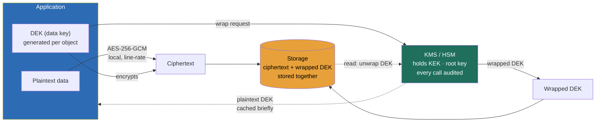

### Learning objectives
- State the real thesis: **encryption at rest and in transit is table stakes; key management is the engineering**, the question that earns signal is not "do you encrypt?" but "who holds the keys, how do they rotate, and what breaks if one leaks?"
- Design **envelope encryption** at architecture altitude: a data key (DEK) encrypts the data, a key-encryption key (KEK) in a KMS encrypts the DEK, so you rotate the KEK without re-encrypting petabytes and keep the root key inside hardware it never leaves.
- Reason about a **key hierarchy as a blast-radius tool**, the whole point of layering keys is that one compromised key exposes one tenant or one column, not the entire estate, and you can name exactly how far a leak travels.
- Treat **secrets as a managed, short-lived, audited resource**, never in code, env files, or git, and know the difference between a static credential and a dynamic one minted per session with a TTL.
- Know where you **own the posture and where you delegate the cryptography**, the from-scratch cipher goes to the security team with a stated prior; the key hierarchy, rotation cadence, and audit boundary are yours to defend.

### Intuition first
Encryption is a lock on a box. Anyone can buy a good lock, AES-256 is a commodity, the cipher is not where systems fail. Systems fail on **the keys**, where they live, who can pick them up, how often you change them, and how many boxes a single stolen key opens. A bank vault door is not impressive because of the steel; it is impressive because the steel is paired with a key-management *process*: the master key never leaves a tamper-proof room, the teller carries a working key that is reissued every shift, and a master compromise opens the vault while a teller-key compromise opens one drawer.

That is the whole lesson in one image. **The cipher is the steel; key management is the process around it.** Envelope encryption is the two-key trick the bank uses, a working key (DEK) on each box and a master key (KEK) locked in the vault that only ever wraps the working keys, never the contents. Rotation is reissuing the teller keys every shift so a leaked one is useless by morning. The key hierarchy is the layering that guarantees a stolen teller key opens a drawer, not the building. Get this right and "we encrypt everything" stops being a brag and becomes the easy part; get it wrong and you have a beautiful lock with the key taped to the door.

### Deep explanation

**Encryption at rest and in transit is the floor, state it, then move past it.** *At rest* means data on disk is unreadable without a key: **AES-256** is the default symmetric cipher and runs at **gigabytes per second per core** on any modern CPU with AES-NI hardware acceleration, so the throughput cost is effectively noise, single-digit percent, not a real design constraint. *In transit* means **TLS 1.3** on every hop (one round trip to handshake, forward secrecy by default) and **mTLS** between services so each side proves identity, not just the server. The Director-altitude statement: *encryption at rest and in transit is non-negotiable table stakes; if the interview spends ten minutes here, you are at the wrong altitude.* You **reject** "we'll roll our own cipher for extra security" outright, because hand-rolled crypto is the single most reliable way to ship a catastrophic, silent vulnerability; you use vetted primitives (AES-256-GCM, TLS 1.3) and spend your design budget on the keys.

**The three places encryption can sit, and the trade you make picking one.** Encryption at rest is not one decision; it is a choice of *layer*, and the layer determines what an attacker who is already inside still sees:

- **Full-disk / volume encryption** (e.g. an encrypted EBS volume, LUKS). Protects against a stolen physical disk and nothing else. Once the volume is mounted, the database and the app see **plaintext**, so a compromised app or a SQL-injection read returns clear data. Cheap, transparent, near-zero cost, and the weakest guarantee. This is the floor compliance asks for, not the ceiling.
- **Transparent database encryption (TDE)** (e.g. SQL Server / Oracle TDE, encrypted RDS). The database encrypts files and backups; the engine decrypts on read. Protects the data files and backup tapes, but a query with valid credentials still sees plaintext, so it does nothing against a compromised application or an over-privileged insider. Transparent to the app, which is its appeal and its limit.
- **Field- / column-level encryption.** The application encrypts specific sensitive fields (PAN, SSN, health data) before they ever reach the database, so the column is ciphertext **end to end**, the DBA, the backup, and a SQL-injection read all see gibberish. The cost is real: you cannot index, range-query, or join on the encrypted column normally, and the app carries the crypto logic. You pay in query flexibility to shrink what plaintext exposure means.

The trade-off is exposure-surface versus operational friction: full-disk is free and protects almost nothing past physical theft; field-level protects against your own database and your own DBA but breaks querying. You **reject** "full-disk is enough" for regulated PII because the threat that matters (a compromised app, a curious insider) sees plaintext anyway; you reserve field-level for the handful of columns that actually warrant it and accept the query cost there.

**Envelope encryption is the pattern that makes key management tractable at scale.** Encrypting a petabyte directly with a single key in a KMS is a non-starter: every read and write would be a network call to the KMS, and rotating that one key would mean re-encrypting the petabyte. The fix is two layers of key:

- A **data encryption key (DEK)** is a fresh symmetric key that encrypts the actual data, locally, at AES line rate. It can be per-object, per-file, per-tenant, even per-row for the most sensitive data.
- A **key encryption key (KEK)** lives inside the KMS and never leaves it. Its only job is to **encrypt (wrap) the DEK**. You store the wrapped DEK *next to the ciphertext* it protects.
- On **write**: generate a DEK, encrypt data with it locally, ask the KMS to wrap the DEK with the KEK, store ciphertext + wrapped DEK, discard the plaintext DEK. On **read**: fetch ciphertext + wrapped DEK, ask the KMS to **unwrap** the DEK, decrypt locally, discard the DEK.

The payoff is the whole reason the pattern exists. **You rotate the KEK without touching the data.** Rotating the KEK re-wraps the DEKs (small, fast, a few hundred bytes each), not the petabytes the DEKs protect. **KMS load stays bounded**, the KMS sees one small wrap/unwrap call per object or per session, not a call per byte, and a typical managed KMS bills around **\$0.03 per 10,000 requests** with **single-digit-millisecond latency**, so you cache unwrapped DEKs briefly in memory and the KMS is never on the hot path of every row. And **the root key never leaves hardware**, the KEK (or the master key above it) is backed by an **HSM**, a tamper-resistant hardware security module certified to FIPS 140-2/3, so the key material is non-exportable by design. You **reject** "encrypt the data directly with a KMS key" because it puts the KMS on every I/O and makes rotation a re-encrypt-the-world event; envelope encryption buys cheap rotation and bounded KMS load for the cost of one extra wrapped-key blob per object.

**Secrets are a managed resource, and "in code / env / git" is the failure mode that ends careers.** A secret is any credential the system needs at runtime: DB passwords, API keys, signing keys, service tokens. The anti-pattern is depressingly common and reliably fatal: hardcoded in source, dropped in a `.env` file, baked into a config map, or committed to git, where it lives in history **forever** even after you delete it, and where a single leaked repo or a public S3 bucket hands an attacker the keys to production. The posture instead:

- **A dedicated secrets manager** holds them, HashiCorp Vault, AWS/GCP Secrets Manager, encrypted at rest with its own KMS-backed key, with **every read access-controlled and audited**. The app fetches the secret at startup or on demand; it is never in the artifact.
- **Dynamic, short-lived secrets** beat static ones. Vault can mint a **database credential on the fly with a 1-hour TTL**, scoped to one app, and revoke it automatically. A leaked static password is valid until someone notices and rotates it (often weeks); a leaked dynamic credential is dead in an hour, which collapses the blast-radius window from weeks to minutes.
- **Rotation is automated, not a calendar reminder.** Long-lived keys rotate on a cadence (commonly **90 days** for KEKs, **per-session** for dynamic creds); the rotation is a pipeline, not a human SSHing in, because a manual rotation that hurts gets skipped, and a skipped rotation is how a key from three years ago is still live.

You **reject** "store the DB password in an environment variable" because env vars leak through crash dumps, process listings, child processes, and logging, and they have no rotation or audit story; the secrets manager costs a small integration tax and buys you audit, rotation, and revocation for free.

**Tokenization replaces the secret with a useless stand-in, and its real value is shrinking compliance scope.** Encryption keeps the sensitive value (you can decrypt it); **tokenization** replaces it with an unrelated **token** and stores the real value in one hardened **vault**, the token is a reference, not ciphertext, and there is no key that turns the token back into the PAN outside the vault. The headline benefit is regulatory, not cryptographic. Under **PCI-DSS**, every system that *touches* a card number (PAN) is in audit scope; tokenize the PAN at the edge and hand every downstream system a token instead, and those systems **fall out of PCI scope entirely** because they never see card data. A merchant who tokenizes at ingestion can pull dozens of internal services, their analytics warehouse, their CRM, their support tools, out of the assessed boundary, turning a sprawling audit into a small one around the token vault and the payment edge. You **reject** "encrypt the PAN everywhere" when the goal is compliance cost, because encrypted card data is *still in scope* (you hold the key); tokenization is the move that actually shrinks the audited footprint, at the cost of running and securing the token vault.

**The key hierarchy exists to bound blast radius, and that is the number you must be able to name.** Layer the keys so a single compromise is contained:

- A **root key / master key** in the HSM at the top, used only to encrypt the KEKs, rotated rarely, accessible to almost no one.
- **KEKs** per domain (per tenant, per environment, per data classification), each wrapping many DEKs.
- **DEKs** at the bottom, ideally **per-tenant or per-object**, so they are numerous and cheap.

The blast radius falls out of the layering. **A leaked DEK exposes exactly the data it encrypted**, one object, one tenant, one column, and nothing else, which is why you want DEKs to be fine-grained: a per-tenant DEK compromise is a one-tenant incident, not a company-ending one. **A leaked KEK** exposes every DEK it wraps (one domain), bad, but rotatable and bounded. **A compromised root key** is the catastrophe you spend HSMs and tight access to make nearly impossible. And **every decrypt is logged**, the KMS audit trail records who unwrapped which key when, so a compromise is *detectable* (an anomalous spike of unwrap calls) and *attributable*, not silent. You **reject** "one key for the whole system" because it makes every leak a total breach with no containment and no rotation without re-encrypting everything; the hierarchy costs more keys to manage and buys you a blast radius you can state in one sentence.

Go deeper — envelope encryption mechanics, AES-GCM, and KMS request shape (IC depth, optional)

- **AES-256-GCM, not AES-CBC.** GCM (Galois/Counter Mode) is an **AEAD** cipher: it encrypts *and* authenticates in one pass, producing a 16-byte authentication tag that detects tampering, so a flipped ciphertext bit fails decryption instead of silently corrupting. CBC needs a separate HMAC and is a classic footgun (padding-oracle attacks). The nonce/IV must be **unique per key** (never reused), so per-DEK encryption sidesteps the nonce-reuse risk that plagues single-key schemes.

- **GenerateDataKey in one call.** AWS KMS `GenerateDataKey` returns *both* the plaintext DEK (to encrypt with, then immediately discard) and the wrapped DEK (to store) in a single round trip. You never send the data to the KMS, only the small key blob is wrapped, which is why a 5 GB object and a 5 KB object cost the same one KMS call.

- **DEK caching and the latency budget.** Unwrapping a DEK on every read would add a KMS round trip (~5 ms) to every request. The standard fix is a short-lived in-process **DEK cache** (e.g. unwrap once, reuse for 5 minutes or N uses), trading a small window of plaintext-DEK-in-memory exposure for removing the KMS from the hot path. The cache TTL is the dial between KMS cost/latency and exposure window.

- **Key states and rotation mechanics.** A KMS key has versions; rotating creates a new version while keeping old versions for *decrypt only*, so data wrapped under the old KEK still reads while new writes use the new one. "Disabling" a key blocks all use; "scheduling deletion" (with a 7–30 day waiting period) is irreversible and makes everything it ever wrapped permanently unrecoverable, which is why deletion is gated and audited.

- **BYOK / HYOK / external key stores.** Bring-Your-Own-Key imports your key material into the cloud HSM (you control generation, the cloud holds it). Hold-Your-Own-Key / external key store keeps the key in *your* on-prem HSM and the cloud calls out to it for every operation, maximal control and a hard dependency: if your HSM is unreachable, the cloud cannot decrypt, so availability becomes your problem.

### Diagram: the envelope-encryption write and read path

### Worked example: protecting PAN and PII columns in a payments database
A payments service stores card numbers (PAN), names, and emails, and must satisfy PCI-DSS and a general PII obligation. One table, and the whole key-management posture shows up in protecting it.

- **Layering.** Volume encryption (AES-256) is on by default, that is the floor and protects a stolen disk. On top, the **PAN, name, and email columns are field-level encrypted** with **envelope encryption**: each row's sensitive fields get a per-tenant DEK, the DEK is wrapped by a per-tenant KEK in the KMS, and the KEK's master sits in an **HSM**. So a SQL-injection read, a leaked backup, and the DBA all see ciphertext, not card data. *Rejected: TDE alone*, because the application and any valid query would still see plaintext PAN, which leaves the threat that matters (a compromised app) wide open.
- **Tokenization to shrink scope.** At ingestion, the PAN is **tokenized**: the real card number goes into a hardened token vault and every downstream system, billing, analytics, support, fraud, receives a **token** instead. Concretely, if the platform has ~40 internal services and only the **2** at the payment edge plus the token vault ever touch a real PAN, tokenization pulls roughly **38 of 40 services out of PCI scope**, turning a sprawling, expensive audit into a tight one around three components. That scope reduction is the single biggest cost lever in the design, *rejected: encrypting the PAN in every service*, because encrypted card data is still in scope and would leave all 40 services audited.
- **Rotation and secrets.** KEKs rotate automatically every **90 days** (re-wrapping DEKs, not re-encrypting card data). The service's DB credential is a **dynamic Vault secret with a 1-hour TTL**, never an env var, so a leaked credential dies in an hour instead of living until someone notices.
- **Blast radius, stated.** Per-tenant DEKs mean a single DEK compromise exposes **one tenant's** sensitive fields and nothing else; every unwrap is logged, so an attacker pulling a tenant's data shows up as an anomalous spike in KMS unwrap calls. The number a Director brings out of this is not "it's encrypted", it is *"one leaked DEK is a one-tenant incident, the KEK rotates every 90 days, and tokenization keeps 38 of 40 services out of audit."*

### Trade-offs table: where to encrypt, and who holds the key
| Decision | Full-disk / volume | TDE (database) | Field / column-level | Tokenization |
|---|---|---|---|---|
| **Protects against** | stolen physical disk | stolen disk + backups | compromised app, DBA, injection, backups | removes the secret entirely from scope |
| **App sees plaintext?** | yes (once mounted) | yes (valid query) | no (ciphertext end to end) | no (token only) |
| **Cost / friction** | ~zero, transparent | low, transparent | real, breaks index/join on the field | run + secure a token vault |
| **Compliance effect** | minimal | satisfies "at rest" floor | strong, narrows exposure | **shrinks PCI/PII scope** the most |
| **Use when…** | always, the baseline | regulated data at rest, app trusted | a few high-sensitivity columns (PAN, SSN, health) | card/PAN data you want out of audit scope |

| Key-control model | KMS-managed (cloud key) | BYOK (you import) | HYOK / external HSM |
|---|---|---|---|
| **Control** | cloud generates + holds | you generate, cloud holds | you generate *and* hold, on-prem |
| **Ops burden** | lowest | medium | highest (you run the HSM + its availability) |
| **Blast radius / leverage** | trust the cloud KMS | revoke import, cloud can't recover | pull the key, cloud goes dark instantly |
| **Use when…** | the default for most workloads | regulatory "we control key material" | sovereignty / "cloud must never be able to decrypt" |

The Director move is matching the **encryption layer to the threat you actually face** (full-disk for theft, field-level for the columns that matter), tokenizing the data that drives audit scope, and choosing the key-control model from a real sovereignty requirement, not from a reflex to control everything.

### What interviewers probe here
- **"How do you protect data at rest, and where do the keys live?"** *Strong signal:* envelope encryption (DEK encrypts data, KEK in a KMS wraps the DEK, root key in an HSM), keys never in code, automated rotation, and a crisp statement of blast radius, "a leaked DEK is one tenant, the KEK rotates every 90 days." *Red flag:* "we AES-encrypt everything" with the key in a config file, one key for the whole system, and no rotation, which is a beautiful lock with the key taped to it.
- **"A key is compromised. What's the damage and how do you contain it?"** *Strong:* names exactly how far it travels given the hierarchy (DEK → one object/tenant, KEK → one domain, root → catastrophe), reaches for the KMS audit log to scope and detect it, rotates the affected layer without re-encrypting the world, and revokes downstream. *Red flag:* cannot say what a single key exposes, because there is one key and the answer is "everything."
- **"How do you keep secrets out of code, and what about rotation?"** *Strong:* a dedicated secrets manager with audited access, dynamic short-lived credentials (1-hour TTL beats a static password live for weeks), rotation as an automated pipeline not a calendar reminder, and a scan to catch secrets in git history. *Red flag:* env vars and `.env` files, "we rotate when there's an incident," treating a committed secret as fixed by deleting the file (it lives in history forever).
- **"You need to be PCI-compliant cheaply. What's the architecture move?"** *Strong:* tokenize the PAN at the edge so most services never see card data and fall out of audit scope, quantifies the scope reduction, and knows encrypted PAN is *still* in scope. *Red flag:* "encrypt the card number everywhere" with no awareness that this leaves every service audited and the bill unbounded.

The through-line at Director altitude: own the **posture**, what the paved road enforces (envelope encryption by default, secrets from the manager, rotation automated), what the hierarchy makes containable, and where the audit boundary sits, while delegating the cryptography with a stated prior ("I'd have the security team validate AES-256-GCM envelope encryption against our HSM and benchmark per-session DEK caching versus per-object; my prior is per-tenant DEKs with a 90-day KEK rotation because it bounds blast radius to one tenant and keeps the KMS off the hot path").

### Common mistakes / misconceptions
- **Secrets in code, env vars, config, or git.** Committed secrets live in history forever and leak through crash dumps and process listings; the fix is a secrets manager with audited access and dynamic short-lived credentials, not deleting the file.
- **No rotation, or manual rotation.** A key from three years ago is still live because rotation was a calendar reminder nobody honored; rotation must be an automated pipeline with a stated cadence (90 days for KEKs, per-session for dynamic creds).
- **Treating "encrypted at rest" as sufficient when the app still sees plaintext.** Full-disk and TDE leave a compromised application or insider looking at clear data; the threat that matters needs field-level encryption on the columns that warrant it.
- **Rolling your own crypto.** Hand-rolled ciphers ship silent catastrophic bugs; use vetted primitives (AES-256-GCM, TLS 1.3) and spend the design budget on key management, where systems actually fail.
- **One key for everything.** A single key makes every leak a total breach with no containment and no cheap rotation; a key hierarchy with per-tenant DEKs bounds the blast radius to a sentence you can say out loud.

### Practice questions

**Q1.** Walk through how you'd encrypt a multi-tenant object store so that a single key compromise can't expose every customer.
> *Model:* Envelope encryption with a per-tenant key hierarchy. Each object gets a fresh DEK that encrypts it locally at AES-256-GCM line rate; the DEK is wrapped by a **per-tenant KEK** held in the KMS, and the KEKs' master key sits in an HSM and never leaves it. I store the wrapped DEK alongside each object. The blast radius is now bounded by design: a leaked DEK exposes **one object**, a leaked tenant KEK exposes **one tenant**, and the root is HSM-protected. Every unwrap is logged, so a compromise is both detectable (anomalous unwrap spike) and attributable. I rotate KEKs every 90 days, which re-wraps DEKs cheaply without re-encrypting the petabytes underneath. I reject one global key because it turns any leak into a total breach with no containment, the whole reason for the hierarchy is to make "a key leaked" a one-tenant incident, not a company-ending one.

**Q2.** Your team wants to "just encrypt the card number column" to get PCI-compliant faster. What's wrong with that framing, and what do you do instead?
> *Model:* Encrypting the PAN doesn't shrink PCI scope, you still hold the decryption key, so every system that touches the column is still in audit scope, and the assessment stays as large and expensive as before. The move that actually reduces cost is **tokenization**: replace the PAN with a token at ingestion, store the real card number in one hardened token vault, and hand every downstream service a token. Those services now never see card data and fall **out of PCI scope entirely**. If ~40 internal services exist and only the 2 at the payment edge plus the vault touch a real PAN, that pulls ~38 services out of audit, turning a sprawling assessment into a tight one around three components. I'd still field-level encrypt the PAN inside the vault, but the scope win is tokenization, not encryption. The cost is running and securing the token vault, which is the right thing to concentrate hardening on.

**Q3.** An engineer says they'll keep the database password in an environment variable so it's "not in the code." Is that good enough? What's the better posture?
> *Model:* No, env vars are not a secrets store. They leak through crash dumps, process listings, child processes, and accidental logging, and they have **no rotation, audit, or revocation** story, a leaked env-var password is valid until a human notices and changes it, often weeks. The better posture is a dedicated secrets manager (Vault, cloud Secrets Manager): the app fetches the credential at runtime over an authenticated channel, every read is access-controlled and audited, and ideally the credential is **dynamic with a 1-hour TTL** minted per app, so a leak is dead in an hour instead of living until someone reacts. Rotation becomes an automated pipeline, not a calendar reminder. The integration tax is small and buys audit, rotation, and revocation for free, which is exactly what env vars can never offer.

**Q4.** Why is envelope encryption used instead of just encrypting data directly with a KMS key, and what does it buy you operationally?
> *Model:* Encrypting data directly with a KMS key puts the KMS on every I/O (a network call per read and write) and makes rotation a re-encrypt-the-whole-dataset event, both non-starters at scale. Envelope encryption splits the job: a local DEK encrypts the data at AES line rate (no KMS in the hot path), and the KMS only **wraps the small DEK** with a KEK it never exports. Operationally this buys three things. Rotation is cheap, rotating the KEK re-wraps the few-hundred-byte DEKs, not the petabytes they protect. KMS load is bounded, one small wrap/unwrap per object or per cached session at ~\$0.03/10k requests and single-digit-ms latency, and I cache unwrapped DEKs briefly to keep the KMS off the per-row path. And the root key stays in hardware, the KEK's master is HSM-backed and non-exportable. The only cost is one extra wrapped-key blob stored per object, which is trivial against what it buys.

### Key takeaways
- **Encryption is table stakes; key management is the engineering.** AES-256 and TLS 1.3 are commodities running at near-zero cost; the signal is who holds the keys, how they rotate, and what one leak exposes. Never roll your own crypto.
- **Envelope encryption is the scaling pattern:** a local DEK encrypts data at line rate, a KEK in the KMS wraps the DEK, the root key lives in an HSM. You rotate the KEK without re-encrypting data, keep the KMS off the hot path (~\$0.03/10k calls, cached DEKs), and never export the master key.
- **The key hierarchy is a blast-radius tool:** per-tenant/per-object DEKs mean a leaked DEK is one tenant, a leaked KEK is one domain, the root is the catastrophe you spend HSMs to prevent, and every decrypt is audited so a compromise is detectable and attributable. One key for everything is the anti-pattern.
- **Secrets are a managed, audited, short-lived resource:** a secrets manager with access logging and dynamic 1-hour-TTL credentials, rotation as an automated pipeline (90-day KEKs), never in code, env, config, or git, committed secrets live in history forever.
- **Tokenization shrinks compliance scope, encryption doesn't:** tokenize the PAN at the edge to pull most services out of PCI audit (encrypted card data is still in scope because you hold the key); choose the encryption *layer* (full-disk → TDE → field-level) to match the actual threat.

> **Spaced-repetition recap:** Encryption is the **lock (steel)**; key management is the **process around it**. AES-256 / TLS 1.3 are table-stakes commodities, never roll your own. Use **envelope encryption**: a local **DEK** encrypts data at line rate, a **KEK** in the **KMS** wraps the DEK, the **root key** lives in an **HSM** and never leaves, so you rotate the KEK without re-encrypting data and keep the KMS off the hot path. A **key hierarchy** (per-tenant/per-object DEKs → KEKs → root) bounds **blast radius** to a sentence: a leaked DEK is one tenant, a leaked KEK one domain. **Secrets** live in a manager, audited, dynamic, short-lived (1-hour TTL), rotated by pipeline, never in code/env/git. **Tokenization** (not encryption) shrinks PCI scope by pulling services that never see the PAN out of audit. Pick the encryption *layer* (full-disk → TDE → field-level) for the threat you actually face.

---

*End of Lesson 11.3. Encryption is the easy part; the engineering, and the interview signal, is the key hierarchy, the rotation, and being able to name the blast radius of a single leaked key.*
