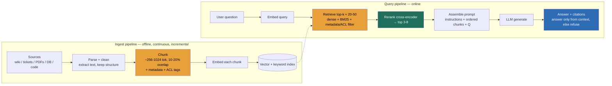

### Learning objectives
- Explain **why RAG exists** — grounding a stateless, knowledge-frozen model in private, fresh, citable data — and when it beats the two alternatives (long-context stuffing, fine-tuning), each rejected for a stated reason.
- Draw the **two pipelines** that every RAG system is: an **ingest** path (connect → parse → chunk → embed → index) and a **query** path (embed → retrieve → rerank → assemble → generate-with-citations), and name the decision that lives at each stage.
- Locate the **quality bottleneck** correctly: in production RAG, the model is rarely the problem — **retrieval is** — so chunking, hybrid retrieval, and reranking carry more of the score than model choice.
- Treat **evaluation as the gate**, separating *retrieval* metrics (did we fetch the right context?) from *generation* metrics (did the answer stay faithful to it?), because the two fail independently and the fix differs.
- Name the operational failure modes a Director owns: **stale indexes, permission leakage, and confidently-wrong-but-well-cited answers.**

### Intuition first
A RAG system is a **closed-book exam turned into an open-book one.** A frozen LLM walking into your domain is a brilliant generalist sitting a closed-book exam on a subject it last studied months ago and never on *your* private material — so it bluffs fluently, which is the dangerous part. RAG hands it the **open book, turned to the right page**, just before it answers.

The whole game is therefore not "how smart is the student" but **"how good is the librarian."** A librarian who fetches the wrong three pages turns a brilliant student into a brilliant, confident, wrong one — and because the student now cites the (wrong) pages, the error looks *more* authoritative, not less. So the work that decides RAG quality is the unglamorous half: how you cut the books into pages (chunking), how you find the right pages fast (retrieval), and how you double-check the shortlist before handing it over (reranking). The model is the last and usually least decisive link.

Keep that image — *brilliant student, fallible librarian* — because it predicts where every RAG system actually breaks.

### Deep explanation

**Why RAG at all — and why not just a bigger prompt or a fine-tune.** An LLM has three hard limits a designer must respect: its knowledge is **frozen at a training cutoff**, it has **never seen your private data**, and it **cannot tell you where an answer came from**. RAG attacks all three by retrieving relevant text at query time and putting it *in the prompt* as grounding, so the model answers *from* supplied evidence and can **cite** it. The benefits are concrete: answers reflect data changed five minutes ago (freshness), they cover documents the model was never trained on (private knowledge), they carry citations (auditability), and — critically — grounding **reduces hallucination** because the model is summarizing supplied text rather than recalling from parameters. Note *reduces*, not *eliminates*: a model can still ignore or contradict its context.

The two alternatives, and why RAG is usually the default:
- **Long-context stuffing** — paste the whole corpus into a 200K–1M-token window. Fine when the corpus is *small and bounded* (one contract, one codebase module). It fails on scale (you cannot fit 10M documents in any window), on **cost** (you pay for every input token on every call), and on the **"lost in the middle"** degradation where models attend poorly to the center of a long context. **Rejected as the general answer** because it doesn't scale and burns tokens re-reading the same corpus on every request.
- **Fine-tuning** — bake knowledge into weights. Fine-tuning teaches **behavior, format, and tone**, not reliable facts; it's slow to update (retrain to add a document), it has **no citations**, and it can *increase* confident hallucination on facts it half-learned. **Rejected for fact-grounding** (covered fully in the adapt-the-model lesson); the two compose — fine-tune the *style*, RAG the *facts*.

The Director-altitude statement: *RAG is how you give a frozen, private-data-blind model fresh, auditable knowledge without retraining it.* Reach for it whenever the answer depends on data that is large, private, frequently changing, or must be cited.

**RAG is two pipelines, not one — make both visible.** Candidates who draw only the query path miss half the system (and half the cost and most of the freshness problem).

- **Ingest (offline, write path):** *connect* to sources (wikis, tickets, PDFs, databases, code) → *parse and clean* (extract text, strip boilerplate, preserve structure/tables) → **chunk** into retrievable units → **embed** each chunk → **index** into a vector store with metadata. This runs continuously and **incrementally** — when a source doc changes, you re-chunk, re-embed, and upsert just that doc, and tombstone deletes. The freshness of your answers is exactly the freshness of this pipeline.
- **Query (online, read path):** *embed* the user query → **retrieve** candidate chunks (vector + keyword + metadata filter) → **rerank** to a precise shortlist → **assemble** the prompt (instructions + ordered chunks + question) → **generate** an answer **with citations** back to the source chunks.

**Chunking is where RAG quality is won or lost.** A chunk is the atomic unit you retrieve; get it wrong and no downstream cleverness recovers. Too **large** (a whole 20-page doc) and a single chunk dilutes the embedding across many topics, so retrieval is fuzzy and you waste context budget; too **small** (one sentence) and you shatter the context a passage needs to be meaningful. The practical band is **~256–1024 tokens** with **~10–20% overlap** so a fact straddling a boundary survives in at least one chunk. Strategies, escalating in cost and quality:
- **Fixed-size** (N tokens, sliding window): trivial, fast, ignores structure — it will cut a table or a paragraph mid-thought. Fine as a baseline.
- **Recursive / structure-aware**: split on natural boundaries (headings → paragraphs → sentences) so chunks align with document structure. The pragmatic default for most corpora.
- **Semantic**: split where the topic shifts (embedding-distance breakpoints). Best coherence, highest preprocessing cost. Reserve it for high-value corpora where retrieval precision pays for the extra work.

Always attach **metadata** to each chunk (source ID, title, section, timestamp, and — load-bearing — **access-control tags**); you will filter and cite on it. **Rejected default:** one-size fixed chunking applied blindly to mixed content (prose + tables + code) — it's the most common cause of "the data is in there but it never retrieves."

**Retrieval: dense alone is not enough — go hybrid.** Vector (dense) retrieval finds *semantically* similar text and is the backbone, but it is weak on **exact tokens** — error codes, SKUs, names, acronyms — where a keyword index shines. **Hybrid search** runs both **dense** (ANN over embeddings) and **sparse** (BM25/keyword) and fuses the rankings (e.g., Reciprocal Rank Fusion), recovering the precise-token matches dense retrieval drops while keeping semantic recall. Layer a **metadata filter** on top (date ranges, document type, and the ACL tags) so you only ever retrieve what this user is allowed to see. The standard shape is **retrieve wide, then narrow**: pull a generous candidate set (**top-k ≈ 20–50**) cheaply, because recall here caps everything downstream — a chunk not retrieved can never be cited.

**Reranking: cheap recall, then expensive precision.** Vector top-k optimizes for speed over precision; the top 20 will contain the right chunks *and* near-miss noise. A **cross-encoder reranker** (e.g., Cohere Rerank, `bge-reranker`) scores each (query, chunk) pair *jointly* — far more accurate than the bi-encoder cosine that produced the candidates — and reorders them so you can keep only the **top ~3–8** for the prompt. This two-stage **retrieve-then-rerank** pattern is the single highest-leverage precision win in RAG: it routinely turns a mediocre top-k into a clean shortlist. The cost is **latency** (a rerank pass adds tens-to-hundreds of ms and a model call) and money, so you rerank a *candidate set of dozens*, never the whole corpus. **Rejected alternative:** feeding all 20 raw vector hits straight into the prompt — you pay for the tokens, you trigger lost-in-the-middle, and you dilute the answer with near-misses.

**Context assembly: the prompt is a curated exhibit, not a dump.** You now have ~3–8 high-precision chunks; how you arrange them matters. Models exhibit **"lost in the middle"** — strong attention to the **start and end** of the context, weaker in the center — so put the most relevant chunks at the edges, not buried. Keep within a deliberate **token budget** (more context is not free and not always better). And instruct the model to **answer only from the supplied context and cite chunk IDs**, refusing when the context doesn't contain the answer — this is what converts retrieval into an *auditable, grounded* answer instead of a vibe. The citation isn't decoration; it's how a user (and your eval) verifies the answer is real.

**The bottleneck is retrieval, not the model — internalize this.** The defining failure of production RAG is **"good model, bad retrieval"**: the LLM is handed the wrong chunks and produces a fluent, well-cited, *wrong* answer — worse than a refusal, because the citation makes it look trustworthy. Swapping to a bigger/better model barely moves this; fixing chunking, going hybrid, and adding a reranker moves it a lot. So when an interviewer says "answers are wrong," the Director instinct is to **inspect retrieval first** (is the right chunk even in the index? is it retrieved? is it ranked into the shortlist?) before touching the model.

Go deeper — advanced retrieval techniques (IC depth, optional)

- **Query rewriting / expansion:** the user's literal question is often a poor query. Rewrite it (resolve pronouns from chat history, expand acronyms, generate sub-queries) before embedding. Multi-query then fuses results.
- **HyDE (Hypothetical Document Embeddings):** ask the LLM to *draft* a hypothetical answer, embed *that*, and retrieve against it — the draft is closer in embedding space to real answer-bearing chunks than the terse question is.
- **Contextual retrieval:** prepend a short LLM-generated summary of the *whole document* to each chunk before embedding, so an out-of-context chunk ("it increased 3%") retains the subject ("Q3 EU revenue increased 3%"). Cuts retrieval-miss rate materially at modest ingest cost.
- **Multi-hop / agentic RAG:** for questions needing several lookups ("compare the 2024 and 2025 policies"), let an agent issue retrieval as a *tool* iteratively rather than one shot. More capable, far more tokens and latency.
- **GraphRAG:** build a knowledge graph from the corpus and retrieve over entities/relations for global "summarize across everything" questions that flat chunk retrieval can't answer. Heavy to build; reserve for corpora where relationship questions dominate.

These are escalations: add them only when eval shows flat retrieve-rerank is the ceiling, not by default.

### Diagram: the two RAG pipelines

### Worked example: an enterprise knowledge assistant

Take a 50,000-person company: "answer any employee's question from our wikis, HR policies, engineering docs, and support tickets, **with citations**, and **never** show someone a document they can't access."

- **Corpus & ingest:** ~10M documents across five connectors. **Recursive/structure-aware chunking** at ~512 tokens, 15% overlap — rejected fixed-size because HR policy PDFs and engineering Markdown have structure (headings, tables) that fixed windows shred. Ingest is **incremental**: a webhook on each source upserts only changed docs, so a policy edited at 9am is answerable by 9:05. Rejected nightly full re-index: too stale for HR/policy questions and wasteful at 10M docs.
- **Critical metadata:** every chunk carries the **ACL** of its source doc. This is non-negotiable and seeds the scariest failure mode.
- **Retrieve:** **hybrid** (dense + BM25) — rejected pure-vector because employees search exact strings (error codes, policy numbers, system names) that dense retrieval fumbles. Filter by the requesting user's **access tags at query time** so retrieval can only return permitted chunks. Pull top-30 candidates.
- **Rerank:** a cross-encoder narrows 30 → top-5. Rejected "feed all 30": it'd cost ~6× the context tokens, trigger lost-in-the-middle, and lower answer precision.
- **Generate:** instruct "answer only from the five chunks, cite each claim's source, say 'I don't have that' if unsupported." Rejected free-form generation: without the grounding instruction the model fills gaps from parametric memory and hallucinates a plausible-but-fake policy.
- **Eval gates ship:** a golden set of ~300 real Q&A pairs measures **retrieval recall** (is the right chunk in the top-30?) and **faithfulness** (does the answer stick to retrieved text?) on every prompt/chunking/model change. Rejected "ship and watch": you can't eyeball faithfulness at scale, and a chunking regression silently tanks recall.

Every decision traces to a requirement: citations and "no leakage" (the ACL filter), freshness (incremental ingest), exact-string questions (hybrid), and precision under a token budget (rerank).

### Trade-offs table

| Decision | Option A | Option B | Option C | Use when… |
|---|---|---|---|---|
| **Chunking strategy** | **Fixed-size window** | **Recursive / structure-aware** | **Semantic (topic-shift) split** | **A** as a quick baseline / uniform prose. **B** is the default for mixed structured docs (the right call most of the time). **C** for high-value corpora where retrieval precision justifies the preprocessing cost. |
| **Retrieval** | **Dense (vector) only** | **Hybrid (dense + BM25 + filter)** | Keyword (BM25) only | **B** as the default — recovers exact-token matches dense drops. **A** when queries are purely semantic/paraphrase. **C** only for legacy exact-match search; loses semantic recall. |
| **Rerank** | **None (use raw top-k)** | **Cross-encoder rerank top-N → 3-8** | LLM-as-reranker | **B** is the high-leverage default for precision. **A** only when latency budget is brutal and recall is already clean. **C** when you need nuanced relevance and can pay the latency. |
| **Grounding strategy** | **RAG (retrieve at query time)** | **Long-context stuffing** | **Fine-tune the facts in** | **A** for large/private/fresh/citable knowledge (most cases). **B** for a small, bounded, static doc set. **C** never for facts — fine-tune *behavior/format*, RAG the facts; they compose. |

### What interviewers probe here
- **"The model is great, but the answers are wrong. Where do you look first?"** — *Strong signal:* goes to **retrieval/eval before the model** — is the right chunk indexed, retrieved, and ranked into the shortlist? Names "good model, bad retrieval" as the dominant failure and separates retrieval recall from generation faithfulness. *Red flag:* "swap to a bigger model" — treats a retrieval problem as a model problem.
- **"How do you keep the index fresh?"** — *Strong:* incremental, event-driven upserts on source change with delete tombstones; states the freshness SLA as the ingest-pipeline latency. *Red flag:* "re-index nightly" with no awareness of the staleness window or the re-embed cost at scale.
- **"How do you stop it surfacing a document the user isn't allowed to see?"** — *Strong:* ACL tags on every chunk, **filtered at retrieval time**, so forbidden chunks never enter the context. Notes that post-hoc output filtering is too late (the model already saw it). *Red flag:* "filter the answer afterward" or no notion of permissions in retrieval — a data-leak waiting to happen.
- **"Why not just fine-tune the docs into the model / paste them all in the prompt?"** — *Strong:* fine-tuning teaches behavior not citable facts and can't update cheaply; long-context doesn't scale past a bounded set and is expensive per call. *Red flag:* treats fine-tuning as the way to add knowledge.
- **"Do you even need a reranker?"** — *Strong:* yes when raw top-k carries near-miss noise; quantifies the precision lift vs the latency cost and reranks only a candidate set. *Red flag:* unaware of the retrieve-then-rerank pattern.

The through-line at Director altitude: **the model is the cheap, swappable part; the retrieval pipeline and its eval are the asset.** "I'd have the team benchmark hybrid + a cross-encoder reranker against our golden set; my prior is that fixes most of our wrong answers before we touch the model."

### Common mistakes / misconceptions
- **Blaming the model for a retrieval failure.** The fluent wrong answer almost always traces to chunking/retrieval, not the LLM. Fix the librarian, not the student.
- **One blind chunking strategy for everything.** Fixed-size windows applied to tables, code, and prose alike is the #1 reason "the data is in there but won't retrieve." Match chunking to structure.
- **Pure vector retrieval.** Dense embeddings miss exact tokens (codes, names, SKUs). Go hybrid; fuse dense + keyword.
- **Permissions as an afterthought.** Filtering the *output* is too late — the model already consumed forbidden text and may paraphrase it. Filter at **retrieval** with per-chunk ACLs.
- **No separation of eval.** Tracking one "accuracy" number hides whether retrieval or generation broke. Measure retrieval recall/precision and generation faithfulness/relevance **separately** — the fixes are different.

### Practice questions

**Q1.** Your RAG assistant gives a confident, well-cited answer that is flatly wrong. Walk me through how you diagnose it.
> *Model:* Separate the two stages. **Retrieval:** is the correct chunk even in the index (ingest/chunking gap)? If indexed, is it in the top-k (recall — try hybrid, raise k, query rewriting)? If retrieved, is it ranked into the shortlist (add/tune the reranker)? **Generation:** if the right chunk *was* in context but the answer contradicts it, that's a **faithfulness** failure — tighten the grounding instruction, lower temperature, or the chunk was buried mid-context (lost-in-the-middle — reorder). The citation being wrong is the tell: it cited what it retrieved, and what it retrieved was wrong. Bigger model is the *last* lever, not the first.

**Q2.** Freshness requirement: a policy edited at 9:00am must be answerable by 9:05. How do you design ingest?
> *Model:* **Event-driven incremental ingest** — a change webhook on the source enqueues just that document; a worker re-parses, re-chunks, re-embeds, and **upserts** the affected chunks (and tombstones deleted ones) into the index. The freshness SLA *is* this pipeline's end-to-end latency, so size the queue/workers for it. Rejected: nightly full re-index (up to 24h stale, and re-embedding 10M docs daily is pure waste). Keep a periodic full reconcile as a backstop for missed events, not as the primary path.

**Q3.** When would you *not* use RAG, and use long context or fine-tuning instead?
> *Model:* **Long-context** when the corpus is small and bounded and fits a window (one contract, one runbook) and you'll accept the per-call token cost — no retrieval infra to maintain. **Fine-tuning** when the need is *behavior/format/tone* (always answer as JSON, adopt our support voice, classify into our taxonomy), not facts. **RAG** whenever knowledge is large, private, frequently changing, or must be cited — which is most enterprise cases. They compose: fine-tune the style, RAG the facts.

**Q4.** Your corpus is 10M docs and pure vector search keeps missing questions that contain exact error codes. What changes?
> *Model:* Go **hybrid**: add a BM25/keyword index and fuse it with dense results (RRF), so exact-token queries hit the keyword path while paraphrase queries hit the dense path. Also check **chunking** — if codes live in tables being shredded by fixed-size windows, switch to structure-aware chunking and consider **contextual retrieval** (prepend a doc summary to each chunk) so a lone code keeps its subject. Verify with retrieval-recall on a golden set containing those code queries before/after.

### Key takeaways
- **RAG grounds a frozen, private-data-blind model in fresh, citable knowledge** without retraining — the default for any feature whose answer depends on large/private/changing data. It *reduces* hallucination; it doesn't eliminate it.
- **RAG is two pipelines:** an incremental **ingest** path (connect → parse → chunk → embed → index) whose latency *is* your freshness, and a **query** path (embed → retrieve → rerank → assemble → generate-with-citations).
- **Retrieval, not the model, is the bottleneck.** Chunking (structure-aware, ~512 tokens, overlap), **hybrid** retrieval (dense + BM25 + metadata filter), and a **cross-encoder reranker** (retrieve wide ~20–50, rerank to ~3–8) carry the quality. "Good model, bad retrieval → confident, well-cited, wrong" is the signature failure.
- **Permissions belong in retrieval, not output.** Tag every chunk with ACLs and filter at query time so forbidden text never enters the context.
- **Eval is the gate, and it's two metrics.** Retrieval recall/precision (right context fetched?) and generation faithfulness/relevance (answer stuck to it?) fail independently — measure them separately and gate every change on a golden set.

> **Spaced-repetition recap:** RAG = brilliant student, fallible librarian — give the frozen model the open book turned to the right page. Two pipelines: **ingest** (chunk → embed → index, incrementally — this is your freshness) and **query** (embed → retrieve hybrid + ACL filter → **rerank** → assemble → generate **with citations**). The bottleneck is **retrieval, not the model** (fix chunking/hybrid/rerank before swapping models); the signature failure is *confident, well-cited, wrong*. Permissions filter at **retrieval**, never on output. Gate every change on **separate** retrieval and faithfulness eval. RAG for facts, fine-tune for behavior, long-context for small bounded sets — they compose. Cross-ref: vector search, the adapt-the-model decision, eval, and the enterprise-RAG walkthrough.
