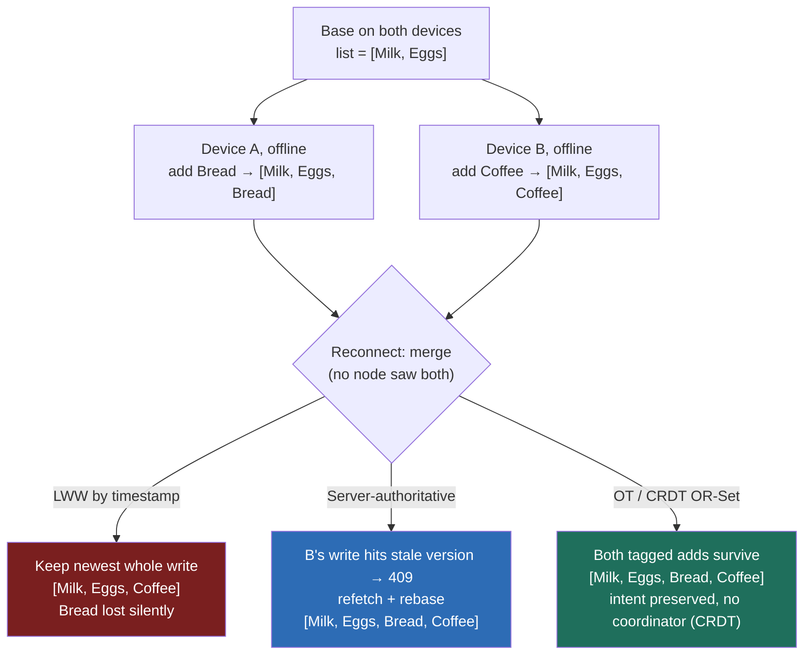

### Learning objectives
- Frame the core problem: when the same data is edited concurrently or offline on multiple replicas, no single node can impose an order, so you need a **convergence strategy** that makes every replica end identical while preserving user intent.
- Reason about the four client-conflict strategies, **Last-Write-Wins, server-authoritative optimistic concurrency, Operational Transformation, and CRDTs**, their mechanics, and, above all, their costs (silent loss, contention thrash, transformation complexity, metadata and tombstone growth).
- Match the strategy to the data's correctness need: LWW for independent scalar fields, CRDTs for mergeable collaborative structures with rich offline, OT where a central server already orders text edits, server-authoritative for money, inventory, and bookings.
- Quantify what CRDTs actually cost (per-element IDs, causal metadata, tombstone accumulation) so you never present them as free magic, and name the mitigations (delta encoding, garbage collection, compaction).

### Intuition first
Two roommates share one grocery list. Normally it lives on the fridge and they take turns writing on it, so there is never a conflict: one pen, one list, a single order of edits. That is the server, imposing one timeline.

Now give each of them a copy on their phone and send one into the basement with no signal. Upstairs, Ana adds "Bread." In the basement, offline, Ben adds "Coffee." Neither edit saw the other, and the fridge is gone, so when they meet in the kitchen there is **no authority that saw both edits in order.** They have to merge two divergent copies back into one, and the whole question here is the rule they use to do it.

- If the rule is "**the newer sticky note wins, throw the older one away**," Ben's list (written a minute later) replaces Ana's entirely, and "Bread" silently vanishes. That is **Last-Write-Wins**, and it just lost real intent.
- If the rule is "**you may only write to the fridge list if your copy still matches it**," then whoever gets to the fridge second finds it changed, has to re-copy the current list, and re-apply their addition on top. That is **server-authoritative optimistic concurrency**: no loss, but you cannot commit until you reach the fridge.
- If a **scribe** rewrites each person's change relative to what the other did ("you inserted at position 3, but they already inserted at position 2, so your insert shifts to position 4"), you get **Operational Transformation**, the machinery behind Google Docs.
- If **every item carries a unique invisible tag** so the two lists simply merge as a union, adds combine and a deletion stays a crossed-out entry that lingers, you get a **CRDT**: the copies converge with no fridge and no scribe, which is why it works peer-to-peer and offline, at the cost of carrying all those tags around.

The whole problem lives at the **merge point**, the moment two copies that could not see each other have to become one again with no authority present to break ties.

### Deep explanation

**The core problem is convergence plus intention preservation.** Concurrent or disconnected writes mean multiple replicas each hold a different version of the same record, and there is no shared clock and no single serialization point to say which happened "first." A merge strategy has to deliver two properties at once. **Convergence:** once all edits have propagated, every replica holds byte-identical state (no permanent divergence, no "it looks different on my phone"). **Intention preservation:** the merged result reflects what each user *meant*, so two independent additions both survive, rather than one clobbering the other. Convergence alone is easy (LWW converges fine, it just throws data away). The hard, valuable part is converging **and** keeping intent.

**First you have to know two edits even conflict, and that is causality, not clocks.** Before merging, you need to distinguish "these two edits are concurrent" (neither saw the other, a real conflict to resolve) from "this edit is a descendant of that one" (no conflict, just apply the newer). Wall-clock timestamps cannot tell you this, because clocks on two phones drift. The right tool is a **version vector** (one counter per replica, `{deviceA: 5, deviceB: 3}`): if one version dominates another element-wise, it happened after; if neither dominates, they are genuinely concurrent and the merge rule fires. Version vectors are how Dynamo-style stores, and CRDT libraries under the hood, detect concurrency without a global clock. This causality tracking is the substrate every strategy below sits on.

Now the four strategies, each with its mechanics and, more importantly for a Director, its cost.

**1. Last-Write-Wins (LWW).** Attach a timestamp or logical clock to each write; on conflict, keep the one with the highest value and drop the rest. It is dead simple, O(1) per field, no history to keep, and it always converges (all replicas pick the same max). The cost is brutal and quiet: it **loses the other edit with no error and no trace.** It is also **sensitive to clock skew**, because with raw wall-clock time a phone whose clock is 2 minutes fast wins every conflict regardless of who actually edited last. LWW is exactly right for an **independent single-value field** where the last setting genuinely should win, a profile's theme, a notification toggle, a display name, where there is no intent to preserve beyond "the most recent choice." It is catastrophic for a shared document or list, where dropping a concurrent edit means losing a paragraph someone wrote. This is the `LWW-Register`, and it is what Cassandra and DynamoDB use at the cell level, and what Redis Enterprise's active-active geo-replication uses for its register type. The Director-grade mitigation when you must use LWW is to timestamp with **server-assigned time or a hybrid logical clock**, never a raw client clock, so skew cannot hand the decision to the wrong device.

**2. Server-authoritative optimistic concurrency.** The client sends its edit tagged with the **base version** it read (a version number or ETag). The server does a compare-and-set: if the record is still at that version, it applies the write and bumps the version; if not, it **rejects** (HTTP 409 Conflict). The client then re-fetches the current state, **rebases** its change on top, and retries, or surfaces the conflict for the user to resolve. This gives **strong consistency with zero silent loss**, which is why it is the correct choice for correctness-critical data: money, inventory counts, seat bookings, anything with an invariant that a merge could violate. The costs are two. First, you **cannot commit while offline**, because committing requires the server to arbitrate, so this strategy fundamentally does not support disconnected editing. Second, it **thrashes under contention:** if k clients hammer the same record, only one wins per round and the other k-1 get 409s and retry, so expected retries scale roughly with k and throughput on a hot key collapses (the classic optimistic-concurrency-control failure). The rejected alternative is pessimistic locking (hold a lock while editing), which removes retries but blocks other writers and turns a slow or crashed client into a stuck record, so at scale optimistic concurrency plus a bounded retry usually wins, and a genuinely hot counter gets sharded or moved to a CRDT counter.

**3. Operational Transformation (OT).** Represent each edit as an **operation** against a position, `insert(pos, char)` or `delete(pos)`, and define a **transformation function** that rewrites one operation to account for a concurrent one so the two commute: if I insert at position 2 and you concurrently insert at position 5, your insert must be transformed to position 6 before it is applied on my replica, and vice versa, so both replicas converge to the same text with both insertions intact. This preserves intent beautifully for text and is what powers **Google Docs** (and Etherpad, and the old Google Wave). The cost is **implementation complexity**: the transformation matrix, every operation type against every other, is notoriously hard to get correct, and published OT algorithms have shipped with convergence bugs for years (Google Wave's OT took a large team roughly two years to stabilize). OT also **almost always needs a central server** to assign a single total order to operations, because the transforms are defined pairwise and the server is what linearizes them, so OT is a poor fit for true peer-to-peer or long-offline scenarios. Its metadata cost, by contrast, is low: operations are tiny and you do not carry per-character identity forever.

**4. CRDTs (Conflict-free Replicated Data Types).** Data types whose merge is **mathematically guaranteed to converge without any coordination**, because the merge operation is commutative, associative, and idempotent (a join in a semilattice), so replicas can apply concurrent updates in any order, any number of times, and still land identical. Two families: **state-based** (replicas ship their whole state and merge by the join, simple but bandwidth-heavy, tamed by delta-CRDTs that ship only changes) and **op-based** (replicas broadcast operations that must be delivered in causal order but are designed to commute). The catalog you should be able to name: `G-Counter` (grow-only, one counter per replica, merge by taking the max of each), `PN-Counter` (two G-Counters, one for increments and one for decrements), `LWW-Register`, `OR-Set` (observed-remove set, each add carries a unique tag and a remove deletes only the tags it has *seen*, so concurrent add-wins), and **sequence CRDTs** like RGA for ordered text, where every character gets a unique, densely-orderable identifier. CRDTs are what let **Figma** (a custom CRDT-style model), **Automerge**, and **Yjs** merge with **no central coordinator**, working peer-to-peer and fully offline. That is the superpower.

The cost of a CRDT is the part interviewers listen for, because it is where "free magic" answers fall apart. CRDTs pay **metadata overhead** and **tombstone growth.** Every element carries a unique ID plus causal metadata (which replica, which counter), so the in-memory and on-the-wire size can dwarf the visible data. Deletions cannot be forgotten immediately: an `OR-Set` remove or a deleted character becomes a **tombstone** that lingers, because a concurrent operation elsewhere might still reference it, and dropping it too early would break convergence. Over a long-lived, heavily-edited document the tombstones can outnumber the live content. Concretely: early Automerge (pre-2.0) could balloon a plain-text document to **roughly 100x** its raw size in memory once you counted per-character IDs and history, so a 100 KB document became multiple megabytes; Automerge 2.0's columnar, run-length-encoded format cut that to low single-digit multiples on disk. **Yjs** is the leaner design, using a compact optimized struct store and **garbage-collecting** deleted content down to a minimal deleted-id range, which is why a Yjs document is commonly cited as an order of magnitude smaller than early Automerge for the same edits. The mitigation you must name is **compaction and tombstone GC**: once a version vector proves every replica has seen a delete (causal stability), the tombstone can finally be dropped, and delta encoding keeps the sync payload proportional to what changed rather than to full state.

**Two concepts tie the strategies together.** **Intention preservation** is what separates the good strategies (OT, CRDTs) from LWW: the merge should reflect what each user meant, not just pick a survivor. And **three-way merge** is the trick behind non-lossy reconciliation: instead of comparing only the two divergent copies, you compare each against their **common ancestor** (the base), exactly like `git merge`, which distinguishes "only Ana changed this line" (take it) from "both changed this line" (a real conflict). LWW is a degenerate two-way merge with a coin flip; OT and CRDTs bake intention preservation into the data type itself.

**Choosing, in one breath:** LWW for independent scalar fields where newest genuinely should win; **CRDTs for collaborative or mergeable structures** (text, lists, sets), especially when rich offline editing matters and you do not want a coordinator; **OT** when you already run a central server and need collaborative text and can afford to get the transforms right; **server-authoritative** for anything where correctness beats availability and a wrong merge is unacceptable. The single deciding question is: *if two concurrent edits merge automatically, can that ever produce a semantically wrong result?* If yes (double-booked seat, negative balance), you need the server to arbitrate; if no (two people adding list items), a CRDT lets you merge without one.

Go deeper - the semilattice math behind CRDT convergence (IC depth, optional)

A state-based CRDT is a **join-semilattice**: states form a partial order, and any two states have a **least upper bound** (LUB) computed by the `merge` function. Convergence follows because `merge` is:

- **Commutative:** `merge(a, b) = merge(b, a)`, so order of receipt does not matter.
- **Associative:** `merge(merge(a, b), c) = merge(a, merge(b, c))`, so grouping does not matter.
- **Idempotent:** `merge(a, a) = a`, so a message delivered twice is harmless.

Together these mean an unreliable, unordered, duplicating network still converges as long as every update eventually arrives (the Strong Eventual Consistency, SEC, guarantee: replicas that have received the same set of updates are in the same state, regardless of order). A `G-Counter` is the canonical example: state is a map `replica -> count`, `merge` is element-wise `max`, and the counter value is the sum. Op-based CRDTs trade this for smaller messages but require **causal-order delivery** (an exactly-once, causally-ordered broadcast layer), which is why op-based systems lean on a reliable log or a version-vector-tagged message bus.

Go deeper - sequence CRDTs, the interleaving anomaly, and tombstone GC (IC depth, optional)

Text is the hard CRDT because order matters and positions shift. Sequence CRDTs (RGA, Logoot, Treedoc, Fugue) give every character a **unique, densely-orderable ID** so an insert names its left neighbor rather than a numeric position that concurrent edits would invalidate. The classic failure mode is the **interleaving anomaly**: two users each type a word at the same spot and a naive sequence CRDT can interleave their characters ("HWEOLRLLDO"), which converges but reads as garbage, a pure intention-preservation bug; newer algorithms (Fugue, and fixes in Yjs/Automerge) close it.

Tombstone garbage collection is the operational tax. You cannot drop a tombstone until you can prove no future concurrent operation could reference it, which needs **causal stability**: a version vector showing every replica has observed the delete. Yjs GCs deleted content aggressively, keeping only a small deleted-item range; Automerge historically kept more history for time-travel. The trade is time-travel and offline-divergence tolerance (keep tombstones longer) versus memory (drop them sooner), and a device offline for a month forces you to retain everything back to its last-seen version, which is why sync protocols track a per-device low-water mark.

### Diagram: one conflict, four resolutions

```mermaid
flowchart TB
  BASE["Base on both devices<br/>list = [Milk, Eggs]"]
  BASE --> A["Device A, offline<br/>add Bread → [Milk, Eggs, Bread]"]
  BASE --> B["Device B, offline<br/>add Coffee → [Milk, Eggs, Coffee]"]
  A --> M{"Reconnect: merge<br/>(no node saw both)"}
  B --> M
  M -->|LWW by timestamp| LWW["Keep newest whole write<br/>[Milk, Eggs, Coffee]<br/>Bread lost silently"]
  M -->|Server-authoritative| SRV["B's write hits stale version → 409<br/>refetch + rebase<br/>[Milk, Eggs, Bread, Coffee]"]
  M -->|OT / CRDT OR-Set| CR["Both tagged adds survive<br/>[Milk, Eggs, Bread, Coffee]<br/>intent preserved, no coordinator (CRDT)"]
  style LWW fill:#7a1f1f,color:#fff
  style SRV fill:#2d6cb5,color:#fff
  style CR fill:#1f6f5c,color:#fff
```

The base state diverges into two offline edits that never saw each other; the merge rule is the entire decision. LWW converges but destroys intent, server-authoritative preserves intent but needed the round-trip and a rebase, and the CRDT preserves intent with no coordinator at all, which is what it is paying its metadata for.

### Worked example: a collaborative notes app synced offline on two devices
A shared notes product (think a Notion-style page or a shared checklist) syncs across a laptop and a phone, and both must stay editable offline. A single page has a **title** (one scalar field) and a **body** that is an ordered list of blocks. On a flight, the laptop is offline and the phone is on spotty wifi. On the laptop, the user renames the page and adds a block "Book venue." On the phone, concurrently, they add a block "Email caterer." Walk the three viable strategies.

- **LWW everywhere (the naive build).** Both the title and the body use `LWW-Register` on the whole field. The title is fine: last rename wins, and there was no competing title edit, so intent is intact. The body is a disaster: the body is one register holding the whole block list, so when the phone's version (with "Email caterer") merges against the laptop's (with "Book venue"), whichever timestamp is higher wins and the other block **vanishes with no error**. The user loses a task and never knows. This is the single most common real-world sync bug, LWW applied at the wrong granularity, to a structure that has intent to preserve.

- **Server-authoritative optimistic concurrency.** The body edit carries the base version. The laptop reconnects first and commits, bumping the page to v8. The phone then tries to commit its "Email caterer" block against base v7, the server sees v8, returns **409**, the phone re-fetches v8 (now containing "Book venue"), **rebases** its block on top, and commits v9 with both blocks. Nothing is lost. The price the user paid: neither edit was durable until it reached the server, so a phone that stayed offline for the whole flight held an uncommitted, at-risk change the entire time, and if two blocks had truly collided the user would have seen a conflict prompt. Correct for a bank ledger; heavy and offline-hostile for a notes app.

- **CRDT (the right fit here).** The body is an `OR-Set` of blocks (or a sequence CRDT if block order must merge too). Each block gets a unique tag on creation, so "Book venue" and "Email caterer" are distinct tagged elements, and the merge is a **union**: both survive automatically, on both devices, with **no server arbitration and no round-trip**, which is exactly what makes the offline flight work. The title stays a `LWW-Register` inside the same CRDT document, because a title genuinely wants last-write-wins. The cost is explicit and worth stating out loud: each block and each character carries an ID and causal metadata, so the synced document is larger than its visible text (with Yjs, modest; with early Automerge, potentially tens of times larger), and every deleted block leaves a **tombstone** until a version vector proves both devices have seen the delete, at which point GC can reclaim it. Choosing Yjs over Automerge here is a deliberate trade: leaner memory and faster sync versus Automerge's richer history and time-travel.

The Director signal is not "I used a CRDT." It is: *title is LWW because last-write genuinely should win; body is a CRDT because two concurrent additions must both survive offline with no coordinator; and I know that costs per-element metadata and tombstone growth, which I bound with Yjs-style GC and delta sync, and if any of this were money or inventory I would switch to server-authoritative because a merge could then produce a wrong answer.*

### Trade-offs table: the four strategies
| Dimension | **Last-Write-Wins** | **Server-authoritative (OCC)** | **Operational Transformation** | **CRDT** |
|---|---|---|---|---|
| Convergence guarantee | yes (picks max) | yes (server serializes) | yes (if transforms correct) | yes (mathematically, any order) |
| Intent preservation | **no** (drops the loser) | yes (rejects, no loss) | yes (for text) | yes (concurrent edits merge) |
| Offline commit | yes (but lossy) | **no** (needs server) | limited (needs ordering server) | **yes** (peer-to-peer, disconnected) |
| Implementation complexity | trivial | low to medium | **very high** (transform matrix) | high (library-provided) |
| Metadata / memory cost | ~none (one timestamp) | low (a version per record) | low (small ops) | **high** (per-element IDs + tombstones) |
| Needs central server | no | **yes** | usually yes (order ops) | no |
| **Use when** | independent scalar fields (settings, flags) where newest should win | money, inventory, bookings, correctness > availability | central-server text collaboration you can invest in | mergeable structures (text, lists, sets) with rich offline, no coordinator |

### What interviewers probe here
- **"Two devices edit the same record offline, how do the writes merge?"** *Strong signal:* you start by asking **what the data is and whether an automatic merge could ever be semantically wrong**, then pick per data shape: LWW for independent scalars, CRDT for collaborative structures, server-authoritative for correctness-critical, and you name convergence *and* intention preservation as the two goals. *Red flag:* one strategy for everything, especially "just use timestamps / last-write-wins" applied to a shared document.
- **"You proposed a CRDT. What does it cost?"** *Strong:* you name **metadata overhead (per-element IDs, causal metadata) and tombstone growth**, quantify it (early Automerge ~100x raw size, Yjs an order of magnitude leaner), and name the mitigation (delta sync, tombstone GC on causal stability, compaction). *Red flag:* treating CRDTs as free magic with no size or memory cost, which signals you have read the headline but not run one.
- **"When would you NOT use a CRDT?"** *Strong:* when a merge could violate an invariant (double-booked seat, negative balance), because a CRDT converges but does not enforce business rules, so you switch to **server-authoritative** and accept losing offline commit. *Red flag:* reaching for CRDTs because they are trendy, on data where correctness must beat availability.
- **"Why does Google Docs use OT while Figma uses CRDTs?"** *Strong:* OT preserves text intent with tiny operations but needs a central server to order them and a hard-to-verify transform matrix; Figma's canvas is a tree of objects that merge cleanly as a CRDT with no coordinator, and Figma accepts the metadata cost for coordinator-free multiplayer. *Red flag:* thinking one is simply newer or better rather than a fit to the data and the topology.
- **"You used client timestamps for LWW, what breaks?"** *Strong:* **clock skew**, a fast phone clock wins every conflict; fix with server time or a hybrid logical clock, and detect true concurrency with **version vectors** rather than wall clocks. *Red flag:* trusting raw device clocks for ordering.

### Common mistakes / misconceptions
- **LWW on a collaborative structure.** Applying last-write-wins to a shared document or list drops concurrent edits with no error, the most common silent data-loss bug in sync systems. LWW belongs on independent scalar fields, not on anything with intent to merge.
- **Treating CRDTs as free.** CRDTs converge automatically, but they carry per-element IDs, causal metadata, and tombstones that never leave until GC proves it is safe, so memory and payload can balloon (early Automerge ~100x) without compaction and delta encoding.
- **Wall-clock timestamps for ordering.** Device clocks drift, so raw timestamps make "last write" nondeterministic and hand conflicts to whoever's clock runs fast; use server time or a hybrid logical clock, and use version vectors to detect concurrency at all.
- **Confusing convergence with correctness.** A CRDT guarantees all replicas end identical, not that the result obeys your invariants. Two "book seat 12A" operations merge to a converged, double-booked state; if a merge can be semantically wrong, you need server arbitration, not a CRDT.
- **Assuming OT is coordinator-free.** OT needs a central server to totally order operations and a transformation matrix that is famously bug-prone; it is not a drop-in for peer-to-peer or long-offline, where a CRDT fits better.

### Practice questions

**Q1.** A settings screen (theme, language, notification toggles) syncs across a user's phone and laptop, sometimes edited offline on both. What conflict strategy, and why not a CRDT?
> *Model:* These are **independent scalar fields** with no intent to merge, the last chosen value should win, so **per-field Last-Write-Wins** is correct and a CRDT would be over-engineering (you would pay per-element metadata to model a set of single values that never need union). The one real risk is clock skew, so I timestamp with **server time or a hybrid logical clock**, not the raw device clock, so a fast phone clock cannot silently win every conflict, and I detect genuine concurrency with a version vector rather than trusting wall time. Crucially I apply LWW **per field, not to the whole settings object**, so changing the theme on one device and the language on the other both survive rather than one overwriting the whole blob.

**Q2.** A shared to-do list is edited offline on two devices; each adds a task. Walk LWW versus a CRDT, and name the CRDT's cost.
> *Model:* With **LWW on the list**, whichever device's write has the higher timestamp overwrites the other, so one added task **disappears silently**, unacceptable for collaborative data. With a **CRDT** (an OR-Set of tasks, each task tagged with a unique ID on creation), the merge is a union: both additions survive on both devices with no server round-trip, which is what makes the offline case work. The cost I would name out loud: each task carries an ID and causal metadata, and a deleted task leaves a **tombstone** until a version vector proves both devices have seen the delete, so memory and sync payload grow with edit history. I would use **Yjs** (compact store, aggressive tombstone GC) over early **Automerge** (which could inflate a document by roughly 100x before its columnar rewrite), and bound growth with delta sync and compaction.

**Q3.** A booking system lets users reserve seats, and the mobile app supports offline. Would you use a CRDT so bookings merge cleanly? Defend your answer.
> *Model:* No. A CRDT would **converge** two offline "reserve seat 12A" operations, but it would converge to a **double-booked, invariant-violating** state, because a CRDT preserves intent, it does not enforce business rules. Seat inventory is correctness-critical, so I use **server-authoritative optimistic concurrency**: the booking commits only when the server confirms the seat is free at the client's base version, otherwise it returns a 409 and the client re-fetches and either rebases or tells the user the seat is gone. I consciously give up offline commit for bookings, because for money and inventory correctness must beat availability. I might still let the client *hold* an offline intent and reconcile on reconnect, but the authoritative decision, and any user-visible "reserved," happens only after the server arbitrates.

**Q4.** Your team ships a CRDT-based collaborative editor and, six months in, documents that have been heavily edited are slow to load and large to sync. What is happening and what do you do?
> *Model:* This is **tombstone and metadata accumulation.** Every deleted character or block left a tombstone that could not be dropped because some replica might still reference it, and the per-element IDs and causal metadata add up, so a document that looks small on screen carries a large hidden history. The fixes, in order: enable **tombstone garbage collection** once a version vector shows every active replica has reached causal stability past the delete (so it is provably safe to drop); switch sync to **delta/incremental encoding** so a client downloads only changes since its last version, not the whole state; run periodic **compaction / snapshotting** to collapse history into a compact base; and if we are on early Automerge, evaluate its columnar-encoded 2.x format or **Yjs**, which GCs deletions aggressively and is roughly an order of magnitude leaner. The trade to state: aggressive GC costs time-travel and tolerance for devices offline a very long time, since we must retain history back to the oldest unsynced replica's low-water mark.

### Key takeaways
- The problem is **convergence plus intention preservation**: with concurrent or offline edits there is no single node to impose an order, so the merge rule must make every replica identical **and** keep what each user meant. Convergence alone is easy; keeping intent is the value.
- **Last-Write-Wins** is trivial and O(1) but **loses the loser silently** and is clock-skew sensitive, so it fits independent scalar fields (settings) and is catastrophic on shared structures; timestamp with server time or a hybrid logical clock, never a raw device clock.
- **Server-authoritative optimistic concurrency** gives strong consistency with no loss (send base version, reject on mismatch, rebase), the right call for money, inventory, and bookings, but it **cannot commit offline** and thrashes under contention on hot records.
- **OT** preserves text intent with small operations and powers Google Docs, but needs a **central server** to order operations and a notoriously bug-prone transform matrix; **CRDTs** converge mathematically with **no coordinator** (Yjs, Automerge, Figma), which is what enables peer-to-peer and offline, at the cost of **per-element metadata and tombstone growth**.
- Match strategy to the data: the deciding question is *can an automatic merge ever be semantically wrong?* If yes, server-authoritative; if no and you need offline or coordinator-free, a CRDT; independent scalars, LWW. And never sell a CRDT as free, name the metadata, the tombstones, and the GC/compaction that bounds them.

> **Spaced-repetition recap:** Two roommates, one grocery list, and one of them goes offline: at the **merge point** no authority saw both edits, so the rule you pick decides everything. **LWW** = newest sticky note wins, trivial but drops the other edit silently, and clock skew breaks it, so use it only for independent scalar fields with server-time or HLC stamps. **Server-authoritative** = write only if your base version still matches, 409 then rebase, no loss and strong consistency, but no offline commit and it thrashes under contention, the right pick for money, inventory, bookings. **OT** = a scribe transforms each op against the other, powers Google Docs, preserves text intent, but needs a central server to order ops and a hard transform matrix. **CRDT** = every element carries a unique tag so copies merge with no coordinator (Yjs, Automerge, Figma), the offline and peer-to-peer superpower, paid for in **per-element metadata and tombstone growth** (early Automerge ~100x, Yjs far leaner) bounded by delta sync and GC on causal stability. Detect real concurrency with **version vectors**, not wall clocks, and remember convergence is not correctness: if a merge can violate an invariant, arbitrate on the server.
