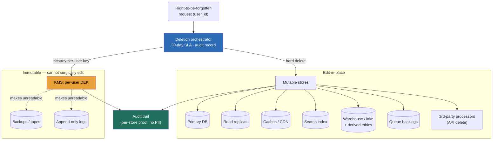

### Learning objectives
- State the **core reframe**: privacy law (GDPR right-to-be-forgotten, CCPA, DSARs) is an **architectural constraint**, not a policy PDF, and "delete a user" is a **distributed fan-out problem** across every store that ever touched their data, not a single `DELETE`.
- Reason that **data minimization is the cheapest privacy control there is**: every field you never collect is one you never have to inventory, secure, replicate, delete, or breach, so the Director lever is *collect less*, not *protect more*.
- Enumerate the **deletion blast radius**, primary DB, read replicas, caches, search indexes, warehouse/lake, derived and aggregate tables, message-queue backlogs, application logs, and third-party processors, and know you cannot delete what you cannot find (so PII classification and a data map come first).
- Pick the right deletion mechanism per store: **hard-delete** where you can edit in place, **crypto-shredding** (per-user key, destroy the key) for immutable backups and append-only logs you cannot surgically rewrite, and know when **anonymization** is the honest answer and when it is a lie.
- Treat the **30-day DSAR SLA and the audit trail** as first-class requirements: you must not only delete, you must *prove* you deleted, across every store, within the window, with a record that survives the user being gone.

### Intuition first
Imagine a customer asks a hotel chain to forget they ever stayed. Deleting their row in the front-desk reservation system is the easy part. But their name is also on a printed guest list at three properties, in last quarter's revenue report the finance team already mailed to the board, on the loyalty partner's mailing list, on the housekeeping log, in the nightly backup tapes locked in a vault, and in the CCTV retention archive. "Forget me" is not one erasure. It is a manhunt across every place a copy of that person leaked to, including the ones you cannot rewrite (the mailed report, the sealed tape) and the ones you handed to someone else (the loyalty partner).

That is exactly the shape of right-to-be-forgotten in a real software estate. The production database is the front desk. But the same person is fanned out into read replicas, caches, an Elasticsearch index, a data warehouse, a dozen derived tables, a Kafka topic still draining, gigabytes of application logs, and three SaaS processors you pay by API. Some of those you can edit in place; some, your backups and append-only logs, are immutable by design, and you cannot surgically cut one person out of a tape. The elegant trick for the immutable ones is to never store readable data there at all: encrypt each user's data under a key only they own a copy of, so "delete the user" collapses to "destroy one key," and the ciphertext on the tape turns to noise without touching the tape. Get this picture, fan-out plus crypto-shred for the immutable, plus a receipt that proves it, and the rest is detail.

### Deep explanation

**Privacy is a constraint on the architecture, not a document you write afterward.** GDPR Articles 17 (erasure) and 15 (access) and California's CCPA do not ask whether you have a privacy policy; they ask whether your system can, on request, *produce* everything you hold on a person and *delete* it, everywhere, on a clock. The Director-altitude statement: *a privacy requirement is a non-functional requirement with a fan-out and a deadline, and you design for it the same way you design for availability or latency.* You **reject** "we'll write a runbook when someone asks" because the first real DSAR will surface fifteen stores nobody mapped, miss the warehouse and the logs, blow the 30-day SLA, and leave you unable to prove what you did, which is itself a reportable failure. The constraint is structural, so it has to be designed in.

**You cannot delete, or even answer for, what you cannot find, so classification and a data map come first.** Before any deletion mechanism, you need a **PII inventory**: which fields are personal data (name, email, IP, device ID, precise location, anything that identifies a person directly or in combination), which systems hold them, and how a person is keyed in each (a `user_id` in the app DB, a hashed email in the warehouse, a cookie ID in the clickstream). This is **data mapping / data lineage**, and it is unglamorous but load-bearing: a DSAR cannot be satisfied against stores you forgot you had. The practical discipline is **tagging at ingestion** (mark a column `pii:email` in the catalog) and **lineage tracking** so that when a field is PII at the source, every derived table that carries it forward inherits the tag and shows up on the deletion list automatically, rather than being rediscovered by hand each time.

**Data minimization is the cheapest control, and it is the one most teams skip.** Every personal field you collect is a field you must now inventory, encrypt, replicate, include in every DSAR, delete on request, and report if it breaches. The math is blunt: the cost of a field is paid forever and across every store it fans into, while the cost of *not collecting it* is zero. So the first Director question on any design that touches users is not "how do we protect this data" but "do we need to collect it at all, and if so, for how long." **Purpose limitation** is the companion rule: you collect data for a stated purpose and may not silently repurpose it, which in architecture terms means you **tag data with its purpose and retention** at write time and let a **retention sweeper** auto-expire it (drop precise location after 30 days, raw logs after 90, downgrade to a coarse aggregate after a year). You **reject** "collect everything, we might want it later" because every "might" is permanent liability, a bigger breach surface, a slower DSAR, and a heavier deletion fan-out, for data you usually never use.

**Right-to-be-forgotten is a fan-out, and the failure is forgetting a store.** When a user invokes erasure, the deletion has to reach every place their data lives. The blast radius, in rough order of how often it is forgotten:

- **Primary DB**, the obvious one, a hard `DELETE` or anonymizing update on the user row and their child records.
- **Read replicas**, deletion propagates through normal replication, but you verify it landed rather than assume it.
- **Caches** (Redis, CDN, app-tier), the user's cached profile, session, and any keyed response must be evicted or it serves stale-but-deleted data for the TTL.
- **Search index** (Elasticsearch/OpenSearch), a separate store with its own copy; a DB delete does not touch it, you issue a matching delete-by-query.
- **Data warehouse / lake** (Snowflake, BigQuery, S3/Parquet), the analytical copy, often the largest forgotten surface, with the user fanned across raw, staging, and mart tables.
- **Derived and aggregate tables**, the subtle one, a user's row may have been rolled into a daily aggregate or a feature for an ML model; you decide per table whether to delete, recompute, or rely on the aggregate already being non-identifying.
- **Message queues / event backlogs** (Kafka topics, SQS), events still in flight carry PII; you handle the topic's retention and any consumer that will re-materialize the user downstream.
- **Application and access logs**, gigabytes of logs carrying user IDs, IPs, and request bodies, almost always overlooked, addressed by short log retention and PII scrubbing rather than per-line deletion.
- **Third-party processors**, every SaaS you forwarded the data to (Stripe, Segment, your email provider, analytics), each needs a deletion call or contractual deletion; their copy is your responsibility under the law.

The Director point: "delete the user" is an **orchestration** across all of these, not a query, and the single most common interview red flag is naming only the primary DB.

**Crypto-shredding is the answer for the stores you cannot surgically edit.** Backups and append-only logs are immutable by design, that is what makes them trustworthy, so you cannot cut one person out of last month's backup without destroying the backup's integrity, and you certainly cannot rewrite tape archives on demand. The elegant resolution: **encrypt each user's data with a per-user data key**, and store only ciphertext in the immutable stores. "Delete the user" then means **destroy that user's key** in the key store (a hard-deletable, mutable place), after which every copy of their ciphertext, in every backup, every old tape, every append-only log, becomes undecryptable noise. You did not touch the backups at all; you made them unreadable for that one person. This is **crypto-shredding** (or crypto-erasure), and it is the standard way to make right-to-be-forgotten compatible with immutable retention. The trade-off you state out loud: it requires per-user key management and the discipline that *all* of a user's data in those stores actually went through that key, miss one unencrypted path and the shred is incomplete; and key destruction must itself be irreversible and audited.

**Backup retention is exactly why hard-delete cannot be the whole answer.** A typical estate keeps backups on a **30 to 90 day rolling window** (and sometimes year-plus for compliance), precisely so it can recover from a bad deploy or ransomware. That creates a genuine tension: you just deleted a user from production, but their data still sits in last night's backup and will for the retention window. You **cannot** purge them from backups on demand without breaking the backups' immutability and point-in-time-restore guarantees. The honest, defensible posture, and the one regulators accept, is: hard-delete from live systems immediately, **let the backup naturally age out** within the documented retention window, and **crypto-shred** so the backed-up copy is unreadable in the meantime, plus a documented process that *if* a backup is ever restored, the deletion list is re-applied before the data goes live again. Saying "we hard-delete everywhere instantly including backups" is a tell that the candidate has not thought about retention.

**Pseudonymization is reversible and still personal data; anonymization is irreversible, and most "anonymized" data isn't.** **Pseudonymization** replaces direct identifiers with a token (swap `email` for `user_8f3a`) but keeps a mapping somewhere, so it is reversible and, under GDPR, *still personal data* with all the same obligations, useful for reducing breach blast radius, not for satisfying erasure. **Anonymization** is the irreversible removal of identifiability, after which the data is genuinely out of scope. The trap, and the one that catches sophisticated teams, is that data you call "anonymized" is often **re-identifiable**: strip the name but keep birth date, ZIP, and gender, and a famous result is that those three fields uniquely identify a large fraction of a population; keep a precise location trail and "anonymous" is a fiction. The Director judgment: anonymization is only honest when you have actually defended against **re-identification** (k-anonymity so each record is indistinguishable from at least k-1 others, generalization, suppression, or differential-privacy noise on aggregates), and you **reject** "we dropped the name column so it's anonymous now" because that is pseudonymization at best and a re-identification lawsuit at worst.

**Consent, purpose, and data residency are the other constraints the design must encode.** You track **consent** (what the user agreed to, when, for what purpose) as queryable state, because processing without a lawful basis is the violation, not just retaining data. **Data residency** (GDPR data staying in the EU, similar regimes elsewhere) is an architectural constraint on *where* the storage and compute physically sit, which shapes region selection and which third parties you may use. These do not change the deletion mechanics, but they are part of the same posture: the platform encodes consent, purpose, retention, and residency as first-class metadata, not tribal knowledge.

Go deeper — orchestrating the deletion fan-out and proving completion (IC depth, optional)

A production right-to-be-forgotten pipeline usually looks like a **saga / workflow orchestration**, not a synchronous call, because the stores are independent and some are slow:

- **Trigger and record.** A DSAR-erasure request creates a `deletion_request` row keyed by `user_id` with status `pending` and a 30-day deadline. This is the start of the audit trail.
- **Fan-out tasks, one per store.** The orchestrator (Temporal, Step Functions, or a homegrown workflow) emits a task per registered store: `delete:primary_db`, `delete:search_index`, `evict:cache`, `delete:warehouse`, `shred_key:backups`, `delete:logs_scrub`, plus one `api_delete:<vendor>` per third-party processor. Each store has a registered handler, and the **store registry is itself the data map**, adding a new store means registering its handler, which is how you stop forgetting stores.
- **Idempotency and retries.** Each handler is idempotent (deleting an already-deleted user is a no-op success) so the workflow can retry the flaky ones (a vendor API timing out) without double-counting. Third-party deletes are the long pole, some are async webhooks that confirm hours later.
- **Per-store confirmation.** Each handler returns a verifiable result, rows-affected, a delete-by-query acknowledgment, a key-destruction receipt from the KMS, a vendor's deletion confirmation ID, and writes it to the audit record. "Done" means *every* registered store reported success, not "we issued the deletes."
- **Crypto-shred specifics.** The per-user key is typically a **data-encryption key (DEK)** wrapped by a tenant or master key in a KMS (envelope encryption). Shredding destroys (or schedules destruction of) the DEK. Because KMS key deletion often has a mandatory waiting period, you record the scheduled-destruction timestamp as part of completion.
- **The audit record.** A tamper-evident log entry, ideally append-only / WORM, capturing `user_id`, request time, each store's deletion confirmation, the SLA deadline, and final completion time. This record must **outlive the user's data**: it stores the fact of deletion and the store-by-store proof, but no personal data itself (key off a salted hash of the user_id, not the email). When a regulator or the user asks "did you actually delete me," this record is the answer.
- **Verification sweep.** A periodic job re-queries a sample of stores for supposedly-deleted users and alarms if anything resurfaces (a replica that lagged, a pipeline that re-materialized the user from an un-shredded source), catching the silent-incomplete-deletion failure mode.

### Diagram: the deletion fan-out, hard-delete vs crypto-shred paths

### Worked example: right-to-be-forgotten across a microservices estate
A consumer fintech runs ~15 services: an account service on Postgres, a profile cache on Redis, transaction history in a Snowflake warehouse with a dozen derived tables, an Elasticsearch index for support search, a Kafka event bus, centralized logs in an ELK stack with 90-day retention, nightly Postgres backups on a 35-day window, and three processors (Stripe, an email vendor, a KYC vendor). A user invokes erasure. The clock is **30 days** (GDPR DSAR SLA), and "done" must be **provable**.

- **Path.** The request hits a **deletion orchestrator** that reads the **store registry** (the data map) and fans out one idempotent task per store. Postgres gets a hard delete of the user and child rows; replicas inherit it and are verified. Redis evicts the user's keys immediately rather than waiting on the 1-hour TTL. Elasticsearch gets a delete-by-query on `user_id`. Snowflake deletes from raw and staging; derived aggregates are checked, the `daily_active_by_region` rollup is already non-identifying so it stays, but a `user_feature_table` carries the ID and is deleted. Kafka's relevant topic has 7-day retention and a consumer that would re-materialize the user is told to skip them. Stripe, the email vendor, and the KYC vendor each get a deletion API call, and their confirmation IDs are recorded.
- **The immutable stores.** Backups (35-day window) and ELK logs cannot be surgically rewritten. The estate **crypto-shreds**: every user's PII in those paths was written under a per-user DEK in the KMS, so the orchestrator schedules **destruction of this user's DEK**, rendering their backed-up and logged data unreadable, and the backups simply age out of the 35-day window. **Rejected: hard-deleting from backups**, because it would break point-in-time restore and the backups' integrity, and you physically cannot rewrite the tapes on demand. **Rejected: waiting 35 days to call it done**, because crypto-shred makes the data unreadable *now*, so completion does not wait on backup expiry.
- **SLA and proof.** Most stores confirm in minutes; the KYC vendor's deletion is an async webhook that lands in 6 hours; one confirmation is the long pole at ~2 days, comfortably inside 30. The orchestrator marks the request `complete` only when **every registered store** has returned proof, and writes a **tamper-evident audit record** keyed off a salted hash of the user (not their email, which is now gone), capturing each store's confirmation, the key-destruction timestamp, the deadline, and the completion time.
- **Verification.** A weekly sweep re-queries a sample of deleted users across stores and alarms if anyone resurfaces, catching a lagging replica or a pipeline that re-created the user from an un-shredded source.

The number a Director brings out of this is not "we run a delete script"; it is *"every store including backups and logs, crypto-shred for the immutable ones, provably complete in ~2 days against a 30-day SLA, with a receipt that outlives the user."*

### Trade-offs table: deletion mechanisms
| Decision | Hard-delete (edit in place) | Crypto-shredding (destroy key) | Anonymization (irreversible) | Tombstone-and-sweep (mark, async purge) |
|---|---|---|---|---|
| **What it does** | physically removes the row/document | makes ciphertext unreadable by destroying the per-user key | strips/generalizes until non-identifying | flags deleted now, background job purges later |
| **Works on immutable stores?** | no, cannot rewrite backups/append-only logs | **yes, the whole point** | n/a (changes meaning of data) | partially, sweep still can't touch immutable |
| **Completeness risk** | misses stores you didn't enumerate | incomplete if any data bypassed the per-user key | re-identification if not actually anonymous | window where deleted data is still readable |
| **Cost / complexity** | low per store, high orchestration breadth | per-user key management overhead | hard to do correctly (k-anonymity, DP) | simple to mark, complex to guarantee the sweep |
| **Use when…** | live mutable stores you can edit | backups, append-only logs, any immutable store | you need to *retain* analytics but lose identity | high-volume deletes where sync is too slow |

The Director move is **per-store**: hard-delete the mutable stores, crypto-shred the immutable ones, anonymize only where you have genuinely defeated re-identification, and never present any single mechanism as the whole answer.

### What interviewers probe here
- **"A user invokes right-to-be-forgotten. Walk me through what actually happens."** *Strong signal:* enumerates **every** store, primary, replicas, caches, search, warehouse, derived tables, queues, logs, third parties, treats it as an orchestrated idempotent fan-out, crypto-shreds the immutable backups and logs, and produces an audit record proving completion inside the 30-day SLA. *Red flag:* `DELETE FROM users WHERE id = ?` and done, forgetting replicas, warehouse, search, logs, and backups, which is most of the actual exposure.
- **"What do you do about backups, you can't delete one user from a tape?"** *Strong:* names the retention-window tension, hard-deletes live and lets backups age out within the documented window, **crypto-shreds** so the backed-up copy is unreadable in the meantime, and re-applies the deletion list on any restore. *Red flag:* either "we delete from backups too" (breaks immutability and is often physically impossible) or "backups are out of scope" (they are personal data and in scope).
- **"How would you reduce your privacy risk and your deletion cost at the same time?"** *Strong:* leads with **data minimization and retention**, collect fewer fields, expire them automatically, because the cheapest data to protect, delete, and not-breach is data you never stored, and frames it as the highest-leverage control. *Red flag:* jumps straight to more encryption and tooling without questioning whether the data should exist.
- **"You say this dataset is anonymized, how do you know it can't be re-identified?"** *Strong:* distinguishes pseudonymization (reversible, still personal data) from true anonymization, names re-identification via quasi-identifiers (birth date + ZIP + gender), and points to k-anonymity / generalization / differential privacy as the actual defense. *Red flag:* "we removed the name column," which is pseudonymization wearing anonymization's name.

The through-line at Director altitude: privacy is a **fan-out with a deadline and a proof obligation**, and the cheapest control is collecting less. You own the *posture*, the data map, the per-store deletion contract, the audit trail, and you delegate the depth with a stated prior ("I'd have the security and data teams benchmark crypto-shred-per-user versus per-tenant key granularity against our backup-restore and key-management overhead; my prior is per-user keys for consumer data because the erasure unit is the user, and per-tenant only if key cardinality gets operationally unmanageable").

### Common mistakes / misconceptions
- **Treating deletion as a single `DELETE`.** The primary DB is a fraction of the exposure; the warehouse, derived tables, search index, caches, queues, logs, and third parties are where the data actually fans out, and a delete that names only the DB is incomplete by an order of magnitude.
- **Forgetting backups and logs.** Both are personal data and in scope, both are immutable in practice, and both are routinely omitted; the answer is crypto-shred plus retention-window aging, not a magic backup edit.
- **Collecting data you don't need.** Every field is permanent liability, more to inventory, secure, delete, and breach; minimization is the cheapest control and the one most teams skip in favor of more tooling.
- **Calling pseudonymized data "anonymized."** Reversible tokenization is still personal data, and "anonymous" datasets are routinely re-identified via quasi-identifiers; only defended-against-re-identification data is out of scope.
- **No audit trail.** If you cannot *prove* a deletion completed across every store within the SLA, you have not satisfied the requirement; the receipt has to outlive the user's data and carry no PII itself.

### Practice questions

**Q1.** A user submits a right-to-be-forgotten request against your e-commerce platform. The team's plan is "we run `DELETE FROM users`." Critique it and give the Director version.
> *Model:* That deletes the front desk and ignores the building. The user is also in read replicas, the Redis profile cache, the Elasticsearch product-search index, the Snowflake warehouse and its order-history and feature derived tables, the Kafka order-events backlog, 90 days of application logs, the 35-day backup window, and every processor we forwarded to (payment, email, analytics). The Director version is an **orchestrated, idempotent fan-out**: one registered deletion handler per store, hard-delete the mutable ones, **crypto-shred** the immutable backups and logs by destroying the user's per-user key, issue deletion APIs to third parties, and only mark the request complete when every registered store returns proof, all captured in a tamper-evident audit record inside the 30-day SLA. The store registry *is* the data map, so adding a store means registering its handler, which is how we stop forgetting stores.

**Q2.** Your retention policy keeps nightly backups for 35 days. Legal says a deleted user's data must be unrecoverable. You cannot rewrite backups. How do you satisfy both?
> *Model:* Crypto-shredding. Every user's PII that lands in backups (and append-only logs) is written under a **per-user data-encryption key** in the KMS. "Delete the user" schedules destruction of that key, so every backed-up copy of their ciphertext becomes undecryptable noise immediately, without touching the backups and without breaking point-in-time restore for everyone else. The backups then age out naturally within the 35-day window. I'd also document that *if* a backup is ever restored, the current deletion list is re-applied before the data goes live. Rejected: deleting from backups directly, it breaks immutability and integrity and is often physically impossible; rejected: declaring backups out of scope, they're personal data and in scope. The cost is per-user key management and the discipline that no PII path bypasses the key, which I'd have the security team verify.

**Q3.** A data scientist wants to keep a "fully anonymized" copy of user behavior for modeling, exempt from deletion requests. What questions do you ask before agreeing?
> *Model:* First, is it actually anonymized or just pseudonymized? If there's any mapping back to the user (a hashed ID, a reversible token), it's pseudonymized, still personal data, and still in scope for deletion, so the exemption is false. Second, even with direct identifiers gone, can it be **re-identified** from quasi-identifiers, birth date, ZIP, gender, a precise location trail, device fingerprint? Those combinations uniquely pick out individuals, so "we dropped the name" is not anonymization. To genuinely exempt it I'd require defended anonymization: generalization and suppression to a **k-anonymity** threshold (each record indistinguishable from at least k-1 others) or differential-privacy noise on the aggregates, validated by the security team. Cheaper and often sufficient: keep only **aggregates** that are non-identifying by construction, which sidesteps the whole question.

**Q4.** Beyond building the deletion machinery, what's the single highest-leverage thing you'd do to lower privacy risk across the platform, and why?
> *Model:* Data minimization with enforced retention. Every personal field we collect is liability paid forever and fanned across every store, more to inventory, encrypt, include in every DSAR, delete on request, and lose in a breach. The cheapest data to protect, delete, and not-breach is the data we never stored. Concretely: a collection review that drops fields we don't use, **purpose and retention tags** at write time, and a **retention sweeper** that auto-expires data (raw logs at 90 days, precise location at 30, downgrade to coarse aggregates after a year). This shrinks the breach blast radius, speeds every DSAR, and lightens the deletion fan-out simultaneously, one control improving all three. I'd pair it with PII classification so the data map driving deletion stays accurate. Rejected: "collect everything, we might want it," because every "might" is permanent risk for data we usually never use.

### Key takeaways
- **Privacy is an architectural constraint, not a policy PDF:** right-to-be-forgotten is a **distributed fan-out with a 30-day deadline and a proof obligation**, designed in like availability, not bolted on as a runbook.
- **You can't delete what you can't find:** PII classification, a data map, and lineage come first, and the **store registry is the data map**, so deletion is complete only across the stores you've actually enumerated (DB, replicas, caches, search, warehouse, derived tables, queues, logs, third parties).
- **Crypto-shredding is the answer for immutable stores:** encrypt each user's data under a per-user key and "delete" by destroying the key, which makes backups and append-only logs unreadable without rewriting them, the standard way to reconcile erasure with retention windows.
- **Data minimization is the cheapest control:** every field not collected is one you never inventory, secure, delete, or breach; minimization plus enforced retention lowers breach surface, DSAR cost, and deletion fan-out at once.
- **Anonymization is mostly a lie unless defended:** pseudonymization is reversible and still personal data, and "anonymized" datasets are routinely re-identified via quasi-identifiers, so only k-anonymity / generalization / DP-grade data is genuinely out of scope, and every deletion needs an **audit trail that outlives the user**.

> **Spaced-repetition recap:** Right-to-be-forgotten is the hotel-forgets-the-guest problem: deleting the front-desk row (primary DB) is the easy part, but the person is fanned out into **replicas, caches, search index, warehouse, derived tables, queue backlogs, logs, backups, and third-party processors**, so "delete" is an **orchestrated, idempotent fan-out**, not a `DELETE`. You **can't delete what you can't find** (PII map + lineage + a store registry come first); immutable stores (backups, append-only logs) get **crypto-shredded** (per-user key, destroy the key, ciphertext becomes noise) because you can't rewrite a tape and retention windows (30-90 days) forbid hard-delete there; the cheapest control is **data minimization + retention** (collect less, expire it). "Anonymized" is usually pseudonymized or re-identifiable, so only k-anonymity / DP data is out of scope, and every deletion needs an **audit trail with no PII that outlives the user** and proves completion within the **~30-day SLA**.

---

*End of Lesson 11.4. Privacy is a fan-out with a deadline and a receipt: enumerate every store, crypto-shred the immutable ones, collect less than you can, and prove you finished.*
