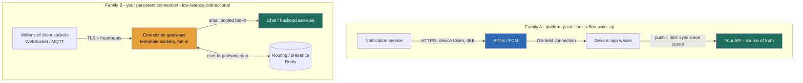

> Your app has no wire into the phone: the OS holds the only connection, and Apple or Google will slip your **4 KB best-effort note** under the door. The design reduces to one choice: ride platform push as a **wake-up hint** (never the payload of record), or run your own socket fleet and own the **C10M problem**, where idle connections cost ~100 GB of RAM per million and a tuned box tops out near 1 to 2 million. Chat needs both; a news digest needs only the hint.

### Learning objectives
- Choose between the **two delivery families**, platform push (APNs/FCM/WebPush) and your own **persistent connection** (WebSocket/MQTT), from product need, and justify the choice in latency, battery, and who-owns-the-scale terms.
- Design a push pipeline correctly by treating a push as a **best-effort wake-up hint**, not the payload of record, so the system stays correct despite dropped, duplicated, and out-of-order pushes.
- Own the **token lifecycle**, registration, rotation, invalidation feedback, and pruning of dead tokens, and explain why skipping it wastes spend and degrades deliverability.
- Reason about the **C10M problem**, per-socket memory, connection-gateway fan-in, sharding by user, and the heartbeat-versus-battery trade that keeps millions of idle sockets alive.
- Specify **end-to-end delivery guarantees** (at-least-once plus client dedupe, per-conversation ordering) and the split between a notification and true in-app real-time.

### Intuition first
Your app does not get its own wire into the phone. The operating system runs **one** wire, one battery-efficient connection that Apple or Google keeps open, and every app on the device shares it. Think of a large apartment building with a single front desk. You cannot run a private phone line up to each tenant, the building only allows the one the concierge already maintains. So when you want to reach a tenant, you hand the concierge a short note and they slip it under the door: **"a package arrived, come to the front desk."**

Two things follow from that image, and they are the whole lesson. First, **the note is not the package.** It is a hint. If the note blows off the mat, or gets slipped under twice, or arrives an hour late, nothing is lost, because the real thing is waiting at the front desk and the tenant collects it when they come down. That is why a well-designed push says "something changed, come sync," and the client then fetches the truth from your server. Second, if you genuinely need a live intercom, instant, two-way, always-on, you have to **run your own wire** and keep it powered. Now you are not handing notes to a concierge, you are operating a private telephone exchange with a line to every apartment at once. That is a WebSocket fleet, and the cost is millions of always-open lines and the battery they burn. The entire design space is choosing between the concierge's note and your own wire, per product.

### Deep explanation

#### 1. The two families, and when each is right
There are exactly two ways a server reaches a client that is not actively polling.

**Family A, platform push.** The OS holds one long-lived connection to the platform's push service, **APNs** (Apple Push Notification service) on iOS, **FCM** (Firebase Cloud Messaging) on Android, and **WebPush** for browsers. Your backend never talks to the device. Your notification service authenticates to APNs/FCM over HTTP/2 and hands them a small message addressed to a **device token**; they deliver it over the OS connection and wake your app (the note slipped under the door). You get battery efficiency for free, because the device maintains one radio-friendly connection for every app on it, not one per app. You pay for that with control: delivery is best-effort, unordered, size-limited (roughly a **4 KB** payload on both APNs and FCM), and entirely on the platform's terms.

**Family B, your own persistent connection.** The app opens a long-lived socket straight to your gateway, a **WebSocket** over TLS on 443, or **MQTT** (a lightweight pub/sub protocol built for exactly this, and what WhatsApp famously used). Now you have low latency, sub-100 ms server-to-client, and true bidirectional messaging. The cost is that **you** own the connection: millions of idle sockets, the memory they consume, the heartbeats that keep them alive, and the battery those heartbeats burn on the client. This is the C10M problem below.

The decision is a product-need decision, and stating it crisply is the signal. A **daily news digest or a marketing nudge** needs Family A only, there is no live interaction, latency of seconds-to-minutes is fine, and running a socket fleet for it would be pure waste. A **live chat, a collaborative editor, a multiplayer game, a trading ticker** needs Family B while the app is foregrounded, because a hint-and-fetch round trip cannot deliver the sub-second, bidirectional feel the product promises. Most real messaging apps use **both**: the socket when the app is open, and platform push as the fallback to wake the app when it is backgrounded or killed and the socket is gone.

#### 2. The push pipeline and the token lifecycle
The pipeline is short: **your notification service → APNs/FCM → device.** Getting it right is mostly about the parts around the delivery.

**Registration.** On launch the app asks the OS for a device token (an opaque address for this app-install on this device), and sends it to your backend, which stores it against the user. You send to the token, never to the device directly.

**Lifecycle is the part teams get wrong.** Tokens **rotate and go stale**: they change on app reinstall, OS restore to a new phone, or platform rotation, and they die when the user uninstalls. If you keep pushing to dead tokens you get three costs, wasted send spend, skewed delivery metrics, and, critically, **degraded deliverability**, because FCM and APNs treat a sender that keeps hammering invalid tokens as low-quality and can throttle you. So you must consume the **invalidation feedback** the platforms return (APNs returns a 410 "Unregistered" with a timestamp; FCM returns `UNREGISTERED`/`NOT_REGISTERED`) and **prune** those tokens on the spot. Token hygiene is an operational metric, not a nicety.

**Message controls you must know:**
- **Priority.** High priority wakes the device immediately; low/normal priority lets the OS batch and defer to save battery. Abuse high priority for non-urgent pushes and the OS penalizes you.
- **Silent / background push.** A content-available push that wakes the app to sync **without** showing the user anything. This is the purest expression of "push = wake, then fetch," but the OS rate-limits it hard (iOS may throttle background pushes to a few per hour), so you cannot rely on it as a data channel.
- **Collapse / dedupe key.** A collapse ID tells the platform "if an older undelivered push with this key is queued, replace it," so a device that was offline gets **one** "you have 5 new messages," not five stale ones.
- **TTL (time-to-live) / throttling.** You set how long the platform should try to deliver before dropping (FCM default is up to 4 weeks, but for a "live now" alert you set seconds). If the device is offline past TTL, the push is simply dropped.

#### 3. The one principle that makes the system correct: push = wake + sync
This is the load-bearing idea. **Platform push is best-effort. It is not guaranteed, not ordered, and size-limited.** A push can be dropped (device offline past TTL, OS throttling), duplicated (retried by the platform), delayed by minutes, or delivered out of order relative to another push. If you build as if each push reliably arrives exactly once in order, your product is wrong the first time a device spends an hour in a tunnel.

The fix is to treat every push as a **wake-up hint**: "something changed for you, come sync." The push carries an identifier or a badge count, not the content of record (the note, never the package). On receipt the client calls your server, "give me everything since my last sync cursor," and your server, which **is** the source of truth, returns the authoritative state. Now dropped, duplicate, and out-of-order pushes are all harmless: a dropped push just means the client syncs on next foreground; a duplicate triggers a redundant sync that returns nothing new; ordering does not matter because the client always pulls the full delta.

The **rejected alternative** is to "put the important data in the push and assume it arrives", ship the message body, the transaction amount, the OTP (one-time password) inside the push and treat delivery as reliable. This fails on every axis: the 4 KB cap truncates real content, best-effort delivery silently loses messages, duplicates double-count, and out-of-order pushes show a stale value as the latest. Payload-as-truth trades a correct system for a marginally-simpler client and is a red flag in review.

#### 4. Persistent connections and the C10M problem
When the product needs a socket, the hard part is scale, specifically **idle** scale. A chat backend might have millions of connected users of whom only a few percent are typing at any instant; the rest are **idle but connected**, and you pay to hold every one of those sockets open (a powered line to every apartment).

**Per-socket memory is the wall.** A TCP connection with a live TLS session carries kernel send/receive buffers plus application state, on the order of **tens to a few hundred KB each** at default tuning. At 100 KB per connection, **1 million** sockets is ~100 GB of RAM on one box before you have sent a single message, and the C10M goal (**10 million** connections on one machine) is out of reach until you shrink per-socket cost. This is why real systems tune kernel buffers down to a few KB, use lightweight event-driven runtimes (epoll/kqueue, Erlang/BEAM, Go, Netty) instead of a thread per connection, and terminate connections on purpose-built **connection gateways**. WhatsApp's well-known result, on the order of **1 to 2 million connections per server** after heavy FreeBSD/BEAM tuning, is a per-socket-memory achievement, not a message-throughput one.

**Connection gateways and fan-in.** You do not connect sockets straight to business logic. A tier of stateless **connection gateways** terminates the millions of client sockets, handles TLS and heartbeats, and **fans in** to a much smaller number of pooled backend connections, a large fan-in ratio, so a million clients might multiplex onto a few thousand backend connections. The gateway keeps a routing map of user → which gateway holds their socket (in a shared store like Redis) so that "deliver to user X" finds the right box. You **shard connections by user** across the gateway fleet so load spreads and a single box failure drops only its share of sockets, which then reconnect elsewhere.

**Heartbeats, the battery trade.** An idle TCP socket looks identical to a dead one, and carrier **NAT** (network address translation) gateways silently drop mappings for connections that go quiet (often after ~30 s to a few minutes). So both ends send periodic **heartbeats / keepalives**, to detect a dead peer and to keep the NAT mapping open. The interval is a direct **battery-versus-liveness** trade: a short interval (say **15 s**) detects drops fast and never loses the NAT mapping but wakes the phone radio constantly and drains battery; a long interval (**several minutes, up to ~300 s**) is gentle on battery but risks a dead-but-believed-alive socket and a lost NAT mapping. Production systems tune toward the longest interval that reliably survives the carrier's NAT timeout, often adaptively per network. **Presence** ("who is online") then falls out for free as a side effect: a live heartbeat means online, a missed one past a grace window means offline.

The **rejected alternative** to a persistent socket is **long-polling** (the client holds an HTTP request open until the server has data or a timeout fires, then immediately re-issues it). It works through any proxy and needs no special protocol, but each message costs a full HTTP request/response cycle and reconnect, so latency and overhead are higher and true server-push is simulated rather than real. Long-poll is the right fallback where WebSockets are blocked, not the primary design for a chat product.

Go deeper - shrinking per-socket cost and the wire protocols (IC depth, optional)

The mechanics behind the C10M numbers, the part you'd hand to a systems engineer to benchmark:

- **Where the memory goes.** Per connection you pay kernel socket send/receive buffers (`SO_SNDBUF`/`SO_RCVBUF`, often 64-256 KB default each), the TLS session state, and your app's per-connection object. Tuning `net.ipv4.tcp_rmem`/`tcp_wmem` down to a few KB, using a single shared read buffer, and terminating TLS efficiently is how a box goes from ~100k to ~1M+ sockets. You also raise `fs.file-max`/`ulimit -n` (a socket is a file descriptor) and expand the ephemeral port range and conntrack tables.
- **Event-driven, not thread-per-connection.** A thread per socket at ~1 MB of stack each caps you at low tens of thousands. Real gateways use `epoll`/`kqueue` event loops (Netty, libev), Go goroutines (~2-8 KB each), or the BEAM's lightweight processes (Erlang/Elixir), which is why WhatsApp ran on FreeBSD + Erlang.
- **MQTT vs raw WebSocket.** MQTT adds a compact binary framing, built-in QoS levels (0 fire-and-forget, 1 at-least-once, 2 exactly-once), a `keepalive` field the broker uses to declare a client dead, and a **last-will** message the broker publishes when a client drops, which gives you presence and offline detection for free. Raw WebSocket is just a framed byte pipe; you build QoS, keepalive, and presence yourself.
- **APNs/FCM auth and multiplexing.** Both are HTTP/2, so one connection **multiplexes** thousands of concurrent notification streams, you do not open a connection per push. APNs authenticates with either a provider certificate or, preferably, a short-lived **JWT** (JSON Web Token) signed with a p8 key; FCM uses OAuth2 service-account tokens. Respect the HTTP/2 flow-control and `GOAWAY` frames or the platform throttles you.

#### 5. Delivery guarantees, end to end
Combining the families gives you a correct end-to-end story:
- **At-least-once plus client dedupe.** Neither the socket path nor push is exactly-once in practice, so the server assigns each message a stable ID and the client **dedupes** on it. A redelivered message is dropped by the client, not shown twice.
- **Ordering per conversation.** Global ordering across everything is expensive and unnecessary; you guarantee order **within a conversation** using a per-conversation sequence number, and the client renders by sequence, not by arrival time.
- **The notification-versus-real-time split.** In-app, the socket delivers the live experience. When the app is backgrounded or killed and the socket is gone, platform push wakes it, and the client syncs the delta over HTTP. The two paths converge on the same server-side source of truth, which is what keeps them consistent.

The **Director lens** through all of this: **battery and deliverability are product metrics, not infra footnotes.** A push strategy that drains battery gets your app uninstalled; a token-hygiene failure that tanks deliverability means your notifications quietly stop arriving and retention drops with no error in your logs. You own the choice of hint-versus-socket by product need, and you own those two numbers as first-class outcomes.

### Diagram: platform-push pipeline and the persistent-socket gateway

```mermaid
flowchart TB
  subgraph PUSH[Family A - platform push - best-effort wake-up]
    NS[Notification service] -->|HTTP/2, device token, 4KB| APNS[APNs / FCM]
    APNS -->|OS-held connection| DEV1[Device: app wakes]
    DEV1 -->|"push = hint: sync since cursor"| API[Your API - source of truth]
  end
  subgraph SOCK[Family B - your persistent connection - low-latency, bidirectional]
    DEV2[Millions of client sockets<br/>WebSocket / MQTT] -->|TLS + heartbeats| GW[Connection gateways<br/>terminate sockets, fan-in]
    GW -->|small pooled fan-in| SVC[Chat / backend services]
    GW <-->|user to gateway map| RT[(Routing / presence<br/>Redis)]
  end
  style APNS fill:#2d6cb5,color:#fff
  style GW fill:#e8a13a,color:#000
  style API fill:#1f6f5c,color:#fff
  style SVC fill:#1f6f5c,color:#fff
```

### Worked example: a messaging app versus a news app
Two products, opposite answers, and the reasoning is the whole point.

**Messaging app (needs both).** While the app is **foregrounded**, chat runs over a **persistent WebSocket** (or MQTT) to a connection-gateway fleet, because live chat demands sub-100 ms bidirectional delivery, typing indicators, and presence that a hint-and-fetch loop cannot provide. Server-to-client messages carry a stable message ID and a per-conversation sequence; the client **dedupes** on the ID and renders by sequence, so at-least-once redelivery and out-of-order arrival are both harmless. Heartbeats run at the longest interval that survives carrier NAT (tuned per network, in the tens-of-seconds-to-few-minutes range) to protect battery, and presence falls out of the heartbeat.

When the app is **backgrounded or killed**, the socket is gone, so the server falls back to **platform push**. The push is a **wake-up hint**, high priority, a collapse key so a user offline for an hour gets one "3 new messages" instead of three stale ones, carrying a badge count and a conversation ID, **not** the message text as the record. On receipt the client (via a background sync or on next open) pulls the delta from the server. We **reject** putting message bodies in the push: the 4 KB cap truncates, best-effort loss drops messages silently, and duplicates would double-render. Tokens are pruned the moment APNs/FCM return `Unregistered`, or deliverability quietly rots.

**News app (needs Family A only).** A breaking-news alert or a daily digest is one-way, tolerates seconds-to-minutes of latency, and has no live interaction. So it uses **platform push only**, no socket fleet at all, and running one would burn user battery and infra budget for zero product benefit. The push is a **hint** ("new top story, tap to read"); the client opens and fetches the article from the CDN-backed API, which is the source of truth. TTL is short for a "live now" score update (drop it if stale) and long for an evergreen digest. We **reject** a persistent connection here precisely because there is nothing to keep it open **for**, the cost (millions of idle sockets, heartbeat battery drain) buys nothing the product needs.

The signal is not "I used WebSockets" or "I used FCM." It is: **socket where the product is live and bidirectional, platform push as a best-effort wake-hint everywhere else, push never carrying the payload of record, tokens pruned on invalidation, and the heartbeat interval named as a battery trade.**

### Trade-offs table: platform push vs WebSocket vs long-poll
| Dimension | **Platform push (APNs/FCM/WebPush)** | **WebSocket / MQTT (your socket)** | **Long-poll** |
|---|---|---|---|
| Latency | seconds to minutes, best-effort | sub-100 ms, real server push | request-cycle bound, higher |
| Battery | excellent (one OS connection, shared) | you pay it via heartbeats | poor (constant reconnects) |
| Delivery guarantee | **best-effort**, unordered, ~4 KB cap | at-least-once + your dedupe/ordering | at-least-once + dedupe |
| Bidirectional | no (server → client only) | **yes**, full duplex | no (client-initiated) |
| Who owns the scale | the platform (Apple/Google) | **you** (millions of sockets, C10M) | you (many open HTTP requests) |
| Works when app is | backgrounded / killed too | only while app is running | only while app is running |
| **Use when** | wake-hints, digests, alerts, background sync | live chat, collab, gaming, tickers | WebSockets blocked; simple fallback |

### What interviewers probe here
- **"How do you deliver a message to a phone that isn't polling?"** - *Strong:* names the **two families**, platform push versus your own persistent socket, and picks by product need, low-latency bidirectional → socket, one-way alert → platform push, chat → both. *Red flag:* only knows one mechanism, or thinks the backend opens a connection "to the device" directly.
- **"Is push guaranteed to arrive?"** - *Strong:* immediately says **no, best-effort, unordered, size-limited**, and therefore designs **push = wake-up hint, client syncs the truth from the server**, so drops/dupes/reorders are harmless. *Red flag:* puts the payload of record in the push and assumes exactly-once ordered delivery.
- **"You have 10 million connected users. Size the fleet."** - *Strong:* reasons in **per-socket memory** (tens-to-hundreds of KB → ~100 GB per million at 100 KB), tunes buffers, uses event-driven gateways, terminates on a **connection-gateway tier** that fans in to backend, shards by user, and quotes a realistic per-box ceiling (~1-2M). *Red flag:* "just add more app servers," no notion that idle sockets cost memory.
- **"How often do you heartbeat?"** - *Strong:* frames it as a **battery-versus-liveness/NAT** trade, longest interval that survives carrier NAT timeout, adaptive per network, and gets **presence** as a byproduct. *Red flag:* a fixed aggressive interval with no mention of battery or NAT.
- **"What about stale device tokens?"** - *Strong:* consumes **invalidation feedback** (APNs 410, FCM `UNREGISTERED`) and prunes, because dead tokens waste spend and **degrade deliverability**. *Red flag:* never revisits tokens, treats registration as one-and-done.

### Common mistakes / misconceptions
- **Treating push as reliable transport.** Platform push is best-effort, unordered, and ~4 KB capped. Building on "it always arrives exactly once" breaks the first time a device is offline; push is a **wake-up hint**, and the client must sync the truth from your server.
- **Payload-as-record.** Shipping the message body, OTP, or balance inside the push and displaying it as authoritative, truncation, silent loss, and duplicate double-counting follow. Carry an ID/badge, fetch the content.
- **Ignoring token lifecycle.** Tokens rotate and die; not consuming invalidation feedback and pruning dead tokens wastes send budget and **degrades deliverability** as the platform down-ranks a sender hammering invalid tokens.
- **Underestimating idle-socket cost.** A connected-but-silent user still consumes per-socket memory; "we have 5M users online" is a **C10M memory** problem (~100 GB per million at 100 KB), not a throughput one. Needs gateway termination, buffer tuning, and sharding.
- **A socket for a job that needs a hint.** Running a persistent-connection fleet for daily digests or alerts burns user battery (heartbeats) and infra for no product benefit; platform push is the correct, cheaper tool when there is no live bidirectional need.

### Practice questions
**Q1.** Your team wants to guarantee chat messages by putting the full message text in the FCM/APNs push so it shows instantly even if the app is closed. What is wrong, and what do you do instead?

Model answer, try yours out loud first

> *Model:* Platform push is best-effort, unordered, and ~4 KB capped, so this is wrong on every axis: long messages truncate, an offline device past TTL loses the message entirely with no error, a platform retry duplicates and double-renders it, and two pushes can arrive out of order and show a stale line as newest. Instead treat the push as a **wake-up hint**, carry a conversation ID and a badge count, not the text, and on receipt have the client **sync the delta** from the server, which is the source of truth, deduping on a stable message ID and rendering by per-conversation sequence. Now drops, dupes, and reorders are all harmless. The push exists to say "come sync," never to be the record.

**Q2.** A chat product must keep 10 million users connected for live delivery. Walk me through the fleet and the dominant cost.

Model answer, try yours out loud first

> *Model:* The dominant cost is **per-socket memory**, not message throughput, because most of those 10M are idle-but-connected. A TLS TCP socket runs tens-to-hundreds of KB of kernel buffers plus app state; at ~100 KB that is ~100 GB of RAM **per million** connections before any traffic. So I terminate sockets on a tier of stateless **connection gateways** running an event-driven runtime (epoll/BEAM/Netty, not thread-per-connection) with kernel buffers tuned down, target a realistic ~1-2M connections per box, and shard users across the fleet. Gateways fan in to a much smaller pool of backend connections and keep a user→gateway routing map in Redis so "deliver to user X" finds the right box. A box failure drops only its shard, which reconnects elsewhere. I'd delegate the exact buffer-tuning and per-box ceiling to a benchmark; my prior is MQTT/WebSocket on a BEAM or Go gateway.

**Q3.** How do you set the heartbeat interval on a mobile persistent connection, and what does it give you besides liveness?

Model answer, try yours out loud first

> *Model:* It is a **battery-versus-liveness/NAT** trade. Idle sockets are indistinguishable from dead ones, and carrier NAT gateways silently drop quiet mappings after ~30 s to a few minutes, so both ends must heartbeat to detect dead peers and keep the mapping open. A short interval (~15 s) detects failure fast and never loses NAT but wakes the radio constantly and drains battery; a long interval (up to ~300 s) saves battery but risks a dead-but-believed-alive socket and a lost mapping. I tune toward the **longest interval that reliably survives the carrier's NAT timeout**, often adaptively per network. As a byproduct I get **presence** for free: a live heartbeat means online, a missed one past a grace window means offline.

**Q4.** A daily-digest feature is being built on a persistent WebSocket "for consistency with chat." Is that the right call?

Model answer, try yours out loud first

> *Model:* No. A daily digest is one-way and tolerates seconds-to-minutes of latency, so it has no live-bidirectional need that a socket exists to serve. Running a socket fleet for it means paying millions of idle sockets and, worse, burning **user battery** on heartbeats for a feature that could be a single **platform push** hint. The right design is Family A only: send a low/normal-priority push ("your digest is ready"), client opens and fetches from the API. Reserve the socket for the foregrounded live experience. The trade I'm naming: the socket buys nothing here and costs battery and infra, so platform push is strictly better for a wake-and-fetch workload.

**Q5.** Notification open-rates are quietly falling and send costs are rising. Where do you look first?

Model answer, try yours out loud first

> *Model:* First suspect is **token lifecycle / deliverability rot**. Tokens rotate and die on reinstall, device restore, and uninstall; if we are not consuming invalidation feedback (APNs 410 `Unregistered`, FCM `UNREGISTERED`) and pruning dead tokens, we keep paying to send to addresses that no longer exist, which both inflates cost and makes the platform **down-rank us as a low-quality sender**, throttling even our valid pushes. So: instrument the invalidation responses, prune on the spot, and track "active valid tokens" and per-platform delivery/throttle rates as product metrics. I'd also check whether we're overusing high-priority or background pushes, which the OS penalizes. Deliverability and battery are product metrics, not infra footnotes, and this is a classic case of one silently decaying.

### Key takeaways
- There are **two delivery families**: **platform push** (APNs/FCM/WebPush), where the OS holds one battery-efficient connection and you send best-effort ~4 KB messages to a token, and **your own persistent connection** (WebSocket/MQTT), which buys sub-100 ms bidirectional delivery at the cost of owning millions of sockets. Pick by product need; chat needs both.
- **Platform push is best-effort, unordered, and size-limited**, so design **push = wake-up hint, client syncs the truth from the server**. This makes the system correct despite dropped, duplicate, and out-of-order pushes; putting the payload of record in the push is the rejected anti-pattern.
- **Own the token lifecycle.** Tokens rotate and die; consume invalidation feedback (APNs 410, FCM `UNREGISTERED`) and prune dead tokens, or you waste spend and **degrade deliverability** as the platform down-ranks you.
- **Persistent connections are a C10M memory problem.** Idle sockets cost tens-to-hundreds of KB each (~100 GB per million); terminate on event-driven **connection gateways** that fan in to backend, tune buffers, shard by user, and target ~1-2M per box. Heartbeats are a **battery-versus-NAT-liveness** trade and give you presence for free.
- **Battery and deliverability are product metrics.** End-to-end you deliver **at-least-once with client dedupe** and **per-conversation ordering**, splitting live in-app delivery (socket) from the backgrounded wake-hint (push), both converging on one server-side source of truth.

> **Spaced-repetition recap:** Your app has no private wire into the phone, the **OS runs one connection** and hands your note to the **concierge** (APNs/FCM/WebPush). The note is **best-effort and ~4 KB**, so it is a **wake-up hint** ("come sync"), never the payload of record, which keeps you correct through drops, dupes, and reorders; the client fetches the truth from your server. Need live, bidirectional, sub-100 ms? Run **your own socket** (WebSocket/MQTT) and pay the **C10M** cost: idle sockets are ~100 GB of RAM per million, so terminate on **connection gateways** that fan in, tune buffers, shard by user, ~1-2M per box. **Heartbeats** (~15-300 s) trade battery against NAT-liveness and hand you presence free. **Prune dead tokens** on invalidation or deliverability rots. End to end: **at-least-once + client dedupe, per-conversation order**; socket while foregrounded, push to wake when backgrounded. Chat needs both; a news digest needs only the hint.
