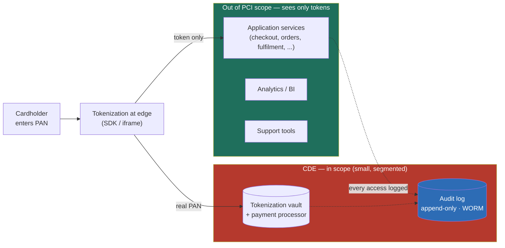

### Learning objectives
- State the **core reframe**: compliance is not a phase you pass before launch, it is a **property the platform enforces by construction**, so that the audit is a read of evidence the system already produced, not a quarter of heroics.
- Name what each regime **forces into the architecture**: SOC 2 forces audit-by-default and periodic access review; PCI-DSS forces a segmented cardholder-data environment and pushes you toward tokenization; HIPAA forces encryption, access control, and a chain of Business Associate Agreements over PHI.
- Reason about **scope reduction** as the highest-leverage move: tokenization and network segmentation pull most of your services *out of scope*, turning a 200-service audit into a 12-service one, and the cost difference is measured in auditor-weeks and engineer-quarters.
- Hold the **retention floor vs deletion ceiling** tension explicitly: SOX/finance may require keeping records 7 years while privacy law requires deletion on request, and reconcile it with scoped retention, tokenized references, and legal hold rather than pretending one wins.
- Decide between **controls-as-code with continuous evidence** (Vanta/Drata-style automation, policy-as-code) and the manual annual scramble, and quantify the operating-cost difference so the trade-off is a number, not a vibe.

### Intuition first
Think of compliance the way a commercial kitchen thinks about a health inspection. The amateur version is the night before the inspector arrives: scrub the floors, hide the expired stock, coach the staff on what to say. It is exhausting, it is theater, and the kitchen is filthy again by Tuesday. The professional version is a kitchen **built so that passing is the default**: the walk-in logs its own temperature every fifteen minutes, the prep stations are physically separated so raw chicken cannot touch the salad line, every delivery is signed in, and the manager reviews the logs on a fixed cadence. When the inspector walks in unannounced, there is nothing to prepare, the evidence has been accumulating all along, and the inspection is a thirty-minute read of records the kitchen produces anyway.

That is the entire thesis. **Compliance done well is the second kitchen.** The regulated zone (where the cardholder data, or the health records, or the production secrets live) is physically and logically separated from everything else, so a contaminating mistake in one station cannot reach another. The system **logs who did what to what, when, immutably**, so the answer to "show me" is a query, not an archaeology dig. And the controls are checked **continuously, by code**, not assembled into a binder once a year. A Director's job is to translate the inspector's rulebook (SOC 2, PCI, HIPAA) into how the kitchen is *built*, so the team never has to pull an all-nighter before the audit, because there is nothing left to fake.

### Deep explanation

**Compliance is architecture or it is theater, and the choice is made early.** Treated as a phase, compliance becomes a per-team tax: every squad re-implements its own audit logging, its own access reviews, its own encryption, mostly wrong, mostly inconsistent, and the audit becomes a frantic reconciliation of forty different interpretations of the same control. Treated as a platform property, compliance becomes a **paved road**: the platform team builds audit logging, segmentation, encryption, and evidence collection *once*, as defaults every service inherits, and a team is compliant by using the road rather than by reading the standard. The Director-altitude statement is that **you do not make services compliant, you make compliance the cheapest path**, and you **reject** "each team owns its own controls" because it multiplies the surface, guarantees drift, and turns one audit into N audits, each finding something different.

**SOC 2 forces audit-by-default and access discipline, and it is the broadest, lowest-floor regime.** SOC 2 is built on Trust Services Criteria (Security is mandatory; Availability, Confidentiality, Processing Integrity, and Privacy are added per your scope), and a Type II report covers a *period* (typically 6 to 12 months), so it certifies that your controls **operated continuously**, not that they existed on one day. Architecturally that forces three things. **Audit logging as a first-class system**: every privileged action, every access to sensitive data, every config change is recorded with actor, action, target, and timestamp, and the log is retained (commonly 1 year hot for query, longer in cold storage). **Periodic access review**: entitlements are recertified on a cadence (quarterly is the common bar), and the system has to *produce the list* of who can touch what, which is only cheap if identity and access flow through a central plane. **Change management with evidence**: every production change traces to a ticket, a review, and an approval. You **reject** "we'll write the audit logs when the auditor asks" because audit logs you cannot reconstruct after the fact are worthless, and a Type II covers a backward-looking period you cannot retroactively populate.

**PCI-DSS forces a segmented cardholder-data environment, and its decisive lever is scope reduction.** PCI applies to the **CDE**, the cardholder-data environment, defined as every system that stores, processes, or transmits the primary account number (the PAN, the 16-digit card number), plus everything connected to it. The trap is that "connected to it" is contagious: a flat network drags every service into scope, and the audit (and the controls: segmentation, logging, scanning, penetration testing, file-integrity monitoring) applies to all of them. The high-leverage move is to **shrink the CDE**. **Network segmentation** isolates the regulated zone so the rest of the system is provably out of scope. **Tokenization** goes further: replace the PAN with a meaningless token at the edge, store the real PAN only inside a small tokenization vault (or hand it to a provider like Stripe or a token service so it never enters your systems at all), and now the dozens of services that only ever see the token are *out of scope by construction* because they never touch cardholder data. The Director framing: **you do not secure 200 services to PCI standard, you make 188 of them never see a PAN**, and you **reject** "encrypt the PAN everywhere and call it scoped out" because encrypted cardholder data is still cardholder data, still in scope, and you have bought audit burden without buying scope reduction.

**HIPAA forces encryption, access control, and a contractual chain over PHI.** HIPAA governs **PHI**, protected health information, and its Security Rule splits into administrative, physical, and technical safeguards. Architecturally the load-bearing requirements are **access control** (unique user identity, role-based access to PHI, automatic logoff), **audit controls** (the same who-touched-what-when log SOC 2 wants, now legally mandated over PHI specifically), **encryption** of PHI at rest and in transit (technically "addressable" rather than strictly "required," but in practice the only defensible choice, and the safe-harbor that exempts encrypted-data breaches from the most painful notification rules), and **integrity** controls. The dimension engineers underweight is the **Business Associate Agreement**: any vendor that touches PHI on your behalf (your cloud provider, your logging SaaS, your analytics tool) must sign a BAA, and that contractual chain is part of the architecture, because choosing a sub-processor that will not sign a BAA is choosing not to use it for PHI. You **reject** "we'll lock down the app and ignore the vendors" because a BAA gap with a downstream processor is a compliance hole no application control can close.

**Audit logging is the spine all three regimes lean on, and it has to be tamper-evident.** The shared requirement under SOC 2, PCI, and HIPAA is the same: **who did what to what, when**, recorded reliably and kept long enough. Built well, it is an append-only, immutable pipeline: actions emit structured events, the events flow to write-once storage (object storage with object-lock / WORM, or a log store with retention locks), and access to the log itself is itself logged. **Tamper-evidence** matters because an attacker who can edit the audit log can erase their own footprints, so the bar is that the log is at minimum append-only and ideally hash-chained, so any deletion or edit is detectable. Retention is **tiered to control cost**: a common shape is 1 year hot (indexed, queryable for investigations and access reviews) and up to 7 years cold (cheap object storage, retrievable for an audit or a legal request), because keeping years of high-cardinality audit logs in a hot search index is a five-to-ten-times-more-expensive choice for data you read once a year.

**The retention floor versus deletion ceiling is the genuine conflict, and you reconcile it, you do not resolve it.** Two legal forces pull in opposite directions. **Retention floors** require you to *keep* data: SOX and financial regulation commonly mandate keeping transaction records for 7 years; HIPAA retention runs to 6 years; tax and audit obligations add their own floors. **Deletion ceilings** require you to *erase* data: privacy law (GDPR's right-to-be-forgotten, CCPA's right-to-delete) gives a person the right to demand their personal data be deleted, typically within 30 days. When a user who placed a financial transaction asks to be forgotten, you cannot both keep the record for 7 years and delete it in 30 days. The reconciliation a Director carries: **deletion obligations apply to personal data, retention floors apply to the regulated record**, and the design separates the two. You delete the **identity** (name, email, the linkage that makes the record *about a person*) and retain the **transaction** in a de-identified or tokenized form that satisfies the financial floor without holding personal data. Where a genuine **legal hold** applies (litigation, active investigation), it overrides the deletion request, lawfully, and the system has to support a hold flag that suspends deletion for specific records. You **reject** "just delete everything on request" because it breaks a financial-retention obligation and exposes you to a different regulator, and you **reject** "retention always wins, ignore deletion requests" because it is a privacy violation with its own penalties; the answer is **scoped retention plus tokenized de-identification plus legal hold**, designed in, not argued about per request.

**Controls-as-code turns the annual scramble into continuous evidence.** The manual model is a quarter of an engineer's time, every year, screenshotting configs and chasing teams for proof, and it certifies a point in time that has already drifted. The continuous model encodes the controls as **policy-as-code** and **automated evidence collection**: tools in the Vanta/Drata/Secureframe class connect to your cloud, identity provider, code host, and ticketing system, and continuously check the controls (is MFA enforced, is encryption on, did every prod change have a review, are access reviews current) and **collect the evidence automatically**, so the audit is a read of a dashboard that has been green all year. Infrastructure-as-code with policy guardrails (OPA / cloud-native policy engines) makes non-compliant infrastructure *un-deployable*: a storage bucket without encryption fails the policy check and never ships. The trade is real, those tools cost on the order of tens of thousands of dollars a year and take weeks to wire up, but they replace a recurring engineer-quarter (call it $50k+ of loaded time per audit cycle, more across multiple frameworks) and, more importantly, they shift the failure mode from "we discovered we drifted at audit time" to "the drift was blocked at deploy time." You **reject** the manual binder for any organization past its first audit, because it does not scale across frameworks and it certifies a fiction.

Go deeper — the mechanics of scope reduction, tokenization, and audit-log integrity (IC depth, optional)

- **How tokenization actually removes scope.** A tokenization service replaces a PAN with a surrogate value (a token) that has no mathematical relationship to the original (unlike encryption, where the ciphertext is derived from the plaintext and the key, so possession of the key reverses it). The mapping token→PAN lives only in the tokenization vault. Format-preserving tokens keep the shape (last-4 visible, same length) so downstream systems and UIs work unchanged. Because the surrogate is not cardholder data and is not reversible without vault access, any system that only ever holds tokens is genuinely out of CDE scope under PCI's "store, process, or transmit" test. This is why payment platforms tokenize at the absolute edge (often in the iframe/SDK the cardholder types into, so the PAN never reaches your servers, the SAQ-A or A-EP path) — the earlier you tokenize, the smaller the CDE.

- **Segmentation and the scope-validation penetration test.** PCI lets you treat a segmented network as out of scope, but you must *prove* the segmentation with a penetration test that confirms the out-of-scope zone genuinely cannot reach the CDE. So segmentation is not just firewall rules; it is firewall rules plus an annual (or semi-annual for service providers) test that the isolation holds. Microsegmentation (per-workload identity and policy, e.g. via a service mesh with mTLS) tightens this further by making "connected to the CDE" a per-service allow-list rather than a network-topology accident.

- **Hash-chained / Merkle audit logs for tamper-evidence.** Append-only is the floor; tamper-*evident* is the bar. A common construction hashes each log entry together with the hash of the previous entry (a hash chain), so altering or deleting any historical entry breaks the chain at that point and every subsequent hash, making tampering detectable without trusting the storage layer. Periodically publishing the chain head (e.g. to a separate trust domain or a notarization service) gives external verifiability. Cloud-native equivalents: object storage with object-lock in compliance mode (WORM, the retention cannot be shortened even by an admin) and immutable-ledger databases (e.g. QLDB-style) that maintain a cryptographically verifiable history.

- **Encryption ≠ scope reduction (the common confusion).** Under PCI, encrypted cardholder data is *still* cardholder data and the encrypting system is in scope; encryption is a required *control within* the CDE, not a way out of it. The only standard ways to remove data from scope are to not store it, or to tokenize it such that the surrogate is unrecoverable without separately-scoped vault access. This is the single most common scoping mistake teams make.

- **Right-to-be-forgotten across replicas, backups, and derived stores.** A deletion request is not a single `DELETE`; personal data has propagated to read replicas, search indexes, caches, data-warehouse copies, and backups. Replicas and indexes are handled by the deletion pipeline; backups are typically handled by **retention expiry plus crypto-shredding** (encrypt each user's data under a per-user key and destroy the key to render restored backups unreadable for that user) rather than rewriting immutable backup sets. Derived analytical stores are handled by re-deriving from the now-deleted source on the next build. The deletion must itself be logged (you have to prove you deleted), which is its own small retention obligation.

### Diagram: PCI scope reduction via tokenization and segmentation

### Worked example: making a payments platform PCI-compliant
A commerce platform has roughly 200 microservices: checkout, cart, orders, fulfilment, fraud, support tooling, analytics, the lot. Cards are taken at checkout. The naive read is "we handle cards, so the whole platform is PCI in scope," which would mean PCI controls, logging, scanning, and an annual penetration test across all 200 services, plausibly an **engineer-year of recurring work plus weeks of auditor time**.

- **Tokenize at the edge.** The cardholder's PAN is captured by the processor's SDK in the browser (Stripe Elements or equivalent) and exchanged for a token *before it reaches our servers*. Our checkout service receives a token and a last-4, never the full PAN. *Rejected: capturing the PAN on our own server and tokenizing internally*, because that drags our checkout fleet and its network into the CDE and forces the heavy SAQ-D audit path; capturing in the SDK keeps the PAN off our infrastructure entirely.
- **Segment what is left.** The tokenization vault and the processor integration live in a tightly segmented zone with its own firewall, logging, and access control. A scope-validation penetration test proves the rest of the network cannot reach it. *Rejected: a flat network*, because connectivity is contagious and would re-scope everything we just removed.
- **Count what left scope.** Of ~200 services, the ones that ever touch cardholder data number around **8 to 12** (the vault, the processor adapter, the few that initiate a charge). The other **~190 see only tokens and are out of scope by construction.** That is the difference between auditing 200 services and auditing a dozen: roughly a **15-to-20-times reduction** in audited surface, and the recurring cost falls from an engineer-year toward an engineer-month-or-two.
- **Audit-log access and set retention.** Every access to the vault and every charge is written to an append-only, WORM audit log: actor, action, token reference (never the PAN), timestamp. Retention is **1 year hot** for investigations and access reviews, **7 years cold** to satisfy financial-record obligations, tiered so the cold years sit in cheap object storage.

The number a Director brings out of this is not "we are PCI compliant"; it is *"we tokenize at the edge so 190 of 200 services never see a card, the CDE is a dozen segmented services, and the audit is a read of evidence we already produce."*

### Trade-offs table: scope and control strategy
| Decision | Broad scope (everything regulated) | Scope reduction (tokenize + segment) | Per-team controls | Platform paved road + controls-as-code |
|---|---|---|---|---|
| **What it costs** | controls on every service; engineer-year/audit | small CDE; weeks of audit; vault to run | duplicated effort; drift; N interpretations | platform build once; tooling $ tens of k/yr |
| **Audit effort** | huge, every service in scope | small, a dozen services in scope | painful reconciliation of inconsistent controls | a dashboard read, evidence continuous |
| **Risk** | wide blast radius if any service slips | concentrated, well-guarded CDE | silent gaps, inconsistent enforcement | drift blocked at deploy, not found at audit |
| **Use when…** | never by choice; only legacy you haven't reduced | regulated data is identifiable and tokenizable | a one-team startup pre-first-audit | any org past its first audit / multi-framework |

The Director move is to **shrink scope first, then pave the road**: reduce what is regulated to the smallest possible zone, then make the controls over that zone a platform default with automated evidence, rather than securing everything everywhere by hand.

### What interviewers probe here
- **"Make this system SOC 2 / PCI / HIPAA compliant. Go."** *Strong signal:* names what *each* regime forces into the design (SOC 2 → audit-by-default and quarterly access review; PCI → a segmented CDE and tokenization to shrink it; HIPAA → encryption, access control, and BAAs over PHI), and leads with **scope reduction** before controls. *Red flag:* "we'll get certified later" or treating it as a paperwork exercise that does not touch the architecture, the signal that the candidate thinks compliance is a phase, not a property.
- **"How do you keep this from being a tax on every team?"** *Strong:* compliance as a **paved road**, the platform provides audit logging, segmentation, encryption, and evidence collection as defaults every service inherits, so a team is compliant by using the road; quantifies the duplication avoided. *Red flag:* "each team owns their own controls," which guarantees drift, N inconsistent interpretations, and N audit findings.
- **"A user invokes right-to-be-forgotten on a transaction you must keep for 7 years. What happens?"** *Strong:* separates the **personal identity** (deletable) from the **regulated record** (retained), deletes the linkage, retains a de-identified/tokenized transaction to satisfy the financial floor, and honors legal hold where it applies; names the conflict explicitly. *Red flag:* "we just delete it" (breaks retention) or "we ignore the request" (breaks privacy), either one shows the tension was never seen.
- **"How does the audit actually work, day to day?"** *Strong:* continuous evidence via controls-as-code (policy-as-code blocks non-compliant infra at deploy; evidence is collected automatically; the audit is a read of an always-green dashboard), with the cost trade stated against the manual engineer-quarter. *Red flag:* describes the annual screenshot scramble as normal, accepting that controls drift between audits.

The through-line at Director altitude: translate the auditor's rulebook into **platform guardrails** so compliance is audit-by-default, reduce scope before you add controls, and delegate the depth with a stated prior ("I'd have the security and GRC team validate the tokenization vendor's SAQ-A boundary and run the scope-validation pen test; my prior is edge tokenization with a third-party vault, because it keeps the PAN off our infrastructure and pulls ~95% of services out of scope").

### Common mistakes / misconceptions
- **Treating compliance as a phase or paperwork, not architecture.** "We'll certify later" means retrofitting audit logs you cannot reconstruct and controls that fight the existing design; the regimes have to shape the architecture from the start, or the audit is heroics.
- **Not reducing scope.** Leaving the whole system in the CDE (or treating every service as touching PHI) multiplies controls, audit effort, and risk; tokenization and segmentation that pull most services out of scope are the single highest-leverage move and are often skipped.
- **Audit logging as an afterthought.** Bolting on logs at audit time misses the period a Type II covers and the tamper-evidence the regimes assume; the log has to be append-only, immutable, and continuous from the start.
- **Leaving the retention-vs-deletion conflict unhandled.** Pretending one obligation simply wins breaks the other regulator; the design has to separate deletable personal identity from the retained regulated record, with legal hold as an explicit override.
- **Every team reinventing controls.** Per-team audit logging, access reviews, and encryption guarantee inconsistency and drift; the controls belong in the platform as paved-road defaults, built once.

### Practice questions

**Q1.** A startup taking credit cards says "we'll deal with PCI after we hit scale." What do you tell them, and what's the first architectural move?
> *Model:* PCI applies the moment you store, process, or transmit a card number, so "later" is not optional, it is already in effect, and retrofitting it onto a flat architecture is far more expensive than building it in. The first move is **scope reduction, not control-hardening**: tokenize the card at the absolute edge using the processor's SDK so the PAN never reaches your servers, which puts you on the lightweight SAQ-A path instead of the heavy SAQ-D, and means almost none of your services are ever in the cardholder-data environment. The discipline is to make the regulated zone as small as possible *before* you write a single PCI control, because a control over a dozen segmented services is cheap and a control over 200 is an engineer-year. Compliance here is an architecture decision made on day one, not a certification bought at scale.

**Q2.** A user exercises GDPR right-to-be-forgotten, but they have transactions you're legally required to keep for 7 years. Walk through the design.
> *Model:* These two obligations genuinely conflict, and the answer is to **separate the person from the record**. The deletion right covers *personal data*, so I delete the identity and its linkage: name, email, address, and the key that makes the transaction "about" this individual. The retention floor covers the *financial record*, so I keep the transaction in a **de-identified / tokenized** form (amounts, dates, a non-reversible reference) that satisfies SOX/finance without holding personal data. If a **legal hold** is active (litigation, investigation), it lawfully overrides the deletion request for the specific records under hold, and the system supports a hold flag that suspends deletion. The deletion itself is logged, because I have to be able to prove I honored it, and that propagates across replicas, search indexes, and derived analytical stores, with backups handled by crypto-shredding the per-user key rather than rewriting immutable backup sets. The Director point: this is a *designed reconciliation*, scoped retention plus de-identification plus legal hold, not a per-request argument about which law wins.

**Q3.** Your org is going for SOC 2, PCI, and HIPAA at once. How do you keep this from consuming the whole engineering year?
> *Model:* The three regimes share most of their load-bearing requirements, **audit logging, access control, encryption, change management**, so I build those *once* in the platform as paved-road defaults rather than three times per framework. Audit logging is a single append-only, immutable pipeline every service emits to; access flows through one identity plane so access reviews are a query, not a survey; encryption at rest and in transit is a deploy-time default that non-compliant infrastructure cannot bypass. Then I layer **controls-as-code** (Vanta/Drata-class tooling plus policy-as-code) to collect evidence continuously and map one set of controls to all three frameworks' overlapping requirements, so the audit is a dashboard read instead of a per-framework scramble. The cost trade is explicit: the tooling runs tens of thousands a year and weeks to wire up, against a recurring engineer-quarter per framework done manually, plus the bigger win that drift is blocked at deploy rather than discovered at audit. The regime-specific deltas (PCI's CDE pen test, HIPAA's BAAs) are the only places I do bespoke work; everything common is platform.

**Q4.** Why is encryption *not* a way to take a service out of PCI scope, and what is?
> *Model:* Because under PCI, encrypted cardholder data is *still cardholder data*, and a system that holds it (even encrypted) is still storing it under the "store, process, or transmit" test, so it stays in the CDE; encryption is a required control *inside* the CDE, not an exit from it. The confusion is that encryption feels like it makes the data safe-and-therefore-out, but the ciphertext is reversible with the key, and the key lives in your environment, so the data has not actually left. The two real ways out of scope are: **don't store it at all** (let the processor hold it), or **tokenize** it so the surrogate has no mathematical relationship to the PAN and is unrecoverable without separately-scoped vault access, which makes any token-only service genuinely out of scope. The lever is removing the data's *identity as cardholder data*, not obscuring it, and that is the most common scoping mistake teams make.

### Key takeaways
- **Compliance is a platform property, not a phase.** Build audit logging, segmentation, encryption, and evidence collection once as paved-road defaults every service inherits; the audit becomes a read of evidence the system already produced, not a quarter of heroics.
- **Each regime forces specific architecture:** SOC 2 → audit-by-default plus periodic (quarterly) access review over a 6-to-12-month period; PCI → a segmented cardholder-data environment and tokenization to shrink it; HIPAA → encryption, access control, and BAAs over PHI.
- **Scope reduction is the highest-leverage move.** Tokenize at the edge and segment the network so most services never touch regulated data and are out of scope by construction, turning a 200-service audit into a dozen-service one, a 15-to-20-times reduction in audited surface.
- **Reconcile retention floors vs deletion ceilings by design:** delete the personal identity, retain the de-identified/tokenized regulated record to satisfy the 7-year floor, and honor legal hold as an explicit override; never let "just delete it" or "just keep it" break the other regulator.
- **Controls-as-code beats the annual scramble.** Policy-as-code blocks non-compliant infrastructure at deploy and evidence is collected continuously, shifting the failure mode from "discovered drift at audit" to "blocked at deploy," for tens of thousands a year against a recurring engineer-quarter.

> **Spaced-repetition recap:** Compliance is the **second kitchen**, built so passing the inspection is the default. Make it a **platform property, not a per-team tax**: each regime forces specific architecture (SOC 2 → audit-by-default + access review; PCI → segmented CDE + tokenization; HIPAA → encryption + access control + BAAs over PHI). The biggest lever is **scope reduction**, tokenize at the edge and segment so ~190 of 200 services never see regulated data and leave scope by construction. Audit logging is the shared spine, append-only, tamper-evident, tiered (1yr hot / 7yr cold). Reconcile the **retention floor vs deletion ceiling** by deleting personal identity while retaining the de-identified record, with legal hold as override. Use **controls-as-code** for continuous evidence so the audit is a dashboard read, not an annual scramble.

---

*End of Lesson 11.5. Translate the auditor's rulebook into platform guardrails, shrink scope before you add controls, and make compliance audit-by-default rather than heroics at audit time.*
