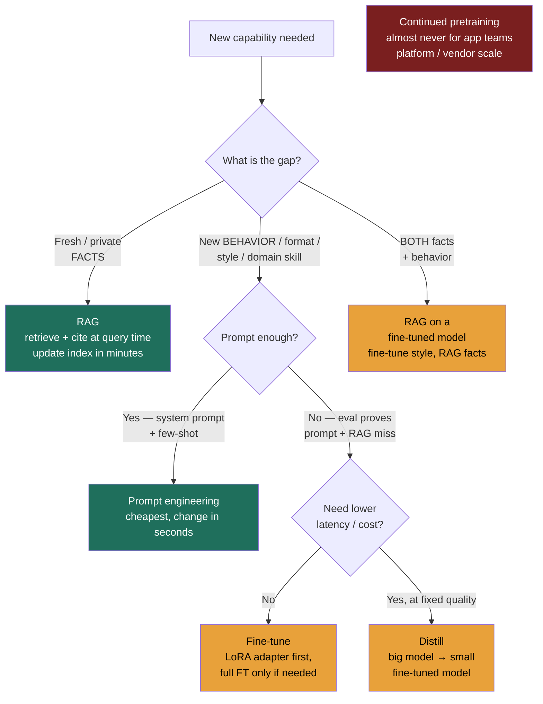

### Learning objectives
- Lay out the **adaptation spectrum** cheapest/fastest → most expensive — prompt engineering → context engineering / RAG → fine-tuning (LoRA, then full) → continued pretraining — and know that you **climb it only when eval proves the rung below can't hit the bar.**
- Apply the **one decision rule that scores**: fresh/private **facts → RAG**; new **behavior/format/style/skill → fine-tune**; both → RAG **on** a fine-tuned model; lower latency/cost at fixed quality → **distill** into a smaller fine-tune. State the misconception out loud: **fine-tuning teaches behavior, not facts.**
- Price fine-tuning correctly — **LoRA/PEFT** (small swappable adapter, cheap) vs **full fine-tune** (expensive, one model) — and recognize that the real cost is **data curation + an eval harness + retraining as the base model moves**, not GPU hours.
- Name the operational tax a Director owns: a fine-tune **locks you to a base-model version**, so every base upgrade is a re-curate-and-retrain project, not a config flip.
- Default to **prompt + RAG**, and treat fine-tuning as **earning-the-right** — only after prompt/RAG demonstrably fail, and only with data, an eval, and an ops plan in hand.

### Intuition first
Adapting a model is like getting a brilliant new hire productive in your company. The **cheapest move is a good briefing**: a clear job description and a few worked examples ("here's how we write a ticket; reply in this format"). That's **prompt engineering** — instant, free to change, the first thing you try.

When the job needs **facts the hire doesn't have and that keep changing** — this quarter's pricing, last week's policy, a customer's account history — you don't send them back to school to memorize it. You **hand them the right document at the moment they need it.** That's **context engineering / RAG**: the facts live in a binder the hire reads from on each task, and you can update the binder in five minutes without re-hiring anyone.

You only **send someone for real training** when the gap isn't knowledge but **ingrained skill or style** — they need to *think* like your senior staff, always produce output in your house format, speak in your brand voice. Training reshapes how they work; it does **not** reliably stuff in facts (and a half-remembered fact recited confidently is worse than a binder lookup). That's **fine-tuning**. And **rebuilding their schooling from scratch** — continued pretraining — is something almost no team does; you hire someone already schooled.

Keep the image: **briefing (prompt) → binder (RAG) → training (fine-tune) → re-schooling (pretrain).** It predicts which lever fixes which problem, and it tells you the single most common mistake — sending the hire to *training* to memorize *this week's prices*, which is slow, expensive, stale the moment it ends, and exactly what the binder was for.

### Deep explanation

**The spectrum, rung by rung — cheapest/fastest to most expensive.** Each rung is a strictly bigger commitment of data, money, and ops than the one below. You move up only when the rung below provably can't clear the bar (and you prove it with eval).

- **Prompt engineering** — shape behavior with words. A precise **system prompt** (role, rules, refusals), **few-shot examples** (3–8 demonstrations of the exact input→output you want), and **structured-output** constraints (force JSON via schema/grammar). Change cost: **seconds**, no training, no data pipeline. This is where 60–80% of "make the model do X" problems actually get solved. **Rejected as insufficient only when** the behavior is too nuanced to specify in examples, the few-shot examples eat too much of the context budget on every call, or the format/skill simply won't hold no matter how you phrase it.
- **Context engineering / RAG** — change what the model *sees*, not what it *is*. Inject retrieved documents, tool results, and dynamically assembled context at query time. This is how you supply **fresh, private, citable facts** without touching weights. Change cost: **update the index, not the model** — minutes, and the model is untouched. **Rejected when** the gap isn't information but behavior/skill — no amount of context teaches a model to reliably emit your house format or reason in your domain if it fundamentally won't.
- **Fine-tuning (SFT, then LoRA/PEFT or full)** — change the weights so the model *internalizes a behavior*. **Supervised fine-tuning (SFT)** trains on thousands of curated input→output pairs that demonstrate the target behavior. **LoRA/PEFT** freezes the base model and trains a small low-rank **adapter** (often <1% of the parameters) — cheap, fast, and **swappable** (one base model, many task adapters). A **full fine-tune** updates all weights — more capacity to shift behavior, but expensive and it produces **one bespoke model** you now own and maintain. Change cost: a **re-training run plus the data and eval work behind it** — days to weeks of human effort, not minutes.
- **Continued pretraining** — keep training the base model on a large new corpus (billions of tokens) to shift its fundamental knowledge or adapt it to a new domain/language. This is a **platform-team / model-vendor activity**, measured in large GPU clusters and weeks. For an application team, this is **almost never the answer** — name it to show you know the ceiling exists, then reject it: the data scale, cost, and expertise dwarf any app-level problem, and RAG + a light fine-tune get you there far cheaper.

The Director-altitude statement: *you climb the adaptation spectrum the way you'd escalate spend on any capability — start at the cheapest rung that could work, and only buy the next rung when eval proves the current one can't clear the bar.*

**The decision rule that scores — and the misconception it kills.** Almost every "how do we adapt the model" question reduces to one diagnosis: **is the gap facts, or behavior?**

- **Need fresh/private FACTS** (our 2026 product catalog, this customer's tickets, today's policy) → **RAG.** Facts change; weights are expensive to change; you want citations and an audit trail. RAG gives all three.
- **Need new BEHAVIOR / format / style / tone / domain skill** (always emit strict JSON, always answer in our terse support voice, reason like a tax specialist, classify into our 40-label taxonomy) → **fine-tune.** This is a *skill* baked into weights, not a *fact* fetched at query time.
- **Need BOTH** (answer from changing docs *and* always in our voice/format) → **RAG on a fine-tuned model.** Fine-tune the behavior once; RAG the facts continuously. They compose cleanly because they fix different things.
- **Need lower latency/cost at the same quality** → **distill**: use a big model to generate training data, then fine-tune a **smaller** model to match its behavior on your task. You're trading a general giant for a specialized small model.

State the misconception explicitly, because it's the single most common LLM-design error: **fine-tuning teaches behavior, not facts.** Fine-tuning on documents does **not** reliably make a model "know" them — it learns the *style and shape* of those documents, then **confidently hallucinates** facts it half-absorbed, with **no citation** and **no way to update** short of retraining. "Our model doesn't know our new product, so let's fine-tune the product docs in" is the textbook wrong answer. The right answer is **RAG**: put the docs in an index, retrieve them at query time, cite them, update them in minutes.

**Fine-tuning economics — the GPU bill is the cheap part.** Engineers fixate on training compute; the real cost lives elsewhere.

- **LoRA/PEFT vs full fine-tune.** LoRA trains a tiny adapter on a frozen base: cheaper compute, faster iteration, and **one base model can host many swappable adapters** (a support adapter, a summarization adapter, a classification adapter) — you don't multiply your serving footprint. A full fine-tune rewrites every weight: more behavioral capacity, but it's **expensive and yields a single dedicated model** you must serve and version on its own. For app teams, **LoRA is the default**; reach for a full fine-tune only when LoRA's capacity provably isn't enough to shift the behavior far enough — and prove that with eval, not vibes.
- **The dominant costs are human, not hardware.** Three of them: **(1) data curation** — assembling and cleaning thousands of high-quality, correctly-labeled demonstration pairs is the slow, expensive, irreplaceable part, and garbage data produces a worse model than no fine-tune; **(2) an eval harness** — without an automated way to prove the fine-tune beats prompt+RAG *and doesn't regress*, you're shipping on faith; **(3) ongoing retraining** — the part teams forget. The base model **moves** (the vendor ships a better version, deprecates yours), and every move means **re-curating data and retraining your fine-tune to ride it**. A GPU run is hours; the data + eval + retraining loop is a standing commitment.

**The maintenance tax: a fine-tune locks you to a base-model version.** This is the operational consequence a Director must name. The moment you fine-tune, you **fork off the public model.** When the base vendor ships a model that's cheaper, faster, and smarter next quarter, a **prompt+RAG** system adopts it by changing one model name. A **fine-tuned** system can't — your weights are welded to the old base, so you must **re-curate the data and retrain** before you can ride the upgrade. In a market where base models improve every few months (mid-2026), that's a recurring tax that often **erases the quality edge** the fine-tune bought you, because the next base model — prompted well, RAG-grounded — may already match your fine-tune for free. **Reject fine-tuning** whenever prompt+RAG gets within striking distance, precisely to stay on the upgrade curve.

**Eval-driven escalation — the rule that keeps you honest.** The whole spectrum collapses into one discipline: **only escalate up a rung when eval proves the cheaper rung can't hit the bar.** Build the golden eval set *first*; measure prompt-only; if it misses the bar, add RAG and measure again; if a behavior gap remains, *then* fine-tune and prove the fine-tune both clears the bar and beats prompt+RAG by enough to justify the standing maintenance cost. Skipping eval is how teams spend a quarter fine-tuning to fix a problem a better prompt would have solved in an afternoon.

Go deeper — preference tuning (RLHF / DPO), and what each fine-tune flavor is for (IC depth, optional)

- **SFT (supervised fine-tuning)** teaches the model to *imitate* curated (input → ideal output) pairs. It's the workhorse — start here for any behavior/format/skill gap.
- **Preference tuning** goes further: instead of one "right" answer, you supply **pairs ranked good-vs-bad** and train the model to *prefer* the better one. Two methods:
  - **RLHF (Reinforcement Learning from Human Feedback):** train a separate **reward model** on human preference rankings, then RL-optimize the policy against it. Powerful (it's how the big chat models were aligned) but **complex, unstable, and expensive** — a reward model, an RL loop, careful tuning.
  - **DPO (Direct Preference Optimization):** skips the separate reward model and optimizes directly on the preference pairs with a simple classification-style loss. **Much simpler and cheaper than RLHF**, comparable results for most app needs — the pragmatic default *if* you're doing preference tuning at all.
- **When does an app team need preference tuning?** Rarely. It's for shaping subtle qualities SFT can't easily demonstrate (helpfulness, harmlessness, "good taste"). The Director move is **delegate with a prior**: "If we need preference tuning, start with **DPO** over RLHF — far less machinery for comparable results; I'd only justify RLHF if DPO provably can't shape the behavior. But first prove SFT + a sharp prompt can't get there." Most teams never get past SFT.
- **Adapter mechanics (LoRA):** instead of updating a weight matrix W, train two small low-rank matrices A·B added to it; only A·B is trained and stored (megabytes, not gigabytes). Multiple adapters can be hot-swapped on one served base model, and merged into the base at inference time for zero added latency.

### Diagram: the adaptation decision tree

### Worked example: a customer-support assistant with two hard requirements

A support assistant must do two things: **(a)** answer customers from **policy docs that change weekly** (refund windows, shipping rules, regional terms), and **(b)** **always** reply in **strict JSON** (so the UI can render structured cards) **and** in the **brand's terse, warm tone**. Treat them as two separate problems, because they sit on different rungs.

- **Requirement (a) — the changing facts → RAG.** Index the policy docs; retrieve and cite the relevant passages at query time. **Rejected: fine-tune the policies into the model.** That's the classic mistake — the policies change weekly, so a fine-tune is stale within days, can't cite its source (support answers must be auditable), and would have the model confidently invent a refund window it half-learned. RAG updates in minutes when legal edits a policy, and every answer points to the clause it used. **Also rejected: long-context stuffing** of all policies on every call — it scales poorly across regions and burns input tokens re-reading a static corpus on every request.
- **Requirement (b) — the format and tone → prompt first, light fine-tune only if eval forces it.** Start with **prompt engineering**: a system prompt that mandates the JSON schema + tone, **structured-output / JSON-mode** to hard-enforce the schema, and a few **few-shot examples** of the exact voice. Measure on the golden set. If — and only if — eval shows the model still drifts off-format or off-voice under real traffic (e.g., it breaks JSON 3% of the time, or the tone wobbles on edge cases the prompt can't cover), **escalate to a light LoRA fine-tune** on a few thousand curated (query → ideal JSON-in-brand-voice) pairs to bake the behavior in. **Rejected: jump straight to fine-tuning the format.** It's slower, costs data + eval + a maintenance tax, and usually a sharp prompt + JSON-mode already clears the bar — you'd be paying for a rung you didn't need.
- **Putting it together — RAG on a (possibly) fine-tuned model.** The facts come from retrieval; the behavior comes from prompt (and a thin adapter only if eval demands it). If we do fine-tune for tone/format, we **keep the fine-tune as small as possible** so a base-model upgrade next quarter is a cheap re-train, not a rebuild — and we re-evaluate each upgrade whether the new base, *prompted well*, makes the adapter unnecessary.

Every choice traces to a requirement: weekly-changing + auditable policies (RAG), strict-format + brand-voice behavior (prompt, then a minimal fine-tune only if eval forces it), and the standing constraint of riding base-model upgrades cheaply (keep any fine-tune thin and eval-justified).

### Trade-offs table

| Dimension | **Prompt** | **RAG** | **LoRA fine-tune** | **Full fine-tune** | **Continued pretrain** |
|---|---|---|---|---|---|
| **Up-front cost** | ~zero | moderate (index + pipeline) | meaningful (data + eval) | high (data + eval + compute) | very high (cluster + corpus) |
| **Data needed** | a few examples | a corpus to index | thousands of curated pairs | thousands+ of curated pairs | billions of tokens |
| **Freshness** | instant (edit prompt) | minutes (re-index) | stale until retrain | stale until retrain | stale until retrain |
| **Adds facts?** | no | **yes (cited)** | no (and pretends to) | no (and pretends to) | yes, but uncitable |
| **Adds behavior/skill?** | some | no | **yes** | **yes (most)** | yes |
| **Latency at serve** | base | + retrieval hop | base (adapter merged) | base | base |
| **Control / determinism** | low–med | med (grounded + cited) | high (baked in) | highest | high |
| **Maintenance tax** | none | keep index fresh | **re-train on base upgrades** | **re-train + serve own model** | **own a model lineage** |
| **Use when…** | first; behavior fits in words | facts are fresh/private/citable | behavior won't hold via prompt, eval proves it | LoRA's capacity isn't enough | almost never (platform/vendor) |

### What interviewers probe here
- **"The model doesn't know about our 2026 product line — let's fine-tune it on the product docs, right?"** — *Strong signal:* **no — that's RAG, not fine-tune.** Names the misconception (fine-tuning teaches behavior, not facts), and that fine-tuning docs in yields confident, uncitable, un-updatable hallucination; products change, so put the docs in an index, retrieve and cite at query time. *Red flag:* "yes, fine-tune the docs in" — the single most common LLM-design error.
- **"So when *is* fine-tuning actually the right call?"** — *Strong:* when the gap is **behavior/format/style/domain-skill**, not facts; and only after **prompt + RAG demonstrably fail on eval**; with curated data and an eval harness in hand. Adds: LoRA before full FT, and keep it thin to ride base upgrades. *Red flag:* reaches for fine-tuning as a first move, or to "improve quality" in general without naming a specific behavior gap eval proved.
- **"What does fine-tuning cost you operationally?"** — *Strong:* the cost isn't GPU hours — it's **data curation + an eval harness + retraining as the base model moves**, and the **lock-in tax**: you're welded to a base version, so every vendor upgrade is a re-curate-and-retrain project, often erasing the edge a better base model gives prompt+RAG for free. *Red flag:* thinks the cost is the training run, or assumes a fine-tuned model is "done."
- **"You need both fresh facts and a strict house format — how?"** — *Strong:* **RAG on a fine-tuned (or just well-prompted) model** — they compose because they fix different gaps; fine-tune/prompt the behavior, RAG the facts; try prompt before fine-tune for the format. *Red flag:* tries to do both with one lever (fine-tune everything, or prompt-stuff the whole corpus).

The through-line at Director altitude: **prompt and RAG are cheap, reversible, and ride every base-model upgrade for free; fine-tuning is a standing liability you earn the right to take on.** "Default is prompt + RAG. We fine-tune only if eval shows a behavior gap prompt+RAG can't close — and then I want a data-curation owner, an eval harness, and a retraining plan for the next base model before we start. My prior is we don't need it yet; if we do, LoRA first, and I'd have the ML team prove DPO over RLHF if preference tuning ever comes up."

### Common mistakes / misconceptions
- **Fine-tuning to add facts.** The headline error: facts go in an **index (RAG)**, not weights. Fine-tuning on documents teaches their *shape*, then hallucinates their *content* — confidently, uncitably, un-updatably.
- **Fine-tuning before prompt + RAG.** Skipping the cheap rungs spends weeks on a problem a sharp prompt or a retrieval fix solves in a day. **Earn the right** with eval first.
- **Pricing fine-tuning as GPU hours.** The real bill is data curation + an eval harness + retraining every time the base moves — a standing commitment, not a one-off run.
- **Forgetting the lock-in tax.** A fine-tune welds you to a base version; the next free base upgrade may match your fine-tune for nothing, and you can't take it without re-training.
- **Full fine-tune by reflex.** LoRA/PEFT (cheap, swappable adapters) covers most behavior gaps; reserve a full fine-tune for when eval proves LoRA's capacity isn't enough.

### Practice questions

**Q1.** A PM says: "Our assistant doesn't know our new pricing — fine-tune it on the pricing page." What do you say?
> *Model:* **No — that's a RAG problem, not a fine-tune problem.** Pricing is a **fact**, and it **changes**; fine-tuning bakes a stale snapshot into weights, can't cite the source, and will confidently invent prices it half-learned. Put the pricing docs in an **index**, retrieve and cite them at query time, and the answer updates the moment pricing changes — no retraining. Fine-tuning teaches **behavior, not facts**; the only thing I'd fine-tune here is *how* it presents pricing (format/tone), and only if a prompt can't get that.

**Q2.** When is fine-tuning genuinely the right tool, and how would you justify it to me?
> *Model:* When the gap is **behavior, not knowledge** — a format/style/tone/domain-skill the model must reliably produce (strict JSON, our support voice, classify into our taxonomy, reason like a domain specialist) — **and** eval proves **prompt + RAG can't close it**. Justification has three parts: (1) an **eval** showing prompt+RAG misses the bar and the fine-tune clears it without regressing; (2) **curated training data** with an owner; (3) a **retraining/ops plan** for the next base model. I'd start with **LoRA** (cheap, swappable), escalate to full FT only if LoRA's capacity isn't enough, and keep the fine-tune thin so base upgrades stay cheap.

**Q3.** What does a fine-tuned model cost you operationally, beyond the training run?
> *Model:* Three standing costs. **Data curation** — assembling/cleaning thousands of high-quality pairs is the slow, expensive part, and bad data makes the model *worse*. **An eval harness** — without it you can't prove the fine-tune helps or catch regressions. **Retraining as the base moves** — the base vendor ships better models every few months; a prompt+RAG system adopts them by changing one name, but a fine-tune is **locked to its base version**, so each upgrade is a re-curate-and-retrain project. That lock-in often **erases the edge**: the next free base model, prompted well and RAG-grounded, may already match your fine-tune. That's why I reject fine-tuning whenever prompt+RAG gets close.

**Q4.** You need answers grounded in weekly-changing docs *and* always in strict JSON + brand voice. Lay out the adaptation plan and your rejected alternatives.
> *Model:* **Split it by gap.** The changing docs are **facts → RAG**: index them, retrieve + cite at query time, fresh in minutes. The JSON + voice is **behavior → prompt first**: system prompt + **JSON-mode/structured output** + few-shot of the voice; measure on a golden set. **Only if** eval shows the format/voice still drifts, escalate to a **thin LoRA fine-tune** for the behavior. Net: **RAG on a fine-tuned (or just well-prompted) model** — they compose. *Rejected:* fine-tuning the policies in (stale, uncitable, hallucinated — they change weekly); long-context stuffing all policies every call (doesn't scale across regions, burns tokens); and jumping straight to fine-tuning the format before proving a prompt can't do it.

### Key takeaways
- **The spectrum is an escalating cost ladder:** prompt → RAG → LoRA → full fine-tune → continued pretraining. **Climb only when eval proves the rung below can't hit the bar.** Continued pretraining is almost never an app-team move.
- **One decision rule:** fresh/private **facts → RAG**; new **behavior/format/style/skill → fine-tune**; **both → RAG on a fine-tuned model**; **latency/cost at fixed quality → distill** to a smaller fine-tune.
- **Fine-tuning teaches behavior, not facts.** "Fine-tune the docs in" is the classic error — it yields confident, uncitable, un-updatable hallucination. Facts belong in a RAG index.
- **The cost of fine-tuning isn't GPU hours** — it's **data curation + an eval harness + retraining as the base model moves**. LoRA/PEFT (cheap, swappable adapters) is the default; full fine-tune only when eval proves LoRA's capacity isn't enough.
- **A fine-tune locks you to a base-model version** — the maintenance tax. Prompt + RAG ride every base upgrade for free; a fine-tune must be re-trained to. **Default to prompt + RAG; treat fine-tuning as earning-the-right**, with data, eval, and an ops plan.

> **Spaced-repetition recap:** Briefing → binder → training → re-schooling = prompt → RAG → fine-tune → pretrain, cheapest to most expensive; climb only when eval proves the rung below fails. The decision rule: **facts → RAG, behavior → fine-tune, both → RAG on a fine-tune, latency/cost → distill.** The headline misconception: **fine-tuning teaches behavior, not facts** — "fine-tune the docs in" is wrong; that's RAG (cited, updatable in minutes). Fine-tune's real cost = **data + eval + retraining as the base moves**, plus the **lock-in tax** (welded to a base version; prompt+RAG ride upgrades free). **LoRA before full FT; default prompt + RAG; earn the right to fine-tune.** Preference tuning (DPO over RLHF) — delegate with a prior, rarely needed.
