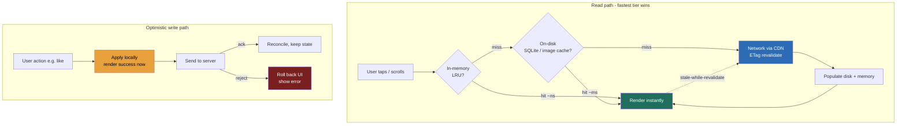

### Learning objectives
- Treat **perceived latency** as the product metric and defend the tricks that buy it, optimistic UI, skeleton screens, cache-first render, and prefetch, while naming the staleness and rollback cost each one incurs.
- Reason about the **client caching tiers** (in-memory, on-disk/SQLite, HTTP/ETag, dedicated image cache), pick an invalidation strategy, and state the "second copy of the truth" trade that every client cache reopens.
- Set a **cold-start / time-to-interactive budget** and hit it with code splitting and lazy loading, weighing preload (fast later, slow start) against lazy (fast start, jank later).
- Own **battery, data, and memory as first-class budgets**: batch radio wakeups, adapt image quality to the network, and downsample plus virtualize so a full-res photo and a 10k-row list stop blowing out RAM.
- Frame client performance as a **retention and revenue lever** the org enforces (perf budgets gating CI, bundle-size limits, a startup-time SLO), and reject "we'll optimize later" as the plan that never ships.

### Intuition first
A great restaurant is not fast because the kitchen is fast. It is fast because the **guest never feels the wait.** You sit down and bread and water are on the table before you have opened the menu. You order a steak and the host says "medium-rare, coming right up" and starts the fire, without walking to the back to confirm the cut is in stock. The line cook keeps tonight's most-used ingredients within arm's reach on the counter, the rest a few steps away in the pantry, and only the rare item requires a trip to the distant grocery store. And the whole operation runs on a fixed budget: limited counter space, a finite pantry, and a grocery run that costs both gas and half an hour.

That image carries the whole lesson. **Perceived speed is the product**, not the stopwatch on the oven: the bread-before-the-menu move is a skeleton screen, "coming right up" before confirming is optimistic UI, and prepping tomorrow's mise en place tonight is prefetch. **Speed comes from tiers**: counter (in-memory), pantry (on-disk), grocery store (network), each bigger, slower, and cheaper to hold than the last. **The tricks have a cost**: if the host promised a steak that turns out to be sold out, they now have to walk it back gracefully, the rollback cost of optimistic UI. And **the kitchen runs on budgets**: you do not drive to the store for a single lemon (batch the radio wakeups to save battery and data), and you do not buy a catering tub to make one sandwich (downsample a 12-megapixel photo before showing it in a thumbnail slot). Every hard part of this lesson is a move on that restaurant floor.

### Deep explanation

#### 1. Perceived latency is the metric, not wall-clock

The number that moves the business is not how long the server took. It is how long the **user felt** they waited. Human perception has sharp thresholds: under ~100 ms feels instant, under ~1 s keeps someone in flow, and past ~10 s you have lost their attention. So the entire game is to fill the gap between the tap and the truth with something that reads as progress. Four moves do this, and each trades a real cost:

- **Optimistic UI.** Apply the write locally and render success immediately, then reconcile with the server in the background. You tap "like" and the heart fills instantly, the POST is still in flight. The trade is the ugly one you must say out loud: you are showing a state that might **fail and have to roll back**. If the write is rejected, you have to un-fill the heart, or worse, silently drop a comment the user believes they posted. Use it where the write almost always succeeds and reversal is cheap (likes, reorders, marking read); avoid it where a false success is dangerous (a payment confirmation, a "your seat is booked").
- **Skeleton screens.** Render the page's shape, grey placeholder blocks, the instant navigation starts, then swap in real content as it arrives. A skeleton makes a 1.5 s load *feel* faster than a spinner does, because the layout is already there and the eye has something to settle on. The cost is engineering a second, throwaway view of every screen and keeping it in sync with the real layout.
- **Cache-first render.** Show cached data instantly, then refresh in the background and reconcile ("stale-while-revalidate"). The feed you saw yesterday paints in under 100 ms while the network fetch updates it a beat later. The cost is staleness: for a moment the user is looking at old truth.
- **Prefetch the likely-next.** Fetch what the user will probably want before they ask, the next page of an infinite scroll, the article behind a link they are hovering, the detail screen for the row they are about to tap. The cost is wasted battery and data on guesses that miss, so you prefetch on a *strong* signal (visible-and-scrolling-toward, hover intent), not blindly.

The Director framing: these are not polish. Latency is a retention and revenue lever, and perceived latency is the part of it you control on the client even when the network is slow.

#### 2. Client caching tiers, and the second-copy-of-the-truth problem

A client cache is not one thing. It is a hierarchy, fastest and smallest at the top:

- **In-memory** (a hash map, an LRU). Nanosecond reads, survives nothing, bounded by RAM. Holds the current session's hot objects.
- **On-disk, structured** (**SQLite** or a key-value store). Millisecond reads, survives app restarts and offline, bounded by device storage. This is where the "show me the feed instantly on cold start" data lives.
- **On-disk, blob / file cache.** Raw bytes: downloaded images, video segments, documents.
- **HTTP cache.** The transport layer's own cache, governed by `Cache-Control`, `ETag`, and `Last-Modified`. A conditional request (`If-None-Match`) lets the server answer `304 Not Modified` with no body, so you revalidate freshness for the cost of headers, not a full re-download.
- **Dedicated image cache.** A two-tier (memory + disk) LRU tuned for decoded bitmaps, because images dominate both memory and bytes and deserve their own eviction policy. Libraries like Glide, Coil, or SDWebImage exist precisely to run this tier well.

The moment you cache, you have made a **second copy of the truth**, and every hard problem of distributed data reappears on the device. The copy goes stale, and you owe an **invalidation** strategy:

- **TTL:** the copy is trusted for N seconds, then revalidated. Simple, but you are choosing a staleness window.
- **Versioned / keyed:** the cache key includes a content version or hash, so new content is a new key and the old one just ages out. Clean, and it sidesteps the hardest bug in computing.
- **Server push-to-invalidate:** the server tells the client "this is stale" via a push or a version bump on the next poll. Freshest, but it costs an invalidation channel and more complexity.

The core trade of client caching, stated plainly: aggressive caching buys **instant, offline-capable reads** and pays in **staleness and storage**. The wrong default in both directions is a red flag: cache nothing and every screen waits on the network; cache everything forever and users see year-old data and a bloated app. You cache per data type, with the freshness the product actually needs.

#### 3. Cold start and the time-to-interactive budget

The first launch is the harshest moment: nothing is warm, and the user is deciding whether your app is fast. So you set a **cold-start / time-to-interactive (TTI) budget**, a target on the order of ~1 to 2 s to first meaningful interaction, and you defend it. Mobile platforms treat a cold start over ~5 s as a failure; on web, the initial JavaScript bundle is the enemy, because every kilobyte shipped is parsed and executed on a mid-tier phone before the page responds.

The two levers, and their trade:

- **Lazy loading and code splitting.** Ship only what the first screen needs; defer the rest behind route-level splits and load-on-demand. This buys a fast start. The cost is **jank later**: the first time the user hits a deferred feature, they wait for its chunk, so you hide that behind a prefetch-on-idle or a skeleton.
- **Preloading / eager warming.** Load likely-next resources up front so later navigation is instant. This buys smooth later interactions and pays with a **slower, heavier start** and wasted work on paths the user never takes.

The resolution is not either/or: split aggressively so the critical path is tiny, then **prefetch on idle or on intent** so the deferred cost lands when the user is not waiting on it. Defer non-critical work (analytics, non-visible widgets, background sync) off the startup path entirely.

#### 4. Resource budgets as first-class constraints

A fast client that drains the battery, burns the data plan, or gets killed for memory is not fast, it is uninstalled. Three budgets, each with a concrete mechanism:

- **Battery.** The dominant cost on mobile is waking the **cellular radio**, which stays in a high-power state for several seconds after every transfer (the radio "tail"), so ten small chatty requests cost far more energy than one batched request of the same total bytes. The moves: **batch and coalesce** network calls, avoid tight polling loops (use push or a single periodic sync), respect the OS's background-execution limits, and never hold a wakelock longer than the work needs. Chatty polling every few seconds is the classic battery killer.
- **Data.** Cellular plans are metered, and users on a capped or expensive plan will resent an app that burns it. **Adapt to the network type**: serve lower-resolution images and defer prefetch on cellular or a metered connection, compress payloads, and let the user opt into "high quality on Wi-Fi only." A feed that pulls full-res images on a train is a data-budget failure.
- **Memory.** Two silent killers. First, **decoding images at full resolution**: a 12-megapixel photo decoded to a bitmap is ~48 MB in RAM (12M pixels x 4 bytes), but shown in a 400 px-wide thumbnail slot it needs under ~1 MB, so decoding full-res wastes tens of times the memory and pushes the app toward an out-of-memory kill. You **downsample to display size** at decode time. Second, **rendering long lists eagerly**: a 10,000-row list that instantiates 10,000 view objects will exhaust memory and stutter. **List virtualization / view recycling** (Android's `RecyclerView`, iOS's reusable cells, windowing on web) keeps only the ~20 rows on screen plus a small buffer as live view objects and recycles them as you scroll, so memory is bounded by the viewport, not the dataset.

These are Director-owned because they are cross-cutting and easy to violate one feature at a time until the app is heavy. They belong in a budget, not in a code reviewer's memory.

#### 5. Asset and image delivery

For most consumer apps, **images are the payload**, so image delivery is where the biggest wins live:

- **Right-sized assets.** Serve an image at the resolution it will be displayed, and generate thumbnails and multiple responsive sizes server-side so the client never downloads a 4000 px original to show it at 400 px. This is a bandwidth *and* memory win at once.
- **Modern codecs.** **WebP** is roughly 25 to 34% smaller than JPEG at equal quality; **AVIF** is roughly 50% smaller. Serving AVIF/WebP with a JPEG fallback (via content negotiation) cuts image bytes substantially, which is money on a CDN bill and seconds off a slow connection.
- **CDN and edge.** Serve assets from a CDN edge near the user, and use an **image CDN** that resizes, re-encodes, and format-negotiates on the fly from a single origin master, so you do not pre-generate every size by hand.
- **Progressive and blur-up.** Show a tiny blurred placeholder (a few hundred bytes) or a progressive-decode pass immediately, then sharpen as the full image arrives. The perceived-latency win from earlier, applied to media: the layout is stable and something is visible in under 100 ms.

#### 6. The Director lens: budgets are an org discipline, not heroics

Two things separate a Director answer from an engineer's. First, **you tie performance to the business**: every +100 ms of latency measurably cuts conversion (Amazon famously put it near ~1% of sales per 100 ms), sites lose on the order of ~10% of users per extra second of load, and bounce probability climbs sharply as load goes from 1 s toward 3 s and beyond. Performance is a retention and revenue lever, and you say so before you talk tactics.

Second, **you enforce budgets as a discipline, not as good intentions.** Perf that is left to individual heroics regresses the week after someone ships a heavy dependency. So you gate it: a **performance budget in CI** that fails the build when the JS bundle crosses its size limit or TTI regresses past its threshold, a **startup-time SLO** tracked in production telemetry, and a bundle-size limit enforced automatically. The alternative you name and reject is **"we'll optimize later"**: later never comes, because by then the regressions are spread across a hundred commits and nobody owns the whole. The Director move is to make the fast path the enforced default, so a team cannot accidentally ship a slow client, rather than catching it in review after it is already live.

### Diagram: client read path (cache tiers) and the optimistic write path

```mermaid
flowchart TB
  subgraph READ[Read path - fastest tier wins]
    U[User taps / scrolls] --> MEM{In-memory<br/>LRU?}
    MEM -->|hit ~ns| RENDER[Render instantly]
    MEM -->|miss| DISK{On-disk<br/>SQLite / image cache?}
    DISK -->|hit ~ms| RENDER
    DISK -->|miss| NET[Network via CDN<br/>ETag revalidate]
    NET --> STORE[Populate disk + memory]
    STORE --> RENDER
    RENDER -.stale-while-revalidate.-> NET
  end
  subgraph WRITE[Optimistic write path]
    W[User action e.g. like] --> LOCAL[Apply locally<br/>render success now]
    LOCAL --> SEND[Send to server]
    SEND -->|ack| DONE[Reconcile, keep state]
    SEND -->|reject| ROLL[Roll back UI<br/>show error]
  end
  style RENDER fill:#1f6f5c,color:#fff
  style NET fill:#2d6cb5,color:#fff
  style ROLL fill:#7a1f1f,color:#fff
  style LOCAL fill:#e8a13a,color:#000
```

### Worked example: a media-heavy mobile feed

Take an Instagram-style feed on a mid-tier phone on a spotty cellular connection, and the target is a **hard 60 fps scroll (a ~16.6 ms per-frame budget)** on a **low data footprint**. Every technique above combines to hit it.

- **Cold start is cache-first.** On launch, the feed renders instantly from the **on-disk SQLite** copy of the last session's posts (a sub-100 ms paint), then a background fetch revalidates via **ETag** and reconciles new items in. The user never stares at a spinner. The cost we accept: the first paint can be a few seconds stale, which for a social feed is fine.
- **Images are right-sized and modern-coded.** The client requests **AVIF/WebP** thumbnails sized to the exact display width from an **image CDN**, roughly halving image bytes versus full-res JPEG. Each image shows a **blur-up** placeholder (a few hundred bytes) the instant its row appears, then sharpens. Bytes and perceived latency both drop.
- **Memory stays flat via virtualization and downsampling.** The list uses **view recycling** (`RecyclerView`-style), so scrolling 10,000 posts keeps only ~20 row views alive, not 10,000. Each image is **downsampled to its slot** at decode, so a 12 MP upload costs under ~1 MB of RAM in the feed rather than ~48 MB. Without these two, the app OOM-kills and drops frames; with them, memory is bounded by the viewport.
- **Prefetch, but on a strong signal.** As the user scrolls, the client prefetches the **next page** and decodes the images for rows just below the fold, so they are ready before they scroll into view, keeping each frame inside 16.6 ms. On **cellular**, prefetch depth is cut and quality lowered to protect the data budget; on Wi-Fi it prefetches more aggressively.
- **Writes are optimistic.** A "like" fills instantly and reconciles in the background; if the POST fails, the heart un-fills with a quiet retry. We accept the rare rollback because a false "liked" is cheap; we would **not** make a "payment sent" optimistic.
- **Battery is protected by batching.** Analytics events, read receipts, and view telemetry are **coalesced** and flushed on a single periodic sync rather than firing per interaction, so the radio wakes rarely instead of on every tap.

The signal is not "I added a cache." It is that **cold start renders from disk instantly, images are downsampled and modern-coded to hold both memory and data budgets, the list recycles views so memory tracks the viewport not the dataset, prefetch is gated on network and intent, and the one speed trick with a rollback cost (optimistic likes) was chosen where reversal is cheap and refused where it is not.**

### Trade-offs table

| Decision | Option A | Option B | Use when |
|---|---|---|---|
| **Write feedback** | **Optimistic UI** (apply locally, reconcile) | **Server-confirmed** (wait for ack) | A: high-success, cheap-to-reverse actions (likes, reorder, mark-read). B: money, bookings, anything where a false success is dangerous or costly to undo. |
| **Render source** | **Cache-first** (show cached, refresh behind) | **Network-first** (wait for fresh) | A: feeds, profiles, catalogs, anything tolerant of seconds of staleness and needing instant paint. B: balances, prices, inventory, correctness-critical reads where stale is wrong. |
| **Startup work** | **Preload / eager** | **Lazy-load / code-split** | A: a small, known critical path where later smoothness matters most. B: large apps where a fast first interaction dominates; pair with prefetch-on-idle to hide the deferred cost. |
| **Image quality** | **Adaptive by network** | **Fixed high quality** | A: mobile with metered/cellular users and a real data budget. B: Wi-Fi-only or desktop contexts where the data budget is a non-issue. |

### What interviewers probe here
- **"Make this feel fast."** *Strong signal:* you separate **perceived from wall-clock** latency immediately, reach for skeletons, cache-first render, optimistic UI, and prefetch, and for each you name the cost (staleness, a rollback path, wasted prefetch). *Red flag:* only talking about server-side latency, or promising "instant" with no cache and no perceived-latency move.
- **"You cached it. Now what's wrong?"** *Strong:* you own the **second copy of the truth**, name a concrete invalidation strategy (TTL vs versioned key vs push), and state the staleness-and-storage trade per data type. *Red flag:* "just cache everything," no invalidation story, unaware the data goes stale.
- **"This runs on a $150 Android phone on 3G. Defend the client."** *Strong:* you talk in **budgets**, downsample images to display size, virtualize long lists, batch radio wakeups for battery, adapt quality for data, and give the memory math (a 12 MP decode is ~48 MB). *Red flag:* no awareness that battery, data, and memory are finite and separately budgeted.
- **"Why should the business care?"** *Strong:* you tie latency to **retention and revenue** with numbers (~1% conversion per 100 ms, ~10% of users per added second) and describe **enforcement**, a perf budget gating CI, a startup SLO, a bundle-size limit, not heroics. *Red flag:* "we'll optimize later," treating perf as a nice-to-have with no owner and no gate.

### Common mistakes / misconceptions
- **Optimizing wall-clock, ignoring perceived.** A page that technically loads in 2 s but shows a blank white screen the whole time feels slower than one that paints a skeleton in 200 ms and finishes in 2.5 s. The user's stopwatch is the only one that pays.
- **Optimistic UI with no rollback plan.** Applying a write locally and never handling the server rejection leaves the user believing a failed action succeeded, the comment they think they posted is gone. If you go optimistic, you own the reconcile-and-roll-back path.
- **Caching without invalidation.** Every client cache is a second copy of the truth that goes stale; shipping one with no TTL, version key, or push-to-invalidate guarantees users will see wrong data with no way to know it.
- **Decoding full-res images and eager-rendering long lists.** A 12 MP photo is ~48 MB decoded and a 10k-row list is 10k live views; skip downsampling and virtualization and the app OOM-kills and drops frames on exactly the low-end devices most of your users carry.
- **"We'll optimize later."** Performance left to individual goodwill regresses the next sprint; without a budget gating CI and a startup SLO, later never arrives and the regressions are already spread across a hundred commits.

### Practice questions

**Q1.** A designer wants every "like" and "follow" to feel instant. How do you build it, and what's the risk you have to handle?
> *Model:* **Optimistic UI**: apply the write to local state and render success immediately (the heart fills, the follow flips), then send the request and reconcile in the background. It works here because these actions almost always succeed and are cheap to reverse. The risk I must handle is the **rollback**: if the server rejects (rate limit, the target was deleted, offline), I have to revert the UI and surface a quiet error or auto-retry, and I need idempotency so a retried "like" doesn't double-count. I'd draw a hard line at anything where a false success is dangerous, a payment, a booking, a "message sent" that wasn't, there I show a pending state and wait for the server ack, because the cost of a wrong optimistic render outweighs the perceived-speed win.

**Q2.** Your app renders instantly from a local cache, but users complain they sometimes see old data. Diagnose and fix without giving up the speed.
> *Model:* This is the **second-copy-of-the-truth** problem: cache-first render buys the instant paint and pays in staleness. I wouldn't drop the cache, I'd add **stale-while-revalidate**: show the cached copy immediately, fire a background refresh (a conditional `If-None-Match` request so an unchanged resource costs only headers and a `304`), then reconcile the UI when fresh data lands. For correctness-critical data (balances, prices) I'd switch that specific type to **network-first** or a very short TTL, and for the rest I'd tune TTLs per data type and consider **server push-to-invalidate** for things that must feel live. The fix is per-data-type freshness, not all-or-nothing.

**Q3.** You're handed a feed app that OOM-crashes and drops frames on mid-tier Android phones. Walk through what you'd check and change.
> *Model:* Two usual suspects, both memory budgets. First, **image decoding**: if a 12 MP upload is decoded at full resolution (~48 MB in RAM) to fill a 400 px slot, a few visible images blow the heap; the fix is **downsampling to display size** at decode and a proper two-tier image cache. Second, **list rendering**: if the list instantiates a view per row, 10k rows means 10k live views; the fix is **virtualization / view recycling** so only the ~20 on-screen rows plus a buffer are live and memory tracks the viewport, not the dataset. For the dropped frames, I'd confirm we're inside the ~16.6 ms/frame budget by moving image decode off the main thread and prefetching just-below-the-fold rows. I'd also right-size and modern-code (AVIF/WebP) the images to cut both memory and bytes. Then I'd put a memory and startup budget in CI so it can't regress silently.

**Q4.** How do you convince a product org to fund client-performance work, and how do you keep it from regressing?
> *Model:* I'd frame it as **retention and revenue, not polish**: every 100 ms of latency measurably cuts conversion (Amazon's ~1% of sales per 100 ms), sites shed on the order of ~10% of users per extra second of load, and bounce probability climbs steeply from 1 s toward 3 s. That reframes perf from an engineering nicety to a growth lever with a dollar figure. To keep it from regressing, I'd make it a **discipline, not heroics**: a performance budget gating CI that fails the build when the JS bundle exceeds its size limit or TTI regresses past threshold, a **startup-time SLO** watched in production telemetry, and bundle-size limits enforced automatically. The explicit thing I'm rejecting is "we'll optimize later", later never comes because the regressions spread across a hundred commits with no owner. Enforce the fast path as the default so a team can't accidentally ship a slow client.

### Key takeaways
- **Perceived latency is the product metric.** Optimistic UI, skeletons, cache-first render, and prefetch buy the feeling of speed even on a slow network, and each one has a named cost (rollback, staleness, wasted prefetch) you own out loud.
- **A client cache is a second copy of the truth.** Reason in tiers (memory, disk/SQLite, HTTP/ETag, image cache), pick an invalidation strategy (TTL, versioned key, push), and accept the staleness-plus-storage trade per data type rather than caching all or nothing.
- **Set a cold-start / TTI budget (~1 to 2 s) and defend it.** Code-split and lazy-load for a fast start, then prefetch on idle or intent to hide the deferred cost; preload only the small critical path.
- **Battery, data, and memory are first-class budgets.** Batch radio wakeups, adapt quality to the network, downsample images to display size (a 12 MP decode is ~48 MB), and virtualize long lists so memory tracks the viewport, not the dataset.
- **Performance is a retention and revenue lever, enforced as discipline.** Tie it to numbers (~1% conversion per 100 ms, WebP/AVIF ~25 to 50% smaller than JPEG), gate it in CI with a perf budget and a startup SLO, and reject "optimize later" as the plan that never ships.

> **Spaced-repetition recap:** The restaurant is fast because the **guest never feels the wait**: bread before the menu (skeleton), "coming right up" before confirming (optimistic UI, whose cost is the **rollback**), counter/pantry/store tiers (memory/disk/network), and prepping tomorrow tonight (prefetch). Every cache is a **second copy of the truth**, so owe it an invalidation strategy (TTL, versioned key, push) and accept staleness plus storage. Set a **cold-start budget (~1 to 2 s)**, code-split for a fast start and prefetch-on-idle to hide the jank. Enforce three budgets: **battery** (batch radio wakeups, no chatty polling), **data** (adapt quality to network), **memory** (downsample a ~48 MB full-res decode to its slot, virtualize the 10k-row list to ~20 live views). Deliver images right-sized in **WebP/AVIF (~25 to 50% smaller than JPEG)** from an image CDN with blur-up. And treat perf as **retention and revenue** (~1% conversion per 100 ms), enforced by a **CI perf budget, bundle-size limit, and startup SLO**, never left to "optimize later."

---

*End of Lesson 11.5. The client is a budget you design and enforce: perceived latency is the metric, caching trades speed for staleness, and battery, data, and memory are finite line items, not afterthoughts.*
