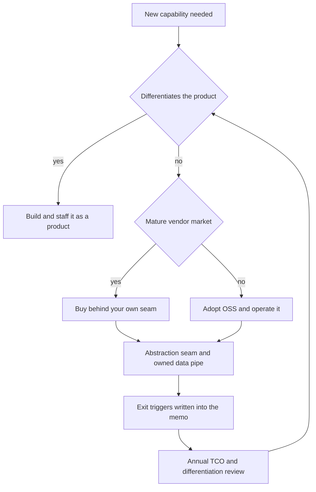

> **This question separates Director from Staff because it isn't an engineering question.** It's attested verbatim in Director and Head-of-Engineering loops ("would you build or buy your auth/payments/search/observability/ML platform?") and it embeds inside every other case the moment you say "we'd use Stripe here." A Staff answer evaluates the technology. A Director answer evaluates the **capital allocation**: multi-year TCO where build cost is mostly *ongoing operations, not v1*; opportunity cost measured in the product work those engineers won't do; and exit triggers written down *before* the contract is signed. "Buy to accelerate, with a defined exit trigger" reads Director. "We could build it better" reads IC ego, and interviewers are listening for exactly that tell.

### Learning objectives
- State and apply the decision rule, **build only what differentiates; buy or adopt everything commodity**, and defend it against the engineer's instinct to build.
- Run the **TCO math both ways**: vendor bill trajectory vs loaded team cost + infra + the v1 build, over 3 years, and locate the crossover instead of comparing year-one sticker prices.
- Price the **opportunity cost** explicitly: the scarce resource is senior engineering attention, not dollars.
- Design the buy so it stays reversible: an abstraction seam, a data-egress plan, and **exit triggers in writing** (price, SLA, roadmap, acquisition).
- Calibrate the five canonical domains, auth, payments, search, observability, ML platform, and know where each crossover typically sits.

### Intuition first
A three-star restaurant does not generate its own electricity or write its own payroll software, even though its chefs could wire a generator. Everything it *buys* is a capability customers never taste; everything it *builds*, the menu, the sourcing, the technique, is exactly what customers pay for. The failure mode: a brilliant chef spends six months building a beautiful custom oven and has produced… an oven, at the cost of two seasons of menus, while the restaurant next door bought one and shipped. And the oven never stops costing: maintenance, spares, someone who understands it at 2 a.m. **Build cost is a recurring liability disguised as a one-time project, and the real price is the menus you didn't make.** The only honest reason to build is that the thing *is* the menu.

---

## R: Requirements

> Adaptation, said out loud: in the decision-memo variant, R doesn't scope features, it scopes **the capability, its differentiation status, and the constraints that can veto a vendor**. Get these wrong and the rest of the memo is math on the wrong question.

**Clarifying questions I'd ask (with assumed answers):**
- *Which capability, for what business?* → Anchor scenario: a **400-engineer, ~$150M-revenue B2B SaaS company** deciding observability (the worked example), with the other four domains as calibration points.
- *Is this the product, near the product, or plumbing?* → The **differentiation test**: would a customer pay more, or churn less, because *ours* is better? Observability here: **no**, pure plumbing.
- *Hard constraints?* → Compliance (PCI, SOC 2, data residency), **data gravity** (egress cost of 50 TB/day), latency (a per-request auth check can't absorb a 100 ms vendor round-trip without a cache plan).
- *Timeline?* → Capability needed in **one quarter**. Time-to-capability is a requirement, not a preference, and it usually decides v1.

**Functional requirements of the *decision*:** (1) the differentiation verdict, argued; (2) 3-year TCO both ways; (3) opportunity cost named in foregone roadmap; (4) a reversibility plan with exit triggers; (5) an owner and a review date.

**The five domains, calibrated up front** (same test, different verdicts):

| Domain | Differentiates? | Default verdict |
|---|---|---|
| **Auth / identity** | Almost never (unless identity *is* the product) | **Buy or adopt** (Okta/Auth0/Cognito, or self-host Keycloak). Never hand-roll crypto/session logic, a breach is existential; the vendor amortizes a security team you can't afford. |
| **Payments** | No, until fee volume is enormous | **Buy** (Stripe/Adyen): PCI scope stays out of your codebase. Direct-acquirer builds win only when ~20-30 bps of fees on multi-billion GMV exceed a payments team, a $10B-GMV problem, not a $150M-revenue one. |
| **Search** | Sometimes, relevance can be product | **Hybrid**: buy/host the engine (Elastic/OpenSearch/Algolia), *build the relevance layer* if search quality drives revenue. |
| **Observability** | No | **Buy early; revisit at scale**, the canonical crossover case, worked below. |
| **ML platform** | The models and data differentiate; the orchestration doesn't | **Assemble/buy** (SageMaker/Vertex/Databricks; serve LLMs via API until token spend crosses the self-host crossover). Build the data moat, not the pipeline plumbing. |

**Explicitly CUT:** vendor bake-offs (the team's job once the verdict lands), license law (delegate to counsel), and who owns the vendor relationship (a different memo).

**Non-functional requirements:** **reversible until proven** (no one-way doors in year one); vendor specifics confined to one adapter; the analysis survives a 30% price hike without an emergency rewrite.

---

## E: Estimation

> Adaptation, the centerpiece: E is not QPS. E is **TCO both ways plus opportunity cost**, over 3 years, with the crossover located. This math *is* the interview.

**The worked example: pay Datadog, or staff six engineers?**

The renewal quote lands: **$2.4M/yr** for the 400-engineer org (metrics + logs + APM, observability bills commonly run **$3-6K per engineer per year** at full adoption). The platform lead says: "for that money I can hire six engineers and build it on Prometheus, Grafana, Loki, and Tempo." Run it honestly, both ways.

**The build side, count everything, not just salaries:**
- **People:** 6 engineers × **~$250K loaded** (salary + benefits + equity + overhead, never base salary) = **$1.5M/yr, forever.** Observability platforms are never "done", agents break on every runtime upgrade, retention asks grow, every new service needs onboarding.
- **Infrastructure:** ~50 TB/day of telemetry with 30-day hot retention → object storage, ingest compute, query nodes ≈ **$0.5-0.7M/yr.** (The vendor's bill includes this; your build hides it in the cloud invoice.)
- **The v1 build:** 6 engineers × ~12 months to reach parity *on the slice you actually use* ≈ **$1.5M one-time**, while still paying the vendor, because you can't go dark on observability mid-migration (the live-migration parallel-run discipline applies to vendor exits too).
- **3-year build TCO:** $1.5M (v1) + 3 × $2.1M (run) ≈ **$7.8M**, plus an on-call rotation for the tool that's supposed to *support* on-call.

**The buy side, price the trajectory, not the sticker:**
- Telemetry grows faster than revenue (~2× every 2 years unmanaged), so naive 3-year spend: $2.4M → $3.1M → $4.0M ≈ **$9.5M**.
- But Directors negotiate: a 3-year commit at this size lands **25-30% off** → ≈ **$7M**. And usage is *controllable*: an OpenTelemetry collector tier you own, filtering and sampling before egress, routinely cuts the bill **30-50%** (most telemetry is never queried).
- **Realistic 3-year buy TCO: ~$6-7M**, with zero engineers consumed and the capability live *today*.

**The verdict on raw dollars: roughly a wash** ($7.8M vs ~$7M). Which is precisely why raw dollars don't decide it, the next two numbers do.

**Opportunity cost, the number juniors omit.** Six strong platform engineers are roughly two product teams' worth of roadmap. At ~$150M revenue, if dedicated product capacity drives even a few points of growth, that capacity is worth **$1M+ of revenue impact per year**, and the build consumes it rebuilding a commodity that wins zero customers. The engineer's framing is "$2.4M is six engineers." The Director's framing is "**six engineers are two product teams, what am I *not* shipping?**"

**Where the crossover sits.** Build starts to win when the vendor bill durably clears **~2× the loaded cost of the team that would replace it**, the 2× margin covering infra, the v1 year, and the risk that your in-house version is worse. Here: team ≈ $2.1M/yr all-in → crossover ≈ **$4-5M/yr of vendor spend**, roughly 2× today's bill. That's the trigger to write down (Evaluation, below), not a feeling at renewal time.

**What estimation decided:** buy now (capability today, ~$1M cheaper over 3 years, zero opportunity cost), **and** own the telemetry pipe (OTel collector) so the bill stays governed and the exit stays cheap, **and** put the crossover in writing: *"if spend exceeds $4.5M/yr after negotiation and pipeline controls, we commission the build."* That sentence is the Director answer.

<details>
<summary>Go deeper, line-item TCO model you can reuse (IC depth, optional)</summary>

A reusable 3-year TCO sheet, per side:

**Build:** loaded headcount (engineers × $230-300K, by market) · v1 duration × team cost · infra (object storage at $0.02-0.023/GB-mo + ingest/query compute; telemetry rule of thumb: logs dominate, ~10:3:1 logs:metrics:traces by byte) · parallel-run overlap (6-12 months of double cost) · on-call load (~1 FTE-equivalent across a 6-person rotation) · hiring/ramp lag (a "6-engineer team" is 3 engineers for the first two quarters) · the maintenance tail (historically 30-50% of platform-team time after v1).

**Buy:** quoted price × realistic usage growth (telemetry ~40%/yr unmanaged, ~15%/yr governed) · multi-year commit discount (20-35% at $1M+ ACV) · overage exposure (read the per-unit overage rates, that's where bills explode) · integration engineering (never zero: 1-2 eng-quarters) · egress/residency surcharges · the pipeline tier you own ($100-200K/yr, pays for itself in bill control).

**Common modeling errors:** base salary instead of loaded cost (understates build ~40%); assuming v1 = done; pricing the vendor at year-one volume for all three years; counting zero opportunity cost because "we'd hire for it" (req slots are fungible, those reqs could be product engineers).

</details>

---

## S: Storage

> Adaptation: S asks **where the data lives and who can hold it hostage**, in build-vs-buy, data gravity *is* the lock-in. The store choice is the vendor's problem; the *portability* of what's in it is yours.

Classify what the vendor will hold, by exit pain:

- **Telemetry:** high-volume, short half-life. Exit pain is *low if* you own the pipe, an **OTel collector you operate** makes redirecting the stream a config change; dual-shipping raw data to your own S3 (~$25K/yr) preserves history. *Rejected, vendor agents writing straight to the vendor:* every emit point in 400 engineers' code speaks one vendor's dialect; the exit becomes a 2-year migration instead of a quarter.
- **Identities (auth):** small data, **enormous** exit pain, password hashes often non-exportable, MFA enrollments don't transfer, sessions invalidate at cutover. Mitigation: integrate via **standards (OIDC/SAML/SCIM)**, never the proprietary SDK.
- **Payment instruments:** card data lives in the PSP's vault *by design*, that's the PCI scope you're buying your way out of. Mitigation: confirm **vault portability** *at contract time*; keep your own `payment_method_id` indirection so a PSP swap is a mapping table, not a schema change.
- **Search indexes:** derived data, rebuildable from your source of truth in hours; lowest exit pain, *provided* the index-build pipeline is yours.
- **ML artifacts:** training data and feature definitions stay **in your own warehouse**; the platform is compute over data you own, never the system of record.

**The rule:** the vendor may hold the *working copy*; **you keep the system of record or a continuously-exported stream.** Anything the vendor holds exclusively is leverage they have at renewal.

---

## H: High-level design

> Adaptation: the "architecture" is the **decision flow plus the integration seam**. The diagram worth drawing isn't boxes-and-databases, it's the loop that keeps the decision honest over time.



**Reading the flow:** the differentiation test gates everything; the *mature-market* test splits buy from adopt-OSS (an immature or extortionate vendor market makes self-hosted open source the middle path, you operate it, but don't *write* it); and the loop at the bottom is what juniors omit, **the verdict has a review date, because the vendor market and your scale both move.** The developer-platform lesson runs one full lap of this loop on a live case (Backstage vs an in-house developer portal, the adopt-OSS branch in detail).

**The integration shape when you buy:** every vendor sits behind a **seam you own**, an interface in your terms, vendor as one implementation (the single-choke-point discipline from live migration, built on day one when it's cheap), plus the **owned data pipe** from S. That pair makes "buy" reversible: the vendor is a plug-in, not a load-bearing wall. *Rejected, "integrate natively, abstract later":* by then the vendor's SDK idioms have metastasized across 200 services. The seam costs ~2 engineer-weeks per domain now, a rewrite-sized program afterward.

---

## A: API design

> Adaptation: the "API" is the **seam itself**, the internal interface that makes the vendor swappable. Design it in *your domain's* vocabulary, not the vendor's.

```text
# The seam, sketched (observability) — your terms, not Datadog's:
interface Telemetry:
    emit_metric(name, value, tags)          # OTel semantic conventions
    log(level, message, context)
    start_span(name, parent) -> Span

# Payments seam — note what it deliberately hides:
interface PaymentProvider:
    create_charge(amount, currency, method_id, idempotency_key) -> ChargeResult
    refund(charge_id, amount, idempotency_key) -> RefundResult
    # No vendor objects leak: method_id is YOUR token,
    # mapped to the PSP's vault reference in one adapter.

# Auth seam — standards ARE the seam:
#   OIDC for login, SCIM for provisioning. No vendor SDK
#   outside the adapter. Swapping IdPs = config + re-auth.
```

**Design notes (each with the rejected alternative):**
- **Idempotency keys live in *your* interface**, retry semantics survive a PSP swap. *Rejected:* relying on Stripe's idempotency as an implementation detail; the next PSP's semantics differ and every call site breaks.
- **Standards beat SDKs wherever standards exist** (OIDC/SAML/SCIM, OpenTelemetry, SQL surfaces), the standard *is* a free seam. *Rejected:* the vendor's "richer" proprietary SDK, the richness is the lock-in.
- **The seam is thin, not a platform.** One adapter, one mapping table, conventions enforced in review. *Rejected:* an internal "vendor abstraction framework", the build-instinct sneaking back in through the integration layer.

---

## D: Data model

> Adaptation: the data model is the **exit plan's data surface**, the artifacts that must exist *on day one of the contract* for the exit to be real rather than theoretical.

Four artifacts, owned and versioned like code:

1. **The continuous export.** Whatever stream the vendor consumes, **tee it**: raw telemetry to your S3, SCIM-synced identities in your directory, daily PSP settlement files into your warehouse. Cost: typically 1-3% of the vendor bill. *Rejected, "we'll export when we decide to leave":* exit-time exports happen under deadline, against a vendor with no incentive to help, rate-limited by the same API you're fleeing.
2. **The mapping table.** Your IDs ↔ vendor IDs (`payment_method_id ↔ psp_vault_ref`, `user_id ↔ idp_subject`). This table is the entire migration key-space at exit; without it you're string-matching customers.
3. **The contract terms that are actually data terms** (free at signing, ruinous to lack later): egress rights with no per-record fees, deletion attestation, **renewal price caps (e.g., max +7%/yr)**, vault/token portability, and a 90-day wind-down clause at current rates.
4. **The exit runbook**, a one-pager: sequence, owner, estimated cost and duration, last reviewed date. Not because you plan to leave: **a written, costed exit is negotiation leverage at every renewal.** A vendor who knows you *can* leave in a quarter prices you differently from one who knows you can't.

---

## E: Evaluation

> Adaptation: Evaluation is the **reversibility audit**, stress the *decision* the way you'd stress a design. Three probes: lock-in, triggers, and the failure modes of each verdict.

**The lock-in audit (run before signing, then annually):** score four axes, **API coupling** (vendor idioms confined to the adapter?), **data gravity** (what do they hold exclusively, and what does egress cost?), **workflow coupling** (are processes, on-call, deploys, provisioning, built around vendor-specific features?), and **skills coupling** (does anyone in-house still understand the domain?). Workflow is the one people miss: after three years on Datadog, your incident process *is* Datadog's feature set, and that costs more to unwind than the API integration.

**Exit triggers, written into the memo, with numbers:**
- **Price:** spend exceeds **$4.5M/yr** (the ~2×-team crossover from E) after negotiation and pipeline controls → commission the build.
- **Reliability:** vendor SLA breach materially extends *our* incidents more than twice a year → re-evaluate (your observability being down during your outage is a compounding failure).
- **Roadmap:** a differentiating product need the vendor won't serve within two quarters → build *that slice* on the seam (partial build, not wholesale exit).
- **Corporate:** vendor acquired, or pricing-model change >20% effective increase → trigger the runbook review immediately, while the wind-down clause is fresh.

**Failure modes, both directions, named honestly:**
- *Buy gone wrong:* renewal shock with no exit leverage (no seam, no export, you ARE the captive customer the pricing model assumes); the vendor's outage becoming your outage; spend growing silently because nobody owns the bill. Mitigation: everything above, plus a named spend owner.
- *Build gone wrong:* v1 ships, the team moves on, the platform rots, you now run a *worse* Datadog with no SLA and no one to call; the maintenance tail quietly consumes 4 of the 6 engineers forever; sunk cost keeps it alive. **"We could build it better" never prices the decade of ownership.**
- *The hybrid trap:* buying *and* half-building ("buy Datadog but write our own metrics layer on top"), both costs, neither benefit. If you bought, use it; customize only at the seam.

**Re-check vs requirements:** capability in one quarter ✓ (buy delivers now); 3-yr TCO bounded ✓ (~$7M with caps negotiated); opportunity cost zero ✓; reversible ✓ (seam + export + runbook); survives a 30% price hike ✓ (cap negotiated; trigger written for what the cap doesn't catch).

<details>
<summary>Go deeper, the lock-in audit as a scored checklist (IC depth, optional)</summary>

Score each axis 1 (free to leave) to 5 (captive); anything totaling 14+ means the exit runbook is fiction until remediated.

**API coupling:** count call sites importing vendor SDKs outside the adapter (grep is the audit tool). 1 = adapter only; 5 = vendor idioms in product code. **Data gravity:** what does the vendor hold exclusively, what's the export format/rate-limit, what would a full egress cost in dollars and weeks? 1 = continuous tee already running; 5 = no export path tested. **Workflow coupling:** list processes (incident response, deploy gates, paging, provisioning) that depend on vendor-specific features with no equivalent elsewhere; each is a retraining program at exit. **Skills coupling:** could anyone in-house design the replacement, or has the domain knowledge atrophied? 5 here quietly converts "build at the crossover" from an option into a hiring program.

Run it before signing (sets the mitigation list), then annually (catches drift, workflow and skills scores only ever rise on their own). Attach the score to the renewal calendar so the negotiation starts from the audit, not from the vendor's quote.

</details>

---

## D: Design evolution

> Adaptation: evolution asks **what makes the verdict flip later**, because build-vs-buy is a *policy with a review date*, not a one-time call.

**Buy → build flips when:** spend durably crosses the written crossover (~2× team cost); or the capability *becomes* differentiating (your search relevance starts winning deals → in-source the relevance layer on the seam, keep the engine bought); or scale makes the vendor's unit economics absurd (the LLM-serving pattern: LLM-API token spend at high steady volume vs self-hosted serving, same crossover logic, different domain). The flip is usually **partial**: in-source the differentiating slice, keep buying the commodity substrate.

**Build → buy flips when:** the vendor market matures past your in-house version (the team that built it in 2019 is gone, the OSS ecosystem ate the differentiation, the platform is now a liability, the honest move is a managed migration *out* of your own system, run with the live-migration playbook); or the maintaining team's opportunity cost rises (those 6 engineers are now needed for the actual product).

**At 10× company scale** the calculus genuinely changes: a 4,000-engineer org's Datadog bill (~$20M+/yr) clears any team-cost crossover, in-house platform teams amortize across 10× more consumers, and negotiation leverage inverts. That's why Netflix/Uber-scale companies build observability and payments infrastructure *and are right to*, and why quoting their blog posts at a 400-engineer company is the classic altitude error. **Their crossover is behind them; yours is ahead of you.**

**Where I'd delegate (the explicit Director move):**
- **Vendor bake-off:** *"The platform team runs the Datadog-vs-Grafana-Cloud-vs-Honeycomb evaluation against our query patterns and bill model; my prior is the incumbent with a 3-year cap, because switching costs are real and the seam keeps us honest."*
- **Contract terms:** *"Procurement and counsel own the paper; I give them the four data terms from D as non-negotiables, egress rights, price cap, portability, wind-down."*
- **The pipeline tier:** *"The observability team owns the OTel collector and sampling policy; my prior is tail-based sampling on traces and aggressive log filtering, because that's where 40% of the bill hides."*

What I keep, the differentiation verdict, the crossover number, the exit triggers, and what I hand off, with stated priors, *is* the altitude. The developer-platform lesson applies this whole memo to one concrete platform case (Backstage vs in-house IDP); the behavioral pairing is telling a build-vs-buy decision you actually owned, including the one you got wrong.

---

## Trade-offs table: the three verdicts

| Decision | A, Buy (SaaS vendor) | B, Adopt OSS, self-host | C, Build in-house | Use when... |
|---|---|---|---|---|
| **Time to capability** | Days-weeks | 1-2 quarters | 4+ quarters | **A** when timeline is a requirement (it usually is). |
| **3-yr cost shape** | Opex, grows with usage, negotiable | Infra + 2-4 engineers; flatter curve | Team forever + infra + v1 + maintenance tail | **A** below the ~2×-team crossover; **B** when vendor pricing is extortionate but the OSS is mature; **C** only past the crossover *or* when it differentiates. |
| **Opportunity cost** | ~Zero | Low-moderate | **High, the hidden headline number** | **C** only when the capability is the product, so the "opportunity cost" *is* the roadmap. |
| **Lock-in / reversibility** | Highest, mitigated by seam + export + contract terms | Moderate (you own data; you owe ops) | None to a vendor; total to your own past decisions | **B** when exit leverage matters and ops capacity exists. |
| **Failure mode** | Renewal shock; vendor outage = your outage | Under-resourced ops; "free" software, expensive 2 a.m. | Platform rot; sunk-cost capture | Pick the failure mode you can actually manage. |

---

## What interviewers probe here (Director altitude)

- **"Your platform lead says they can build it cheaper. How do you respond?"**, *Strong:* re-run their math with loaded cost, infra, the v1 year, the maintenance tail, and opportunity cost; show the crossover; offer the pipeline-tier middle path; commit to the build *if* the numbers clear it. *Red flag:* "no, we always buy" (dogma), or accepting the six-engineers-equals-the-bill framing.
- **"What would make you reverse this decision?"**, *Strong:* written triggers with numbers, spend crossover, SLA breach count, roadmap block, acquisition, and the runbook that makes reversal a quarter, not a rewrite. *Red flag:* "we'd re-evaluate at renewal" (when leverage is lowest and no plan exists).
- **"Where does build-vs-buy land differently across the five domains?"**, *Strong:* runs the differentiation test per domain; knows payments' crossover is GMV-fee-driven while observability's is telemetry-volume-driven, and that search splits at the relevance layer. *Red flag:* one verdict applied to all five.
- **"What does the buy cost you that isn't on the invoice?"**, *Strong:* lock-in across four axes (API, data, workflow, skills), the negotiation asymmetry of having no exit, and the atrophy of in-house domain understanding. *Red flag:* treats the sticker price as the cost.
- **"You inherited an in-house system the vendor market has passed. What do you do?"**, *Strong:* an honest sunset case, TCO of keeping vs migrating out, the live-migration playbook, and managing the team whose work is being retired (the leadership half of the question). *Red flag:* defending the in-house system because killing it is politically hard.

---

## Common mistakes

- **Comparing the vendor invoice to engineer salaries.** The build side is loaded cost + infra + v1 + a permanent maintenance tail; the buy side is a negotiated trajectory, not the sticker. Both numbers in the naive comparison are wrong.
- **Pricing opportunity cost at zero.** Six engineers on commodity infrastructure are two product teams not shipping. The scarce resource is senior attention, not budget.
- **Buying without a seam or an export.** "We'll abstract it later" is a multi-year program later and two engineer-weeks now. No seam, no export = no exit = no renewal leverage.
- **Quoting hyperscaler blog posts as evidence.** Netflix builds observability because its crossover is behind it. Importing that verdict into a 400-engineer company is the signature altitude error of this question.
- **"We could build it better."** Probably true, and irrelevant, *differentiating* is the test, not better. This phrase, unaccompanied by TCO math, is the exact IC-ego tell the question exists to detect.

---

## Interviewer follow-up questions (with model answers)

**Q1. Your Datadog renewal comes in at $2.4M/yr, up 30%. Walk me through your decision.**
> *Model:* Governance before strategy: do we control the volume? An OTel pipeline tier we own, with sampling and log filtering, typically cuts 30-50%, that alone may erase the increase. Then negotiate: a 3-year commit at this ACV gets 25-30% off, plus a renewal cap (~7%/yr) and egress rights in the paper. Then run the crossover: a replacement team is ~$2.1M/yr all-in, so build wins only when governed spend durably clears ~$4-5M/yr, we're at half that. Verdict: stay bought, govern the pipe, write the crossover into the memo as the trigger, and keep the exit runbook current so next renewal we negotiate with a credible alternative. What I won't do is commission a build to win one negotiation, that's a decade of ownership to dodge an invoice.

**Q2. The CTO wants to build an in-house ML platform "because AI is core to our strategy." Respond.**
> *Model:* Separate what's core from what's plumbing. Our *models, training data, and the product loop around them* differentiate, that's where the engineers go, and that we build without question. The orchestration substrate, pipelines, feature store, serving infra, GPU scheduling, is a commodity with mature options (SageMaker/Vertex/Databricks), and building it consumes the exact ML engineers who should be improving models. TCO: a credible platform team is 6-8 engineers ≈ $2M/yr before a single model improves; the managed equivalent at our scale is a fraction of that. The honest caveat: if inference volume grows to where API token spend crosses self-hosted serving cost, we in-source *serving*, a written trigger, not a day-one build. Build the moat, buy the plumbing, put the crossover in the memo.

**Q3. How do you keep a "buy" decision from becoming irreversible?**
> *Model:* Four artifacts, created at signing when they're cheap: a **seam**, the vendor behind an interface in our vocabulary (standards like OIDC/OTel where they exist), confined to one adapter; a **continuous export**, we keep the system of record or a teed raw stream, costing 1-3% of the bill; **contract terms**, egress rights, price caps, portability, a 90-day wind-down; and a **costed exit runbook**, reviewed annually. Then triggers with numbers: spend crossover, SLA breaches, roadmap block, acquisition. The runbook matters even if we never leave, a vendor who knows we *can* exit in a quarter prices renewals differently. The yearly audit covers four lock-in axes, API, data, workflow, skills, and workflow is the sneaky one: after three years, your incident process is shaped like the vendor's feature set.

---

### Key takeaways
- **The decision rule: build only what differentiates.** Would a customer pay more or churn less because yours is better? If not, buy or adopt, engineering attention is the scarce resource, and "we could build it better" is the IC-ego tell this question exists to catch.
- **Build cost is mostly ongoing, not v1:** loaded team forever + infra + the maintenance tail, against a vendor bill that's a *negotiable trajectory*. The Datadog math: ~$7.8M built vs ~$7M bought over 3 years, a wash on dollars, decided by opportunity cost, which the build always loses below the crossover.
- **The crossover is a number, written down:** build wins when governed vendor spend durably clears **~2× the loaded cost of the replacing team** (~$4-5M/yr here). Hyperscalers are past their crossover; quoting their builds at a mid-size company is the altitude error.
- **Buy reversibly:** seam (standards where they exist) + continuous export + contract data-terms + a costed exit runbook, created at signing, when they cost ~nothing. A credible exit is renewal leverage even if never used.
- **Exit triggers in writing, price, SLA, roadmap, acquisition, with an annual review.** The verdict is a policy with a review date, not a one-time call; flips are usually partial (in-source the differentiating slice, keep buying the substrate).

> **Spaced-repetition recap:** Build vs buy = **a capital-allocation memo, not a tech evaluation**. Differentiation test gates everything; 3-year TCO with *loaded* build cost (team forever + infra + v1 + tail) vs *negotiated* vendor trajectory; opportunity cost is the headline number juniors omit. Crossover ≈ **2× team cost in vendor spend**. Buy reversibly: seam + export + contract terms + exit runbook; triggers (price/SLA/roadmap/acquisition) written at signing. "Buy to accelerate, with a defined exit trigger" = Director; "we could build it better" = IC ego.

---

*End of Lesson 11.6. Build vs buy is the live-migration problem decided in advance, the seam and export you create at signing are what make the migration playbook runnable if the exit trigger ever fires. The developer-platform lesson applies this memo to a live platform case, Backstage vs an in-house developer portal, and the behavioral pairing tells a build-vs-buy call you owned.*
