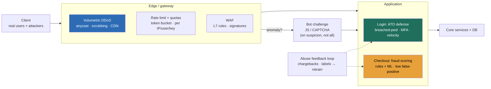

### Learning objectives
- State the governing fact of this lesson: this is **availability and integrity under adversarial load**, an attacker is actively trying to break your system or steal value, and every defense you add buys safety at a measured cost in **legitimate-user friction and false positives** that a Director names out loud.
- Design defense as **layers in the request path** (edge → application → account), so each control catches what the layer above missed and no single failure is total, and **reject** the single-box rate limiter that interviewers hear most often.
- Reason about **DDoS** as two different problems with two different answers: **L3/L4 volumetric** floods absorbed at the edge with anycast, scrubbing, and CDN capacity, and **L7 application-layer** floods handled with WAF rules and challenges, and know that "auto-scale up" is not a DDoS strategy.
- Quantify the **false-positive cost**: a fraud rule or bot challenge that blocks 1% of real buyers on a high-volume checkout is lost revenue, so you tune for **low false positives** and prefer **challenge over block** where the cost of being wrong is a paying customer.
- Name the **account-takeover and fraud** controls (breached-password checks, MFA, velocity and anomaly detection, rules + ML risk scoring) with their real numbers, MFA cuts automated ATO by **>99%**, a CAPTCHA costs a few points of conversion, and decide where each is worth its friction.

### Intuition first
Think about a **nightclub on a busy night**. There is a velvet rope and a bouncer at the door (the edge), a host who seats you and watches the room (the application), and a bartender who knows your tab and cuts you off if you have had too many (the account). No single person guards everything. The bouncer turns away the obvious mob before they ever reach the floor, the host spots the guy casing tables, and the bartender catches the fake credit card at settle-up. Defense is **layered on purpose**, because anyone who slips one layer still has two more to clear, and because the cheapest place to stop a problem is as far from the till as possible.

That image carries the whole lesson. **The bouncer absorbs the crowd so the room stays usable**, you stop a flood at the door, not at the cash register, because a flood that reaches the register has already cost you. **Every door policy turns away some real customers**, a strict bouncer keeps out troublemakers and also a few paying regulars in the wrong shoes, and a manager who only counts the troublemakers turned away, not the regulars lost, is reading half the ledger. **You escalate friction to suspicion, not to everyone**, you do not pat down every guest at the door, you watch and challenge the ones acting strange, because friction applied to everyone is a tax on your whole business. Get this picture right, layered, friction-aware, suspicion-targeted, and the rest is which control sits at which door.

### Deep explanation

**The thesis: this is adversarial, so you design against an opponent, not against load.** Capacity planning assumes traffic that wants your system to work. Abuse, fraud, and DDoS assume traffic that wants it to fail or wants to steal from it, and an adversary adapts. The Director-altitude statement: *you cannot make the system un-attackable, you make attacks expensive, detectable, and contained, and you do it in layers so no single bypass is total.* You **reject** "add a rate limiter and we're done", because a rate limiter is one control at one layer, and an attacker who rotates IPs, solves your CAPTCHA with a \$2-per-thousand human farm, or stuffs stolen credentials one slow request at a time walks straight past it. Layering is the entire architectural posture.

**Layer the controls along the request path, because each layer catches a different failure.** Three layers, named by where the request is when the control fires:

- **Edge / gateway** (before the request reaches your code): coarse **rate limiting and quotas**, **WAF** rules, **volumetric DDoS absorption**, IP reputation. This layer is cheap per request and protects everything behind it, so the rule is **enforce here, not deep in the app**, a request you reject at the edge costs you almost nothing, a request you let reach your auth service and database costs you compute, connections, and possibly a lock.
- **Application** (inside your service, with business context): **bot challenges on anomaly** (not on everyone), **fraud risk scoring**, per-feature quotas that need to know what the user is doing. This layer has context the edge lacks, "this account just changed its shipping address and is buying ten gift cards", and pays for it in latency and complexity.
- **Account** (tied to the identity over time): **MFA**, **breached-password checks**, login **velocity and anomaly detection**, device fingerprinting and trust. This layer defends the asset attackers actually want, the account and its stored value or payment methods.

The trade-off a Director foregrounds: **lower layers are cheaper and blunter, higher layers are smarter and more expensive.** You push as much rejection as possible to the edge, and reserve the smart, costly checks for traffic that survived the cheap ones.

**Rate limiting is the foundational control, and the algorithm choice is a real trade-off.** A rate limit caps requests per key per window, and the key matters as much as the number: **per user** (fair, but useless against anonymous traffic and rotating accounts), **per IP** (catches crude floods, but punishes everyone behind a corporate NAT or mobile carrier sharing one IP), **per API key** (the right unit for a platform with programmatic clients). You almost always key on **several at once**, a tight per-IP limit to blunt floods plus a looser per-user limit for fairness. Concrete numbers depend on the endpoint: a login endpoint might allow **5 attempts per account per 15 minutes** (tight, because the only legitimate reason to hit it 100 times is an attack), while a product-search endpoint might allow **100 requests per minute per IP** (loose, because real browsing is bursty). The algorithm:

- **Token bucket**, a bucket refills at a steady rate and each request spends a token, **allows bursts** up to the bucket size while capping the average. This is the default for most APIs because real traffic is bursty and you want to permit a legitimate spike without permitting a sustained flood. **Rejected alternative: fixed window**, because it allows a double-rate burst across the window boundary (all of window N's budget at :59 plus all of window N+1's at :00).
- **Sliding window**, counts requests in a rolling time window, **smooth and accurate**, no boundary burst, at the cost of more state (you track timestamps, not one counter). Use it where the boundary burst actually matters, like a strict login limiter.
- **Fixed window**, one counter per clock window, **cheapest and simplest**, but the boundary-burst flaw makes it wrong for anything an adversary targets.

The Director point: enforce the limit at the **edge gateway** (a CDN, an API gateway, an Envoy/NGINX layer) on shared state (a Redis counter), **rejected: a rate limiter inside each application instance**, because per-instance counters do not see the global rate and an attacker spread across your fleet evades them, and because you have now spent application resources to reject the request.

**DDoS is two problems, and conflating them is the classic miss.** A distributed denial-of-service attack aims to exhaust a resource so real users cannot get through. The two flavors need opposite answers:

- **Volumetric (L3/L4)**, raw flood, SYN floods, UDP reflection/amplification, sheer packet and bit volume, **multi-Tbps** in the largest recorded attacks. You cannot absorb a multi-Tbps flood on your origin, no amount of auto-scaling buys you terabits of edge bandwidth. The answer is **absorb it at the edge** on infrastructure built for it: **anycast** (the attack is spread across hundreds of global points of presence instead of hitting one datacenter), **scrubbing centers** that filter attack packets and forward clean traffic, and a **CDN** that fronts your origin so the flood never reaches it. This is **Cloudflare, AWS Shield, Google Cloud Armor** territory, you buy this capacity, you do not build it. The Director move is naming that this is an edge-and-vendor problem, not an origin problem.
- **Application-layer (L7)**, the flood looks like legitimate requests, expensive queries, login attempts, search calls, but at a volume meant to exhaust your CPU, database connections, or downstream services. Volume can be modest in bandwidth but devastating in cost (one crafted request can trigger a full-table scan). The answer is **WAF rules** (block known-bad patterns and signatures), **rate limiting** on the expensive endpoints, and **challenges** (serve a JavaScript or CAPTCHA challenge to suspected bots so real browsers pass and scripts fail). Auto-scaling here is sometimes part of the answer (give yourself headroom to ride out a burst), but **scaling alone just raises your bill to match the attacker's ambition**, you still need to identify and drop the malicious traffic.

**Bot mitigation is about raising the attacker's cost, and every tool has a conversion cost.** Bots drive credential stuffing, scraping, inventory hoarding, and fake signups. The defenses, from least to most friction:

- **Device fingerprinting and behavioral signals**, invisible to the user, browser/TLS fingerprint, mouse and timing patterns, request shape, score how bot-like a session is. **Zero friction, never definitive**, a good signal to *decide whether to challenge*, not to hard-block on alone.
- **JavaScript / invisible challenges** (the modern default, e.g. Turnstile-style), the browser silently solves a proof-of-work or behavioral check. **Near-zero friction for real users, stops naive bots.**
- **CAPTCHA**, the explicit "prove you're human" puzzle. It works, but it **costs a few percentage points of conversion** every time you show it, and well-funded attackers solve it with cheap human farms. So you **show it on anomaly, not to everyone**, the cardinal rule, a CAPTCHA on every login is a permanent tax on every real user to stop a problem most of them never had.

**Account takeover is the highest-value attack, and the math favors the defender heavily.** Attackers buy **breach dumps** (billions of leaked email/password pairs) and run **credential stuffing**: try each pair against your login, because users reuse passwords. The defenses, with their numbers:

- **Breached-password checks at signup and login** (e.g. checking a password against a corpus of known-leaked hashes, k-anonymity style so you never send the full password), refuse or step-up known-compromised credentials before they become an ATO.
- **MFA**, the single highest-leverage control on this list. A second factor cuts **automated/bulk account-takeover by >99%**, because the stolen password alone is no longer enough. The cost is real, friction at login and a support burden for lost factors, so the Director call is **risk-based MFA**: always for high-value actions and admins, step-up (challenge for the second factor only) when the login looks anomalous, rather than a hard second factor on every single login for every user.
- **Velocity and anomaly detection**, one IP trying 10,000 accounts, one account hit from 50 countries in an hour, a login from a never-seen device followed immediately by a password and shipping-address change, these are signals you score and act on (block, challenge, or step-up).

**Fraud is where false positives cost real money, so you tune for them explicitly.** Fraud, stolen-card checkout, promo abuse, fake refunds, is scored, not hard-coded, with **rules + ML risk scoring**: velocity checks (this card hit 40 merchants in an hour), mismatch signals (billing country ≠ IP country), and a model that outputs a risk score. The decision is the heart of the lesson: **a fraud control that blocks legitimate buyers is destroying the revenue it exists to protect.** If your checkout does \$10M/day and a tightened rule blocks 1% of *good* orders to catch a bit more fraud, that is **\$100k/day of lost revenue** to save perhaps a fraction of that in fraud, a losing trade you would never make if you only watched the fraud number and not the false-positive number. So Directors insist on measuring **both** rates, set the threshold by the **business cost of each error** (the cost of a fraudulent order vs the lifetime value of a wrongly-blocked customer), and prefer to **challenge or step-up review** at the margin rather than hard-decline. The **abuse feedback loop** closes it: confirmed fraud and chargebacks (and false-positive reversals) are labeled and fed back to retrain the model and tune the rules, so the system improves instead of ossifying.

Go deeper — rate-limiter mechanics and risk-scoring internals (IC depth, optional)

**Token bucket, precisely.** State per key: a token count and a last-refill timestamp. On each request, refill `tokens = min(capacity, tokens + (now - last_refill) × refill_rate)`, update `last_refill = now`, then if `tokens ≥ 1` spend one and allow, else reject (often with HTTP `429` and a `Retry-After` header). Two parameters: **capacity** (max burst) and **refill_rate** (sustained rate). A 100-token bucket refilling at 10/sec permits a 100-request burst then settles to 10/sec sustained. In a distributed gateway you keep this in Redis and do the refill+spend atomically with a Lua script so concurrent requests across nodes can't double-spend.

**Sliding-window-log vs sliding-window-counter.** The exact version (log) stores a timestamp per request and counts those inside the window, accurate but O(requests) memory. The approximation (counter) keeps the current and previous fixed-window counts and weights the previous by the fraction of the window that overlaps: `estimate = curr + prev × (overlap fraction)`. The approximation is O(1) memory and good enough for almost all production limiters.

**Anycast, why the flood spreads.** The same IP prefix is announced from many PoPs; BGP routes each source to its nearest PoP. An attacker's botnet is geographically scattered, so the flood is automatically divided across the provider's global edge instead of converging on one origin, and each PoP only sees its slice. This is structural, not a filter, which is why it scales to Tbps.

**Risk scoring at checkout, feature shape.** Typical features: velocity (txns per card/device/IP over 1m/1h/24h windows), mismatch flags (BIN country vs IP geo vs shipping country), account age and history, device-fingerprint reuse across accounts, amount vs the account's norm, and graph features (is this device/card linked to known-fraud entities). A gradient-boosted model outputs a probability; you map score bands to actions, low → allow, mid → step-up (3-D Secure / manual review), high → decline. The operating point is chosen on a precision-recall curve weighted by the *dollar* cost of each error, not raw accuracy, because the classes are wildly imbalanced (fraud is often <1% of transactions) and the costs are asymmetric.

### Diagram: layered defense in the request path

### Worked example: protecting a login + checkout flow
A consumer commerce app, **say a Shopify-scale storefront**, needs to protect login (the door to the account) and checkout (the door to the money). One flow, and the whole layered model shows up.

- **Edge.** A CDN/WAF (Cloudflare or AWS Shield + WAF) fronts everything. Volumetric floods are absorbed on anycast before they reach the origin, so a 1-Tbps SYN flood is the provider's problem, not the app's. A **per-IP token-bucket limit** (say 60 requests/min) blunts crude floods on every endpoint, and a **strict sliding-window login limiter** (5 attempts per account per 15 min) caps credential stuffing per target. **Rejected: enforcing these inside the app**, because per-instance counters miss the global rate and the rejected requests would have already cost auth-service and database work.
- **Challenge on anomaly, not on everyone.** Device fingerprint + behavioral signals score each login session. A clean, known-device login sails through with **zero friction**; a login from a fresh device, a datacenter IP, or after a burst of failures gets a **silent JS challenge**, escalating to a CAPTCHA only on a strong bot signal. **Rejected: a CAPTCHA on every login**, because at this scale that is a few percent of conversion lost permanently to stop an attack most users never trigger.
- **ATO defense on login.** Passwords are checked against breach corpora at signup and rejected if known-leaked. **Risk-based MFA**: required for high-value actions and triggered as a step-up when the login looks anomalous, buying the **>99%** automated-ATO reduction without a hard second factor on every single login.
- **Fraud scoring at checkout, tuned for low false positives.** A risk model scores each order on velocity, geo/BIN/shipping mismatch, account history, and device reuse. Low scores pass instantly, mid scores get **3-D Secure step-up** (push the friction onto the suspicious minority), only high scores decline. The threshold is set on the **dollar** trade: blocking 1% of \$10M/day of good orders is \$100k/day lost, far more than the marginal fraud it would catch, so the operating point is deliberately permissive and leans on step-up. Chargebacks feed the **abuse loop** back into the model.

The number a Director brings out of this is not "we added security", it is *"floods die at the edge, real users see no friction, suspicious sessions get challenged, ATO is down >99% with risk-based MFA, and the fraud threshold is set so we never block more revenue than we save."*

### Trade-offs table: rate-limit algorithm, and block vs challenge vs allow-and-monitor
| Dimension | Fixed window | Sliding window | Token bucket |
|---|---|---|---|
| **Burst handling** | allows 2× burst at boundary (flaw) | smooth, no boundary burst | allows controlled burst up to bucket size |
| **State / cost** | cheapest (one counter) | more (timestamps or two counters) | small (token + timestamp) |
| **Accuracy** | coarse | high | high, with intentional burst tolerance |
| **Use when…** | low-stakes, simplicity only | strict limits an adversary targets (login) | general API limiting (the default) |

| Action on a suspicious request | Block (hard-deny) | Challenge (step-up / CAPTCHA / MFA) | Allow + monitor |
|---|---|---|---|
| **Security** | highest (stops it cold) | high (stops automation, lets humans through) | lowest (catches after the fact) |
| **Legit-user friction** | highest (false block = lost user) | moderate (only the challenged minority) | none |
| **False-positive cost** | severe (blocked revenue, support load) | low (real user solves it and proceeds) | none on legit users, but fraud completes |
| **Use when…** | signal is near-certain (known-bad IP, breached cred) | signal is suspicious but the wrong answer costs a customer | you need labels and the per-event loss is small |

The Director move is matching the **action to the confidence and the cost of being wrong**: hard-block only what you are nearly certain about, **challenge** the suspicious middle where a false block costs a paying customer, and allow-and-monitor the low-risk tail to feed the feedback loop.

### What interviewers probe here
- **"Protect this design from abuse and DDoS."** *Strong signal:* layers the controls (edge rate-limit + WAF, volumetric absorbed on anycast/CDN, L7 handled at the app, ATO on login, fraud scoring at checkout) and names the legitimate-user friction and false-positive cost of each. *Red flag:* "add a rate limiter", one control, one layer, no edge absorption, no awareness that the rejected request still cost something or that blocking real users costs revenue.
- **"You're getting hit with a DDoS right now. What do you do?"** *Strong:* separates volumetric (absorb at the edge, anycast + scrubbing + CDN, this is a vendor capacity problem, you cannot auto-scale terabits) from L7 (WAF rules + challenges + rate-limit the expensive endpoints, identify and drop the bad traffic). *Red flag:* "scale up the servers", which for L3/L4 is physically impossible at Tbps and for L7 just raises your bill to match the attacker.
- **"Your fraud rule cut chargebacks. Ship it?"** *Strong:* asks for the **false-positive rate and its dollar cost** before shipping, blocking 1% of good orders on a \$10M/day flow is \$100k/day, names the trade explicitly, and prefers step-up review over hard-decline at the margin. *Red flag:* optimizes only the fraud-caught number with no view of legitimate orders blocked, the most expensive mistake in the lesson.
- **"How do you stop credential stuffing?"** *Strong:* breached-password checks, risk-based MFA (>99% automated-ATO reduction), and velocity/anomaly detection, with the friction trade named (don't hard-MFA every login, step up on anomaly). *Red flag:* "lock the account after N failed attempts", which an attacker weaponizes into a denial-of-service against real users by deliberately failing their logins.

The through-line at Director altitude: own the **posture** (layered defense, friction applied to suspicion not everyone, every control measured by what it costs real users) and delegate the deep build with a stated prior, "I'd have the security team benchmark a managed bot-mitigation service against an in-house behavioral model on our actual fraud and bot mix; my prior is buy the volumetric/bot edge and build the fraud scoring, because the edge is undifferentiated capacity and the fraud model is our proprietary signal."

### Common mistakes / misconceptions
- **Single-layer defense.** One rate limiter, or only a WAF, and nothing else, an adversary who clears that one control is all the way in. Real defense is edge + application + account, so a bypass at one layer is not total.
- **Rate-limiting inside the app instead of at the edge.** Per-instance counters miss the global rate (an attacker spread across the fleet evades them), and the rejected request has already burned application and database resources. Enforce on shared state at the gateway.
- **Ignoring the false-positive (blocked-revenue) cost.** Tuning a fraud or bot control on the threats-caught number alone, with no measure of legitimate users blocked, quietly destroys more revenue than the fraud it prevents.
- **No credential-stuffing / ATO defense.** Relying on passwords alone against breach dumps, the highest-value, most-automated attack, when breached-password checks plus risk-based MFA cut automated ATO by >99%.
- **Treating DDoS as "auto-scale up."** You cannot scale to absorb a multi-Tbps volumetric flood at your origin (that is an edge/vendor problem), and scaling against an L7 flood without dropping the bad traffic just raises your bill to match the attacker's budget.

### Practice questions

**Q1.** An interviewer adds "now protect this login service from abuse" on top of your HLD. Walk through your layered answer.
> *Model:* I'd layer it. At the **edge**, a per-IP token-bucket limit to blunt crude floods plus a **strict sliding-window login limiter**, say 5 attempts per account per 15 minutes, enforced on shared Redis state at the gateway, not per instance, so an attacker can't evade the global count and rejected requests never touch my auth service. On **anomaly** (fresh device, datacenter IP, burst of failures) I escalate to a silent JS challenge, then CAPTCHA only on strong bot signal, never a CAPTCHA on every login because that's a permanent few-percent conversion tax. At the **account** layer, breached-password checks at signup/login and **risk-based MFA**, step-up on anomalous logins, which cuts automated ATO by >99% without hard-MFA on every login. And I'd avoid naive account lockout after N failures, since an attacker weaponizes it into a DoS against real users. The whole thing is tuned so legitimate users see near-zero friction and only the suspicious minority gets challenged.

**Q2.** You're hit with a 1.2 Tbps flood and a separate burst of expensive search queries. Are these the same problem? How do you respond?
> *Model:* No, they're two different attacks needing opposite answers. The 1.2 Tbps flood is **volumetric (L3/L4)**, I cannot absorb terabits at my origin no matter how I scale, so it's absorbed at the **edge**: anycast spreads it across hundreds of PoPs, scrubbing centers filter the attack packets, and the CDN fronts my origin so the flood never reaches it. That's Cloudflare/AWS Shield capacity I buy, not infrastructure I build. The expensive-search burst is **application-layer (L7)**, modest bandwidth but devastating cost per request, so I rate-limit the expensive endpoints, apply WAF rules and a JS challenge to drop the bots, and use auto-scaling only as headroom to ride it out, not as the defense, because scaling alone just raises my bill to match the attacker. The Director point: name which problem is which, and don't try to solve a volumetric flood with auto-scaling.

**Q3.** Your team proposes a fraud rule that cuts chargebacks 20%. What do you ask before shipping, and why?
> *Model:* I ask for the **false-positive rate and its dollar value** before anything else. A rule that catches more fraud by also declining legitimate orders can easily cost more than it saves: if we do \$10M/day in checkout and the rule blocks an extra 1% of *good* orders, that's \$100k/day of lost revenue plus the lifetime value of customers we annoy into leaving, against perhaps a fraction of that in chargebacks avoided, a losing trade. So I want both numbers, fraud caught and legitimate orders blocked, and the threshold set on the **business cost of each error**, not raw accuracy. At the margin I'd rather **step up** (3-D Secure or manual review) than hard-decline, pushing friction onto the suspicious minority instead of blocking them. And confirmed outcomes (chargebacks, false-positive reversals) feed back to retrain. Optimizing only the fraud-caught number is the classic, expensive mistake.

**Q4.** Why enforce rate limits at the edge gateway rather than inside each application instance, and what's the cost of getting this wrong?
> *Model:* Two reasons. First, **correctness**: a per-instance counter only sees the traffic that instance handled, so an attacker spread across a 50-node fleet sends 50× my intended limit while each node thinks it's within budget, the global rate is unenforced. The fix is shared state, a Redis token bucket at the gateway, so the limit is global. Second, **cost**: a request I reject at the edge costs almost nothing, while a request I let reach the application has already consumed a connection, auth work, and possibly a database query before I reject it, so enforcing late means I pay for the abuse I'm trying to stop. Getting it wrong means the limiter is both **evadable** (per-instance) and **expensive** (late), the worst of both. Enforce globally, early, at the edge.

### Key takeaways
- **This is adversarial: you make attacks expensive, detectable, and contained, in layers.** Edge (rate-limit, WAF, volumetric absorption) → application (challenge on anomaly, fraud scoring) → account (MFA, breached-password, velocity), so no single bypass is total. Reject the lone rate limiter.
- **Enforce coarse controls at the edge on shared state, not inside the app.** Per-instance counters miss the global rate and an evaded-but-late rejection has already cost you compute and database work. Token bucket is the default; sliding window for strict adversary-targeted limits like login.
- **DDoS is two problems:** volumetric L3/L4 is absorbed at the edge on anycast + scrubbing + CDN (a vendor-capacity problem, you cannot auto-scale terabits), L7 is handled with WAF + challenges + rate limits at the app; scaling alone is never the answer.
- **Apply friction to suspicion, not to everyone, and measure the false-positive cost.** A CAPTCHA costs a few points of conversion and a fraud false-positive on a high-volume checkout is lost revenue (1% of \$10M/day = \$100k/day), so challenge over block at the margin and tune on the dollar cost of each error.
- **ATO defense pays off hugely:** breached-password checks plus **risk-based MFA cut automated account-takeover by >99%**, step up on anomaly rather than hard-MFA every login, and close the abuse feedback loop so confirmed fraud and chargebacks retrain the model.

> **Spaced-repetition recap:** Abuse, fraud, and DDoS are **availability and integrity under adversarial load**, so you defend in **layers** along the request path, edge (rate-limit on shared state with token bucket / sliding window for login, WAF, **volumetric DDoS absorbed on anycast + scrubbing + CDN**, not auto-scaled), application (**challenge on anomaly not everyone**, fraud risk scoring), account (breached-password + **risk-based MFA, >99% automated-ATO reduction**, velocity/anomaly). Every control buys safety at a cost in **legitimate-user friction and false positives** a Director names out loud: a CAPTCHA costs conversion, blocking 1% of \$10M/day in good orders is \$100k/day lost, so prefer **challenge over block** at the margin, tune on the dollar cost of each error, and feed chargebacks back to retrain.

---

*End of Lesson 11.6. Defense is layered from edge to account, and every control is priced in the legitimate users it inconveniences and the revenue a false positive blocks, not just the threats it stops.*
