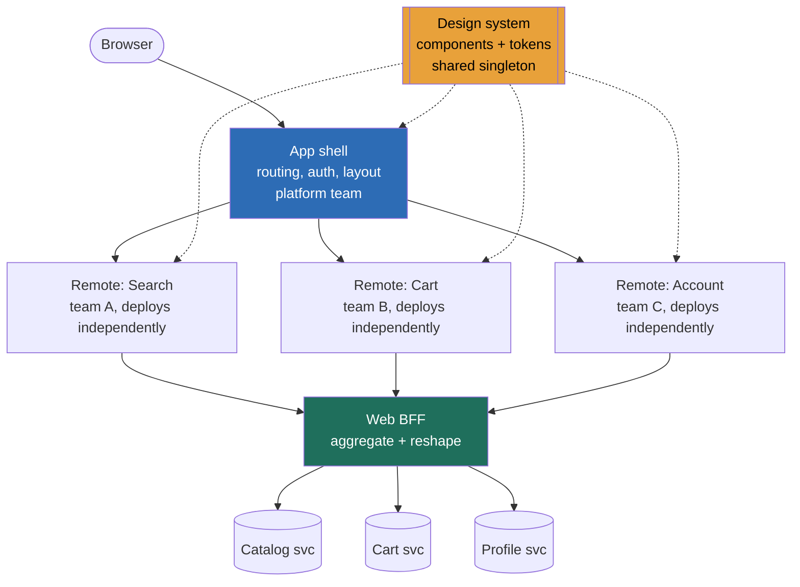

### Learning objectives
- Choose a **rendering strategy** (CSR, SSR, SSG, ISR, streaming SSR + React Server Components, edge) from the requirement, content dynamism, SEO need, TTFB (time to first byte) and interactivity, and name what each choice rejects.
- Treat **Core Web Vitals** (LCP <2.5s, INP <200ms, CLS <0.1) as the performance contract that is visible to search ranking and conversion, and enforce them as a release gate rather than a vibe.
- Decide when a **backend-for-frontend (BFF)** earns its keep against a chatty client, and when a shared API is fine.
- Frame **micro-frontends + Module Federation** as an **org-scaling** decision, the same call as microservices, with the "distributed monolith of the frontend" as its failure mode, and know when a modular-monolith frontend is the right answer.
- Own the **design system as shared platform infrastructure** (components + tokens as the golden path) and the frontend platform org shape, who owns the shell versus the features.

### Intuition first
Think of shipping a furnished living room to a customer, and the different ways to deliver it.

**Client-side rendering (CSR)** is the flat-pack box: you ship the customer a carton of parts and an instruction sheet (a JavaScript bundle) and they assemble the room themselves at home (the browser runs the JS to build the page). Cheap to warehouse and ship (you serve one static file from a CDN), and once the customer owns the tools, sending them another item is quick (fast in-app navigations). But they stare at an empty room until assembly finishes (slow first paint), and a neighbor glancing through the window sees bare floor (a search crawler sees an empty HTML shell).

**Server-side rendering (SSR)** is delivering the sofa fully assembled, built to order in the workshop for each delivery (the server renders HTML per request). The customer sees a furnished room the instant it arrives (fast first paint, crawler-friendly), but the workshop has to build one per order (server CPU per request), and the customer still has to bolt on the legs and wire the electronics before the buttons work (**hydration**, the JS re-attaching to server-rendered HTML). The room *looks* ready before it *works*.

**Static generation (SSG)** is pre-building the room once and warehousing thousands of identical copies to ship instantly off the shelf (rendered at build time, served from the CDN edge, fastest and cheapest). The catch: if the design changes, you rebuild and restock the entire warehouse (a content change needs a rebuild and redeploy). **ISR** (incremental static regeneration) is restocking a fresh version on a timer so most orders still ship from the shelf. **Streaming SSR with React Server Components at the edge** delivers the room in pieces as each is ready and pre-assembles most of it in the workshop, so the customer bolts on far less (stream HTML, ship less JS), and the workshop sits near the customer's city rather than across the country (edge render, lower round-trip).

Two more pieces thread through this. The **BFF** is a local dispatch desk that phones the six warehouses for you and delivers one tailored package, instead of you calling each yourself. **Micro-frontends** are the room assembled from sections built by different workshops that each ship on their own schedule, held together by a shell, and a **design system** is the shared set of standard bolts, panels and finishes so the room reads as one coherent set and not a mismatched jumble.

### Deep explanation

#### The rendering spectrum, and what each choice rejects
Every rendering strategy answers two questions: **where** the HTML is built (client, server, build machine, or edge) and **when** (per request, at build time, or incrementally). The whole spectrum is a trade of first-paint speed and SEO against server cost, freshness and interactivity.

- **CSR (client-side render).** The server ships a near-empty HTML shell plus a JS bundle; the browser fetches data and constructs the DOM. You get cheap hosting (a static file behind a CDN), and fast subsequent navigations because the app is already loaded (the single-page-app feel). You **reject SEO and first paint**: the crawler sees an empty shell (modern Googlebot does execute JS, but on a delayed, budgeted second pass you do not control), and the user sees blank until the bundle downloads, parses and runs. That bundle is the tax: a 300KB to 1MB gzipped bundle can cost 1 to 3 seconds of parse-and-execute on a low-end phone before anything is interactive. **Use when** the surface is behind auth with no SEO value and heavy interactivity, an internal dashboard, a logged-in app.

- **SSR (server-side render, per request).** The server renders full HTML on every request; the browser paints it immediately, then hydrates. You get fast first paint and clean SEO. You **reject cheap static caching**: you are computing HTML on every hit (tens of milliseconds of server CPU per page), so TTFB rises under load and you carry a server fleet you did not need with static files. You also pay **hydration**, the framework ships the component tree twice, once as HTML and again as JS to re-attach event handlers, and that hydration work competes for the main thread and can delay interactivity. **Use when** content is dynamic per request and SEO matters, a product page with live pricing and inventory, a personalized feed.

- **SSG (static site generation, at build time).** Render every page to static HTML at build, serve from the CDN. Fastest TTFB (it is a file at an edge node), cheapest (zero per-request compute), trivially cacheable. You **reject freshness**: content is frozen at build, and any change needs a rebuild-and-redeploy, which on a 10,000-page site is minutes of build time. **Use when** content changes rarely, docs, blogs, marketing pages.

- **ISR (incremental static regeneration).** SSG plus background revalidation: serve the static page, and regenerate it on a schedule or on demand after N seconds so it refreshes without a full rebuild. You get near-static speed with **bounded staleness**. You **reject strict freshness**, you accept the page can be up to N seconds or minutes old, and the first request after expiry can be slower while it regenerates. **Use when** content is mostly static but needs periodic refresh, a catalog page whose price changes hourly, not per request.

- **Streaming SSR + React Server Components (RSC) + edge render.** Stream HTML in chunks as the server produces it, flush the shell and above-the-fold content first and stream the slow parts, so the user sees content before the whole page is ready. With RSC, components render on the server and ship **zero JS** to the client; only interactive "client components" ship JS, which cuts bundle size and hydration cost directly. Run the render at the **edge** (Cloudflare Workers, Vercel Edge) near the user to shave ~50 to 100ms of round-trip versus a single distant origin. This is the current frontier: SSR's first paint and SEO with much less JavaScript and a better TTFB. You **reject simplicity**, the server/client component boundary is a new mental model, the edge runtime constrains you (no full Node APIs), and you take on framework coupling.

The decision rule a Director states out loud: pick by **content dynamism** (static → SSG/ISR, per-request dynamic → SSR/streaming, behind-auth app → CSR), **SEO need** (public and discoverable → server-render, behind login → CSR is fine), **TTFB and first-paint budget**, and **interactivity** (heavy app → accept hydration, mostly-read → ship less JS). "SPA (single-page application) everything" is the anti-pattern, it silently rejects SEO and first paint for the exact pages that drive organic acquisition.

#### Core Web Vitals: the performance contract
Performance is not a feeling, it is three numbers Google publishes, measures in the field (Chrome UX Report / CrUX), and uses as a search ranking signal, and they move revenue:

- **LCP (Largest Contentful Paint)**, time for the largest above-the-fold element to render. **Good <2.5s**, needs-improvement 2.5 to 4s, poor >4s. Driven by TTFB, render-blocking CSS/JS, and image load. Server-rendering, edge, and image optimization move it.
- **INP (Interaction to Next Paint)**, responsiveness, how fast the UI paints after a tap or click. It **replaced First Input Delay as a Core Web Vital in 2024**. **Good <200ms**, poor >500ms. Driven by main-thread work: big bundles, hydration, long tasks. Shipping less JS (RSC, code-splitting) moves it.
- **CLS (Cumulative Layout Shift)**, visual stability, how much the layout jumps as it loads. **Good <0.1**, poor >0.25. Driven by images, ads and fonts without reserved space. Reserving dimensions and using skeletons moves it.

The reason this is a *contract* and not a nice-to-have: it is simultaneously an SEO input and a conversion input, real studies tie faster LCP to measurable lifts in conversion and lower bounce. So the Director move is to make Core Web Vitals a **release gate**, synthetic checks in CI (Lighthouse CI with a bundle-size budget) plus field monitoring on CrUX, and block a deploy that regresses LCP or INP past threshold. Your rendering choice and your bundle budget are chosen partly to hit these numbers, which is what connects the architecture decision to the business.

#### BFF: one tailored round trip instead of six chatty ones
A **backend-for-frontend** is a thin, per-client edge service that aggregates and reshapes backend calls so the client makes one tailored request instead of orchestrating six. Web and mobile have different shapes: mobile on cellular cannot afford six sequential round trips at 100 to 300ms each (that is seconds of dead time) and wants a trimmed payload; web can take richer data in one shot. So you often run a **BFF per client type**, a web BFF and a mobile BFF.

The trade: a BFF is **another service to own, deploy and keep from becoming a dumping ground** for business logic that belongs in the domain services. The **rejected alternative** is the client calling microservices directly, which is chatty (N round trips), couples the client to N backend contracts, and forces the client to do aggregation; or a single general-purpose gateway serving every client identically, which forces a lowest-common-denominator payload that is too heavy for mobile and too thin for web. (A GraphQL layer is the other common answer to the same aggregation problem, one flexible endpoint the client shapes, at the cost of query-complexity and caching governance.)

#### Micro-frontends + Module Federation: an org decision, not a tech fad
A **micro-frontend** architecture splits the frontend into independently deployable slices: a **shell** app owns routing, auth and layout and composes **remotes** (independently built and deployed frontend modules) at runtime. **Webpack Module Federation** (and Vite equivalents) is the mechanism, one app loads another's code at runtime and they negotiate shared dependencies.

The payoff is exactly the microservices payoff, applied to the frontend: **team autonomy and independent deploy**. N teams (search, cart, checkout, account, seller-tools) ship on their own cadence without a shared frontend release train. That is an **org-throughput** win, not a technical one.

The failure mode is exactly the microservices failure mode: the **distributed monolith of the frontend**. It shows up as **shared-state coupling** (remotes reaching into each other's state so nothing deploys independently anyway), **duplicated dependencies** (each remote bundling its own copy of React at ~130KB, tripling framework weight, unless you carefully configure shared singletons), **inconsistent UX** (each team's slightly different button and spacing), and **version skew** across remotes. When you get this, you have paid the full coordination tax and kept none of the independence.

When **not** to: a **single small team should keep a modular-monolith frontend**, one build with clear internal module boundaries. Micro-frontends are pure overhead for one team. The threshold is the same signal as microservices, multiple teams whose release cadences are colliding on one frontend codebase. Split when that contention is real, not on day one. The rejected alternative, micro-frontends from the start "to be modern," buys build-time complexity, dependency-sharing headaches and UX drift to solve an org-scaling problem you do not yet have.

#### Design system as platform, and the org shape
A **design system**, a component library plus **design tokens** (color, spacing, typography as versioned variables), is the frontend's golden path. It buys **consistency** (one brand, one accessibility baseline) and **velocity** (no team rebuilds a datepicker or an accessible modal). The cost is **governance**: it needs an owning team, and versioning discipline, a breaking change to the shared `Button` ripples to every consumer, so the platform team owns semantic versioning, a deprecation path, and the risk of becoming a bottleneck if every change routes through them.

This is where Conway's law becomes explicit. The **frontend platform team** owns the shell, the design system, the build/deploy pipeline, the rendering-framework choice and the Core Web Vitals gate, the paved road. **Feature teams** own their routes or remotes. Your frontend architecture will mirror your team structure whether you plan it or not: N feature teams fighting over one repo *is* the argument for micro-frontends (align the architecture to the org), and one team *is* the argument for a monolith. The Director framing across all of it: **rendering strategy is a cost + SEO + latency decision, micro-frontends are an org-scaling decision, and Core Web Vitals is a gate you enforce.**

Go deeper - hydration cost, islands, and RSC mechanics (IC depth, optional)

- **Why hydration is expensive.** After SSR paints HTML, the framework must walk the entire component tree on the client, re-create the virtual DOM, and attach event listeners to make it interactive. Until that finishes, the page looks ready but taps do nothing (the "uncanny valley" of SSR), and the work is a long task that hurts INP. On a large page this is the dominant interactivity cost.
- **Islands architecture** (Astro, Qwik-style resumability) ships interactivity only for the specific interactive "islands" on an otherwise static page, so most of the page never hydrates. Great for content-heavy, low-interactivity pages; less suited to app-like surfaces where most of the page is interactive.
- **RSC server/client boundary.** In React Server Components, a component is server-only by default (renders to a serialized payload, ships no JS) unless marked a client component (`"use client"`), which ships its JS and hydrates. The design skill is drawing that boundary so the interactive leaves are client components and everything else stays server-only, which is what actually cuts the bundle.
- **Module Federation shared config.** `shared: { react: { singleton: true, requiredVersion } }` forces one React instance across shell and remotes; get it wrong and you ship multiple copies and hit "invalid hook call" runtime errors from duplicate React instances.

### Diagram: frontend platform composition (shell + remotes + design system + BFF)

```mermaid
flowchart TB
  USER([Browser]) --> SHELL[App shell<br/>routing, auth, layout<br/>platform team]
  SHELL --> R1[Remote: Search<br/>team A, deploys independently]
  SHELL --> R2[Remote: Cart<br/>team B, deploys independently]
  SHELL --> R3[Remote: Account<br/>team C, deploys independently]
  DS[[Design system<br/>components + tokens<br/>shared singleton]] -.-> SHELL
  DS -.-> R1
  DS -.-> R2
  DS -.-> R3
  R1 --> BFF[Web BFF<br/>aggregate + reshape]
  R2 --> BFF
  R3 --> BFF
  BFF --> SVC1[(Catalog svc)]
  BFF --> SVC2[(Cart svc)]
  BFF --> SVC3[(Profile svc)]
  style SHELL fill:#2d6cb5,color:#fff
  style DS fill:#e8a13a,color:#000
  style BFF fill:#1f6f5c,color:#fff
```
The shell and design system are platform-owned; each remote is a feature team that deploys on its own cadence; the design system is loaded as a shared singleton so it is not bundled three times; the BFF gives the client one tailored round trip over three backend services.

### Worked example: rendering strategy for a large e-commerce site
Take a big commerce site with an organic-search acquisition engine and a logged-in account area, and choose per surface rather than picking one rendering mode for everything.

- **Marketing home, category and product pages: SSR or ISR.** These drive organic traffic, so SEO and LCP are the business. Category pages that change hourly (not per request) go **ISR**, near-static CDN speed with a bounded staleness window, so we serve at edge speed and refresh price/stock every few minutes. Product pages that need **live** inventory or personalization go **SSR** (or streaming SSR at the edge to keep TTFB low). We **reject CSR** here outright: it would blank the first paint and hand the crawler an empty shell on exactly the pages that earn traffic.
- **Logged-in account dashboard and order management: CSR.** Behind auth, invisible to search, app-like and interactive. A CSR single-page app is the right cost: no server render fleet, no hydration tax, and snappy in-app navigation. We **reject SSR** here, we would be paying per-request render and double-shipping the tree for a page Google never sees.
- **BFF for the web/mobile split.** A **web BFF** returns richer, denser payloads in one call; a **mobile BFF** returns a trimmed payload with fewer round trips because cellular latency makes six sequential calls cost seconds. We **reject one shared API** that would force both clients to the same shape, too heavy for mobile, too thin for web.
- **Core Web Vitals as a gate.** Enforce LCP <2.5s, INP <200ms, CLS <0.1 in CI (Lighthouse with a JS-bundle budget) and monitor CrUX field data; a deploy that regresses LCP or INP past threshold is blocked. This is what keeps "we improved perf" from being a story instead of a number.
- **Micro-frontends only when the org justifies it.** Start as a **modular-monolith frontend**. When five teams (search, cart, checkout, account, seller-tools) are colliding on one release train, extract remotes with Module Federation, sharing React and the design system as singletons so bundles do not triple. A 5-person team keeps the monolith, micro-frontends would be all tax and no benefit.
- **Design system as the golden path.** One component library plus tokens so all five teams' UIs stay consistent and accessible for free, owned by the platform team with versioning discipline.

The signal is not "I used Next.js." It is that **rendering was chosen per surface by requirement, Core Web Vitals is a gate not a hope, the BFF was justified by the mobile/web split, and micro-frontends were treated as an org decision with the distributed-monolith risk named.**

### Trade-offs table: rendering strategies
| Strategy | First paint | SEO | Server cost | Freshness | Interactivity | Use when |
|---|---|---|---|---|---|---|
| **CSR** | slow (blank until JS runs) | poor (empty shell) | very low (static file) | live (fetches on load) | high (SPA) | behind auth, no SEO, app-like |
| **SSR** | fast | strong | high (render per request) | live per request | high (after hydration) | dynamic + SEO-critical |
| **SSG** | fastest | strong | lowest (CDN file) | stale until rebuild | low to medium | rarely-changing content |
| **ISR** | fastest | strong | very low | bounded staleness (N sec) | low to medium | mostly static, periodic refresh |
| **Streaming SSR + RSC / edge** | fast (streamed) | strong | medium (edge render, less JS) | live per request | high (less hydration) | dynamic + SEO + tight INP budget |

### What interviewers probe here
- **"How would you render this site?"** *Strong signal:* picks **by requirement per surface**, SSR/ISR for SEO-critical dynamic pages, CSR for behind-auth app surfaces, streaming/RSC/edge when the JS budget and TTFB are tight, and names what each choice rejects (CSR rejects SEO/first-paint, SSG rejects freshness). *Red flag:* "I'd make it a React SPA" for a public, SEO-driven site, or reaching for one mode by fashion.
- **"What are your performance targets and how do you hold them?"** *Strong:* names **Core Web Vitals with thresholds** (LCP <2.5s, INP <200ms, CLS <0.1), ties them to SEO ranking and conversion, and enforces them as a **CI gate plus field monitoring**. *Red flag:* "it feels fast," no numbers, no gate, treating performance as untracked.
- **"Should this be micro-frontends?"** *Strong:* treats it as an **org-scaling decision** (multiple teams colliding on one release train), names the **distributed-monolith-of-the-frontend** risk (shared state, duplicated deps, UX drift), and says a single team should keep a modular-monolith frontend. *Red flag:* "micro-frontends are more modern/scalable," adopting them for one team, or unaware of the duplicate-dependency bloat.
- **"Why a BFF and not just call the services?"** *Strong:* one tailored round trip versus a chatty client, per-client shaping for the mobile/web split, and names the cost (another service to own). *Red flag:* client orchestrating six backend calls on cellular with no aggregation.

### Common mistakes / misconceptions
- **CSR by default ("SPA everything").** Making a public, SEO-driven site a client-rendered SPA blanks the first paint and hands crawlers an empty shell, tanking LCP and organic traffic on the pages that matter most. Pick rendering per surface.
- **Treating performance as a feeling, not a gated number.** Not knowing the Core Web Vitals thresholds, or not enforcing them in CI and field monitoring, means regressions ship silently and the SEO/conversion cost is invisible until traffic drops.
- **Micro-frontends as fashion.** Adopting them for a single team buys the distributed-monolith of the frontend, shared-state coupling, UX drift, and duplicated dependencies, with none of the team-autonomy payoff. It is an org decision, made when release cadences collide.
- **Not sharing dependencies as singletons.** Letting each remote bundle its own React (~130KB each) triples framework weight and can cause duplicate-instance runtime errors; shared singletons are mandatory in Module Federation.
- **Ignoring hydration cost.** Shipping a huge bundle and hydrating a giant tree makes the page look ready before it works and wrecks INP; ship less JS (RSC, code-splitting, islands) where interactivity is not needed.

### Practice questions
**Q1.** A content-heavy marketing site is currently a client-rendered React SPA and its organic traffic is falling. What is likely wrong and what do you change?

Model answer, try yours out loud first

> *Model:* CSR is almost certainly the cause. The crawler and the first user both get an empty HTML shell until a large JS bundle downloads and runs, so LCP is poor and SEO indexing is delayed or partial, exactly the failure mode for a site that lives on organic search. I would move the public, SEO-driven pages to **server-rendering**: SSG or ISR for pages that change slowly (marketing, articles, category pages, near-static CDN speed with periodic revalidation) and SSR or streaming SSR at the edge for anything genuinely dynamic per request. That restores fast first paint and crawler-visible HTML. I would keep any behind-auth app surface as CSR since SEO is irrelevant there. Then I would put a **Core Web Vitals gate** in CI (LCP <2.5s, INP <200ms, CLS <0.1) with a bundle budget, and watch CrUX field data, so the regression cannot recur silently. The trade I am accepting is a server render cost and hydration on those pages, which is the correct price for SEO and first paint on acquisition surfaces.

**Q2.** Your web app has a fast LCP but users complain it "feels laggy" when they click. Which metric, and what is the architectural fix?

Model answer, try yours out loud first

> *Model:* That is **INP** (Interaction to Next Paint), the responsiveness vital, good is <200ms, and it is decoupled from LCP: the page can paint fast yet block the main thread on interaction. The usual cause is too much JavaScript, a large bundle and heavy hydration monopolizing the main thread, so taps queue behind long tasks. The fixes are architectural, not cosmetic: **ship less JS**, adopt React Server Components so non-interactive components ship zero client JS, code-split so each route loads only what it needs, and consider an islands approach so only interactive parts hydrate. I would also break up long tasks and defer non-critical work. The trade: RSC and an islands model add a server/client-boundary mental model and framework coupling, which is worth it when INP is the bottleneck.

**Q3.** Three feature teams keep blocking each other on one frontend repo's release train. Is this the moment for micro-frontends? What are the risks?

Model answer, try yours out loud first

> *Model:* This is the legitimate trigger, micro-frontends are an **org-scaling** decision and the signal is exactly this, multiple teams whose release cadences collide on one codebase. I would introduce a **shell** that composes independently deployed **remotes** (via Module Federation) so each team ships on its own cadence. But I would name the risks up front, because this is the frontend's version of the distributed monolith: **duplicated dependencies** (share React and the design system as singletons or bundles triple), **shared-state coupling** (keep remotes talking through well-defined contracts/events, not each other's internal state, or nothing deploys independently anyway), and **UX drift** (enforce a shared design system so the pieces stay coherent). If it were a single team, I would explicitly *not* do this, a modular-monolith frontend is simpler and faster; micro-frontends solve an org problem, and a one-team org does not have it.

**Q4.** You need to serve both a web app and a mobile app from the same backend microservices. How do you shape the API, and what is the trade?

Model answer, try yours out loud first

> *Model:* I would put a **BFF per client** in front of the services, a web BFF and a mobile BFF, each aggregating and reshaping the backend calls for its client. Mobile on cellular cannot afford six sequential round trips (hundreds of ms each) and wants a trimmed payload, while web can take richer data in one call, so a single shared API would force a lowest-common-denominator shape that is wrong for both. The BFF gives each client **one tailored round trip** and decouples it from the individual service contracts. The trade I state: each BFF is another service to own, deploy and keep thin (it must not become a home for domain logic that belongs in the services). The rejected alternative, the client orchestrating the six calls itself, is chatty, couples the client to N contracts, and is especially bad on mobile latency. GraphQL is the other valid answer to the same aggregation need, at the cost of query-complexity and caching governance.

### Key takeaways
- **Rendering is a spectrum, chosen per surface by requirement:** CSR (cheap, app-like, but rejects SEO/first-paint), SSR (fast paint + SEO, but server cost + hydration), SSG (fastest/cheapest, but rejects freshness), ISR (static speed + bounded staleness), streaming SSR + RSC/edge (fast paint + SEO with less JS). Name what each rejects.
- **Core Web Vitals is the contract, not a vibe:** LCP <2.5s, INP <200ms, CLS <0.1, visible to search ranking and conversion. Enforce them as a CI gate plus field monitoring so regressions cannot ship silently.
- **A BFF buys one tailored round trip** and per-client shaping (crucial for the mobile/web split) at the cost of another service to own; the rejected alternative is a chatty client or a lowest-common-denominator shared API.
- **Micro-frontends are an org-scaling decision, not a tech fad:** the payoff is independent deploy and team autonomy; the failure mode is the distributed monolith of the frontend (shared state, duplicated deps, UX drift). A single team keeps a modular-monolith frontend.
- **The design system is the frontend's golden path** (components + tokens) that buys consistency and velocity at a governance/versioning cost; the platform team owns the shell, the design system, the pipeline and the Web Vitals gate, feature teams own their routes or remotes (Conway's law, made deliberate).

> **Spaced-repetition recap:** Delivering a furnished room: CSR ships a flat-pack the customer assembles (cheap, but blank first paint and empty HTML for crawlers), SSR delivers it built-to-order (fast paint + SEO, but server cost and hydration to make the buttons work), SSG warehouses pre-built copies (fastest/cheapest, but stale until you rebuild), ISR restocks on a timer, and streaming SSR + RSC at the edge delivers in pieces with far less assembly (less JS, better INP/TTFB). Choose per surface by dynamism, SEO, TTFB and interactivity, each choice rejects something. Hold the line with **Core Web Vitals** as a gate (LCP <2.5s, INP <200ms, CLS <0.1). A **BFF** is the dispatch desk giving each client one tailored round trip. **Micro-frontends** are the org-scaling call (independent deploy for colliding teams) with the distributed-monolith-of-the-frontend risk, one team keeps a modular monolith. A **design system** is the shared bolts and finishes (the golden path) the platform team owns alongside the shell and the Web Vitals gate.
