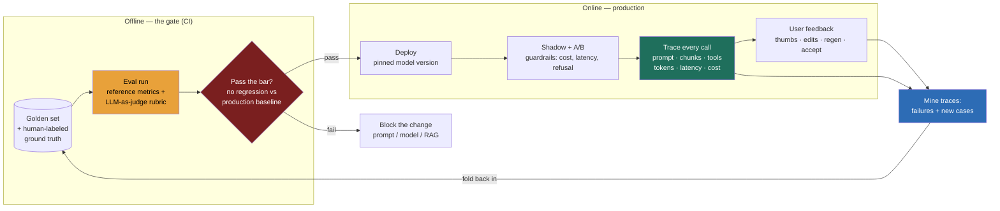

### Learning objectives
- Articulate **why LLM evaluation is uniquely hard** — non-deterministic output, open-ended tasks, no single ground truth, and a quality bar that is *multi-dimensional* (correct? grounded? safe? on-tone?) — and why that makes "it looked fine in the demo" a failure mode, not a sign-off.
- Build an **offline eval harness**: a curated golden set, reference-based metrics where a right answer exists, and **LLM-as-judge** for open-ended quality — while naming the judge's biases (position, verbosity, self-preference) and the mitigations that make it trustworthy.
- Pick **task-specific metrics**: RAG splits into *retrieval* and *generation* failures; classification uses P/R/F1; open generation uses *win-rate vs a baseline* — because a single "accuracy" number hides which half broke.
- Treat **eval as a CI gate**, not a report — every prompt/model/RAG change must pass the golden set before it ships. This is the single highest-leverage LLMOps practice.
- Own the **observability stack** — trace the full chain (prompt, retrieved chunks, tool calls, tokens in/out, latency, cost) — as both your debugger and the source of new eval data, and plan for **drift** (the base model changes under you).

### Intuition first
You wouldn't ship code with no tests. An LLM feature with no eval is **exactly that** — except worse on two counts: the output is **non-deterministic** (the same prompt yields different text run to run), and there is often **no single right answer** to assert against. So the comfortable habit of "I tried five prompts in the playground, looked good, ship it" is the equivalent of merging to main because the happy-path demo worked once on your laptop.

Picture the difference between a **multiple-choice exam** and an **essay exam**. Traditional software is the multiple-choice exam — there's an answer key, the grader is a script, and `assertEqual` either passes or fails. An LLM feature is the **essay exam**: the same question has many good answers and many subtly-wrong ones, and grading requires *judgment* — is it correct, is it grounded in the source, is it the right tone, is it safe? You cannot grade an essay exam with `assertEqual`, so the entire discipline of LLMOps is about **building a credible grader, applying it to a fixed set of questions, and refusing to ship anything that scores worse than what's already live.** Keep that image — *essay exam, not multiple-choice* — because it explains why every technique below exists.

### Deep explanation

**Why eval is genuinely hard — name the four properties.** A designer who treats LLM eval like unit testing will build the wrong harness. Four properties make it different:
- **Non-determinism.** Temperature > 0 means identical input → different output. A single pass tells you almost nothing; you need to run the eval set and reason about *distributions*, not assert a string.
- **Open-endedness.** "Summarize this ticket" has no canonical answer — there are dozens of good summaries and dozens of bad ones, and the line between them is fuzzy.
- **No single ground truth.** For most generative tasks there is no answer key to diff against. You either build one (expensive, human-labeled) or you grade by comparison/rubric.
- **Multi-dimensional quality.** "Good" is not one axis. A support answer can be *factually correct* but *off-tone*, *grounded* but *unsafe*, *fluent* but *not actually answering the question*. Collapsing all of that into one number throws away the information you need to fix it.

The Director-altitude statement: *LLM quality is a distribution over a multi-dimensional, judgment-graded space — so eval is a measurement system you have to build and calibrate, not a pass/fail you get for free.*

**Offline eval: the golden set is the asset.** The foundation is a **curated eval set** (the "golden set") — a fixed collection of representative inputs with, where possible, known-good outputs or graded references. It must look like production: real query distribution, edge cases, the hard 10% that breaks things, and known past failures (every production incident becomes a permanent eval case so it can never silently regress again). A few hundred well-chosen cases beats tens of thousands of generic ones. Three grading approaches, escalating in cost and fidelity:

- **Reference-based metrics** — use when a right answer exists. *Exact-match / F1* for extraction and classification; for free text, *string-overlap* metrics (BLEU, ROUGE) are cheap and deterministic but correlate weakly with human judgment because they reward surface n-gram overlap, not meaning. Use them where the task is constrained enough that overlap *is* correctness (a date extractor, a JSON field), reject them as your primary signal for open generation — they'll happily pass a fluent wrong answer that shares words with the reference.
- **LLM-as-judge** — use a strong model to *grade* outputs against a rubric when there's no reference. This is the workhorse for open-ended quality: scalable, fast, and far better correlated with human judgment than n-gram overlap. It's also where the traps live (next paragraph).
- **Human evaluation** — the gold standard for fidelity and the calibration anchor for everything else, but slow, expensive, and unscalable. You keep a **small** human-labeled set as ground truth and use it to validate that your automated judge agrees with humans.

**LLM-as-judge — powerful, and biased in known ways.** Asking a model "is this answer good, 1–5?" works, but the judge is itself an LLM and carries systematic biases you must engineer around:
- **Position bias** — in a pairwise A-vs-B comparison, judges favor whichever answer is presented *first* (or sometimes last) regardless of quality. *Mitigation:* run each comparison **both orders** and average, or randomize order across the set.
- **Verbosity bias** — judges reward longer, more elaborate answers even when a terse answer is better. *Mitigation:* an explicit rubric that scores *correctness and concision*, and length-controlled comparisons.
- **Self-preference bias** — a judge tends to prefer text generated by *itself* (or its own model family). *Mitigation:* use a judge from a **different** model family than the one under test where you can; cross-check with humans.
- **Brittleness to the prompt** — a vague "rate this" gives noisy scores. *Mitigation:* a **detailed, explicit rubric** with concrete criteria and few-shot examples of each score; ask for a **reasoning-then-score** (the rationale both improves the score and makes the judge auditable).

The two structural mitigations that matter most: **prefer pairwise comparison over absolute scoring** (models are far more reliable at "is A better than B?" than at "is this a 7 or an 8?" — and pairwise gives you a clean *win-rate vs baseline*), and **periodically calibrate the judge against your human-labeled set** — measure judge-vs-human agreement, and if it drifts below your bar, the judge is no longer trustworthy and the rubric or judge model needs work. **Rejected alternative:** a single absolute 1–10 score from a vague prompt, same model family as the system under test, run once — it's cheap and feels like eval, but it's noisy, biased toward your own model, and uncalibrated, so it gives false confidence.

**Task-specific metrics — measure the failure where it lives.**
- **RAG** (Lesson 11.3) splits in two, and the fixes differ, so you *must* separate them: **retrieval quality** — *context recall* (was the answer-bearing chunk retrieved at all?) and *context precision* (how much of what we retrieved was relevant?); and **generation quality** — *faithfulness / groundedness* (does the answer stick to the retrieved context or hallucinate beyond it?) and *answer relevance* (does it actually address the question?). A confident, well-cited, wrong answer is a *retrieval* failure if the right chunk never came back, but a *faithfulness* failure if the right chunk was present and the model ignored it — one number can't tell you which.
- **Classification / routing** — standard **precision, recall, F1** against a labeled set, with the confusion matrix so you see *which* classes confuse.
- **Open-ended generation** (summaries, chat, drafting) — **win-rate vs a baseline** via pairwise LLM-as-judge: "does the new version beat the current production version on this golden set, and by how much?" This is the metric that gates a prompt or model change.

**Online eval: production is the only fully realistic test set.** Offline eval gates the change; online eval tells you what's actually happening with real users on real traffic. The toolkit:
- **A/B tests** — route a fraction of traffic to the new version and compare on *business* metrics (task completion, deflection rate, conversion), not just intrinsic quality. The truth that offline can't give you.
- **Guardrail metrics** — alarms that catch a regression the A/B target missed: refusal rate, latency p95, **cost per request** (Lesson 11.8), error/timeout rate, safety-filter trips. A change that lifts quality 3% but doubles cost or refusal rate is not a win.
- **User feedback, explicit and implicit.** Explicit: thumbs up/down, star ratings — high signal, low volume (most users never click). Implicit is the rich vein: did the user **accept** the suggestion, **edit** it (and how much), **regenerate**, **copy** it, or immediately **rephrase and ask again** (a silent failure)? Implicit signals are abundant but noisy — instrument them deliberately.
- **Shadow deployment** — run the new version *in parallel* on live traffic without showing users its output, log both, and compare. Catches real-world failures with **zero user risk** before you route a single real request to it. The cost is double inference on shadowed traffic — so shadow a sample, not 100%.

**Regression gating: eval as a CI gate is the whole ballgame.** This is the single most important practice in LLMOps, and the one most teams skip. **Every change to a prompt, the model version, the RAG pipeline, or a tool definition must run against the golden set and must not regress below the bar before it ships** — exactly like a test suite blocks a merge. Without this gate, quality erodes invisibly: someone "improves" a prompt, it helps the three cases they eyeballed and quietly breaks thirty they didn't, and you find out from a customer. **"Looked fine in a demo" is how quality silently regresses.** The gate converts that from an inevitability into a blocked PR. **Rejected alternative:** manual spot-checking before each release — it doesn't scale, it's biased toward the cases the author already has in mind, and it has no memory of past failures, so the same regression recurs. The gate is also what lets you move *fast*: with a trustworthy eval suite, a junior engineer can change a prompt confidently because the gate catches what their eyeballs miss.

**Observability and tracing: your debugger and your eval-data mine.** An LLM call is not one request — it's a *chain* (retrieve → assemble prompt → call model → maybe call a tool → call again). When the output is wrong, you cannot debug from the final string; you need the **full trace**: the exact prompt sent, the retrieved chunks and their scores, every tool call and its result, tokens in/out, latency per step, and **cost per call**. Tools in the **LangSmith / Langfuse / Phoenix** class capture this. Tracing serves two jobs: it's how you **debug** a specific bad output (you can see the wrong chunk that poisoned the answer), and it's how you **grow the eval set** — you mine production traces for failures and interesting cases and fold them back into the golden set, so the harness tracks the real distribution and every new failure becomes a permanent regression test. This closes the loop: production teaches the eval set, the eval set gates production.

**Drift and versioning — the ground moves under you.** Two kinds of drift: **model drift** — the provider updates the model behind a stable API endpoint, so behavior changes without you deploying anything (your carefully-tuned prompt now responds differently); and **data drift** — the input distribution shifts (new product, new user behavior) so yesterday's golden set no longer represents today's traffic. Defenses: **pin model versions** explicitly (use the dated/pinned endpoint, not the floating "latest" alias) so upgrades are a deliberate, eval-gated decision rather than a surprise; **continuously re-run eval** on a schedule, not just on PRs, to catch silent provider-side changes and data drift; and **version everything** — prompts, model IDs, RAG configs, and the eval set itself — so every production result is reproducible and you can bisect a regression to the change that caused it. Treat the prompt like code: it lives in version control, it has a changelog, and it ships through the gate.

**Cost and tokens are a first-class metric.** Quality is not the only axis you gate on. Tokens-in/tokens-out and **cost per request** belong in every trace and every guardrail (a quality win that triples cost may be a net loss), and in the regression report alongside the quality score. The full treatment — caching, model-tiering, batching, and the economics of the call — is Lesson 11.8; here the point is narrow: **if your eval and observability don't account for cost, you're optimizing half the system.**

Go deeper — judge calibration, RAG metric mechanics, and eval-set hygiene (IC depth, optional)

- **Quantifying judge trust:** measure judge-vs-human agreement with **Cohen's κ** (or simple % agreement) on the human-labeled set. A κ below ~0.6 means the judge disagrees with humans too often to gate on; fix the rubric, add few-shot anchors, or change the judge model, then re-measure. Track κ over time — it drifts as the judge model is updated provider-side.
- **Pairwise → ranking:** for comparing many variants, run pairwise judgments and aggregate into a ranking with an Elo/Bradley-Terry model (the LMSYS Chatbot Arena approach). More robust than absolute scores but O(variants²) comparisons — sample pairs rather than running the full matrix.
- **RAG metric computation (RAGAS-style):** *faithfulness* = decompose the answer into atomic claims, then check each claim is entailed by the retrieved context (an LLM-judged NLI step); the score is the fraction of supported claims. *Context precision* rewards relevant chunks ranked high; *context recall* needs a reference answer to check whether all its facts were retrievable. These are themselves LLM-judged, so they inherit judge bias — calibrate them too.
- **Eval-set hygiene:** keep a **held-out** slice you never tune against, or you'll overfit the prompt to the eval set (Goodhart's law — the metric stops measuring quality once it becomes the target). Refresh the set as the distribution drifts, and de-duplicate so a single over-represented case doesn't dominate the score.
- **Synthetic eval data:** when you lack labeled cases, generate candidate Q&A pairs from your corpus with an LLM to bootstrap a golden set — but **human-review the synthetic set** before trusting it, or you bake the generator's blind spots into your gate.

### Diagram: the LLMOps loop

The loop is the lesson: **offline eval gates the change → deploy a pinned version → online eval + tracing + feedback observe reality → mine traces into the golden set → re-eval.** Skip any arrow and quality leaks: skip the gate and regressions ship; skip tracing and you can't debug or grow the set; skip the fold-back and your eval set rots while production drifts.

### Worked example: a "small prompt tweak" that quietly drops groundedness 8%

A RAG support assistant is live: it answers customer questions from the docs corpus, faithfulness is the bar (a hallucinated answer is worse than a refusal). An engineer wants the answers warmer, so they edit the system prompt — adding "Be friendly and reassuring, and reassure the customer their issue is common and easily solved." In the playground it reads great on three sample tickets. Here's how the harness catches what the demo can't:

1. **The gate runs on the PR.** The change triggers the eval suite against the **golden set of ~300 real tickets** with known-good grounded answers. The pairwise LLM-as-judge (different model family, both orders averaged, explicit faithfulness rubric) compares new vs production.
2. **Quality looks mixed, then the metric split tells the story.** Overall "helpfulness" win-rate is slightly *up* (it does read warmer). But the report doesn't collapse to one number — **faithfulness drops 8%**: the "reassure them it's easily solved" instruction nudges the model to *invent* reassuring detail not in the retrieved docs ("this usually resolves within a few minutes") — confident, friendly, and **ungrounded**.
3. **The gate blocks the merge.** Faithfulness is a hard gate (regression > 2% blocks), so the PR fails CI. No customer ever sees the regression. Contrast the no-harness world: it ships on the strength of three good demos and silently degrades grounding for weeks until a customer is told something false and complains.
4. **Tracing localizes the cause in minutes.** The engineer opens the traces for the failing cases: the retrieved chunks are *correct* (retrieval recall is fine), but the generated answer adds claims absent from those chunks. That pinpoints it as a **generation/faithfulness** failure caused by the prompt, not a retrieval failure — so the fix is the prompt, not the index.
5. **The fix and the permanent guard.** Reword to "be friendly *and* answer only from the provided docs; do not speculate about timelines." Re-run the gate: warmth retained, faithfulness back to baseline, merge passes. The worst failing cases are **added to the golden set** so this exact regression can never recur silently.

Every step traces to the discipline: the **golden set** caught what eyeballs missed, the **metric split** said *which* half broke, **tracing** said *why*, and the **gate** stopped it from shipping — and the eval set is now stronger than before the change.

### Trade-offs table: offline eval methods

| Dimension | **Reference-based metrics** (exact-match/F1, BLEU/ROUGE) | **LLM-as-judge** (rubric / pairwise) | **Human evaluation** |
|---|---|---|---|
| Cost per case | lowest (deterministic compute) | low–moderate (a model call per grade) | highest (human time) |
| Scalability | very high (CI on every PR, free) | high (CI-friendly at scale) | low (sample only) |
| Fidelity to "real quality" | low for open text (rewards surface overlap); high for constrained tasks | moderate–high *if calibrated*; carries position/verbosity/self-preference bias | highest — the ground truth |
| Needs a reference answer | yes | no (pairwise/rubric works referenceless) | no |
| Main risk | passes fluent-wrong answers that share words | uncalibrated judge gives false confidence | doesn't scale; rater inconsistency |
| **Use when…** | extraction/classification/JSON where overlap *is* correctness | open-ended generation, RAG faithfulness, win-rate gating — the workhorse | the calibration anchor; a small labeled set to validate the judge and settle high-stakes calls |

The pattern in one line: **automated metrics gate every change; LLM-as-judge does the open-ended grading; humans are the small, expensive anchor that keeps the judge honest.**

### What interviewers probe here
- **"How do you know a prompt change didn't regress quality?"** — *Strong signal:* eval as a **CI gate** on a versioned golden set, pairwise win-rate vs the production baseline, hard gates on safety/faithfulness, past incidents folded in as permanent cases. Names "looked fine in a demo" as the failure mode the gate exists to kill. *Red flag:* "we test it in the playground" / manual spot-checks / no fixed eval set — quality erodes invisibly.
- **"LLM-as-judge — what's wrong with it, and how do you trust it?"** — *Strong:* names **position, verbosity, and self-preference** bias and the mitigations (pairwise, both orders averaged, explicit rubric, different judge family), and — the key move — **calibrates the judge against a human-labeled set** and tracks agreement. *Red flag:* "ask GPT to rate it 1–10" with no awareness of bias or calibration.
- **"Measure RAG retrieval failures vs generation failures separately — why and how?"** — *Strong:* the two fail independently and the fixes differ; *retrieval* = context recall/precision (right chunk fetched and ranked?), *generation* = faithfulness/answer-relevance (did it stick to the chunk?). A confident-wrong answer is a retrieval failure if the chunk was missing, a faithfulness failure if it was present and ignored — one number can't tell you which. *Red flag:* one blended "accuracy" number with no idea which half to fix.
- **"What do you trace, and why?"** — *Strong:* the full chain — prompt, retrieved chunks + scores, tool calls, tokens in/out, latency, **cost** — as both debugger and the mine that grows the eval set. *Red flag:* logs only the final answer.

The through-line at Director altitude: **you cannot responsibly ship or scale an LLM feature without an eval harness — it is simultaneously your regression suite and the gate that lets the team move fast safely.** Own the **quality bar and the gate** (what "good enough" means, what blocks a ship, that the judge is calibrated to humans); **delegate building the harness** with that bar stated: "I want every prompt/model/RAG change gated on a golden set with calibrated LLM-as-judge, faithfulness as a hard gate, cost in the guardrails — have the platform team stand up the harness on Langfuse; my prior is that the gate buys back more velocity than it costs within a quarter."

### Common mistakes / misconceptions
- **No eval at all — "the demo looked fine."** The default failure. A non-deterministic, open-ended system with no harness regresses silently; you find out from customers.
- **One blended "accuracy" number.** It hides whether retrieval or generation broke, and whether you traded faithfulness for warmth. Measure the dimensions separately.
- **Trusting an uncalibrated judge.** LLM-as-judge has position/verbosity/self-preference bias; without pairwise comparison, an explicit rubric, and periodic human calibration, you're gating on a biased, noisy signal.
- **Eval as a report, not a gate.** A dashboard nobody must pass before shipping changes nothing. The value is in *blocking the merge* on a regression.
- **Pinning to "latest" and ignoring drift.** The provider updates the model under your stable endpoint; pin versions and re-run eval on a schedule, or your tuned prompt silently changes behavior.

### Practice questions

**Q1.** Your team ships LLM prompt changes weekly and quality "feels" like it's slowly getting worse, but no one can point to a cause. What's the root problem and how do you fix it structurally?
> *Model:* No **regression gate**. Each weekly change is eyeballed on a few cases; each quietly breaks cases nobody checked, and the damage compounds. Fix: build a **versioned golden set** (seed it from production traces and every past incident) and run it as a **CI gate** — pairwise win-rate vs the current production version via a calibrated LLM-as-judge, with hard gates on faithfulness/safety. No prompt/model/RAG change merges without passing. Now regressions are blocked at PR time instead of discovered in aggregate weeks later, and the gate *speeds up* shipping because changes are safe to make.

**Q2.** You're using GPT-4-class as an LLM-judge to grade your GPT-4-based assistant. What's suspect, and what would you change?
> *Model:* Several biases. **Self-preference** — a judge tends to favor text from its own family, so grading your own model's output with the same family inflates scores; use a **different judge family** where possible. **Position bias** — pairwise comparisons favor order; run **both orders and average**. **Verbosity bias** — reward length unless the rubric scores concision. And it's likely **uncalibrated** — validate it against a **small human-labeled set** (measure agreement) before trusting it to gate, and re-check periodically since the judge model drifts. Without that, you have a confident, biased grader giving false green lights.

**Q3.** A RAG answer is fluent, well-cited, and wrong. How do your metrics tell you whether to fix retrieval or generation?
> *Model:* Split the metrics. Check **context recall** — was the answer-bearing chunk retrieved at all? If **no**, it's a *retrieval* failure: fix chunking/hybrid/reranking (Lesson 11.3), the model never had a chance. If **yes** (the right chunk *was* in context) but the answer contradicts or invents beyond it, that's a **faithfulness** failure: the model ignored its grounding — tighten the grounding instruction, lower temperature, or check the chunk was buried mid-context. The trace settles it: read the retrieved chunks for that case. One blended accuracy number can't distinguish these, and the two fixes are completely different.

**Q4.** The model provider pushes a silent update to the endpoint you call. How would you have known, and how do you prevent surprises?
> *Model:* You'd know if you **re-run the eval set on a schedule** (not just on PRs) — a faithfulness/win-rate dip with no deploy of your own is the signature of provider-side drift. Prevention: **pin to a dated/versioned model endpoint** rather than the floating "latest" alias, so upgrades are a deliberate, eval-gated choice; **version everything** (prompt, model ID, RAG config) so results are reproducible and you can bisect; and treat a provider upgrade like any other change — run it through the gate before adopting it. Same harness, now defending against a change *you* didn't make.

### Key takeaways
- **Eval is hard because the system is non-deterministic, open-ended, has no single ground truth, and quality is multi-dimensional** (correct? grounded? safe? on-tone?). It's an essay exam, not multiple-choice — you build and calibrate a *grader*, you don't get pass/fail for free.
- **Offline eval = a versioned golden set + the right grader:** reference metrics where a right answer exists, **LLM-as-judge** for open-ended quality (calibrated against a small human-labeled set), with humans as the expensive anchor. Measure RAG **retrieval** (context recall/precision) and **generation** (faithfulness/relevance) *separately* — they fail independently.
- **LLM-as-judge is biased** (position, verbosity, self-preference). Trust it only via **pairwise comparison, both orders averaged, an explicit rubric, a different judge family, and periodic human calibration.**
- **Eval as a CI gate is the single most important LLMOps practice** — every prompt/model/RAG change must pass the golden set before shipping. "Looked fine in a demo" is how quality silently regresses; the gate also lets the team move fast safely.
- **Trace the full chain** (prompt, chunks, tool calls, tokens, latency, **cost**) — it's your debugger *and* the mine that grows the eval set. Plan for **drift** (pin model versions, re-eval on a schedule), and treat **cost per request** as a first-class gated metric (Lesson 11.8).

> **Spaced-repetition recap:** LLM eval = essay exam, not multiple-choice — non-deterministic, open-ended, no answer key, multi-dimensional quality, so "looked fine in the demo" is the failure mode. **Offline:** versioned golden set + reference metrics where a right answer exists + **LLM-as-judge** (pairwise, both orders, explicit rubric, different family, **calibrated to a small human set**) for open-ended quality. Split RAG into **retrieval** (context recall/precision) vs **generation** (faithfulness/relevance) — they break independently. **The gate is everything:** every prompt/model/RAG change must pass the golden set in CI before it ships, and that gate is what lets you move fast. **Trace** the whole chain (prompt · chunks · tools · tokens · latency · **cost**) as debugger and eval-data mine; fold production failures back into the golden set. Defend against **drift** (pin versions, re-eval on a schedule). Own the bar + the gate, delegate the harness with the bar stated. Cross-ref: 11.3 (RAG retrieval vs generation eval), 11.5 (eval gates the build-vs-adapt decision), 11.8 (cost accounting), 11.14 (agent trajectory eval).
