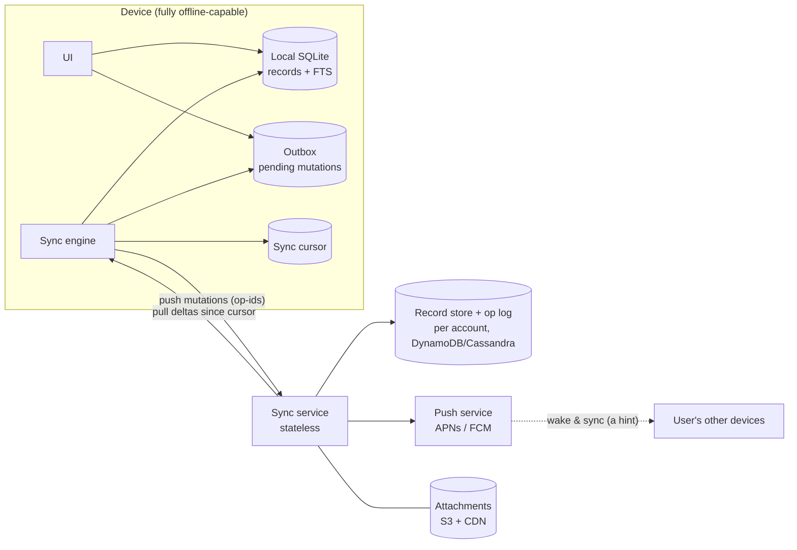
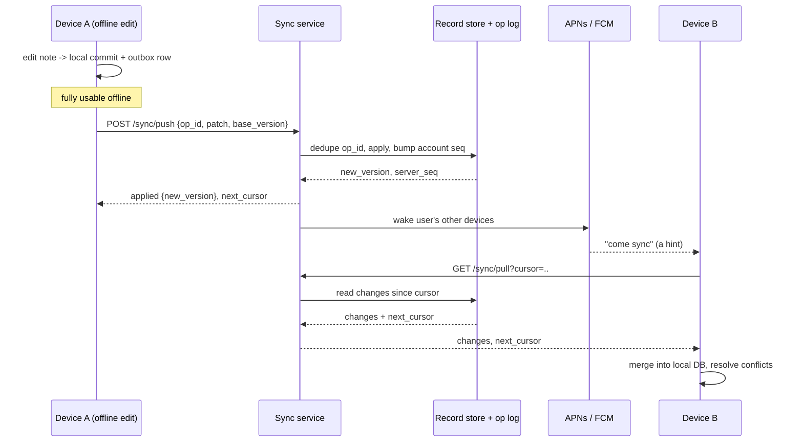

### Learning objectives
- Run the **RESHADED** spine where the hard part lives on an untrusted, frequently-partitioned device, defending each step against battery, data, and convergence cost.
- Separate the two engines of offline-first: a **local database that is the source of truth for the UX** (reads and writes instant, offline-capable) and a **delta-sync protocol keyed by a per-account cursor** (reconnection cheap and incremental).
- Quantify what a Director can stand behind: **20M users, 3 devices each, ~4 MB per account (40 MB for power users), ~6k mutations/s peak, KB-sized deltas, an ~8k/s reconnect storm**, and why this is a per-account sync problem, not a live-socket one.
- Make the **conflict-resolution** call explicit: per-field last-writer-wins for scalar fields, merge or keep-both for text, never silent data loss, and know when it graduates to a **CRDT** (conflict-free replicated data type).
- Know where a Director **goes deep** (conflict cases, cursor design, push-as-a-hint) and where they **delegate a benchmark** (on-device store, merge UX, CRDT investment).

### Intuition first
An offline-first app is a **fleet of ships that each keep their own logbook**, coordinated by a harbor master, not a single control tower with a perfect radio link to every ship.

Each ship (a phone, tablet, laptop) carries its own logbook (a local database) and writes in it continuously, in a storm or a dead zone, with no contact; the writing never waits for the harbor. On reaching port it hands the harbor master (the server) the pages it wrote since it last docked and gets back the pages the *other* ships filed while it was away. The harbor master keeps the durable master log, so a brand-new ship can be brought up to speed.

Three things make this real, not a toy. First, a ship must write a full page with **no radio**, so the logbook, not the harbor, is what the crew reads and writes. Second, two ships can log the **same event differently** while out of contact (you edit a note on your phone and tablet, both offline), so the harbor master needs a reconciliation rule that never quietly tears one page out. Third, when a **whole convoy returns at once** (a regional outage heals and half a million devices reconnect in a minute), the harbor cannot melt down, and a ship back from a two-week voyage cannot re-file its logbook from page one. Everything hard here, the local store, sync protocol, conflict handling, reconnect burst, and cold start, is one of those three.

This is the **opposite** of a delete-on-delivery messaging system: the server is a **durable, permanent source of truth**, because your notes must survive and appear on every device, including one you buy tomorrow. And the network is **absent by default**: a design that assumes a live connection fails the moment a user walks into an elevator.

---

### R - Requirements

"Build an offline notes app" hides a dozen products. The signal is cutting to a defensible core and saying why.

**Clarifying questions (and assumed answers):**
- *Single-user multi-device, or multi-user shared docs?* → **Single user, multiple devices** (phone + tablet + web); team sharing is v2. This bounds the conflict problem hugely: conflicts are between *your own* two or three devices, not thousands of simultaneous editors. Live co-editing defers to Design evolution, where it forces a CRDT.
- *Does the server keep history?* → **Yes**, the durable, authoritative store keeps everything, the deliberate inverse of a transient messaging queue. Load-bearing: a new device must reconstruct the full account.
- *How long offline?* → **Days to weeks.** The motivating user is a field worker in low connectivity, so I design for long partitions and large backlogs, not a thirty-second subway gap.
- *How real-time must sync be?* → **A few seconds when online is plenty.** Not chat. That lets me use pull-based deltas plus a push-to-wake hint instead of millions of live sockets, the biggest cost decision here.
- *What is acceptable on conflict?* → **Never silently lose user text.** Scalar fields (a done-checkbox, a due-date) can take last-writer-wins; a note body cannot, losing paragraphs is a product failure.

**CUT (with the reason):** live collaborative editing (a CRDT problem, deferred), rich-media editing and version-history UI (product scope), full team permissions and sharing (v2), and end-to-end encryption (added later to show its shape). Designing co-editing plus sharing plus E2E in 45 minutes is the red flag.

**Functional:** create, edit, view, delete notes and tasks **fully offline**; **automatic background sync** across the user's devices on reconnect; **correct conflict handling** for concurrent offline edits; **local full-text search**; **attachments** (images, files); a **push notification** to wake other devices (and, later, alert on a shared change).

**Non-functional (these drive every later decision):**
- **Offline-first correctness:** every operation succeeds locally with zero network. The headline NFR (non-functional requirement), forcing a local-authoritative store plus an outbound queue.
- **Durability / no data loss:** a committed local edit survives app kill, reboot, and a failed sync, and once synced is durably stored server-side across zones.
- **Convergence:** after all devices reconnect, they converge to the same state (eventual consistency), conflicts resolved deterministically and never by dropping text.
- **Efficiency:** sync is incremental (a delta, not a full re-download), and a day of edits costs tens of KB, not MB, respecting battery and metered-data budgets.
- **Sync latency:** both online, a change reaches the other device in a few seconds (p95 under ~5 s). Deliberately not real-time.

The decisive requirement is **offline-first plus convergence**. It forces the whole architecture: a local database as the source of truth for the UX, an outbound mutation queue, a pull-deltas-since-cursor protocol, and a conflict rule.

---

### E - Estimation

Enough math to size the account, sync payloads, and reconnect burst, and expose this as a **per-account delta-sync** problem, not a live-connection one.

**Assumptions:** 20M registered users, 5M DAU (daily active users); 3 devices per user; 2,000 notes per account average, with power users at 20,000+; a note averages ~2 KB of text plus metadata (attachments are separate); an active user makes ~50 mutations/day (creates, edits, check-offs).

**Account size (the number that drives cold sync):**
```
2,000 notes x 2 KB   ≈ 4 MB text per typical account
20,000 notes x 2 KB  ≈ 40 MB for a power user
```
Attachments live in blob storage, fetched lazily, so they stay out of these numbers.

**Server storage:**
```
20M accounts x 4 MB ≈ 80 TB text (pre-replication)
+ per-account operation log + replication + power-user skew → low hundreds of TB
```
Attachments in S3 are separate and larger, and offloaded to a CDN.

**Mutation rate (the write load):**
```
5M DAU x 50 mutations/day = 250M/day ≈ 2,900/s average → ~6k/s peak
```
Each mutation is small, a patch of `{op_id, note_id, patch, base_version, ts}` at ~200 to 500 B, and even a full-note replace is ~2 KB.

**Sync payload sizes (the efficiency win):**
```
Reconnect after 1 hour offline  → a handful of changed notes → a few KB
Reconnect after 1 day offline   → tens of changed notes      → ~50 to 100 KB
Cold sync (new device/install)  → the whole account          → 4 MB typical, 40 MB power user
Push after 2 weeks offline      → ~500 queued local ops x 300 B ≈ 150 KB outbound
```
Delta-since-cursor keeps the steady state in KB. Only the **cold sync** of a fresh device is expensive, the case to engineer around.

**Reconnect storm (the concurrency spike):**
```
A regional outage heals; ~500k devices reconnect within a minute:
  500,000 / 60 ≈ 8,300 sync-open requests/s burst on top of baseline
```
This is a thundering-herd read spike, and naming it is the Director signal.

**Push and connections (why this is not messaging):** we do **not** hold 20M live sockets. Sync is pull-based; APNs/FCM (Firebase Cloud Messaging) only **wake a device to sync**, built for billions of messages, so the coalesced ~100M wakes/day (~1,200/s) is trivial. At most we hold a socket for the **foreground, actively-editing sessions** (call it 500k to 1M concurrent) for snappier propagation, a fraction of a messaging app's load.

**The one-line takeaway:** size for **KB-sized deltas, a painful tens-of-MB cold-sync tail, ~6k mutations/s, and an ~8k/s reconnect burst**, not for millions of sockets. The scarce resources are the user's **battery and data**, and the server's **cold-sync and reconnect** paths.

---

### S - Storage

Two stores, and conflating them is the classic mistake: a local store on the device and a durable store on the server.

**On the device (the source of truth for the UX).** **SQLite**, embedded on every mobile OS, wrapped by the platform's local layer (Core Data / Room, or a sync-aware layer like Realm or WatermelonDB). It holds three things: **note/task records**, a **pending-mutations outbox table**, and the **sync cursor**. It fits because it is transactional locally, letting a note write and its outbox row commit **in one atomic transaction** (killing the on-device dual-write bug), and gives fast indexed queries and **FTS5 full-text search**, so offline search never touches the server. *Rejected, raw files or a plain key-value store:* no transactions and no query or index, so you hand-roll local consistency and search and get both wrong. *Rejected, a server round-trip per read or write:* that is the definition of not offline-first, failing the headline NFR.

**On the server (the durable source of truth for convergence and new-device bootstrap).** Two structures:
1. **The record store**, notes and tasks with version metadata, partitioned by `account_id`. **Choice: a DynamoDB or Cassandra-class store** (partition key `account_id`, sort key `note_id`): every sync query is scoped to one account, so a delta read is a single-partition scan, and the store scales horizontally to absorb ~6k writes/s across 20M accounts. *Rejected, a single Postgres primary:* it bottlenecks and we need no cross-account joins; sharded Postgres (Vitess) is a viable alternative for richer per-account transactions.
2. **The per-account operation log**, an append-only change feed where each mutation gets a **monotonically increasing server sequence number scoped to the account**. It powers "pull everything since cursor," its sequence the backbone of convergence.

**Attachments** go to **S3 plus a CDN**; records carry only a pointer and a content hash, and bytes are uploaded and downloaded lazily, off the sync path. Unlike a delete-on-delivery queue, the server **keeps everything**, because the product is durable notes that must reach any device, including a brand-new one.

---

### H - High-level design

The design splits into an **offline-capable client** (local DB is authoritative, a background sync engine reconciles) and a **stateless server sync tier** (applies mutations, serves deltas, wakes other devices), with push used only as a hint.


```mermaid
flowchart LR
  subgraph DEVICE["Device (fully offline-capable)"]
    UI["UI"]
    DB[("Local SQLite<br/>records + FTS")]
    OUT[("Outbox<br/>pending mutations")]
    CUR[("Sync cursor")]
    SE["Sync engine"]
    UI --> DB
    UI --> OUT
    SE --> OUT
    SE --> DB
    SE --> CUR
  end

  SE -->|"push mutations (op-ids)"| SYNC["Sync service<br/>stateless"]
  SYNC -->|"pull deltas since cursor"| SE

  SYNC --> REC[("Record store + op log<br/>per account, DynamoDB/Cassandra")]
  SYNC --> PUSH["Push service<br/>APNs / FCM"]
  PUSH -.->|"wake & sync (a hint)"| OTHER["User's other devices"]
  SYNC --- BLOB[("Attachments<br/>S3 + CDN")]
```

**Happy path, a user edits a note on the phone while offline:**
1. The app writes the new record version to SQLite **and** appends a mutation to the outbox in **one local transaction**, so the UI updates instantly with read-your-writes at zero network, and a crash cannot leave an edit without its outbox row or an orphan row for a rolled-back edit.
2. When connectivity returns, the sync engine **drains the outbox**: it pushes the mutations (each with its `op_id`) to the sync service, which dedupes on `op_id`, applies them to the record store, bumps the account's server sequence, appends to the op log, and returns the new versions and cursor. Recording applied `op_id`s makes a retried push idempotent.
3. The sync service asks the **push service** to wake the user's other devices with a "come sync" nudge.
4. Each other device, on push wake or next foreground, **pulls deltas since its cursor**, applies the changed records and new cursor to local SQLite, resolves any conflict against its pending edits, and updates the UI.

**Offline path:** there is no special offline path, which is the point. The device always reads and writes locally; being offline just means the outbox grows and the cursor does not advance until connectivity returns.

Two defining choices: **(a)** the **local DB is the source of truth for the UX**, so reads and writes are local and instant and sync is out-of-band; **(b)** sync is **pull-based deltas keyed by a per-account cursor** with push only as a wake hint, keeping us off the millions-of-sockets hook and turning a reconnect into a cheap cursor check.

---

### A - API design

Because sync tolerates seconds of latency, the core API is a small, batched, idempotent **REST/HTTPS** surface, not a persistent socket. Every call carries a bearer token and a `device_id`.

**Push mutations (upload the device's local changes):**
```
POST /v1/sync/push
{ device_id, base_cursor,
  mutations: [ { op_id,            // client-generated UUID = idempotency key
                 note_id,          // client-generated, stable before first sync
                 type: "create|update|delete",
                 patch | fields,   // per-field patch, not a whole-note blob
                 base_version,     // the version this edit was made against
                 client_ts } ] }
-> 200 { applied:   [ {op_id, note_id, new_version, server_seq} ],
         conflicts: [ {op_id, note_id, server_version, resolution} ] }
```
The `op_id` is the idempotency key: the network is at-least-once, so a flaky connection resends, and the server **dedupes on (account, op_id)** to turn at-least-once transport into exactly-once apply. `base_version` lets the server detect a concurrent edit.

**Pull deltas (download remote changes since the cursor):**
```
GET /v1/sync/pull?device_id=..&cursor=<opaque>&limit=500
-> 200 { changes: [ {note_id, version, updated_at, tombstone?, patch|body} ],
         next_cursor: <opaque>, has_more: bool }
```
The cursor is an **opaque encoding of the per-account server sequence** the device has consumed, never a wall-clock timestamp. Pagination (`limit` + `has_more`) lets a cold sync or a two-week backlog stream in chunks. An unchanged cursor returns empty `changes` by reading one per-account sequence, the cheap fast-path that makes a reconnect storm survivable.

**Supporting surface:** `POST /v1/devices/push-token` (register the APNs/FCM token), `GET /v1/media/upload-url` and `download-url` (presigned S3, out of band).


```mermaid
sequenceDiagram
  participant A as Device A (offline edit)
  participant S as Sync service
  participant R as Record store + op log
  participant P as APNs / FCM
  participant B as Device B

  A->>A: edit note -> local commit + outbox row
  Note over A: fully usable offline
  A->>S: POST /sync/push {op_id, patch, base_version}
  S->>R: dedupe op_id, apply, bump account seq
  R-->>S: new_version, server_seq
  S-->>A: applied {new_version}, next_cursor
  S->>P: wake user's other devices
  P-->>B: "come sync" (a hint)
  B->>S: GET /sync/pull?cursor=..
  S->>R: read changes since cursor
  R-->>S: changes + next_cursor
  S-->>B: changes, next_cursor
  B->>B: merge into local DB, resolve conflicts
```

*Rejected, full-state sync (client ships its whole DB, server diffs):* simple, but O(account size), tens of MB every sync, destroying battery and data budgets; delta-since-cursor is mandatory. *Rejected, a persistent WebSocket as the primary channel for every device:* unnecessary at a few-seconds latency and expensive, since millions of idle sockets drain battery and add server cost; we pull and wake instead, holding a socket only for an active foreground session. *Rejected, a wall-clock "since" cursor:* clock skew across devices and servers reorders or silently drops changes, so the cursor must be a **server-assigned monotonic per-account sequence**, not a timestamp.

---

### D - Data model

Version and tombstone decisions determine whether the system converges.

**Record (note/task), on device and on server:**
```
note_id       UUID, client-generated so an offline-created note has a stable ID
account_id
type          note | task
title, body, done, due_date, ...
version       server-assigned, monotonic per note
updated_at
server_seq    the per-account sequence at which this version committed (drives cursor pull)
tombstone     soft-delete flag (never hard-delete until GC-safe)
content_hash  for dedupe + attachment pointer
```
**Client-generated `note_id` is load-bearing:** a note created offline needs a stable ID *before* it reaches the server, so IDs are client UUIDs (v7, sorting by creation time), not server-assigned sequential IDs that need a round trip and break offline creation. Collision risk is negligible.

**Tombstones are non-negotiable.** If A deletes note N while B is offline and we **hard-delete** N on the server, then on reconnect nothing in the delta tells B that N is gone, so B's local copy survives and its next push **resurrects the deleted note**. A soft-delete tombstone propagates like any other change; we retain it until every device's cursor has passed it, then garbage-collect.

**Operation / mutation (outbox on device, op log on server):**
```
op_id         client UUID, the idempotency key
note_id, type
patch | fields
base_version  the version the edit was made against → concurrency detection
client_ts, device_id
```
On the device these sit in the outbox until acked; on the server they are the append-only per-account change feed carrying the monotonic sequence.

**Sync cursor / checkpoint (per device):** the last per-account `server_seq` the device has fully consumed, stored locally and sent on pull. The server also tracks each device's last-seen cursor, so once **every** device is past sequence X, the op log and tombstones before X can be compacted, keeping the log from growing forever.

**Version and merge strategy:** scalar fields (`done`, `due_date`, `title`) take **per-field last-writer-wins** by `version` and `updated_at`; the **body text** cannot, because per-field LWW (last-write-wins) there silently discards a concurrent edit, so the body is resolved by operation-based merge or, on a true same-field conflict, by keeping **both** as a conflict copy.

---

### E - Evaluation

Stress the design against the NFRs, fix each bottleneck, and name the trade. This step and the next are the crux of the problem.

**1. Offline correctness.** Fully usable with zero network, guaranteed by three things together: the local SQLite store is the source of truth (every read and write local), **client-generated UUIDs** create a note offline with a stable ID and no round trip, and the record write plus its outbox row commit in **one SQLite transaction**, so a crash cannot leave an unsynced edit or an orphan outbox row. *Trade:* client UUIDs carry negligible collision risk versus server-assigned sequential IDs, which are collision-free but need a round trip and break offline creation, so the trade is trivially worth it.

**2. Conflict cases, two devices edit the same note offline (the heart of the problem).** Phone A and tablet B both edit note N offline against `base_version = v3`. The server applies A first, taking N to v4. B's push then arrives at `base_version = v3` while the server is at v4, so the base-version mismatch **detects the conflict**. Resolution depends on the field, and naming the trade is the signal:
- **Pure last-writer-wins:** simplest, keep the higher `client_ts`. But it **silently discards the loser's edit**, fine for a `done` checkbox and a product failure for a note body. Acceptable only for scalar fields.
- **Per-field merge:** if A changed the title and B changed the body, there is no real conflict; merge both fields. This reduces true conflicts to same-field edits and is the sensible default for structured records.
- **Conflict copy:** on a genuine same-field body conflict, keep **both**, spawn a "note (conflicted copy from Tablet)," and let the human reconcile. The safe fallback every mature sync product uses, guaranteeing no text is ever lost.
- **CRDT merge for text:** model the body as a sequence CRDT and both edits merge deterministically with no conflict copy at all. The Design-evolution upgrade, not the v1.

The Director line: **never silently lose user data**; scalar fields take LWW, text fields merge or keep both. I delegate the merge UX with a stated prior: per-field LWW plus a conflict copy now, a CRDT for the body once telemetry shows the concurrent-edit rate justifies the complexity.

**3. Sync storms, many clients reconnect after an outage.** ~500k devices reconnect within a minute, an ~8k/s burst. Four fixes: **jittered exponential backoff** so clients do not all hit at t=0; the **cheap cursor fast-path** answers "nothing changed" by reading one per-account sequence; push wakes are already coalesced by APNs/FCM; and the sync service is **stateless and horizontally scaled** with read replicas absorbing the pull burst. *Trade:* jitter adds a few seconds to worst-case propagation, invisible for a notes app.

**4. Large-account cold sync.** A new device pulls the whole account, 4 MB typically and 40 MB for a power user, plus attachments. Three fixes: **paginated pull** (`limit` + `has_more`) newest-first, so recent notes appear within a second while the tail loads; **lazy attachments** (metadata and pointers first, blob bytes from the CDN on demand); and **prioritized sync** of the notes the user opens first. *Trade:* newest-first leaves the search index incomplete until the tail lands, so we show a "syncing" state; acceptable versus blocking the UI on a 40 MB download.

**5. Battery and data budget.** A tight poll loop keeps the radio hot and drains the battery; a fat payload burns metered data. Four fixes: **push-to-wake not polling**, so a device syncs when told or on foreground, not on a timer; **coalesced outbound pushes**, batching mutations on a debounce, not one request per keystroke; **delta-only transfer** keeping payloads in KB; and deferring big attachment fetches to Wi-Fi. *Trade:* push-to-wake makes propagation depend on APNs/FCM latency, usually seconds and occasionally delayed, fine for notes and not for chat.

**6. Dropped and duplicate pushes.** APNs (Apple Push Notification service) and FCM are **best-effort and droppable**: a device may be offline, its token stale, or throttled. So push is a **hint, never the source of truth**. Correctness rests on **cursor-based pull**: even if the wake is dropped, the device syncs on next foreground and on a safety-net poll (every 15 to 30 minutes where the OS allows background work), so a lost push only delays propagation, never loses data. Duplicate pushes are harmless because pull is idempotent. This is the key correctness argument: **convergence depends on pull, not on push delivery.**

**Re-check versus NFRs:** offline-first ✓ (local SQLite authoritative, client IDs, atomic outbox); durability ✓ (local SQLite across app kill before push, multi-AZ (availability zone) server-side after); convergence ✓ (per-account monotonic sequence + cursor pull + deterministic conflict rule, tombstones preventing resurrection); efficiency ✓ (KB deltas, push-to-wake not poll, lazy attachments); sync latency ✓ (a few seconds when online). The residual costs, op-log and tombstone GC (garbage collection), the conflict-copy UX, the cold-sync tail, push unreliability, are **named and handled**.

---

### D - Design evolution

Scale the design under new constraints, and name every trade.

**1. Real-time collaborative editing, via CRDT.** The v1 (per-field LWW plus conflict copy) is right for single-user, multi-device, where conflicts are rare. Add live multi-user co-editing (shared team notes, a Google-Docs feel) and per-field LWW loses concurrent keystrokes while conflict copies explode. The upgrade: model the body as a **sequence CRDT (Yjs or Automerge)**, so every edit is a commutative operation merging deterministically regardless of arrival order, and two people typing in the same paragraph converge with no lost text and no conflict copy. Co-editing also wants a **low-latency channel** (a WebSocket) for live cursors and ops during a session, falling back to pull-and-wake when it closes. *Trade:* CRDTs carry metadata overhead (tombstones for deleted characters, growing document state) and change storage (you persist the CRDT document and its op history, not just the latest text), so you adopt them where concurrent editing genuinely happens, not everywhere. *Rejected, operational transformation (OT):* powerful but it needs a central authoritative server to transform every op and is notoriously hard to get right; CRDTs merge without a central transformer, a better fit where a device merges on reconnect.

**2. Selective / partial sync for huge accounts.** A power user with 40 MB and 20,000 notes, or a field org with a shared multi-GB dataset, should not cold-sync everything onto a phone. Add **selective sync**: pull metadata and the search index for all notes, but full bodies and attachments only for recently-opened or pinned notes or a chosen folder, fetching the rest on demand. This bounds device storage and cold-sync time. *Trade:* opening an un-synced note then needs the network, a partial regression of offline-first for the cold tail, accepted because the alternative is a 40 MB phone download; we let the user **pin** folders for guaranteed offline access.

**3. End-to-end encryption.** For a privacy-first product, encrypt on the device so the server stores opaque ciphertext it can version and route but never read. The constraint has the familiar shape: **no server-side search** (it stays client-side over the local decrypted index, already ours via SQLite FTS), **no server-side merge** (conflict resolution runs on the device, which our CRDT or conflict-copy approach already supports), and **key management** (getting the account key to a new device without the server learning it, via a passphrase-derived key or the secure enclave). *Trade:* privacy costs server-side features, but it is **less disruptive here than in a server-merge design**, because our search is already local and our conflict resolution already client-capable, a benefit of the offline-first shape.

**4. Multi-region.** As the base globalizes, **pin each account to a home region** for latency and data residency, replicate the record store there across zones, and route the account's sync there. A traveling user is rare, so route them cross-region over the backbone and accept the latency. Keeping the per-account sequence single-authority in the home region keeps convergence simple. *Trade:* a traveling user pays cross-region latency; the alternative, multi-master per account across regions, buys local latency everywhere at the cost of cross-region conflict on the sequence itself on every write, not worth it for a notes app. Home-region pinning also delivers **data residency** (EU accounts stay in the EU) for free.

**Where I would delegate (with stated priors):**
- *Client:* the on-device store choice (SQLite versus Realm versus WatermelonDB) and the merge UX; my prior is SQLite plus per-field LWW plus a conflict copy for v1.
- *The CRDT investment:* only when telemetry shows a real concurrent-edit rate; my prior is Yjs for the body when co-editing ships.
- *Infra:* op-log and tombstone GC plus cold-sync pagination tuning; my prior is to compact once every device cursor has advanced past a sequence.

---

### Trade-offs table: the pivotal decisions

| Decision | Option A | Option B | Option C | Use when… |
|---|---|---|---|---|
| **Source of truth** | **Local-first, device authoritative** ✅ | Server-authoritative (thin client) | Hybrid | **Local-first** when offline use is the product. Server-authoritative only when always-connected and logic must stay hotfixable. |
| **Sync model** | **Delta pull since cursor + push-to-wake** ✅ | Full-state sync each time | Persistent WebSocket for all devices | **Delta + wake** for battery/data efficiency at a few-seconds latency. **Full-state** only for tiny datasets. **WebSocket-for-all** only for live co-editing (then add a CRDT). |
| **Conflict resolution** | **Per-field LWW + conflict copy** ✅ | Pure last-writer-wins | CRDT (Yjs/Automerge) | **Per-field + copy** for single-user multi-device. **Pure LWW** only for scalar/toggle fields. **CRDT** for live multi-user co-editing. |
| **ID generation** | **Client-generated UUID** ✅ | Server-assigned sequential | n/a | **Client UUID** so notes are creatable offline with stable IDs. **Server-assigned** only when a round trip is always available. |

---

### What interviewers probe here

- **"How does the app work with no network at all?"** *Strong:* **local DB is the source of truth**, client-generated IDs, record + outbox committed atomically, sync out-of-band, so offline is the default path. *Red flag:* a server round-trip on every read or write, or "we just cache responses."
- **"Two devices edit the same note offline. What happens?"** *Strong:* `base_version` mismatch detects it; per-field merge for different fields; a same-field body conflict keeps **both** as a conflict copy; a CRDT for live co-editing. *Red flag:* last-writer-wins silently overwriting the body.
- **"You can't re-download everything each sync. How is it efficient?"** *Strong:* **per-account monotonic sequence + cursor delta pull**, push-to-wake not polling, lazy attachments, coalesced batched pushes, steady state in KB. *Red flag:* full-state sync, a wall-clock cursor (clock skew), or a tight poll loop.
- **"500k devices reconnect after an outage. Does the system fall over?"** *Strong:* jittered backoff, the cursor fast-path, a stateless horizontally-scaled sync tier with read replicas, already-coalesced push. *Red flag:* every client hammering at t=0 with full syncs.
- **"What if a push notification is dropped?"** *Strong:* push is a **hint, not the source of truth**; convergence rests on cursor pull, with foreground plus a safety-net poll guaranteeing eventual sync. *Red flag:* relying on push delivery for correctness.

---

### Common mistakes

- **A server round-trip in the read or write path.** It kills offline-first; the local DB must be the source of truth and sync must be out-of-band.
- **Pure last-writer-wins on the note body.** It silently loses text; use per-field LWW for scalars and a conflict copy or CRDT for the body.
- **A wall-clock "since" cursor.** Clock skew reorders or drops changes; use a server-assigned monotonic per-account sequence.
- **Hard-deleting instead of tombstoning.** An offline device that never saw the delete resurrects the note on its next push; soft-delete and GC when safe.
- **Trusting push for delivery, or skipping the idempotency key.** APNs/FCM are best-effort, so correctness must rest on pull plus a safety-net poll, and every mutation needs an `op_id` or retries duplicate.

---

### Interviewer follow-up questions (with model answers)

**Q1. How do you generate IDs for notes created while the device is offline?**

<details>
<summary>Model answer, try yours out loud first</summary>

> *Model:* Client-generated UUIDs, v7 so they sort by creation time: a note created offline needs a stable ID before it reaches the server, so a server-assigned sequential ID is out (round trip, breaks offline creation), and v7 collision risk is negligible. Separately, every *mutation* carries an `op_id` UUID idempotency key, so a resent push dedupes on `(account, op_id)` and applies exactly once. Stable client IDs for entities, idempotency keys for operations.

</details>

**Q2. Walk me through two devices editing the same note's body offline, then both reconnecting.**

<details>
<summary>Model answer, try yours out loud first</summary>

> *Model:* Both edited against `base_version = v3`. Whichever push lands first (say the phone) takes the note to v4; the tablet's push then arrives at `base_version = v3` while the server is at v4, so the mismatch flags a conflict. **Different fields** (phone the title, tablet the body): merge per-field, no real conflict. Both on the **body**: I do not silently pick one, that loses paragraphs; I keep **both** as a conflict copy, "note (conflicted copy from Tablet)," for the user to reconcile. Once live co-editing is real, the principled endpoint is a **sequence CRDT** for the body so both edits merge with no copy. The invariant I never break: user text is never silently discarded.

</details>

**Q3. A field team is offline for two weeks, then all reconnect at a depot on one Wi-Fi. What breaks and how do you handle it?**

<details>
<summary>Model answer, try yours out loud first</summary>

> *Model:* Two things spike at once, a reconnect storm and a large per-device backlog. Storm: **jittered backoff** so clients do not all hit at t=0, the **cursor fast-path** to cheaply answer "nothing new," and a stateless horizontally-scaled sync tier with read replicas soaking up the pull burst. Backlog: each device pushes its queued mutations in **coalesced batches** (~500 ops at ~300 B is ~150 KB, trivial) and pulls the two weeks of others' changes **paginated**, newest-first, so recent notes appear immediately while the tail streams; attachments defer to Wi-Fi. Convergence holds throughout via the per-account monotonic sequence and tombstones, so a fortnight of divergence reconciles to one consistent state.

</details>

**Q4. Product now wants Google-Docs-style real-time co-editing. What changes?**

<details>
<summary>Model answer, try yours out loud first</summary>

> *Model:* The body graduates from per-field LWW to a **sequence CRDT** (Yjs or Automerge), so concurrent keystrokes merge deterministically with no lost text and no conflict copy. I add a **WebSocket channel** for the active session (live ops and cursors), falling back to pull-and-wake when it ends, and persist the CRDT document and its op history, not just the latest text. I reject **operational transformation**, which needs a central server to transform every op and is very hard to get right; CRDTs merge without a central transformer, fitting an offline-first world. The trade is CRDT metadata overhead, so I adopt it only where co-editing is real.

</details>

---

### Key takeaways
- **Offline-first is a fleet of logbooks, not a control tower:** the two engines are a **local database that is the source of truth for the UX** (SQLite, client-generated IDs, an atomic outbox) and a **delta-sync protocol keyed by a per-account monotonic sequence** (pull since cursor, push only to wake). Size for **KB deltas, a tens-of-MB cold-sync tail, ~6k mutations/s, and an ~8k/s reconnect burst**, not for live sockets.
- **The server is a durable source of truth, the inverse of a delete-on-delivery queue,** because the product promise is notes that survive and reach every device, including a new one.
- **Convergence rests on pull, not push:** APNs/FCM are best-effort hints, so correctness comes from cursor-based pull plus a safety-net poll, and `op_id` idempotency turns at-least-once transport into exactly-once apply. Tombstones stop deleted notes from resurrecting.
- **Never silently lose user text:** scalar fields take per-field LWW, the body takes per-field merge or a conflict copy, and the principled upgrade for live co-editing is a **CRDT** (Yjs/Automerge), not OT.
- **Director altitude:** go deep on the conflict cases, the cursor design, and push-as-a-hint; **delegate** the on-device store, the merge UX, and the CRDT investment with stated priors, and always quote the **battery-and-data** cost, because on the client, efficiency is retention.

> **Spaced-repetition recap:** A fleet of ships each keeping their own logbook, reconciled by a harbor master. **Local SQLite is the source of truth for the UX** (instant, offline, client-generated IDs, record + outbox committed atomically); sync is **delta-pull since a per-account monotonic cursor**, **APNs/FCM only to wake** devices. The server is **durable and permanent** (opposite of delete-on-delivery). **Convergence depends on pull, not push** (droppable hint; correctness = cursor pull + safety-net poll + `op_id` idempotency; tombstones prevent resurrection). Conflicts: **scalar = LWW, body = merge or conflict copy, never silent loss**; upgrade to a **CRDT** (Yjs/Automerge, not OT) for co-editing. Hard cases: **reconnect storm** (jitter + cursor fast-path + stateless scale) and **cold sync** (paginate newest-first + lazy attachments + selective sync).
