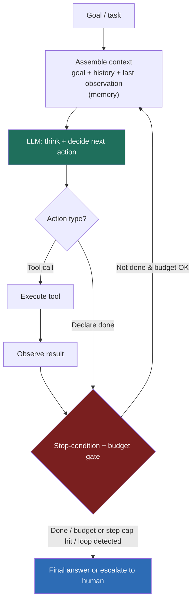

### Learning objectives
- Define an **agent** precisely — an LLM in a loop where **the model, not your code, chooses the control flow** (which tool to call, whether to continue) — and distinguish it from a chain or a pipeline.
- Draw the **observe → think → act → observe** loop and place its named variants on it: **ReAct** (interleaved reason+act), **plan-then-execute**, and **reflection/self-critique**.
- Reason about the **stopping problem** — max steps, a token/time/cost budget, an explicit done-condition, loop detection — and why an agent without one is a runaway.
- Quantify why autonomy is expensive: **errors compound as p(success)^N over steps**, so a long-horizon agent is unreliable by construction, and verification/human-in-the-loop exist to fight that math.
- Make the **agent-vs-workflow** call at Director altitude: prefer the most constrained option that works; a deterministic workflow beats a free agent on reliability, cost, and debuggability, and a true agent earns its place only when the path is genuinely open-ended.

### Intuition first
A prompt **chain** is a recipe card: do step 1, then 2, then 3, every time, in order. It doesn't matter how the dish is going — the card never changes. An **agent** is a cook working without a recipe: they taste, decide the sauce needs acid, reach for the lemon, taste again, and stop when it's right. The cook chooses the *next action* based on what just happened. That single shift — **the LLM deciding the control flow instead of you hard-coding it** — is the entire definition of an agent, and the entire source of both its power and its danger.

The power is obvious: the cook handles a dish the recipe-writer never anticipated. The danger is subtler. A recipe with three fixed steps either works or fails predictably. A cook left alone can taste wrong, "fix" a dish that was fine, chase a flavor for an hour, or — if nobody tells them when to plate — never stop cooking. Every hard problem in agent design is a version of *the cook is improvising, and improvisation compounds*: small misjudgments stack, and the longer the agent runs unsupervised the more certain it is that something drifts. Hold that image — **recipe vs improvising cook** — because it predicts where agents earn their keep (novel, open-ended tasks) and where they quietly destroy reliability (anything you could have written as a recipe).

### Deep explanation

**An agent is an LLM in a loop with tools, memory, and a goal — and the loop is the whole idea.** Strip away the marketing and an agent is four parts: a **goal** (the task), a set of **tools** it can call, some **memory/scratchpad** to carry state across steps, and a **loop** that lets the model act repeatedly. Each turn of the loop is the same shape:

1. **Observe** — the model sees the goal, the history so far, and the result of its last action.
2. **Think / decide** — it reasons about what to do next.
3. **Act** — it emits a structured action: call tool X with these args, *or* declare it's done.
4. **Observe the result** — your runtime executes the tool, feeds the output back into context, and the loop repeats.

The load-bearing word is *decide*. In a chain, your code decides what happens next; in an agent, **the model's output is the control flow**. That is why an agent can solve a task whose steps you couldn't enumerate in advance — and why it can do something you never intended.

**ReAct is the workhorse pattern: interleave reasoning and acting.** The dominant single-agent pattern is **ReAct** (Reason + Act): the model produces a brief *thought* ("I need the customer's recent orders"), then an *action* (`get_orders(customer_id)`), sees the *observation* (the orders), and loops. Interleaving the reasoning with the tool calls — rather than planning everything up front — lets the agent adapt to what each tool actually returns. It's the default because it's simple and it handles surprises: a failed lookup or an empty result just becomes the next observation to reason about.

**Planning and reflection are the two escalations on top of the basic loop.**
- **Plan-then-execute**: for a multi-step goal, have the model first *decompose* it into a plan, then execute the steps, **re-planning** when a step fails or reveals something new. This gives structure and a place to insert checkpoints, at the cost of a rigid plan that can be wrong from the start — so good implementations re-plan rather than march off a cliff.
- **Reflection / self-critique** (Reflexion-style): after producing an output or a step, the agent *critiques its own work* against the goal and retries if it falls short. This measurably lifts quality on hard tasks — and it is **not free**: every reflection pass is more model calls, more tokens, more latency. Reflection is a quality-for-cost trade, not a default.

**The stopping problem is a first-class design concern, not an afterthought.** Because the model controls the loop, *the model also controls when to stop* — and models are bad at it. They declare victory early, or loop forever calling the same failing tool, or wander. A production agent **must** be bounded by external guardrails the model can't override: a **max-step cap**, a **token / time / dollar budget** (the loop aborts when exceeded), an **explicit done-condition** (a verifiable signal the task is complete, not just the model saying "done"), and **loop detection** (abort or escalate when the agent repeats an action with no new information). Without these, "agent" means "unbounded spend with a nonzero chance of never terminating."

**The reliability math is the Director's whole case — internalize it.** This is the number that separates a demo from a system. Suppose each step of an agent succeeds **95%** of the time — generous. The probability a 10-step task completes correctly end-to-end is not 95%; it's `0.95^10 ≈ 60%`. At 20 steps it's `0.95^20 ≈ 36%`. **Errors compound multiplicatively across steps**, so autonomy and reliability trade directly against each other: the more steps you hand the model unsupervised, the more certain failure becomes. This single fact explains nearly every agent design choice in the rest of the module — why we bound autonomy, why we verify intermediate results, why long-horizon agents need durable checkpoints, and why a human gate appears before irreversible actions. It is also why **the most reliable agent is the one with the fewest unconstrained steps.**

**The agentic spectrum, and the decision that actually matters: agent vs workflow.** "Agentic" is not binary; it's a spectrum of how much control you cede to the model:

- **Single LLM call** — one prompt, one answer. Most reliable, cheapest.
- **Prompt chain** — fixed sequence of calls, your code orchestrates. Deterministic.
- **Router** — the model classifies, your code branches to a fixed handler. One decision point.
- **Workflow** — predefined steps with the LLM making bounded decisions at known points; *you* own the control flow.
- **Agent** — the model owns the control flow, looping over tools until done.
- **Multi-agent** — several agents coordinating, the most autonomy and the most failure surface.

The Director-altitude statement: **prefer the most constrained option that solves the problem.** A **workflow** — fixed steps, the LLM invoked only at well-defined decision points — is more reliable (no compounding free-form loop), cheaper (bounded calls), and *debuggable* (you can see exactly where it went wrong) than a free agent. You **reject the full agent** when the task's path is knowable in advance, because then an agent only adds cost and nondeterminism for autonomy you don't need. You **reach for a true agent** only when the path is genuinely **dynamic and open-ended** — the steps depend on what intermediate tools return and can't be pre-scripted (open-ended research, debugging an unknown failure, multi-system investigation). Most things marketed as "agents" should be workflows. Saying that out loud is a strong signal; reflexively reaching for a maximally autonomous agent is a red flag.

Go deeper — frameworks, the ReAct prompt shape, and emerging patterns (IC depth, optional)

- **What the loop looks like in practice:** the model is given tool schemas and emits a structured tool call; your runtime executes it and appends the result to the message list as a "tool result" turn; you re-invoke the model. The "thought" is either explicit text (classic ReAct) or the model's internal reasoning in newer models. The loop ends when the model returns a final answer instead of a tool call, or a guardrail trips.
- **Frameworks (2026):** LangGraph (graph/state-machine framing of agents — arguably workflows-first, which is the point), the OpenAI Agents SDK, CrewAI and AutoGen (multi-agent), and the durable-execution engines. Frameworks mostly differ in how much they push you toward explicit graphs (workflows) vs free loops (agents).
- **Reflection variants:** Reflexion (verbal self-feedback stored in memory across attempts), self-consistency (sample multiple trajectories, vote), and LLM-as-judge used as an inline verifier.
- **Why "thinking/reasoning" models change the calculus:** models with strong built-in reasoning compress some explicit plan/reflect steps into a single call, raising per-step reliability — which, via the p^N math, disproportionately helps long tasks. It does not remove the need for guardrails.

### Diagram: the agent loop

The red gate is the part demos skip and production can't: every loop-back passes through a budget/step/done check the model cannot talk its way past.

### Worked example: triage and resolve a support ticket

Take "when a support ticket arrives, diagnose it and either resolve it or route it." Two designs:

**As a constrained workflow (the right default).** Fixed steps: (1) classify the ticket into a known category (router — one LLM call); (2) for "password reset," run the scripted reset tool; for "billing dispute," fetch the account via a tool and draft a reply from a RAG lookup over policy; (3) a guardrail checks the drafted action; (4) execute or hand to a human. The LLM makes **bounded decisions at known points**; your code owns the flow. Reliability is high because there's no free-form loop to compound errors, cost is bounded (a known small number of calls), and when it misbehaves you can see exactly which step failed. **Rejected the full agent here** because the resolution paths are largely *known* — handing the model an open loop adds nondeterminism and cost for flexibility the task doesn't need.

**Where the agent earns its place.** Now the ticket is "the export feature has been intermittently failing since yesterday for some enterprise customers." There is no script: the resolver must *decide* what to look at — check recent deploys, query error rates, correlate with a specific customer's config, read logs, form and test a hypothesis. The path depends on what each tool returns. **This is a genuine agent**: a ReAct loop over investigation tools (logs, metrics, deploy history, RAG over runbooks), bounded by a step cap and a budget, that **escalates to a human** with its findings rather than taking a remediation action itself (the reliability math says don't trust step 12 of an unsupervised loop to restart prod). The agent does the open-ended *investigation*; a human or a scripted workflow does the *irreversible act*.

The lesson: the same surface ("handle a ticket") splits into a workflow for the known paths and a bounded, escalating agent for the open-ended tail — and you say which is which, and why, out loud.

### Trade-offs table: where on the spectrum to land

| Option | Reliability | Cost | Latency | Flexibility | Debuggability | Use when… |
|---|---|---|---|---|---|---|
| **Single LLM call** | Highest | Lowest | Lowest | None | Trivial | The task is one well-scoped transformation. |
| **Prompt chain** | High | Low | Low | Low | Easy | A *fixed* multi-step recipe you can enumerate. |
| **Router** | High | Low | Low | Low | Easy | One classification then a fixed handler per branch. |
| **Workflow** (LLM at fixed points) | High | Bounded | Medium | Medium | Good (step-level) | The path is mostly known; the LLM decides at a few points. **The default for "agentic" features.** |
| **Agent** (model owns control flow) | Lower (p^N) | High, variable | High | High | Hard (free-form trace) | The path is genuinely dynamic/open-ended and can't be pre-scripted. |
| **Multi-agent** | Lowest | Highest | Highest | Highest | Hardest | Parallelizable, independently verifiable sub-tasks. |

### What interviewers probe here
- **"When would you *not* use an agent?"** — *Strong signal:* whenever the path is knowable — use a workflow (fixed steps, LLM at decision points) for reliability, cost, and debuggability; reserve true agents for open-ended tasks. Names the spectrum and "prefer the most constrained option that works." *Red flag:* treats "agent" as the goal and reaches for maximum autonomy by default.
- **"Your agent demos perfectly but fails ~40% of the time in production. What's going on?"** — *Strong:* compounding error — `0.95^N` collapses over a multi-step loop; reduce step count, verify intermediate results, add reflection on the risky steps, and cap/escalate. *Red flag:* "tune the prompt" with no awareness that the failure is structural in the loop length.
- **"How does the agent know when to stop?"** — *Strong:* external guardrails the model can't override — max steps, token/time/cost budget, an explicit verifiable done-condition, loop detection — not "the model decides it's done." *Red flag:* assumes the model reliably self-terminates.
- **"ReAct vs plan-then-execute vs reflection — when each?"** — *Strong:* ReAct as the adaptive default; plan-then-execute when structure/checkpoints help (with re-planning); reflection to buy quality on hard tasks at a token/latency cost. *Red flag:* names them as interchangeable buzzwords.

The through-line at Director altitude: **autonomy is a cost you pay in reliability and dollars, justified only by tasks you genuinely can't pre-script.** "I'd build the known resolution paths as workflows and reserve a bounded, human-escalating agent for the open-ended investigation tail; my prior is that 80% of this should be a workflow."

### Common mistakes / misconceptions
- **Calling everything an "agent."** A fixed three-step chain is not an agent; an agent is when the *model* chooses the next action. Conflating them leads to over-engineered, less reliable systems.
- **Reaching for maximum autonomy by default.** The reliable, cheap, debuggable answer is usually a workflow. Earn the agent; don't start there.
- **No stopping guardrails.** Trusting the model to self-terminate yields runaway loops and unbounded spend. Bound every agent with steps, budget, a done-condition, and loop detection.
- **Ignoring the p^N math.** A great single-step success rate still collapses over a long loop. Long-horizon reliability comes from *fewer* unconstrained steps and verification, not a better prompt.
- **Letting the agent take irreversible actions unsupervised.** The compounding-error math means late steps are the least trustworthy; gate irreversible actions behind verification or a human.

### Practice questions
**Q1.** Define what makes a system an "agent" versus a workflow, and why it matters for reliability.
> *Model:* An agent lets the **LLM choose the control flow** — which tool to call and whether to continue — looping until done; a workflow has **predefined steps** with the LLM making bounded decisions at fixed points. It matters because the free-form loop is where errors **compound** (`p^N`): a workflow's reliability is roughly its weakest fixed step, while an agent's degrades with every additional autonomous step. So you choose an agent only when the path can't be pre-scripted, and accept that you're trading reliability and cost for that flexibility.

**Q2.** An agent that books travel works in testing but occasionally books the wrong flight in production. How do you think about the fix?
> *Model:* Booking is **irreversible**, so the compounding-error math says never let an unsupervised late step execute it. Restructure: the agent does the open-ended *search/compare* (where flexibility helps), then a **human-in-the-loop confirmation** or a deterministic validation step gates the actual booking. Separately, reduce step count, verify the selected itinerary against the constraints before presenting it, and add a budget/step cap. The point: don't try to make a 12-step loop 99.99% reliable — remove the irreversible action from the autonomous part.

**Q3.** How do you stop an agent from looping forever or burning your budget?
> *Model:* External guardrails the model can't override: a **max-step cap**, a **token/time/dollar budget** that aborts the loop, an **explicit done-condition** (a verifiable signal, e.g., tests pass / the field is populated, not just the model claiming completion), and **loop detection** (abort/escalate if it repeats an action with no new observation). On any trip, escalate to a human or return partial results rather than spinning.

**Q4.** When is reflection/self-critique worth adding?
> *Model:* When the task is hard enough that first-pass quality is poor and you can afford the cost. Reflection adds model calls (more tokens, more latency), so it's a **quality-for-cost trade**: justify it with eval showing the lift, apply it to the risky steps rather than every step, and skip it where a single pass already clears the bar.

### Key takeaways
- **An agent is an LLM in a loop where the model — not your code — chooses the next action.** That one property is the source of both its flexibility and every reliability problem that follows.
- **The loop is observe → think → act → observe**, with **ReAct** as the adaptive default, **plan-then-execute** for structure, and **reflection** to buy quality at a token/latency cost.
- **Bound every agent.** Max steps, a token/time/cost budget, an explicit verifiable done-condition, and loop detection are mandatory — the model cannot be trusted to stop itself.
- **Reliability compounds against you: `p(success)^N`.** 95% per step is ~60% at 10 steps. Long-horizon autonomy is unreliable by construction; fight it with fewer unconstrained steps, verification, and human gates on irreversible actions.
- **Prefer the most constrained option that works.** A workflow beats a free agent on reliability, cost, and debuggability; reserve true agents for genuinely open-ended paths. Most "agents" should be workflows.

> **Spaced-repetition recap:** Agent = LLM in a loop that **chooses its own control flow** (recipe vs improvising cook). Loop: observe → think → act → observe; ReAct (default), plan-then-execute (structure), reflection (quality for cost). **Always bound it** — max steps, budget, verifiable done-condition, loop detection — because the model won't stop itself. The Director number: errors compound as **p^N** (95% × 10 steps ≈ 60%), so autonomy trades against reliability; keep unconstrained steps few, verify intermediates, gate irreversible actions behind a human. **Prefer the most constrained option that works** — workflow over agent unless the path is genuinely open-ended; most "agents" should be workflows.
