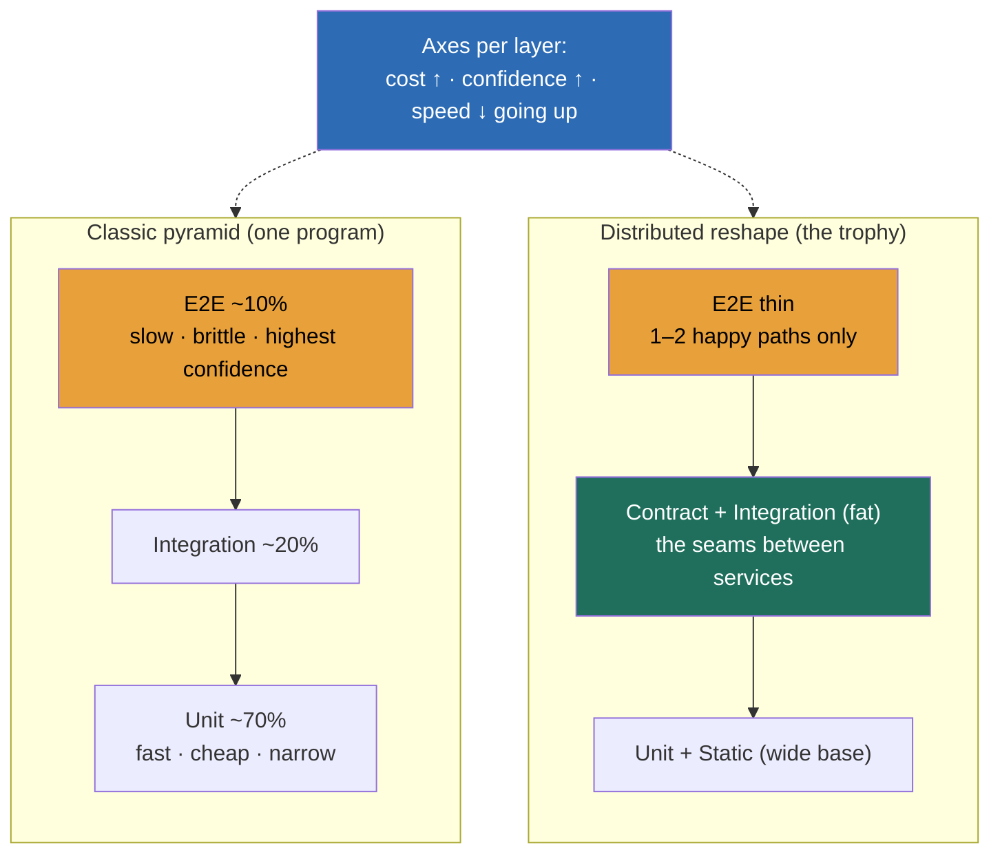

### Learning objectives
- State the **operating-system framing** of quality: it is **platform + process + incentives**, the machinery that makes safe shipping the *default* across many teams, not a phase a QA group runs at the end, and the Director owns that machinery, not the individual tests.
- Read the **test pyramid as a capital-allocation map**: unit, integration, end-to-end trade **cost against confidence against speed**, and the design question is *where the next test dollar buys the most caught-bug-per-dollar*, not "more coverage."
- Explain **why the pyramid reshapes for distributed systems** into a trophy or honeycomb: the units all pass while the system breaks at the **seams between services**, so the ROI moves from unit tests to **contract and integration** tests, and end-to-end stays thin and brittle by design.
- Reason in the **total cost of a test**, write + run + maintain + flake, not the one-time cost of writing it, and know that a slow flaky end-to-end suite is a *liability* that destroys signal even when every test is green.
- Name the **paved-road model**, CI gates + feature flags + fast rollback + test-in-prod, that makes the safe path the easy path, and price the **velocity cost of every gate** so you can defend where the line sits for *this* org's risk tolerance.

### Intuition first
Quality is not the final inspector at the end of the assembly line. It is the **whole factory's machinery**: the jigs that make a part only fit one way, the conveyor that stops itself when something jams, the line that can be reversed in seconds when a bad batch is spotted. A single inspector at the end is the slowest, most expensive, lowest-confidence place to catch a defect, because by then the bad part is buried inside a finished car and the line behind it has built fifty more. The factories that ship safely at volume don't hire more inspectors. They build the machinery so the **default path produces good parts**, and the inspector at the end is checking a process that almost never fails.

That image carries the design consequences. **You invest where defects are cheapest to catch**, which is upstream, close to the worker who made the part, not downstream in a finished assembly. **The machinery is the product**, the Director builds the jigs and the stop-the-line cord (the platform), not the individual welds (the tests). **A test that cries wolf is worse than no test**, a jam-detector that trips on nothing real gets taped down, and then it misses the real jam. And **for a system assembled from parts built by different teams, the parts can each be perfect while the assembly fails**, the bolt fits, the bracket fits, but the bracket was built to last month's bolt spec, so the joint shears. That last failure is the entire story of quality in distributed systems, and it is why the test strategy that works for one program reshapes when you have fifty services and fifty teams.

### Deep explanation

**Quality is an operating system, and the Director owns the operating system, not the tests.** The interview probe is almost never "write a unit test." It is *"how do you run quality across forty teams shipping to production a thousand times a week?"* The answer has three parts that reinforce each other. **Platform** is the paved road: CI that runs the suite on every change, gates that block a merge on red, feature flags that decouple deploy from release, and a rollback that completes in under a minute. **Process** sets the bar: what must be green to merge, what gets a canary, what requires a second reviewer, how an incident feeds back into a test. **Incentives** keep it from rotting: teams own the quality of what they ship, the platform team owns the road, and nobody is rewarded for a green dashboard that hides a 5% flake rate. The IC-altitude answer, *"we'd add more tests"* or *"the QA team tests it,"* fails on two counts at once: it scales linearly with headcount (more tests need more hands, a QA gate becomes a bottleneck every team queues behind), and it puts quality *after* the work instead of *inside* it. The Director-altitude statement: *quality is the system that makes the safe path the easy path, so the default behavior of a team that does nothing special is still to ship safely.*

**The test pyramid is a capital-allocation map, and the three axes are cost, confidence, and speed.** Read bottom to top. **Unit tests** check one function or class in isolation: they run in **milliseconds**, cost almost nothing to run, and you have thousands of them, but each one's confidence is narrow (the unit works, says nothing about the system). **Integration tests** check a few components together, a service against its real database, a handler against its real queue: **hundreds of milliseconds to seconds** each, more setup, higher confidence that the wiring holds. **End-to-end tests** drive the whole system through its real interface, a browser through checkout: **seconds to minutes** each, expensive to run and maintain, highest confidence per test that the user's path works, but slow and brittle. The classic ratio is roughly **70 / 20 / 10** unit / integration / e2e, and the reason it's a pyramid is pure economics: push your volume to the layer where each test is **cheap, fast, and stable**, and buy only as much of the expensive top as you need for confidence the cheap bottom can't give you. "Add more coverage" is banned the same way "it scales" is banned, the question is always *which layer, and what does that test cost over its life*.

**The total cost of a test is write + run + maintain + flake, and only the first is one-time.** A team that counts only the cost of *writing* a test systematically over-buys end-to-end tests, because the write cost looks comparable to a unit test on day one. The lifetime cost is not. A unit test runs in 2ms, never touches the network, and breaks only when its unit's contract genuinely changes. An end-to-end test runs in 30s, holds a browser and a full environment, and breaks on a CSS rename, a slow dependency, a timezone, a race, none of which is the bug it exists to catch. **Run cost** compounds across every CI run, a 40-minute e2e suite run on every PR across 40 teams is hundreds of engineer-hours a week of waiting. **Maintenance cost** is the silent killer: e2e tests couple to the UI and the data, so every product change ripples into test churn. **Flake cost** is the worst of all, because a **1% flake rate** on a 500-test suite means a *full green run is the exception*, every red is presumed false, and the team learns to re-run until green, at which point the suite has **negative value**, it costs run-time and trains people to ignore failures. The Director who says "we'd add more e2e tests" without pricing this is proposing to slow forty teams down and erode their trust in the signal.

**For distributed systems the pyramid reshapes, because the bugs live between the services, not inside them.** When you have one program, the units compose into a system you can mostly reason about, and the pyramid holds. When you have fifty services owned by fifty teams, every service's unit tests can be green while the *system* is broken, because the failure is at the **seam**: service A sends a field service B renamed, A's retry storms B under load, A assumes B returns sorted and B stopped, A's timeout is shorter than B's p99. None of those is catchable by a unit test, by construction, the unit doesn't know about the seam. So the investment moves. The shape people draw is the **testing trophy** (a fat integration band, a wide base of static checks and unit tests, a thin e2e cap) or the **honeycomb** (heavy integration, thin unit, thinnest e2e). The single highest-ROI move is the **consumer-driven contract test**: the consumer (A) declares the shape of the response it depends on, that contract runs against the provider (B) in *B's* pipeline, and B can't merge a change that breaks A without seeing it, **without standing up both services together**. A contract test runs in milliseconds like a unit test but catches a seam bug like an integration test, which is exactly the ROI sweet spot the reshaped pyramid is pointing at. You **reject** "just add more end-to-end tests to catch integration bugs" because e2e catches the seam bug *slowly, flakily, and after the fact*, in a full environment, one path at a time, when a contract test catches the same class of bug *fast, deterministically, and in the provider's own CI before merge*.

**Shift-left and test-in-production are complements, not rivals, and the paved road uses both.** Shift-left means catching defects as early and as cheaply as possible: static analysis and types at author time, unit and contract tests in CI, integration tests before merge, each rung catching what the cheaper rung below can't. The well-known rule of thumb is the **escaped-defect cost ladder**: a bug caught at the desk costs ~1×, in CI ~10×, in QA ~100×, in production ~1000× (and that's before reputational and incident cost). That's the whole economic argument for shift-left, push detection down the ladder. But shift-left has a ceiling: some failures only exist with real traffic, real data scale, real dependency latency, and real concurrency, and no pre-prod environment reproduces production faithfully without costing as much as production. That's where **test-in-prod** earns its place: **canary** a change to 1% of traffic and watch error and latency, gate the rollout on those signals, hide the change behind a **feature flag** so deploy and release are separate events, run **synthetic** transactions continuously against prod, and keep a **rollback under 60 seconds** so a bad release is a non-event. The trade is explicit: a heavier pre-prod suite buys confidence *before* users are exposed but never reaches full fidelity and slows everyone down, progressive delivery reaches full fidelity but exposes a sliver of real users to risk you must be able to detect and undo fast. The paved road runs both, cheap detection early, real-world detection late, with a fast undo.

**The paved road is where platform, process, and incentives become concrete, and every gate has a velocity price.** The platform makes the safe path the easy path: a new service gets CI, the standard gates, flagging, and one-button rollback *for free* from a template, so the engineer who does nothing special still ships safely. Each gate buys safety at a cost you must name. A **required green CI gate** buys "no known-broken merge" at the cost of the suite's run time on the critical path, so the suite must stay fast (parallelize, shard, keep e2e thin) or the gate becomes the bottleneck. A **mandatory canary** buys "blast radius capped at 1%" at the cost of a slower full rollout (minutes to hours). A **manual approval gate** buys a human check at the cost of a queue and a person, the most expensive gate, reserve it for genuinely irreversible changes. The Director's job is to place each gate where its safety is worth its velocity tax *for this org's risk tolerance*, a payments path and a marketing-banner path do not get the same gates. Measure the operating model with the **DORA four** (deploy frequency, lead time for change, change-failure rate, time-to-restore) plus **escaped-defect rate** and **flake rate**, because a quality system with no metrics is a faith-based system, and the failure mode nobody sees is the suite quietly going to 5% flake while the dashboard stays green.

Go deeper — consumer-driven contracts, flake math, and the gate-cost arithmetic (IC depth, optional)

- **How a consumer-driven contract actually works (Pact-style).** The consumer's test runs against a *mock* provider and, as a side effect, emits a **pact file**: a JSON record of every request it made and the response shape it asserted on. That pact is published to a broker. The provider's pipeline pulls every consumer's pact and **replays** those exact requests against the real provider, asserting the responses still satisfy what each consumer depends on. The key property: the provider verifies against the *union of what consumers actually use*, not against a hand-written schema, so a field no consumer reads can change freely, and a field someone depends on cannot break silently. **Versioning** via the broker (tags per environment) is what lets the provider answer "can I deploy this to prod given who's live in prod right now?" — that's `can-i-deploy`.
- **The flake-rate arithmetic, why 1% is catastrophic at scale.** If a single test flakes independently with probability *p*, a suite of *N* tests has a full-green probability of (1−p)^N. At p = 0.001 (one in a thousand) and N = 2000 tests, that's 0.999^2000 ≈ **0.135**, so a clean run succeeds only ~13% of the time and ~87% of runs show a *false* red. Engineers respond rationally by re-running and ignoring reds, which means the suite no longer gates anything. The fix is not "fix the flaky tests later"; it's **quarantine on detection** (auto-move a test that flakes to a non-blocking lane), a **retry budget** (one retry, tracked, never silent), and a **flake-rate SLO** treated like an availability SLO with an owner.
- **Escaped-defect cost ladder, where the 10× comes from.** The multiplier is rework scope: a bug caught at author time is a one-line fix in the author's head-context; in CI it's a fix plus a re-run; in QA it's a triage, a ticket, a context-switch back, a fix, a re-test; in prod it's an incident, a rollback, a customer-impact assessment, a postmortem, and the fix. Each stage adds people, coordination, and lost context, which is where the order-of-magnitude per stage comes from. The number is a heuristic, not a law, but the *shape* (monotonic, roughly geometric) is robust and is the entire justification for shift-left.
- **Gate-cost arithmetic for a required suite.** If your required CI suite takes *T* minutes and a team merges *M* times a day, the gate imposes *T × M* minutes of critical-path wait per team per day before any human cost. At T = 20 and M = 30, that's 600 minutes (10 hours) of merge-blocking wait per team per day, which is why suite time is a first-class SLO (often "< 10 min p95 on the required path") and why e2e gets pushed off the required path into a post-merge or scheduled lane.

### Diagram: the pyramid, reshaped for distributed systems

### Worked example: the test strategy for a microservices checkout
The interview prompt is *"design the test strategy for checkout."* Checkout spans a **cart** service, a **pricing/promotions** service, an **inventory** service, a **payment** service (fronting Stripe), an **order** service, and a web UI. The IC instinct is "high coverage everywhere, lots of UI tests." The Director allocates by ROI, and the ROI is concentrated at one boundary.

- **Where the money goes: the payment-service seam.** The single most expensive failure is taking money and not creating an order, or the reverse. That logic lives at the **payment ↔ order** boundary, so that's where the investment goes: a **consumer-driven contract** between order (consumer) and payment (provider) so payment can't change its response shape without seeing who breaks, **integration tests** of payment against a Stripe sandbox covering the ugly paths (declines, timeouts, duplicate-charge idempotency, partial captures, webhooks arriving late or twice), and **property-based** tests asserting the invariant *money-captured implies order-created, exactly once*. This is where one bug is a finance incident, so this is where confidence is bought.
- **Unit tests where the logic is gnarly, not everywhere.** Promotions/pricing has real branching (stacking rules, currency, rounding, edge-case discounts), so it gets a dense bank of fast unit tests. The cart's CRUD does not get a thousand UI unit tests, *rejected: blanket UI coverage*, because those tests are slow to write, brittle to maintain, and catch bugs that a type checker and a handful of component tests already catch for a tenth the lifetime cost.
- **Contract tests at every inter-service seam.** Cart→pricing, pricing→inventory, order→payment, order→inventory each get a contract so a provider change that breaks a consumer fails in the *provider's* CI before merge, in milliseconds, with no shared environment. This is the reshaped-pyramid move: the bugs live at these seams, so the tests live there too.
- **A thin, ruthless end-to-end layer.** Exactly **one or two** e2e paths: *add-to-cart → pay → order confirmed* as a happy path, and one declined-card path, run on a schedule and pre-release, **not** on every PR. *Rejected: a broad e2e regression suite*, because at 30s–2min per test and UI-coupled maintenance, a fat e2e suite is the flaky, slow liability that trains the team to ignore red; we cap it at the few paths whose end-to-end behavior nothing cheaper can verify.
- **Test-in-prod for what pre-prod can't reach.** Real Stripe behavior, real concurrency on inventory decrement, real latency: **canary** new checkout code to 1% of traffic gated on payment-success-rate and p99, behind a **feature flag**, with a **synthetic** "test card" transaction running against prod every minute and a **sub-60s rollback**. The fidelity pre-prod can't buy, prod buys at 1% blast radius.

The number a Director brings out of this isn't "we'll have 90% coverage." It's *"the spend is at the payment seam where one bug is a finance incident, the inter-service contracts catch the cross-team breaks before merge, e2e is two paths not two hundred, and prod risk is capped at 1% with a 60-second undo."*

### Trade-offs table: where the next test dollar goes
| Layer | Speed (per test) | Run + maintain cost | Confidence it buys | Use when… |
|---|---|---|---|---|
| **Unit** | ~1–10 ms | very low; breaks only on real contract change | this *unit's* logic is correct (narrow) | logic is branchy/algorithmic and isolated (pricing, parsing) |
| **Contract** | ~10–50 ms | low; lives in provider CI, no shared env | the **seam** between two services holds | any inter-service boundary owned by different teams |
| **Integration** | ~0.1–2 s | medium; needs real deps (DB, queue, sandbox) | the wiring + real-dependency behavior holds | the risk is in I/O, transactions, idempotency, real-dep quirks |
| **End-to-end** | ~5 s–2 min | high; UI-coupled, flaky, full env | a real user path works end to end | a *few* critical paths nothing cheaper can verify |
| **Classic pyramid (70/20/10)** | — | — | composes well for a single program | one codebase, one team, units reason about the whole |
| **Trophy / honeycomb (fat contract+integration)** | — | — | catches the seam bugs units miss | many services, many teams, bugs live between services |

The Director move is allocating by **ROI per layer** for *this* topology (one program → pyramid; many services → trophy), and never answering "raise coverage" without naming which layer and its lifetime cost.

### What interviewers probe here
- **"How do you run quality at scale across forty teams?"** *Strong signal:* frames quality as an **operating system, platform + process + incentives**, describes the paved road (CI gates, flags, fast rollback) that makes safe shipping the default, invests by **ROI per layer**, and names the **velocity cost of each gate** so the line sits where the org's risk tolerance puts it. *Red flag:* "we'd add more tests" or "the QA team tests everything before release", IC altitude, scales with headcount, and turns QA into the bottleneck every team queues behind.
- **"Your services all have green unit tests but production keeps breaking, what's going on?"** *Strong:* the bugs are at the **seams** between services, units can't see them by construction; the fix is **consumer-driven contract tests** in each provider's CI plus targeted integration tests, the reshaped pyramid, not more units. *Red flag:* "increase unit coverage", which cannot catch a cross-service contract break no matter how high it goes.
- **"Your e2e suite is 90 minutes and half-red, what do you do?"** *Strong:* prices the **total cost of the test** (the flake rate has made the suite negative-value), **quarantines** flakes off the blocking path, pushes most e2e to **post-merge/scheduled**, keeps a thin happy-path gate, and shifts the coverage down to **contract/integration** where it's fast and deterministic. *Red flag:* "add retries until it's green", which institutionalizes ignoring failures and keeps the slow gate on the critical path.
- **"When is testing in production the right call?"** *Strong:* treats shift-left and test-in-prod as **complements**, pre-prod for cheap early detection (the 1×→1000× ladder), prod for the fidelity pre-prod can't reach (real traffic/data/latency), gated by **canary + flags + synthetic + sub-60s rollback** so blast radius and undo are bounded. *Red flag:* "never test in prod" (ignores that some failures only exist at real scale) or "just ship and watch" (no blast-radius or rollback story).

The through-line at Director altitude: quality is a **platform + process + incentives** system you invest in by **ROI per layer**, and you make the safe path the easy path with gates, flags, and fast rollback, each priced in velocity. You delegate the build with a stated prior: *"I'd have the platform team bake off a managed contract-testing broker against self-hosting our own; my prior is the managed broker, because the value is in adoption across forty teams and a paved-road default, not in owning the broker, and the run cost is rounding error next to the engineer-hours a broken seam costs us in incidents."*

### Common mistakes / misconceptions
- **Over-investing in slow, flaky end-to-end tests.** Counting only the write cost, teams build fat e2e suites whose lifetime cost (run + maintain + flake) makes them a liability that trains the team to ignore red; cap e2e at a few critical paths nothing cheaper can verify.
- **Believing green units mean a healthy system.** In distributed systems the bugs live at the **seams**; units pass while the assembly fails. The catch is contract/integration, not higher unit coverage.
- **Running QA as a gate instead of a platform.** A QA team that tests everything before release becomes a bottleneck every team queues behind and puts quality *after* the work; the model is a paved road that makes safe shipping each team's own default.
- **Ignoring test maintenance and flake cost.** A 1% flake rate at scale means a clean run is the exception and the suite gates nothing; flake is an SLO with an owner, not a "fix it later."
- **Running quality with no metrics.** Without DORA, escaped-defect rate, and flake rate, the system rots invisibly (the suite drifts to 5% flake while the dashboard stays green); you can't manage what you don't measure.

### Practice questions

**Q1.** A team proposes hitting 90% line coverage across all services as the quality goal for the year. React as the Director.
> *Model:* I'd reject coverage-as-the-goal, because line coverage measures *what code ran during tests*, not *what failures we'd catch*, and it pushes teams to write cheap unit tests that exercise lines while the real risk, the cross-service seams, stays untested. A service can hit 95% unit coverage and still take money without creating an order, because that bug is a contract break the units can't see. I'd retarget the goal at **ROI per layer**: contract tests at every inter-service boundary (catch the seam bugs in provider CI before merge), integration tests where the risk is real-dependency behavior (payments, idempotency), dense units only where logic is branchy, and a thin e2e cap. And I'd measure outcomes, **escaped-defect rate and change-failure rate**, not coverage, because those tell me whether quality is actually improving while coverage just tells me tests touched lines.

**Q2.** Estimate the lifetime cost of a 500-test end-to-end suite at a 1% per-test flake rate, run on every PR, and name the fix.
> *Model:* Flake first: a full-green run has probability 0.99^500 ≈ **0.6%**, so a clean run essentially never happens, every red is presumed false, and the suite **gates nothing**, it has negative value (it costs run-time and trains people to ignore failures). Run cost: at ~30s/test the suite is ~4+ hours serial, call it ~15 min parallelized, on every PR across many teams, that's hundreds of engineer-hours a week of merge-blocking wait. The fix is not "add retries". It's **quarantine on detection** (flaky tests auto-move off the blocking lane), pull most e2e off the per-PR critical path into **post-merge/scheduled**, keep a **thin happy-path gate**, and shift the lost coverage **down** to contract and integration tests that run in milliseconds, deterministically. Flake rate becomes an SLO with an owner. Net: the gate is fast and trustworthy again, and the seam bugs are caught lower and cheaper.

**Q3.** Your microservices keep breaking in production from changes that passed every team's CI. Diagnose and fix at Director altitude.
> *Model:* The diagnosis is structural, not a coverage gap: every team's units and even integration tests are green because they test each service *in isolation*, but the failures are at the **seams**, a provider renames a field, tightens a timeout, stops sorting, and the consumer breaks, and nothing in either pipeline tests the *contract between them*. The fix is **consumer-driven contracts**: consumers declare the response shape they depend on, those contracts run against the provider in the **provider's** CI, and the provider can't merge a breaking change without seeing exactly who breaks, with no shared environment needed. I'd make the contract broker part of the **paved road** so a new service gets it by default, add a `can-i-deploy` check so a provider can't promote to prod against live consumers it would break, and keep e2e thin for the few whole-path checks contracts can't cover. This reshapes our pyramid into a trophy, fat at the contract/integration band where our bugs actually live, and I'd delegate the broker build-vs-buy to the platform team with a prior toward a managed broker for adoption.

**Q4.** Finance wants zero defects to ever reach production. Engineering wants to keep shipping a thousand times a week. Where do you set the line?
> *Model:* "Zero defects in prod" is not achievable at a thousand deploys a week, and chasing it (an exhaustive pre-prod gate) would crush velocity to near zero while still missing the failures that only exist at real scale, so I'd reframe from "zero defects" to **bounded blast radius and fast recovery**, which is what finance actually needs. The model: shift-left for cheap early detection (types, units, contracts, integration, the 1×→1000× cost ladder justifies pushing detection down), then for what pre-prod can't reach, **progressive delivery**, canary to 1% gated on error/latency, feature flags so deploy ≠ release, synthetic prod transactions, and a **sub-60-second rollback**. I'd set **risk-tiered gates**: the payments path gets the heavy gates (mandatory canary, second approver, tight rollback SLO), the marketing-banner path gets the light ones, because applying payment-grade gates everywhere taxes velocity for no safety gain. Then I'd commit to measurable targets, change-failure rate and time-to-restore (the DORA pair finance can hold me to), instead of an impossible absolute. That gives finance the risk control they want and engineering the velocity, with the trade-off named.

### Key takeaways
- **Quality is an operating system, platform + process + incentives**, that makes safe shipping the *default* across many teams; the Director owns that system, and the IC-altitude answer ("more tests" / "QA tests it") fails because it scales with headcount and puts quality after the work.
- **The test pyramid is a capital-allocation map** across cost, confidence, and speed (~70/20/10); invest where the next test dollar catches the most bugs per dollar, never "raise coverage" without naming the layer and its lifetime cost.
- **Price the total cost of a test, write + run + maintain + flake**, not the one-time write; a slow flaky e2e suite is a liability (a 1% flake rate makes a clean run the exception and the suite gates nothing).
- **For distributed systems the pyramid reshapes into a trophy**, because the bugs live at the **seams** between services; the highest-ROI move is the **consumer-driven contract test**, seam-bug confidence at unit-test speed, in the provider's CI before merge.
- **The paved road makes the safe path the easy path**, CI gates + flags + fast rollback + canary, with shift-left and test-in-prod as complements; price each gate's velocity cost, tier gates by risk, and measure the system with DORA + escaped-defect + flake rate.

> **Spaced-repetition recap:** Quality is the **factory machinery**, not the final inspector: an **operating system** of platform + process + incentives that makes safe shipping the default across many teams, and the Director owns the machinery, not the welds. The **pyramid** is a capital-allocation map across cost/confidence/speed (~70/20/10), invest by **ROI per layer** and price the **total cost** (write + run + maintain + flake; 1% flake makes a clean run rare and the suite worthless). For **distributed systems** it reshapes into a **trophy/honeycomb**, the bugs live at the **seams**, so the highest-ROI move is the **consumer-driven contract test** (seam confidence at unit speed, in the provider's CI). The **paved road** (CI gates + flags + sub-60s rollback + canary) makes the safe path easy, **shift-left** (the 1×→1000× ladder) and **test-in-prod** are complements, every gate has a velocity price, tier gates by risk, and measure with **DORA + escaped-defect + flake rate**.

---

*End of Lesson 12.1. Quality is an operating system that makes safe shipping the default: invest by ROI per layer, expect the units to pass while the seams break, and make the paved road the easy road.*
