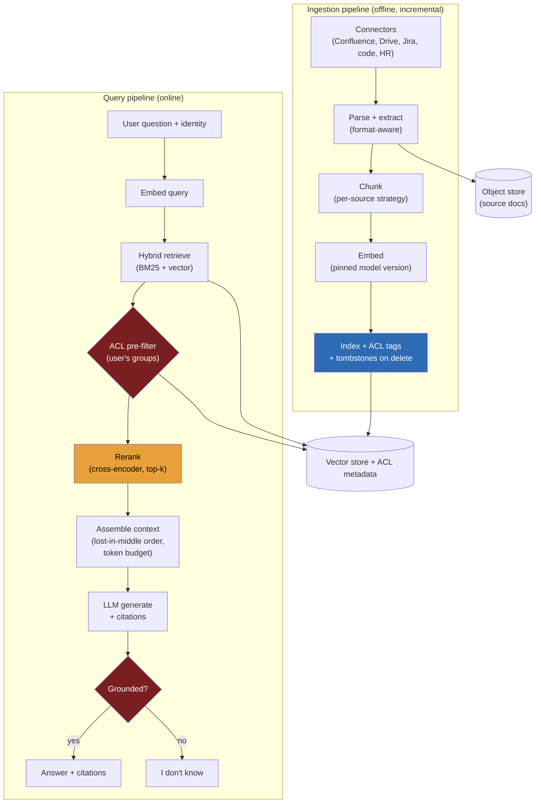

> **Why this problem separates Directors from ICs:** the throughput is a rounding error — tens of queries per second across a 50,000-person company is nothing for any serving stack — so a candidate who spends the round sharding the query path has misread the problem. The system lives or dies on four things the model cannot fix: **retrieval quality**, **grounding and citations**, **freshness**, and the one that ends the interview if you miss it — **per-user access control**. A frontier model sitting on bad retrieval produces a fluent, well-cited, *wrong* answer. The same model with no permission filter produces a fluent, well-cited answer built on a salary spreadsheet the asker was never allowed to open. Both failures look identical to the user: confident and authoritative. A Director must own the truth that **the model is the cheap, swappable part; the retrieval pipeline and its guardrails are the asset.** This is the applied walkthrough of the RAG building block — read that first; here we run it end-to-end through RESHADED.

---

### Learning objectives

1. Argue why enterprise RAG is a **retrieval-and-permissions problem, not a model or QPS problem**, and quantify both.
2. Design the **two pipelines** — ingestion (connectors → parse → chunk → embed → index) and query (embed → hybrid retrieve → ACL pre-filter → rerank → assemble → generate with citations → "I don't know" guard) — and name what each stage prevents.
3. Make **per-chunk access control load-bearing**: enforce it at retrieval as a *pre-filter*, and defend why post-filtering is a breach waiting to happen.
4. Treat **evaluation as the gate**: separate retrieval metrics (recall/precision@k) from generation metrics (faithfulness, answer relevance), and refuse to ship without it.
5. Run a **RESHADED spine with inverted NFR priority** — faithfulness and access correctness dominate; latency and cost are constraints, not the point — and design-evolve toward query rewriting, multi-hop, and GraphRAG.

---

### Intuition first

Imagine a brand-new research librarian on their first day at a giant law firm. Ask them "What's our parental-leave policy for contractors in the UAE office?" The model — the librarian's fluent command of English and ability to summarize — is not the hard part. The hard part is: do they walk to the *right shelf* (retrieval), do they hand you the *actual policy* rather than a confident paraphrase from memory (grounding and citation), is the binder they grab *this year's* version and not the one from 2019 (freshness), and — the firing offense — do they hand a junior associate a folder marked "Partners only" because it happened to match the query (access control). A librarian with a Nobel-laureate vocabulary who pulls the wrong, stale, or forbidden binder is worse than useless; they are a liability who *sounds* authoritative. Enterprise RAG is exactly this: **the LLM is the librarian's eloquence; the entire interesting system is how they find, verify, time-stamp, and permission-check what they hand you.** Swap GPT for Claude for Llama and the eloquence changes; the librarian still has to find the right, current, allowed shelf.

---

## R — Requirements

> Scope before build. The NFR priority here is **inverted** from the read-heavy, cache-everything problems in this course — say that out loud, or the interviewer thinks you missed it.

**Clarifying questions I'd ask (with assumed answers):**

- *What corpus and connectors?* → **Confluence/wiki, Google Drive/SharePoint docs, Jira/ServiceNow tickets, a code repo, and an HR/policy store.** Heterogeneous formats, multiple permission models.
- *Who asks and how?* → **~50,000 employees, a chat box in Slack and a web app.** Natural-language questions, conversational follow-ups in scope for evolution.
- *Permissions?* → **Yes, strictly. A user must never see content from a document they cannot open in the source system.** This is the dominant NFR.
- *Citations required?* → **Yes. Every claim links to the source chunk; ungrounded answers are unacceptable.**
- *Freshness target?* → **Minutes-to-low-hours after a source edit, not days.** A policy that changed at 10:00 should be reflected by mid-morning.
- *Model ownership?* → **Delegated.** I treat the LLM as a swappable dependency behind an interface (the LLM-serving lesson owns serving); I own retrieval and guardrails.

**Functional requirements:**

1. **Ingest** from many sources via connectors, incrementally, capturing per-chunk **ACL metadata** and handling deletes (tombstones).
2. **Ask** a natural-language question and get an answer.
3. **Cite** every answer with links to the exact source chunks used.
4. **Respect per-user permissions** on every retrieval — no leak, ever.
5. **Say "I don't know"** (abstain) when retrieval returns nothing relevant, rather than hallucinate.
6. Capture **feedback** (thumbs up/down, "this is wrong/forbidden") to drive the eval set.

**Explicitly cut:** training/fine-tuning the base model, the chat UI itself, document authoring, full DLP/redaction tooling, cross-language translation. I name these and say "delegated" or "separate service."

**Non-functional requirements, priority order:**

| Priority | NFR | Target |
|---|---|---|
| 1 | **Faithfulness / groundedness** | Every claim traceable to a retrieved chunk; abstain when unsupported |
| 2 | **Access-control correctness** | Zero permission leaks — a leak is a **breach**, not a bug |
| 3 | **Freshness** | Source edit reflected in answers within minutes-to-low-hours |
| 4 | **Latency** | p95 ~2–5 s end-to-end (LLM generation dominates) |
| 5 | **Cost** | Embedding + retrieval + generation token spend within budget |
| 6 | **Throughput** | 50–500 q/s peak — **trivially served**; not the design driver |

**The inversion, stated explicitly:** in the URL-shortener walkthrough we scaled read QPS; here, 50–500 q/s is a single small service. The two NFRs that can end a career are **faithfulness** (a confidently-wrong, well-cited answer erodes all trust in the system) and **access correctness** (one leaked chunk is a reportable security incident). Every architectural decision flows from NFRs 1–3.

---

## E — Estimation

> Enough math to confirm the crux is retrieval and permissions, not throughput.

**Assumptions:** 5–10M documents; average ~10 chunks/doc → **~50M chunks**; embedding dimension 1024; 50–500 queries/second peak; daily document churn ~1–2%.

**Embedding storage (the number that drives the store choice):**
`50M chunks × 1024 dims × 4 bytes (float32) ≈ 200 GB` of raw vectors. An HNSW index adds graph-link overhead (~1.5–2×) → **~300–400 GB of RAM** to serve in-memory. That is real money and a genuine fork in the road. Two outs: **product quantization (PQ)** compresses vectors ~8–16× → ~15–25 GB at a small recall cost, or **disk-backed ANN (DiskANN-style)** trades a little latency for far less RAM. Plus the chunk *text* and metadata: `50M × ~1 KB ≈ 50 GB`, kept in a row store / object store, not in the vector index.

**Query-time cost (per question):**
1 query embedding (~$0.00002), one ANN lookup (single-digit ms), a reranker pass over ~50–100 candidates (~tens of ms on a cross-encoder), then the LLM call. Generation dominates both latency and dollars: ~3–6K context tokens in + ~300–500 out. At, say, $3/$15 per 1M tokens → **~$0.02–0.03 per answer**. At 100M queries/year that is **~$2–3M/year in generation alone** — the line item a Director defends, and the reason context size and caching matter.

**Ingestion / re-embed cost:**
Initial embed of 50M chunks at ~$0.02 per 1M tokens, ~200 tokens/chunk → `50M × 200 = 10B tokens × $0.02/1M ≈ $200` one-time (plus compute time). **Cheap to embed, but re-embedding the whole corpus on every model swap is the trap** — make the embedding model a versioned, pinned dependency. Incremental daily churn (~1–2% → ~0.5–1M chunks/day) is a few dollars/day.

**What estimation decided:** throughput is trivial; the consequential numbers are the **200–400 GB vector index** (drives build-vs-buy and PQ-vs-RAM) and the **$2–3M/year generation bill** (drives context-budget discipline). Neither is a QPS problem.

---

## S — Storage

> Three data classes, each chosen by its access pattern. The per-chunk ACL is the load-bearing field across all three.

**1. Vector store (ANN over 50M embeddings).** Access pattern: top-k nearest-neighbor lookup with a **metadata pre-filter** (the ACL filter) on every query.

- **Choice — and the build-vs-buy fork:**
  - **pgvector (Postgres)** if the corpus and team are modest and operational simplicity wins: one database for vectors, chunk text, and ACL metadata, with real `WHERE` clauses for pre-filtering. Ceiling: HNSW in Postgres strains past tens of millions of vectors and the filtered-ANN path is less mature.
  - **OpenSearch / Elasticsearch kNN** if you also want first-class **hybrid (BM25 + vector)** search and you already run it — one engine for lexical + semantic + filters.
  - **Dedicated vector DB (e.g., a managed Pinecone/Weaviate-class service)** at 50M+ chunks with strict latency SLAs and filtered ANN — purpose-built, but a new vendor, new failure mode, and per-vector cost.
- **Rejected — a raw FAISS/HNSW library you operate yourself:** great recall, but you inherit sharding, replication, filtered search, and incremental updates as homework. For an enterprise platform I delegate that to a managed kNN engine unless scale or cost forces the build (prior: buy first, build only if the bill or SLA proves it). See the embeddings & vector-search lesson for the internals behind this choice.

**2. Source-document object store.** Original PDFs/docs/HTML for re-parsing, re-chunking on model upgrades, and citation deep-links. **Choice — S3/object storage.** Cheap, durable, append-with-versioning; never the live query path.

**3. Metadata / ACL store.** Per-chunk and per-document attributes: source, section, `updated_at`, version, and **`acl_tags[]`** (the groups/roles allowed to see the chunk). **Choice — co-locate with the vector store** (a column in pgvector, or indexed fields in OpenSearch) so the **ACL filter is part of the ANN query**, not a separate round-trip. This co-location is what makes a *pre-filter* cheap; splitting ACLs into a separate service is what tempts teams into the fatal post-filter.

---

## H — High-level design

> The shape to make visible: **two pipelines, not one.** Ingestion is the offline asset factory (connectors → parse → chunk → embed → index, incremental, ACL-tagged, with tombstones). Query is the online path (embed → hybrid retrieve → **ACL pre-filter** → rerank → assemble → generate with citations → abstain guard). Most candidates draw only the query path — that omission *is* the red flag.



**Ingestion pipeline (the asset factory):**

1. **Connectors** pull from each source incrementally — change feeds/webhooks where available, polling where not. Each item arrives with its **source-system permissions** (which groups/roles can read it).
2. **Parse** format-aware: PDFs, tables, slide decks, code, and HTML each need different extraction; a naïve "PDF → text" loses tables and structure.
3. **Chunk** per source (see trade-offs): wikis by heading, code by function, tickets by thread.
4. **Embed** with a **pinned model version** stamped on every chunk, so a model upgrade is a deliberate, versioned re-embed — not an accidental mixed-vector index.
5. **Index** the vector + chunk text + **`acl_tags[]`** + `updated_at`. On source **delete or permission change**, write a **tombstone** and remove/re-tag the chunk — a deleted or now-restricted doc must vanish from retrieval, not linger.

**Query pipeline (happy path):**

1. Embed the question; in parallel run a **BM25 lexical** retrieval (hybrid — vectors miss exact IDs, error codes, and rare proper nouns that keyword search nails).
2. **ACL pre-filter:** the ANN/keyword query carries the user's group set and only returns chunks whose `acl_tags` intersect it. **Permissions are applied *inside* retrieval, before any chunk is read or ranked.**
3. **Rerank** the ~50–100 survivors with a cross-encoder to get the truly top ~5–10 (first-stage ANN recall is good but ordering is coarse).
4. **Assemble** context within the token budget, ordering for **lost-in-the-middle** (put the strongest chunks at the start and end, not buried in the middle where models attend least).
5. **Generate** with an instruction to answer *only* from the provided context and to cite chunk IDs.
6. **Abstain guard:** if reranker scores are below threshold or the model can't ground a claim, return "I don't know" with what *was* found — better than a confident fabrication (NFR #1).

---

## A — API design

> Keep to the calls the requirements demand. Identity and citations carry the correctness story.

```
# --- Ask ---
POST /v1/ask
  headers: { Authorization: Bearer <user-token> }      # identity drives the ACL filter
  body: { question, filters?: {source?, time_range?}, conversation_id? }
  -> 200 {
       answer,
       citations: [ { chunk_id, doc_id, title, url, snippet, updated_at } ],
       grounded: true
     }
  -> 200 { answer: "I don't know based on the documents I can access",
           citations: [], grounded: false }     # abstain — still a 200, not an error
  -> 403 { error: "no_accessible_documents" }   # nothing in corpus the user may read

# --- Ingest (internal / connector-driven) ---
POST /v1/ingest
  body: { source, doc_id, content_ref, acl_tags[], updated_at, op: "upsert"|"delete" }
  -> 202 Accepted { job_id }                     # async; delete writes a tombstone

# --- Feedback (feeds the eval set) ---
POST /v1/feedback
  body: { query_id, rating: "up"|"down"|"forbidden", comment? }
  -> 201 { feedback_id }
```

**Design notes (each with its rejected alternative):**

- **Identity is mandatory on `/ask` and drives the ACL filter server-side.** Rejected: letting the client pass its own permission list — clients lie, and a spoofed group set is a leak. The server resolves the caller's groups from the token.
- **Abstention is a 200 with `grounded: false`, not a 404.** The system *successfully* determined it cannot answer; surfacing that honestly is the feature. Rejected: synthesizing an answer to avoid an empty result — that is the hallucination failure mode.
- **Citations are structured, not prose.** Each carries `chunk_id` + `url` + `updated_at` so the UI can deep-link and the user can see *how fresh* the source is. Rejected: footnote text the model writes — models fabricate plausible-looking citations; only chunk IDs the retriever actually returned are trustworthy (RAG content is untrusted).
- **`/feedback` is first-class, not an afterthought.** "Forbidden" feedback is a security signal that pages on-call; "down" feeds the eval set. Rejected: no feedback loop — then you have no way to grow the regression set the eval gate depends on.

---

## D — Data model

> The chunk schema is the whole correctness story. `acl_tags[]` and `updated_at` are the two load-bearing fields.

**`chunks`** — primary key `chunk_id`. Columns: `doc_id` (FK), `text`, `embedding` (vector[1024]), `embed_model_version`, `source` (confluence/drive/jira/code/hr), `section`, `updated_at`, **`acl_tags[]`** (array of group/role IDs allowed to read), `tombstoned` (bool). Vector index (HNSW) on `embedding`; filterable index on `acl_tags` and `updated_at` so the **ACL + freshness pre-filter rides the ANN query**. A query never reads a chunk whose `acl_tags` don't intersect the caller's groups.

**`documents`** — primary key `doc_id`. Columns: `source`, `source_url`, `title`, `version`, `updated_at`, `acl_tags[]` (document-level, propagated to chunks), `content_ref` (object-store key), `deleted` (bool). On a permission change in the source, re-propagate `acl_tags` to all child chunks; on delete, set `deleted` and tombstone the chunks.

**`sources` / connectors** — per-connector state: `source`, `cursor` (last sync watermark), `sync_status`, `last_sync_at`. The cursor is what makes ingestion **incremental** rather than a full re-crawl every run.

**`feedback` / `eval_set`** — `query_id`, `question`, `retrieved_chunk_ids[]`, `answer`, `rating`, `comment`. Down-voted and forbidden examples graduate into the **golden eval set** that gates releases (next step).

<details>
<summary>Go deeper — ACL propagation and tombstone handling (IC depth, optional)</summary>

ACLs in source systems are rarely a flat list — they are nested groups, inherited folder permissions, and per-item overrides. The connector's job is to **flatten** the effective read-set of a document into a denormalized `acl_tags[]` at ingest time, because computing nested-group membership at query time would blow the latency budget. The cost: when a *group's membership* changes (someone joins/leaves a team), you don't re-tag every chunk — instead the **query-time filter resolves the caller's current groups** from the identity provider and intersects with the chunk's (static) `acl_tags`. So group-membership changes are reflected immediately (resolved per query), while document-level permission changes require a re-tag job (the connector picks them up on next sync).

Tombstones matter because ANN indexes don't love hard deletes — removing a vector from an HNSW graph can degrade it. Pattern: mark `tombstoned: true`, exclude tombstoned chunks in the query filter immediately (so they vanish from results *now*), and compact/rebuild the index out-of-band on a schedule to physically reclaim space. A deleted or newly-restricted doc must disappear from answers within the freshness window, even before the physical compaction runs.

</details>

---

## E — Evaluation

> Re-check against the NFRs. The bottlenecks here are *quality and security* failures, not throughput failures — and **eval is the release gate**, not a nice-to-have.

**Two metric families, measured separately — conflating them hides the real bug:**

- **Retrieval metrics** (did we fetch the right chunks?): **recall@k** (did the relevant chunk make the top-k?) and **precision@k** / context relevance. If recall@k is low, no model can save the answer.
- **Generation metrics** (given good chunks, was the answer good?): **faithfulness / groundedness** (every claim supported by a retrieved chunk — RAGAS-style), and **answer relevance** (did it address the question?). Use an LLM-as-judge plus the curated golden set.

**The Director discipline:** when an answer is wrong, you must be able to point at *which* family broke. Bad retrieval and bad generation have different fixes; one combined "accuracy" number tells you nothing actionable.

Now the failure modes.

**Failure 1 — confidently wrong on bad retrieval (the trust-killer).** Retrieval missed the relevant chunk (recall@k miss); the model fluently answered from whatever it got. *Detection:* low retrieval recall on the eval set; faithfulness check flags claims with no supporting chunk. *Fix:* improve chunking/hybrid weighting/reranking — **fix retrieval first**, never reach for a bigger model. This is why the eval gate separates the two metric families.

**Failure 2 — stale index (freshness breach).** A policy changed 5 minutes ago; the answer cites the old version. *Detection:* `updated_at` on cited chunks vs. source; freshness-lag dashboards per connector. *Fix:* incremental ingestion with low-latency change feeds and tombstones; surface `updated_at` in every citation so staleness is visible, not silent.

**Failure 3 — permission leak (the breach, NFR #2).** A chunk the user can't see appears in an answer. *Detection:* this must be *impossible by construction* (pre-filter), backed by an automated audit that replays queries as different identities and asserts zero forbidden chunks. *Fix:* the architecture, not a patch — ACLs are enforced inside retrieval. A leak is a reportable security incident; this is why post-filtering is unacceptable (you've already loaded forbidden content into the candidate set and into model context).

**Failure 4 — context overflow / lost-in-the-middle.** Too many chunks stuffed in; the model ignores the middle or truncation drops the answer. *Fix:* strict token budget, rerank to top ~5–10, order strongest chunks at the edges.

**Eval as the gate (the Director framing):** no prompt, model, chunking, or reranker change ships without clearing the golden eval set on **both** metric families plus an automated **ACL leak test**. The gate is a CI step, not a quarterly review. I'd delegate the eval harness to the platform team with a stated bar: zero ACL-leak regressions, and faithfulness/recall at-or-above the current baseline before any change merges.

---

## D — Design evolution

> The corpus and the question complexity both grow. Each evolution adds a capability the happy path lacks — and none of them relaxes the access-control invariant.

**Query rewriting and HyDE.** Raw user questions are often poor retrieval queries ("the thing about leave for the Dubai folks"). A cheap LLM call **rewrites** the question into a clean retrieval query, or generates a **hypothetical answer (HyDE)** and embeds *that* to retrieve against — both lift recall. Trade-off: one extra LLM hop (~latency + cost) for materially better retrieval; justified because retrieval is the #1 lever.

**Agentic / multi-hop RAG.** Some questions need a chain ("compare our 2024 vs 2025 leave policy" → retrieve both, then synthesize). An agent loop retrieves, reasons, retrieves again. Trade-off: higher latency and token cost, and harder to keep grounded — gate it behind the eval set, and keep the ACL filter on *every* hop (a multi-hop agent that drops permissions on the second retrieval is the same breach, hidden deeper).

**GraphRAG for cross-document questions.** Vector similarity is bad at "who owns the on-call rotation that depends on service X?" — questions that span documents via relationships. Build an entity/relationship graph at ingest and retrieve over the graph for connected, cross-doc reasoning. Trade-off: heavier ingestion and a graph to maintain; worth it only when cross-doc questions are common.

**Scale the corpus 10× (→ 500M chunks).** Now the **2 TB+ vector index** forces sharding + PQ/disk-backed ANN (the estimation fork becomes mandatory), and re-embedding cost demands the pinned-version discipline. Throughput still isn't the issue.

**Multi-tenant isolation.** Serving many companies from one platform: tenant ID becomes a **mandatory hard partition** in the ACL filter (a cross-tenant leak is catastrophic) — physically separate indexes per large tenant, logical partition + enforced filter for the long tail.

**Conversational follow-ups.** "What about for interns?" needs the prior turn's context. Maintain conversation state and rewrite the follow-up into a standalone query before retrieval — and re-run the ACL filter every turn (the user's permissions don't carry over from "what they asked," only from "who they are").

**Cross-references:** vector search (the internals behind the store choice and PQ trade-off); RAG (the pattern this lesson applies end-to-end); guardrails & safety (retrieved content is *untrusted* — prompt-injection from a poisoned document is a real attack on this exact pipeline); evaluation & LLMOps (the eval methodology this lesson makes the release gate); LLM serving (the delegated, swappable dependency behind the generate step).

---

## Trade-offs table: the pivotal decisions

| Decision | Option A | Option B | Option C | Use when... |
|---|---|---|---|---|
| **Chunking strategy** | **Structure-aware per source** (wiki by heading, code by function, tickets by thread) | Fixed-size with overlap (e.g., 512 tokens, 50 overlap) | Semantic/recursive splitting | **A** for mixed enterprise corpora (our choice) — one fixed size *can't* fit a code file and a policy PDF. **B** as a simple baseline for uniform content. **C** when content has no reliable structure and you can afford the extra processing. |
| **Vector store** | **pgvector** (one DB, real WHERE pre-filter) | **OpenSearch kNN** (native hybrid + filters) | **Dedicated vector DB** (purpose-built, filtered ANN at 50M+) | **A** for modest scale + ops simplicity. **B** when you want first-class BM25+vector in one engine. **C** at 50M+ chunks with strict latency SLAs (buy before you build the FAISS-ops homework). |
| **ACL enforcement** | **Pre-filter** — ACLs inside the retrieval query | Post-filter — retrieve then drop forbidden | Per-tenant separate indexes | **A always** for correctness and to never load forbidden content into context. **B rejected** — it's a leak waiting to happen and wastes ranking on chunks you'll discard. **C** for hard multi-tenant isolation on top of A. |
| **Answer source** | **RAG** (retrieve → ground → cite) | Fine-tune the model on the corpus | Stuff the whole corpus into a 1M-token context | **A** for freshness, citations, and access control (our choice). **B rejected** — bakes in stale knowledge, no per-user permissions, can't cite. **C rejected** — 50M chunks don't fit any context window, costs balloon, lost-in-the-middle, and no ACL filter. |

---

## What interviewers probe here (Director altitude)

- **"The answer is wrong but confident — where's the bug?"** *Strong signal:* look at **retrieval first** — pull the retrieved chunks; if the relevant one isn't in the top-k, it's a recall problem (chunking/hybrid/rerank), not a model problem. Only if retrieval was good and the model still fabricated do you touch generation. *Red flag:* "swap to a bigger/better model" as the first move — that's treating the swappable part as the asset.

- **"How do you stop a user from seeing a document they lack permission for?"** *Strong signal:* enforce ACLs **at retrieval as a pre-filter** — the user's groups are part of the ANN query, so forbidden chunks are never fetched, never ranked, never enter model context; back it with an automated leak-test in the eval gate. *Red flag:* "we filter the results after retrieval" (post-filter) — you've already loaded forbidden content into the candidate set and risk it leaking into context; or "we tell the model not to reveal restricted info" (trusting the model with security).

- **"RAG, fine-tune, or just a 1M-token context?"** *Strong signal:* RAG, because only RAG gives **freshness** (re-index, don't re-train), **citations**, and **per-user access control** — fine-tuning bakes in stale, un-permissioned knowledge that can't cite; a 1M context can't hold 50M chunks, costs explode, and has no ACL filter. *Red flag:* "fine-tune on the wiki" without naming that you lose freshness, citations, and permissions.

- **"How do you measure quality?"** *Strong signal:* two separate metric families — **retrieval** (recall/precision@k) and **generation** (faithfulness/groundedness, answer relevance, RAGAS-style) — on a curated golden set, run as a **release gate** with an automated ACL-leak test; you can always point at which family broke. *Red flag:* one blended "accuracy" number, or "we eyeball a few answers."

- **"The docs changed 5 minutes ago — does the answer reflect it?"** *Strong signal:* it's an **ingestion freshness** question — incremental connectors on change feeds, tombstones on delete/restrict, and `updated_at` surfaced in every citation so staleness is visible; target minutes-to-low-hours. *Red flag:* "we re-crawl nightly" with no awareness that that's a freshness miss, or no story for deletes/permission changes.

---

## Common mistakes

- **Drawing only the query path.** Ingestion is half the system and where freshness, ACL tagging, and tombstones live. Omitting it signals you think RAG is "call the vector DB," and misses where quality is actually built.
- **Post-filtering ACLs instead of pre-filtering.** Retrieving then dropping forbidden chunks already pulled secret content into the candidate set and model context — one prompt-injection or logging slip and it leaks. Permissions belong *inside* retrieval.
- **One fixed chunking strategy for mixed content.** A 512-token window shreds a code function and orphans a policy table. Heterogeneous corpora need per-source, structure-aware chunking, or recall craters on whole document classes.
- **No eval gate.** Shipping prompt/model/chunking changes on vibes guarantees silent regressions in faithfulness and recall — and an undetected ACL leak. Eval is a CI gate on two metric families plus a leak test, not a quarterly review.
- **Trusting citations blindly.** Models fabricate plausible-looking source links. Only chunk IDs the retriever actually returned are trustworthy; the model cites *those*, never invented ones — and retrieved content itself is untrusted input.

---

## Practice questions with model answers

**Q1. A user gets an answer quoting a salary figure from a doc they can't open. What broke and how do you prevent it structurally?**

> *Model:* The ACL filter was post-filter or absent, so the forbidden chunk was retrieved and entered the model's context. Structural fix: enforce ACLs as a **pre-filter** — the user's resolved groups are part of the retrieval query, so chunks whose `acl_tags` don't intersect are never fetched. Back it with an automated leak test in the eval gate that replays queries as different identities and asserts zero forbidden chunks. A leak is a security incident; correctness here must be by construction, not by patch.

**Q2. Retrieval recall@10 is 95% but users say answers are often wrong. Where do you look?**

> *Model:* Retrieval is doing its job (the right chunk is in the top-10 95% of the time), so the bug is in **generation or assembly**: low faithfulness (model adding ungrounded claims), context overflow / lost-in-the-middle (the right chunk is present but buried or truncated), or weak reranking (right chunk in top-10 but not surfaced to the model's top-5). Measure faithfulness separately, tighten the token budget, rerank to top-5 with strongest chunks at the edges, and instruct the model to answer only from context and abstain otherwise. The split metrics are what let me localize this — a blended accuracy number wouldn't.

**Q3. The corpus grows from 50M to 500M chunks. What changes, and what doesn't?**

> *Model:* What changes: the vector index goes from ~300–400 GB to ~2 TB+, forcing **sharding plus PQ or disk-backed ANN** (the estimation fork becomes mandatory), and re-embedding cost makes the **pinned embedding-model version** discipline non-negotiable. What doesn't change: throughput is still trivial; the query pipeline shape is identical; and the **ACL pre-filter invariant does not relax** — more shards, same permission guarantee on every shard. I'd delegate the index re-architecture to the platform team with the bar that recall and leak-test results stay at-or-above baseline.

---

### Key takeaways

1. **The model is the cheap, swappable part; retrieval and guardrails are the asset.** A frontier model on bad retrieval is confidently wrong; on no permission filter it's a breach. Every decision flows from NFRs 1–3 (faithfulness, access correctness, freshness), not throughput.
2. **Two pipelines, not one.** Ingestion (connectors → parse → chunk → embed → index, incremental, ACL-tagged, tombstoned) builds the asset; query (embed → hybrid retrieve → ACL pre-filter → rerank → assemble → generate + cite → abstain) consumes it. Drawing only the query path is the giveaway.
3. **Access control is a pre-filter, enforced inside retrieval.** Forbidden chunks are never fetched, ranked, or placed in context. Post-filtering is a leak waiting to happen; a leak is a reportable incident, not a bug.
4. **Eval is the release gate, on two separate metric families.** Retrieval (recall/precision@k) and generation (faithfulness, answer relevance) measured apart, plus an automated ACL-leak test, run as CI — so you always know *which* part broke and you never ship a silent regression.
5. **RAG beats fine-tune and beats a giant context** for this problem precisely because only RAG delivers freshness (re-index, don't retrain), citations, and per-user permissions — the three things enterprise Q&A cannot live without.

> **Spaced-repetition recap:** Enterprise RAG = **retrieval + permissions, not model + QPS**. The crux: quality is bottlenecked by **retrieval** (fix retrieval before reaching for a bigger model), and the scary failures are a **confidently-wrong well-cited answer** and a **permission leak** (returning a chunk the user can't see). Build **two pipelines** — ingestion (chunk → embed → index, incremental, ACL-tagged, tombstones) and query (embed → hybrid retrieve → **ACL pre-filter** → rerank → assemble → generate + cite → "I don't know"). Enforce ACLs as a **pre-filter**. Gate every change on **eval** split into retrieval vs. generation metrics + a leak test. Choose **RAG** over fine-tune (stale, no cite, no ACL) and over a 1M context (won't fit, no ACL). Numbers: ~50M chunks → ~200–400 GB index (PQ or disk-backed ANN), ~$2–3M/yr generation. Cross-ref: vector search, RAG, untrusted retrieved content / injection, eval, model serving.

---

*End of Lesson 12.1. Enterprise RAG inverts the reflexes of the read-heavy modules: QPS is free, the model is swappable, and the entire system is the offline pipeline that finds the right, current, *allowed* chunk plus the eval gate that keeps it honest. The next applied AI walkthrough builds on the same retrieval-and-guardrails spine, where the trade-off shifts from "did we find the right document" to "did we take the right action."*
