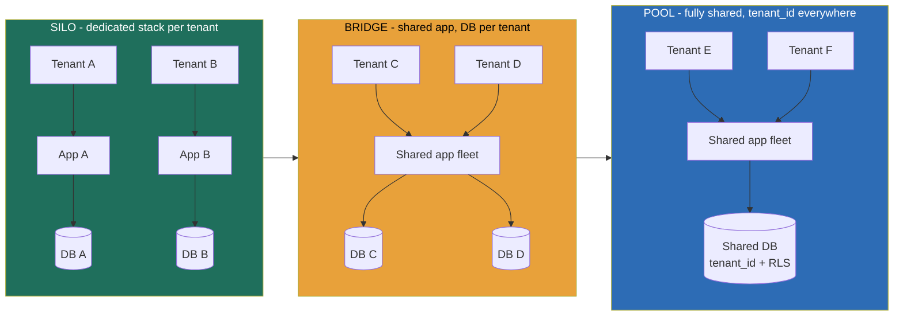

### Learning objectives
- Define **multi-tenancy** (many customers served by one shared system, each seeing only their own data and config) versus **single-tenant** (one deployment per customer), and why tenancy is a *distinct design axis*, not a column added late.
- Reason along the **isolation spectrum**, the spine of this track: **silo** (dedicated stack per tenant) to **bridge** (share some layers, isolate others) to **pool** (fully shared, a `tenant_id` discriminator everywhere), and why most real SaaS is a deliberate **mix**.
- Name the **core trade that recurs at every layer**, isolation (no cross-tenant leak, blast-radius containment, noisy-neighbor protection, compliance and residency, per-tenant customization and restore) versus efficiency (cost, operational simplicity, density and margin), and what you give up at each point.
- Thread the **tenant through every layer** (data, compute, network, identity, rate-limiting, observability, billing) and split the **control plane** (onboarding, tenant lifecycle, routing) from the **data plane** (the tenants' actual traffic).
- Treat the tenancy model as a **unit-economics and business-model decision** (cost per tenant, gross margin, which tier a customer buys, which enterprise deals isolation closes), own the density-versus-isolation call with numbers, and foreground **cross-tenant data leakage** as the existential failure.

### Intuition first
Multi-tenancy is an **apartment building**, not a street of detached houses.

The street of houses is **single-tenant**: every customer gets their own building, foundation, plumbing, and roof. Strongest possible isolation, a noisy neighbor cannot flood your bathroom and a fire next door does not reach you. But you pay to build, heat, and maintain a whole separate house per family, and a code change means a crew to every house one at a time. It does not scale to ten thousand families.

The **apartment building** is multi-tenant: one structure, shared foundation, elevators, and boiler, hundreds of families inside. Dramatically cheaper per family, one crew upgrades the boiler for everyone at once. That efficiency is the reason it exists. But everything the houses gave for free you now **design in**: a lock on every door so nobody wanders into a neighbor's unit (**data isolation**), a meter per unit so each family pays for what it uses (**metering and billing**), enough elevator and boiler capacity that one family running every tap does not leave the rest cold (**noisy-neighbor and rate-limiting**), and above all a guarantee that key 4B opens 4B and *only* 4B. The wrong key walks someone into a stranger's living room, and that single failure, one tenant seeing another's data, is worse than the elevator being out for a day. It gets the building condemned.

And the part a Director holds: some families pay far more for a **penthouse with its own private entrance and boiler** (a **silo** tier), because a bank or hospital is legally forbidden from sharing a boiler with strangers. The building has both, and *which unit a customer can buy is a business decision priced into the rent*, not a plumbing detail.

### Deep explanation

**Multi-tenancy is a distinct design axis, and that reframe governs the whole track.** A tenant is one customer account, a company, workspace, or organization, that owns its users, data, and config and must be insulated from every other tenant. **Single-tenant** stands up one full deployment per customer (maximum isolation, but N copies of everything to operate), which is why on-prem software shipped that way. **Multi-tenant** serves many customers from **shared infrastructure**, and dominates SaaS for economics: upgrade once and every tenant gets it, run one fleet not thousands, and **cost per tenant collapses as density rises**. Salesforce is canonical, one system serving over 150,000 orgs off shared infrastructure with an `org_id` woven through the platform; Slack partitions by *workspace*; Snowflake shares a metadata and storage layer across all accounts while giving each its own compute. Tenancy is decided at the *architecture* level; adding it late means retrofitting `tenant_id` into schemas, caches, queues, logs, and every query, which is how leaks ship.

**The isolation spectrum is the spine of every tenancy decision.** Every layer of the stack sits somewhere from fully isolated to fully shared, and the industry names three points on it:

- **Silo (dedicated).** Each tenant gets its own stack, compute, database, sometimes its own network segment or cloud account. Strongest isolation (a neighbor literally cannot touch your resources), easiest compliance story, trivial per-tenant customization and restore. But **lowest density and highest cost**: a thousand tenants is a thousand stacks to patch, monitor, and pay for.
- **Pool (shared).** All tenants share the infrastructure, and a **`tenant_id` discriminator appears everywhere**, every row, cache key, log line, queue message. Highest density and lowest cost per tenant, one upgrade for all, but the **weakest isolation**: a single missing filter is a cross-tenant leak. Postgres **row-level security (RLS)** makes this safer by pushing the `WHERE tenant_id = ...` predicate into the engine so an application bug cannot bypass it.
- **Bridge (mixed).** Share some layers, isolate others, commonly a **shared compute tier but a database-per-tenant** (or schema-per-tenant): tenants share the expensive-to-duplicate stateless app fleet while keeping data physically separated. It buys much of silo's data isolation at much of pool's compute efficiency, and is where a large fraction of real B2B SaaS lands.

The Director-altitude point: **most real SaaS is a deliberate mix**, pool for the long tail where density is everything, silo (or bridge) for the handful of large or regulated tenants where isolation is contractual. You pick a point *per tenant tier*, not one for the whole product, and name the trade at each.

**The core trade recurs at every layer.** **Isolation** buys no cross-tenant leak, a contained **blast radius** (a bad deploy hurts one tenant, not all), **noisy-neighbor protection** (one tenant's spike cannot starve the rest), **compliance and residency** (data in-region under the tenant's own key), **per-tenant customization**, and **per-tenant restore**. **Efficiency** buys lower **cost**, **operational simplicity** (one fleet, one upgrade), and **density**, the direct driver of **gross margin**. Every tenancy question, "one database or many?", "one cluster or a namespace per tenant?", is that trade in different clothes; the discipline is to **name what you give up**.

**The tenant is threaded through every layer, not a column in one table.** Walk the stack and ask where each layer sits:

- **Data.** Shared table with `tenant_id` + RLS (pool), schema-per-tenant, or database-per-tenant (bridge/silo). Where leaks happen and residency is enforced.
- **Compute.** Shared app pods, or a **Kubernetes namespace / node pool per tenant** for the big ones, so a runaway workload schedules apart.
- **Network.** Shared ingress, or a dedicated VPC / subnet / private endpoint for an enterprise tenant needing network-level separation.
- **Identity and auth.** Every request is scoped to a tenant, resolved from the subdomain, JWT (JSON Web Token) claim, or API key, and *every* downstream call is bound to it.
- **Rate-limiting and quotas.** Limits are **per tenant**, not global, or one tenant's burst becomes everyone's outage (noisy neighbor).
- **Observability.** Dashboards, logs, traces, and alerts **sliced by tenant**, to answer "is tenant X degraded?" and attribute cost per tenant.
- **Billing and metering.** **Meter per-tenant consumption** (API calls, storage, compute) into an invoice; without it you cannot price by usage or know your cost per tenant.

The rest of the track builds these out: silo/bridge/pool per layer, **per-tenant limits, metering, and billing**, and the **control plane and tenant lifecycle**.

**Control plane versus data plane is the structural split under all of it.** The **data plane** is where tenants' real traffic flows, serving their requests and data. The **control plane** *manages tenants*: onboarding (provisioning a data partition, keys, config), routing to the right resources, enforcing quotas, offboarding, and rolling out upgrades. Pooled, it is light (create a row, hand out an API key); siloed, it is heavy and arguably the hard part, since it provisions and lifecycle-manages a full stack per tenant. Confusing the two is a classic error: put provisioning on the hot request path and an onboarding bug takes down live traffic.

**Cross-tenant data leakage is the cardinal failure, worse than downtime.** If the system is down, every tenant is annoyed and you lose revenue and trust for an afternoon. If **one tenant sees another's data**, you have breached confidentiality for two customers at once, likely violated a contract and a regulation, and handed your competitor a case study. Downtime is recoverable; a leak is not un-happened. This is why pooled models lean on database-enforced isolation (RLS) rather than trusting every hand-written query, why `tenant_id` must be non-optional and validated at the boundary, and why "we filter by tenant in the app layer" is a red flag: the one query that forgets is the breach. **Design so a leak is impossible by construction, not merely unlikely by discipline.**

**The Director lens: tenancy is a unit-economics and deal-gating decision, not just a technical one.** The model sets your **cost per tenant (COGS)** and therefore your **gross margin**, the number SaaS lives and dies on (public SaaS targets 70 to 80 percent-plus gross margin, and density is the lever). It also determines **which deals you can close**: a regulated enterprise requiring a dedicated database, in-region residency, and its own encryption keys cannot be sold a pooled tier, so **isolation becomes a sellable, revenue-gating feature** that justifies the enterprise price. And tenant load follows a **power law**: the top 1 percent of tenants drive a large share of load and revenue (a handful of huge Salesforce or Slack customers dwarf the long tail), so a one-size model is wrong at both ends. The Director owns the call, "pool the long tail for margin, silo the whale tenants for isolation and to win the deal," with cost per tenant and margin impact stated out loud.

<details>
<summary>Go deeper - pooled data isolation with Postgres row-level security (IC depth, optional)</summary>

In a pooled table, isolation cannot rely on every query author remembering `WHERE tenant_id = :t`, because the one query that forgets is a cross-tenant leak. Postgres **row-level security** pushes the predicate into the engine:

```sql
ALTER TABLE tickets ENABLE ROW LEVEL SECURITY;
CREATE POLICY tenant_isolation ON tickets
  USING (tenant_id = current_setting('app.tenant_id')::uuid);
```

The app sets `SET app.tenant_id = '...'` at the start of each request (from the authenticated tenant claim), and every subsequent `SELECT`/`UPDATE`/`DELETE` is automatically scoped, even a query that forgets the `WHERE` clause returns only the current tenant's rows. Cautions the security team will raise: `BYPASSRLS` roles (and the table owner) skip policies, so the app must connect as a non-owner, non-superuser role; connection poolers that reuse sessions must reset `app.tenant_id` per checkout or a request can inherit the previous tenant's context (itself a leak); and RLS adds a predicate to every query, so hot paths still need the right composite indexes leading with `tenant_id`. RLS makes pooled isolation *enforced by construction* rather than *by discipline*, which is the whole point.

</details>

### Diagram: the silo - bridge - pool isolation spectrum


```mermaid
flowchart LR
  subgraph SILO["SILO - dedicated stack per tenant"]
    direction TB
    TA["Tenant A"] --> AA["App A"] --> DA[("DB A")]
    TB["Tenant B"] --> AB["App B"] --> DB2[("DB B")]
  end
  subgraph BRIDGE["BRIDGE - shared app, DB per tenant"]
    direction TB
    TC["Tenant C"] --> SAPP["Shared app fleet"]
    TD["Tenant D"] --> SAPP
    SAPP --> DC[("DB C")]
    SAPP --> DD[("DB D")]
  end
  subgraph POOL["POOL - fully shared, tenant_id everywhere"]
    direction TB
    TE["Tenant E"] --> PAPP["Shared app fleet"]
    TF["Tenant F"] --> PAPP
    PAPP --> PDB[("Shared DB<br/>tenant_id + RLS")]
  end
  SILO --> BRIDGE --> POOL
  style SILO fill:#1f6f5c,color:#fff
  style BRIDGE fill:#e8a13a,color:#000
  style POOL fill:#2d6cb5,color:#fff
```

Left to right, **isolation falls and density rises**: silo gives each tenant a private stack (~1 tenant per stack, highest cost), bridge shares the stateless app but keeps data physically separate, and pool shares everything with a `tenant_id` discriminator (hundreds of tenants per host, lowest cost). Real platforms place *different tenant tiers* at different points, not the whole product at one.

### Worked example: a B2B project-analytics SaaS, pool for SMB, silo for a regulated enterprise
Take a team project-tracking and analytics product sold to companies. The customer base splits the way SaaS bases always do: thousands of small teams and a few large regulated accounts. One model does not fit both, so we place each tier deliberately.

- **SMB tier, pooled.** The 8,000 small tenants (5 to 50 seats each) share one Kubernetes cluster of app pods and one Postgres cluster, with **`tenant_id` on every table and RLS enforcing isolation in the engine**. Density is the point: ~250+ tenants per database host, shared app fleet, one upgrade for all. Total infra runs about \$40k/month, that is **~\$5 per tenant per month in COGS** (cost of goods sold); at an average \$180/month revenue per small tenant, infra is under 3 percent of revenue, a ~97 percent gross margin on infrastructure. **The trade named:** we give up blast-radius containment (a bad migration can touch all 8,000) and easy per-tenant restore, and accept that isolation rides on RLS being correct, for the density that makes the small-tenant business profitable at all. Rejected alternative, a database per small tenant: it multiplies COGS roughly 10x and hands us 8,000 databases to patch, destroying the margin, for isolation these customers are not paying for.

- **Enterprise tier, silo.** A regulated bank buys, and its security review requires a **dedicated Postgres instance, an isolated VPC, in-region residency, and its own encryption keys (BYOK (bring your own key))**, none of which the pooled tier offers. So it gets a **siloed stack**: its own database, its own Kubernetes namespace and node pool isolating compute, its own network segment. That stack runs on the order of \$4,000/month, roughly 800x the per-tenant COGS of a pooled SMB tenant. **The trade named:** we give up density and operational simplicity (a whole stack to provision, patch, and lifecycle) for the isolation, residency, and blast-radius containment the deal legally requires. The real point: **this is a deal-gating decision, not a margin one**, the \$60k/year contract does not exist without the silo, so the \$4k/month COGS is the cost of a revenue stream we could not otherwise book. Rejected alternative, forcing the bank onto the pool: the deal never closes, because "your data shares a database with strangers" fails their compliance review on the first question.

- **One control plane over both.** A shared **control plane** onboards every tenant, provisions the pooled row or the siloed stack, routes each request, meters per-tenant usage for billing, and rolls out upgrades, while the **data planes** (the shared pool and each enterprise silo) stay separate so an enterprise's isolation is never compromised by the SMB fleet.

The number a Director carries out: *"pool the long tail at ~\$5/tenant for 97 percent margin, silo the regulated whales at ~\$4k/tenant because isolation is what books the deal, one control plane over both, leakage designed out via RLS on the pool and physical separation on the silos."* Not "we added a `tenant_id` column."

### Trade-offs table: where a tenant tier sits on the spectrum
| Model | **Silo (dedicated stack)** | **Bridge (shared app, isolated data)** | **Pool (fully shared, `tenant_id`)** |
|---|---|---|---|
| **Isolation** | strongest (physical) | strong on data, shared compute | weakest (logical, RLS-enforced) |
| **Density / cost per tenant** | lowest density, highest cost | medium | highest density, lowest cost |
| **Blast radius** | one tenant | one tenant's data, shared compute risk | all tenants share it |
| **Noisy-neighbor risk** | none | compute-only | real, needs per-tenant limits |
| **Ops burden** | heavy (N stacks to run) | medium (N data stores) | light (one fleet) |
| **Per-tenant restore / customization** | trivial | easy (per-tenant DB) | hard (surgical extract) |
| **Compliance / residency** | easiest to satisfy | good | hardest to prove |
| **Use when…** | regulated or whale tenants, isolation is contractual and deal-gating | mid-market wanting data separation without silo cost | the long tail of small tenants where density and margin dominate |

The Director move: **place each tier deliberately**, pool the long tail for margin, silo the regulated whales for isolation and to win the deal, bridge the middle, and name what you traded away at each point rather than defaulting the whole product to one model.

### What interviewers probe here
- **"How would you make this product multi-tenant?"** *Strong signal:* you treat tenancy as a **deliberate isolation-versus-efficiency spectrum tied to unit economics**, place different tiers at silo/bridge/pool, quantify cost per tenant and margin, and name what each choice gives up. *Red flag:* "add a `tenant_id` column to every table and filter on it," tenancy as a bolt-on with no model of blast radius, noisy neighbors, or the leak surface.
- **"A big regulated customer wants in. What changes?"** *Strong:* you recognize isolation and residency as **contractual, deal-gating requirements**, move that tenant to a silo (dedicated DB, VPC, BYOK, in-region), and frame the extra COGS as the price of a revenue stream you otherwise cannot book, not a margin loss. *Red flag:* forcing the enterprise onto the pooled tier, or not knowing isolation can be a sellable feature.
- **"What is the worst thing that can go wrong here?"** *Strong:* **cross-tenant data leakage**, named as worse than downtime, and defended by construction (RLS in the engine, physical separation for silos, `tenant_id` validated at the boundary), not by hoping every query filters correctly. *Red flag:* naming downtime or scaling as the top risk and treating isolation as an app-layer discipline.
- **"You have one tenant that is 100x the size of the rest. What do you do?"** *Strong:* you reason about the **power-law tenant distribution**, isolate or shard the whale so it cannot starve the pool (noisy-neighbor), and consider moving it to bridge/silo, while keeping the long tail pooled for density. *Red flag:* uniform provisioning that over-provisions the whole pool for one tenant or lets that tenant degrade everyone else.

The through-line at Director altitude: tenancy is a **first-class design axis and a business-model decision**, own the density-versus-isolation call per tier with numbers, thread the tenant through every layer, split control plane from data plane, and design cross-tenant leakage out by construction.

### Common mistakes / misconceptions
- **Treating tenancy as a `tenant_id` column added late.** Retrofitting a discriminator into schemas, caches, queues, and logs after the fact is how filters get missed and leaks ship; it is an architectural axis threaded through every layer from the start.
- **Picking one model for the whole product.** Pooling everything starves the enterprise deals that need isolation; siloing everything destroys the margin on the long tail. Real SaaS is a mix, placed per tenant tier.
- **Trusting app-layer filtering for isolation.** "Every query filters by tenant" is discipline, and the one that forgets is a breach; enforce isolation by construction (database RLS, physical separation) so a leak is impossible, not merely unlikely.
- **Ranking downtime above leakage.** Downtime is recoverable in an afternoon; one tenant seeing another's data breaches two customers, a contract, and likely a regulation at once, and cannot be un-happened.
- **Ignoring the noisy neighbor and the power law.** Global (not per-tenant) rate limits let one tenant's spike take down the pool, and uniform provisioning ignores that the top 1 percent of tenants drive most of the load. Limits and isolation must be per tenant.

### Practice questions

**Q1.** An interviewer says "we serve 5,000 small businesses and just signed our first bank. Design the tenancy." Walk through your first move.

<details>
<summary>Model answer, try yours out loud first</summary>

> *Model:* Not one model for both. **Pool the 5,000 small businesses**, shared app fleet and a shared database with `tenant_id` on every table and RLS in the engine, because for the long tail density is the business: cost per tenant is a few dollars a month, margin in the 90s. **Silo the bank**, dedicated database, isolated network, in-region residency, its own keys, contractual requirements the pool cannot satisfy and without which the deal does not close. So a **deliberate mix**: pool for margin, silo for the whale, one control plane over both. The trade, pool gives up blast-radius containment and easy per-tenant restore for density, silo gives up density for isolation, its extra COGS the price of a deal we could not otherwise book. Top risk is cross-tenant leakage, defended by RLS on the pool and physical separation on the silo.

</details>

**Q2.** A peer proposes "just add a `tenant_id` column everywhere and filter on it in the app." What is the risk and how do you harden it?

<details>
<summary>Model answer, try yours out loud first</summary>

> *Model:* App-layer filtering makes isolation depend on *every* query author remembering `WHERE tenant_id = ...`, and the one that forgets, in a report, a migration, a new endpoint, is a cross-tenant leak, worse than downtime because it breaches two customers and a contract at once and cannot be undone. The fix is isolation **enforced by construction**: push the predicate into Postgres with row-level security so even a query that omits the filter returns only the current tenant's rows, set tenant context per request from the authenticated claim, validate `tenant_id` at the boundary as non-optional, and reset context on every pooled-connection checkout so a request cannot inherit the previous tenant's session. Pooling with `tenant_id` is fine; *trusting the app to remember the filter* is the risk.

</details>

**Q3.** Your platform has 20,000 tenants; one of them just grew to drive 40 percent of total load. What do you do, and why is this predictable?

<details>
<summary>Model answer, try yours out loud first</summary>

> *Model:* Predictable because tenant load follows a **power law**, the top 1 percent drive a large share of load and revenue, so a whale was always coming. In the shared pool it is a **noisy neighbor**: its spikes contend for the same app pods, database, and connection pool as everyone else, so one customer's growth degrades the other 19,999. **Isolate the whale**, its own compute (a dedicated Kubernetes namespace or node pool) and likely its own database (from pool toward bridge or silo), with **per-tenant** rate limits so no one tenant consumes the shared budget. The long tail stays pooled for density. The trade: the whale costs more per tenant, but it is a top revenue account, so isolation protects the pool and matches spend to the customer that justifies it. Uniform provisioning is wrong at both ends, over-provisioning the pool for one tenant or letting it starve the rest.

</details>

**Q4.** Why is the tenancy model a business decision a Director should own, not just an engineering detail?

<details>
<summary>Model answer, try yours out loud first</summary>

> *Model:* Because it sets the numbers the business runs on and gates which customers you can sell to. The point on the spectrum sets **cost per tenant (COGS)** and therefore **gross margin**, density the direct lever, and SaaS lives or dies on 70 to 80 percent-plus margins, so pooling versus siloing the long tail swings the P&L by an order of magnitude per tenant. It also decides **which deals close**: a regulated enterprise needing a dedicated database, residency, and its own keys cannot buy a pooled tier, so **isolation is a sellable, revenue-gating feature** that justifies the enterprise price. And because load and revenue follow a power law, the answer is a **tiered mix**, pool for margin, silo for the whales, a pricing-and-packaging call as much as an architecture one. A Director owns it with numbers: cost per tenant, margin impact, and the deals each tier unlocks.

</details>

### Key takeaways
- **Multi-tenancy is a distinct design axis, not a bolt-on column.** Many customers share one system, each seeing only their own data, with tenancy threaded through every layer from the start; retrofitting it late is how leaks ship.
- **Reason along the silo-bridge-pool spectrum.** Silo (dedicated stack) gives strongest isolation at lowest density and highest cost; pool (fully shared, `tenant_id` + RLS) gives highest density and margin at weakest isolation; bridge sits between. Real SaaS is a deliberate **mix per tenant tier**.
- **The core trade is isolation versus efficiency, and it recurs at every layer.** Isolation buys no-leak, blast-radius containment, noisy-neighbor protection, compliance/residency, per-tenant customization and restore; efficiency buys cost, ops simplicity, and margin. Name what you give up at each point.
- **Cross-tenant data leakage is the cardinal failure, worse than downtime.** Downtime is recoverable; one tenant seeing another's data breaches two customers and a contract at once and cannot be un-happened. Design isolation in by construction (RLS, physical separation), not by app-layer discipline.
- **Tenancy is a unit-economics and deal-gating decision a Director owns with numbers.** Density sets cost per tenant and gross margin; isolation is a sellable feature that unlocks regulated enterprise deals; tenant load is a power law, so pool the long tail for margin and silo the whales for isolation, split control plane from data plane, and quantify the call.

> **Spaced-repetition recap:** Multi-tenancy is an **apartment building**, not a street of houses, one shared structure serving many families cheaply, but every isolation the houses gave for free (locks, meters, capacity, the right key opening only your unit) you now **design in**. Tenancy is a **first-class design axis** threaded through every layer, placed on the **silo → bridge → pool** spectrum where isolation falls and density rises. The recurring trade is **isolation vs efficiency**: silo for regulated whales (dedicated stack, ~\$4k/tenant, deal-gating), pool for the long tail (`tenant_id` + Postgres **RLS**, ~\$5/tenant, ~97 percent margin), real SaaS a **mix per tier** (Salesforce org_id, Slack workspace, Snowflake per-account compute). Split the **control plane** (onboarding, lifecycle, routing, metering) from the **data plane** (tenant traffic). **Cross-tenant leakage** is the existential failure, worse than downtime, designed out by construction, not app-layer filtering. Tenant load is a **power law** (top 1 percent drive most load), so isolate the whale and rate-limit **per tenant**. Own the density-vs-isolation call as a **unit-economics and deal-gating** decision, with cost per tenant and margin stated.

---

*End of the opening lesson. This is the mental model the whole Multi-Tenancy and SaaS Platform track rests on: tenancy is a first-class design axis and a business-model decision, reasoned on the silo-bridge-pool spectrum, threaded through every layer, split into control plane and data plane, and built so cross-tenant leakage is impossible by construction.*
