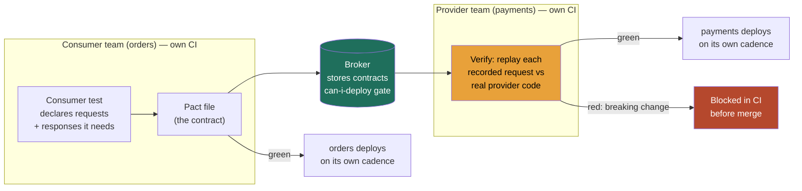

### Learning objectives
- State the **seams thesis**: once a system is split across services owned by different teams, the bugs stop living inside a service and start living at the **boundaries between them**, so your test strategy has to verify *agreements between services* as a first-class thing, not just code inside one.
- Explain **consumer-driven contracts** at architecture altitude: the consumer declares the requests and responses it actually depends on, the provider verifies against that recorded contract in CI, and the payoff is **decoupled deploys**, two teams ship on their own cadence with no shared environment to coordinate in.
- Reason in the **flake-vs-fidelity tension**: real dependencies give high fidelity but high flake, slowness, and cost; test doubles (mock/stub/fake/spy) are fast and stable but **drift** from reality and hand you false confidence. Know where each belongs.
- Make the **API-compatibility-direction call**: backward vs forward compatibility, and the **deploy-order rule** that lets the provider ship a change before its consumers without a coordinated big-bang release.
- Name the **failure modes** this discipline engineers around, integration breaks surfacing in prod, mock drift, one shared integration environment coupling every deploy, before reaching for a tool.

### Intuition first
Think of two companies that trade by **purchase order**. The buyer sends an order in an agreed shape, fields, units, currency, and the supplier promises to honor anything that matches that shape. Neither company audits the other's internal accounting; they only care that the **document at the boundary** stays valid. If the buyer needs a new field, they say so up front; if the supplier wants to change the form, they have to keep accepting the old one until every buyer has migrated. The contract is the purchase order, and as long as both sides keep their half of it, each runs its own back office however it likes, on its own schedule.

That is exactly what contract testing does for services. The expensive, fragile alternative is to **build one full replica of the whole supply chain** and watch a real order flow end to end through every warehouse before you trust anything. It works, but it is slow, it breaks for reasons that have nothing to do with your change, and now every company's shipping schedule is hostage to one shared test warehouse. The cheaper, sharper move is to test the **purchase order itself**: does what the buyer sends still match what the supplier accepts? Get the document right and the two back offices never have to be in the same room.

### Deep explanation

**The seams thesis is the foundational fact, and the whole lesson falls out of it.** In a monolith, a function call either compiles against its callee or it does not; the boundary is checked for free by the type system at build time. Split that monolith into an `orders` service and a `payments` service owned by two teams, and the call becomes an HTTP or gRPC request across a network, validated by nobody until it runs. The bug is no longer inside a function; it is the **disagreement between what `orders` sends and what `payments` now accepts**, a renamed field, a type change, a removed endpoint, a status code nobody documented. The Director-altitude statement: *in a distributed system the integration is the risky part, not the unit, so your test investment has to move toward verifying the agreements at the seams, and the cheapest way to do that is not to run the whole system.*

**Three test layers prove three different things, and conflating them is the classic mistake.** Each answers a distinct question and carries a distinct cost:

- **Integration tests** prove that *one service plus its real adjacent infrastructure* works, the service against a real database, a real queue, a real cache. They catch wiring bugs (bad SQL, wrong serialization, a misconfigured client) that unit tests with everything mocked cannot. Scope: one service and its own backing stores. Cost: seconds to low minutes.
- **Contract tests** prove that *the agreement between two services* holds, that the consumer's expectations of the provider's API still match what the provider delivers, without ever standing both services up together. Scope: the API boundary, in isolation. Cost: seconds.
- **End-to-end (E2E) tests** prove that *a real user journey across many real services* works, login through checkout through fulfillment, every service deployed and talking. They are the only thing that proves the whole flow, and they are the most expensive, slowest, and flakiest. Scope: the entire system. Cost: many minutes, and a flake rate that climbs with every service in the path.

**Consumer-driven contracts (CDC) is the technique that gets seam confidence without standing up the system.** The pattern, popularized by Pact: the **consumer** (`orders`) writes a test describing the exact requests it makes and the responses it depends on, *only the fields it actually reads*. Running that test produces a **contract** (a JSON pact file) and publishes it to a **broker**. The **provider** (`payments`), in its own CI, pulls every consumer's contract and **replays each recorded request against the real provider code**, asserting the real response satisfies what that consumer expects. Crucially the consumer never talks to the live provider and the provider never talks to the live consumer; they meet only through the recorded contract in the broker. The word *consumer-driven* is the whole point: the provider is verified against **what its consumers genuinely use**, so a field no consumer reads can be changed freely, and a field someone depends on fails CI the moment it breaks.

**The payoff is decoupled deploys, and that is the business case, not a testing nicety.** Without contracts, the only way two teams gain confidence their services still integrate is a shared integration environment where both are deployed and exercised together, which means every deploy queues behind that environment, and one team's broken build blocks the other's release. With contracts verified in **each team's own CI**, `payments` knows before merge whether its change breaks any consumer, and `orders` knows its expectations are still honored, **without a shared environment and without coordinating release timing.** Two teams that used to ship together on a weekly train now ship independently many times a day. That decoupling, fewer cross-team handoffs, no shared-env queue, is worth far more than the bugs the tests catch.

**The flake-vs-fidelity tension governs the test-double-versus-real-dependency choice, and it is the real engineering judgment here.** Every test boundary forces a pick between using the *real* thing and using a *double*:

- **Real dependencies** give the **highest fidelity**, you are testing against the actual behavior, including the quirks a mock would never reproduce, but they are **slow** (network, startup), **costly** (infrastructure, sometimes paid third-party calls), and **flaky** (the dependency is down, slow, rate-limited, or in a bad state). Flake is the silent tax: a suite that fails 1-in-50 runs for reasons unrelated to the code teaches engineers to hit "retry" and stop reading failures, which destroys the signal you built the suite for.
- **Test doubles** trade fidelity for **speed and stability**. A **mock** asserts the call was made a certain way; a **stub** returns a canned response; a **fake** is a working lightweight implementation (an in-memory store standing in for a database); a **spy** records calls for later inspection. All are fast and deterministic, and all share one fatal weakness: **drift**. The double encodes *your belief* about how the dependency behaves, and when the real dependency changes, the double does not, so your tests stay green while production breaks. A mock that has drifted is worse than no test: it is **confident false assurance**.
- **Ephemeral-real (testcontainers)** is the modern middle: spin up a *real* dependency (Postgres, Kafka, Redis) in a throwaway container for the duration of the test, then tear it down. You get the fidelity of the real thing with the determinism of a fresh, isolated instance, at the cost of a few seconds of startup and the need for a container runtime in CI. This is now the default for integration tests against infrastructure you can containerize.

The Director resolution of the tension: **use doubles for speed where fidelity is cheap to fake, use ephemeral-real for your own infrastructure, use contracts for service-to-service seams, and reserve real-dependency E2E for the handful of critical journeys where nothing else proves the flow.** Contract testing is precisely the tool that escapes the tension at the service boundary: it gives you fidelity (verified against real provider code) without the flake (no live network between the two services).

**API and schema compatibility is the other half, because a passing contract today must not silently break a consumer tomorrow.** Two directions matter, and they are not symmetric:

- **Backward compatibility** means a *new* provider still serves *old* consumers, you only **add** optional fields and new endpoints, never **remove** or **rename** or **tighten** an existing one. This is the property that lets the provider deploy first.
- **Forward compatibility** means an *old* consumer tolerates a *new* provider's responses, the consumer ignores fields it does not recognize rather than rejecting them. This is the property that lets the consumer lag behind.

The operational consequence is the **deploy-order rule**: for any change, **the side that adds capability ships before the side that depends on it.** Adding a field to a response? The provider ships the backward-compatible change first, then consumers adopt the field. Adding a required field to a request? The provider must accept it as optional first, consumers start sending it, then the provider can tighten. Removing a field? Stop reading it in all consumers first, then remove it from the provider, the **expand-then-contract** pattern. Violate the order, ship the consumer's dependency before the provider supports it, and you get a self-inflicted outage in the gap between the two deploys. Contract verification in CI is what catches a breaking change *before merge*: the provider's CI replays existing consumer contracts and goes red the instant a change would break one.

Go deeper — the Pact verification flow and breaking-change detection (IC depth, optional)

- **Consumer side produces the pact.** The consumer test uses a Pact mock server in place of the provider. Each interaction declares a `request` (method, path, headers, body matchers) and the expected `response`. Matchers (`like`, `eachLike`, `term` with a regex) assert *shape and type*, not exact values, so the contract verifies structure without pinning literal data. Running the test writes a pact JSON file capturing every interaction the consumer exercised.

- **The broker is the exchange and the gatekeeper.** The pact is published to a Pact Broker (or Pactflow) tagged with the consumer's version and branch. The broker stores every consumer-provider pair's contract and tracks which versions have been verified against which. It also serves `can-i-deploy`: a CLI query that answers "is version X of this service verified compatible with the versions of its dependencies currently in the target environment?", a hard gate you put in the deploy pipeline.

- **Provider side verifies.** The provider's CI pulls all pacts naming it as provider and replays each recorded request against the running provider (real handler code, often with the data layer stubbed via `provider states`, a named setup like "user 42 exists" the provider sets up before the interaction). The response must satisfy every matcher in the contract. A removed field, a changed type, a 200 that became a 404, any of these fails verification.

- **Breaking-change detection is the bidirectional CI gate.** Consumer change → consumer CI republishes the pact → provider CI re-verifies against the new expectation. Provider change → provider CI re-verifies all existing consumer pacts; if the change drops a field a consumer reads, verification fails *before merge*. `can-i-deploy` then blocks promotion of any version not verified against what is actually running in the target environment, which is what makes independent deploys safe rather than merely fast.

- **Provider states are the sharp edge.** They are the one place mock drift can re-enter: if "user 42 exists" sets up data that does not match how the real provider would shape it, the verification passes against a fiction. Keep provider-state setup as close to real production data shaping as possible.

### Diagram: the consumer-driven contract flow

### Worked example: contract-testing the payments API between two teams
Two teams, **`orders`** and **`payments`**, each own their service and want to stop shipping on a shared weekly release train. Today they coordinate through a single staging environment where both are deployed and a nightly E2E suite exercises checkout; a red E2E run blocks both teams, and the suite is flaky enough (real third-party payment sandbox, ~3% of runs fail spuriously) that engineers have learned to ignore failures, which is how a real break once reached prod.

- **The contract.** `orders` calls `POST /charges` with `{amount, currency, order_id}` and reads back `{charge_id, status}`, it does not read the other twelve fields `payments` returns. The consumer test records exactly that, request shape plus the two fields it depends on, and publishes the pact to the broker. The contract is small on purpose: it pins only the dependency, so `payments` stays free to evolve everything `orders` ignores.
- **Independent deploys.** `payments` wants to add a `risk_score` field to the response and rename an internal field. Its CI replays the `orders` pact against the new code: `risk_score` is additive and `orders` does not read the renamed field, so verification stays green and `payments` ships at 11am without telling `orders`. `orders` ships its own change at 2pm, its pact unchanged, no shared environment touched. **Rejected: the shared staging E2E gate**, because it serializes both teams behind one environment and one flaky suite, turning two independent deploys into one coupled, queued release.
- **Catching the break in CI, not prod.** Next sprint `payments` proposes renaming `status` to `state`, a field `orders` reads. The provider CI replays the `orders` contract, the response no longer satisfies the `status` matcher, and verification goes **red before merge**. The fix is forced into the right order: `payments` adds `state` alongside `status` (backward-compatible), `orders` migrates to `state`, then `payments` removes `status`, expand-then-contract. The break that once took a flaky nightly E2E run (or prod) to find now fails a 4-second contract job at PR time.
- **Where real fidelity still earns its keep.** One E2E test remains: a single happy-path checkout against the real payment sandbox, run on the release candidate, because nothing but a real charge proves the end-to-end money movement and the sandbox's actual quirks. **Rejected: deleting E2E entirely**, because contracts verify the *agreement* but not the *emergent behavior* of the full flow; the call is to keep one, not forty.

The number a Director carries out of this is not "we added Pact"; it is *"two teams went from one weekly coupled release to independent daily deploys, breaking changes fail in a 4-second CI job instead of a flaky nightly suite, and we kept exactly one real-dependency E2E where money actually moves."*

### Trade-offs table: how to verify a service boundary
| Approach | Fidelity | Speed | Flake | Cost | Deploy coupling | Use when… |
|---|---|---|---|---|---|---|
| **Mocks / stubs** | low (encodes a belief; can drift) | seconds | very low | cheap | none | unit-level logic where the dependency is incidental |
| **Real deps (ephemeral / testcontainers)** | high for *own* infra | seconds–minutes | low–medium | medium | none | integration tests against your DB/queue/cache |
| **Consumer-driven contracts** | high *at the seam* (vs real provider code) | seconds | very low | low | **decoupled** | service-to-service boundaries, independent deploys |
| **End-to-end** | highest (real full flow) | many minutes | high (climbs per service) | high | **couples every deploy to one env** | a handful of critical journeys nothing else proves |

The Director move is matching each boundary to the cheapest approach that proves what you actually need, contracts at the seams, ephemeral-real for your own infrastructure, and a thin layer of E2E only where emergent full-flow behavior is the risk, never "stand up everything and run E2E" as the default integration strategy.

### What interviewers probe here
- **"How do you test across service boundaries so teams can deploy independently?"**, *Strong signal:* consumer-driven contracts verified in each team's own CI, real dependencies only where fidelity is the risk (own infra via testcontainers, a thin E2E layer for critical journeys), and deploys decoupled from any shared environment. *Red flag:* "stand up the whole system and run end-to-end", which is slow, flaky, and couples every team's deploy to one environment and one suite.
- **"When do you use a mock versus a real dependency?"**, *Strong:* names the flake-vs-fidelity trade explicitly, doubles for speed where faking is cheap, ephemeral-real for own infrastructure, contracts at service seams, and calls out **mock drift** as the failure mode that makes a green suite lie. *Red flag:* "mock everything" (drift, false confidence) or "use real everything" (flaky, slow, expensive) with no sense of the trade.
- **"A provider needs to remove a field two consumers use. Walk me through the deploy."**, *Strong:* expand-then-contract with the deploy-order rule, add the replacement and keep the old field (backward-compatible), migrate consumers, verify via contracts in CI, then remove, and notes `can-i-deploy` as the gate that proves compatibility before promotion. *Red flag:* "coordinate a release window and deploy them together", reintroducing the big-bang coupling contracts exist to remove.
- **"Your E2E suite is 8% flaky. What do you do, as the owner of the quality operating model?"**, *Strong:* treats flake as a trust-destroying tax with a number, shrinks the E2E surface by pushing seam confidence down into contracts, quarantines flaky tests off the blocking path, and reserves real-dependency E2E for the few journeys that justify it. *Red flag:* "add retries", which hides the signal and lets the suite rot further.

The through-line at Director altitude: the bugs live at the seams, so you push verification down to the cheapest layer that proves each agreement, contracts for service boundaries, ephemeral-real for own infra, a thin E2E layer for critical flows, and you delegate the bake-off with a stated prior ("I'd have the platform team trial Pact against our top three service pairs and measure deploy-coupling reduction; my prior is consumer-driven contracts, because our pain is cross-team release queuing, not in-service logic bugs").

### Common mistakes / misconceptions
- **Relying on full E2E for integration confidence.** E2E is slow, expensive, and its flake rate climbs with every service in the path; using it as the *primary* integration check couples every deploy to one environment and trains engineers to ignore failures.
- **Mocks that drift from the real provider.** A double encodes your belief about a dependency; when the dependency changes and the double does not, tests stay green while production breaks, false confidence is worse than no test.
- **No contracts at all, so integration breaks surface in prod.** Without a verified agreement at the seam, a renamed field or changed status code passes every in-service test and fails only when a real user hits the boundary.
- **Coupling all deploys to one shared integration environment.** One staging env where everything must be green serializes independent teams and makes one team's broken build block everyone, the queue contracts exist to eliminate.
- **Ignoring compatibility direction and deploy order.** Shipping a consumer's new dependency before the provider supports it, or removing a field before consumers stop reading it, is a self-inflicted outage; expand-then-contract and provider-ships-first are non-negotiable.

### Practice questions

**Q1.** A team proposes deleting all contract and integration tests and relying on a comprehensive nightly E2E suite for confidence. Make the Director case against it.
> *Model:* E2E proves the full flow but at the worst cost profile, many minutes per run and a flake rate that climbs with every service in the path (a 1% per-service flake across 10 services is a ~10% suite flake), which trains engineers to hit retry and stop reading failures, destroying the signal. It also couples every deploy to one shared environment: one team's red build blocks everyone, reintroducing a release queue. I'd invert the pyramid for distributed systems: push seam confidence down into **consumer-driven contracts** verified in each team's CI (seconds, near-zero flake, decoupled deploys), use **ephemeral-real** tests for each service's own infra, and keep a *thin* E2E layer, only the handful of critical journeys whose emergent behavior nothing else proves. Net: faster signal, independent deploys, and E2E reserved for what only E2E can verify.

**Q2.** Two teams share a staging environment and ship on a weekly train. They want daily independent deploys. What changes, and what does it buy?
> *Model:* Introduce consumer-driven contracts: each consumer publishes the requests/responses it depends on to a broker, each provider verifies those contracts in its own CI, and a `can-i-deploy` gate proves a version is compatible with what is actually running before promotion. That removes the need for a shared environment to gain integration confidence, so each team's deploy is gated by its own CI, not by a shared-env queue or the other team's build. Quantify the win: from one coupled weekly release (52/year, shared blast radius) to independent daily deploys (hundreds/year per team, isolated). The trade-off, *rejected: keeping the shared staging gate*, is that contracts verify the agreement but not full emergent flow, so I'd retain one thin E2E on the critical journey. The benefit is decoupling, which is an org-velocity win, not just a test win.

**Q3.** A provider must rename a response field `status` to `state`, and two consumers read `status`. Walk through a zero-downtime rollout.
> *Model:* Expand-then-contract, obeying the deploy-order rule. **Expand:** the provider ships `state` *alongside* `status` (additive, backward-compatible), so it serves both old and new consumers; this provider change ships first and breaks nothing. **Migrate:** each consumer moves to read `state`, updating its contract; provider CI re-verifies and stays green. **Contract:** once no consumer's contract references `status`, the provider removes it; the contract gate confirms no consumer depends on it before the removal merges. At no point is there a gap where a deployed consumer reads a field a deployed provider does not serve, because the provider always adds before consumers depend and removes only after consumers stop depending. `can-i-deploy` enforces this at each promotion. *Rejected: a coordinated big-bang where both deploy together*, because it reintroduces the cross-team coupling and a failure window if either side is delayed.

**Q4.** Your team's mocks of a third-party payments API are comprehensive and the suite is green, yet a production integration broke. What happened and how do you prevent a recurrence?
> *Model:* Mock drift. The mocks encode the team's belief about the third party's behavior; the third party changed (a field type, an error shape, a new required parameter) and the mocks did not, so the suite stayed green while production failed, the classic false-confidence trap. Prevention has two parts. For a third party I can't run contracts against, add a small **real-dependency contract/integration test against their sandbox** on a schedule, so drift surfaces as a failing job, not a prod incident, and treat their changelog/version as a monitored input. For internal services, replace belief-based mocks with **consumer-driven contracts** verified against the real provider code, which structurally cannot drift because the provider's own CI re-verifies them. The Director point: a mock is only as true as the day it was written; fidelity at the boundary has to be *refreshed against reality*, by contracts internally and by sandbox checks externally.

### Key takeaways
- **In a distributed system the bugs live at the seams**, the integration between services owned by different teams, not inside any one service, so test investment must move toward verifying the *agreements at the boundaries*, and the cheapest way to do that is not to run the whole system.
- **Consumer-driven contracts** let the consumer declare what it depends on and the provider verify it in CI, without standing both services up together; the real payoff is **decoupled deploys**, two teams shipping independently with no shared environment to queue behind.
- **Contract, integration, and E2E prove different things:** integration proves a service against its real infra, contracts prove the seam agreement, E2E proves the full real flow, expensive, slow, flaky. Don't use E2E to do contracts' job.
- **The flake-vs-fidelity tension governs doubles vs real deps:** mocks are fast/stable but **drift** into false confidence; real deps are high-fidelity but slow/flaky/costly; ephemeral-real (testcontainers) is the middle for own infra; contracts escape the tension at the seam.
- **API compatibility has a direction and a deploy order:** keep changes backward-compatible (add, don't remove), ship the provider before its dependents, and use **expand-then-contract** to remove a field; verifying contracts in CI catches breaking changes before merge, not in prod.

> **Spaced-repetition recap:** Microservice bugs live at the **seams**, the agreements between services, not inside one. **Consumer-driven contracts** (Pact-style: consumer records what it needs → broker → provider replays it against real code in CI) prove the seam in **seconds** with near-zero flake and, crucially, **decouple deploys** so teams ship independently with no shared-env queue, where full **E2E** takes many minutes, flakes more per added service, and couples every deploy to one environment. The choice between **test doubles** (fast, stable, but **drift** into false confidence) and **real dependencies** (high-fidelity but flaky/slow/costly) is the flake-vs-fidelity tension; use **ephemeral-real** for own infra, contracts at service seams, a thin E2E layer for critical flows. Keep APIs **backward-compatible** and obey the **deploy-order rule** (provider ships before dependents; **expand-then-contract** to remove), and let CI contract verification catch breaking changes before merge.

---

*End of Lesson 12.2. The bugs live at the seams: verify the agreement between services with consumer-driven contracts in CI, reserve real dependencies and E2E for where fidelity is the actual risk, and let compatibility direction decouple every team's deploy.*
