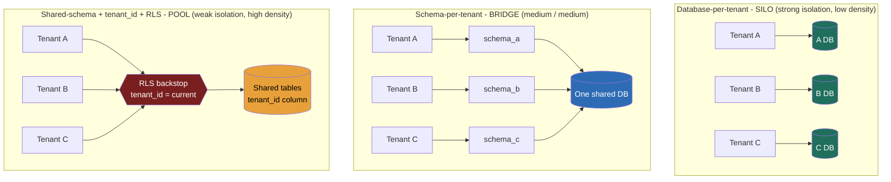

### Learning objectives
- Choose among the three canonical **data-isolation models**, database-per-tenant (silo), schema-per-tenant (bridge), and shared-schema-with-`tenant_id` (pool), by naming what each buys and costs in isolation strength, density, ops burden, and per-tenant restore.
- Treat **cross-tenant data leakage** as the existential SaaS risk (worse than downtime) and defend it with **defense in depth**: application-layer tenant scoping plus **Postgres Row-Level Security** as a database backstop, not one or the other.
- Extend isolation past the data layer to **compute** (shared pool vs per-tenant namespaces/pods vs dedicated clusters/accounts) and **network** (shared ingress vs per-tenant VPC/subnet/account), and name the noisy-neighbor failure at each.
- Resolve the density-versus-isolation trade with **tiering** (pool the long tail for cost, silo large/regulated tenants for isolation, sell isolation as a premium tier) and know how to **migrate a tenant between models** without downtime.

### Intuition first
Multi-tenancy is a housing decision, and there are three ways to house your tenants.

**Detached houses (database-per-tenant, the silo).** Every family gets its own house on its own lot: own plumbing, own locks, own front door. Total privacy, and if one house floods the others stay dry. But land is expensive, you can only fit so many houses on the block, and re-roofing 5,000 separate houses one at a time is a maintenance nightmare.

**An apartment building (schema-per-tenant, the bridge).** One building, each family its own unit with its own lock and its own utility meter. Shared foundation and roof make it denser and cheaper than detached houses, and a unit is still meaningfully private. But the building directory gets unwieldy past a few hundred units, and renovating every apartment means going door to door, unit by unit.

**A shared dormitory floor (shared-schema with `tenant_id`, the pool).** Everyone's belongings sit in one big room, each labeled with a name tag (`tenant_id`), and the only rule is "touch only the things with your tag." It is by far the cheapest and densest arrangement. But the only thing standing between you and your neighbor's diary is discipline plus a guard at the door checking tags (Row-Level Security). Forget one tag check and you are reading someone else's mail.

That last risk is the whole reason this lesson exists. In a mega-restaurant you can burn dinner, in a SaaS you can hand one customer another customer's data, and **a silent cross-tenant leak is worse than an outage**: an outage is visible and recoverable, a leak is a breach, a compliance violation, and a trust loss you often cannot undo. The rest of this lesson is about picking the housing model deliberately and putting two independent guards on the door, not one.

### Deep explanation

#### 1. The three data-isolation models, and what each actually costs

The data layer is the crux, because it is where the money (density) and the danger (leakage) both live. Three canonical models sit on a spectrum from strongest-isolation/lowest-density to weakest-isolation/highest-density.

**Database-per-tenant (SILO).** Each tenant gets its own physical database, often its own instance. This is the strongest isolation you can buy short of separate accounts. Per-tenant backup, restore, and data residency are trivial because the unit of everything is one database: you restore tenant A from tenant A's own backup in minutes without touching anyone else, and you place the EU tenant's database in an EU region by construction. Noisy-neighbor containment is automatic, because a runaway tenant saturates its own instance. The costs are density and operations. Postgres connection overhead alone caps how many databases you can pack: each backend connection is a process costing roughly **5 to 10 MB** of server memory, so a single instance tops out in the low thousands of concurrent connections before you need a pooler, and giving thousands of tenants their own always-warm database blows past that. Worse, running a schema migration means applying the same DDL (data definition language) to **thousands of databases**, a fan-out that turns a one-line `ALTER TABLE` into a multi-hour orchestrated rollout with per-database failure handling. Rejected alternative reasoning: silo is not the default because the density economics do not survive a free tier, a dedicated small managed database runs **$15 to $30/month minimum**, which you cannot justify for a tenant paying $0.

**Schema-per-tenant (BRIDGE).** One database, one schema (namespace of tables) per tenant. Isolation and density are both medium: tenants share an instance and a connection pool but not tables, so a query is naturally scoped to the tenant's schema and a per-tenant logical dump is easy. The failure mode is **catalog bloat and migration fan-out**. Postgres stores one row per table per schema in its system catalog (`pg_class`, `pg_attribute`), so a 50-table application at 1,000 tenants is **50,000 tables**, which slows query planning, `pg_dump`, autovacuum, and connection startup. A few hundred schemas is comfortable, low thousands starts hurting, and every schema migration is still a fan-out (1,000 schemas equals 1,000 `ALTER`s, each taking a lock). Rejected as a default at very high tenant counts because the catalog is the ceiling you hit first.

**Shared-schema with `tenant_id` + Row-Level Security (POOL).** All tenants live in the same tables, every row carries a `tenant_id` column, and queries filter on it. This is the highest density and lowest cost by a wide margin: one database can hold **tens of thousands** of small tenants, migrations run **once** against shared tables, and per-tenant cost drops to cents. It is also the **weakest isolation and the home of the cardinal bug** (next section). The right way to run it is not to trust every query to remember the filter but to enforce it in the database with **Row-Level Security (RLS)**: a policy like `USING (tenant_id = current_setting('app.current_tenant'))` that the engine applies to every read and write automatically, so a forgotten `WHERE` clause returns zero foreign rows instead of leaking.

#### 2. The cardinal security failure: cross-tenant leakage

The existential SaaS bug is a single query that forgets `WHERE tenant_id = ?` and returns another tenant's rows. In the pool model the **blast radius is catastrophic**: one missing predicate in one hot endpoint can expose *every* tenant's data at once, not one tenant's. (In the silo the same bug leaks only the one tenant whose database the connection is already pinned to, which is precisely why silo isolation is "strong.") This is worse than downtime because it is often silent, and because it converts a code typo into a reportable breach under SOC 2 (System and Organization Controls 2), GDPR, and every enterprise contract you have signed.

You do not defend this with care. You defend it with **defense in depth across two independent layers**:

1. **Application-layer scoping (the primary control).** A **tenant-context middleware** derives the current tenant from the *authenticated session or token*, never from a client-supplied parameter (trusting a `?tenant_id=` from the request is itself the vulnerability), and a data-access layer automatically injects `tenant_id = :current_tenant` into every query via an ORM global scope or query filter. No developer is trusted to remember it by hand.
2. **Database-layer RLS (the backstop).** Postgres RLS policies keyed on a session variable enforce the same predicate *inside the engine*, so even a query that slips past the application filter, a raw SQL report, an admin script, a new endpoint someone forgot to wire, returns nothing cross-tenant. The application layer is where you get scoping cheaply and everywhere, RLS is the seatbelt that catches the one human error.

Two operational traps to name: with a **shared connection pool** (PgBouncer or similar), you must `SET app.current_tenant` at the start of every transaction and reset it, or a recycled connection carries the previous tenant's context into the next request, an RLS bypass by leakage of session state. And you **test for this explicitly**: automated tests asserting tenant A cannot read tenant B, a cross-tenant fuzzer in CI, and a canary tenant that pages if its rows are ever returned to anyone else. Rejected alternative: relying on application scoping alone, one forgotten filter in a codebase of thousands of queries is a when, not an if, and RLS is the cheap backstop that turns that inevitability into a non-event.

#### 3. Compute and network isolation

Data is the crux, but a request runs on shared CPU and travels a shared wire, so isolation extends up the stack, and the same silo-bridge-pool spectrum applies.

**Compute.** In the **pool** model one shared application fleet serves all tenants, cheapest and densest, and the failure mode is the **noisy neighbor**: one tenant's traffic spike or expensive query starves everyone else's requests unless you enforce **per-tenant rate limits, quotas, and fair scheduling**. The **bridge** gives each tenant (or each tenant tier) its own **Kubernetes namespace or dedicated pods** with resource quotas, so a noisy tenant is capped at the compute layer at moderate extra cost. The **silo** runs a tenant on a **dedicated cluster or a dedicated AWS account**, strongest compute isolation and its own scaling ceiling, at the highest cost.

**Network.** The pool shares an ingress and load balancer with host- or path-based routing (`tenant-a.example.com`). High-isolation tiers get a **per-tenant VPC or subnet**, and the most regulated tenants get a **dedicated AWS account per tenant**, which also isolates the IAM blast radius and simplifies a residency or "bring-your-own-region" contract. Each step up buys a smaller blast radius and a cleaner compliance story at a real cost in provisioning and operational surface.

#### 4. Tiering and migration: the resolution

The density-versus-isolation trade is not resolved by picking one model globally, it is resolved by **tiering**: pool the long tail of small and free self-serve tenants for density, and silo the large, regulated, or enterprise tenants for isolation and residency. This aligns cost with willingness to pay, the enterprise customer paying six figures a year easily justifies a dedicated stack, the free tenant costing cents cannot. It also lets you **sell isolation as a premium feature** ("dedicated instance," "single-tenant," "your data in your region," "bring-your-own-key"), turning a cost center into a revenue line.

Tiering only works if a tenant can **graduate between models** as it grows or upgrades, and doing that without downtime is the operational skill:

1. **Provision** the target silo database.
2. **Backfill** the tenant's rows (`WHERE tenant_id = X`) into the new dedicated database via bulk export/import.
3. **Catch up** with ongoing changes using filtered logical replication or application-level dual-write, so the target stays current while the source keeps serving.
4. **Cut over** with a brief read-only freeze or a routing flip: verify row counts and checksums, then flip the tenant's entry in a **tenant routing table** (a lookup mapping `tenant_id` to its database) so new requests hit the silo.
5. **Clean up** the tenant's rows from the pool after a safety window.

The enabler underneath all of it is that **where a tenant lives is data, not code**: a routing/lookup layer maps each tenant to a shard or database, exactly the directory-based sharding idea, so migration is a metadata flip rather than a redeploy. Rejected alternative: hardcoding tenant-to-database assignments, which makes every migration a code change and a deploy, and makes graduating a tenant a project instead of an operation.

### Diagram: the three data-isolation models

```mermaid
flowchart TB
  subgraph SILO["Database-per-tenant - SILO (strong isolation, low density)"]
    A1[Tenant A] --> ADB[(A DB)]
    B1[Tenant B] --> BDB[(B DB)]
    C1[Tenant C] --> CDB[(C DB)]
  end
  subgraph BRIDGE["Schema-per-tenant - BRIDGE (medium / medium)"]
    A2[Tenant A] --> AS[schema_a]
    B2[Tenant B] --> BS[schema_b]
    C2[Tenant C] --> CS[schema_c]
    AS --> ONE[(One shared DB)]
    BS --> ONE
    CS --> ONE
  end
  subgraph POOL["Shared-schema + tenant_id + RLS - POOL (weak isolation, high density)"]
    A3[Tenant A] --> RLS{{RLS backstop<br/>tenant_id = current}}
    B3[Tenant B] --> RLS
    C3[Tenant C] --> RLS
    RLS --> SHARED[(Shared tables<br/>tenant_id column)]
  end
  style ADB fill:#1f6f5c,color:#fff
  style BDB fill:#1f6f5c,color:#fff
  style CDB fill:#1f6f5c,color:#fff
  style ONE fill:#2d6cb5,color:#fff
  style SHARED fill:#e8a13a,color:#000
  style RLS fill:#7a1f1f,color:#fff
```

### Worked example: a B2B SaaS with a pooled default and a siloed enterprise tier
Take an HR-and-payroll SaaS with **8,000 tenants**. The distribution is the usual long tail: about **95%** are small companies (under 50 employees, many on a free or low-price self-serve plan), and roughly **200** are large enterprises, some regulated, some contractually requiring their data in a specific region.

- **Default: shared-schema + RLS (pool).** The 7,800 small tenants live in a handful of shared Postgres databases, all rows carry `tenant_id`, and per-tenant cost is cents. Density is the whole point, a dedicated database per free tenant would cost more than the tenant pays. We accept the weak isolation because we backstop it (below), and we reject schema-per-tenant here because 7,800 tenants times a 60-table app is roughly **half a million tables**, catalog bloat that would cripple the instance.
- **Leakage defense in depth.** A tenant-context middleware sets `app.current_tenant` from the authenticated JWT (JSON Web Token) (never a request parameter) at the start of each request, the ORM injects `tenant_id = :current_tenant` on every query, and **RLS policies** enforce the same predicate in Postgres as the backstop. The pooler is configured to reset the session variable per transaction so a recycled connection cannot leak context, and CI runs a cross-tenant test suite plus a canary tenant that pages on any foreign read. This is the control we would never cut.
- **Enterprise tier: database-per-tenant (silo).** The ~200 enterprise tenants each get a dedicated database, some pinned to an EU or specific region for residency, with per-tenant PITR backups so one customer's restore is a **minutes-to-an-hour** operation that touches no one else. We reject pooling these because the residency contract, the per-tenant restore RTO (recovery time objective), and the "one noisy tenant cannot affect us" clause are things enterprise buyers pay for, isolation sold as a feature. We accept the higher per-tenant cost and the migration-fan-out ops burden because 200 databases is a manageable fan-out, not 8,000.
- **Graduating a tenant.** When a pooled tenant buys Enterprise, we provision their silo database, backfill their rows by `tenant_id`, keep it current with filtered logical replication, verify checksums, then flip their entry in the **tenant routing table** during a brief read-only window. New requests route to the silo, we purge their rows from the pool after a safety window, and the tenant never sees more than seconds of read-only time. Because tenant location is a routing-table row, this is an operation, not a code deploy.

The signal is not "we used multi-tenancy." It is that **the default is pooled for density, cross-tenant leakage is stopped by app scoping plus an RLS backstop, the enterprise tier is siloed because isolation and residency are what those customers buy, and a tenant can graduate between the two through a routing flip with no downtime.**

### Trade-offs table: the three data-isolation models
| Dimension | **Database-per-tenant (silo)** | **Schema-per-tenant (bridge)** | **Shared-schema + RLS (pool)** |
|---|---|---|---|
| Isolation strength | strongest (physical separation) | medium (logical, shared instance) | weakest (row-level, one table) |
| Density / cost | lowest density, highest cost (~$15-30/tenant floor) | medium | highest density, cents/tenant |
| Ops / migration burden | migration fan-out across thousands of DBs | fan-out across schemas + catalog bloat | migrate **once** against shared tables |
| Blast radius of a bug | one tenant (contained) | one tenant, but shared instance | **all tenants** (missing `WHERE`) |
| Per-tenant restore | trivial, minutes, PITR per DB | per-schema dump, moderate | hard, extract rows from shared backup |
| Noisy-neighbor | contained (own instance) | contained if per-schema quotas | needs per-tenant rate limits/quotas |
| Residency | trivial (place the DB) | possible per-instance region | hard (rows co-mingled) |
| **Use when** | large/regulated/enterprise tenants, residency, contractual isolation; count in the hundreds | mid-market, moderate tenant count, want logical separation cheaply | high tenant count, small/free tenants, density is the business model, with RLS backstop |

### What interviewers probe here
- **"How do you stop tenant A from reading tenant B's data?"** *Strong signal:* names cross-tenant leakage as the existential SaaS risk (worse than downtime), and defends it with **defense in depth**, application-layer scoping from the authenticated session (never a client parameter) *plus* **RLS as a database backstop**, plus the pooler session-reset trap and a cross-tenant test/canary. *Red flag:* "we add `WHERE tenant_id` in the queries" with no backstop, unaware that one forgotten filter leaks every tenant at once.
- **"Which isolation model would you pick, and why?"** *Strong:* picks by **tier and economics**, pool the long tail for density, silo the large/regulated tenants for isolation and residency, and can quantify the ceilings (connection/instance overhead capping silo density, catalog bloat capping schema-per-tenant, migrate-once vs fan-out). *Red flag:* one model for everyone with no economics, or "database-per-tenant is more secure so we always do it," ignoring that it does not survive a free tier.
- **"A pooled tenant grows into an enterprise deal needing dedicated, isolated data. How do you move them?"** *Strong:* provision the silo, backfill by `tenant_id`, catch up with filtered replication/dual-write, verify, then flip a **tenant routing-table** entry during a brief read-only window, because tenant location is data, not code. *Red flag:* "we'd export and re-import with downtime," or has no routing layer so the move is a code change and a deploy.
- **"Where else besides the database do tenants need isolating?"** *Strong:* extends to **compute** (per-tenant rate limits/quotas in the pool, namespaces/pods in the bridge, dedicated clusters/accounts in the silo) and **network** (shared ingress vs per-tenant VPC/subnet/account), and names the noisy-neighbor failure at the compute layer. *Red flag:* thinks isolation ends at the data layer.

### Common mistakes / misconceptions
- **Deriving the tenant from a client-supplied parameter.** Reading `tenant_id` from a request field instead of the authenticated session *is* the vulnerability, an attacker just sends someone else's id. Tenant context comes from the token, always.
- **Application scoping with no database backstop.** In a codebase with thousands of queries, one forgotten `WHERE tenant_id` is a when, not an if. Without RLS, that one line leaks every tenant. Layer both.
- **Forgetting the pooled-connection RLS trap.** With a shared connection pool, a recycled connection carries the previous request's tenant session variable unless you reset it per transaction, silently bypassing RLS. Set and reset on every transaction.
- **Defaulting to database-per-tenant "because it is more secure."** It is, but the density economics collapse on a free or low-price tier, and migrating schema across thousands of databases is a multi-hour fan-out. Silo the tenants who pay for isolation, pool the rest.
- **Treating a cross-tenant leak like a normal bug.** It is a reportable breach and a contract/compliance violation with a blast radius of potentially every tenant, categorically worse than an outage. It earns a dedicated test suite and a canary, not a backlog ticket.

### Practice questions

**Q1.** Your SaaS has 20,000 mostly-small tenants and a business model built on a free tier. Which data-isolation model is the default, and how do you keep it safe?

Model answer, try yours out loud first

> *Model:* **Shared-schema + `tenant_id` (pool)** is the only model whose economics survive a free tier, one database holds tens of thousands of tenants at cents each, migrations run once, and a dedicated database per free tenant would cost more than the tenant pays. Database-per-tenant is rejected on cost and on the migration fan-out across 20,000 databases, schema-per-tenant is rejected because 20,000 schemas times the app's tables is catalog bloat that cripples the instance. Safety is **defense in depth**: a tenant-context middleware sets the current tenant from the authenticated token (never a request parameter), the data-access layer injects the `tenant_id` filter on every query, and **Postgres RLS** enforces the same predicate in the engine as a backstop so a forgotten filter returns zero foreign rows. I reset the tenant session variable per transaction to avoid a pooled-connection RLS bypass, and I run a cross-tenant test suite plus a canary tenant that pages on any foreign read, because a leak here exposes all 20,000 tenants at once and is worse than downtime.

**Q2.** An enterprise prospect will sign only if their data is physically separate, restorable independently, and stored in the EU. You currently pool everyone. What do you do?

Model answer, try yours out loud first

> *Model:* This is exactly the case for a **database-per-tenant (silo) tier**, and I would sell it as a premium feature. Provision this tenant a dedicated database placed in an EU region (residency by construction), with its own PITR backups so their restore is a minutes-to-an-hour operation touching no other customer, and their traffic on isolated compute so a noisy neighbor cannot affect them. For the strictest requirements I would put them in a dedicated VPC or a dedicated AWS account to isolate the network and IAM blast radius. I keep the 7,000 small tenants pooled, this is tiering: density for the long tail, isolation for the customers who pay for it. The trade I accept is higher per-tenant cost and a migration fan-out on schema changes, justified because the enterprise count is in the hundreds, not thousands, and the isolation is revenue, not overhead.

**Q3.** A tenant on your pooled tier is graduating to the siloed enterprise tier. Walk through moving them with no downtime.

Model answer, try yours out loud first

> *Model:* First, this is only clean if tenant location is **data, not code**, a tenant routing table mapping `tenant_id` to its database. Steps: (1) provision the target silo database, (2) backfill the tenant's rows with `WHERE tenant_id = X` via bulk export/import, (3) keep the target current with filtered logical replication or application dual-write while the pool keeps serving, (4) verify row counts and checksums, then during a brief read-only freeze flip the tenant's routing-table entry to point at the silo, (5) after a safety window, purge their rows from the pool. The tenant sees at most seconds of read-only time, and because the cutover is a metadata flip rather than a redeploy, it is a routine operation. I would rehearse it on a staging copy of the tenant first, and keep the pool rows until I have confirmed the silo is serving correctly, so rollback is just flipping the routing entry back.

**Q4.** In the pooled model, how does Row-Level Security actually stop a leak, and what is its most common bypass?

Model answer, try yours out loud first

> *Model:* RLS attaches a policy to each shared table, for example `USING (tenant_id = current_setting('app.current_tenant'))`, and Postgres applies that predicate automatically to every `SELECT`, `UPDATE`, and `DELETE`, so a query that forgets its own `WHERE tenant_id` still returns and mutates only the current tenant's rows. That makes it the backstop for the inevitable human error in application code. Its most common bypass is **session-variable leakage across a connection pool**: poolers reuse physical connections, so if you set `app.current_tenant` but do not reset it per transaction, the next request served by that connection inherits the previous tenant's context and RLS happily filters to the *wrong* tenant. The fix is to set the variable at the start of every transaction (and use `SET LOCAL` so it is scoped to the transaction), never once per connection. A secondary bypass is a superuser or table-owner role, which can be exempt from RLS, so application connections must run as a non-owner role with `FORCE ROW LEVEL SECURITY` where needed.

### Key takeaways
- The three data-isolation models trade **density against isolation**: database-per-tenant (silo) is strongest-isolation/lowest-density (~$15-30/tenant floor, migration fan-out across thousands of DBs), schema-per-tenant (bridge) is medium/medium (catalog bloat past low thousands), shared-schema + `tenant_id` (pool) is weakest-isolation/highest-density (cents/tenant, migrate once).
- **Cross-tenant leakage is the existential SaaS risk, worse than downtime**, because in the pool model one forgotten `WHERE tenant_id` leaks *every* tenant at once and becomes a reportable breach.
- Defend leakage with **defense in depth, not one control**: application-layer scoping from the authenticated session (never a client parameter) plus **Postgres RLS** as a database backstop, plus per-transaction session reset to survive connection pooling, plus a cross-tenant test and canary.
- Isolation extends past data to **compute** (per-tenant rate limits/quotas, namespaces/pods, or dedicated clusters/accounts) and **network** (shared ingress vs per-tenant VPC/subnet/account); the noisy neighbor is the compute-layer failure to contain.
- Resolve the trade with **tiering**: pool the long tail for density, silo large/regulated tenants for isolation and residency, sell isolation as a premium tier, and **migrate tenants between models** with a routing-table flip so location is data, not code.

> **Spaced-repetition recap:** Three ways to house tenants, detached houses (**database-per-tenant / silo**, strong isolation, low density, trivial per-tenant restore and residency, but migration fan-out and no free-tier economics), apartments (**schema-per-tenant / bridge**, medium/medium, catalog bloat past low thousands), and a shared dorm floor (**shared-schema + `tenant_id` / pool**, cheapest and densest, migrate once, but the weakest isolation and the home of the cardinal bug). That bug, a query forgetting **`WHERE tenant_id = ?`**, leaks *every* tenant at once and is **worse than downtime**, so defend it with **defense in depth**: app-layer scoping from the authenticated token plus **Postgres RLS** as a backstop, resetting the tenant session variable per transaction so a pooled connection cannot bypass it. Isolate **compute** (rate limits/quotas, namespaces, or dedicated accounts) and **network** (shared ingress vs per-tenant VPC/account) too. Resolve density vs isolation by **tiering**, pool the long tail, silo the enterprise/regulated tenants, sell isolation as a feature, and **migrate** a graduating tenant with a **routing-table flip** so where a tenant lives is data, not code.
