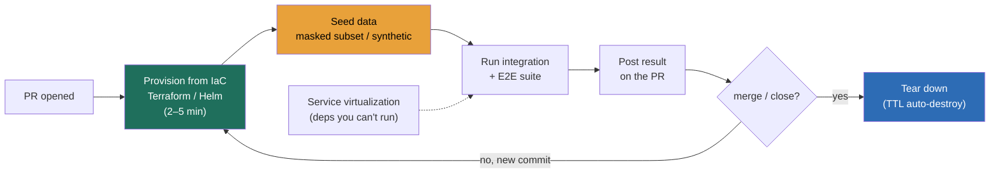

### Learning objectives
- Frame **test environments and test data as the hidden cost of a quality program**: the place every team quietly loses days, where a shared staging box becomes the bottleneck and a cloned production database becomes a compliance breach waiting to happen.
- Compare the three environment strategies, **shared staging vs ephemeral per-PR vs test-in-prod**, on the axes that matter to a Director: contention, drift, spin-up time, cost, and isolation, and pick the cheapest one that meets the risk.
- Treat **production-like fidelity as a dial with a price tag**, not a default: buy seconds-fresh, full-scale, real-dependency fidelity only where the risk of being wrong justifies it, and run cheap low-fidelity environments everywhere else.
- State the **test-data trade** crisply: cloning prod (high fidelity, a **PII landmine**), masking/anonymization (compliant, the workhorse), synthetic generation (zero PII, lower realism), and subsetting (cheap, partial coverage), and know which one to reach for and why.
- Name the **failure modes** a Director engineers around, staging contention and drift, real PII in a test box, brittle hand-built fixtures, over-investing in fidelity everywhere, and zero teardown driving cost and environment sprawl.

### Intuition first
Test environments are the **kitchen** where a restaurant tries new dishes before they hit the menu. A single shared test kitchen sounds efficient, until thirty cooks are fighting over the one stove, someone leaves a half-finished sauce on the burner, and nobody can tell whether their dish failed because of their recipe or because the last cook left the oven at the wrong temperature. That is shared staging: one contended room where everyone's experiments contaminate everyone else's, and "who broke the kitchen?" is a daily question with no good answer.

The fix is not a bigger shared kitchen, it is a **pop-up kitchen per recipe**: spin up a clean, fully-equipped station when a cook starts, tear it down when the dish is plated. And the ingredients matter as much as the room. You would never test a recipe with a customer's actual half-eaten meal, that is what real production data is, somebody's name, card number, and medical history. You cook with **ingredients that look and behave like the real thing but carry no one's identity**: masked or synthetic data. Get the room and the ingredients right and testing stops being the place work goes to wait.

### Deep explanation

**The probe is "where do you test this, and how do you get realistic data?", and the wrong answer is "we have a staging environment."** Quality at Director altitude is an operating model, and environments plus data are the part of that model where the cost hides in plain sight. The default everyone inherits, **one shared staging environment** every team deploys to, is the single most common and most expensive anti-pattern on this topic. It has three structural problems that compound: **contention** (teams queue to deploy and test, serializing work that should be parallel), **drift** (staging's config, data, and deployed versions diverge from production and from each other until "passes in staging" stops predicting "works in prod"), and **diffusion of blame** (when staging breaks, the failure could be any of N teams' changes, so nobody owns it and it stays broken). You **reject** "just add a second staging environment" because it halves contention for one cycle and then both drift independently, doubling the surface that lies to you. The fix is a different shape entirely.

**Ephemeral per-PR environments turn the shared bottleneck into N isolated, disposable ones.** When a pull request opens, a pipeline provisions a fresh environment from **infrastructure-as-code** (Terraform, Helm, a Crossplane or vcluster definition), seeds it with safe data, runs the integration and end-to-end suite against it, posts the result on the PR, and tears the environment down on merge or close. Each PR gets its own isolated namespace or stack, so there is **no contention** (your tests can't be poisoned by another team's deploy), **no drift** (the environment is rebuilt from the same IaC that defines prod, so it can't quietly diverge), and **clean ownership** (a failure in your PR's environment is your change, full stop). The numbers a Director carries: a Kubernetes-namespace preview environment spins up in **2–5 minutes** and costs **pennies to a few dollars per PR-hour**; a full multi-service stack with its own databases might take **10–20 minutes** and a few dollars. Against that, measure what a contended shared staging costs: if 8 teams each wait an average of **30 minutes a day** for a free staging slot, that is **4 engineer-hours a day, ~1,000 hours a year**, gone to queueing, plus the un-costed hours lost chasing failures that were someone else's mess. The ephemeral model trades a one-time platform investment for the recurring contention tax, and at any non-trivial team count that trade is lopsided.

**Production-like fidelity is a dial, and you buy each notch only where the risk justifies the cost.** Fidelity has several independent axes, **data realism** (synthetic rows vs a masked prod subset vs full prod scale), **dependency realism** (mocks vs test doubles vs real downstream services), **scale** (a few rows vs production volume for performance testing), and **freshness** (yesterday's snapshot vs continuously refreshed). Each notch up costs money, time, and operational complexity, so you set fidelity from the requirement, not from a reflex. A unit and component test wants **low fidelity and high speed**: in-memory or containerized dependencies, a handful of synthetic rows, milliseconds to run. A pre-release end-to-end test of a payments flow wants **high fidelity**: real sandbox integrations with the payment processor, a masked subset that exercises the edge cases, production-shaped schemas. A performance or capacity test wants **production-scale volume** but not production identity. You **reject** "make every environment prod-like" because full-fidelity everywhere multiplies cost and spin-up time across thousands of CI runs to buy realism that 90% of tests don't need, and you **reject** "mock everything" because all-mock environments pass tests that fail in production when a real dependency behaves differently than its stub. The Director sentence: *fidelity is bought per-environment against the risk that path carries, not provisioned uniformly.*

**Test data is the part that turns a convenience into a compliance breach, so the default of "clone prod" is the trap.** Cloning the production database into a test environment gives perfect realism, and copies every customer's name, email, card number, government ID, and health record into a box with weaker access controls, looser audit, and broader engineer access than production. Under **GDPR, CCPA, HIPAA, or PCI-DSS**, that copy is regulated personal data the moment it lands, a test environment full of real PII is in scope for the same controls and breach-notification duties as production, and regulators have levied **seven- and eight-figure fines** for exactly this. So the work is getting realistic-enough data that carries no real identity. The four techniques, in order of how often a Director reaches for them:

- **Masking / anonymization** is the workhorse: take a production extract and **irreversibly transform the PII** (deterministic hashing so joins still work, format-preserving encryption so a card number stays a valid-looking 16 digits, faked-but-consistent names) while keeping the data's shape, distributions, and referential integrity. You get prod-like realism with no real person behind it. The cost is building and maintaining the masking rules (every new PII column needs a rule, and a missed column is a leak).
- **Synthetic generation** produces data from scratch against the schema and business rules, so there is **zero PII risk by construction** and you can generate any volume and any edge case on demand. The cost is realism: synthetic data rarely captures the weird real-world distributions and corner cases that break production, so it is excellent for volume and functional tests, weaker for "does this behave like real traffic?"
- **Subsetting** takes a **referentially-consistent slice** of production (say 1% of customers and all their related rows) rather than the whole 5 TB, so environments are cheap and fast to seed. It is almost always combined with masking, subset *then* mask. The cost is coverage: a 1% slice may miss the rare data shapes that cause the bug.
- **Cloning prod with real PII** is the technique you name in order to **reject** it for any environment with weaker controls than production: the fidelity is unbeatable and the compliance and breach risk is unacceptable, so it is reserved (if used at all) for a tightly-controlled, audited, production-equivalent environment, never a developer's per-PR box.

**Environment-as-code and a data lifecycle are what make all of this repeatable instead of artisanal.** Two operational disciplines hold the model together. **Environment-as-code** means every environment, including the ephemeral ones, is defined in version-controlled IaC and provisioned by automation, so it is reproducible, drift-free, and torn down by the same pipeline that built it, **no teardown is the silent cost killer** (orphaned preview environments and forgotten databases are how a cloud bill quietly grows five figures and a security surface sprawls). A TTL on every ephemeral environment (auto-destroy after 24–72 hours or on PR close) is non-negotiable. **Data lifecycle** means seeding is automated and versioned (the masked subset is a built artifact, refreshed on a schedule so it doesn't go stale against schema changes), and **service virtualization** covers the dependencies you genuinely can't run, a third-party payment gateway, a partner's mainframe, a rate-limited external API, by replaying recorded request/response pairs or simulating the contract, so the environment is realistic without depending on someone else's uptime. Virtualization is the honest middle between a brittle mock and an unavailable real service.

Go deeper — masking techniques and referential integrity (IC depth, optional)

The hard part of masking is keeping the data *useful* after you strip identity. Techniques, roughly in order of fidelity preserved:

- **Deterministic / consistent masking.** Hash or tokenize a value through a stable function so the same input always maps to the same output. This preserves **joins and referential integrity**: `customer_id` 12345 masks to the same token in the orders table and the payments table, so a join still returns the right rows. Use a keyed hash (HMAC) with the key held outside the test environment so the mapping isn't reversible by someone with the masked data.
- **Format-preserving encryption (FPE).** Encrypt a value into the same format and length, a 16-digit card number stays 16 digits and passes a Luhn check, a phone number stays a phone number, so downstream validation and parsing still work. NIST FF1/FF3 are the standard algorithms.
- **Substitution / shuffling.** Replace names, addresses, emails from a faked-but-realistic pool, or shuffle a column's values among rows so the distribution survives but no row carries its real value. Cheap, but shuffling can break correlations across columns.
- **Generalization / suppression.** Replace a precise value with a range or category (exact age → age band, full ZIP → ZIP3), the basis of **k-anonymity** (every record is indistinguishable from at least k−1 others on quasi-identifiers). Useful when even masked precise values risk re-identification.
- **Differential privacy for synthetic generation.** When generating synthetic data from a real distribution, add calibrated noise so no individual record can be inferred from the output, the formal guarantee behind "this synthetic set leaks nothing about any real person."

The trap is **partial masking**: mask the obvious `name` and `email` columns, miss the free-text `notes` field that contains a customer's phone number, and you've shipped PII into a test box while believing you didn't. A masking pipeline needs **PII discovery** (automated scanning/classification of every column and free-text field) and a default-deny posture: a new column is treated as sensitive until proven otherwise.

### Diagram: the ephemeral per-PR environment lifecycle

### Worked example: replacing one contended staging with per-PR environments for a 60-engineer org
A platform group runs **8 product teams, ~60 engineers**, all sharing **one staging environment** seeded from a nightly **full clone of the production database** (it carries real customer PII). The pain is concrete: an average of **35 minutes a day per team waiting** for a staging deploy slot, weekly "who broke staging?" fire drills that eat hours, and a quietly mounting compliance exposure that the security team has flagged twice.

- **Environments.** Move integration and end-to-end testing to **ephemeral per-PR environments** provisioned from the existing Helm/Terraform definitions. Each PR gets an isolated Kubernetes namespace plus its own ephemeral databases, **~4 minutes to spin up, ~$2 of compute per PR-hour**, with a **48-hour TTL** so nothing orphans. Staging is demoted to a single thin **pre-prod soak environment** for the final release candidate, not a daily battleground.
- **Contention removed.** The 8 teams × 35 min/day of queueing, **~4.7 engineer-hours/day, ~1,100 hours/year**, drops to near zero because PRs no longer share an environment. At a loaded ~$120/hour that is **~$130k/year** of engineering time recovered, against a per-PR compute spend in the low thousands per month and a one-time platform build.
- **PII risk eliminated.** The nightly full clone of real customer data is **deleted**. Per-PR environments seed from a **masked 2% subset**, subset first for cost (a few GB instead of 5 TB, seeds in under a minute), then mask every PII column (deterministic tokenization so joins hold, FPE on card numbers). Result: **zero real PII** in any test environment, the box drops out of PCI/GDPR scope, and the security flags close. **Rejected: keep cloning prod but lock down staging access**, because tightened access controls don't remove the data, the breach surface and regulatory scope remain as long as real PII sits in the box.
- **Fidelity, bought where it matters.** Most PR environments run the masked subset and **virtualized third-party gateways** (the payment processor's sandbox is rate-limited and flaky, so record/replay its contract). The one place we **buy full fidelity** is the nightly performance test, which runs against a **production-scale synthetic dataset** (real volume, zero identity) to catch regressions the 2% subset would hide.

The number a Director brings out of this is not "we adopted preview environments", it is *"~1,100 contention-hours a year gone, real PII out of every test box and out of compliance scope, and full fidelity spent only on the one performance path that needs it."*

### Trade-offs table: environment and data strategies
| Decision | Shared staging | Ephemeral per-PR | Test-in-prod (canary/flags) |
|---|---|---|---|
| **Contention** | high (everyone queues) | none (isolated per PR) | none (it *is* prod) |
| **Drift / fidelity** | drifts from prod over time | rebuilt from IaC, no drift | perfect, it is prod |
| **Spin-up / cost** | always-on, "free" but shared | 2–20 min, pennies–$ per PR-hour | ~zero infra; risk is the cost |
| **Isolation / blast radius** | low, one break blocks all | high, failure stays in the PR | low, real users exposed |
| **Use when…** | legacy default; demote to a thin RC soak | the daily integration/E2E default | final verification of what can't be faked pre-prod |

| Data technique | Prod clone (real PII) | Masking / anonymization | Synthetic generation | Subsetting |
|---|---|---|---|---|
| **Fidelity** | perfect | high (shape preserved) | medium (misses edge cases) | partial (a slice) |
| **Compliance risk** | severe (PII in test box) | low (no real identity) | none (no real data) | inherits source's (mask it) |
| **Cost / effort** | cheap to copy, costly to govern | rule upkeep per PII column | generator + schema upkeep | cheap, fast to seed |
| **Use when…** | never in a weaker-controlled box | the default for prod-like tests | volume / edge / zero-PII tests | cheap, fast envs (then mask) |

The Director move is matching **the environment's isolation/drift needs and the data's compliance posture** to the risk the path carries, and never letting real PII sit in a box with weaker controls than production.

### What interviewers probe here
- **"Where do you test this, and how do you get realistic test data?"**, *Strong signal:* ephemeral per-PR environments provisioned from IaC and torn down on a TTL, seeded with a masked production subset or synthetic data so there's zero real PII, with fidelity bought per-path against risk. *Red flag:* "we have a staging environment" (one shared, contended, drifting box) or "we clone prod into the test environment" (real PII into a weaker-controlled box, a compliance breach).
- **"Shared staging is the bottleneck and keeps breaking. What do you do?"**, *Strong:* names the structural causes (contention, drift, diffuse ownership), moves integration/E2E to isolated per-PR environments rebuilt from the same IaC as prod, quantifies the contention removed in engineer-hours, and demotes staging to a thin release-candidate soak. *Red flag:* "add a second staging" (both drift, doubling the lie) or "schedule deploy slots" (formalizes the queue instead of removing it).
- **"How prod-like do your test environments need to be, and what does that cost?"**, *Strong:* treats fidelity as a priced dial across data/dependency/scale/freshness axes, buys high fidelity only on the high-risk paths (payments, the perf test), runs cheap low-fidelity everywhere else, and quantifies the cost of uniform fidelity. *Red flag:* "everything is prod-like" (cost and spin-up multiplied for realism most tests don't need) or "everything is mocked" (tests pass that fail in prod).
- **"You can't run a critical downstream dependency in test. Now what?"**, *Strong:* service virtualization (record/replay or contract simulation) for the third party you can't run, so the environment is realistic without depending on someone else's uptime, plus a contract test against the real sandbox on a cadence to catch drift. *Red flag:* either a brittle hand-built mock that silently diverges, or blocking all testing on the real dependency's availability.

The through-line at Director altitude: environments and data are a **priced risk decision**, isolation and fidelity bought where the path's risk needs it, real PII kept out of every weaker-controlled box, and the contention tax removed. Delegate the build with a stated prior: *"I'd have the platform team benchmark ephemeral namespaces (vcluster) vs full per-PR stacks on our spin-up time and cost, and the data team stand up a subset-then-mask pipeline with PII discovery; my prior is namespace-level previews plus a masked 2% subset, because that kills both the contention and the PII exposure at the lowest spend, and we reserve full-fidelity for the one perf path."*

### Common mistakes / misconceptions
- **One shared staging as the system of record for "it works."** Contention serializes teams, drift breaks the prediction, and diffuse ownership keeps it broken; the fix is isolated per-PR environments rebuilt from IaC, not a second shared box.
- **Cloning production with real PII into a test environment.** The moment it lands it's regulated personal data in a box with weaker controls, in scope for GDPR/HIPAA/PCI and breach duties; subset and mask (or generate synthetic) instead, the realism isn't worth the breach.
- **Brittle hand-built fixtures and mocks.** Artisanal test data and hand-coded stubs drift from reality and rot; version the seed as a built artifact, use service virtualization with record/replay, and contract-test the real dependency on a cadence.
- **Over-investing in prod-fidelity everywhere.** Full fidelity multiplied across thousands of CI runs buys realism 90% of tests don't need; buy each fidelity notch per-path against risk, and keep most environments cheap and fast.
- **No teardown.** Ephemeral environments without a TTL orphan into a five-figure cloud bill and a sprawling security surface; auto-destroy on PR close or after 24–72 hours, environment-as-code so cleanup is the same pipeline that built it.

### Practice questions

**Q1.** Your CI is blocked because 9 teams share one staging environment and someone is always mid-deploy. Walk through your fix and quantify the win.
> *Model:* The root causes are contention, drift, and diffuse ownership, not a sizing problem, so a bigger or second staging just relocates them. I'd move integration and end-to-end testing to **ephemeral per-PR environments** provisioned from the same Terraform/Helm that defines prod (so no drift) into isolated namespaces (so no contention, and a failure is unambiguously that PR's change). Spin-up ~3–5 min, ~$1–3 per PR-hour, with a 48-hour TTL so nothing orphans. Quantify: 9 teams × ~30 min/day of queueing is ~4.5 engineer-hours/day, ~1,000+ hours/year, recovered at near-zero marginal infra cost. Staging survives only as a thin release-candidate soak, not the daily battleground.

**Q2.** A team proposes nightly-cloning the production database into developer test environments "so the data is realistic." What's your response?
> *Model:* I'd stop it. The moment a prod clone lands in a test box it's regulated personal data, customer names, emails, card numbers, health records, in an environment with weaker access controls, looser audit, and broader engineer access than prod. That puts the box in scope for GDPR/CCPA/HIPAA/PCI and full breach-notification duties; regulators have fined exactly this into seven and eight figures. The realism is real but the technique is wrong. Instead: **subset then mask**, take a referentially-consistent ~1–2% slice (cheap, seeds in under a minute) and irreversibly mask every PII column, deterministic tokenization so joins still work, format-preserving encryption so a card stays a valid-looking 16 digits. We keep prod-like shape with zero real identity, and the box drops out of compliance scope. For volume tests we generate synthetic data at production scale instead.

**Q3.** How do you decide how production-like each test environment should be, when full fidelity is expensive?
> *Model:* Fidelity is a dial across several axes, data realism, dependency realism, scale, and freshness, and each notch costs money, time, and spin-up latency, so I buy it per-path against the risk that path carries, never uniformly. Unit and component tests run low-fidelity and fast: in-memory or containerized deps, a few synthetic rows, milliseconds. A payments end-to-end test runs high-fidelity: the processor's real sandbox, a masked subset hitting the edge cases. A performance test runs at production-scale volume but zero identity (synthetic). I explicitly reject "make everything prod-like" (cost and spin-up multiplied across thousands of CI runs for realism most tests don't need) and "mock everything" (green tests that fail in prod when a real dependency misbehaves). The number I'd carry: full fidelity is reserved for the handful of high-risk paths, cheap low-fidelity covers the rest.

**Q4.** A critical downstream service, a partner's payment gateway, can't be run in your test environments. How do you test the flows that depend on it?
> *Model:* Service virtualization. I'd record real request/response pairs from the gateway's sandbox and replay them (or simulate its published contract) so per-PR environments get realistic gateway behavior, success, decline, timeout, retry, without depending on the partner's uptime or hitting their rate limits. That keeps the environment realistic and self-contained. The risk is the virtual service drifting from the real one, so I'd run a contract test against the real sandbox on a cadence (say nightly) to catch breaking changes early. I reject both alternatives: a hand-built mock rots and silently diverges, and blocking all testing on the live partner makes my pipeline hostage to someone else's availability and quotas.

### Key takeaways
- **Shared staging is the hidden tax:** contention serializes teams, drift breaks the "passes in staging → works in prod" prediction, and diffuse ownership keeps it broken; the answer is **ephemeral per-PR environments** rebuilt from the same IaC as prod, isolated, and torn down on a TTL.
- **Real PII in a test box is a compliance breach, not a convenience:** a prod clone is regulated data in a weaker-controlled environment; **subset then mask** (or generate synthetic) so tests are realistic and PII-safe, and the box leaves compliance scope.
- **Fidelity is a priced dial, not a default:** buy data/dependency/scale/freshness fidelity per-path against risk, full fidelity on the few high-risk paths (payments, perf), cheap low-fidelity everywhere else; reject both "all prod-like" and "all mocked."
- **Service virtualization covers what you can't run:** record/replay or contract-simulate third-party dependencies so environments are realistic without hostage to a partner's uptime, and contract-test the real one on a cadence to catch drift.
- **Environment-as-code with a TTL is non-negotiable:** no teardown means orphaned environments, a five-figure bill, and security sprawl; version the seed as a built artifact and let the same pipeline that provisions also destroy.

> **Spaced-repetition recap:** Test environments are the **kitchen** and data is the **ingredients**. A single shared staging is the contended kitchen, contention, drift, "who broke it?", so move to **ephemeral per-PR environments** spun from IaC and torn down on a TTL (one-time platform cost beats ~1,000 contention-hours/year). Never cook with real meals: cloning prod PII into a weaker-controlled box is a GDPR/HIPAA/PCI breach, so **subset then mask** (deterministic tokens, format-preserving encryption) or generate **synthetic** for zero-PII volume tests. **Fidelity is a priced dial**, buy it per-path against risk, not uniformly; **service-virtualize** the dependencies you can't run; and put a TTL on everything so nothing orphans.

---

*End of Lesson 12.3. Environments and data are a priced risk decision: isolate and tear down, keep real PII out of every weaker-controlled box, and buy prod-like fidelity only where the risk needs it.*
