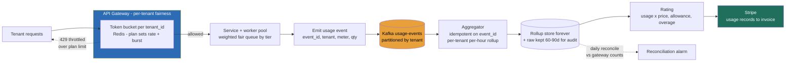

### Learning objectives
- Contain the **noisy-neighbor problem** in a pooled system: name the **power-law load share** (top 1% of tenants drive ~half the traffic) that makes it inevitable, and defend the fleet with **per-tenant, per-plan rate limits and quotas** (token-bucket keyed by tenant), **fair scheduling**, and a **quarantine** lever, without throttling a growing customer.
- Design a **billing-grade usage-metering pipeline** (emit, stream, aggregate/rollup, rate) held to billing's own discipline: **idempotent, no double-count, no drop, reconciled**, because a metering error is a revenue or compliance incident.
- Choose among **seat-based, usage-based, tiered, and hybrid billing**, wire rating, proration, overage, and free tiers into **Stripe**, and decide **soft-warn vs hard-block** at the limit.
- Tie **QoS tiers** (gold/silver/bronze priority and reserved capacity) and the whole machine back to **unit economics**: per-tenant COGS versus price, and why **flat infinite usage** destroys margin.

### Intuition first
A multi-tenant SaaS platform is an **apartment building**, not a row of separate houses.

In separate houses (a **siloed**, one-stack-per-customer deployment) every family has its own wiring and water tank, so nobody affects anybody else, but the landlord pays to build a whole house per family, ruinously expensive at scale. So real platforms pool tenants into one building: shared plumbing, electrical, elevators (**shared compute, storage, and network**). That pooling is the entire reason the economics work.

But a shared building has a shared-building problem. One tenant runs an industrial car wash and floods the basement for everyone; one plugs in a crypto rig, trips the breaker, and the whole floor goes dark. That is the **noisy neighbor**, one tenant's runaway consumption degrading everyone else's service. The landlord's answer is not to abandon pooling, it is to install the fixtures that make sharing safe and fair: a **breaker per unit** so one overload cannot black out the floor (**per-tenant rate limits and quotas**), a **meter per unit** so you know who used what (**usage metering**), a bill that is **base rent plus metered utilities** (**seat subscription plus usage-based billing**), and, for units that pay for it, **reserved parking and priority repairs** (**QoS tiers**).

Underneath it all is the landlord's ledger: rent has to cover what each unit costs to run (**per-tenant COGS versus price**). Offer one flat all-inclusive rent with unlimited utilities and your heaviest tenant runs the car wash day and night on your dime and becomes the unit that loses you money. Every hard part of this lesson, fairness, metering, billing, tiers, is a fixture in that building, installed so pooling stays both safe and profitable.

### Deep explanation

#### 1. Pooled tenancy and the noisy-neighbor problem

Multi-tenancy sits on a spectrum. **Siloed** gives each tenant a dedicated stack (strongest isolation, worst economics, caps at a few hundred tenants). **Pooled** runs all tenants through shared services and a shared datastore (best economics, scales to tens of thousands of tenants, but they now contend for the same finite resources). Most SaaS is pooled with a few siloed whales, and the pooled majority is where fairness has to be engineered in.

The reason it is not optional: **tenant load follows a power law, not a normal distribution.** In a typical B2B platform the top 1% of tenants drive **40 to 60% of total request volume**, the top 10% drive **80 to 90%**, and a single enterprise tenant can be **100 to 1,000x the median** (median does 10 requests/second, a whale bursts to 2,000 to 5,000). So "average load per tenant" hides the whole risk: capacity is set by a handful of giants, and any one of them, through a bad deploy, a runaway batch, or a retry storm, can consume the shared pool and **starve every other tenant at once**.

The defenses form a layered posture, cheapest to strongest: **per-tenant rate limits and quotas** (the breaker per unit, capping requests/second, concurrent jobs, storage GB, seats), **fair scheduling** so no tenant monopolizes the workers even while under its own limit, and **isolation/quarantine** that moves a confirmed runaway onto a separate pool so its blast radius stops at itself. Each is detailed next.

#### 2. Fairness: per-tenant rate limits, quotas, and fair scheduling

**Rate limiting is enforced per tenant with a token bucket, and the plan sets the numbers.** A key like `ratelimit:{tenant_id}` in Redis holds the tenant's token count, refilled at the plan's sustained rate, capped at its burst size. A request spends a token; an empty bucket returns **429 Too Many Requests** with `Retry-After`. Token bucket beats a fixed window because it absorbs short bursts while still bounding the sustained rate, and Redis makes the check a sub-millisecond atomic operation shared across every gateway node.

Concrete per-plan limits:

| Plan | Sustained rate | Burst | Concurrent jobs | Storage | Seats |
|---|---|---|---|---|---|
| Free | 10 req/s | 50 | 1 | 5 GB | 3 |
| Pro | 100 req/s | 500 | 10 | 100 GB | 25 |
| Enterprise | 1,000 req/s (negotiated) | 5,000 | 100 | 1 TB+ | unlimited |

The **limits are per-plan, not global, and adjustable**, and that is the whole trade. A single hard global cap is wrong in two directions: it throttles a growing Enterprise customer whose success is your revenue, and it is far too loose for a Free tenant you must protect the fleet from. So the limit is an attribute of the plan (overridable per tenant for a negotiated contract) living in config you can raise without a deploy. **The rejected alternative is no per-tenant limit at all**, which works until the first runaway job takes down everyone.

**Quotas** are the slower-moving cousins: storage GB, seat count, monthly job count, retained-data days. Where a rate limit protects instantaneous capacity, a quota protects a cumulative resource and usually maps directly to what the tenant pays for.

**Fair scheduling** handles the case where every tenant is under its own limit but the aggregate still overloads the shared worker pool. Weighted fair queuing dequeues work so no single tenant, even a large one within its rights, monopolizes the workers, with higher weight for paying tiers so they keep their latency under contention.

**Quarantine** is the last resort: when monitoring flags a tenant far beyond its baseline (a runaway retry loop, a compromised key), you move it to an isolated pool or hard-throttle it and alert. You would rather degrade one tenant deliberately than let it degrade all of them by accident.

Go deeper - distributed token-bucket mechanics and quota accounting (IC depth, optional)

- **Atomic Redis token bucket.** The refill-and-consume must be atomic across gateway nodes, so it runs as a Lua script (or `CL.THROTTLE` from RedisCell): read `tokens` and `last_refill_ts`, add `(now - last_refill_ts) * rate` tokens capped at `burst`, and if `tokens >= cost` decrement and allow, else reject and return the seconds until enough tokens accrue. One round trip, no read-modify-write race.
- **Sliding-window vs token bucket.** A fixed window (counter per minute) is cheaper but allows a 2x burst at the window boundary; a sliding-window-log is exact but stores a timestamp per request. Token bucket is the usual middle: bounded memory (two numbers per tenant) and smooth bursting.
- **Two-tier limits.** Enforce a coarse limit at the edge/gateway (cheap, protects the fleet) and a finer per-endpoint or per-resource limit deeper in (a `POST /export` that costs 100x a `GET` spends more tokens). Weight token cost by the operation's real backend cost, not a flat 1-per-request.
- **Quota accounting.** Rate limits are ephemeral (Redis, they reset); quotas are durable (a counter in the primary store, reconciled with the metering rollups) because "you have used 82 of 100 GB" must survive a cache flush and match the invoice.

#### 3. Usage metering: a billing-grade pipeline

Metering turns raw activity into the numbers you bill on, in four stages: **emit, stream, aggregate, rate.**

1. **Emit.** Every billable action publishes a usage event carrying `event_id` (a unique idempotency key), `tenant_id`, `meter` (api_calls, compute_seconds, storage_bytes, seats), `quantity`, `timestamp`, off the critical latency path (fire-and-forget into a local buffer flushed to the bus).
2. **Stream.** Events land in **Kafka** (a durable, ordered, replayable log), partitioned by `tenant_id` so a tenant's events stay ordered and a hot tenant's volume spreads across partitions. Replay is what makes the pipeline auditable: if the aggregator has a bug, you replay the log.
3. **Aggregate / rollup.** A stream consumer folds raw events into **per-tenant, per-meter, per-hour rollups**. This is where the volume collapses; rating reads rollups, not raw events.
4. **Rate.** Rating applies price to metered quantity (usage x unit price, minus allowance, plus overage) and hands the amount to billing.

The volume math is why this architecture, not a database counter, is required. An API platform doing **1 billion billable calls/day** averages ~11,600 events/second, so at ~200 bytes/event that is **~200 GB/day of raw metering data** (~73 TB/year), which you can neither bill off a live scan of nor keep forever cheaply. The rollup collapses it: 10,000 tenants x 24 hours x ~5 meters is **~1.2 million rollup rows/day**, a **~10,000x reduction**. That is the core trade: **raw per-event metering is maximally accurate and auditable but expensive and slow to query; pre-aggregation is cheap and fast but discards detail.** Keep both: **raw for a bounded audit window** (60 to 90 days, enough to resolve any dispute) and **rollups indefinitely**.

**Billing-grade accuracy is non-negotiable, the same discipline as billing-grade click counting: never double-count, never drop.** Because Kafka delivery is at-least-once, the same event occasionally arrives twice, so the aggregator must be **idempotent**, deduplicating on `event_id`. A dropped billable event is **lost revenue** you never notice; a double-counted one is an **overcharge** that becomes a chargeback and, for regulated customers, a compliance and trust problem. The **tolerance is tight** (well under **0.1% error**), proven by **reconciliation**: a daily job compares the rollups against an independent source (the gateway's own request counts, the object store's byte totals) and alarms on drift. A pipeline without reconciliation is one you trust blind, which is how a silent 3% undercount runs for a quarter.

#### 4. Billing models, rating, and enforcement

Four models, each aligning price to a different value axis:

- **Seat-based (per-user subscription).** Price = seats x price/seat/month. Simple, predictable, and decoupled from infrastructure cost. The risk: 20 seats hammering the API cost far more than 20 quiet seats, so seat pricing alone can invert margin. Best where value tracks headcount (collaboration tools).
- **Usage-based / consumption.** Price = metered usage x unit price ($0.50 per 1,000 calls, per compute-hour, per GB). Revenue tracks cost (protects margin) and small tenants start cheap, but revenue is unpredictable and a surprise bill churns customers. Best where cost is usage-dominated (infrastructure and API platforms).
- **Tiered.** Named plans (Free / Pro / Enterprise), each bundling an allowance and limits, with **overage** priced per unit beyond it. The common shape: buyer predictability (the plan price) plus your margin protection (overage rate and hard limits).
- **Hybrid.** A base subscription **plus** metered usage above an allowance. Most mature SaaS lands here: predictable base revenue plus usage upside, with the metered component keeping heavy tenants profitable.

**Rating** maps usage-and-plan to amount owed: apply the allowance, price the overage, apply discounts, prorate. You do not build invoicing, tax, dunning, and payment rails yourself, you integrate a **billing provider (Stripe)**. The division of labor: **your metering pipeline is the system of record for usage** (billable quantity per tenant per meter), pushed to Stripe as usage records; **Stripe is the system of record for money** (price, invoice, proration on mid-cycle upgrades, failed-charge retries, tax). Building billing in-house is the rejected alternative for almost everyone: payments, cross-jurisdiction tax, dunning, and PCI scope are a multi-year product you buy, not build.

**Enforcement at the limit is a product decision: soft-warn versus hard-block.** At a plan limit you can degrade gracefully (serve, meter the overage, warn the account owner, let the invoice reflect it) or refuse (429 / 402). The trade is revenue-and-goodwill versus cost-and-abuse control. You **soft-warn on paid plans** where an overage is revenue you want, and **hard-block on free tiers** where the tenant has no billing relationship and an unbounded free tier is pure cost and an abuse magnet. A common pattern: soft limits that warn and meter, plus a hard ceiling well above them that blocks true runaways even on paid plans, so a compromised key cannot run up a $200,000 bill overnight.

#### 5. Per-tenant SLAs and QoS tiers

Tiers are how a shared system delivers differentiated service, and they are a monetization lever, not just an ops nicety. Gold/silver/bronze buy different **limits** (higher caps and quotas), **priority** (higher fair-queue weight, so gold keeps its latency under contention), **reserved capacity** (a pool or headroom held for gold so it never queues behind best-effort work), and **SLA and support** (gold 99.95%, bronze best-effort). You enforce it with **priority queues** for async work and **reserved-versus-shared pools** for capacity. The design tension is utilization versus guarantee: reserved capacity can sit idle while bronze is throttled, so you reserve only enough to meet the gold SLA at peak. The point an interviewer wants: **a tier is a promise you can actually enforce**, and something customers pay more for, so it belongs in the pricing conversation, not just the ops one.

#### 6. The Director lens: unit economics and metering-to-revenue integrity

This whole machine exists to protect **unit economics**: the per-tenant relationship between what a tenant **costs you to serve** (COGS: compute, storage, egress, support) and what they **pay**. In a pooled, power-law system your heaviest tenants are your largest revenue and your largest cost at once, so profitability depends entirely on whether price tracks cost. That makes the metering-and-limits infrastructure a financial system, not just a technical one:

- **Metering is your cost-of-goods and your top-line at once.** It lets you compute per-tenant gross margin and find the tenants you lose money on. A tenant whose COGS is $8,000/month on a $500/month flat plan is gross-margin-negative, and without per-tenant metering you cannot even see it.
- **Metering integrity is revenue integrity.** A metering bug is not a defect ticket, it is a **revenue or compliance incident**: undercounting forfeits money, overcounting overbills customers and, for regulated buyers, is a legal and trust liability. Hence the idempotent, reconciled treatment above.
- **QoS tiers are a monetization lever.** Differentiated limits, priority, and SLA are things customers pay to move up for, so the tiering that protects the fleet is also expansion revenue.

**The rejected design that names the whole lesson: flat, infinite usage.** An all-you-can-eat price with no metering, limits, or tiers feels customer-friendly and destroys margin: your heaviest tenants (100 to 1,000x the median) pay the same flat rate as the lightest, so they are your least profitable and can be deeply negative, and with no meter you cannot prove it, let alone fix it. Fairness and metering are what convert pooling from a margin trap into a business.

### Diagram: fairness at the gateway, then the metering-to-billing pipeline

```mermaid
flowchart LR
  Clients[Tenant requests] --> RL
  subgraph GW[API Gateway - per-tenant fairness]
    RL["Token bucket per tenant_id<br/>Redis - plan sets rate + burst"]
  end
  RL -. "429 throttled<br/>over plan limit" .-> Clients
  RL -->|allowed| SVC["Service + worker pool<br/>weighted fair queue by tier"]
  SVC --> EMIT["Emit usage event<br/>event_id, tenant, meter, qty"]
  EMIT --> K[("Kafka usage-events<br/>partitioned by tenant")]
  K --> AGG["Aggregator<br/>idempotent on event_id<br/>per-tenant per-hour rollup"]
  AGG --> ROLL[("Rollup store forever<br/>+ raw kept 60-90d for audit")]
  ROLL --> RATE["Rating<br/>usage x price, allowance, overage"]
  RATE --> STRIPE["Stripe<br/>usage records to invoice"]
  ROLL -. "daily reconcile<br/>vs gateway counts" .-> RECON[Reconciliation alarm]
  style GW fill:#2d6cb5,color:#fff
  style K fill:#e8a13a,color:#000
  style STRIPE fill:#1f6f5c,color:#fff
```

The left half is **fairness** (the token bucket that stops a noisy neighbor before it reaches the workers, plus tier-weighted queuing); the right half is **monetization** (the billing-grade pipeline from event to invoice, with the reconcile loop that keeps it honest).

### Worked example: a multi-tenant notifications API
A SaaS sells a notifications API (send email/SMS/push for tenant apps), pooled so all tenants share the send workers, queue, and datastore. Traffic is **1 billion sends/day**, load is a power law: the top 1% drive ~55% of volume and the biggest tenant bursts to 4,000 sends/second during a flash sale while the median does under 10.

- **Fairness first.** Each tenant gets a **token bucket in Redis keyed by `tenant_id`**, refilled at its plan rate (Free 10/s, Pro 100/s, Enterprise 1,000/s negotiated). When the flash-sale tenant floods, its own bucket throttles it and returns 429s to *its* excess traffic, so it cannot consume the shared pool and delay everyone else's notifications. **Weighted fair queuing** stops a large in-limit tenant from monopolizing the workers, and a leaked-key runaway sending 50x its baseline is **quarantined**. **Rejected:** a global send-rate cap, which would throttle the growing Enterprise tenant or let Free tenants swamp the fleet.
- **Metering, billing-grade.** Every accepted send emits a usage event (`event_id`, `tenant_id`, `meter=sends`, `quantity=1`) into **Kafka**, partitioned by tenant. The aggregator folds these into **per-tenant, per-hour rollups**, deduplicating on `event_id` so at-least-once redelivery never double-bills. Raw kept **90 days**, rollups forever, with a **daily reconciliation** against the workers' delivery counts that alarms above **0.1%** drift.
- **Billing.** **Tiered hybrid**: a monthly fee including an allowance (Pro includes 1M sends), then **usage overage** at $0.50 per 1,000 beyond it. Rating reads the rollups and pushes usage records to **Stripe**, which invoices, prorates upgrades, and handles dunning. Enforcement is **soft-warn on paid** (meter the overage, notify the owner) with a runaway ceiling, **hard-block on Free** past its allowance.
- **Unit economics closed.** Per-tenant metering lets Finance find a cheap-flat-plan tenant whose volume makes them margin-negative and move them to usage pricing at renewal. **Rejected:** a flat "unlimited sends" plan, under which the whale pays what a hobbyist pays and torches the margin, unobservably.

The signal is not "I added rate limiting." It is that **fairness is per-plan and enforced before the shared pool, metering is idempotent and reconciled to billing-grade accuracy, billing is tiered-hybrid so heavy tenants stay profitable, and the whole design is justified by per-tenant unit economics, with flat-infinite-usage named as the rejected trap.**

### Trade-offs table: the three core decisions
| Decision | Option A | Option B | **Use when** |
|---|---|---|---|
| **Enforcement at limit** | Hard-block (429/402 at the cap) | Soft-warn (serve, meter overage, notify) | **Hard-block** free tiers and true-runaway ceilings (no billing relationship, abuse control); **soft-warn** paid plans where overage is wanted revenue |
| **Metering storage** | Raw per-event (full detail, auditable) | Pre-aggregated rollups (cheap, fast) | **Raw** for a bounded audit/dispute window (60-90d) and reconciliation; **rollups** for indefinite retention, rating, and queries. Keep both. |
| **Billing model** | Seat-based (predictable, decoupled from cost) | Usage-based (tracks cost, protects margin) | **Seat** where value tracks headcount and cost is flat; **usage/hybrid** where cost is usage-dominated and whales must stay profitable |

### What interviewers probe here
- **"One tenant is hammering the platform and everyone else slows down. Fix it."** *Strong:* you name the **noisy-neighbor** failure and the **power-law** reason it is inevitable (top 1% drive ~half the load), and defend with **per-tenant token-bucket limits enforced before the shared pool**, **weighted fair queuing**, and a **quarantine** lever, limits **per-plan and adjustable** so you protect the fleet without throttling a growing customer. *Red flag:* a single global cap with no per-plan reasoning, or trusting tenants to self-limit.
- **"How do you meter usage accurately enough to bill on it?"** *Strong:* the **emit -> Kafka -> idempotent rollup -> rate** pipeline, **billing-grade accuracy** (dedupe on `event_id`, never drop, **reconcile** daily to <0.1%), undercount = lost revenue while overcount = an overbilling/compliance incident, **raw for a bounded window, rollups forever**. *Red flag:* "increment a counter in the database," unaware of double-count, drop, at-least-once delivery, or reconciliation.
- **"How would you price this, and what does that have to do with the architecture?"** *Strong:* you connect **billing model to unit economics**, choose **tiered/hybrid** so heavy tenants stay profitable, price **overage**, tie **QoS tiers** to monetization, and explicitly **reject flat infinite usage** because power-law whales become margin-negative and invisible. *Red flag:* a pricing model with no reference to per-tenant COGS, or an unlimited flat plan with no metering.
- **"How do gold customers get better service on a shared system?"** *Strong:* **priority queues, higher fair-queue weight, reserved capacity, higher limits/SLA**, with the utilization-versus-guarantee trade named. *Red flag:* promising an SLA with no mechanism to enforce differentiation.

The through-line at Director altitude: you own the **posture** that keeps a pooled platform both **fair** (no tenant can starve the fleet, per-plan) and **profitable** (billing-grade metering, pricing tracks cost, tiers monetize), name the **unit-economics** consequence of every knob, then delegate with a prior: "I'd have the platform team pick the token-bucket store and rollup engine; my prior is Redis buckets and a Kafka-plus-stream-aggregator with daily reconciliation, because a metering error is a revenue incident, pending their read on the drift we see."

### Common mistakes / misconceptions
- **Designing for average load, not the power law.** Sizing to the mean hides that the top 1% drive half the traffic and any one can starve the pool; design to the tail and cap per tenant.
- **A single global rate limit.** One cap is simultaneously too loose for whales (no fleet protection) and too tight for a growing customer (throttles success). Limits belong to the plan, per tenant, and must be adjustable.
- **Best-effort metering.** Treating usage events as logs (fire and forget, no dedupe, no reconciliation) means silent undercounts (lost revenue) or double-counts (overbilling, compliance exposure). Metering must be idempotent and reconciled, held to the billing bar.
- **Throwing away the audit trail.** Pre-aggregating everything and dropping raw events is cheap until a tenant disputes a charge and you cannot prove the number. Keep raw for a bounded window alongside rollups.
- **Flat infinite usage.** An unlimited flat plan with no metering feels generous and quietly makes your heaviest tenants margin-negative and invisible; price must track cost, which requires metering and tiers.

### Practice questions
**Q1.** A pooled multi-tenant API has no per-tenant limits. During a customer's product launch, their traffic spikes 50x and every other tenant's latency degrades. Diagnose and fix.
> *Model:* This is the **noisy-neighbor** failure: in a **power-law** load distribution one tenant's spike consumes the shared pool and starves everyone, and with no per-tenant cap nothing stops it. The fix is **per-tenant, per-plan rate limits** at the gateway with a **token bucket keyed by `tenant_id`** (Redis), so the launching tenant is throttled to its contracted rate and its 429s hit *its* excess traffic, not the fleet. Behind that, **weighted fair queuing** stops even an in-limit large tenant from monopolizing the workers, and a confirmed runaway gets **quarantined** onto an isolated pool. The limit is **per-plan and adjustable**, so a legitimately growing customer gets a raised plan (or Enterprise override) rather than punishment. I avoid a single **global cap**, too loose for whales and too tight for growth.

**Q2.** You are going to bill customers based on API usage. What does "billing-grade" metering require that ordinary logging does not?
> *Model:* Ordinary logging is best-effort; billing-grade metering cannot **drop** or **double-count**, because a dropped event is silent lost revenue and a double-counted one is an overcharge that becomes a chargeback and, for regulated customers, a compliance incident. So: every event carries a unique `event_id`; events flow through a durable, replayable log (**Kafka**); the aggregator is **idempotent**, deduplicating on `event_id` because at-least-once delivery guarantees occasional duplicates; and a **daily reconciliation** compares the rollups against an independent count (gateway request logs, storage byte totals) and alarms beyond a tight tolerance, well under 0.1%. I keep **raw for a bounded audit window** (60 to 90 days) to resolve disputes and **rollups indefinitely** for cheap rating. The mental model: metering is a financial system of record, not a log.

**Q3.** Finance says one of your biggest customers is losing the company money. How is that possible, and what would you change?
> *Model:* Load is a **power law** and this tenant is a whale consuming 100 to 1,000x the median while sitting on a **flat plan** whose price does not track cost, so their per-tenant **COGS exceeds their price** and they are gross-margin-negative. We can see it only because of **per-tenant metering**. The fix is to align **price to cost**: at renewal, move them to a **tiered/hybrid** model (base fee plus **usage overage** beyond an allowance) and use the metering data to show their actual consumption so the new price is defensible. This is why **flat infinite usage** is the rejected default: it makes your heaviest tenants your least profitable and hides it. QoS tiers help too, giving the whale a reason to pay more (reserved capacity, priority) rather than just costing more.

**Q4.** How do you give gold-tier customers a real latency and uptime guarantee on a platform where they share infrastructure with free-tier tenants?
> *Model:* A tier has to be a **promise I can enforce in the shared system**, not a marketing label. Gold gets higher **fair-queue weight** so its work is dequeued first under contention; **reserved capacity** (a pool or headroom held for gold) so it never queues behind free-tier work at peak; higher **limits and quotas**; and a differentiated **SLA** (gold 99.95%, bronze best-effort). The trade I name is **utilization versus guarantee**: reserved capacity can sit idle while lower tiers are throttled, so I reserve only enough to meet the gold SLA at peak and let everything else share the pool. And I frame it as a **monetization lever**: differentiated QoS is something customers pay to move up for, so the mechanism that protects the fleet also drives expansion revenue.

**Q5.** When a tenant hits its plan limit, do you block the request or serve it? Defend your answer.
> *Model:* It depends on the billing relationship, this is a **soft-warn versus hard-block** decision. On a **paid plan** an overage is usually **revenue I want**, so I **soft-warn**: serve, meter the overage, notify the account owner, and let the invoice reflect it, because blocking a paying customer mid-workload is worse than billing them for what they used. On a **free tier** the tenant has no billing relationship and an unbounded free tier is pure cost and an abuse magnet, so I **hard-block** past the allowance. Across both I keep a **hard ceiling well above the soft limit** so a leaked key or buggy loop cannot run up a catastrophic bill overnight. The rule: block where you cannot recover the cost or the risk is abuse, warn-and-meter where the overage is money you are happy to collect.

### Key takeaways
- Load in a pooled multi-tenant system follows a **power law** (top 1% of tenants drive ~half the traffic, a whale is 100 to 1,000x the median), so **noisy-neighbor** risk is structural. Defend with **per-tenant, per-plan token-bucket rate limits and quotas** (Redis, keyed by `tenant_id`) enforced before the shared pool, **weighted fair queuing**, and a **quarantine** lever. Limits are **per-plan and adjustable**, never a single global cap.
- Metering is a **billing-grade pipeline** (emit -> Kafka -> **idempotent** rollup -> rate), not logging: dedupe on `event_id`, never drop, **reconcile** daily to under 0.1%, because undercount is lost revenue and overcount is an overbilling/compliance incident.
- Keep **raw events for a bounded audit window** (60 to 90 days) and **rollups forever**: raw is accurate and auditable but expensive (~200 GB/day at 1B events), rollups are ~10,000x cheaper but lose detail.
- Choose **billing model by unit economics**: seat-based decouples revenue from cost (risky for heavy tenants), usage/hybrid tracks cost and keeps whales profitable; wire rating, overage, and proration into **Stripe** rather than building billing; **soft-warn on paid, hard-block on free** with a runaway ceiling.
- **QoS tiers** (priority queues, reserved capacity, higher limits/SLA) enforce differentiated service and are a **monetization lever**; the whole machine protects **per-tenant COGS-versus-price**, and **flat infinite usage** is the rejected trap that makes your heaviest tenants margin-negative and invisible.

> **Spaced-repetition recap:** A multi-tenant platform is an **apartment building**: pool tenants for economics, then install a **breaker per unit** (per-tenant, per-plan token-bucket rate limits + quotas in Redis, keyed by tenant, so one **noisy neighbor** cannot starve the fleet, because load is a **power law**: top 1% drive ~half), **fair queuing** so no one monopolizes the workers, and a **quarantine** for runaways. Meter with a **billing-grade** pipeline (emit -> Kafka -> **idempotent** rollup dedup on `event_id` -> rate), **reconcile** to <0.1% (undercount = lost revenue, overcount = compliance incident), keep **raw 60-90d + rollups forever**. Bill **tiered/hybrid** (base + usage overage) via **Stripe**, **soft-warn paid / hard-block free**, differentiate with **QoS tiers** (priority + reserved capacity) as a monetization lever. It all protects **per-tenant COGS vs price**, reject **flat infinite usage**, which makes your whales margin-negative and invisible.
