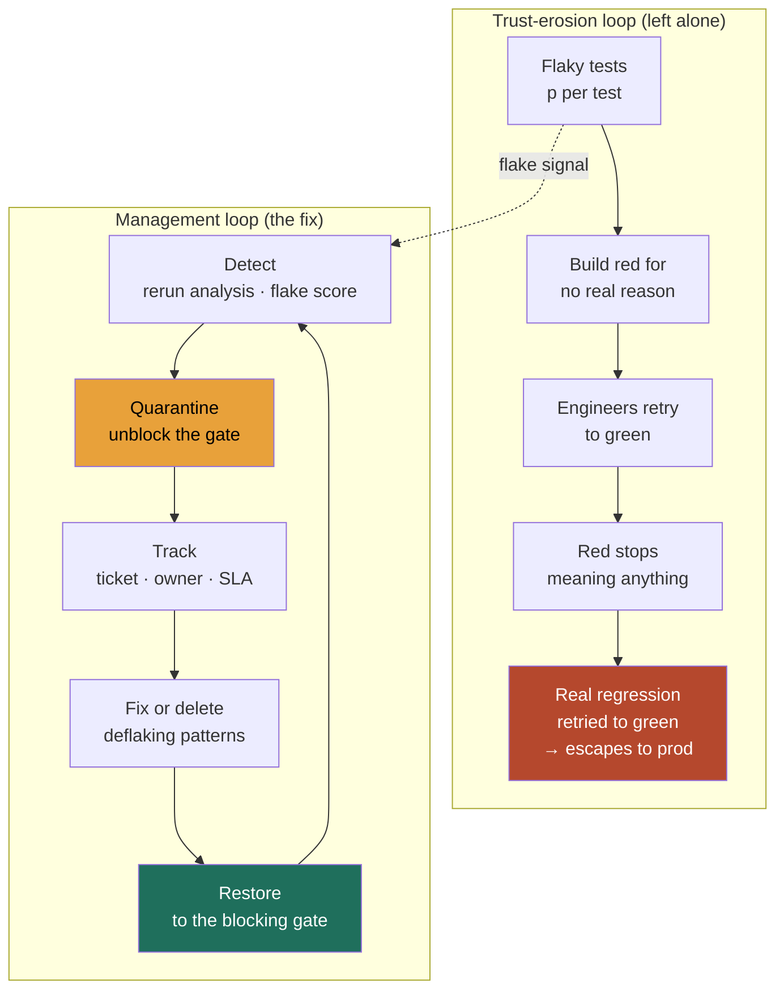

### Learning objectives
- State the **flake thesis** crisply: a per-test flake rate that looks tiny (0.5%) compounds over a large suite into a green-rate that destroys trust, and once engineers stop believing red, the whole test investment stops paying back.
- Do the **economics math at altitude**, P(suite green) ≈ (1−p)^N, so you can quantify the signal loss for a given suite size and per-test flake rate instead of treating flake as harmless noise.
- Name the **management system** a Director builds around flake, detect → quarantine → track → fix → restore, and the policy levers (retry budgets, ownership SLAs, test-health metrics) that keep it from rotting.
- Reason about the **retry trade-off**: retries buy a green pipeline today and hide the flake that will escape to production tomorrow, so they are bounded and alerted on, not a fix.
- Treat **test health as a tracked product metric** (pass rate, flake rate, p95 suite duration) with an owner and a target, the way you track DORA or SLOs, not as a thing engineers grumble about in standup.

### Intuition first
Flake is a **smoke alarm that goes off when you make toast**. The first time, you investigate, maybe there's a fire. By the tenth false alarm, you've learned the alarm lies, so you take the battery out, or you wave a towel at it without looking. Now the alarm is worse than no alarm, because it has trained everyone to ignore it, and the one night there *is* a real fire, the room full of people who've learned to tune it out sleeps right through. A flaky test does exactly this to a red CI build: it cries wolf often enough that engineers stop believing red, and the day a real regression turns the build red, it gets the same reflexive "just hit rerun" that the false alarms got.

The trap is that each individual false alarm feels harmless, "it's just one flaky test, rerun it." The damage isn't in any single alarm, it's in what a *steady drip* of false alarms does to the population of people watching them. That makes flake an **economics and trust problem at the scale of the whole suite**, not a debugging problem at the scale of one test. You manage it the way you'd manage alarm fatigue across a building, by measuring the false-alarm rate, isolating the alarms that lie, and making someone own getting them honest again, not by telling everyone to "pay closer attention."

### Deep explanation

**A flaky test is one that passes or fails non-deterministically against the same code, and the sources are a short, well-known list.** The code under test didn't change between the green run and the red run, only luck did. Four sources cover almost all of it. **Timing and async races**, the test asserts before an async operation finished, or two operations finish in an order the test assumed was fixed, this is the largest bucket in most suites. **Test interdependence through shared mutable state**, test A leaves a row in the DB, a key in the cache, or a global singleton mutated, and test B passes or fails depending on whether it ran after A, so the suite is order-dependent and parallelization makes it worse. **Network and external dependencies**, a test hits a real service, DNS, or a container that's occasionally slow or down, importing that system's reliability into your pass rate. **Non-determinism in time, IDs, and ordering**, `now()`, random UUIDs, unordered map/set iteration, or locale/timezone differences that pass on the author's machine and fail in CI. The Director point is that all four are **engineering-out-able with known patterns**, so persistent flake is a sign of a missing system, not of inherently hard tests.

**The economics is the whole argument, and it is one formula.** Take a per-test flake rate `p` (probability a given test flakes on a given run for no real reason) and a suite of `N` tests. If failures are roughly independent, the probability the *entire suite* comes back green on a clean codebase is **P(green) ≈ (1−p)^N**. This compounds brutally. At a per-test flake rate of just **p = 0.5%** over **N = 2,000 tests**, P(green) ≈ (0.995)^2000 ≈ **0.004%**, so essentially **every run goes red for no real reason**. Even a 200-test suite at the same rate is green only ~37% of the time. The numbers say something a Director must internalize: **a flake rate that sounds negligible per test is catastrophic per suite**, because you multiply it across thousands of tests on every single CI run. This is why "it's only 1% flaky" is not a defense, it's the diagnosis.

**The compounding doesn't just waste CI minutes, it triggers a trust-erosion feedback loop that ends in escaped bugs.** The chain is mechanical. Flake makes red the *default* outcome → engineers learn that red usually means nothing → the rational response is to **retry to green** rather than investigate → retrying becomes culture, so red is never investigated → the day a real regression goes red, it gets retried to green too (or rather, it gets retried until a flaky-but-passing run lets it through) → **the bug escapes to production**. The expensive failure isn't the wasted compute, it's that the suite has been converted from a signal into noise, and a noisy alarm protects nothing. You can put a number on the human cost too: if a 2,000-engineer org each loses 15 minutes a day to babysitting and rerunning flaky pipelines, that's ~500 engineer-hours a day, but the headline cost is the regression that ships because nobody believes red anymore.

**Detection turns flake from anecdote into a managed list.** You cannot manage what you don't measure, and flake hides because any single instance is dismissible. The mechanism is **rerun analysis**: when a test fails, automatically re-run it (or the suite) on the *same commit*, if it then passes with no code change, it is by definition flaky, and you record that. Aggregate this across runs to compute a **per-test flake score** (failures-without-code-change over total runs), and the tests that cross a threshold get flagged by a **flake bot / quarantine bot** that files or annotates them automatically. Google's CI, GitHub's, and tools like the Gradle/Develocity test-analytics, Buildkite Test Engine, and Datadog CI Test Visibility all implement this same loop. The output is a ranked, owned list of flaky tests with scores, which is the thing you actually manage.

**Quarantine isolates known-flaky tests so they stop blocking the pipeline, but the discipline is that quarantine is a hospital, not a graveyard.** A test that has crossed the flake threshold is moved out of the blocking gate: it still runs, its result is still recorded and visible, but its failure no longer turns the build red or blocks the merge. This instantly restores the suite's green-rate and lets real failures show through again. The trap, and the thing that separates a real system from a hack, is that **a quarantined test must be tracked and assigned, not buried**. Without an SLA, "quarantine" becomes a permanent dumping ground where coverage silently rots, you've just hidden the flake instead of fixing it, and the code path it covered is now untested. So quarantine carries a **ticket, an owner, and a deadline**: e.g. a flaky test must be fixed or deleted within 2 sprints, and the count of quarantined tests is itself a tracked, capped number (say, ceiling of 1% of the suite) so the graveyard can't grow without someone noticing.

**Retry budgets are the most dangerous lever, because retries work, and that's the problem.** Automatically retrying a failed test until it passes will turn almost any flaky suite green, which is exactly why it's a trap: **a retry hides flake rather than fixing it, and the same retry will hide a genuine intermittent failure on its way to production**. The Director stance is not "never retry", a single retry is a reasonable shock absorber, it's that retries are **bounded and instrumented**. Bound them (at most 1 retry per test, not "rerun the suite until green"), and treat the **retry rate as a first-class alarm**: if the fraction of runs that only passed *because* of a retry climbs past a threshold (say 2%), that's the flake rate leaking, and it pages the test-health owner. The number you watch is not "is the build green," it's "how much retrying did it take to get green," because that second number is the honest flake signal the first one is hiding.

**Ownership and SLAs are what make any of this stick, because flake is a classic tragedy of the commons.** Everyone is slowed by the flaky suite, but no single test failure is clearly anyone's job, so absent an explicit owner, nobody fixes it, and the suite degrades by default. The fix is organizational, not technical: every test maps to an **owning team** (via code ownership / CODEOWNERS on the test file), a flaky test auto-files a ticket to that owner, and there's a stated **SLA** (acknowledge in 2 days, fix or delete in 2 sprints). A central **test-platform / developer-experience team** owns the *system* (the detection, the quarantine mechanism, the dashboards, the policy), while the *individual tests* are owned by the product teams that wrote them. This split, platform owns the machine, teams own their tests, is the same paved-road operating model that works for CI, on-call, and security.

**Test health is a tracked metric with a target and an owner, the same as any SLO.** You make it visible or it rots. The dashboard a Director asks for has three numbers per suite: **pass rate** (clean-run green-rate, the headline of trust), **flake rate** (the measured `p`, ideally trending toward zero), and **p95 suite duration** (because a slow suite gets skipped, which is its own form of lost signal, a 40-minute suite that engineers route around protects nothing). You set targets, e.g. green-rate above 95% on main, flake rate under 0.1%, p95 under 10 minutes, and you review them like you review change-failure-rate and MTTR. When green-rate dips below target, that's a tracked regression with an owner, not a vibe. The deflaking patterns the teams apply are also a short list: **inject a deterministic clock and deterministic IDs** instead of `now()` and random UUIDs, **wait on conditions, not sleeps** (poll for the expected state with a timeout, never `sleep(2)` and hope), and **isolate state** so every test sets up and tears down its own fixtures and can run in any order or in parallel.

Go deeper — the flake economics, retry math, and deflaking patterns (IC depth, optional)

**The (1−p)^N table (per-test flake rate down the side, suite size across):**

| p (per-test) | N=200 | N=500 | N=2,000 | N=10,000 |
|---|---|---|---|---|
| 0.1% | 82% | 61% | 13% | 0.005% |
| 0.5% | 37% | 8% | 0.004% | ~0 |
| 1% | 13% | 0.7% | ~0 | ~0 |

The intuition: `(1−p)^N ≈ e^(−pN)` for small `p`, so what matters is the **product p·N**, the *expected number of flaky failures per run*. You want `p·N` well under 1 to have green be the common case. At N=2,000 that means `p` must be below ~0.05% (1 in 2,000), an order of magnitude tighter than the 0.5% that already felt small. This is the whole reason flake is a scale problem: the tolerable per-test rate shrinks as the suite grows.

**Retry math.** One retry converts a per-run flake probability `p` into a residual `p²` (both the original run and the retry must independently flake). At p=0.5%, one retry drops the effective per-test failure to 0.0025%, which makes the suite green again, and that's the seduction. But the same `p → p²` math applies to a *genuine* intermittent bug: a real failure that reproduces 50% of the time now escapes the gate 25% of the time instead of 50%, so retries are actively degrading your ability to catch real intermittent defects. The retry rate (fraction of runs that needed a retry to pass) ≈ `1 − (1−p)^N` on the first attempt, which is exactly the red-rate you were trying to hide, so monitoring retry rate recovers the flake signal that retrying suppressed.

**Deflaking patterns, concretely:**
- **Deterministic time:** inject a clock interface (`Clock.now()`), freeze it in tests; never call the wall clock. Kills timezone, DST, and "test ran at midnight" flakes.
- **Deterministic IDs/ordering:** seed the RNG, sort before asserting on collections, never assert on hash-map iteration order.
- **Condition waits, not sleeps:** poll for the awaited state with a bounded timeout and a clear failure message (`awaitUntil(() -> order.isShipped(), 5s)`), instead of `sleep(2)` which is simultaneously flaky (too short under load) and slow (too long normally).
- **State isolation:** transactional rollback or fresh schema/namespace per test; no shared singletons; design so tests can run in parallel and in random order (and actually randomize order in CI to surface hidden interdependence).
- **Hermetic dependencies:** replace real network calls with in-process fakes or pinned containers at a fixed version; the only "real" dependency in an integration test should be the one under test.

### Diagram: the trust-erosion loop and the management loop that breaks it

### Worked example: a 2,000-test suite at 0.5% flake, and how to get the signal back
A platform org runs a **2,000-test** integration suite on every merge to main. Per-test flake rate is **p = 0.5%**, which the team waved off as "basically nothing." The numbers say otherwise.

- **The signal is already gone.** P(clean green) ≈ (0.995)^2000 ≈ **0.004%**, so the build is red on essentially **every** merge for reasons that have nothing to do with the code. Expected flaky failures per run = p·N = **~10 tests**. The team has been living this as "CI is always red, just rerun," which is the trust-erosion loop in its terminal state, real failures are indistinguishable from the noise and get the same rerun reflex.
- **Detect.** Turn on **rerun analysis**: every red test re-runs once on the same commit, a pass-on-rerun is logged as flake, and a flake score accrues per test. Within a week the bot has a ranked list, ~the top **20 tests** account for most of the flakiness (a typical heavy-tail, flake concentrates).
- **Quarantine + cap.** Move those ~20 out of the blocking gate, they still run and report, but don't turn main red. That alone takes the suite from `p=0.5%` to roughly `p=0.05%` across the *remaining* 1,980 tests, so P(green) jumps to (0.9995)^1980 ≈ **~37%**. Quarantine the next tranche and target the residual `p`: getting it to **~0.02%** (p·N ≈ 0.4) yields P(green) ≈ **~67%**, a believable build again. We **cap quarantine at 1% of the suite (20 tests)** so it can't become a graveyard.
- **Bound retries + alert.** Allow **one** retry per test as a shock absorber, but instrument the **retry rate** and page the owner if it exceeds **2%**, so re-introduced flake surfaces instead of hiding.
- **Own + SLA.** Each quarantined test files a ticket to its CODEOWNERS team; SLA is **fix-or-delete within 2 sprints**. The DevEx team owns the dashboard (green-rate, flake rate, p95 duration) with a target of **green-rate ≥ 95%, flake rate ≤ 0.1%**.
- **Reject the tempting non-fixes.** *Rejected: just add a global "retry the whole suite until green"* — because it would make the build green at p=0.5% while guaranteeing real intermittent regressions sail through, converting the suite permanently into noise. *Rejected: delete all 2,000 and "write better tests later"* — because it throws away real coverage to dodge a management problem, the regression risk in the interim is unbounded.

The number a Director brings out of this isn't "we fixed some flaky tests," it's *"green-rate went from 0.004% to ~95%, flake is a capped, owned, tracked list with an SLA, and red means something again."*

### Trade-offs table: what to do with a flaky test
| Option | Signal preserved? | Effort | Risk | Use when… |
|---|---|---|---|---|
| **Retry to green** (unbounded) | No — destroys it | ~Zero | High: real intermittent failures escape | Never as a policy; one bounded retry only, with retry-rate alerting |
| **Quarantine + track** | Yes — gate stays honest | Low to set up, needs an SLA | Medium: coverage gap while quarantined; graveyard if untracked | The default first move at scale: restore green-rate now, fix on an SLA |
| **Hard-fail (block on every red)** | Yes — maximally | Zero policy, huge friction | Velocity collapses; team routes around CI | Tiny suite or near-zero flake, where the suite is already trustworthy |
| **Fix now (deflake)** | Yes — permanently | High per test | Low | High-value test on a critical path; or once quarantine SLA comes due |
| **Delete the test** | Lost coverage, honest about it | Low | Coverage gap is permanent | The test is low-value, redundant, or untestably non-deterministic — better an honest gap than a lying test |

The Director move is matching the action to the **test's value and the suite's trust level**: quarantine-and-track to stop the bleeding, then fix the high-value tests and delete the low-value ones, never retry-to-green as a standing policy.

### What interviewers probe here
- **"Your CI is flaky and the team is frustrated. What do you do?"** — *Strong signal:* quantifies the signal loss first ((1−p)^N → "at our scale a 0.5% flake rate means the build is red 99.99% of the time for no reason"), then names the *system*, detect via rerun analysis, quarantine-and-track the heavy-tail offenders, cap the quarantine, bound and alert on retries, assign ownership with an SLA, and put green-rate/flake-rate/p95 on a dashboard with a target. *Red flag:* "add retries" or "tell people to rerun until it's green", which hides the flake and trains the org to ignore red, the exact failure you're being asked to prevent.
- **"Why not just retry failed tests automatically? It makes the build green."** — *Strong:* names the trade-off precisely, one bounded retry is a reasonable shock absorber, but unbounded retry-to-green converts the suite from signal to noise and lets genuine intermittent regressions escape (the `p → p²` math degrades real-bug detection as much as it hides flake), so the discipline is to monitor retry *rate* as the honest flake signal. *Red flag:* treats retries as the solution, "green is green," with no awareness that a green achieved by retrying is a green that protects nothing.
- **"How do you keep this from coming back after you've cleaned it up?"** — *Strong:* makes test health a **tracked metric with an owner** (green-rate, flake rate, p95 duration, with targets reviewed like SLOs/DORA), caps quarantine size so the graveyard can't grow silently, and splits ownership, platform team owns the machine, product teams own their tests on an SLA. *Red flag:* a one-time cleanup with no metric, no owner, and no policy, so it rots straight back to where it started.
- **"How do you decide between fixing, quarantining, and deleting a flaky test?"** — *Strong:* by the test's *value* and the path it covers, quarantine to stop the bleeding immediately, fix the high-value tests on critical paths, and honestly *delete* the redundant or untestable ones rather than keep a test that lies. *Red flag:* treats every test as sacred (so the suite never gets healthier) or deletes indiscriminately (so coverage silently collapses).

The through-line at Director altitude: flake is an **economics-and-trust problem managed as a system**, you quantify the signal loss, build the detect→quarantine→track→fix→restore loop, bound retries, and track test health like an SLO. And you delegate the build with a prior: "I'd have the DevEx team stand up rerun-based flake detection on top of our existing CI rather than buy a separate platform first; my prior is build, because the detection loop is a few hundred lines against our test runner and the value is in the *policy and ownership*, not the tooling, we can buy a managed test-analytics product later if the data volume justifies it."

### Common mistakes / misconceptions
- **Retrying to green.** It makes the build pass while hiding the flake, and the same retry that hides flake will let a real intermittent regression escape to production. Green achieved by retrying protects nothing.
- **Dismissing flake as harmless noise.** "It's only 0.5%" ignores that (1−p)^N compounds the tiny per-test rate into a near-zero suite green-rate; the per-test number sounds fine precisely because you forgot to multiply it across the suite.
- **No ownership, so nobody fixes it.** Flake is a tragedy of the commons, everyone is slowed, no one is assigned, so without explicit per-test ownership and an SLA the suite degrades by default.
- **Unbounded retries.** "Rerun the suite until it's green" is retrying-to-green with extra cost; bound retries to one, and alert on the retry *rate* as the real flake signal.
- **Sleeps instead of deterministic waits.** `sleep(2)` is both flaky (too short under CI load) and slow (too long normally); wait on the *condition* with a timeout, and inject a deterministic clock and IDs instead of `now()` and random UUIDs.

### Practice questions

**Q1.** Your team says the test suite is "only about 1% flaky, no big deal." The suite has 1,500 tests. Quantify why it's a big deal.
> *Model:* P(clean green) ≈ (1−0.01)^1500 = (0.99)^1500 ≈ **0.0003%**, so the build is essentially *never* green on a clean codebase, expected flaky failures per run = p·N ≈ **15 tests**. That's not "1% flaky," that's "red on every single run for reasons unrelated to the code," which means engineers can no longer tell a real failure from noise and will rerun-to-green by reflex. The per-test rate sounds harmless because it isn't multiplied across the suite; the tolerable rate at N=1,500 to make green common (p·N < 1) is below ~0.07%, fifteen times tighter than where they are. The fix isn't "tolerate it," it's detect → quarantine the heavy-tail → bound retries → own with an SLA, and put green-rate on a tracked dashboard.

**Q2.** A staff engineer proposes turning on automatic retry (up to 5×) on every test to "get CI green." What's your call?
> *Model:* No as a standing policy, yes to *one* bounded retry with alerting. Five retries will make almost any flaky suite green (it drives effective per-test failure to ~p⁵), which is exactly why it's dangerous: the same retries hide genuine intermittent regressions, a real bug that reproduces 50% of the time now escapes the gate ~3% of the time instead of 50%. Retrying converts the suite from signal to noise. Instead: allow one retry as a shock absorber, and **instrument the retry rate**, if more than ~2% of runs needed a retry to pass, that's the flake leaking and it pages the test-health owner. The honest signal is "how much retrying did it take," not "is it green." Pair that with rerun-based detection and quarantine so the underlying flake actually gets fixed, not just suppressed.

**Q3.** You've quarantined 30 flaky tests and the build is green again. The team wants to move on. Why is that the wrong place to stop, and what do you put in place?
> *Model:* Quarantine restored the *green-rate* but it created a *coverage gap*, those 30 code paths are now effectively untested, and "out of the blocking gate" silently becomes "permanently ignored" unless there's a forcing function. Quarantine is a hospital, not a graveyard. I put in: a **ticket per quarantined test routed to its CODEOWNERS team**, an **SLA** (fix-or-delete within 2 sprints), a **cap** on quarantine size (e.g. ≤1% of the suite) that itself alarms when exceeded, and a **dashboard** tracking quarantine count, flake rate, and green-rate with targets reviewed like SLOs. Fix the high-value tests, delete the redundant ones, an honest coverage gap beats a test that lies. The DevEx team owns the machine; product teams own their tests.

**Q4.** Walk me through how you'd diagnose and fix the single most common class of flaky test.
> *Model:* The largest bucket is **timing/async races**, the test asserts before an async operation completed, or assumes an ordering that isn't guaranteed. Diagnosis: it fails more under CI load (slower machines widen the race) and passes locally, and rerun analysis flags it as flaky. The wrong fix is `sleep(2)` before the assert, that's both flaky (too short when CI is loaded) and slow (too long normally), and it just moves the race. The right fix is to **wait on the condition, not the clock**: poll for the expected state with a bounded timeout and a clear failure message (`awaitUntil(() -> job.isDone(), 5s)`). For the related non-determinism bucket, **inject a deterministic clock and seeded IDs** instead of `now()` and random UUIDs, and **sort before asserting** on collections. Then I'd randomize test order in CI to surface any hidden state interdependence, because order-dependent tests are the next bucket down.

### Key takeaways
- **Flake is an economics-and-trust problem, not a debugging problem:** P(suite green) ≈ (1−p)^N, so a per-test rate that sounds tiny (0.5%) compounds to a near-zero green-rate over thousands of tests; the lever is the *product* p·N, keep it well under 1.
- **Trust is the real casualty:** once red usually means nothing, engineers retry-to-green by reflex and a genuine regression gets retried right past the gate into production, the suite has become noise.
- **Manage it as a system, detect → quarantine → track → fix → restore:** rerun analysis to detect and score, quarantine the heavy-tail to restore the green-rate, but quarantine is a hospital not a graveyard, ticket + owner + SLA + a cap.
- **Retries are the dangerous lever:** one bounded retry is a shock absorber, unbounded retry-to-green hides flake *and* lets real intermittent failures escape; monitor the **retry rate** as the honest flake signal.
- **Treat test health as a tracked metric** (green-rate, flake rate, p95 duration) with targets and an owner, split ownership so the platform team owns the machine and product teams own their tests, and deflake with deterministic clocks/IDs, condition-waits, and state isolation.

> **Spaced-repetition recap:** Flake is a **smoke alarm that lies until everyone ignores it**. The math is one formula, **P(green) ≈ (1−p)^N** (keep p·N < 1), so 0.5% flake over 2,000 tests means the build is red ~99.99% of the time for no real reason, which trains the org to **retry-to-green** until a real regression escapes. Manage it as a **system**: detect (rerun analysis + flake score), **quarantine-and-track** the heavy-tail (hospital not graveyard: ticket + owner + SLA + cap), **bound retries to one and alert on retry rate** (the honest flake signal), and track **green-rate / flake-rate / p95 duration** like an SLO. Platform owns the machine, teams own their tests; deflake with deterministic time/IDs, condition-waits not sleeps, and state isolation. Never retry-to-green as policy.

---

*End of Lesson 12.4. Flake is an economics problem you manage as a system — quantify the signal loss with (1−p)^N, then detect, quarantine, bound retries, and own test health like an SLO so red means something again.*
