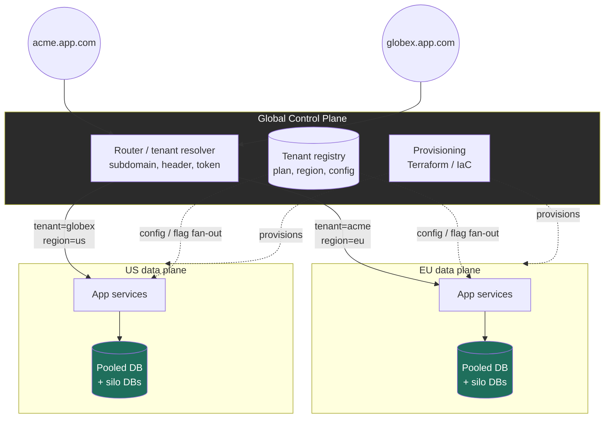

### Learning objectives
- Separate the **control plane** (the system that manages tenants: registry, provisioning, config, plans, routing, lifecycle) from the **data plane** (where tenant traffic actually runs), and say why the split buys blast-radius isolation, independent scaling, and one control plane governing many data planes.
- Trace how a request resolves to a tenant (subdomain, header, or token claim) and how that tenant identity propagates through every hop as context for routing, authorization, data scoping, and metering.
- Walk the full **tenant lifecycle**: provisioning (self-serve seconds vs white-glove days), configuration and customization (feature flags, custom domains, SSO), tenant-aware deploys and canary, data residency, pool-to-silo tier migration, and offboarding.
- Own the deal-gating trade-offs: self-serve vs white-glove onboarding, a single global data plane vs per-region planes for residency, and data-driven config vs per-tenant code forks.
- Design a **right-to-erasure** path that deletes a tenant across every system, including caches, search, analytics, and backups, within a stated SLA such as 30 days.

### Intuition first
A multi-tenant SaaS is a **property-management company**, not a single building.

The **property-management HQ** is the control plane. HQ never houses a tenant. It keeps the master ledger of who rents what (the **tenant registry**), signs leases and hands over keys (**provisioning**), sets each unit's options (**configuration**), decides which building a new tenant goes into (**routing**), and processes move-outs (**offboarding**). The **buildings** are the data planes, where tenants actually live and generate traffic. One HQ runs many buildings, and it can run them in different cities because some tenants are legally required to live in a specific jurisdiction (**per-region data planes** for data residency).

Everything else in this lesson is a property-management task. Signing a lease is instant for a standard unit (self-serve, pooled) or takes days for a custom penthouse with its own entrance and security desk (white-glove, dedicated silo). You configure a unit by flipping switches HQ already installed (**feature flags**), not by knocking down walls per tenant (**code forks**). You give a large tenant their own street address and buzzer (**custom domain and SSO**), and renovate one low-risk building before touching the flagship (**canary by tenant**). And when a tenant moves out you cannot just change the lock, you must clear their belongings from the unit, the storage locker, and the off-site archive, and scrub them from the ledger inside the window the law gives you (**deletion across all systems and backups**, to a GDPR SLA). The discipline is that HQ is small and the buildings are many: the control plane is the leverage that lets a handful of people operate thousands of tenants.

### Deep explanation

#### 1. The control-plane / data-plane split, and tenant context

The architectural move that makes multi-tenant SaaS operable at scale is separating the **control plane** from the **data plane**.

- The **control plane** is the SaaS operating system. It owns the **tenant registry** (who exists, their plan, region, config, isolation model), **provisioning** (turning a signup into running infrastructure), **configuration** (settings and feature flags), **routing** (resolving a request to the right tenant and data plane), **billing/metering**, and the **lifecycle** state machine (trial, active, suspended, deleting, deleted). It is low-QPS, metadata-heavy, read-mostly.
- The **data plane** is where tenant workloads run: the app services, databases, queues, and caches serving real user traffic. It is high-QPS and latency-sensitive.

Why separate them, stated as trade-offs a reviewer will test:

1. **Blast radius.** A bad control-plane deploy must not take down live tenant traffic, and a one-region data-plane outage must not stop you onboarding, billing, or configuring every other tenant. Keeping the plane that *changes tenants* apart from the plane that *serves tenants* contains each failure to its own surface.
2. **Independent scaling.** The control plane handles tens of ops per second; the data plane handles tens or hundreds of thousands of user requests per second. Coupling them forces a read-mostly metadata service to scale to data-plane volume for no reason.
3. **One control plane, many data planes.** The payoff: a single global control plane governs N data planes, one per region for residency, one per large silo tenant, or a pool plane plus a fleet of silo planes. The registry and provisioning logic live once; the data planes multiply. That is what lets a small team run thousands of tenants across regions.

The rejected alternative is a **fused design** where each service carries its own tenant table and provisioning logic. It ships faster on day one, then every tenant-scoped decision (routing, plan gating, deletion) drifts across services, with no single place that answers "does this tenant exist and where does it live." Past a handful of tenants the fused model becomes the thing you cannot operate.

**Tenant context propagation** is the connective tissue. Every request must resolve to a tenant before anything else happens, by one of three signals:

- **Subdomain / custom domain**: `acme.app.com` or `app.acme.com` maps to `tenant=acme`. Best for browser apps and white-labeling.
- **Request header**: `X-Tenant-ID: acme`. Common for internal and API traffic.
- **Token claim**: a JWT/OIDC token carrying `org_id` / `tenant_id`. Best because the tenant is cryptographically bound to the caller's identity and cannot be spoofed by editing a header.

Once resolved, that tenant identity becomes **context that flows through every hop**: it selects the data plane (routing), scopes authorization and data access (row filter, schema, or database selection), tags rate limits and metering, and rides in tracing as baggage so every log line carries the tenant. The failure mode to design against is a hop that **drops** the tenant context and falls back to a default or, worse, another tenant's scope, the root cause of the most severe multi-tenant bug: cross-tenant data leakage.

Go deeper - resolving and carrying tenant context safely (IC depth, optional)

- **Resolve once, at the edge**, in a gateway or middleware, and reject the request if no tenant resolves rather than defaulting. A missing tenant is a 400, never "assume tenant 1."
- **Bind, do not trust.** Prefer the token claim as the source of truth. If a header and a token disagree, the token wins and you log the mismatch as a potential attack. Never let a client-supplied header alone select a tenant for a data read.
- **Carry it as immutable context**, a request-scoped object or tracing baggage, not a mutable thread-local that a library can clobber. Every DB call takes the tenant from context and applies it (schema search-path, `WHERE tenant_id = ?`, or connection selection); make the data layer *require* a tenant so a query without one fails loudly in tests.
- **Assert at the boundary of the data store.** Row-level security (e.g. Postgres RLS) that keys on the session's tenant is a strong backstop, because it enforces isolation even if an application query forgets the filter.

#### 2. Provisioning and onboarding: self-serve seconds vs white-glove days

Onboarding is where the control plane earns its keep, and it splits into two modes whose latencies differ by orders of magnitude.

**Self-serve signup** is fully automated. A user signs up, and the control plane creates a registry row, allocates the tenant into **pooled** (shared) infrastructure, seeds default config, and points the router at the pool. Nothing new is stood up, so onboarding completes in **seconds**, letting a marketing funnel convert to a live workspace with no human in the loop. It is the right default for SMB and product-led growth. The trade is that a pooled tenant gets shared infrastructure and only the pool's isolation guarantees, fine for most and unacceptable for some.

**Enterprise white-glove** onboarding may provision a **dedicated silo**: its own database or stack, wired for SSO, a custom domain, and a specific region. That is real infrastructure, so it is driven by **infrastructure-as-code** (Terraform, Pulumi, CloudFormation) run by the control plane's provisioning workflow, and it takes **hours to days**, gated as much by contract, security review, DNS, and TLS issuance as by the `terraform apply` itself. The trade is instant-but-shared versus slow-but-isolated: pooled onboarding is instant and cheap but offers less isolation and no per-tenant residency; siloed onboarding is deal-gating for regulated buyers but multiplies the infrastructure the team operates.

The Director framing: **provisioning is automation, not a runbook.** If standing up a silo is a human clicking through consoles, you cannot onboard enterprises at volume and every tenant becomes a snowflake. The control plane treats "create tenant" as a declarative, idempotent, resumable workflow (a durable workflow engine helps, since provisioning has many steps that each can fail and must retry without double-creating resources). Onboarding is the first thing an enterprise buyer experiences: days is acceptable, flaky is not.

#### 3. Configuration and customization: data-driven, not code-forked

Tenants want to differ: different features per plan, their own branding, their own domain, their own login. The governing rule is that **all of this is data the control plane owns, not code that forks per tenant.**

- **Plan-based features and settings** live in the registry, enforced by **feature flags** evaluated per tenant. Upgrading a plan flips flags in the control plane and takes effect in **milliseconds** with no deploy; a config change fans out to the fleet through the flag service, not a release. Branding (logo, colors, email templates) is likewise per-tenant data rendered by one codebase. The rejected alternative, gating with `if (tenant == "acme")` in code, makes every plan change a deploy, and the branches accrete until no one can reason about what a tenant sees.
- **Custom domains** let a tenant serve at `app.acme.com`. The tenant points a **CNAME** at your platform, and the control plane must **issue and renew a TLS certificate** for that hostname automatically (ACME / Let's Encrypt), because at thousands of domains, each cert renewing every ~90 days, manual issuance is impossible. The domain and cert are tenant metadata; the data plane just terminates TLS with whatever cert the control plane provisioned.
- **SSO / SAML / OIDC per enterprise tenant**: each tenant federates to its own identity provider (Okta, Entra ID, Google). The per-tenant IdP config lives in the registry; the auth flow selects it by tenant.

The trade to name: **deep customization sells enterprise deals but forks complexity.** Every bespoke behavior a tenant negotiates is a permanent maintenance cost. Absorb customization as **configuration data** (flags, settings, templates, per-tenant IdP records) so one codebase serves all tenants, and resist per-tenant code branches, the fastest way to a system you can no longer deploy uniformly. When a truly bespoke integration is unavoidable, isolate it behind an interface so the fork is contained, not smeared through the core.

#### 4. Tenant-aware deploys and migrations

In a single-tenant app you deploy to everyone at once. In multi-tenant SaaS, the tenant becomes a **deployment and rollout dimension**, and that is a feature, not a nuisance.

- **Canary by tenant.** Release a risky change to a ring of **low-risk tenants first** (internal, then a few percent of free-tier), watch error rates and latency, then widen: 1% → 10% → 100%. Safer than a pure infrastructure canary because you pick *which* tenants absorb the risk and keep flagship accounts on the stable path until the change is proven.
- **Per-tenant maintenance windows.** Enterprise contracts often specify when you may take a tenant's stack down. A siloed tenant migrates in its own window; pooled tenants share one. The control plane knows each tenant's window and schedules against it.
- **Fleet-scale schema migrations** are the hard part. One `ALTER TABLE` in a single-tenant app becomes **thousands of migrations** in a siloed model or a single large migration on a shared table in the pooled model, and you cannot run them all at once. The pattern is a **migration orchestrator** that rolls the change tenant by tenant, tracks each tenant's **schema version** in the registry (so the run is observable and **resumable**, a failure at tenant 4,000 of 10,000 does not restart from zero), and uses **expand/contract** (add the column, backfill, dual-write, cut reads over, drop the old) so the app tolerates both shapes during the roll.

The rejected alternative, a synchronous big-bang migration, either needs a full-fleet maintenance window you cannot get from enterprise customers or risks a single failure stranding the fleet in a mixed state with no clean rollback. Tenant-scoped, versioned, resumable migration is the only thing that scales.

#### 5. Data residency and sovereignty

Some tenants are legally or contractually required to keep their data in a jurisdiction: an EU tenant under GDPR, a public-sector tenant, a bank, a healthcare provider. This is where "one control plane, many data planes" pays off directly.

You run a **global control plane** and **per-region data planes** (for example `us-east`, `eu-west`, `ap-south`, three or four planes), each a full stack living entirely within its region. A tenant's registry record pins its **home region**, and the router sends every request for that tenant to that region's data plane, so an EU tenant's data is created, stored, and processed only in the EU plane. The control plane holds only **metadata** (name, plan, region pointer, config), not the regulated bulk.

The trade is explicit: **per-region data planes close deals and satisfy regulators, but multiply operations.** Every region is another stack to deploy, monitor, patch, and migrate, and the planes must stay version-consistent so a feature does not silently exist in one region and not another. A single global data plane is far cheaper and correct when no tenant has a residency requirement, but it is a hard blocker on any regulated or sovereignty-sensitive buyer, so for a SaaS selling into Europe or the public sector, per-region planes are deal-gating. The Director move is to build routing and registry **region-aware from the start** (a home-region field on every tenant) even if you launch with one region, so the second region is a deployment, not a re-architecture.

#### 6. Tier migration and offboarding

**Tier migration (pool → silo) without downtime.** A tenant that starts pooled and grows, or upgrades to a plan promising dedicated isolation or its own region, must graduate from the shared pool to a dedicated silo while staying live. The zero-downtime pattern mirrors any online data migration: provision the silo, **backfill** the tenant's data from the pool, **dual-write** to both during the copy, verify, then **cut over** routing (flip the registry's data-plane pointer for that tenant) and stop writing to the pool. The trade against a simple "export, take downtime, import" is engineering complexity for the promise of no maintenance window, which is exactly what a high-value upgrading tenant is paying for.

**Offboarding** is a lifecycle stage the control plane must own end to end, in three escalating steps:

1. **Suspension**: the tenant is disabled (non-payment, trial expiry, security hold) but data is retained. Routing returns a suspended state; nothing is destroyed. Reversible.
2. **Data export**: the tenant takes their records in a portable format, both a courtesy and, under GDPR data portability, sometimes a right.
3. **Deletion / right-to-erasure**: the hard one. GDPR requires deleting a tenant's personal data **"without undue delay,"** which teams operationalize as a concrete SLA, commonly **within 30 days** of a verified request. The difficulty is that the data is not in one place: it spans the primary database, caches, search index, analytics warehouse, event logs, object store, and hardest of all, **backups**. A deletion that clears the primary DB but leaves the tenant in search, analytics, and last night's backup has not satisfied erasure.

The design that meets the SLA drives deletion from the control plane as a **tracked, auditable workflow** that fans out a delete command to every system holding tenant data and records completion per system, so "is tenant X fully deleted" is provable. Online systems (DB, cache, search, analytics) are cleared within days. **Backups**, which you cannot surgically edit, get one of two accepted strategies: **honor the deletion on restore** (a suppression list the restore applies, plus bounded retention that ages the tenant out), or **crypto-shredding**, encrypt each tenant's data with a per-tenant key and delete the key, rendering the tenant's bytes in every backup permanently unreadable in one operation. Crypto-shredding is the cleaner answer for backup-heavy systems and worth naming.

The trade against soft-delete-only (flip a `deleted` flag, keep the data) is real: soft delete is trivial and reversible but does **not** satisfy erasure, so you need both, a reversible suspension/soft-delete step for operational undo, and a hard, cross-system, backup-inclusive purge on the erasure path, tracked to an SLA. The **control plane is the leverage point** here: its two most deal-gating capabilities are enterprise onboarding (white-glove provisioning, SSO, custom domain, residency) and a credible offboarding-and-deletion story.

### Diagram: global control plane governing per-region data planes

```mermaid
flowchart TB
  subgraph CP[Global Control Plane]
    REG[(Tenant registry<br/>plan, region, config)]
    PROV[Provisioning<br/>Terraform / IaC]
    ROUTE[Router / tenant resolver<br/>subdomain, header, token]
  end
  C1((acme.app.com)) --> ROUTE
  C2((globex.app.com)) --> ROUTE
  ROUTE -->|"tenant=acme<br/>region=eu"| SVCEU
  ROUTE -->|"tenant=globex<br/>region=us"| SVCUS
  subgraph DPEU[EU data plane]
    SVCEU[App services] --> DBEU[(Pooled DB<br/>+ silo DBs)]
  end
  subgraph DPUS[US data plane]
    SVCUS[App services] --> DBUS[(Pooled DB<br/>+ silo DBs)]
  end
  PROV -.provisions.-> DPEU
  PROV -.provisions.-> DPUS
  REG -.config / flag fan-out.-> SVCEU
  REG -.config / flag fan-out.-> SVCUS
  style CP fill:#2b2b2b,color:#fff
  style DBEU fill:#1f6f5c,color:#fff
  style DBUS fill:#1f6f5c,color:#fff
```

The control plane holds the registry, provisioning, and routing once; the data planes multiply per region. A request resolves to a tenant, the registry says which region that tenant lives in, and the router pins traffic there, so the EU tenant's data never leaves the EU plane.

### Worked example: onboarding an SMB and a regulated EU enterprise, then deleting a tenant

A B2B SaaS onboards two very different tenants through one control plane, then later deletes a tenant to a GDPR SLA.

- **Self-serve SMB tenant (`globex`).** A founder signs up. The control plane writes a registry row (`plan=team`, `region=us`, `isolation=pooled`), allocates `globex` into the shared US pool, seeds default config, and points `globex.app.com` at the pool. Elapsed: **seconds**, no human. Its feature set is gated by **feature flags** in the control plane, so a later upgrade to `business` is a flag flip, not a deploy.
- **Regulated EU enterprise (`acme`).** Sales closes a contract requiring EU residency, SSO, and a branded domain. This is **white-glove**: the provisioning workflow runs **Terraform** to stand up a **dedicated silo in the EU data plane**, registers `acme`'s **SAML IdP**, takes the custom domain `app.acme.com` (tenant CNAME), and **auto-issues a TLS cert** via ACME. Elapsed: a couple of **days**, gated by security review, DNS, and cert issuance. Thereafter every `acme` request resolves via the token's `org_id`, routes to the **EU plane**, and its data never leaves the EU. We accept the cost of a second region and a silo because residency plus SSO plus a custom domain is what made the deal closable, none of it available on the pooled path.
- **A schema change ships tenant-aware.** A new column rolls out with **expand/contract** (add nullable, backfill, dual-write, cut reads over, drop old), canaried to **internal tenants then 1% then 10%** before `acme` is touched, migration state tracked per tenant so it is resumable.
- **`globex` requests deletion.** A verified erasure request starts the control plane's **deletion workflow**, SLA **30 days**. It fans out delete commands to the primary DB, Redis cache, search index, and analytics warehouse (cleared within days, recorded per system), and for **backups** relies on **crypto-shredding**: `globex`'s data was encrypted under a per-tenant key, so deleting that key renders it unreadable in every backup at once. The registry moves `globex` through `suspended → deleting → deleted`, and the audit trail proves each system completed.

The signal is not "we support multi-tenancy." It is that **the control plane resolved each tenant to a plane, onboarded a pooled tenant in seconds and a regulated silo tenant in days, kept customization as data, canaried schema changes by tenant, pinned EU data to an EU plane, and could delete a tenant across every system and its backups to a 30-day SLA.**

### Trade-offs table

| Decision | Lower-cost / simpler option | Higher-cost / more capable option | Use the higher-cost option when |
|---|---|---|---|
| **Provisioning mode** | Self-serve, automated, pooled, seconds | White-glove, dedicated silo via IaC, days | tenant is regulated or large and needs isolation, SSO, a custom domain, or contractual residency |
| **Data-plane topology** | Single global data plane | Per-region data planes + one global control plane | any tenant has a data-residency or sovereignty requirement (EU, public sector, regulated industry) |
| **Per-tenant behavior** | Data-driven config + feature flags | Per-tenant code fork / branch | almost never; only a genuinely bespoke integration, and even then isolate the fork behind an interface |
| **Deletion** | Soft delete (flag, reversible) | Hard, cross-system purge + backup crypto-shred, tracked to SLA | a verified right-to-erasure request; you keep soft delete for operational undo but must also hard-purge |
| **Migration** | Big-bang across all tenants | Tenant-scoped, versioned, resumable roll with canary | more than a handful of tenants, or any tenant with a contractual maintenance window |

### What interviewers probe here
- **"How is this SaaS organized to manage tenants?"** *Strong:* you separate the **control plane** (registry, provisioning, config, routing, lifecycle) from the **data plane** (serves traffic), and explain the split by blast radius, independent scaling, and one control plane governing many data planes. *Red flag:* tenant tables and provisioning logic smeared across every service, no single owner of tenant identity.
- **"A customer in Germany requires their data stay in the EU."** *Strong:* a **global control plane** with **per-region data planes**, the tenant's home region pinned in the registry, the router forcing all traffic to that region, and you name the operational-multiplication cost. *Red flag:* "spin up a separate copy of everything" with no routing story, or treating residency as a toggle on a single global datastore.
- **"Ship a risky schema change to 5,000 tenant databases."** *Strong:* **canary by tenant**, **expand/contract** so the app tolerates both shapes, a **resumable** orchestrator tracking each tenant's schema version, per-tenant maintenance windows. *Red flag:* a single synchronous migration across the fleet, no notion that the tenant is a rollout dimension.
- **"A tenant invokes their right to be forgotten."** *Strong:* a control-plane-driven **deletion workflow** fanning out to DB, cache, search, analytics, logs, and object store, an explicit **backup** strategy (crypto-shredding or honor-on-restore), a stated **SLA (e.g. 30 days)**, and an audit trail proving completion. *Red flag:* "we set a deleted flag," unaware that soft delete does not satisfy erasure and backups are the hard part.
- **"Serve both instant signup and enterprise onboarding."** *Strong:* self-serve pooled onboarding in **seconds** and white-glove IaC-provisioned silo onboarding in **days**, both control-plane-driven, instant-shared vs slow-isolated trade named. *Red flag:* one path only, or manual console-clicking to stand up enterprise tenants.

### Common mistakes / misconceptions
- **No control-plane / data-plane split.** Tenant identity and provisioning scattered across services means no single source of truth for "does this tenant exist and where does it live," and every tenant-scoped decision drifts. It becomes unoperable before it becomes unscalable.
- **Dropping tenant context on a hop.** A request that loses its tenant identity and falls back to a default or another tenant's scope is the root cause of cross-tenant leakage, the most severe multi-tenant bug. Resolve once at the edge, bind to the token, require a tenant at the data layer.
- **Per-tenant code forks for customization.** `if (tenant == "acme")` branches and per-tenant builds turn every plan change into a deploy and accrete until the system cannot ship uniformly. Absorb customization as **data**, not code.
- **Big-bang fleet migrations.** One synchronous migration across thousands of tenant schemas needs a full-fleet window you cannot get and risks a mixed state. Roll tenant by tenant, versioned and resumable, with expand/contract.
- **Soft delete mistaken for erasure.** A `deleted` flag leaves the tenant in caches, search, analytics, and every backup. Right-to-erasure requires a cross-system hard purge with a backup strategy and an SLA.

### Practice questions

**Q1.** Why separate a control plane from a data plane in multi-tenant SaaS, and what does each own?
> *Model:* The **control plane** is the SaaS operating system: it owns the tenant registry (existence, plan, region, config, isolation model), provisioning, per-tenant config and feature flags, routing/tenant-resolution, billing, and the lifecycle state machine. The **data plane** serves tenant traffic (app services, datastores, caches). Separating them buys three things: **blast-radius isolation** (a bad provisioning deploy or a one-region data-plane outage does not take down the other plane), **independent scaling** (a low-QPS metadata control plane versus a high-QPS data plane), and the big one, **one control plane governing many data planes**, so a single registry and provisioning system runs N per-region or per-silo data planes. That last property lets a small team operate thousands of tenants. The rejected alternative, fusing tenant logic into every service, ships faster then drifts, with no single source of truth for tenant identity, and becomes unoperable.

**Q2.** A prospective enterprise customer in the EU requires that their data never leave Europe. How do you design for it, and what does it cost you?
> *Model:* Run a **global control plane** plus **per-region data planes** (for example us-east, eu-west, ap-south), each a full stack whose datastores live entirely within that region. The tenant's **home region** is pinned in the registry, and the **router** sends every request for that tenant to the EU data plane, so their customer data is created, stored, and processed only in the EU. The control plane holds only metadata (name, plan, region pointer, config), not the regulated bulk. The cost I would state explicitly is **operational multiplication**: every region is another stack to deploy, patch, monitor, and migrate, and the planes must stay version-consistent. I reject a single global data plane because it hard-blocks this deal; for a SaaS selling into Europe or the public sector, per-region planes are deal-gating. I would also make the system region-aware from the first region (a home-region field on every tenant), so adding the EU plane is a deployment, not a re-architecture.

**Q3.** You must roll a breaking schema change across 5,000 tenant databases with zero fleet-wide downtime. Walk through it.
> *Model:* Treat the tenant as a **rollout dimension**. Use **expand/contract** so the app tolerates both shapes during the roll: add the new column nullable, backfill, dual-write, cut reads over, then drop the old column in a later release. Drive it with a **migration orchestrator** in the control plane that rolls **tenant by tenant**, tracks each tenant's **schema version** in the registry so the run is observable and **resumable** (a failure at tenant 4,000 restarts there, not at zero), and respects each enterprise silo's **maintenance window**. **Canary by tenant**: internal tenants first, then a 1 percent ring of low-risk tenants, watch error and latency, then 10 percent, then the rest, keeping flagship accounts on the stable path until proven. I reject a big-bang synchronous migration because it needs a full-fleet window I cannot get and risks stranding the fleet in a mixed state with no clean rollback.

**Q4.** A tenant exercises their GDPR right to erasure. What does your system actually do, and why is a `deleted` flag not enough?
> *Model:* A soft-delete flag leaves the tenant's data in the primary DB, caches, search index, analytics warehouse, logs, object store, and every backup, so it does **not** satisfy erasure. I drive deletion from the control plane as a **tracked, auditable workflow** with an explicit **SLA** (commonly **30 days**, operationalizing GDPR's "without undue delay"), fanning out delete commands to every online system and recording completion per system so "is this tenant fully erased" is provable. For **backups**, which you cannot surgically edit, I use **crypto-shredding** (encrypt each tenant's data under a per-tenant key, then delete the key to make it unreadable across all backups at once) or honor deletion on restore via a suppression list plus bounded retention. I keep a reversible suspension / soft-delete step for operational undo, but the erasure path is a hard, cross-system, backup-inclusive purge tracked to the SLA.

**Q5.** How do you support both instant self-serve signup and slow, high-touch enterprise onboarding through one control plane, and what is the core trade?
> *Model:* **Self-serve** is fully automated: the control plane writes a registry row, allocates the tenant into **pooled** shared infrastructure, seeds default config, and points routing at the pool, completing in **seconds** with no human, ideal for SMB and product-led growth. **White-glove enterprise** onboarding provisions a **dedicated silo** via **infrastructure-as-code** (Terraform), wires SSO, a **custom domain** (tenant CNAME plus auto-issued TLS cert), and a specific region, taking **hours to days**, gated by contract, security review, DNS, and cert issuance. Both run through the same control-plane provisioning workflow, ideally durable/idempotent/resumable so multi-step provisioning survives partial failure. The core trade is **instant-but-shared versus slow-but-isolated**: pooled is instant and cheap but less isolated with no residency; siloed is deal-gating for regulated buyers but multiplies the infrastructure. The rule: provisioning must be **automation, not a runbook**, or you cannot onboard enterprises at volume.

### Key takeaways
- **Separate the control plane from the data plane.** The control plane owns the tenant registry, provisioning, config, routing, and lifecycle; the data plane serves traffic. The split buys blast-radius isolation, independent scaling, and one control plane governing many data planes, which is what lets a small team run thousands of tenants.
- **Resolve tenant once and propagate it everywhere.** A request maps to a tenant via subdomain, header, or (best) token claim, and that identity flows through every hop for routing, authorization, data scoping, and metering. A dropped tenant context is the root cause of cross-tenant leakage.
- **Onboarding is a spectrum, and it is automation.** Self-serve pooled provisioning in **seconds** versus white-glove siloed provisioning (IaC, SSO, custom domain, residency) in **days**. Keep customization as **data** (feature flags, settings, per-tenant IdP), never per-tenant code forks.
- **The tenant is a deployment and residency dimension.** Canary by tenant, roll schema changes tenant-by-tenant with expand/contract and resumable versioned migrations, and pin regulated tenants to **per-region data planes** under a global control plane, accepting the operational multiplication for a deal-gating capability.
- **Offboarding needs a real deletion story.** Suspension and export are easy; **right-to-erasure** is a control-plane-driven, audited, cross-system purge (DB, cache, search, analytics, logs, object store, and **backups** via crypto-shredding) tracked to an SLA such as **30 days**. A soft-delete flag does not satisfy erasure.

> **Spaced-repetition recap:** SaaS is a **property-management company**: HQ (the **control plane**) owns the tenant registry, provisioning, config, routing, and lifecycle, and never houses a tenant; the **buildings** (data planes) serve traffic, and one HQ runs many, including buildings in other cities (**per-region data planes** for residency). A request resolves to a tenant (subdomain / header / **token claim**) and that identity rides **every hop**. Onboarding is **self-serve pooled in seconds** or **white-glove siloed in days** (Terraform, SSO, custom domain via CNAME + auto TLS). Customization is **data** (feature flags), never **code forks**. The tenant is a rollout dimension: **canary by tenant**, expand/contract, resumable fleet migrations. Regulated tenants pin to an EU data plane. Pool→silo upgrades go zero-downtime via backfill + dual-write + cutover. Offboarding is suspend → export → **erasure**, a cross-system purge including **backups** (crypto-shredding) to a **30-day** SLA; a `deleted` flag is not erasure. The control plane is the **leverage point**; residency and enterprise onboarding are **deal-gating**.
