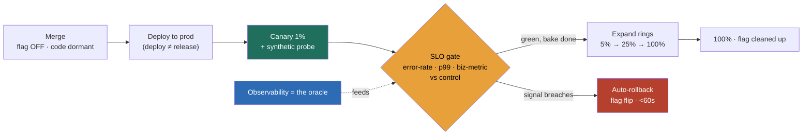

### Learning objectives
- State the **shift-left economics** as the foundational lever: a defect costs roughly **1× at the desk, 10× in CI, 100× in QA, 1000× in prod**, so you push detection down the ladder to where it is cheapest, and that is the entire reason CI gates, types, and contract tests exist.
- Name the **hard ceiling of pre-prod**: no staging environment reproduces production **scale, real data distributions, real traffic mix, real dependency latency, or real concurrency**, so some confidence is only available *in prod*, and a heavier pre-prod suite buys diminishing returns at rising cost.
- Describe **progressive delivery** at architecture altitude, **feature flags, canary, ring/percentage rollout, blue-green, and shadow traffic**, as the machinery that makes testing in prod *safe* by bounding blast radius and making the undo near-instant.
- Treat **observability as the test oracle in prod**: a canary is only as good as the SLO it is gated on, so the rollout is **automated against error-rate and latency signals**, not a human watching a graph.
- Reason in the **safety numbers**, 1% canary blast radius, minutes of bake time, **sub-60-second rollback** via a flag, so you can defend testing-in-prod as *responsible* and reject the reckless version (test-in-prod with no flag and no rollback) and the naive version (big-bang deploy after a staging soak).

### Intuition first
Think of two ways a pharmaceutical company decides a drug is safe. The first is the **lab**: controlled, cheap, fast, and you catch the obvious poisons before anything reaches a human, but the lab is not a body, it cannot reproduce a real population's genetics, diets, ages, and interactions, so a drug that is perfect in the lab can still fail in the world. The second is the **phased trial**: you give the drug to **a few volunteers under intense monitoring**, watch their vitals continuously, and only expand to more people once the small group looks safe, with a protocol to stop instantly the moment a vital sign crosses a line. Neither replaces the other. You run the lab because it is the cheapest place to catch a poison, and you run the phased trial because a body is the only thing that behaves like a body.

That image carries the whole design. **The lab is shift-left**, catch defects early where they are cheapest, close to the engineer who wrote the code. **The phased trial is test-in-prod**, the only place with real traffic, real data, and real scale, made safe by giving the change to a sliver of users under continuous monitoring with an instant stop. **The monitored vitals are your observability**, the trial is worthless without them, because the whole point is to *detect* the failure on the small group before it reaches everyone. And **the stop protocol is your rollback**, a trial with no way to pull the drug is not careful, it is reckless. Skip the lab and you waste real users catching cheap bugs; skip the trial and you ship to everyone a confidence that staging never actually earned.

### Deep explanation

**Shift-left is the cost argument, and it sets the default: catch it early where it is cheap.** The escaped-defect cost ladder is the governing number, a bug caught at author time costs roughly **1×** (a one-line fix in head-context), in CI **~10×** (a fix plus a re-run), in QA **~100×** (triage, ticket, context-switch, re-test), and in production **~1000×** (an incident, a rollback, a customer-impact assessment, a postmortem, and the fix), and that is before reputational cost. The whole discipline of shift-left, static analysis and types at author time, unit and contract tests in CI, integration tests before merge, exists to push detection *down* that ladder. This is non-negotiable and it is where most of your defect-catching value lives: the cheapest bug to fix is the one a type checker rejects before it ever runs. A Director who proposes to "just test in prod" with no shift-left has thrown away the cheapest 90% of the catch and is paying 1000× to learn what a 1× test would have told them.

**But pre-prod has a ceiling, and pretending it does not is the more common Director failure.** No staging environment reproduces production faithfully without costing as much as production, and usually it cannot reproduce it at all. Four things only exist at production: **scale** (a query that is fine on 10k rows degrades on 10B; a connection pool that holds at 100 QPS collapses at 100k), **real data distributions** (the null you never seeded, the emoji in the name field, the customer with 40,000 line items, the timezone you do not have a test for), **real traffic mix** (the exact ratio of reads to writes, the thundering herd at 9am, the retry storm a real dependency triggers), and **real dependency latency and failure** (your staging Stripe sandbox never returns the p99 you see at 2pm, never rate-limits you, never has the partial outage). You **reject** "we'll soak it in staging for three days first" not because staging is useless, it catches the cheap class, but because three days of staging soak buys *confidence about staging*, and the failures that actually take you down are the ones staging structurally cannot show. The honest framing: pre-prod confidence asymptotes, and past a point you are spending real engineering time and calendar to chase fidelity you can only get by shipping.

**Test-in-prod is how you get the confidence pre-prod cannot give, and progressive delivery is what makes it safe.** The reckless version, deploy to everyone and watch, is what gives "testing in prod" its bad name and is a genuine red flag. The responsible version bounds blast radius and makes the undo near-instant, and it is built from a small kit of mechanisms:

- **Feature flags / dark launch.** The change ships *disabled*; you turn it on for a cohort with a config change, not a deploy. This separates **deploy from release**, the code is in prod but dormant, so you can enable it for 1% of users, internal staff, or one region, and **disable it in seconds** if it misbehaves. Dark-launching means running the new code path for *real traffic but throwing the result away*, exercising it at full load with zero user impact before any user sees it.
- **Canary release.** Route a small slice of real traffic, classically **1%**, to the new version, hold it there for a **bake time** (minutes to an hour depending on traffic), and compare its error-rate and latency against the stable version before widening. The canary's job is to fail *small*: one in a hundred users sees the bad version, not all of them.
- **Ring / percentage rollout.** Expand in stages, **internal staff → 1% → 5% → 25% → 100%**, pausing at each ring to let the signal accumulate. Each ring is a wider blast radius bought only after the narrower one looked clean. This is how Microsoft and Google ship at scale: nothing reaches everyone until it has survived progressively larger, progressively more representative populations.
- **Blue-green.** Run two full environments, send all traffic to blue, deploy to green, cut traffic over, and keep blue warm so you can **flip back instantly**. It buys a clean instant rollback at the cost of running double the infra during the switch, and unlike a canary it does *not* limit blast radius, the cutover is all-or-nothing.
- **Shadow / mirror traffic.** Replay real production traffic at the new version **in parallel**, discarding its responses, so the new version handles the exact real request mix and volume with **zero user impact**. Shadowing is how you validate a rewrite or a new model against real load before a single user is routed to it, it catches the scale and data-distribution bugs staging cannot, with none of the canary's user exposure.

**Observability is the test oracle, and this is the line between responsible and reckless.** In pre-prod the oracle is an assertion, the test knows the expected answer. In prod there is no oracle handed to you, so **the SLO becomes the oracle**: the canary is judged against error-rate, p99 latency, and key business metrics (checkout-success-rate, not just HTTP 200s), compared automatically against the baseline, and the rollout **proceeds or rolls back on that signal without a human in the loop**. A canary with no automated SLO gate, a human squinting at a Grafana dashboard, is the trap: humans miss the 2am regression, debate whether a blip is real, and are too slow when it is. The Director-altitude statement: *progressive delivery is an SLO-gated control loop, the deploy advances when the signals stay green and reverts when they do not, and the human sets the thresholds, not watches the graph.* Synthetic monitoring, scripted probes that run a real transaction (a test-card checkout, a login, a search) against prod every minute, closes the gap when organic traffic is too sparse to catch a regression fast, the probe fails in seconds and pages, where waiting for a real user to hit the bug could take an hour.

**The trade is explicit, and the Director's job is to place each mechanism, not to pick a religion.** A heavier pre-prod suite buys confidence *before* any user is exposed, but never reaches full fidelity and taxes everyone's velocity with longer cycles. Progressive delivery reaches full fidelity, real traffic is the only true test, but exposes a sliver of real users to risk you must be able to **detect and undo fast**. The two are complements: shift-left for the cheap early catch (the 1×→1000× ladder), progressive delivery for the failures that only exist at scale, with a fast undo as the safety net under both. The mechanisms tier by risk: a marketing banner ships behind a flag with a light canary; a payments change gets a flag, a 1% canary, an SLO gate on payment-success-rate, a synthetic probe, and a sub-60-second rollback, because one bug there is a finance incident. You quantify the safety: **1% blast radius** means a bad release hits one in a hundred users for the **minutes of bake time** before the gate catches it, and a **flag flip rolls it back in seconds** versus the minutes-to-hours of a redeploy. That is what makes testing in prod responsible rather than reckless.

Go deeper — canary analysis, statistical gating, and shadow-traffic mechanics (IC depth, optional)

- **Automated canary analysis (ACA), the math under the gate.** A naive canary gate ("error rate < 1%") fails on low traffic, with 50 requests a single error is 2% and trips a false rollback. Mature systems (Netflix's Kayenta, Spinnaker's canary stage) do a *statistical comparison* between the canary and a control fleet running the *old* version, both taking live traffic, so environmental noise (a slow downstream, a traffic spike) hits both equally and cancels out. They score each metric (a Mann-Whitney U test or similar non-parametric comparison of the two distributions), weight the metrics, and produce an aggregate score; below a threshold the rollout auto-reverts. The key design choice is **canary vs control vs baseline**: compare canary to a *freshly spun control on the old version*, not to last week's numbers, so you are measuring the *change*, not the diurnal pattern.
- **Bake time vs traffic, why 1% is not enough on its own.** Confidence scales with *requests observed*, not wall-clock. At 1% of 100 QPS you see ~1 req/s on the canary, so detecting a regression that affects 1 in 1,000 requests takes ~1,000s (~17 min) to even *see one*, and longer to call it statistically. So you size bake time to **requests, not minutes**: high-traffic services bake for minutes; low-traffic services either bake much longer or lean on synthetics and shadow traffic to manufacture volume. This is why "canary for 5 minutes" is meaningless without the QPS.
- **Shadow traffic mechanics and its sharp edge.** Mirroring is usually done at the proxy/mesh layer (Envoy/Istio `mirror`, an L7 LB that duplicates the request), sending a copy to the shadow fleet with responses discarded. The sharp edge: **side effects**. A shadowed `POST /charge` that actually hits Stripe double-charges; a shadowed write duplicates the row. So shadowing is safe for *read-mostly* paths and requires the shadow target to run against **sandboxed or read-only dependencies**, or to no-op its writes, otherwise mirroring real traffic corrupts real state. This is the one place "just mirror prod traffic" goes badly wrong.
- **Flag debt, the cost nobody prices on day one.** Every flag is a permanent branch in the code that must be tested in both states; a codebase with hundreds of stale flags has a combinatorial test surface and its own outage class (the flag flipped by accident, the flag whose "off" path bit-rotted). The discipline is a **flag lifecycle**: flags for progressive rollout are *temporary* and removed once the change is at 100% and stable, kept flags are only the genuine long-lived kill-switches and entitlements. A flag with no removal date is debt accruing interest.

### Diagram: the progressive-delivery control loop

### Worked example: shipping a risky checkout pricing change
The prompt is *"you have to ship a change to the checkout pricing engine that you cannot fully validate in staging, how do you ship it safely?"* The new code recomputes discounts and tax, and the failure mode is catastrophic: charge the wrong amount, or take money and miscompute the order total. Staging has a Stripe sandbox, seeded test data, and synthetic carts, none of which look like the real distribution of promo stacking, currencies, and edge-case carts at 9am on a sale day. The IC instinct is "soak it in staging for three days." The Director ships it in prod, safely, and names what each mechanism buys.

- **Ship dark, behind a flag.** The new pricing path deploys **disabled**, so the code is in prod but no user hits it. First, **dark-launch** it: run the new computation in parallel with the live one for real traffic, **compare the two outputs**, and log every divergence, all with **zero user impact** because the old result is what is returned. This catches the real-data-distribution bugs (the 40,000-line-item cart, the stacked promo) that staging never seeded, before a single customer is charged by the new path. *Rejected: a three-day staging soak*, because it would burn three days of calendar and *still* never see the real cart distribution that the dark launch sees in an hour.
- **Canary 1% gated on payment-success-rate.** Once dark-launch divergence is clean, route **1% of real checkouts** to the new path, gated not on HTTP 200s but on **payment-success-rate and order-total-correctness** versus a control fleet on the old code, with **5-10 minutes of bake** sized to checkout QPS. One in a hundred carts is the blast radius; the SLO gate, not a human, decides whether to widen.
- **A synthetic probe as the canary in the coal mine.** A scripted **test-card checkout** runs against prod **every minute**, exercising the full pay path end to end, so even if organic 1% traffic is momentarily sparse, a regression pages in **under a minute** instead of waiting for an unlucky real customer. *Rejected: relying only on organic canary traffic*, because at low traffic the gate is statistically blind for too long.
- **SLO-gated auto-rollback in seconds.** If payment-success-rate on the canary drops or the synthetic probe fails, the system **flips the flag off automatically**, reverting all traffic to the old path in **under 60 seconds**, no redeploy, no human paging chain. The bad version was live for at most the bake window, at 1% blast radius, and undone in seconds. *Rejected: a human watching a dashboard to decide rollback*, because the 2am regression is exactly when no human is watching and the slow manual revert turns a non-event into an incident.

The number a Director brings out of this is not "we tested it thoroughly first." It is *"the new pricing ran dark against real carts before charging anyone, the canary capped exposure at 1% gated on payment-success not status codes, a synthetic probe catches it in under a minute, and a flag flip rolls it back in seconds, which is more real confidence than any staging soak could buy."*

### Trade-offs table: progressive-delivery mechanisms

| Mechanism | Blast radius | Rollback speed | Infra cost | Use when… |
|---|---|---|---|---|
| **Feature flag / dark launch** | 0% (dark) to chosen cohort | seconds (config flip) | ~zero | you need deploy≠release, instant off, and to exercise code on real traffic with no user impact |
| **Canary 1%** | 1% of users for bake time | minutes (shift traffic) or seconds if flag-backed | low (a small slice of the new version) | a risky change where you want a small, gated, real-traffic exposure |
| **Ring / percentage rollout** | grows in stages (1→5→25→100%) | minutes per ring | low | a broad change you widen gradually as each ring stays green |
| **Blue-green** | all-or-nothing at cutover | seconds (flip back to blue) | high (double the fleet during switch) | you need a clean instant full rollback and can pay for two environments |
| **Shadow / mirror traffic** | 0% (responses discarded) | n/a (no users routed) | medium (a parallel fleet) | validating a rewrite/new model at real load before any user exposure, **read-mostly paths only** |
| **Heavier pre-prod suite** | 0% (no prod exposure) | n/a | engineering time + slower cycles | catching the cheap defect class early; it cannot reach prod fidelity |

The Director move is matching the **risk and reversibility of the change** to the mechanism, dark-launch and shadow for the unprovable-in-staging class, canary plus rings for the gradual real-traffic exposure, blue-green when you need a clean instant flip, and a flag under all of them so the undo is seconds, never minutes.

### What interviewers probe here
- **"You have to ship a risky change to a high-traffic service, walk me through how you do it safely."** *Strong signal:* shift-left for the cheap catch, then **flag + canary + SLO-gated auto-rollback + synthetic probe**, blast radius capped at 1%, observability as the oracle, and the undo in seconds via a flag, with the explicit point that some confidence is *only* available in prod. *Red flag:* "test it thoroughly in staging first" (staging structurally cannot reproduce prod scale/data/traffic), or a big-bang deploy, or test-in-prod with no flag and no rollback (reckless, not careful).
- **"Your canary is a dashboard a human watches during the rollout, what's wrong with that?"** *Strong:* the human is the weak link, misses the 2am regression, debates whether a blip is real, and is too slow to revert; the gate must be an **automated SLO comparison against a control fleet** that proceeds or rolls back on signal, with the human setting thresholds not watching graphs. *Red flag:* "that's fine, we have good engineers", which scales with attention and fails exactly when no one is looking.
- **"When is testing in production the right call versus building out staging?"** *Strong:* treats them as **complements**, shift-left for cheap early detection (the 1×→1000× ladder), test-in-prod for the fidelity pre-prod cannot reach, and recognizes that past a point more staging buys confidence-about-staging at rising cost while the real failures need real traffic. *Red flag:* "never test in prod, that's unprofessional" (ignores the structural ceiling of pre-prod) or "staging is a waste, just ship" (throws away the cheapest 90% of the catch).
- **"How do you keep testing-in-prod from being reckless?"** *Strong:* bounded blast radius (1% canary, rings), automated SLO gate as the oracle, **sub-60-second flag rollback**, synthetic probes for fast detection, and risk-tiered gates (payments gets the heavy kit, a banner gets the light one). *Red flag:* equates "we monitor it" with safety, with no blast-radius limit and no fast undo, which is just shipping to everyone and hoping.

The through-line at Director altitude: shift-left to catch defects where they are cheapest, then accept that pre-prod has a ceiling and use **progressive delivery with an SLO-gated control loop** to get the confidence only prod can give, blast-radius-bounded and seconds-to-undo. You delegate the build with a stated prior: *"I'd have the platform team bake off a managed progressive-delivery controller (Argo Rollouts / Spinnaker / a feature-flag platform like LaunchDarkly) against building canary analysis ourselves; my prior is buy, because the value is a paved-road default every team gets for free and a proven statistical canary, not in owning the rollout engine, and the license cost is rounding error next to one prevented payments incident."*

### Common mistakes / misconceptions
- **Believing staging catches everything.** No pre-prod environment reproduces prod scale, real data distributions, real traffic mix, or real dependency latency; a heavier staging suite buys diminishing confidence at rising cost, and the failures that take you down are the ones it structurally cannot show.
- **Big-bang deploys.** Shipping a change to 100% of traffic at once means the blast radius *is* everyone and the rollback is a full redeploy (minutes to hours); progressive delivery exists precisely so a bad release hits 1%, not all, and is undone in seconds.
- **Testing in prod with no flag and no rollback.** "Just ship and watch" is the reckless caricature that gives test-in-prod a bad name; without a flag for instant off and a fast rollback, you are not being careful, you are gambling with all your users.
- **No synthetic monitoring.** Relying only on organic traffic to surface a regression is slow and traffic-dependent; a scripted probe running the real transaction every minute catches the failure in seconds when organic volume is too sparse to.
- **A canary with no automated SLO gate.** A human watching a graph misses the off-hours regression, debates blips, and reverts too slowly; the gate must be an automated comparison against a control fleet that proceeds or rolls back on the signal.

### Practice questions

**Q1.** A team wants to add a week of staging soak before every release to "be safe." React as the Director.
> *Model:* I'd push back on the premise that more staging equals more safety. A week of soak buys confidence *about staging*, and staging structurally cannot reproduce production scale, the real data distribution, the real traffic mix, or real dependency latency, so the failures that actually take us down are the ones the soak cannot show, while we have paid a week of calendar on every release. I'd keep a *fast* pre-prod gate for the cheap defect class (types, units, contracts, a thin integration pass) because the 1×→1000× cost ladder says catch what you can early, then move the rest of the confidence into prod via progressive delivery, dark-launch and shadow for the unprovable class, a 1% canary gated on SLOs, a synthetic probe, and a sub-60-second flag rollback. That gives us *more* real confidence than the soak (real traffic is the only true test) at a fraction of the velocity cost, with risk bounded to 1% and undone in seconds.

**Q2.** Estimate the user impact of a bad release shipped big-bang versus via a 1% canary with a 10-minute bake and a flag rollback, on a service doing 100k checkouts/hour. Name what the canary buys.
> *Model:* Big-bang: the bad version is live for all **100k checkouts/hour** until someone notices and redeploys, call it 30-60 minutes to detect-and-revert manually, so **50k-100k affected checkouts** before recovery. Canary: 1% of traffic is **~1,000 checkouts/hour**, and the SLO gate catches the regression within the **10-minute bake**, so at most **~170 affected checkouts** before auto-rollback, and the flag flip reverts in **under 60 seconds**, not a redeploy. That is roughly a **300-600× reduction in blast radius** and an order-of-magnitude faster recovery. What the canary buys is exactly that: exposure capped at a sliver, detection by an automated gate not a human, and an undo measured in seconds. The cost is a slower full rollout (the rings take longer than a big-bang flip), which on a payments path is obviously worth it.

**Q3.** You need to validate a full rewrite of your search ranking service before any user touches it. How do you get real-traffic confidence with zero user risk?
> *Model:* I'd use **shadow / mirror traffic**: at the load-balancer or service-mesh layer, duplicate live production search requests to the new ranking service in parallel, **discard its responses**, and serve users entirely from the old service. The new service then handles the *exact* real query mix, volume, and data distribution, which is precisely what staging cannot reproduce, with **zero user impact** because nothing it returns is shown. I'd compare its latency and ranking output against the old service offline, and watch for scale failures (memory, pool exhaustion) that only appear at real QPS. The one sharp edge is side effects, since ranking is read-mostly this is safe, but if any path wrote state I'd point the shadow at read-only or sandboxed dependencies so mirroring does not corrupt real data. Only once shadow looks clean would I move to a 1% canary on real traffic, gated on result-quality and latency SLOs, then ring it out. Shadow buys real-load confidence before exposure; the canary buys the final real-user signal.

**Q4.** Finance demands "zero defects in production." Engineering ships a thousand times a week. Where do you set the line, and how does test-in-prod fit?
> *Model:* "Zero defects in prod" is not achievable at a thousand deploys a week, and chasing it with an exhaustive pre-prod gate would crush velocity to near zero while *still* missing the failures that only exist at real scale, so I'd reframe from "zero defects" to **bounded blast radius and fast recovery**, which is what finance actually needs. The model: shift-left for cheap early detection (types, units, contracts, the 1×→1000× ladder), then progressive delivery for what pre-prod cannot reach, dark-launch and shadow for the unprovable class, a 1% canary gated on SLOs, synthetic probes, and a sub-60-second flag rollback. I'd tier the gates by risk: the payments path gets the heavy kit (SLO gate on payment-success-rate, a second approver, tight rollback SLO), a marketing banner gets the light one, because payment-grade gates everywhere tax velocity for no safety gain. Then I'd commit to **change-failure rate and time-to-restore** as the measurable targets finance can hold me to, instead of an impossible absolute. That gives finance the risk control they want and engineering the velocity, with the trade named.

### Key takeaways
- **Shift-left is the cost floor:** the escaped-defect ladder (~1×→10×→100×→1000×) means catch defects early where they are cheapest, types and units and contracts in CI, and that is where most of your catch value lives.
- **Pre-prod has a hard ceiling:** no staging reproduces prod scale, real data distributions, real traffic mix, or real dependency latency, so a heavier pre-prod suite buys diminishing confidence at rising cost, and some confidence is *only* available in prod.
- **Progressive delivery makes test-in-prod safe:** feature flags (deploy≠release, instant off), canary (1% blast radius), ring/percentage rollout, blue-green (clean instant flip), and shadow traffic (real load, zero user impact) bound the blast radius and make the undo near-instant.
- **Observability is the oracle, and the gate must be automated:** the canary is judged against error-rate, p99, and business metrics versus a control fleet, and the rollout proceeds or rolls back on the signal, **a human watching a graph is the trap**; synthetic probes catch regressions in seconds.
- **The two are complements, not rivals, and the Director places each mechanism by risk:** shift-left for the cheap early catch, progressive delivery for the failures only real traffic reveals, with a sub-60-second rollback as the safety net under both, and payments-grade gates only where the risk warrants them.

> **Spaced-repetition recap:** Testing is **the lab and the phased trial**: shift-left is the lab (catch defects early where they are cheap, the ~1×→1000× ladder), but the lab is not a body, so pre-prod has a **hard ceiling**, no staging reproduces prod scale, real data, real traffic, or real dependency latency, and a heavier pre-prod suite buys diminishing confidence at rising cost. **Test-in-prod** gets the confidence only prod can give, made *safe* by **progressive delivery**: **flags** (deploy≠release, instant off), **canary** (1% blast radius, bake time), **rings** (1→5→25→100%), **blue-green** (clean instant flip), and **shadow traffic** (real load, zero user impact). **Observability is the oracle** and the gate is **automated against an SLO versus a control fleet**, not a human watching a graph, with **synthetic probes** for fast detection and a **sub-60-second flag rollback** under it all. The reckless version (no flag, no rollback) and the naive version (big-bang after a staging soak) are both wrong; the Director places each mechanism by risk.

---

*End of Lesson 12.5. You cannot catch everything before prod: shift-left for the cheap early catch, then use SLO-gated progressive delivery to get the confidence only real traffic can give, blast-radius-bounded and seconds-to-undo.*
