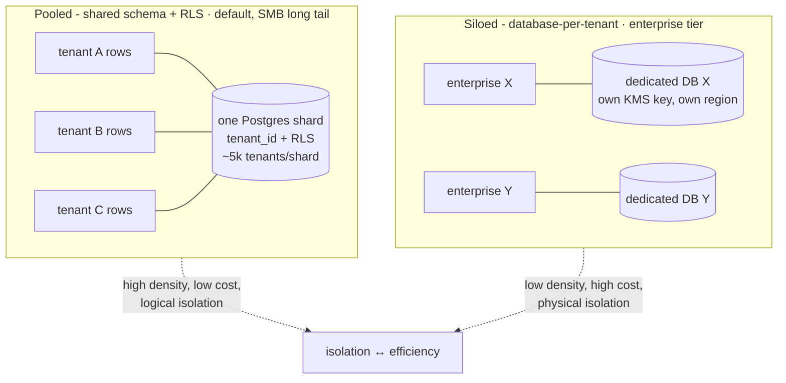
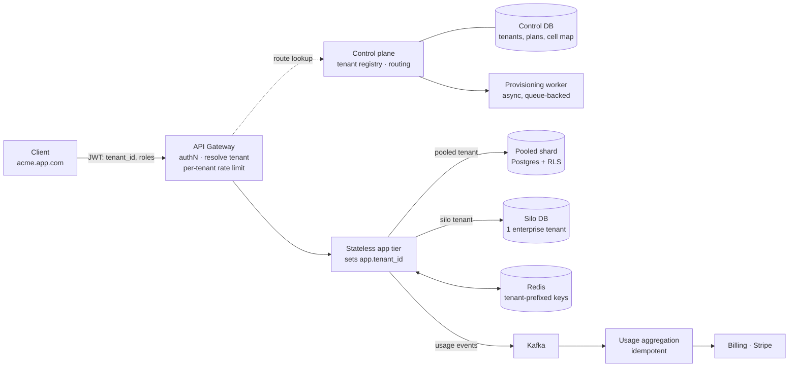
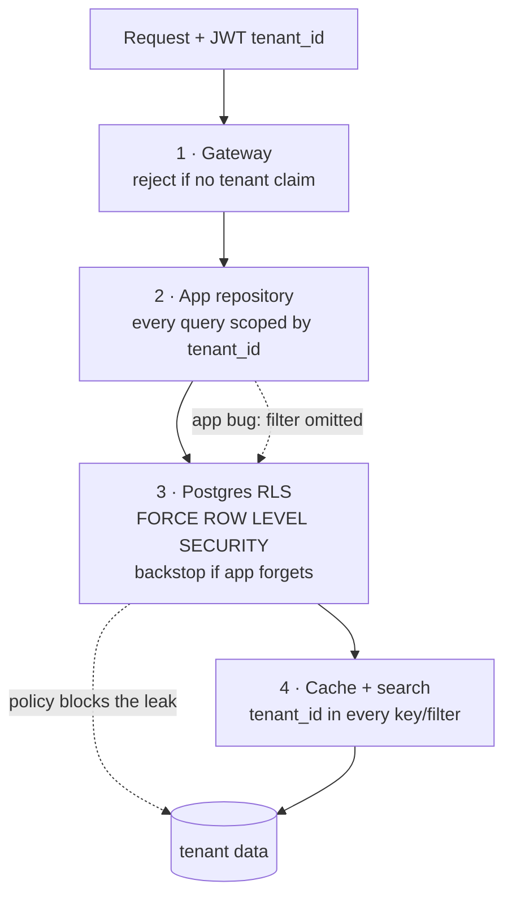

### Learning objectives
- Run the **RESHADED** spine on a multi-tenant SaaS platform where the decisive requirements are non-functional: **tenant isolation** (no cross-tenant leak), **noisy-neighbor fairness**, per-tenant **SLA (service-level agreement) tiers**, **data residency**, and **cost density / margin**, not the feature list.
- Choose a **tenancy model per tier** on the silo / bridge / pool spectrum: **pooled shared-schema + row-level security (RLS)** as the dense default for the long tail, **siloed database-per-tenant** for the enterprise tier, and defend each against the alternative.
- Reason in numbers a Director can stand behind: **~100k tenants** on a **power-law** distribution (top 1% hold ~55% of users), **~5M seats**, **~30k req/s** peak, and the **density math**, thousands of tenants per pooled shard, one enterprise per silo, cost-per-tenant, and gross margin.
- Make the crux the **Evaluation** step: prove cross-tenant leak is impossible by construction, contain a noisy neighbor, place a giant tenant vs the long tail, survive an onboarding spike, and get **per-tenant backup/restore and metering** right.
- Know where a Director **goes deep** (the isolation model and the leak-prevention argument) and where they **delegate with a stated prior** (shard density benchmark, KMS, Stripe reconciliation).

### Intuition first
Designing this system is not designing a CRM, it is designing the **operator of a serviced-office building**, the front desk more than the floors.

Picture yourself running a WeWork-style tower for ten thousand companies. The building itself, the app, is almost commodity: desks, meeting rooms, power. The hard, valuable machine is the **front desk (the control plane)**: it knows which company leases what, cuts a keycard scoped to exactly their suite, meters their usage, bills them, and can move a company from a shared floor to a private suite without anyone else noticing. Most companies get **hot desks on a shared floor** with a locked cabinet each, dense and cheap, where the only thing stopping you reading a neighbor's files is that your keycard opens your cabinet and nothing else (**pooled shared-schema + RLS**). A regulated few, a bank, a hospital, lease a **private suite with their own locked door and their own filing room** (**siloed database-per-tenant**), because they are contractually forbidden from sharing a cabinet with strangers, and they pay for it.

Two failures dominate everything else. The first is a **keycard that opens the wrong suite**, one tenant seeing another's data, which is worse than the elevators being out for a day, because a breach cannot be un-happened. The second is a **noisy tenant** who books every meeting room and runs every tap, starving the rest of the floor. The entire design is the machinery that makes the first impossible by construction and the second bounded by per-tenant quotas, while packing enough companies per floor to actually turn a profit.

---

### R - Requirements

"Build a multi-tenant SaaS" hides a business-model decision inside an architecture question. The signal is naming that the crux is **isolation and fairness**, not the CRM features.

**Clarifying questions (and assumed answers):**
- *What is the app?* A **B2B workflow / CRM** (Asana / Jira / Salesforce shape): projects, records, tasks, per-tenant users and admins. The app logic is not the interesting part; **tenancy** is.
- *Who are the tenants?* From **self-serve SMBs** (a 10-person startup swiping a card) to **regulated enterprises** (a bank demanding a dedicated database, in-region data, its own encryption key). One model cannot serve both, which forces **tiering**.
- *Custom domains / SSO (single sign-on)?* **Yes**, enterprises get `acme.app.com`, SAML/OIDC (OpenID Connect) SSO, and custom fields / workflows. Customization is per-tenant config, not per-tenant code forks.
- *Billing?* **Per-seat by default**, with **usage metering** for consumption features (API calls, storage, AI). Metering feeds invoices, so its accuracy is revenue-critical.
- *Residency?* **Yes for enterprise**, EU tenant data physically stays in the EU. This forces **per-region data planes** later.

**CUT (with the reason):** the deep CRM feature set (a product problem, not a systems one), analytics/reporting warehouse (a separate pipeline), real-time collaboration mechanics. Trying to design the whole product plus the whole platform in 45 minutes is the red flag; the platform is the interview.

**Functional:** tenant **signup and provisioning** (self-serve and sales-assisted); per-tenant **data, users, roles, and admin** (RBAC scoped inside a tenant); per-tenant **customization** (custom fields, branding, SSO); **billing** (seats + metered usage); the full **tenant lifecycle**, trial → paid → suspend → export → delete.

**Non-functional (these are the design):**
- **Tenant isolation**, the cardinal requirement: **no cross-tenant data leak, ever**, and a bounded **blast radius** (one tenant's bad state does not take out the rest).
- **Noisy-neighbor fairness**: one tenant's spike, bulk import, or runaway query cannot starve others.
- **Per-tenant SLA tiers**: free 99.5%, pro 99.9%, enterprise 99.95% with contractual credits.
- **Data residency** per enterprise tenant.
- **Cost density / margin**: cost per tenant low enough to hit a **70 to 80% gross margin** on the long tail, the number a SaaS business lives on.

The decisive pair is **isolation + fairness**. They fork the architecture into a **control plane** (tenant lifecycle, routing, billing) over **data planes** (the tenants' actual traffic), and they force a **tenancy model chosen per tier**, everything else hangs off that.

---

### E - Estimation

Enough math to size the fleet, expose the **power law**, and prove the **density and margin** story that justifies pooling.

**Assumptions:** **100,000 paying tenants**; tenant size follows a **power law** (this is the whole game):

```
Top 1%   =  1,000 enterprise tenants × ~3,000 users ≈ 3.0M users  (largest single tenant ~80k users)
Next 9%  =  9,000 mid-market tenants × ~150 users   ≈ 1.35M users
Tail 90% = 90,000 SMB tenants        × ~12 users    ≈ 1.1M users
                                        Total seats  ≈ ~5.4M  → call it ~5M
```

**The headline a Director says out loud:** the **top 1% of tenants hold ~55% of the users** and drive an even larger share of load; the **long-tail 90% hold ~20%**. A one-size model is wrong at both ends, so you **pool the tail for margin and silo the whales for isolation**.

**Request load:**
```
5M seats × 40% DAU = 2M DAU × ~300 req/day ≈ 600M req/day ≈ ~7k req/s average
Peak (business hours + one dominant region) ≈ ~4× → ~30k req/s peak
Read:write ≈ 20:1 → ~28k reads/s, ~1.5k writes/s
```
Traffic is bursty and **region-concentrated** (a B2B tool peaks 9am to 6pm local), which matters for both capacity and residency.

**Storage:** structured data is dominated by the whales, top 1,000 enterprises × ~100 GB ≈ 100 TB, mid-tier ~45 TB, tail ~9 TB, so **~150 TB of relational data** fleet-wide, plus attachments offloaded to blob (**~1 PB in S3**). The relational tier is the constraint; blob is cheap and elastic.

**Density and margin (the crux estimation):**
```
Pooled shard (one Postgres, ~128 GB RAM, ~$2,500/mo): packs ~5,000 SMB tenants
  90,000 SMB ÷ 5,000  ≈ 18 pooled shards
  Infra cost/tenant   ≈ $2,500 / 5,000 = $0.50 / tenant / mo
  An SMB paying ~$120/mo (12 seats × $10) → >99% infra gross margin. Pooling is why the tail is viable.

Silo (database-per-tenant) for enterprise: ~$2.5k-10k/mo/tenant depending on size
  1,000 enterprise silos -> a much larger absolute bill, but each pays $50k-500k/yr.
  Lower margin multiple, justified by deal size AND because isolation is what closes the deal.
```

**The one-line takeaway:** ~100k tenants, power-law skewed, ~5M seats, ~30k req/s peak, packed **~5,000 tenants per pooled shard** at **$0.50/tenant** for the tail and **one tenant per silo** for the enterprise, that density spread *is* the business model.

---

### S - Storage

The pivotal choice is the **tenancy model**, and the discipline is to pick a point on the **silo / bridge / pool** spectrum **per tier**, not one for the whole product.

**The tenancy decision:**
- **Pooled, shared-schema + RLS (default, the long tail).** All pooled tenants share one Postgres schema; every table carries `tenant_id`, and **Postgres row-level security** pushes `WHERE tenant_id = current_setting('app.tenant_id')` into the engine so a forgotten filter cannot leak. **Highest density (~5,000 tenants/shard), lowest cost, weakest physical isolation.** *Rejected alternative, schema-per-tenant as the default:* thousands of schemas bloat the catalog, explode connection-pool and migration cost (a migration now runs 90,000 times), and buy isolation the tail does not need. Pooling with RLS is the margin engine.
- **Siloed, database-per-tenant (the enterprise tier).** One dedicated database (or a full single-tenant stack) per enterprise tenant. **Physical isolation, trivial per-tenant restore, in-region residency, and per-tenant encryption keys (BYOK)**, at low density and high cost. *Rejected alternative, silo for everyone:* it would turn the $0.50/tenant tail into a $2,500/tenant tail and destroy the margin that makes the SMB business exist. Silo is priced into the enterprise contract.
- **Cells (bridge, the operational unit).** Group pooled tenants into **cells**, each cell a full stack (app + a set of shards) holding a bounded slice of tenants. A cell caps **blast radius**: a bad deploy or a runaway tenant hurts one cell, not the world. This is the structure the control plane routes over.

**Store selection:**
- **Tenant relational data** → **Postgres** (RLS for pooled shards; a dedicated instance per silo).
- **Control-plane data** (tenant registry, plans, subscriptions, routing, usage counters, feature flags) → a **separate Postgres**, deliberately isolated from tenant data so a data-plane incident cannot corrupt tenant lifecycle.
- **Usage / metering events** → **Kafka** (durable, at-least-once), aggregated for billing.
- **Cache** → **Redis**, every key **prefixed with `tenant_id`** so cache is isolated too.
- **Search** → per-tenant Elasticsearch indices for large tenants, a shared index with a mandatory `tenant_id` filter for the pool.
- **Attachments** → **S3** with a per-tenant prefix (per-tenant bucket + KMS key for silo tenants).

The rule underneath all of it: **the `tenant_id` is non-optional at every layer**, row, cache key, log line, queue message, blob path, or isolation is a matter of discipline instead of construction.


```mermaid
flowchart TB
  subgraph POOL[Pooled - shared schema + RLS · default, SMB long tail]
    A[tenant A rows] --- PDB[(one Postgres shard<br/>tenant_id + RLS<br/>~5k tenants/shard)]
    B[tenant B rows] --- PDB
    C[tenant C rows] --- PDB
  end
  subgraph SILO[Siloed - database-per-tenant · enterprise tier]
    E[enterprise X] --- XDB[(dedicated DB X<br/>own KMS key, own region)]
    F[enterprise Y] --- YDB[(dedicated DB Y)]
  end
  POOL -.high density, low cost,<br/>logical isolation.-> AXIS[isolation ↔ efficiency]
  SILO -.low density, high cost,<br/>physical isolation.-> AXIS
```

---

### H - High-level design

The structural split is **control plane over data planes**, with an **API gateway that resolves tenant context and routes**, so a request always reaches its own tenant's cell and can never touch another's.


```mermaid
flowchart LR
  CL[Client<br/>acme.app.com] -->|JWT: tenant_id, roles| GW[API Gateway<br/>authN · resolve tenant<br/>per-tenant rate limit]
  GW -.route lookup.-> CP[Control plane<br/>tenant registry · routing]
  CP --- CDB[(Control DB<br/>tenants, plans, cell map)]

  GW --> APP[Stateless app tier<br/>sets app.tenant_id]
  APP -->|pooled tenant| POOL[(Pooled shard<br/>Postgres + RLS)]
  APP -->|silo tenant| SILO[(Silo DB<br/>1 enterprise tenant)]
  APP <--> RED[(Redis<br/>tenant-prefixed keys)]
  APP -->|usage events| K[Kafka]

  K --> AGG[Usage aggregation<br/>idempotent] --> STR[Billing · Stripe]
  CP --> PRV[Provisioning worker<br/>async, queue-backed]
```

**Happy path, a user at tenant `acme` opens a project:** the client hits `acme.app.com` (or sends an API key) with a **JWT (JSON Web Token) carrying `tenant_id` and roles**. The **gateway** authenticates, extracts the tenant, checks the **control plane's routing map** to find which **cell / data plane** owns `acme`, and enforces `acme`'s **per-tenant rate limit** (a Redis token bucket keyed by tenant). The request lands on the **stateless app tier**, which **binds the tenant to the request** by setting the Postgres session variable `app.tenant_id` before any query runs. Every read is then RLS-scoped in the engine; every cache read/write uses a `tenant_id`-prefixed key; every emitted metric and log line is tagged with the tenant. The app reads the project from `acme`'s pooled shard (or its silo DB) and returns it.

**Provisioning path (control plane, off the hot path):** signup calls the control plane, which writes a tenant row, assigns a **cell**, and enqueues async provisioning. A **pooled** tenant is ready in milliseconds (insert a row, RLS handles the rest); a **silo** tenant needs a database, so the control plane draws from a **pre-warmed pool of empty DBs** and configures it. Provisioning is **queue-backed and idempotent**, never inline on a request.

The two defining choices: **(a)** tenant context is resolved once at the gateway and **propagated everywhere** (token → `app.tenant_id` → cache prefix → log tag), so scoping is uniform; **(b)** the **control plane is separate from the data plane**, so an onboarding bug cannot take down live tenant traffic, and routing over **cells** keeps blast radius bounded.

---

### A - API design

Two distinct surfaces, and keeping them separate is the signal: a **tenant-scoped data-plane API** for end users, and a **provisioning/admin API on the control plane** for tenant lifecycle.

**Tenant-scoped data-plane API (the hot path).** The tenant is **never in the URL from the client**, it is derived from the authenticated context, so it cannot be forged or fat-fingered into another tenant:
```
GET  /v1/projects                      # implicitly scoped to caller's tenant via JWT
POST /v1/tasks           { project_id, title, assignee, custom_fields{} }
GET  /v1/records/{id}                  # RLS returns 404 if the record belongs to another tenant
POST /v1/users           { email, role }   # tenant-admin scope required
```
Auth: a per-tenant **OIDC/SAML (Security Assertion Markup Language) SSO** for enterprises (their IdP), tenant-scoped **JWTs** carrying `tenant_id` + `roles`, or scoped **API keys** for programmatic access. The gateway validates the token and stamps the tenant; the app enforces **RBAC (role-based access control) within the tenant** on top.

**Control-plane provisioning / admin API (setup, not latency-critical).** Separate auth (ops or tenant-owner scope), separate service:
```
POST /admin/v1/tenants          { name, plan, region, isolation:"pool|silo" }
POST /admin/v1/tenants/{id}/plan            # upgrade → may trigger pool→silo migration
POST /admin/v1/tenants/{id}/suspend         # non-payment / abuse
POST /admin/v1/tenants/{id}/export          # GDPR / exit: full per-tenant dump
DELETE /admin/v1/tenants/{id}               # hard delete + attestation
```

**How tenant context is carried, the Director-grade detail:** the JWT's `tenant_id` claim is the **single source of tenant identity**, validated at the gateway and propagated as `app.tenant_id` into the DB session so RLS enforces it and the app cannot query outside it. *Rejected alternative, passing `tenant_id` as a client-supplied request parameter:* it makes a cross-tenant read a one-character attack (change the id), the exact bug this whole design exists to prevent. The tenant comes from the token, never the request body.

---

### D - Data model

The partition/enforcement decisions here are what make cross-tenant leakage impossible by construction rather than by discipline.

**Control-plane tables (the tenant registry):**
```
tenants(id, name, plan, isolation_model, cell_id, region, status, kms_key_id, created_at)
plans(id, name, seat_price, included_usage, sla_tier, rate_limit)
subscriptions(tenant_id, plan_id, seats, period_start, status)
usage_counters(tenant_id, metric, period, value)   -- rolled up from Kafka
feature_flags(tenant_id, flag, value)
```

**Pooled tenant tables (shared schema):** every table leads with `tenant_id`, and RLS is **forced** so even the app role cannot bypass it:
```sql
ALTER TABLE tasks ENABLE ROW LEVEL SECURITY;
ALTER TABLE tasks FORCE ROW LEVEL SECURITY;
CREATE POLICY tenant_iso ON tasks
  USING (tenant_id = current_setting('app.tenant_id')::uuid);
-- composite indexes MUST lead with tenant_id: (tenant_id, project_id, updated_at)
```
The app connects as a **non-owner, non-superuser** role (owners and `BYPASSRLS` roles skip policies), and the connection pooler **resets `app.tenant_id` on every checkout** (a reused session carrying the previous tenant's context is itself a leak). Silo tenants get the same schema in their own database, where the `tenant_id` column is redundant but kept for portability.

**Isolation enforcement is defense in depth**, not one control:


```mermaid
flowchart TB
  R[Request + JWT tenant_id] --> L1[1 · Gateway<br/>reject if no tenant claim]
  L1 --> L2[2 · App repository<br/>every query scoped by tenant_id]
  L2 --> L3[3 · Postgres RLS<br/>FORCE ROW LEVEL SECURITY<br/>backstop if app forgets]
  L3 --> L4[4 · Cache + search<br/>tenant_id in every key/filter]
  L2 -.app bug: filter omitted.-> L3
  L3 -.policy blocks the leak.-> DATA[(tenant data)]
  L4 --> DATA
```

**Why layered:** app-layer scoping alone means one missing `WHERE` is a breach; RLS alone misses the cache and search paths. *Rejected alternative, "we filter by tenant in the app layer":* the single query that forgets is the breach, so RLS is the non-negotiable backstop, and cache/search get their own mandatory tenant predicate. **Summary:** tenant registry and plans → control DB; tenant rows → pooled shard (RLS) or silo DB; who-can-do-what → per-tenant RBAC; usage → counters rolled up from Kafka.

---

### E - Evaluation

This is the crux of the whole design. Stress it against the NFRs (non-functional requirements), fix each bottleneck, and name the trade.

**Bottleneck 1, cross-tenant leak (the existential one).** A single missing `tenant_id` filter, a shared cache key, or a search query without the tenant predicate leaks one tenant's data to another. **Fix, defense in depth:** (a) a repository/ORM layer that is **always tenant-scoped**, (b) **Postgres RLS with FORCE** as the backstop for the query that forgets, (c) `tenant_id` in **every** Redis key and Elasticsearch filter, (d) **canary tenants** and automated tests that assert a cross-tenant query returns empty, run in CI and continuously in prod. *Trade:* RLS adds roughly **5 to 15% query overhead** and complicates pooling (the session var must reset per checkout). That overhead is cheap insurance against the one failure that cannot be un-happened; the alternative, trusting discipline, is rejected.

**Bottleneck 2, the noisy neighbor.** One tenant runs a giant report, a bulk import, or an abusive API loop and starves its shard, so every co-tenant's p99 spikes. **Fix:** **per-tenant rate limits** (Redis token bucket keyed by tenant, limits set by plan tier), **per-tenant connection quotas**, a **`statement_timeout`** to kill runaway queries, and a **separate connection pool / worker tier for background jobs** so bulk work never competes with interactive reads. Repeat offenders or genuinely heavy tenants get **flagged for migration to a silo**. *Trade:* rate limits can throttle a legitimately busy tenant, mitigated with tier-based limits and short burst allowances; the alternative, no limits, lets one tenant's runaway query become everyone's outage.

**Bottleneck 3, the giant enterprise vs the long tail.** An 80,000-user tenant dropped onto a pooled shard with 5,000 SMBs dominates it and violates their SLA. **Fix, density-aware placement:** big tenants are **provisioned straight to a silo (or their own shard)**; the control plane watches usage counters and **auto-flags a tenant for migration** when it crosses a threshold (users, QPS (queries per second), or storage). *Trade:* thresholds need tuning and migration is real work (Design evolution), but the alternative, one model for all, either over-provisions the pool to survive the whale or lets the whale wreck the pool.

**Bottleneck 4, an onboarding spike.** A viral signup surge, or an enterprise rolling out 50,000 seats in a day, overwhelms provisioning. **Fix:** provisioning is **async and queue-backed** on the control plane, pooled tenants provision in milliseconds (a row), and silo tenants draw from a **pre-warmed pool of empty databases** so nobody waits minutes for a DB to spin up. *Trade:* the warm pool costs money sitting idle; size it from historical signup rate, an on-call and finance line item, not a guess.

**Bottleneck 5, per-tenant backup and restore.** An enterprise says "restore just our workspace to yesterday" or "export everything, we are leaving." In a **silo** this is trivial (restore/dump that one database). In the **pool** it is genuinely hard: you cannot restore one tenant's rows from a shared snapshot without a surgical logical restore. **Fix for pooled:** logical **per-tenant export** (`COPY ... WHERE tenant_id = ...`), cell-granularity point-in-time recovery, and tenant-scoped soft-delete + audit for "undo." *The Director line:* **per-tenant restore is a first-class reason the enterprise tier is siloed**, and I would not promise granular restore on the pool beyond logical export, I would price the guarantee into the silo tier.

**Bottleneck 6, metering / billing accuracy.** Usage events (API calls, seats, storage) drive invoices, so a lost event undercharges and a double-counted one enrages a customer, both are revenue incidents. **Fix:** metering events flow through **Kafka (durable, at-least-once)** into an **idempotent aggregator** (dedupe on `event_id`), with a **daily reconciliation** pass before pushing invoices to **Stripe**. *Trade:* at-least-once transport means the aggregator must be idempotent; **exactly-once billing is a reconciliation problem, not a transport guarantee**, and saying that is the signal.

**Re-check vs NFRs:** isolation ✓ (four-layer defense, RLS-forced); fairness ✓ (per-tenant limits + timeouts + job isolation); SLA tiers ✓ (pool vs silo placement, cell blast-radius containment); residency ✓ (silo + per-region planes, evolution); density/margin ✓ (~5,000 tenants/shard, $0.50/tenant tail). The residual costs, RLS overhead, warm-pool idle spend, migration tooling, are **named and priced**, which is the point of this step.

---

### D - Design evolution

Scale the design under the new constraints an enterprise business puts on it.

**A dedicated-silo enterprise tier.** As deals demand physical isolation, per-tenant restore, custom SLAs, VPC peering, and **BYOK** (bring your own key) (customer-managed KMS keys), the enterprise tier moves fully to **database-per-tenant** or a dedicated single-tenant stack. *Trade:* margin per unit drops, but the deal size justifies it and, crucially, **isolation is the feature that closes the deal**, so the platform must support a pooled long tail *and* a siloed head without forking the codebase. The cost is operational: N enterprise databases to patch, monitor, and back up, which forces **fleet automation** (the control plane becomes the hard part of the system).

**Per-region data planes for residency.** EU tenant data must physically stay in the EU (GDPR (General Data Protection Regulation), Schrems II), and other regions follow. The **control plane stays global** (tenant registry, routing, billing), but **tenant data planes are pinned to a home region**, so a request routes to the tenant's region and the data never leaves it. *Trade:* a global enterprise with EU and US offices needs either a data plane per region or accepts a single home region; cross-region features get harder. The split, global control / regional data, is what keeps one logical product legally sellable everywhere.

**Usage-based billing.** The market shifts from pure per-seat toward **consumption pricing** (API calls, storage, AI tokens). This promotes the **metering pipeline from a reporting nicety to revenue-critical infrastructure**: Kafka + idempotent aggregation + reconciliation now directly determine the invoice. *Trade:* revenue becomes less predictable but aligns price with value; the engineering cost is that a metering bug is now a **finance incident**, so it earns real SLOs (service-level objectives) and reconciliation.

**Tenant self-service.** Let tenant admins provision workspaces, invite users, buy seats, and configure SSO without sales or ops in the loop, via control-plane self-serve APIs and an admin console. *Trade:* it slashes cost-to-serve on the long tail but needs guardrails (trial-abuse and fraud detection on free signups), which the control plane owns.

**Pool-to-silo migration (the hardest piece).** When a pooled tenant buys enterprise or crosses the density threshold, it must move from a shared shard to its own database **online, with no downtime and no leak**. The shape: stand up the silo, **logically replicate or dual-write** the tenant's rows, verify row counts and checksums, then **cut over** and tombstone the source rows. *The Director line:* **I own the trigger policy (when a tenant migrates) and delegate the migration tooling**, my prior is logical replication with a checksum gate, but I want the storage team's number on cutover time and the tail-latency impact during replication.

**Where I would delegate, with stated priors:**
- *Storage/DBA:* benchmark **tenants-per-pooled-shard density** and **RLS overhead** for p99; my prior is ~5,000 SMB tenants/shard and ~10% RLS cost, but I want it measured before we commit the margin model.
- *Security:* own the **cross-tenant isolation pen-test** and **per-tenant BYOK/KMS** (key management service); my job is an architecture where a leak is impossible by construction, theirs is to try to break it.
- *Billing/RevOps:* **Stripe integration and metering reconciliation**; my job is a durable, idempotent event pipeline, theirs is invoice correctness.

---

### Trade-offs table: the pivotal decisions

| Decision | Option A | Option B | Option C | Use when… |
|---|---|---|---|---|
| **Tenancy model** | **Pooled shared-schema + RLS** ✅ (default) | Schema-per-tenant (bridge) | **Silo, DB-per-tenant** ✅ (enterprise) | **Pool** the SMB long tail for density/margin; **silo** the regulated/whale tenants for isolation, residency, and restore; **schema-per-tenant** only mid-scale where migrations stay manageable. |
| **Isolation enforcement** | **App-scoping + RLS + cache/search predicate** ✅ | App-layer scoping only | DB firewall / proxy | **Defense in depth** always, RLS is the non-negotiable backstop. **App-only** is a single-bug-from-breach red flag. |
| **Tenant context source** | **JWT claim → `app.tenant_id`** ✅ | Client-supplied `tenant_id` param | Subdomain only | **Token-derived** so it cannot be forged; **subdomain** as a hint, never the sole source; **client param** never. |
| **Provisioning** | **Async, queue-backed, warm silo pool** ✅ | Inline on signup request | Manual ops ticket | **Async + warm pool** to absorb onboarding spikes and silo spin-up; **inline** couples lifecycle to the hot path; **manual** only for the earliest enterprise deals. |
| **Billing pipeline** | **Kafka → idempotent aggregate → reconcile → Stripe** ✅ | Synchronous count on the request path | Nightly DB scan | **Durable event pipeline** for accuracy at scale; **sync counting** loses events on failure; **nightly scan** cannot support usage pricing. |

---

### What interviewers probe here

- **"How do you guarantee tenant A never sees tenant B's data?"** *Strong:* **defense in depth**, always-scoped repository + **Postgres RLS with FORCE** as the backstop + `tenant_id` in every cache key and search filter + canary-tenant tests; names leak as worse than downtime. *Red flag:* "we filter by tenant in the app layer," one missing `WHERE` from a breach.
- **"SMBs and a bank on the same platform, one architecture?"** *Strong:* **pool the long tail** (shared-schema + RLS, ~5,000/shard, $0.50/tenant) and **silo the enterprise** (DB-per-tenant, BYOK, residency), a point on the spectrum **per tier**, priced into the plan. *Red flag:* one model for all, either silo everyone (margin gone) or pool everyone (unsellable to the bank).
- **"One tenant is hammering the API and everyone slows down. What do you do?"** *Strong:* **per-tenant rate limits** (Redis token bucket by tenant), connection quotas, `statement_timeout`, background-job isolation, and flag the tenant for silo migration. *Red flag:* global rate limits, or "add more capacity" for a fairness problem.
- **"A tenant crosses from SMB to enterprise. How do they migrate with no downtime and no leak?"** *Strong:* the control plane triggers an **online pool-to-silo migration**, logical replication/dual-write, checksum verify, cut over, tombstone the source. *Red flag:* export/import with downtime, or hand-waving the trigger and the leak risk.
- **"What would you not build yourself?"** *Strong:* delegates **shard density + RLS overhead** to storage, **isolation pen-test + BYOK** to security, **Stripe + metering reconciliation** to RevOps, each **with a stated prior and a number to settle it**. *Red flag:* personally tuning RLS in the room (too deep) or "it multi-tenants fine" (too high).

---

### Common mistakes / misconceptions

- **Treating `tenant_id` as a late-added column instead of a design axis.** Retrofitting it into schemas, caches, queues, and logs is exactly how leaks ship; it must be non-optional at every layer from day one.
- **App-layer scoping with no database backstop.** Without **RLS**, the one query that forgets its filter is a cross-tenant breach; RLS makes isolation enforced by construction, not by discipline.
- **One tenancy model for the whole product.** Silo-for-all kills the long-tail margin; pool-for-all cannot serve a regulated enterprise. Pick a point on the spectrum **per tier**.
- **No per-tenant limits or metering.** Global rate limits do not stop a noisy neighbor, and without per-tenant metering you cannot bill by usage or even know your cost per tenant.
- **Putting provisioning on the hot request path.** Inline tenant lifecycle couples the control plane to live traffic, so an onboarding bug takes down serving; keep provisioning async and queue-backed.

---

### Interviewer follow-up questions (with model answers)

**Q1. Walk me through exactly how a cross-tenant leak is prevented, end to end.**
> *Model:* The tenant identity comes only from the validated **JWT claim**, never a request parameter, and is set as `app.tenant_id` on the DB session. Reads go through an **always-scoped repository**, and behind it **Postgres RLS with FORCE** re-applies `tenant_id = current_setting('app.tenant_id')` in the engine, so even a query that forgets its filter returns only the current tenant's rows. The **cache and search paths carry the same predicate** (`tenant_id`-prefixed Redis keys, a mandatory tenant filter on the shared index). The app connects as a non-owner role so it cannot bypass RLS, and the pooler resets the session var on checkout so a reused connection cannot inherit the last tenant's context. **Canary tenants** and CI tests assert a cross-tenant read returns empty. The point is that a leak is impossible **by construction**, not merely unlikely by discipline.

**Q2. Justify pooling with real numbers, why not just give everyone their own database?**
> *Model:* Density is the business model. A pooled shard packs **~5,000 SMB tenants** at **~$0.50/tenant/month** of infra; an SMB paying ~$120/month is then >99% infra gross margin, and pooling is the only reason the 90,000-tenant long tail is viable at a 70 to 80% company gross margin. Give everyone a silo and that $0.50 becomes ~$2,500, wiping out the margin. So I **pool the tail** and **silo only the ~1% of enterprise tenants** that require physical isolation, residency, or per-tenant restore, where the deal size ($50k to $500k/yr) absorbs the cost and isolation is what closes the sale. The tenancy model is a **unit-economics decision I own with the density and margin numbers stated out loud.**

**Q3. An enterprise demands their data stays in the EU and is encrypted with their own key. What changes?**
> *Model:* Two moves. **Residency:** the **control plane stays global** (registry, routing, billing) but the tenant's **data plane is pinned to an EU region**, so their traffic routes to EU infrastructure and their rows and attachments never leave it. **BYOK:** the tenant gets a **silo database and a per-tenant S3 bucket encrypted with a customer-managed KMS key**, so we operate the data but cannot read it without their key, and they can revoke access. Both are **enterprise-tier features priced into the contract**; the pool cannot offer them, which is precisely why the platform runs a pooled long tail and a siloed, per-region head at once.

**Q4. A pooled tenant grows into a whale and starts hurting its shard-mates. What is the sequence?**
> *Model:* Detection first, the control plane watches **per-tenant usage counters** (users, QPS, storage) and flags the tenant when it crosses a threshold. Immediate mitigation is **fairness**: tighten its **per-tenant rate limit**, cap its connections, and enforce `statement_timeout` so a runaway query cannot pin the shard, protecting the co-tenants' SLA. Then the durable fix is an **online pool-to-silo migration**: stand up a dedicated database, **logically replicate** the tenant's rows, verify with checksums, cut over at the gateway's routing map, and tombstone the source rows, all with no downtime and no leak. I own the **trigger policy** and delegate the migration tooling to storage with a prior of logical replication plus a checksum gate.

---

### Key takeaways
- **The requirements that matter are non-functional:** tenant **isolation** (no cross-tenant leak, worse than downtime) and **noisy-neighbor fairness** are the crux, and they fork the design into a **control plane over data planes** with a **tenancy model chosen per tier**.
- **Pool the long tail, silo the whales.** Shared-schema + **RLS** packs ~5,000 tenants/shard at ~$0.50/tenant (the margin engine); **database-per-tenant** serves the ~1% enterprise for isolation, residency, and restore. The **power law** (top 1% ≈ 55% of users) makes one-size-fits-all wrong at both ends.
- **Prevent leaks by construction, not discipline:** token-derived tenant context → `app.tenant_id`, **defense in depth** (always-scoped app + **forced RLS** + `tenant_id` in every cache key and search filter), non-owner DB role, session reset on pool checkout.
- **Fairness and lifecycle are first-class:** **per-tenant rate limits, quotas, and query timeouts**; **async queue-backed provisioning** with a warm silo pool; a durable **Kafka → idempotent aggregate → reconcile → Stripe** metering pipeline (exactly-once billing is reconciliation, not transport).
- **Director altitude:** go deep on the **isolation model and the leak-prevention argument**; own the **density/margin and migration-trigger** decisions with numbers; delegate shard-density benchmarks, KMS, and Stripe reconciliation with a stated prior and a number to settle it.

> **Spaced-repetition recap:** A multi-tenant SaaS is a serviced-office operator, the **front desk (control plane)** over the **floors (data planes)**. **Pool** the SMB long tail (shared-schema + **RLS**, ~5,000/shard, $0.50/tenant, the margin) and **silo** the enterprise (DB-per-tenant, BYOK, residency, per-tenant restore); the **power law** (top 1% ≈ 55% of users) forbids one model. Resolve tenant from the **JWT → `app.tenant_id`**, never a request param; stop leaks by **defense in depth** (app-scoping + **forced RLS** + tenant-prefixed cache/search); stop noisy neighbors with **per-tenant limits + timeouts + job isolation**. Provision **async with a warm silo pool**; meter via **Kafka → idempotent aggregate → Stripe** (exactly-once = reconciliation). Evolve to **per-region data planes**, **usage billing**, **self-service**, and **online pool→silo migration** (logical replicate → checksum → cut over). Own density/margin and the migration trigger; delegate the benchmark, KMS, and billing with a prior.
